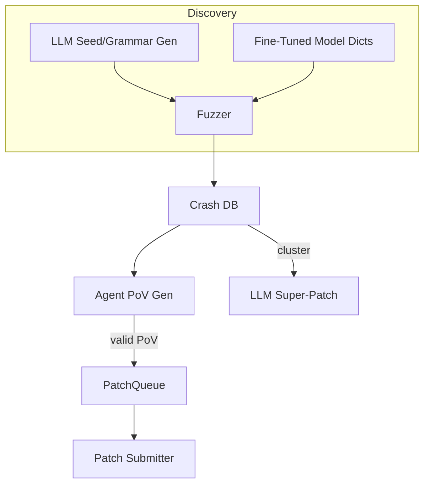

# Fuzzing wspomagany przez AI i automatyczne wykrywanie podatności

{{#include ../banners/hacktricks-training.md}}

## Overview
Large-language models (LLM) mogą znacznie usprawnić tradycyjne pipeline'y badania podatności, generując semantycznie bogate dane wejściowe, rozwijając gramatyki, analizując dane o crashach, a nawet proponując poprawki obejmujące wiele bugów. Ta strona zbiera najskuteczniejsze wzorce zaobserwowane podczas finałów DARPA AI Cyber Challenge (AIxCC) oraz w innych publicznych badaniach.<sup>[[4]](#references)[[5]](#references)</sup>

Poniższy opis nie dotyczy jednego konkretnego systemu konkursowego, lecz stanowi abstrakcję technik, dzięki której możesz odtworzyć je we własnych workflow.

---

## 1. Dane seed generowane przez LLM

Tradycyjne coverage-guided fuzzers (AFL++, libFuzzer, Honggfuzz…) zaczynają od niewielkiego corpus seedów i mutują bajty w sposób bezrefleksyjny. Gdy format danych wejściowych celu jest złożony (SQL, URL-e, niestandardowe binary protocols), losowe mutacje zwykle psują składnię, zanim zostaną osiągnięte interesujące branche.

LLM mogą rozwiązać ten problem inicjalizacji, generując *generatory seedów* – krótkie skrypty, które tworzą **poprawne składniowo, ale istotne z perspektywy security dane wejściowe**. Na przykład:
```prompt
SYSTEM: You are a helpful security engineer.
USER:
Write a Python3 program that prints 200 unique SQL injection strings targeting common anti-pattern mistakes (missing quotes, numeric context, stacked queries).  Ensure length ≤ 256 bytes / string so they survive common length limits.
```

```python
# gen_sqli_seeds.py (truncated)
PAYLOADS = [
"1 OR 1=1 -- ",
"' UNION SELECT NULL,NULL--",
"0; DROP TABLE users;--",
...
]
for p in PAYLOADS:
print(p)
```
Uruchom raz i przekaż dane wyjściowe bezpośrednio do początkowego korpusu fuzzera:
```bash
python3 gen_sqli_seeds.py > seeds.txt
afl-fuzz -i seeds.txt -o findings/ -- ./target @@
```
Benefits:
1. Semantic validity → głębsze coverage na wczesnym etapie.
2. Re-generatable: dostosuj prompt, aby skupić się na XSS, path traversal, binary blobs itp.
3. Tanie (< 1 ¢ z GPT-3.5).

### Tips
* Poleć modelowi *diversify* długość i encoding payloadów (UTF-8, URL-encoded, UTF-16-LE), aby omijać powierzchowne filtry.
* Poproś o *single self-contained script* – pozwala uniknąć problemów z formatowaniem JSON.

---

## 2. Grammar-Evolution Fuzzing

Potężniejszym wariantem jest pozwolenie LLM na **ewoluowanie gramatyki** zamiast konkretnych seeds. Workflow (wzorzec „Grammar Guy”) wygląda następująco:

1. Wygeneruj początkową gramatykę ANTLR/Peach/LibFuzzer za pomocą promptu.
2. Wykonuj fuzzing przez N minut i zbierz metryki coverage (trafione edges / blocks).
3. Podsumuj niepokryte obszary programu i przekaż podsumowanie z powrotem do modelu:
```prompt
The previous grammar triggered 12 % of the program edges.  Functions not reached: parse_auth, handle_upload.  Add / modify rules to cover these.
```
4. Połącz nowe reguły, ponownie wykonaj fuzzing i powtarzaj.

Szkielet pseudokodu:
```python
for epoch in range(MAX_EPOCHS):
grammar = llm.refine(grammar, feedback=coverage_stats)
save(grammar, f"grammar_{epoch}.txt")
coverage_stats = run_fuzzer(grammar)
```
Najważniejsze punkty:
* Trzymaj się *budżetu* – każde udoskonalenie zużywa tokeny.
* Używaj instrukcji `diff` + `patch`, aby model edytował kod zamiast przepisywać go od nowa.
* Zatrzymaj się, gdy Δcoverage < ε.

---

## 3. Generowanie PoV (Exploit) oparte na agentach

Po znalezieniu crasha nadal potrzebujesz **proof-of-vulnerability (PoV)**, który deterministycznie go wywoła.

Skalowalne podejście polega na uruchomieniu *tysięcy* lekkich agentów (<process/thread/container/prisoner>), z których każdy korzysta z innego LLM (GPT-4, Claude, Mixtral) lub innego ustawienia temperatury.

Pipeline:
1. Analiza statyczna/dynamiczna generuje *kandydatów na błędy* (struct z adresem crash PC, wycinkiem inputu i komunikatem sanitizera).
2. Orkiestrator rozdziela kandydatów między agentów.
3. Kroki rozumowania agenta:
a. Odtwórz błąd lokalnie za pomocą `gdb` + inputu.
b. Zaproponuj minimalny exploit payload.
c. Zweryfikuj exploit w sandboxie. Jeśli się powiedzie → prześlij.
4. Nieudane próby są **ponownie kolejkowane jako nowe seedy** do fuzzingu coverage (pętla sprzężenia zwrotnego).

Zalety:
* Równoległość maskuje zawodność pojedynczego agenta.
* Automatyczne dostrajanie temperatury / rozmiaru modelu na podstawie obserwowanego współczynnika skuteczności.

---

## 4. Directed Fuzzing z dostrojonymi modelami kodu

Dostrój model open-weight (np. Llama-7B) na kodzie źródłowym C/C++ oznaczonym wzorcami podatności (integer overflow, buffer copy, format string). Następnie:

1. Uruchom analizę statyczną, aby uzyskać listę funkcji + AST.
2. Przekaż modelowi prompt: *“Give mutation dictionary entries that are likely to break memory safety in function X”*.
3. Wstaw te tokeny do niestandardowego `AFL_CUSTOM_MUTATOR`.

Przykładowy wynik dla wrappera `sprintf`:
```
{"pattern":"%99999999s"}
{"pattern":"AAAAAAAA....<1024>....%n"}
```
Empirycznie skraca to time-to-crash ponad 2× na rzeczywistych celach.

---

## 5. Strategie patchowania sterowanego przez AI

### 5.1 Super Patches
Poproś model o *klastrowanie* crash signatures i zaproponowanie **pojedynczego patcha**, który usuwa wspólną przyczynę źródłową. Prześlij go raz, napraw kilka bugów → mniej kar za accuracy w środowiskach, w których każdy błędny patch kosztuje punkty.

Zarys promptu:
```
Here are 10 stack traces + file snippets.  Identify the shared mistake and generate a unified diff fixing all occurrences.
```
### 5.2 Współczynnik poprawek spekulatywnych
Zaimplementuj kolejkę, w której potwierdzone poprawki zwalidowane przez PoV oraz poprawki *spekulatywne* (bez PoV) są przeplatane w proporcji 1:​N dostosowanej do zasad punktacji (np. 2 spekulatywne : 1 potwierdzona). Model kosztów monitoruje kary względem punktów i automatycznie dostosowuje N.

---

## 6. Deterministyczny przegląd kodu AI plik po pliku

Częstym trybem niepowodzenia podczas przeglądu wspomaganego przez AI jest poproszenie jednego agenta o przeanalizowanie całego repozytorium i nadzieja, że wybierze właściwe pliki oraz odpowiednie terminy grep. Bardziej niezawodnym wzorcem jest **wymuszenie pokrycia repozytorium**:<sup>[[1]](#references)</sup>

1. Wylicz pliki źródłowe.
2. Wysyłaj **po jednym pliku naraz** oraz minimalny kontekst (entrypoint, importy, pobliskie routes/callers).
3. Wymagaj **ustrukturyzowanego raportu** dla każdego pliku: sources, sink, brakująca walidacja, warunki wstępne exploita oraz poziom pewności.<sup>[[3]](#references)</sup>
4. Usuwaj duplikaty raportów według wzorca **source→sink** i ręcznie weryfikuj te obarczone wysokim ryzykiem.

Ta metoda zużywa dużo tokenów i generuje szum, ale jest bardzo skuteczna w wykrywaniu **prostych, wysoko wpływowych błędów source/sink**, które często umykają szerokim przeglądom agentic.

### Wzorce triage warte priorytetyzacji

- **Dynamiczne dołączanie/dispatch w PHP**: kontrolowane przez attackera nazwy route/controller/module przepływające do `require_once()`, `include()` lub `include_once()` bez ścisłego allowlistingu i kanonikalizacji ścieżki.
- **Wykonywanie poleceń powłoki w workflows administratora/konta**: usernames, domains, konta FTP lub inne identyfikatory trafiające do `exec()`, `system()`, `shell_exec()`, `passthru()`, `proc_open()` lub `popen()`.
- **Fan-in structured input**: ten sam parametr akceptowany z `$_GET`, `$_POST`, JSON, XML lub parserów body frameworka, a następnie ponownie używany w sinkach systemu plików lub poleceń systemu operacyjnego.

### Dwie praktyczne klasy błędów, które ta metoda dobrze wykrywa

- **LFI/RCE w PHP controller-dispatch**: jeśli kontrolowana przez request nazwa controllera jest konkatenowana z `require_once()` bez allowlisty/normalizacji ścieżki, sekwencje traversal, takie jak `../`, mogą sprawić, że PHP dołączy niezamierzony lokalny plik `.php`. Jeśli attacker może wskazać dołączany plik, który został umieszczony na serwerze lub jest w inny sposób użyteczny, LFI przechodzi w code execution. Zobacz [File Inclusion / Path Traversal](../pentesting-web/file-inclusion/README.md).<sup>[[1]](#references)</sup>
- **Authenticated command injection w panelach hostingowych/administracyjnych**: jeśli pola zarządzania kontem, takie jak usernames, są osadzane w poleceniach powłoki, uwierzytelniony użytkownik o niskich uprawnieniach może przekształcić zwykłą operację create/delete w RCE. Wpływ rośnie, gdy panel wykonuje polecenie jako uprzywilejowane konto usługowe. Zobacz [Command Injection](../pentesting-web/command-injection.md).<sup>[[1]](#references)</sup>

### Praktyczne uwagi dotyczące przeglądu

- Najpierw używaj LLM jako **reviewera source/sink**, a nie generatora exploitów.
- Poproś go o jawne wymienienie **pola kontrolowanego przez attackera**, **luki w normalizacji/walidacji** oraz **niebezpiecznego sinka**.
- W przypadku dużych repozytoriów deterministyczny przegląd plik po pliku jest często bardziej niezawodny niż pojedyncze autonomiczne uruchomienie agenta, nawet jeśli to drugie korzysta z silniejszego modelu.<sup>[[2]](#references)</sup>
- Oczekuj słabszych wyników w przypadku **Broken Access Control** i innych błędów logiki biznesowej, w których exploitatability zależy od założeń obejmujących wiele plików, semantyki ról lub threat modelów właściwych dla danego produktu.

---

## Połączenie wszystkiego
Kompletny CRS (Cyber Reasoning System) może połączyć komponenty w następujący sposób:

```mermaid
graph TD
subgraph Discovery
A[LLM Seed/Grammar Gen] --> B[Fuzzer]
C[Fine-Tuned Model Dicts] --> B
end
B --> D[Crash DB]
D --> E[Agent PoV Gen]
E -->|valid PoV| PatchQueue
D -->|cluster| F[LLM Super-Patch]
PatchQueue --> G[Patch Submitter]
```
---

## Odnośniki

- [1] [Project Black - Local AI for Cyber Security: Finding phpIPAM LFI and myVesta Authenticated RCE](https://projectblack.io/blog/local-ai-for-cyber-security)
- [2] [Strix](https://github.com/usestrix/strix)
- [3] [GitHub Copilot community security-review skill](https://github.com/github/awesome-copilot/blob/main/skills/security-review/SKILL.md)
- [4] [Trail of Bits – AIxCC finals: Tale of the tape](https://blog.trailofbits.com/2025/08/07/aixcc-finals-tale-of-the-tape/)
- [5] [CTF Radiooo AIxCC finalist interviews](https://www.youtube.com/@ctfradiooo)

{{#include ../banners/hacktricks-training.md}}
