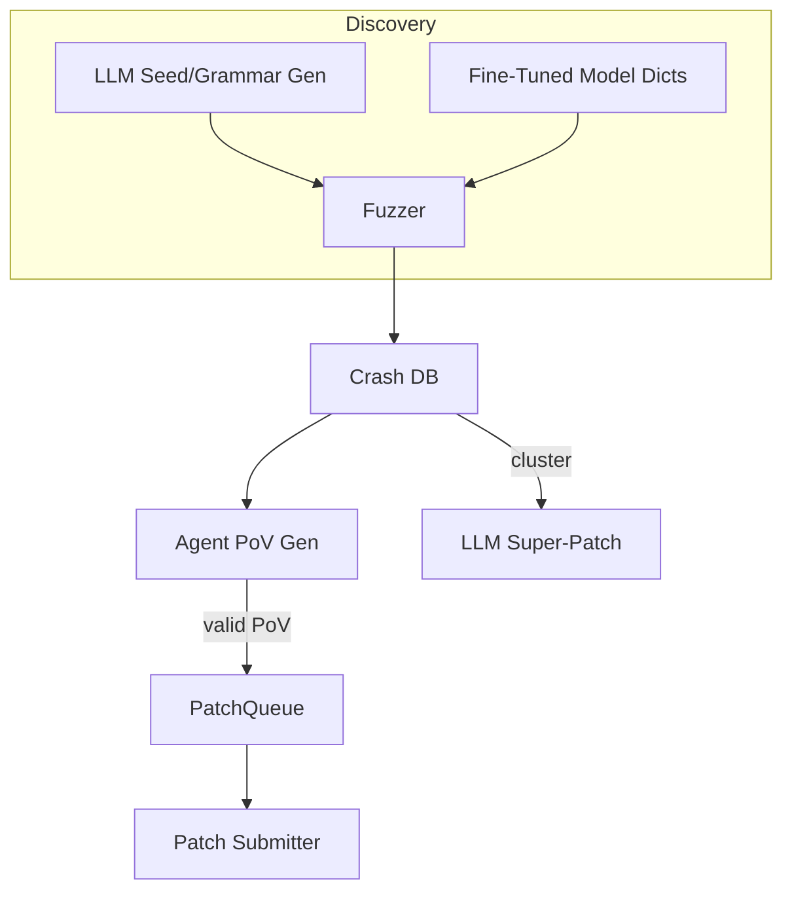

# AI-Assisted Fuzzing 및 Automated Vulnerability Discovery

{{#include ../banners/hacktricks-training.md}}

## 개요
대규모 언어 모델(LLM)은 의미가 풍부한 입력을 생성하고, grammar를 발전시키며, crash 데이터를 추론하고, 여러 버그에 대한 패치까지 제안함으로써 기존 vulnerability-research pipeline을 크게 강화할 수 있습니다. 이 페이지에서는 DARPA의 AI Cyber Challenge(AIxCC) finals 및 기타 공개 research에서 관찰된 가장 효과적인 패턴을 정리합니다.<sup>[[4]](#references)[[5]](#references)</sup>

다음 내용은 특정 competition system 하나를 설명하는 것이 아니라, 자체 workflow에서 재현할 수 있도록 해당 technique들을 추상화한 것입니다.

---

## 1. LLM-Generated Seed Inputs

기존의 coverage-guided fuzzer(AFL++, libFuzzer, Honggfuzz…)는 소규모 seed corpus에서 시작해 byte를 무작위로 mutation합니다. Target input format이 복잡한 경우(SQL, URL, custom binary protocol), random mutation은 일반적으로 흥미로운 branch에 도달하기 전에 syntax를 손상시킵니다.

LLM은 *seed generator*를 출력해 이 bootstrap 문제를 해결할 수 있습니다. seed generator는 **syntax는 올바르면서도 security와 관련된 input**을 출력하는 짧은 script입니다. 예를 들면 다음과 같습니다.
```prompt
SYSTEM: You are a helpful security engineer.
USER:
Write a Python3 program that prints 200 unique SQL injection strings targeting common anti-pattern mistakes (missing quotes, numeric context, stacked queries).  Ensure length ≤ 256 bytes / string so they survive common length limits.
```

```python
# gen_sqli_seeds.py (truncated)
PAYLOADS = [
"1 OR 1=1 -- ",
"' UNION SELECT NULL,NULL--",
"0; DROP TABLE users;--",
...
]
for p in PAYLOADS:
print(p)
```
한 번 실행하고 출력을 fuzzer의 초기 corpus에 직접 입력합니다:
```bash
python3 gen_sqli_seeds.py > seeds.txt
afl-fuzz -i seeds.txt -o findings/ -- ./target @@
```
Benefits:
1. Semantic validity → 초기 단계에서 더 깊은 coverage.
2. Re-generatable: prompt를 조정해 XSS, path traversal, binary blobs 등에 집중할 수 있음.
3. 저렴함 (GPT-3.5 사용 시 1 ¢ 미만).

### Tips
* 피상적인 필터를 우회할 수 있도록 payload 길이와 encoding (UTF-8, URL-encoded, UTF-16-LE)을 *다양화*하도록 model에 지시합니다.
* *단일 self-contained script*를 요청하세요 – JSON formatting 문제를 방지할 수 있습니다.

---

## 2. Grammar-Evolution Fuzzing

더 강력한 variant는 LLM이 구체적인 seeds 대신 **grammar를 evolve**하도록 하는 것입니다. workflow (“Grammar Guy” pattern)는 다음과 같습니다.

1. prompt를 통해 초기 ANTLR/Peach/LibFuzzer grammar를 생성합니다.
2. N분 동안 fuzz하고 coverage metrics (도달한 edges / blocks)를 수집합니다.
3. 도달하지 못한 program 영역을 요약하고 해당 요약을 model에 다시 전달합니다.
```prompt
The previous grammar triggered 12 % of the program edges.  Functions not reached: parse_auth, handle_upload.  Add / modify rules to cover these.
```
4. 새로운 rules를 merge하고 다시 fuzz한 뒤 반복합니다.

Pseudo-code skeleton:
```python
for epoch in range(MAX_EPOCHS):
grammar = llm.refine(grammar, feedback=coverage_stats)
save(grammar, f"grammar_{epoch}.txt")
coverage_stats = run_fuzzer(grammar)
```
핵심 사항:
* *budget*을 유지할 것 – 각 refinement에는 tokens가 사용됩니다.
* 모델이 다시 작성하지 않고 편집하도록 `diff` + `patch` instruction을 사용할 것.
* Δcoverage < ε이면 중지할 것.

---

## 3. Agent-Based PoV (Exploit) Generation

crash를 찾은 후에도 이를 deterministic하게 trigger하는 **proof-of-vulnerability (PoV)**가 필요합니다.

확장 가능한 접근 방식은 각각 다른 LLM(GPT-4, Claude, Mixtral) 또는 temperature setting을 사용하는 수천 개의 lightweight agent(<process/thread/container/prisoner>)를 생성하는 것입니다.

Pipeline:
1. Static/ dynamic analysis가 *bug candidates*(crash PC, input slice, sanitizer msg가 포함된 struct)를 생성합니다.
2. Orchestrator가 candidates를 agents에 분배합니다.
3. Agent reasoning steps:
a. `gdb` + input을 사용해 로컬에서 bug를 재현합니다.
b. 최소 exploit payload를 제안합니다.
c. Sandbox에서 exploit을 검증합니다. 성공하면 → submit합니다.
4. 실패한 시도는 coverage fuzzing을 위한 새로운 seeds로 **re-queue**됩니다(feedback loop).

Advantages:
* Parallelisation을 통해 단일 agent의 unreliability를 보완합니다.
* 관찰된 success-rate에 따라 temp / model size를 자동으로 조정합니다.

---

## 4. Directed Fuzzing with Fine-Tuned Code Models

vulnerability pattern(integer overflow, buffer copy, format string)이 label된 C/C++ source로 open-weight model(예: Llama-7B)을 fine-tune합니다. 그런 다음:

1. Static analysis를 실행해 function list + AST를 가져옵니다.
2. Model에 prompt를 전달합니다: *“function X에서 memory safety를 손상시킬 가능성이 높은 mutation dictionary entry를 제시하라”*.
3. 해당 token을 custom `AFL_CUSTOM_MUTATOR`에 삽입합니다.

`sprintf` wrapper의 example output:
```
{"pattern":"%99999999s"}
{"pattern":"AAAAAAAA....<1024>....%n"}
```
실제 targets에서 경험적으로 crash까지 걸리는 시간을 2배 이상 단축합니다.

---

## 5. AI-Guided Patching Strategies

### 5.1 Super Patches
모델에 crash signature를 *cluster*하고 공통 root cause를 제거하는 **single patch**를 제안하도록 요청합니다. 한 번 제출하여 여러 bug를 수정하면, 잘못된 patch마다 점수가 차감되는 환경에서 accuracy penalty를 줄일 수 있습니다.

Prompt outline:
```
Here are 10 stack traces + file snippets.  Identify the shared mistake and generate a unified diff fixing all occurrences.
```
### 5.2 Speculative Patch Ratio
확인된 PoV-validated patch와 *speculative* patch(PoV 없음)를 scoring rules에 맞춰 조정한 1:​N 비율(예: speculative 2개 : confirmed 1개)로 교차 배치하는 queue를 구현합니다. cost model은 penalties와 points를 모니터링하고 N을 자동으로 조정합니다.

---

## 6. Deterministic File-by-File AI Code Review

AI-assisted review에서 자주 발생하는 failure mode는 하나의 agent에게 전체 repository를 검사하도록 요청한 뒤, 올바른 파일과 grep terms를 선택하기를 기대하는 것입니다. 더 안정적인 pattern은 **repository coverage를 강제하는 것**입니다:<sup>[[1]](#references)</sup>

1. 소스 파일을 열거합니다.
2. 최소한의 context(entrypoint, imports, 인접한 routes/callers)와 함께 **한 번에 하나의 파일**을 전송합니다.
3. 각 파일에 대해 sources, sink, 누락된 validation, exploit preconditions, confidence를 포함한 **structured report**를 요구합니다.<sup>[[3]](#references)</sup>
4. **source→sink pattern**을 기준으로 reports의 중복을 제거하고, high-risk 항목을 수동으로 검증합니다.

이 방식은 token을 많이 사용하고 noisy하지만, 광범위한 agentic review에서 자주 놓치는 **단순하면서도 영향이 큰 source/sink bug**를 발견하는 데 매우 효과적입니다.

### 우선순위를 지정할 가치가 있는 Triage patterns

- **Dynamic PHP include/dispatch**: attacker-controlled route/controller/module name이 엄격한 allowlisting과 path canonicalisation 없이 `require_once()`, `include()`, 또는 `include_once()`로 전달되는 경우.
- **admin/account workflow의 Shell execution**: usernames, domains, FTP accounts 또는 기타 identifiers가 `exec()`, `system()`, `shell_exec()`, `passthru()`, `proc_open()`, 또는 `popen()`에 도달하는 경우.
- **Structured input fan-in**: 동일한 parameter가 `$_GET`, `$_POST`, JSON, XML 또는 framework body parser에서 허용된 후 filesystem 또는 OS-command sink에서 재사용되는 경우.

### 이 방법으로 잘 발견할 수 있는 두 가지 실용적인 bug class

- **PHP controller-dispatch LFI/RCE**: request-controlled controller name이 allowlist/path normalisation 없이 `require_once()`에 연결되면 `../`와 같은 traversal sequence를 통해 PHP가 의도하지 않은 local `.php` file을 include하도록 만들 수 있습니다. 공격자가 include 대상을 planted 또는 그 외에 유용한 PHP file로 지정할 수 있다면 LFI는 code execution으로 이어집니다. [File Inclusion / Path Traversal](../pentesting-web/file-inclusion/README.md)을 참조하세요.<sup>[[1]](#references)</sup>
- **hosting/admin panel의 Authenticated command injection**: usernames와 같은 account-management field가 shell command에 삽입되면, 낮은 권한의 authenticated user가 일반적인 create/delete action을 RCE로 전환할 수 있습니다. panel이 더 높은 권한의 service account로 command를 실행할 경우 impact가 증가합니다. [Command Injection](../pentesting-web/command-injection.md)을 참조하세요.<sup>[[1]](#references)</sup>

### Practical review notes

- LLM을 **exploit generator가 아닌 source/sink reviewer로 먼저** 사용합니다.
- LLM에게 **attacker-controlled field**, **normalization/validation gap**, **dangerous sink**를 명시적으로 나열하도록 요청합니다.
- 대규모 repo에서는 더 강력한 model을 사용하더라도, 하나의 autonomous agent run보다 deterministic per-file review가 더 안정적인 경우가 많습니다.<sup>[[2]](#references)</sup>
- **Broken Access Control** 및 exploitability가 cross-file assumptions, role semantics 또는 product-specific threat model에 좌우되는 기타 business-logic bug에서는 결과가 약할 수 있음을 예상해야 합니다.

---

## 모두 통합하기
End-to-end CRS (Cyber Reasoning System)는 다음과 같이 component를 연결할 수 있습니다:

```mermaid
graph TD
subgraph Discovery
A[LLM Seed/Grammar Gen] --> B[Fuzzer]
C[Fine-Tuned Model Dicts] --> B
end
B --> D[Crash DB]
D --> E[Agent PoV Gen]
E -->|valid PoV| PatchQueue
D -->|cluster| F[LLM Super-Patch]
PatchQueue --> G[Patch Submitter]
```
---

## 참고 문헌

- [1] [Project Black - Cyber Security를 위한 Local AI: phpIPAM LFI 및 myVesta Authenticated RCE 발견](https://projectblack.io/blog/local-ai-for-cyber-security)
- [2] [Strix](https://github.com/usestrix/strix)
- [3] [GitHub Copilot community security-review skill](https://github.com/github/awesome-copilot/blob/main/skills/security-review/SKILL.md)
- [4] [Trail of Bits – AIxCC finals: 테이프 이야기](https://blog.trailofbits.com/2025/08/07/aixcc-finals-tale-of-the-tape/)
- [5] [CTF Radiooo AIxCC finalist interviews](https://www.youtube.com/@ctfradiooo)

{{#include ../banners/hacktricks-training.md}}
