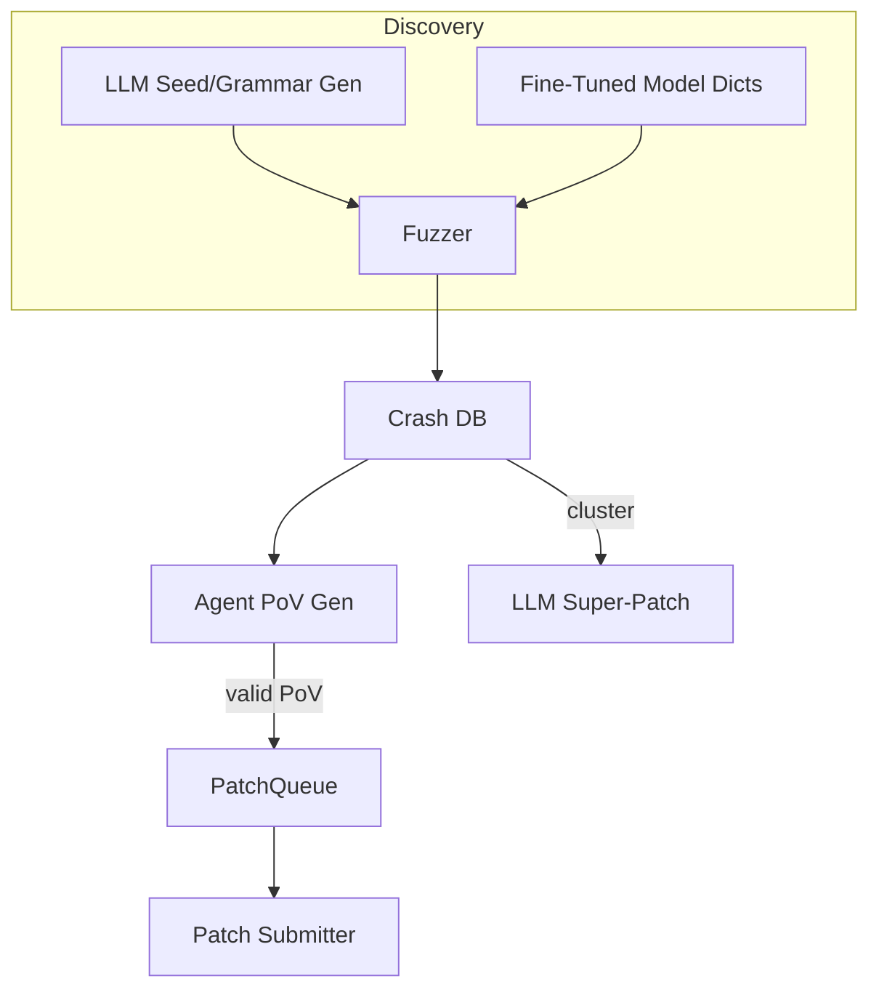

# Fuzzing asistido por IA y descubrimiento automatizado de vulnerabilidades

{{#include ../banners/hacktricks-training.md}}

## Descripción general
Los modelos de lenguaje de gran escala (LLM) pueden potenciar enormemente los pipelines tradicionales de investigación de vulnerabilidades al generar entradas semánticamente ricas, evolucionar gramáticas, razonar sobre datos de crashes e incluso proponer parches para múltiples bugs. Esta página recopila los patrones más eficaces observados durante la fase final del AI Cyber Challenge (AIxCC) de DARPA y en otras investigaciones públicas.<sup>[[4]](#references)</sup><sup>[[5]](#references)</sup>

Lo que sigue no es una descripción de un sistema específico de una competición, sino una abstracción de las técnicas para que puedas reproducirlas en tus propios flujos de trabajo.

---

## 1. Entradas seed generadas por LLM

Los fuzzers tradicionales guiados por cobertura (AFL++, libFuzzer, Honggfuzz…) comienzan con un corpus pequeño de seeds y mutan bytes a ciegas. Cuando el formato de entrada objetivo es complejo (SQL, URLs, protocolos binarios personalizados), las mutaciones aleatorias suelen romper la sintaxis antes de alcanzar ramas interesantes.

Los LLM pueden resolver este problema inicial generando *seed generators*: scripts cortos que producen **entradas sintácticamente correctas pero relevantes para la seguridad**. Por ejemplo:
```prompt
SYSTEM: You are a helpful security engineer.
USER:
Write a Python3 program that prints 200 unique SQL injection strings targeting common anti-pattern mistakes (missing quotes, numeric context, stacked queries).  Ensure length ≤ 256 bytes / string so they survive common length limits.
```

```python
# gen_sqli_seeds.py (truncated)
PAYLOADS = [
"1 OR 1=1 -- ",
"' UNION SELECT NULL,NULL--",
"0; DROP TABLE users;--",
...
]
for p in PAYLOADS:
print(p)
```
Ejecuta una vez y proporciona el resultado directamente al corpus inicial del fuzzer:
```bash
python3 gen_sqli_seeds.py > seeds.txt
afl-fuzz -i seeds.txt -o findings/ -- ./target @@
```
Beneficios:
1. Validez semántica → mayor cobertura desde el principio.
2. Regenerable: ajusta el prompt para enfocarlo en XSS, path traversal, binary blobs, etc.
3. Económico (< 1 ¢ con GPT-3.5).

### Consejos
* Indica al modelo que *diversifique* la longitud y la codificación de los payloads (UTF-8, URL-encoded, UTF-16-LE) para evadir filtros superficiales.
* Pide un *single self-contained script* – evita problemas con el formato JSON.

---

## 2. Grammar-Evolution Fuzzing

Una variante más potente consiste en permitir que el LLM **evolucione una gramática** en lugar de seeds concretos. El flujo de trabajo (patrón “Grammar Guy”) es:

1. Generar una gramática inicial de ANTLR/Peach/LibFuzzer mediante un prompt.
2. Ejecutar fuzzing durante N minutos y recopilar métricas de cobertura (edges / blocks hit).
3. Resumir las áreas del programa no cubiertas y enviar el resumen de vuelta al modelo:
```prompt
The previous grammar triggered 12 % of the program edges.  Functions not reached: parse_auth, handle_upload.  Add / modify rules to cover these.
```
4. Combinar las nuevas reglas, volver a ejecutar fuzzing y repetir.

Esqueleto de pseudocódigo:
```python
for epoch in range(MAX_EPOCHS):
grammar = llm.refine(grammar, feedback=coverage_stats)
save(grammar, f"grammar_{epoch}.txt")
coverage_stats = run_fuzzer(grammar)
```
Puntos clave:
* Mantén un *budget*: cada refinamiento utiliza tokens.
* Usa instrucciones `diff` + `patch` para que el modelo edite en lugar de reescribir.
* Detente cuando Δcoverage < ε.

---

## 3. Ingeniería de Harnesses de libFuzzer con LLM local

Para el código fuente que no puede salir de la estación de trabajo del analista, un modelo de código local puede redactar el pequeño adaptador entre los bytes del fuzzer y una API de C/C++. El límite de seguridad útil es explícito: **el modelo escribe y revisa la infraestructura de pruebas; la mutación guiada por coverage explora las entradas; los sanitizers informan de las operaciones no válidas; una persona revisa el harness y clasifica los hallazgos**.<sup>[[9]](#references)</sup>

Para consultar técnicas de corpus, feedback, snapshot y stateful-fuzzing a nivel de engine que no dependen de un LLM, consulta la [Fuzzing Methodology](../generic-methodologies-and-resources/fuzzing.md) general.

Comienza con la declaración exacta copiada del header objetivo y limita el formato de salida. Un prompt específico reduce las APIs inventadas y facilita la revisión del resultado:<sup>[[8]](#references)[[9]](#references)</sup>
```prompt
Write a libFuzzer target for this exact declaration:
int parse_records(const uint8_t *data, size_t size);

Output only C code. Implement LLVMFuzzerTestOneInput, include the
declaration, pass data and size unchanged, and do not use files,
network access, randomness, clocks, threads, or persistent state.
```
Para un parser de bytes sin procesar, el resultado esperado no debería ser más complicado que:<sup>[[6]](#references)[[9]](#references)</sup>
```c
#include <stddef.h>
#include <stdint.h>

extern int parse_records(const uint8_t *, size_t);

int LLVMFuzzerTestOneInput(const uint8_t *data, size_t size) {
(void)parse_records(data, size);
return 0;
}
```
La compilación es solo la primera barrera de validación. Revisa cada target generado según estos invariantes antes de invertir tiempo de CPU en él:<sup>[[6]](#references)[[8]](#references)[[9]](#references)</sup>

- **API exacta:** compara los tipos, las reglas de ownership, la inicialización, el teardown y la calling convention con el header real y los callers existentes.
- **Seguridad del harness:** protege cada lectura desde `data`; los hallazgos del sanitizer deben originarse en el target, no en el glue generado.
- **Repetibilidad:** haz que el resultado sea una función de `data` y `size`; elimina la I/O externa, el tiempo, la aleatoriedad no controlada, los threads no unidos y el estado que persista entre llamadas.
- **Throughput:** inicializa el estado inmutable costoso una sola vez únicamente cuando esto no pueda afectar al comportamiento, limita el tamaño de entrada, suprime el logging y libera las allocaciones por entrada.
- **Reachability:** verifica que se ejecuten las funciones y ramas previstas. Un target que compila pero solo ejercita rutas de rechazo es un fallo silencioso.

### Targets conscientes de la estructura: conserva los invariantes sin ocultar bugs

Si la mayoría de las entradas sin procesar fallan una comprobación de magic, longitud, versión o checksum, usa los bytes del fuzz como **material de campos tipados** y reconstruye un objeto válido. Fija las constantes del formato, deja mutables los campos semánticos y los bytes del payload, y deriva los metadatos de integridad a partir del payload reconstruido. `FuzzedDataProvider` resulta útil para consumir valores tipados acotados, mientras que el adapter sigue siendo responsable de limitar cualquier allocación y conversión generadas.<sup>[[9]](#references)</sup>

<details>
<summary>Ejemplo de target C++ consciente de la estructura</summary>
```cpp
#include <fuzzer/FuzzedDataProvider.h>
#include <stddef.h>
#include <stdint.h>
#include <vector>

extern "C" int parse_message(const uint8_t *, size_t);

extern "C" int LLVMFuzzerTestOneInput(const uint8_t *data, size_t size) {
FuzzedDataProvider fdp(data, size);
uint8_t version = fdp.ConsumeIntegral<uint8_t>();
auto body = fdp.ConsumeRemainingBytes<uint8_t>();
if (body.size() > UINT16_MAX) body.resize(UINT16_MAX);
uint16_t len = static_cast<uint16_t>(body.size());
std::vector<uint8_t> msg = {0x8b, 'M', 'S', 'G', version,
static_cast<uint8_t>(len >> 8),
static_cast<uint8_t>(len)};
msg.insert(msg.end(), body.begin(), body.end());
(void)parse_message(msg.data(), msg.size());
return 0;
}
```
</details>

No uses un único target que repare la estructura para todas las preguntas. Mantén un target que derive longitudes/checksums para explorar estados válidos profundos, y otro que mantenga los metadatos **declarados** bajo el control del fuzzer, limitando únicamente las lecturas y asignaciones del propio harness. El segundo target conserva las superficies de ataque de longitudes no coincidentes y de integridad incorrecta que la reparación automática eliminaría de otro modo.<sup>[[9]](#references)</sup>

### Seeds, dictionaries, sanitizers y feedback de cobertura

Pide al modelo que genere un script que escriba seeds binarias en lugar de pedirle que imprima binario directamente. Usa como seeds objetos vacíos, mínimos, típicos y válidos en los límites; después extrae valores mágicos, tags, codificaciones de enum y palabras clave del parser para incluirlos en un dictionary revisado. libFuzzer acepta ese dictionary con `-dict=`, y conserva en el corpus las mutaciones que revelan nueva cobertura.<sup>[[6]](#references)[[9]](#references)</sup>
```text
magic="\x8bMSG"
version_min="\x00"
version_max="\xff"
config_tag="CONFIG"
```
Compila el mismo objetivo con instrumentación complementaria. ASan y UBSan pueden compartir un binario de fuzzing; utiliza una build independiente de MSan e instrumenta sus dependencias para evitar informes causados por código no instrumentado.<sup>[[6]](#references)[[9]](#references)</sup>
```bash
clang++ -g -O1 -fsanitize=fuzzer,address,undefined \
-fno-sanitize-recover=undefined target.cc harness.cc -o fuzz_target
./fuzz_target corpus -dict=msg.dict -max_len=65535

clang++ -g -O1 -fsanitize=fuzzer,memory \
target.cc harness.cc -o fuzz_target_msan
```
Trata la cobertura como el evaluador de cada revisión del modelo. En la salida de libFuzzer, un `cov`/`ft` early-flat y un corpus estático suelen indicar un framing incorrecto, un `early return` demasiado restrictivo o la llamada equivocada; un `exec/s` bajo apunta a una configuración costosa, I/O, asignaciones o estado filtrado. `NEW` solo demuestra que una función de cobertura cambió, no que se alcanzó el parser previsto.<sup>[[6]](#references)[[9]](#references)</sup>

Para obtener feedback a nivel de código fuente, crea un build con cobertura, ejecútale fuzzing y proporciona al modelo únicamente las funciones no cubiertas junto con sus condiciones de protección. Verifica el diff resultante del harness/seed/dictionary y vuelve a medir:<sup>[[7]](#references)[[8]](#references)[[9]](#references)</sup>
```bash
clang++ -g -O1 -fsanitize=fuzzer \
-fprofile-instr-generate -fcoverage-mapping target.cc harness.cc -o fuzz_cov
mkdir -p profiles
LLVM_PROFILE_FILE='profiles/%p.profraw' ./fuzz_cov -max_total_time=300 corpus
llvm-profdata merge -sparse profiles/*.profraw -o fuzz.profdata
llvm-cov report ./fuzz_cov -instr-profile=fuzz.profdata
llvm-cov show ./fuzz_cov -instr-profile=fuzz.profdata \
--show-branches=count --region-coverage-lt=1 target.cc
```
Por lo tanto, el loop escalable es **generate → compile/link → smoke-test under sanitizers → measure target coverage → provide the smallest relevant coverage/source context → revise → re-measure**. OSS-Fuzz-Gen aplica el mismo principio evaluando los targets generados según su compilabilidad, fallos en runtime, coverage y mejora de coverage respecto a los targets existentes, en lugar de aceptar código plausible sin más.<sup>[[7]](#references)[[8]](#references)</sup>

---

## 4. Generación de PoV (Exploit) basada en agentes

Después de encontrar un crash, todavía necesitas un **proof-of-vulnerability (PoV)** que lo active de forma determinista.

Un enfoque escalable consiste en iniciar muchos workers ligeros (procesos, threads o containers), cada uno utilizando un modelo o una configuración de sampling diferente. El estudio de los finalistas de AIxCC ofrece ejemplos concretos de escala: un equipo utilizó **miles de agentes concurrentes** para la generación de PoV con AI-first, mientras que otro orquestó **300–500 agentes de fuzzing** y reservó los LLM para el razonamiento semántico de mayor nivel.<sup>[[4]](#references)</sup>

Pipeline:
1. El análisis estático/dinámico produce *bug candidates* (struct con crash PC, input slice, mensaje del sanitizer).
2. El orchestrator distribuye los candidates entre los agentes.
3. Pasos de razonamiento del agente:
a. Reproducir el bug localmente con `gdb` + input.
b. Sugerir un payload de exploit mínimo.
c. Validar el exploit en un sandbox.  Si tiene éxito → submit.
4. Los intentos fallidos se **vuelven a poner en cola como nuevos seeds** para el coverage fuzzing (feedback loop).

Ventajas:
* La paralelización oculta la falta de fiabilidad de un solo agente.
* Auto-tuning del tamaño de temp/model basado en la tasa de éxito observada.

---

## 5. Directed Fuzzing con modelos de código Fine-Tuned

Haz fine-tune de un modelo open-weight (p. ej., Llama-7B) con source code C/C++ etiquetado con patrones de vulnerabilidad (integer overflow, buffer copy, format string). Después:

1. Ejecuta un análisis estático para obtener la lista de funciones + AST.
2. Haz prompt al modelo: *“Give mutation dictionary entries that are likely to break memory safety in function X”*.
3. Inserta esos tokens en un `AFL_CUSTOM_MUTATOR` personalizado.

Ejemplo de output para un wrapper de `sprintf`:
```
{"pattern":"%99999999s"}
{"pattern":"AAAAAAAA....<1024>....%n"}
```
Empíricamente, esto reduce el tiempo hasta el crash en más de 2× en objetivos reales.

---

## 6. Estrategias de Patching Guiadas por AI

### 6.1 Super Patches
Pide al modelo que *clusterice* las firmas de crash y proponga un **único patch** que elimine la causa raíz común. Envía una vez y corrige varios bugs → menos penalizaciones de precisión en entornos donde cada patch incorrecto cuesta puntos.

Esquema del prompt:
```
Here are 10 stack traces + file snippets.  Identify the shared mistake and generate a unified diff fixing all occurrences.
```
### 6.2 Ratio de Patches Especulativos
Implementa una cola donde los patches confirmados y validados mediante PoV y los patches *especulativos* (sin PoV) se intercalen en una proporción de 1:N ajustada a las reglas de puntuación (por ejemplo, 2 especulativos : 1 confirmado). Un modelo de costes monitoriza las penalizaciones frente a los puntos y ajusta N automáticamente.

---

## 7. Revisión Determinista de Código con AI Archivo por Archivo

Un modo frecuente de fallo en la revisión asistida por AI consiste en pedirle a un agente que inspeccione un repositorio completo y esperar que elija los archivos y términos de grep adecuados. Un patrón más fiable es **forzar la cobertura del repositorio**:<sup>[[1]](#references)</sup>

1. Enumera los archivos de código fuente.
2. Envía **un archivo cada vez** junto con el contexto mínimo (entrypoint, imports, rutas/caller cercanos).
3. Exige un **informe estructurado** para cada archivo: sources, sink, validación ausente, precondiciones de explotación y confianza.<sup>[[3]](#references)</sup>
4. Deduplica los informes por **patrón source→sink** y valida manualmente los de mayor riesgo.

Este proceso consume muchos tokens y genera ruido, pero es muy eficaz para detectar **bugs sencillos de source/sink con gran impacto** que las revisiones agentic amplias suelen pasar por alto.

### Patrones de triage que conviene priorizar

- **Dynamic PHP include/dispatch**: nombres de rutas/controllers/módulos controlados por el atacante que fluyen hacia `require_once()`, `include()` o `include_once()` sin una allowlist estricta ni path canonicalisation.
- **Ejecución de shell en flujos de administración/cuentas**: usernames, dominios, cuentas FTP u otros identificadores que llegan a `exec()`, `system()`, `shell_exec()`, `passthru()`, `proc_open()` o `popen()`.
- **Convergencia de entradas estructuradas**: el mismo parámetro aceptado desde `$_GET`, `$_POST`, JSON, XML o body parsers del framework y reutilizado posteriormente en sinks del filesystem o de comandos del sistema operativo.

### Dos clases prácticas de bugs que este método encuentra bien

- **PHP controller-dispatch LFI/RCE**: si el nombre del controller controlado por la request se concatena en `require_once()` sin allowlist ni normalización de rutas, secuencias de traversal como `../` pueden hacer que PHP incluya un archivo `.php` local no previsto. Si el atacante puede apuntar el include a un archivo PHP colocado por él o útil por cualquier otro motivo, la LFI se convierte en ejecución de código. Consulta [File Inclusion / Path Traversal](../pentesting-web/file-inclusion/README.md).<sup>[[1]](#references)</sup>
- **Command injection autenticada en paneles de hosting/administración**: si campos de gestión de cuentas, como los usernames, se insertan en comandos de shell, un usuario autenticado con pocos privilegios puede convertir una acción normal de creación/eliminación en RCE. El impacto aumenta cuando el panel ejecuta el comando como una cuenta de servicio con más privilegios. Consulta [Command Injection](../pentesting-web/command-injection.md).<sup>[[1]](#references)</sup>

### Notas prácticas de revisión

- Usa el LLM primero como **revisor de source/sink**, no como generador de exploits.
- Pídele que enumere explícitamente el **campo controlado por el atacante**, la **brecha de normalización/validación** y el **sink peligroso**.
- En repositorios grandes, la revisión determinista archivo por archivo suele ser más fiable que una única ejecución de un agente autónomo, incluso cuando esta utiliza un modelo más potente.<sup>[[2]](#references)</sup>
- Espera resultados más débiles en **Broken Access Control** y otros bugs de lógica de negocio cuya explotabilidad depende de supuestos entre archivos, semántica de roles o threat models específicos del producto.

---

## Uniendo Todas las Piezas
Un CRS (Cyber Reasoning System) end-to-end puede conectar los componentes de la siguiente forma:

```mermaid
graph TD
subgraph Discovery
A[LLM Seed/Grammar Gen] --> B[Fuzzer]
C[Fine-Tuned Model Dicts] --> B
end
B --> D[Crash DB]
D --> E[Agent PoV Gen]
E -->|valid PoV| PatchQueue
D -->|cluster| F[LLM Super-Patch]
PatchQueue --> G[Patch Submitter]
```
---

## References

- [1] [Project Black - IA local para Cyber Security: Encontrando LFI en phpIPAM y RCE autenticado en myVesta](https://projectblack.io/blog/local-ai-for-cyber-security)
- [2] [Strix](https://github.com/usestrix/strix)
- [3] [skill de revisión de seguridad de la comunidad de GitHub Copilot](https://github.com/github/awesome-copilot/blob/main/skills/security-review/SKILL.md)
- [4] [Trail of Bits – finales de AIxCC: La historia de la competición](https://blog.trailofbits.com/2025/08/07/aixcc-finals-tale-of-the-tape/)
- [5] [Entrevistas a los finalistas de AIxCC de CTF Radiooo](https://www.youtube.com/@ctfradiooo)
- [6] [LLVM — libFuzzer: una library para fuzz testing guiado por cobertura](https://llvm.org/docs/LibFuzzer.html)
- [7] [Google — OSS-Fuzz-Gen](https://github.com/google/oss-fuzz-gen)
- [8] [Google Online Security Blog — Mejorando el fuzzing: Encontrando más vulnerabilidades con AI](https://security.googleblog.com/2024/11/leveling-up-fuzzing-finding-more.html)
- [9] [8kSec — Generación asistida por AI de harnesses de fuzzing con un LLM local](https://8ksec.io/ai-assisted-fuzzing-harness-local-llm)
{{#include ../banners/hacktricks-training.md}}
