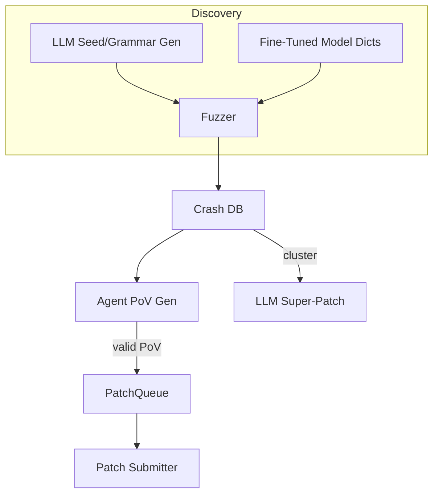

# AI 辅助 Fuzzing 与自动化漏洞发现

{{#include ../banners/hacktricks-training.md}}

## 概述
Large-language models（LLMs）可以通过生成语义丰富的输入、演进 grammar、分析 crash 数据，甚至提出多漏洞补丁，大幅增强传统的漏洞研究流程。此页面汇集了 DARPA 的 AI Cyber Challenge（AIxCC）决赛及其他公开研究中观察到的最有效模式。<sup>[[4]](#references)</sup><sup>[[5]](#references)</sup>

以下内容并非对某个特定竞赛系统的描述，而是对相关技术的抽象，因此你可以在自己的工作流中复现这些方法。

---

## 1. LLM 生成的 Seed Inputs

传统的 coverage–guided fuzzers（AFL++、libFuzzer、Honggfuzz……）从少量 seed corpus 开始，并盲目地对字节进行 mutation。当目标输入格式很复杂时（SQL、URLs、自定义 binary protocols），随机 mutation 通常会在到达有趣的分支之前破坏语法。

LLMs 可以通过生成 *seed generators*（用于输出 **语法正确但与安全相关的输入** 的简短脚本）来解决这一 bootstrap 问题。例如：
```prompt
SYSTEM: You are a helpful security engineer.
USER:
Write a Python3 program that prints 200 unique SQL injection strings targeting common anti-pattern mistakes (missing quotes, numeric context, stacked queries).  Ensure length ≤ 256 bytes / string so they survive common length limits.
```

```python
# gen_sqli_seeds.py (truncated)
PAYLOADS = [
"1 OR 1=1 -- ",
"' UNION SELECT NULL,NULL--",
"0; DROP TABLE users;--",
...
]
for p in PAYLOADS:
print(p)
```
运行一次，并将输出直接输入到 fuzzer 的初始语料库中：
```bash
python3 gen_sqli_seeds.py > seeds.txt
afl-fuzz -i seeds.txt -o findings/ -- ./target @@
```
Benefits:
1. 语义有效性 → 更早实现更深层的覆盖。
2. 可重新生成：调整 prompt，使其专注于 XSS、path traversal、binary blobs 等。
3. 成本低（使用 GPT-3.5 不到 1 美分）。

### Tips
* 指示模型对 payload 的长度和编码进行*多样化*（UTF-8、URL-encoded、UTF-16-LE），以绕过表层 filters。
* 要求生成一个*单一的自包含脚本*——避免 JSON 格式问题。

---

## 2. Grammar-Evolution Fuzzing

一种更强大的变体是让 LLM **演化 grammar**，而不是生成具体的 seeds。其工作流程（“Grammar Guy”模式）如下：

1. 通过 prompt 生成初始的 ANTLR/Peach/LibFuzzer grammar。
2. Fuzz N 分钟，并收集 coverage metrics（已命中的 edges / blocks）。
3. 总结未覆盖的 program 区域，并将总结反馈给模型：
```prompt
The previous grammar triggered 12 % of the program edges.  Functions not reached: parse_auth, handle_upload.  Add / modify rules to cover these.
```
4. 合并新 rules，重新进行 fuzz，循环重复。

Pseudo-code skeleton:
```python
for epoch in range(MAX_EPOCHS):
grammar = llm.refine(grammar, feedback=coverage_stats)
save(grammar, f"grammar_{epoch}.txt")
coverage_stats = run_fuzzer(grammar)
```
关键点：
* 保持 *budget* ——每次 refinement 都会消耗 tokens。
* 使用 `diff` + `patch` 指令，让模型进行编辑而不是重写。
* 当 Δcoverage < ε 时停止。

---

## 3. 基于 Agent 的 PoV（Exploit）生成

找到 crash 后，你仍然需要一个能够确定性触发该 crash 的 **proof-of-vulnerability（PoV）**。

一种可扩展的方法是启动许多轻量级 worker（进程、线程或容器），每个 worker 使用不同的模型或 sampling 配置。AIxCC finalist survey 给出了具体的规模示例：一个团队使用了 **数千个并发 agent** 来生成 AI-first PoV，另一个团队则编排了 **300–500 个 fuzzing agent**，并将 LLM 保留用于更高层次的语义推理。<sup>[[4]](#references)</sup>

Pipeline：
1. Static/ dynamic analysis 生成 *bug candidates*（包含 crash PC、input slice 和 sanitizer msg 的 struct）。
2. Orchestrator 将 candidates 分发给 agents。
3. Agent reasoning steps：
a. 使用 `gdb` + input 在本地复现 bug。
b. 提议最小 exploit payload。
c. 在 sandbox 中验证 exploit。如果成功 → submit。
4. 失败的尝试会作为新的 seeds **重新排队**，用于 coverage fuzzing（feedback loop）。

优势：
* Parallelisation 可以隐藏单个 agent 的不可靠性。
* 根据观察到的 success-rate 自动调节 temp / model size。

---

## 4. 使用 Fine-Tuned Code Models 进行 Directed Fuzzing

在带有 vulnerability patterns（integer overflow、buffer copy、format string）标注的 C/C++ 源代码上，对一个 open-weight model（例如 Llama-7B）进行 fine-tune。然后：

1. 运行 static analysis，获取 function list + AST。
2. 向模型发出提示：*“给出可能导致 function X 中 memory safety 被破坏的 mutation dictionary entries”*。
3. 将这些 tokens 插入自定义的 `AFL_CUSTOM_MUTATOR`。

以一个 `sprintf` wrapper 为例，输出如下：
```
{"pattern":"%99999999s"}
{"pattern":"AAAAAAAA....<1024>....%n"}
```
实测表明，在真实目标上，这能将 time-to-crash 缩短超过 2 倍。

---

## 5. AI-Guided Patching Strategies

### 5.1 Super Patches
要求模型对崩溃特征进行 *cluster*，并提出一个**单一 patch**，以移除共同根因。提交一次，修复多个 bug → 在每次错误 patch 都会扣分的环境中，可减少准确性惩罚。

Prompt outline：
```
Here are 10 stack traces + file snippets.  Identify the shared mistake and generate a unified diff fixing all occurrences.
```
### 5.2 Speculative Patch Ratio
实现一个队列，将已确认且通过 PoV 验证的 patches 与 *speculative* patches（无 PoV）按根据评分规则调整的 1:​N 比例交错排列（例如 2 个 speculative : 1 个 confirmed）。成本模型会监控 penalties 与 points，并自动调整 N。

---

## 6. Deterministic File-by-File AI Code Review

AI-assisted review 中一种常见的失败模式，是要求一个 agent 检查整个 repository，并希望它自行选择正确的文件和 grep terms。更可靠的模式是**强制覆盖 repository**：<sup>[[1]](#references)</sup>

1. 枚举 source files。
2. 一次发送**一个文件**，并附带最少的上下文（entrypoint、imports、附近的 routes/callers）。
3. 要求每个文件都生成一份**结构化报告**：sources、sink、缺失的 validation、exploit 前置条件以及 confidence。<sup>[[3]](#references)</sup>
4. 按 **source→sink pattern** 对报告去重，并手动验证高风险项。

这种方法消耗大量 tokens 且噪声较多，但对于发现广泛的 agentic reviews 经常遗漏的**简单高影响 source/sink bugs**非常有效。

### 值得优先处理的 Triage patterns

- **Dynamic PHP include/dispatch**：攻击者控制的 route/controller/module 名称流入 `require_once()`、`include()` 或 `include_once()`，且没有严格的 allowlisting 和 path canonicalisation。
- **Shell execution in admin/account workflows**：usernames、domains、FTP accounts 或其他 identifiers 到达 `exec()`、`system()`、`shell_exec()`、`passthru()`、`proc_open()` 或 `popen()`。
- **Structured input fan-in**：同一个 parameter 可从 `$_GET`、`$_POST`、JSON、XML 或 framework body parsers 接收，之后又被用于 filesystem 或 OS-command sinks。

### 此方法擅长发现的两类实际 bug

- **PHP controller-dispatch LFI/RCE**：如果 request-controlled controller name 被拼接进 `require_once()`，且没有 allowlist/path normalisation，`../` 等 traversal sequences 可能使 PHP include 非预期的本地 `.php` 文件。如果攻击者能够将 include 指向其植入的或其他有用的 PHP 文件，LFI 就会变成 code execution。参见 [File Inclusion / Path Traversal](../pentesting-web/file-inclusion/README.md)。<sup>[[1]](#references)</sup>
- **Authenticated command injection in hosting/admin panels**：如果 usernames 等 account-management fields 被嵌入 shell commands，低权限的 authenticated user 可能将正常的 create/delete action 转化为 RCE。当 panel 以权限更高的 service account 执行该 command 时，影响会进一步扩大。参见 [Command Injection](../pentesting-web/command-injection.md)。<sup>[[1]](#references)</sup>

### Practical review notes

- 首先将 LLM 用作 **source/sink reviewer**，而不是 exploit generator。
- 要求它明确列出**攻击者控制的 field**、**normalization/validation gap**以及**危险的 sink**。
- 对于大型 repos，即使后者使用更强的 model，确定性的逐文件 review 通常也比单次 autonomous agent run 更可靠。<sup>[[2]](#references)</sup>
- 对 **Broken Access Control** 以及其他 business-logic bugs 的结果应降低预期，因为其 exploitability 取决于跨文件 assumptions、role semantics 或产品特定的 threat models。

---

## 将所有部分整合起来
端到端的 CRS (Cyber Reasoning System) 可以按如下方式连接这些 components：

```mermaid
graph TD
subgraph Discovery
A[LLM Seed/Grammar Gen] --> B[Fuzzer]
C[Fine-Tuned Model Dicts] --> B
end
B --> D[Crash DB]
D --> E[Agent PoV Gen]
E -->|valid PoV| PatchQueue
D -->|cluster| F[LLM Super-Patch]
PatchQueue --> G[Patch Submitter]
```
---

## References

- [1] [Project Black - 用于 Cyber Security 的本地 AI：发现 phpIPAM LFI 和 myVesta Authenticated RCE](https://projectblack.io/blog/local-ai-for-cyber-security)
- [2] [Strix](https://github.com/usestrix/strix)
- [3] [GitHub Copilot 社区 security-review skill](https://github.com/github/awesome-copilot/blob/main/skills/security-review/SKILL.md)
- [4] [Trail of Bits – AIxCC 决赛：比赛实录](https://blog.trailofbits.com/2025/08/07/aixcc-finals-tale-of-the-tape/)
- [5] [CTF Radiooo AIxCC 决赛入围者访谈](https://www.youtube.com/@ctfradiooo)
{{#include ../banners/hacktricks-training.md}}
