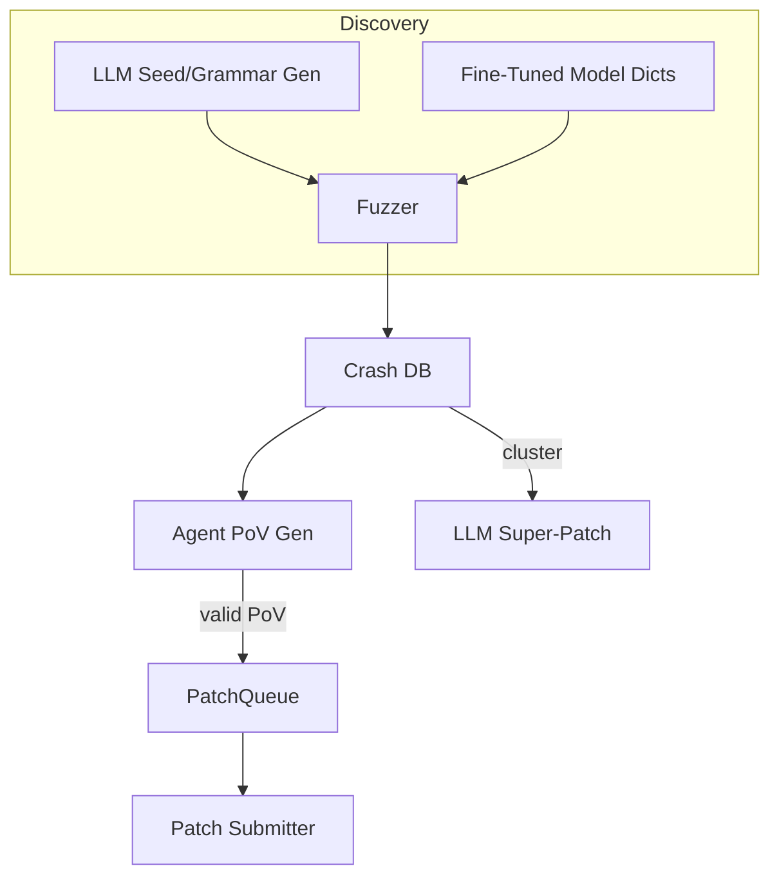

# Fuzzing με υποβοήθηση AI & Αυτοματοποιημένη ανακάλυψη ευπαθειών

{{#include ../banners/hacktricks-training.md}}

## Overview
Τα Large Language Models (LLMs) μπορούν να ενισχύσουν σημαντικά τα παραδοσιακά pipelines έρευνας ευπαθειών, δημιουργώντας semantically rich inputs, εξελίσσοντας grammars, αναλύοντας δεδομένα από crashes και προτείνοντας ακόμη και patches για πολλαπλά bugs. Αυτή η σελίδα συγκεντρώνει τα πιο αποτελεσματικά patterns που παρατηρήθηκαν στους τελικούς του DARPA AI Cyber Challenge (AIxCC) και σε άλλες δημόσιες έρευνες.<sup>[[4]](#references)</sup><sup>[[5]](#references)</sup>

Αυτό που ακολουθεί δεν αποτελεί περιγραφή ενός συγκεκριμένου competition system, αλλά μια αφαίρεση των τεχνικών, ώστε να μπορείτε να τις αναπαραγάγετε στα δικά σας workflows.

---

## 1. Seed Inputs που δημιουργούνται από LLM

Τα παραδοσιακά coverage–guided fuzzers (AFL++, libFuzzer, Honggfuzz…) ξεκινούν με ένα μικρό corpus από seeds και μεταλλάσσουν bytes χωρίς καμία κατανόηση. Όταν το target input format είναι σύνθετο (SQL, URLs, custom binary protocols), οι τυχαίες μεταλλάξεις συνήθως καταστρέφουν τη σύνταξη προτού επιτευχθούν ενδιαφέροντα branches.

Τα LLMs μπορούν να λύσουν αυτό το bootstrap problem παράγοντας *seed generators* – σύντομα scripts που εξάγουν **syntax-correct αλλά security-relevant inputs**. Για παράδειγμα:
```prompt
SYSTEM: You are a helpful security engineer.
USER:
Write a Python3 program that prints 200 unique SQL injection strings targeting common anti-pattern mistakes (missing quotes, numeric context, stacked queries).  Ensure length ≤ 256 bytes / string so they survive common length limits.
```

```python
# gen_sqli_seeds.py (truncated)
PAYLOADS = [
"1 OR 1=1 -- ",
"' UNION SELECT NULL,NULL--",
"0; DROP TABLE users;--",
...
]
for p in PAYLOADS:
print(p)
```
Εκτέλεσέ το μία φορά και τροφοδότησε την έξοδο απευθείας στο αρχικό corpus του fuzzer:
```bash
python3 gen_sqli_seeds.py > seeds.txt
afl-fuzz -i seeds.txt -o findings/ -- ./target @@
```
Benefits:
1. Semantic validity → deeper coverage early.
2. Re-generatable: προσαρμόστε το prompt ώστε να εστιάζει σε XSS, path traversal, binary blobs κ.λπ.
3. Cheap (< 1 ¢ with GPT-3.5).

### Συμβουλές
* Δώστε εντολή στο model να *διαφοροποιεί* το μήκος και την κωδικοποίηση των payloads (UTF-8, URL-encoded, UTF-16-LE), ώστε να παρακάμπτονται επιφανειακά φίλτρα.
* Ζητήστε ένα *single self-contained script* – αποφεύγει προβλήματα μορφοποίησης JSON.

---

## 2. Grammar-Evolution Fuzzing

Μια ισχυρότερη παραλλαγή είναι να αφήσετε το LLM να **εξελίξει μια grammar** αντί για συγκεκριμένα seeds. Η ροή εργασίας (μοτίβο “Grammar Guy”) είναι:

1. Δημιουργήστε μια αρχική grammar ANTLR/Peach/LibFuzzer μέσω prompt.
2. Εκτελέστε fuzzing για N λεπτά και συλλέξτε metrics κάλυψης (edges / blocks που ενεργοποιήθηκαν).
3. Συνοψίστε τις περιοχές του προγράμματος που δεν καλύφθηκαν και τροφοδοτήστε ξανά τη σύνοψη στο model:
```prompt
The previous grammar triggered 12 % of the program edges.  Functions not reached: parse_auth, handle_upload.  Add / modify rules to cover these.
```
4. Συγχωνεύστε τους νέους κανόνες, εκτελέστε ξανά fuzzing και επαναλάβετε.

Skeleton ψευδοκώδικα:
```python
for epoch in range(MAX_EPOCHS):
grammar = llm.refine(grammar, feedback=coverage_stats)
save(grammar, f"grammar_{epoch}.txt")
coverage_stats = run_fuzzer(grammar)
```
Βασικά σημεία:
* Κράτα ένα *budget* – κάθε refinement χρησιμοποιεί tokens.
* Χρησιμοποίησε οδηγίες `diff` + `patch`, ώστε το model να κάνει edits αντί για rewrites.
* Σταμάτα όταν Δcoverage < ε.

---

## 3. Δημιουργία PoV (Exploit) με Agents

Αφού εντοπιστεί ένα crash, χρειάζεσαι ακόμη ένα **proof-of-vulnerability (PoV)** που το ενεργοποιεί deterministically.

Μια scalable προσέγγιση είναι η εκκίνηση πολλών lightweight workers (processes, threads ή containers), όπου το καθένα χρησιμοποιεί διαφορετικό model ή sampling configuration. Η έρευνα finalist του AIxCC παρέχει συγκεκριμένα παραδείγματα κλίμακας: μία ομάδα χρησιμοποίησε **χιλιάδες concurrent agents** για AI-first PoV generation, ενώ μια άλλη ενορχήστρωσε **300–500 fuzzing agents** και κράτησε τα LLMs για reasoning υψηλότερου επιπέδου.<sup>[[4]](#references)</sup>

Pipeline:
1. Η static/ dynamic analysis παράγει *bug candidates* (struct με crash PC, input slice, sanitizer msg).
2. Ο orchestrator διανέμει τα candidates στους agents.
3. Βήματα reasoning του agent:
a. Κάνε reproduce το bug τοπικά με `gdb` + input.
b. Πρότεινε minimal exploit payload.
c. Κάνε validate το exploit σε sandbox.  Αν επιτύχει → κάνε submit.
4. Οι αποτυχημένες προσπάθειες γίνονται **re-queue ως νέα seeds** για coverage fuzzing (feedback loop).

Πλεονεκτήματα:
* Η Parallelisation αποκρύπτει την unreliability ενός single-agent.
* Auto-tuning των temp / model size βάσει του observed success-rate.

---

## 4. Directed Fuzzing με Fine-Tuned Code Models

Κάνε fine-tune ένα open-weight model (π.χ. Llama-7B) σε C/C++ source με labels vulnerability patterns (integer overflow, buffer copy, format string).  Στη συνέχεια:

1. Εκτέλεσε static analysis για να πάρεις function list + AST.
2. Κάνε prompt στο model: *“Give mutation dictionary entries that are likely to break memory safety in function X”*.
3. Εισήγαγε αυτά τα tokens σε ένα custom `AFL_CUSTOM_MUTATOR`.

Παράδειγμα output για ένα `sprintf` wrapper:
```
{"pattern":"%99999999s"}
{"pattern":"AAAAAAAA....<1024>....%n"}
```
Εμπειρικά, αυτό μειώνει τον χρόνο μέχρι το crash κατά >2× σε πραγματικούς στόχους.

---

## 5. Στρατηγικές Patching με Καθοδήγηση από AI

### 5.1 Super Patches
Ζητήστε από το model να κάνει *cluster* στα crash signatures και να προτείνει ένα **single patch** που εξαλείφει την κοινή root cause. Υποβάλετέ το μία φορά, διορθώστε αρκετά bugs → λιγότερα accuracy penalties σε περιβάλλοντα όπου κάθε λανθασμένο patch κοστίζει πόντους.

Περίγραμμα prompt:
```
Here are 10 stack traces + file snippets.  Identify the shared mistake and generate a unified diff fixing all occurrences.
```
### 5.2 Speculative Patch Ratio
Υλοποιήστε μια queue όπου τα επιβεβαιωμένα patches που έχουν επικυρωθεί μέσω PoV και τα *speculative* patches (χωρίς PoV) παρεμβάλλονται σε αναλογία 1:​N, ρυθμισμένη σύμφωνα με τους κανόνες scoring (π.χ. 2 speculative : 1 confirmed). Ένα cost model παρακολουθεί τα penalties σε σχέση με τους points και προσαρμόζει αυτόματα το N.

---

## 6. Deterministic File-by-File AI Code Review

Ένας συχνός τρόπος αποτυχίας στο AI-assisted review είναι να ζητείται από έναν agent να επιθεωρήσει ολόκληρο ένα repository, με την ελπίδα ότι θα επιλέξει τα σωστά files και τους σωστούς όρους grep. Ένα πιο αξιόπιστο pattern είναι να **επιβάλλεται κάλυψη του repository**:<sup>[[1]](#references)</sup>

1. Καταγράψτε τα source files.
2. Στείλτε **ένα file κάθε φορά** μαζί με ελάχιστο context (entrypoint, imports, nearby routes/callers).
3. Απαιτήστε ένα **structured report** για κάθε file: sources, sink, missing validation, exploit preconditions και confidence.<sup>[[3]](#references)</sup>
4. Αφαιρέστε τα διπλότυπα reports με βάση το **source→sink pattern** και επικυρώστε χειροκίνητα όσα έχουν υψηλό ρίσκο.

Αυτό απαιτεί πολλά tokens και παράγει θόρυβο, όμως είναι ιδιαίτερα αποτελεσματικό στην ανάδειξη **απλών bugs υψηλού αντίκτυπου μεταξύ source/sink**, τα οποία συχνά παραβλέπουν τα ευρύτερα agentic reviews.

### Triage patterns που αξίζει να prioritise

- **Dynamic PHP include/dispatch**: ονόματα route/controller/module που ελέγχονται από τον attacker και καταλήγουν σε `require_once()`, `include()` ή `include_once()` χωρίς αυστηρό allowlisting και path canonicalisation.
- **Shell execution σε admin/account workflows**: usernames, domains, FTP accounts ή άλλα identifiers καταλήγουν σε `exec()`, `system()`, `shell_exec()`, `passthru()`, `proc_open()` ή `popen()`.
- **Structured input fan-in**: η ίδια parameter γίνεται αποδεκτή από `$_GET`, `$_POST`, JSON, XML ή framework body parsers και αργότερα επαναχρησιμοποιείται σε filesystem ή OS-command sinks.

### Δύο πρακτικές κατηγορίες bugs που εντοπίζει καλά αυτή η μέθοδος

- **PHP controller-dispatch LFI/RCE**: αν ένα request-controlled controller name συνενώνεται με `require_once()` χωρίς allowlist/path normalisation, sequences traversal όπως `../` μπορούν να κάνουν την PHP να συμπεριλάβει ένα μη προβλεπόμενο τοπικό `.php` file. Αν ο attacker μπορεί να κατευθύνει το include σε ένα planted ή διαφορετικά χρήσιμο PHP file, το LFI μετατρέπεται σε code execution. Δείτε το [File Inclusion / Path Traversal](../pentesting-web/file-inclusion/README.md).<sup>[[1]](#references)</sup>
- **Authenticated command injection σε hosting/admin panels**: αν fields διαχείρισης accounts, όπως usernames, ενσωματώνονται σε shell commands, ένας authenticated user χαμηλών privileges μπορεί να μετατρέψει μια κανονική ενέργεια create/delete σε RCE. Ο αντίκτυπος αυξάνεται όταν το panel εκτελεί το command ως service account με περισσότερα privileges. Δείτε το [Command Injection](../pentesting-web/command-injection.md).<sup>[[1]](#references)</sup>

### Practical review notes

- Χρησιμοποιήστε το LLM πρώτα ως **source/sink reviewer**, όχι ως exploit generator.
- Ζητήστε του να παραθέσει ρητά το **attacker-controlled field**, το **normalization/validation gap** και το **dangerous sink**.
- Για μεγάλα repos, το deterministic per-file review είναι συχνά πιο αξιόπιστο από ένα single autonomous agent run, ακόμη και όταν το δεύτερο χρησιμοποιεί ισχυρότερο model.<sup>[[2]](#references)</sup>
- Αναμένετε ασθενέστερα αποτελέσματα σε **Broken Access Control** και άλλα business-logic bugs, όπου η exploitability εξαρτάται από cross-file assumptions, role semantics ή product-specific threat models.

---

## Putting It All Together
Ένα end-to-end CRS (Cyber Reasoning System) μπορεί να συνδέσει τα components ως εξής:

```mermaid
graph TD
subgraph Discovery
A[LLM Seed/Grammar Gen] --> B[Fuzzer]
C[Fine-Tuned Model Dicts] --> B
end
B --> D[Crash DB]
D --> E[Agent PoV Gen]
E -->|valid PoV| PatchQueue
D -->|cluster| F[LLM Super-Patch]
PatchQueue --> G[Patch Submitter]
```
---

## References

- [1] [Project Black - Τοπικό AI για Cyber Security: Εντοπισμός LFI στο phpIPAM και Authenticated RCE στο myVesta](https://projectblack.io/blog/local-ai-for-cyber-security)
- [2] [Strix](https://github.com/usestrix/strix)
- [3] [Δεξιότητα security-review της κοινότητας του GitHub Copilot](https://github.com/github/awesome-copilot/blob/main/skills/security-review/SKILL.md)
- [4] [Trail of Bits – Οι τελικοί του AIxCC: Η ιστορία της αναμέτρησης](https://blog.trailofbits.com/2025/08/07/aixcc-finals-tale-of-the-tape/)
- [5] [Συνεντεύξεις φιναλίστ του CTF Radiooo AIxCC](https://www.youtube.com/@ctfradiooo)
{{#include ../banners/hacktricks-training.md}}
