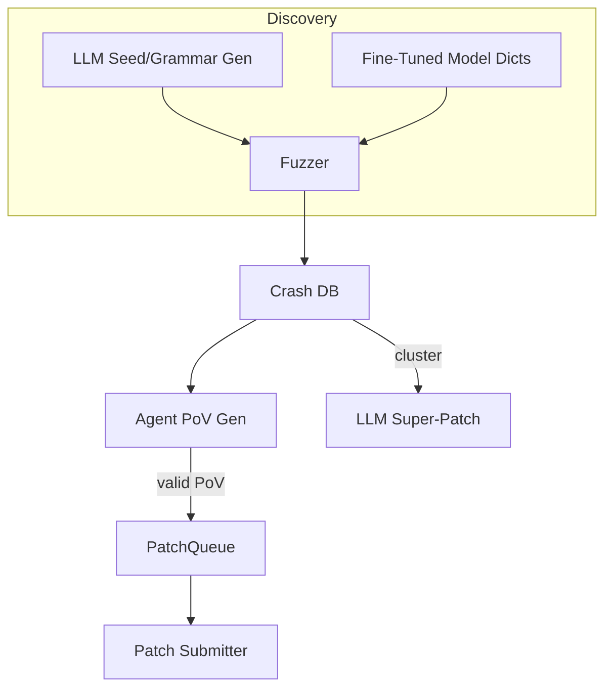

# Fuzzing за допомогою AI та автоматизоване виявлення вразливостей

{{#include ../banners/hacktricks-training.md}}

## Огляд
Великі мовні моделі (LLM) можуть значно посилити традиційні процеси дослідження вразливостей, генеруючи семантично насичені вхідні дані, розвиваючи граматики, аналізуючи дані про збої та навіть пропонуючи патчі для кількох помилок. На цій сторінці зібрано найефективніші підходи, зафіксовані під час фіналу DARPA’s AI Cyber Challenge (AIxCC) та інших публічних досліджень.<sup>[[4]](#references)</sup><sup>[[5]](#references)</sup>

Нижче наведено не опис конкретної системи змагання, а узагальнення технік, щоб ви могли відтворити їх у власних робочих процесах.

---

## 1. Seed Inputs, згенеровані LLM

Традиційні coverage-guided fuzzers (AFL++, libFuzzer, Honggfuzz…) починають із невеликого корпусу seed-файлів і здійснюють сліпу мутацію байтів. Коли формат цільових вхідних даних є складним (SQL, URL, власні бінарні протоколи), випадкові мутації зазвичай порушують синтаксис ще до досягнення цікавих гілок виконання.

LLM можуть розв’язати цю проблему початкової ініціалізації, створюючи *генератори seed-файлів* — короткі скрипти, які виводять **синтаксично коректні, але релевантні для безпеки вхідні дані**. Наприклад:
```prompt
SYSTEM: You are a helpful security engineer.
USER:
Write a Python3 program that prints 200 unique SQL injection strings targeting common anti-pattern mistakes (missing quotes, numeric context, stacked queries).  Ensure length ≤ 256 bytes / string so they survive common length limits.
```

```python
# gen_sqli_seeds.py (truncated)
PAYLOADS = [
"1 OR 1=1 -- ",
"' UNION SELECT NULL,NULL--",
"0; DROP TABLE users;--",
...
]
for p in PAYLOADS:
print(p)
```
Запустіть один раз і безпосередньо передайте результат до початкового корпусу fuzzer-а:
```bash
python3 gen_sqli_seeds.py > seeds.txt
afl-fuzz -i seeds.txt -o findings/ -- ./target @@
```
Переваги:
1. Семантична коректність → глибше покриття на ранньому етапі.
2. Можливість повторної генерації: змінюйте prompt, щоб зосередитися на XSS, path traversal, binary blobs тощо.
3. Дешево (< 1 ¢ з GPT-3.5).

### Поради
* Попросіть модель *урізноманітнити* довжину payload і кодування (UTF-8, URL-encoded, UTF-16-LE), щоб обійти поверхневі фільтри.
* Попросіть *єдиний самодостатній скрипт* — це допомагає уникнути проблем із форматуванням JSON.

---

## 2. Grammar-Evolution Fuzzing

Потужніший варіант — дозволити LLM **еволюціонувати grammar**, а не конкретні seeds. Робочий процес (патерн “Grammar Guy”):

1. Згенерувати початкову grammar ANTLR/Peach/LibFuzzer за допомогою prompt.
2. Виконувати fuzzing протягом N хвилин і збирати метрики покриття (досягнуті edges / blocks).
3. Узагальнити непокриті області програми та передати summary назад моделі:
```prompt
The previous grammar triggered 12 % of the program edges.  Functions not reached: parse_auth, handle_upload.  Add / modify rules to cover these.
```
4. Об’єднати нові rules, повторити fuzzing і цикл.

Каркас псевдокоду:
```python
for epoch in range(MAX_EPOCHS):
grammar = llm.refine(grammar, feedback=coverage_stats)
save(grammar, f"grammar_{epoch}.txt")
coverage_stats = run_fuzzer(grammar)
```
Ключові моменти:
* Дотримуйтеся *бюджету* – кожне уточнення використовує токени.
* Використовуйте інструкції `diff` + `patch`, щоб модель редагувала, а не переписувала.
* Зупиніться, коли Δcoverage < ε.

---

## 3. Генерація PoV (Exploit) на основі агентів

Після виявлення crash вам усе ще потрібен **proof-of-vulnerability (PoV)**, який детерміновано його відтворює.

Масштабований підхід полягає в запуску багатьох lightweight workers (процесів, потоків або контейнерів), кожен із яких використовує іншу модель або конфігурацію sampling. Огляд фіналістів AIxCC наводить конкретні приклади масштабування: одна команда використовувала **тисячі паралельних агентів** для AI-first генерації PoV, тоді як інша організувала **300–500 fuzzing agents**, залишивши LLM для семантичного reasoning вищого рівня.<sup>[[4]](#references)</sup>

Pipeline:
1. Static/dynamic analysis створює *кандидатів на баги* (struct із crash PC, input slice, повідомленням sanitizer).
2. Orchestrator розподіляє кандидатів між агентами.
3. Кроки reasoning агента:
a. Локально відтворити баг за допомогою `gdb` + input.
b. Запропонувати мінімальний exploit payload.
c. Перевірити exploit у sandbox. Якщо успішно → надіслати.
4. Невдалі спроби **ставляться в чергу повторно як нові seeds** для coverage fuzzing (feedback loop).

Переваги:
* Parallelisation приховує ненадійність одного агента.
* Auto-tuning temp / розміру моделі на основі спостережуваного success-rate.

---

## 4. Directed Fuzzing із Fine-Tuned Code Models

Fine-tune open-weight model (наприклад, Llama-7B) на вихідному коді C/C++, розміченому шаблонами вразливостей (integer overflow, buffer copy, format string). Потім:

1. Запустіть static analysis, щоб отримати список функцій + AST.
2. Запропонуйте моделі: *«Provide mutation dictionary entries that are likely to break memory safety in function X»*.
3. Вставте ці токени в custom `AFL_CUSTOM_MUTATOR`.

Приклад output для wrapper `sprintf`:
```
{"pattern":"%99999999s"}
{"pattern":"AAAAAAAA....<1024>....%n"}
```
Емпірично це скорочує time-to-crash більш ніж у 2 рази на реальних цільових системах.

---

## 5. Стратегії патчингу під керуванням AI

### 5.1 Super Patches
Попросіть модель *кластеризувати* сигнатури crash і запропонувати **єдиний патч**, який усуває спільну першопричину. Надішліть його один раз, виправте кілька багів → менше штрафів за точність у середовищах, де кожен неправильний патч коштує балів.

Структура промпту:
```
Here are 10 stack traces + file snippets.  Identify the shared mistake and generate a unified diff fixing all occurrences.
```
### 5.2 Співвідношення спекулятивних патчів
Реалізуйте чергу, у якій підтверджені патчі, валідовані PoV, і *спекулятивні* патчі (без PoV) чергуються у співвідношенні 1:​N, налаштованому відповідно до правил оцінювання (наприклад, 2 спекулятивні : 1 підтверджений). Модель витрат відстежує штрафи та бали й автоматично коригує N.

---

## 6. Детермінований AI Code Review файл за файлом

Поширений сценарій невдачі під час AI-assisted review — попросити одного агента перевірити весь репозиторій і сподіватися, що він вибере правильні файли та терміни для grep. Надійніший підхід — **примусово забезпечити охоплення репозиторію**:<sup>[[1]](#references)</sup>

1. Перелічити вихідні файли.
2. Надсилати **по одному файлу за раз** разом із мінімальним контекстом (entrypoint, імпорти, сусідні маршрути/викликачі).
3. Вимагати **структурований звіт** для кожного файлу: джерела, sink, відсутня валідація, передумови експлуатації та рівень впевненості.<sup>[[3]](#references)</sup>
4. Дедуплікувати звіти за **шаблоном source→sink** і вручну перевіряти знахідки з високим ризиком.

Це потребує багато токенів і створює шум, але дуже ефективно виявляє **прості source/sink-уразливості з високим впливом**, які широкі agentic review часто пропускають.

### Шаблони для triage, яким варто надати пріоритет

- **Dynamic PHP include/dispatch**: контрольовані атакувальником назви маршрутів/controller/module передаються в `require_once()`, `include()` або `include_once()` без суворого allowlisting і canonicalisation шляхів.
- **Shell execution у робочих процесах адміністрування/облікових записів**: імена користувачів, домени, FTP-акаунти або інші ідентифікатори досягають `exec()`, `system()`, `shell_exec()`, `passthru()`, `proc_open()` або `popen()`.
- **Structured input fan-in**: той самий параметр приймається з `$_GET`, `$_POST`, JSON, XML або body parser фреймворку, а згодом повторно використовується у filesystem- або OS-command sink.

### Два практичні класи багів, які цей метод добре знаходить

- **PHP controller-dispatch LFI/RCE**: якщо контрольоване запитом ім’я controller конкатенується з `require_once()` без allowlist/нормалізації шляху, послідовності обходу на кшталт `../` можуть змусити PHP підключити непередбачений локальний `.php`-файл. Якщо атакувальник може вказати include на розміщений ним або іншим чином корисний PHP-файл, LFI перетворюється на code execution. Див. [File Inclusion / Path Traversal](../pentesting-web/file-inclusion/README.md).<sup>[[1]](#references)</sup>
- **Authenticated command injection у hosting/admin panels**: якщо поля керування обліковими записами, такі як імена користувачів, вбудовуються в shell-команди, автентифікований користувач із низькими привілеями може перетворити звичайну дію створення/видалення на RCE. Вплив зростає, якщо панель виконує команду від імені привілейованішого service account. Див. [Command Injection](../pentesting-web/command-injection.md).<sup>[[1]](#references)</sup>

### Практичні примітки щодо review

- Використовуйте LLM спочатку як **source/sink reviewer**, а не як генератор експлойтів.
- Просіть його явно перелічити **поле, контрольоване атакувальником**, **прогалину в нормалізації/валідації** та **небезпечний sink**.
- Для великих репозиторіїв детермінований review файл за файлом часто надійніший за один автономний запуск агента, навіть якщо останній використовує потужнішу модель.<sup>[[2]](#references)</sup>
- Очікуйте слабших результатів щодо **Broken Access Control** та інших бізнес-логічних багів, де експлуатованість залежить від припущень між файлами, семантики ролей або специфічних для продукту моделей загроз.

---

## Об’єднання всіх компонентів
End-to-end CRS (Cyber Reasoning System) може поєднувати компоненти приблизно так:

```mermaid
graph TD
subgraph Discovery
A[LLM Seed/Grammar Gen] --> B[Fuzzer]
C[Fine-Tuned Model Dicts] --> B
end
B --> D[Crash DB]
D --> E[Agent PoV Gen]
E -->|valid PoV| PatchQueue
D -->|cluster| F[LLM Super-Patch]
PatchQueue --> G[Patch Submitter]
```
---

## References

- [1] [Project Black - Локальний AI для кібербезпеки: пошук LFI у phpIPAM та Authenticated RCE у myVesta](https://projectblack.io/blog/local-ai-for-cyber-security)
- [2] [Strix](https://github.com/usestrix/strix)
- [3] [Навичка security-review спільноти GitHub Copilot](https://github.com/github/awesome-copilot/blob/main/skills/security-review/SKILL.md)
- [4] [Trail of Bits – фінали AIxCC: порівняння результатів](https://blog.trailofbits.com/2025/08/07/aixcc-finals-tale-of-the-tape/)
- [5] [Інтерв’ю CTF Radiooo з фіналістами AIxCC](https://www.youtube.com/@ctfradiooo)
{{#include ../banners/hacktricks-training.md}}
