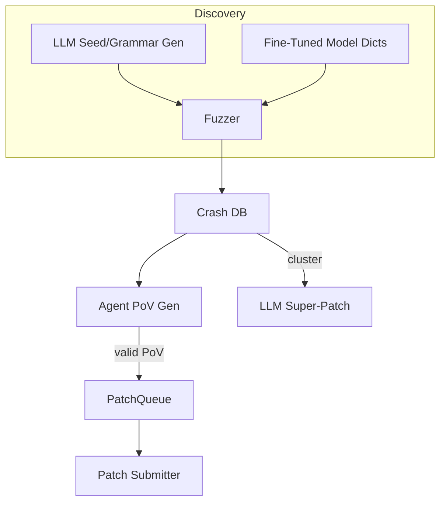

# AI-Assisted Fuzzing ve Automated Vulnerability Discovery

{{#include ../banners/hacktricks-training.md}}

## Genel Bakış
Large-language model'ler (LLM'ler), semantik açıdan zengin girdiler üreterek, grammar'ları geliştirerek, crash verileri üzerinde reasoning yaparak ve hatta birden fazla bug'ı ele alan patch'ler önererek geleneksel vulnerability-research pipeline'larını büyük ölçüde güçlendirebilir. Bu sayfa, DARPA’nın AI Cyber Challenge (AIxCC) finallerinde ve diğer public research çalışmalarında gözlemlenen en etkili pattern'leri bir araya getirir.<sup>[[4]](#references)</sup><sup>[[5]](#references)</sup>

Aşağıda belirli bir competition sisteminin açıklaması değil, bu tekniklerin kendi workflow'larınızda yeniden uygulanabilmesi için soyutlanmış hâli sunulmaktadır.

---

## 1. LLM-Generated Seed Inputs

Geleneksel coverage–guided fuzzer'lar (AFL++, libFuzzer, Honggfuzz…) küçük bir seed corpus'u ile başlar ve byte'ları körlemesine mutate eder. Hedef input format'ı karmaşık olduğunda (SQL, URL'ler, custom binary protocol'ler), random mutation'lar genellikle ilginç branch'lere ulaşılmadan önce syntax'ı bozar.

LLM'ler, **syntax açısından doğru ancak security açısından anlamlı input'lar** üreten kısa script'ler olan *seed generator*'lar oluşturarak bu bootstrap problemini çözebilir. Örneğin:
```prompt
SYSTEM: You are a helpful security engineer.
USER:
Write a Python3 program that prints 200 unique SQL injection strings targeting common anti-pattern mistakes (missing quotes, numeric context, stacked queries).  Ensure length ≤ 256 bytes / string so they survive common length limits.
```

```python
# gen_sqli_seeds.py (truncated)
PAYLOADS = [
"1 OR 1=1 -- ",
"' UNION SELECT NULL,NULL--",
"0; DROP TABLE users;--",
...
]
for p in PAYLOADS:
print(p)
```
Bir kez çalıştırın ve çıktıyı doğrudan fuzzer'ın başlangıç corpus'una aktarın:
```bash
python3 gen_sqli_seeds.py > seeds.txt
afl-fuzz -i seeds.txt -o findings/ -- ./target @@
```
Faydaları:
1. Semantik geçerlilik → erken aşamada daha derin coverage.
2. Yeniden üretilebilir: XSS, path traversal, binary blobs vb. konulara odaklanmak için prompt'u değiştirin.
3. Ucuz (GPT-3.5 ile < 1 ¢).

### İpuçları
* Yüzeysel filtreleri aşmak için modelden payload uzunluğunu ve encoding'i (UTF-8, URL-encoded, UTF-16-LE) *çeşitlendirmesini* isteyin.
* *Tek, kendi kendine yeten bir script* isteyin – JSON formatting sorunlarını önler.

---

## 2. Grammar-Evolution Fuzzing

Daha güçlü bir varyant, somut seed'ler yerine LLM'in bir **grammar'ı geliştirmesine** izin vermektir. İş akışı (“Grammar Guy” pattern'i) şöyledir:

1. Prompt aracılığıyla başlangıçta bir ANTLR/Peach/LibFuzzer grammar'ı oluşturun.
2. N dakika boyunca fuzzing yapın ve coverage metriklerini (vurulan edge / block'lar) toplayın.
3. Ulaşılamayan program alanlarını özetleyin ve özeti modele geri gönderin:
```prompt
The previous grammar triggered 12 % of the program edges.  Functions not reached: parse_auth, handle_upload.  Add / modify rules to cover these.
```
4. Yeni rule'ları birleştirin, yeniden fuzzing yapın ve tekrarlayın.

Pseudo-code iskeleti:
```python
for epoch in range(MAX_EPOCHS):
grammar = llm.refine(grammar, feedback=coverage_stats)
save(grammar, f"grammar_{epoch}.txt")
coverage_stats = run_fuzzer(grammar)
```
Önemli noktalar:
* Bir *budget* koruyun – her refinement token kullanır.
* Modelin yeniden yazmak yerine düzenleme yapması için `diff` + `patch` talimatlarını kullanın.
* Δcoverage < ε olduğunda durun.

---

## 3. Agent-Based PoV (Exploit) Generation

Bir crash bulunduktan sonra, onu deterministik olarak tetikleyen bir **proof-of-vulnerability (PoV)** oluşturmanız gerekir.

Scalable bir yaklaşım, her biri farklı bir model veya sampling yapılandırması kullanan çok sayıda lightweight worker (process, thread veya container) başlatmaktır. AIxCC finalist survey, somut scale örnekleri sunar: Bir team AI-first PoV generation için **binlerce concurrent agent** kullanırken başka bir team **300–500 fuzzing agent** koordine etmiş ve LLM'leri daha üst düzey semantic reasoning için ayırmıştır.<sup>[[4]](#references)</sup>

Pipeline:
1. Static/ dynamic analysis, *bug candidate*'lar üretir (crash PC, input slice ve sanitizer msg içeren struct).
2. Orchestrator, candidate'ları agent'lara dağıtır.
3. Agent reasoning adımları:
a. Bug'ı `gdb` + input ile local olarak reproduce edin.
b. Minimal exploit payload önerin.
c. Exploit'i sandbox'ta validate edin.  Başarılı olursa → submit edin.
4. Başarısız denemeler, coverage fuzzing için **new seed** olarak yeniden queue'ya alınır (feedback loop).

Avantajlar:
* Parallelisation, tek bir agent'ın güvenilmezliğini gizler.
* Gözlemlenen success-rate'e göre temp / model size otomatik olarak tune edilir.

---

## 4. Directed Fuzzing with Fine-Tuned Code Models

Bir open-weight modeli (ör. Llama-7B), vulnerability pattern'leriyle (integer overflow, buffer copy, format string) etiketlenmiş C/C++ source üzerinde fine-tune edin.  Ardından:

1. Function listesi + AST elde etmek için static analysis çalıştırın.
2. Modele şu prompt'u verin: *“Function X'te memory safety'yi bozma olasılığı yüksek mutation dictionary entry'leri ver”*.
3. Bu token'ları özel bir `AFL_CUSTOM_MUTATOR` içine ekleyin.

Bir `sprintf` wrapper için örnek output:
```
{"pattern":"%99999999s"}
{"pattern":"AAAAAAAA....<1024>....%n"}
```
Ampirik olarak bu, gerçek hedeflerde time-to-crash süresini >2× kısaltır.

---

## 5. AI-Guided Patching Strategies

### 5.1 Super Patches
Modelden crash signature'larını *cluster* etmesini ve ortak root cause'u ortadan kaldıran **tek bir patch** önermesini isteyin. Tek seferde gönderin, birden fazla bug'ı düzeltin → her yanlış patch'in puan kaybettirdiği ortamlarda daha az accuracy penalty.

Prompt taslağı:
```
Here are 10 stack traces + file snippets.  Identify the shared mistake and generate a unified diff fixing all occurrences.
```
### 5.2 Speculative Patch Ratio
Confirmed PoV-validated patches ve *speculative* patches (PoV yok) için, scoring rules'a göre ayarlanmış 1:​N oranında (ör. 2 speculative : 1 confirmed) dönüşümlü çalışan bir queue uygulayın. Bir cost model, cezaları ve puanları izleyerek N değerini otomatik olarak ayarlar.

---

## 6. Deterministic File-by-File AI Code Review

AI-assisted review'da sık görülen bir failure mode, tek bir agent'tan tüm repository'yi incelemesini istemek ve doğru dosyaları ve grep terimlerini seçmesini ummaktır. Daha güvenilir bir pattern, **repository coverage'ı zorunlu kılmaktır**:<sup>[[1]](#references)</sup>

1. Source dosyalarını listeleyin.
2. **Tek seferde bir dosya** ve minimal context (entrypoint, imports, yakındaki routes/callers) gönderin.
3. Her dosya için yapılandırılmış bir report isteyin: sources, sink, eksik validation, exploit preconditions ve confidence.<sup>[[3]](#references)</sup>
4. Report'ları **source→sink pattern'ine** göre deduplicate edin ve yüksek riskli olanları manuel olarak validate edin.

Bu yöntem token açısından maliyetli ve gürültülüdür, ancak geniş agentic review'ların sıklıkla gözden kaçırdığı **basit, yüksek etkili source/sink bug'larını** ortaya çıkarmada oldukça etkilidir.

### Öncelik verilmeye değer triage pattern'leri

- **Dynamic PHP include/dispatch**: attacker-controlled route/controller/module adlarının, strict allowlisting ve path canonicalisation olmadan `require_once()`, `include()` veya `include_once()` içine aktarılması.
- **Admin/account workflow'larında shell execution**: usernames, domains, FTP accounts veya diğer identifier'ların `exec()`, `system()`, `shell_exec()`, `passthru()`, `proc_open()` ya da `popen()` fonksiyonlarına ulaşması.
- **Structured input fan-in**: aynı parameter'ın `$_GET`, `$_POST`, JSON, XML veya framework body parser'larından kabul edilmesi ve daha sonra filesystem veya OS-command sink'lerinde yeniden kullanılması.

### Bu yöntemin iyi bulduğu iki pratik bug class'ı

- **PHP controller-dispatch LFI/RCE**: request-controlled bir controller name, allowlist/path normalisation olmadan `require_once()` içine birleştirilirse, `../` gibi traversal sequence'ları PHP'nin istenmeyen bir local `.php` file'ı include etmesini sağlayabilir. Attacker include işlemini planted veya başka şekilde kullanışlı bir PHP file'ına yönlendirebiliyorsa, LFI code execution'a dönüşür. Bkz. [File Inclusion / Path Traversal](../pentesting-web/file-inclusion/README.md).<sup>[[1]](#references)</sup>
- **Hosting/admin panel'lerinde authenticated command injection**: usernames gibi account-management field'ları shell command'larına gömülüyorsa, düşük ayrıcalıklı authenticated bir user normal bir create/delete action'ını RCE'ye dönüştürebilir. Panel command'ı daha ayrıcalıklı bir service account olarak çalıştırdığında impact artar. Bkz. [Command Injection](../pentesting-web/command-injection.md).<sup>[[1]](#references)</sup>

### Pratik review notları

- LLM'i önce **source/sink reviewer** olarak kullanın, exploit generator olarak değil.
- Ondan **attacker-controlled field'ı**, **normalization/validation gap'i** ve **dangerous sink'i** açıkça listelemesini isteyin.
- Büyük repo'larda deterministic per-file review, daha güçlü bir model kullansa bile, genellikle tek bir autonomous agent run'ından daha güvenilirdir.<sup>[[2]](#references)</sup>
- Exploitability'nin cross-file assumptions, role semantics veya product-specific threat model'larına bağlı olduğu **Broken Access Control** ve diğer business-logic bug'larında daha zayıf sonuçlar bekleyin.

---

## Putting It All Together
Uçtan uca bir CRS (Cyber Reasoning System), component'leri şu şekilde bağlayabilir:

```mermaid
graph TD
subgraph Discovery
A[LLM Seed/Grammar Gen] --> B[Fuzzer]
C[Fine-Tuned Model Dicts] --> B
end
B --> D[Crash DB]
D --> E[Agent PoV Gen]
E -->|valid PoV| PatchQueue
D -->|cluster| F[LLM Super-Patch]
PatchQueue --> G[Patch Submitter]
```
---

## References

- [1] [Project Black - Cyber Security için Local AI: phpIPAM LFI ve myVesta Authenticated RCE Bulma](https://projectblack.io/blog/local-ai-for-cyber-security)
- [2] [Strix](https://github.com/usestrix/strix)
- [3] [GitHub Copilot topluluk security-review skill'i](https://github.com/github/awesome-copilot/blob/main/skills/security-review/SKILL.md)
- [4] [Trail of Bits – AIxCC finalleri: Bandın hikâyesi](https://blog.trailofbits.com/2025/08/07/aixcc-finals-tale-of-the-tape/)
- [5] [CTF Radiooo AIxCC finalist röportajları](https://www.youtube.com/@ctfradiooo)
{{#include ../banners/hacktricks-training.md}}
