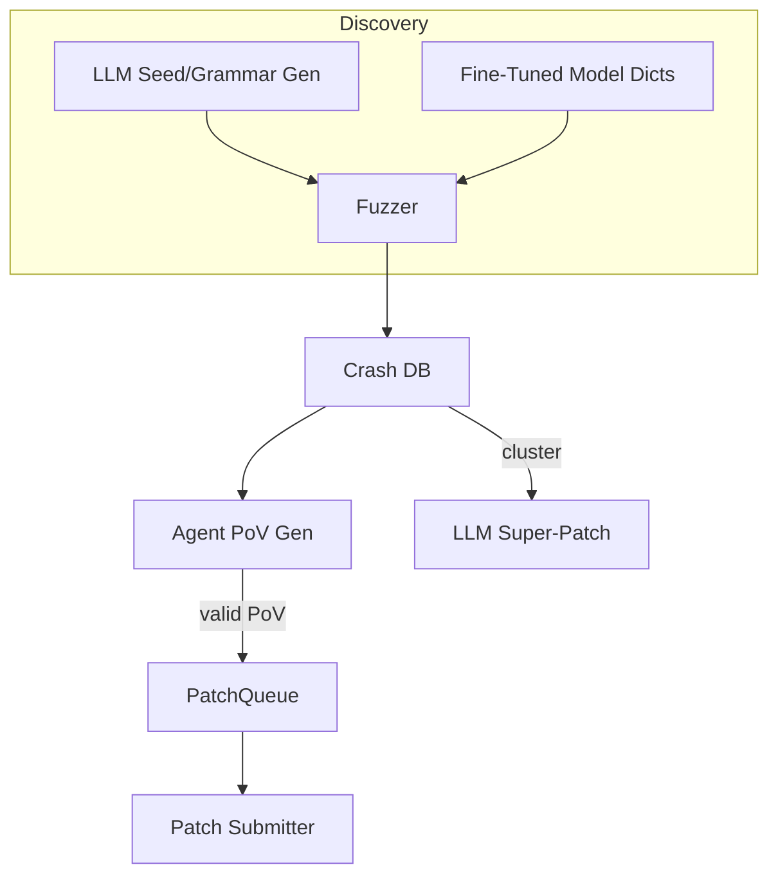

# KI-unterstütztes Fuzzing & automatisierte Schwachstellenerkennung

{{#include ../banners/hacktricks-training.md}}

## Überblick
Large Language Models (LLMs) können traditionelle Schwachstellenforschungs-Pipelines erheblich verbessern, indem sie semantisch reichhaltige Eingaben generieren, Grammatiken weiterentwickeln, Crash-Daten analysieren und sogar Patches für mehrere Bugs vorschlagen. Diese Seite fasst die effektivsten Muster zusammen, die während des Finales der DARPA AI Cyber Challenge (AIxCC) und anderer öffentlicher Forschungsarbeiten beobachtet wurden.<sup>[[4]](#references)</sup><sup>[[5]](#references)</sup>

Im Folgenden wird kein spezifisches Wettbewerbssystem beschrieben, sondern eine Abstraktion der Techniken, damit du sie in deinen eigenen Workflows reproduzieren kannst.

---

## 1. Von LLMs generierte Seed-Eingaben

Traditionelle Coverage-guided Fuzzer (AFL++, libFuzzer, Honggfuzz …) starten mit einem kleinen Seed-Corpus und mutieren Bytes blind. Wenn das Zielformat der Eingaben komplex ist (SQL, URLs, benutzerdefinierte Binärprotokolle), zerstören zufällige Mutationen normalerweise die Syntax, bevor interessante Branches erreicht werden.

LLMs können dieses Bootstrap-Problem lösen, indem sie *Seed-Generatoren* ausgeben – kurze Scripts, die **syntaktisch korrekte, aber sicherheitsrelevante Eingaben** erzeugen. Zum Beispiel:
```prompt
SYSTEM: You are a helpful security engineer.
USER:
Write a Python3 program that prints 200 unique SQL injection strings targeting common anti-pattern mistakes (missing quotes, numeric context, stacked queries).  Ensure length ≤ 256 bytes / string so they survive common length limits.
```

```python
# gen_sqli_seeds.py (truncated)
PAYLOADS = [
"1 OR 1=1 -- ",
"' UNION SELECT NULL,NULL--",
"0; DROP TABLE users;--",
...
]
for p in PAYLOADS:
print(p)
```
Einmal ausführen und die Ausgabe direkt in das initiale Corpus des Fuzzers einspeisen:
```bash
python3 gen_sqli_seeds.py > seeds.txt
afl-fuzz -i seeds.txt -o findings/ -- ./target @@
```
Vorteile:
1. Semantische Gültigkeit → frühzeitig umfassendere Abdeckung.
2. Erneut generierbar: Passe den Prompt an, um den Fokus auf XSS, path traversal, binary blobs usw. zu legen.
3. Günstig (< 1 ¢ mit GPT-3.5).

### Tipps
* Weise das Modell an, die Payload-Länge und -Kodierung (UTF-8, URL-encoded, UTF-16-LE) zu *diversifizieren*, um oberflächliche Filter zu umgehen.
* Bitte um ein *einzelnes eigenständiges Skript* – dadurch werden Probleme bei der JSON-Formatierung vermieden.

---

## 2. Grammar-Evolution Fuzzing

Eine leistungsfähigere Variante besteht darin, das LLM eine **Grammar weiterentwickeln** zu lassen, anstatt konkrete Seeds zu verwenden. Der Workflow (das „Grammar Guy“-Muster) sieht folgendermaßen aus:

1. Generiere per Prompt eine anfängliche ANTLR-/Peach-/LibFuzzer-Grammar.
2. Führe für N Minuten Fuzzing durch und erfasse Coverage-Metriken (getroffene Edges / Blöcke).
3. Fasse nicht abgedeckte Programmbereiche zusammen und gib die Zusammenfassung zurück an das Modell:
```prompt
The previous grammar triggered 12 % of the program edges.  Functions not reached: parse_auth, handle_upload.  Add / modify rules to cover these.
```
4. Führe die neuen Regeln zusammen, wiederhole das Fuzzing und iteriere.

Pseudo-code skeleton:
```python
for epoch in range(MAX_EPOCHS):
grammar = llm.refine(grammar, feedback=coverage_stats)
save(grammar, f"grammar_{epoch}.txt")
coverage_stats = run_fuzzer(grammar)
```
Wichtige Punkte:
* Halte ein *Budget* ein – jede Verfeinerung verwendet Tokens.
* Verwende `diff`- und `patch`-Anweisungen, damit das Modell editiert statt neu zu schreiben.
* Stoppe, wenn Δcoverage < ε.

---

## 3. Engineering eines lokalen LLM-libFuzzer-Harness

Für Sourcecode, der den Arbeitsplatz eines Analysts nicht verlassen darf, kann ein lokales Code-Modell den kleinen Adapter zwischen Fuzzer-Bytes und einer C/C++-API erstellen. Die nützliche Security-Grenze ist eindeutig: **Das Modell schreibt und überarbeitet Testinfrastruktur; coverage-guided Mutation untersucht Inputs; Sanitizer melden ungültige Operationen; ein Mensch prüft den Harness und triagiert die Findings**.<sup>[[9]](#references)</sup>

Informationen zu Engine-Level-Techniken für Corpus, Feedback, Snapshot und Stateful-Fuzzing, die nicht von einem LLM abhängen, findest du in der allgemeinen [Fuzzing Methodology](../generic-methodologies-and-resources/fuzzing.md).

Beginne mit der exakten Deklaration, die aus dem Header des Targets kopiert wurde, und schränke das Ausgabeformat ein. Ein enger Prompt reduziert erfundene APIs und macht das Ergebnis leicht überprüfbar:<sup>[[8]](#references)[[9]](#references)</sup>
```prompt
Write a libFuzzer target for this exact declaration:
int parse_records(const uint8_t *data, size_t size);

Output only C code. Implement LLVMFuzzerTestOneInput, include the
declaration, pass data and size unchanged, and do not use files,
network access, randomness, clocks, threads, or persistent state.
```
Für einen Parser für rohe Bytes sollte das erwartete Ergebnis nicht komplizierter sein als:<sup>[[6]](#references)[[9]](#references)</sup>
```c
#include <stddef.h>
#include <stdint.h>

extern int parse_records(const uint8_t *, size_t);

int LLVMFuzzerTestOneInput(const uint8_t *data, size_t size) {
(void)parse_records(data, size);
return 0;
}
```
Die Kompilierung ist nur die erste Validierungsschranke. Überprüfe jedes generierte Target anhand dieser Invarianten, bevor du CPU-Zeit dafür aufwendest:<sup>[[6]](#references)[[8]](#references)[[9]](#references)</sup>

- **Exakte API:** Vergleiche Typen, Ownership-Regeln, Initialisierung, Teardown und Calling Convention mit dem tatsächlichen Header und bestehenden Aufrufern.
- **Harness-Sicherheit:** Schütze jeden Lesezugriff auf `data`; Sanitizer-Befunde müssen im Target und nicht im generierten Glue-Code entstehen.
- **Wiederholbarkeit:** Mache das Ergebnis zu einer Funktion von `data` und `size`; entferne externe I/O, Zeitabhängigkeiten, unkontrollierte Zufallsquellen, nicht gejointe Threads und Zustände, die zwischen Aufrufen bestehen bleiben.
- **Durchsatz:** Initialisiere teuren unveränderlichen Zustand nur einmal, sofern dies das Verhalten nicht beeinflussen kann, begrenze die Eingabegröße, unterdrücke Logging und gib Allokationen pro Eingabe frei.
- **Erreichbarkeit:** Überprüfe, dass die vorgesehenen Funktionen und Branches ausgeführt werden. Ein Target, das kompiliert, aber nur Reject-Pfade ausführt, ist ein stiller Fehler.

### Struktur-aware Targets: Invarianten bewahren, ohne Bugs zu verbergen

Wenn die meisten Raw Inputs an einer Magic-, Längen-, Versions- oder Checksum-Prüfung scheitern, verwende die Fuzz-Bytes als **Material für typisierte Felder** und baue daraus ein gültiges Objekt neu auf. Korrigiere Formatkonstanten, lasse semantische Felder und Payload-Bytes veränderlich und leite Integritätsmetadaten aus der rekonstruierten Payload ab. `FuzzedDataProvider` ist nützlich, um begrenzte typisierte Werte zu konsumieren, während der Adapter weiterhin dafür verantwortlich ist, jede generierte Allokation und Konvertierung zu begrenzen.<sup>[[9]](#references)</sup>

<details>
<summary>Beispiel für ein struktur-aware C++ Target</summary>
```cpp
#include <fuzzer/FuzzedDataProvider.h>
#include <stddef.h>
#include <stdint.h>
#include <vector>

extern "C" int parse_message(const uint8_t *, size_t);

extern "C" int LLVMFuzzerTestOneInput(const uint8_t *data, size_t size) {
FuzzedDataProvider fdp(data, size);
uint8_t version = fdp.ConsumeIntegral<uint8_t>();
auto body = fdp.ConsumeRemainingBytes<uint8_t>();
if (body.size() > UINT16_MAX) body.resize(UINT16_MAX);
uint16_t len = static_cast<uint16_t>(body.size());
std::vector<uint8_t> msg = {0x8b, 'M', 'S', 'G', version,
static_cast<uint8_t>(len >> 8),
static_cast<uint8_t>(len)};
msg.insert(msg.end(), body.begin(), body.end());
(void)parse_message(msg.data(), msg.size());
return 0;
}
```
</details>

Verwende nicht für jede Frage ein einziges strukturreparierendes Target. Halte ein Target vor, das Längen/Prüfsummen ableitet, um tiefe gültige Zustände zu erkunden, und ein weiteres, bei dem der **deklarierte** Metadateninhalt vom Fuzzer kontrolliert wird, während nur die eigenen Lesevorgänge und Allokationen des Harness begrenzt werden. Das zweite Target bewahrt Angriffsflächen für nicht übereinstimmende Längen und fehlerhafte Integrität, die durch automatische Reparatur andernfalls beseitigt würden.<sup>[[9]](#references)</sup>

### Seeds, Dictionaries, Sanitizer und Coverage-Feedback

Bitte das Modell, ein Script zu generieren, das binäre Seeds schreibt, anstatt es aufzufordern, Binärdaten direkt auszugeben. Verwende leere, minimale, typische und an den Grenzen gültige Objekte als Seeds; extrahiere anschließend Magic Values, Tags, Enum-Kodierungen und Parser-Schlüsselwörter in ein geprüftes Dictionary. libFuzzer akzeptiert dieses Dictionary mit `-dict=`, und behält Mutationen, die neue Coverage im Corpus aufdecken.<sup>[[6]](#references)[[9]](#references)</sup>
```text
magic="\x8bMSG"
version_min="\x00"
version_max="\xff"
config_tag="CONFIG"
```
Erstelle dasselbe Ziel mit ergänzender Instrumentierung. ASan und UBSan können sich eine Fuzzing-Binärdatei teilen; verwende einen separaten MSan-Build und instrumentiere dessen Abhängigkeiten, um durch nicht instrumentierten Code verursachte Meldungen zu vermeiden.<sup>[[6]](#references)[[9]](#references)</sup>
```bash
clang++ -g -O1 -fsanitize=fuzzer,address,undefined \
-fno-sanitize-recover=undefined target.cc harness.cc -o fuzz_target
./fuzz_target corpus -dict=msg.dict -max_len=65535

clang++ -g -O1 -fsanitize=fuzzer,memory \
target.cc harness.cc -o fuzz_target_msan
```
Behandle die Coverage als Evaluator für jede Modellrevision. In der libFuzzer-Ausgabe bedeuten eine frühzeitig flache `cov`/`ft`-Kurve und ein statisches Corpus meist ein fehlerhaftes Framing, einen zu restriktiven frühen Rückgabepunkt oder den falschen Aufruf; eine niedrige `exec/s`-Rate deutet auf aufwendiges Setup, I/O, Allokationen oder geleakten State hin. `NEW` beweist lediglich, dass sich ein Coverage-Feature geändert hat, nicht, dass der beabsichtigte Parser erreicht wurde.<sup>[[6]](#references)[[9]](#references)</sup>

Für Feedback auf Source-Ebene erstellst du einen Coverage-Build, fuzzst ihn und gibst dem Modell nur die nicht abgedeckten Funktionen sowie deren Guarding Conditions. Überprüfe den resultierenden Harness-/Seed-/Dictionary-Diff und messe erneut:<sup>[[7]](#references)[[8]](#references)[[9]](#references)</sup>
```bash
clang++ -g -O1 -fsanitize=fuzzer \
-fprofile-instr-generate -fcoverage-mapping target.cc harness.cc -o fuzz_cov
mkdir -p profiles
LLVM_PROFILE_FILE='profiles/%p.profraw' ./fuzz_cov -max_total_time=300 corpus
llvm-profdata merge -sparse profiles/*.profraw -o fuzz.profdata
llvm-cov report ./fuzz_cov -instr-profile=fuzz.profdata
llvm-cov show ./fuzz_cov -instr-profile=fuzz.profdata \
--show-branches=count --region-coverage-lt=1 target.cc
```
Der skalierbare Ablauf ist daher **generate → compile/link → smoke-test under sanitizers → measure target coverage → provide the smallest relevant coverage/source context → revise → re-measure**. OSS-Fuzz-Gen wendet dasselbe Prinzip an, indem es generierte Targets auf Kompilierbarkeit, Laufzeitfehler, Coverage und Coverage-Verbesserungen gegenüber bestehenden Targets bewertet, anstatt plausiblen Code ungeprüft zu akzeptieren.<sup>[[7]](#references)[[8]](#references)</sup>

---

## 4. Agent-Based PoV (Exploit)-Generierung

Nachdem ein Crash gefunden wurde, benötigen Sie weiterhin einen **proof-of-vulnerability (PoV)**, der ihn deterministisch auslöst.

Ein skalierbarer Ansatz besteht darin, viele leichtgewichtige Worker (Prozesse, Threads oder Container) zu starten, die jeweils ein anderes Modell oder eine andere Sampling-Konfiguration verwenden. Die AIxCC-finalist survey liefert konkrete Beispiele für diese Größenordnung: Ein Team verwendete **Tausende gleichzeitig ausgeführte Agents** zur AI-first-PoV-Generierung, während ein anderes **300–500 Fuzzing-Agents** orchestrierte und LLMs für höherstufiges semantisches Reasoning reservierte.<sup>[[4]](#references)</sup>

Pipeline:
1. Static/ dynamic analysis erzeugt *Bug-Kandidaten* (struct mit Crash-PC, Input-Slice, Sanitizer-Meldung).
2. Der Orchestrator verteilt die Kandidaten an Agents.
3. Reasoning-Schritte des Agents:
a. Bug lokal mit `gdb` + Input reproduzieren.
b. Minimales Exploit-Payload vorschlagen.
c. Exploit in der Sandbox validieren.  Bei Erfolg → einreichen.
4. Fehlgeschlagene Versuche werden als **neue Seeds** für Coverage-Fuzzing erneut in die Queue eingereiht (Feedback-Loop).

Vorteile:
* Parallelisierung kaschiert die Unzuverlässigkeit einzelner Agents.
* Automatische Anpassung von temp / model size auf Grundlage der beobachteten Erfolgsrate.

---

## 5. Directed Fuzzing mit Fine-Tuned Code-Modellen

Ein Open-Weight-Modell (z. B. Llama-7B) auf C/C++-Quellcode mit markierten Vulnerability-Patterns (Integer Overflow, Buffer Copy, Format String) fine-tunen. Danach:

1. Static Analysis ausführen, um die Funktionsliste + AST zu erhalten.
2. Das Modell prompten: *„Gib Mutation-Dictionary-Einträge an, die wahrscheinlich die Memory Safety in Funktion X verletzen“*.
3. Diese Tokens in einen benutzerdefinierten `AFL_CUSTOM_MUTATOR` einfügen.

Beispielausgabe für einen `sprintf`-Wrapper:
```
{"pattern":"%99999999s"}
{"pattern":"AAAAAAAA....<1024>....%n"}
```
Empirisch verkürzt dies die Zeit bis zum Absturz bei realen Zielen um mehr als das Zweifache.

---

## 6. AI-Guided Patching-Strategien

### 6.1 Super Patches
Bitte das Modell, Absturzsignaturen zu *clustern* und einen **einzigen Patch** vorzuschlagen, der die gemeinsame Grundursache beseitigt.  Einmal einreichen, mehrere Bugs beheben → weniger Genauigkeitsabzüge in Umgebungen, in denen jeder falsche Patch Punkte kostet.

Prompt-Struktur:
```
Here are 10 stack traces + file snippets.  Identify the shared mistake and generate a unified diff fixing all occurrences.
```
### 6.2 Spekulatives Patch-Verhältnis
Implementiere eine Queue, in der bestätigte, durch PoV validierte Patches und *spekulative* Patches (ohne PoV) in einem an die Scoring-Regeln angepassten Verhältnis von 1:​N miteinander verschachtelt werden (z. B. 2 spekulative : 1 bestätigter Patch). Ein Kostenmodell überwacht Strafen im Verhältnis zu Punkten und passt N automatisch an.

---

## 7. Deterministisches zeilenweises AI Code Review

Ein häufiger Fehler bei AI-gestütztem Review besteht darin, einen Agenten aufzufordern, ein gesamtes Repository zu untersuchen, und darauf zu hoffen, dass er die richtigen Dateien und grep-Begriffe auswählt. Ein zuverlässigeres Muster besteht darin, **die Abdeckung des Repositorys zu erzwingen**:<sup>[[1]](#references)</sup>

1. Quelldateien aufzählen.
2. **Jeweils eine Datei** zusammen mit minimalem Kontext senden (Entrypoint, Imports, benachbarte Routen/Caller).
3. Für jede Datei einen **strukturierten Bericht** verlangen: Quellen, Sink, fehlende Validierung, Exploit-Voraussetzungen und Konfidenz.<sup>[[3]](#references)</sup>
4. Berichte nach dem **Source→Sink-Muster** deduplizieren und die risikoreichsten manuell validieren.

Dieser Ansatz ist tokenintensiv und erzeugt viele irrelevante Ergebnisse, aber er ist sehr effektiv darin, **einfache Source/Sink-Bugs mit großen Auswirkungen** aufzudecken, die umfassende agentische Reviews häufig übersehen.

### Triage-Muster, die priorisiert werden sollten

- **Dynamisches PHP-Include/Dispatch**: Vom Angreifer kontrollierte Route-/Controller-/Modulnamen, die ohne strikte Allowlist und Pfad-Kanonisierung in `require_once()`, `include()` oder `include_once()` gelangen.
- **Shell-Ausführung in Admin-/Account-Workflows**: Benutzernamen, Domains, FTP-Accounts oder andere Bezeichner, die `exec()`, `system()`, `shell_exec()`, `passthru()`, `proc_open()` oder `popen()` erreichen.
- **Zusammenführung strukturierter Eingaben**: Derselbe Parameter wird aus `$_GET`, `$_POST`, JSON, XML oder Framework-Body-Parsern akzeptiert und später erneut in Datei- oder OS-Command-Sinks verwendet.

### Zwei praktische Bug-Klassen, die diese Methode gut findet

- **PHP-Controller-Dispatch-LFI/RCE**: Wenn ein requestgesteuerter Controllername ohne Allowlist/Pfad-Normalisierung an `require_once()` angehängt wird, können Traversal-Sequenzen wie `../` dazu führen, dass PHP eine unbeabsichtigte lokale `.php`-Datei einbindet. Wenn der Angreifer das Include auf eine platzierte oder anderweitig nützliche PHP-Datei richten kann, wird die LFI zu Code Execution. Siehe [File Inclusion / Path Traversal](../pentesting-web/file-inclusion/README.md).<sup>[[1]](#references)</sup>
- **Authentifizierte Command Injection in Hosting-/Admin-Panels**: Wenn Account-Management-Felder wie Benutzernamen in Shell-Commands eingebettet werden, kann ein authentifizierter Benutzer mit niedrigen Berechtigungen eine normale Erstellungs-/Löschaktion in RCE umwandeln. Die Auswirkungen nehmen zu, wenn das Panel den Command als privilegierteres Servicekonto ausführt. Siehe [Command Injection](../pentesting-web/command-injection.md).<sup>[[1]](#references)</sup>

### Praktische Review-Hinweise

- Verwende das LLM zunächst als **Source/Sink-Reviewer**, nicht als Exploit-Generator.
- Bitte es, ausdrücklich das **vom Angreifer kontrollierte Feld**, die **Lücke bei Normalisierung/Validierung** und den **gefährlichen Sink** aufzulisten.
- Bei großen Repositories ist ein deterministisches Review pro Datei häufig zuverlässiger als ein einzelner autonomer Agentenlauf, selbst wenn dieser ein stärkeres Modell verwendet.<sup>[[2]](#references)</sup>
- Rechne mit schwächeren Ergebnissen bei **Broken Access Control** und anderen Business-Logic-Bugs, bei denen die Exploitbarkeit von dateiübergreifenden Annahmen, Rollensemantik oder produktspezifischen Threat Models abhängt.

---

## Alles zusammenführen
Ein End-to-End-CRS (Cyber Reasoning System) kann die Komponenten beispielsweise wie folgt verbinden:

```mermaid
graph TD
subgraph Discovery
A[LLM Seed/Grammar Gen] --> B[Fuzzer]
C[Fine-Tuned Model Dicts] --> B
end
B --> D[Crash DB]
D --> E[Agent PoV Gen]
E -->|valid PoV| PatchQueue
D -->|cluster| F[LLM Super-Patch]
PatchQueue --> G[Patch Submitter]
```
---

## References

- [1] [Project Black - Lokale AI für Cyber Security: Finden von phpIPAM LFI und authentifiziertem myVesta RCE](https://projectblack.io/blog/local-ai-for-cyber-security)
- [2] [Strix](https://github.com/usestrix/strix)
- [3] [GitHub Copilot Community-Skill für Security-Reviews](https://github.com/github/awesome-copilot/blob/main/skills/security-review/SKILL.md)
- [4] [Trail of Bits – AIxCC-Finale: Die Geschichte des Wettbewerbs](https://blog.trailofbits.com/2025/08/07/aixcc-finals-tale-of-the-tape/)
- [5] [Interviews mit AIxCC-Finalisten von CTF Radiooo](https://www.youtube.com/@ctfradiooo)
- [6] [LLVM — libFuzzer: eine Library für Coverage-guided Fuzz Testing](https://llvm.org/docs/LibFuzzer.html)
- [7] [Google — OSS-Fuzz-Gen](https://github.com/google/oss-fuzz-gen)
- [8] [Google Online Security Blog — Fuzzing verbessern: Mit AI mehr Vulnerabilities finden](https://security.googleblog.com/2024/11/leveling-up-fuzzing-finding-more.html)
- [9] [8kSec — AI-gestützte Fuzzing-Harness-Generierung mit einem lokalen LLM](https://8ksec.io/ai-assisted-fuzzing-harness-local-llm)
{{#include ../banners/hacktricks-training.md}}
