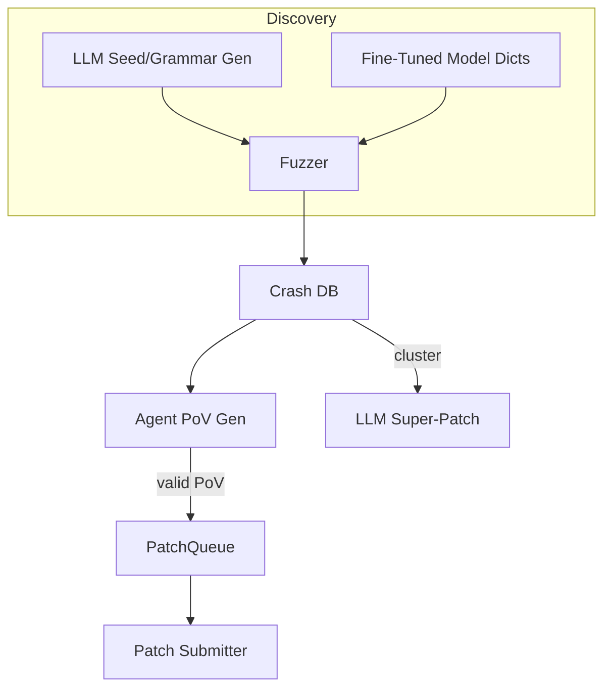

# Fuzzing assistito da AI e individuazione automatizzata delle vulnerabilità

{{#include ../banners/hacktricks-training.md}}

## Panoramica
I large-language model (LLM) possono potenziare notevolmente le pipeline tradizionali di vulnerability research generando input semanticamente ricchi, facendo evolvere le grammar, ragionando sui dati dei crash e persino proponendo patch per bug multipli. Questa pagina raccoglie i pattern più efficaci osservati durante le finali della DARPA AI Cyber Challenge (AIxCC) e in altre ricerche pubbliche.<sup>[[4]](#references)</sup><sup>[[5]](#references)</sup>

Quanto segue non è la descrizione di un sistema specifico utilizzato in una competizione, ma un'astrazione delle tecniche, in modo che tu possa riprodurle nei tuoi workflow.

---

## 1. Seed input generati da LLM

I fuzzer tradizionali guidati dalla coverage (AFL++, libFuzzer, Honggfuzz…) iniziano con un piccolo corpus di seed e modificano i byte alla cieca. Quando il formato dell'input target è complesso (SQL, URL, protocolli binari custom), le mutazioni casuali solitamente rompono la sintassi prima che vengano raggiunti branch interessanti.

Gli LLM possono risolvere questo problema di bootstrap producendo *seed generator* – brevi script che restituiscono **input sintatticamente corretti ma rilevanti per la sicurezza**. Ad esempio:
```prompt
SYSTEM: You are a helpful security engineer.
USER:
Write a Python3 program that prints 200 unique SQL injection strings targeting common anti-pattern mistakes (missing quotes, numeric context, stacked queries).  Ensure length ≤ 256 bytes / string so they survive common length limits.
```

```python
# gen_sqli_seeds.py (truncated)
PAYLOADS = [
"1 OR 1=1 -- ",
"' UNION SELECT NULL,NULL--",
"0; DROP TABLE users;--",
...
]
for p in PAYLOADS:
print(p)
```
Eseguilo una volta e inserisci direttamente l'output nel corpus iniziale del fuzzer:
```bash
python3 gen_sqli_seeds.py > seeds.txt
afl-fuzz -i seeds.txt -o findings/ -- ./target @@
```
Benefits:
1. Validità semantica → coverage più approfondita fin dalle prime fasi.
2. Rigenerabile: modifica il prompt per concentrarti su XSS, path traversal, binary blobs, ecc.
3. Economico (< 1 ¢ con GPT-3.5).

### Suggerimenti
* Indica al modello di *diversificare* la lunghezza e la codifica dei payload (UTF-8, URL-encoded, UTF-16-LE) per bypassare i filtri superficiali.
* Chiedi un *singolo script autonomo* – evita problemi di formattazione JSON.

---

## 2. Grammar-Evolution Fuzzing

Una variante più potente consiste nel lasciare che l'LLM **evolva una grammatica** invece di seed concreti. Il workflow (pattern “Grammar Guy”) è:

1. Genera una grammatica ANTLR/Peach/LibFuzzer iniziale tramite prompt.
2. Esegui il fuzzing per N minuti e raccogli le metriche di coverage (edge / blocchi raggiunti).
3. Riassumi le aree del programma non coperte e reinvia il riepilogo al modello:
```prompt
The previous grammar triggered 12 % of the program edges.  Functions not reached: parse_auth, handle_upload.  Add / modify rules to cover these.
```
4. Unisci le nuove regole, ripeti il fuzzing e continua.

Struttura dello pseudocodice:
```python
for epoch in range(MAX_EPOCHS):
grammar = llm.refine(grammar, feedback=coverage_stats)
save(grammar, f"grammar_{epoch}.txt")
coverage_stats = run_fuzzer(grammar)
```
Punti chiave:
* Mantieni un *budget* – ogni raffinamento utilizza token.
* Usa istruzioni `diff` + `patch` in modo che il modello modifichi il codice invece di riscriverlo.
* Interrompi quando Δcoverage < ε.

---

## 3. Local-LLM libFuzzer Harness Engineering

Per il codice sorgente che non può lasciare la workstation dell'analista, un modello di codice locale può creare la piccola adapter tra i byte del fuzzer e un'API C/C++. Il confine di sicurezza utile è esplicito: **il modello scrive e revisiona l'infrastruttura di test; la mutation guidata dalla coverage esplora gli input; i sanitizers segnalano le operazioni non valide; un essere umano revisiona l'harness e analizza i risultati**.<sup>[[9]](#references)</sup>

Per le tecniche di engine-level corpus, feedback, snapshot e stateful-fuzzing che non dipendono da un LLM, consulta la [Fuzzing Methodology](../generic-methodologies-and-resources/fuzzing.md) generale.

Inizia dalla dichiarazione esatta copiata dall'header target e vincola il formato dell'output. Un prompt ristretto riduce le API inventate e rende il risultato facile da revisionare:<sup>[[8]](#references)[[9]](#references)</sup>
```prompt
Write a libFuzzer target for this exact declaration:
int parse_records(const uint8_t *data, size_t size);

Output only C code. Implement LLVMFuzzerTestOneInput, include the
declaration, pass data and size unchanged, and do not use files,
network access, randomness, clocks, threads, or persistent state.
```
Per un parser di byte grezzi, il risultato atteso non dovrebbe essere più complicato di:<sup>[[6]](#references)[[9]](#references)</sup>
```c
#include <stddef.h>
#include <stdint.h>

extern int parse_records(const uint8_t *, size_t);

int LLVMFuzzerTestOneInput(const uint8_t *data, size_t size) {
(void)parse_records(data, size);
return 0;
}
```
La compilazione è solo il primo controllo di validazione. Esamina ogni target generato rispetto a questi invarianti prima di consumare tempo di CPU su di esso:<sup>[[6]](#references)[[8]](#references)[[9]](#references)</sup>

- **API esatta:** confronta i tipi, le regole di ownership, l'inizializzazione, il teardown e la calling convention con l'header reale e i caller esistenti.
- **Sicurezza dell'harness:** proteggi ogni lettura da `data`; i risultati del sanitizer devono avere origine nel target, non nel glue code generato.
- **Ripetibilità:** fai in modo che il risultato sia una funzione di `data` e `size`; rimuovi l'I/O esterno, il tempo, la casualità non controllata, i thread non sottoposti a `join` e lo stato che persiste tra una chiamata e l'altra.
- **Throughput:** inizializza lo stato immutabile costoso una sola volta, soltanto quando ciò non può influire sul comportamento, limita la dimensione dell'input, sopprimi il logging e libera le allocazioni per input.
- **Raggiungibilità:** verifica che le funzioni e i branch previsti vengano eseguiti. Un target che compila ma percorre solo i rejection path è un errore silenzioso.

### Target structure-aware: preservare gli invarianti senza nascondere i bug

Se la maggior parte degli input grezzi fallisce un controllo su magic, lunghezza, versione o checksum, usa i byte del fuzz come **materiale per campi tipizzati** e ricostruisci un oggetto valido. Correggi le costanti del formato, lascia mutabili i campi semantici e i byte del payload, quindi ricava i metadati di integrità dal payload ricostruito. `FuzzedDataProvider` è utile per consumare valori tipizzati entro limiti, mentre l'adapter rimane responsabile di limitare ogni allocazione e conversione generata.<sup>[[9]](#references)</sup>

<details>
<summary>Esempio di target C++ structure-aware</summary>
```cpp
#include <fuzzer/FuzzedDataProvider.h>
#include <stddef.h>
#include <stdint.h>
#include <vector>

extern "C" int parse_message(const uint8_t *, size_t);

extern "C" int LLVMFuzzerTestOneInput(const uint8_t *data, size_t size) {
FuzzedDataProvider fdp(data, size);
uint8_t version = fdp.ConsumeIntegral<uint8_t>();
auto body = fdp.ConsumeRemainingBytes<uint8_t>();
if (body.size() > UINT16_MAX) body.resize(UINT16_MAX);
uint16_t len = static_cast<uint16_t>(body.size());
std::vector<uint8_t> msg = {0x8b, 'M', 'S', 'G', version,
static_cast<uint8_t>(len >> 8),
static_cast<uint8_t>(len)};
msg.insert(msg.end(), body.begin(), body.end());
(void)parse_message(msg.data(), msg.size());
return 0;
}
```
</details>

Non usare un unico target che ripari la struttura per ogni domanda. Mantieni un target che ricavi lunghezze/checksum per esplorare stati validi profondi, e un altro che mantenga i metadati **dichiarati** sotto il controllo del fuzzer, limitando soltanto le letture e le allocazioni proprie dell'harness. Il secondo target preserva le superfici di attacco con lunghezze non corrispondenti e integrità errata, che la riparazione automatica altrimenti eliminerebbe.<sup>[[9]](#references)</sup>

### Seed, dizionari, sanitizer e feedback sulla coverage

Chiedi al modello di generare uno script che scriva seed binari invece di chiedergli di stampare direttamente dati binari. Usa come seed oggetti vuoti, minimi, tipici e validi ai limiti; quindi estrai valori magic, tag, codifiche enum e parole chiave del parser in un dizionario revisionato. libFuzzer accetta quel dizionario con `-dict=`, e conserva nel corpus le mutazioni che espongono nuova coverage.<sup>[[6]](#references)[[9]](#references)</sup>
```text
magic="\x8bMSG"
version_min="\x00"
version_max="\xff"
config_tag="CONFIG"
```
Compila lo stesso target con una strumentazione complementare. ASan e UBSan possono condividere un binary di fuzzing; usa una build MSan separata e strumenta le relative dipendenze per evitare report causati da codice non strumentato.<sup>[[6]](#references)[[9]](#references)</sup>
```bash
clang++ -g -O1 -fsanitize=fuzzer,address,undefined \
-fno-sanitize-recover=undefined target.cc harness.cc -o fuzz_target
./fuzz_target corpus -dict=msg.dict -max_len=65535

clang++ -g -O1 -fsanitize=fuzzer,memory \
target.cc harness.cc -o fuzz_target_msan
```
Considera la coverage come valutatore per ogni revisione del modello. Nell'output di libFuzzer, una `cov`/`ft` inizialmente piatta e un corpus statico indicano solitamente un framing errato, un early return eccessivamente restrittivo o la chiamata sbagliata; una bassa `exec/s` indica una configurazione, I/O, allocazione o stato persistente costosi. `NEW` dimostra solo che una feature di coverage è cambiata, non che il parser previsto sia stato raggiunto.<sup>[[6]](#references)[[9]](#references)</sup>

Per il feedback a livello del codice sorgente, crea una build con coverage, esegui il fuzzing e fornisci al modello solo le funzioni non coperte insieme alle relative condizioni di protezione. Verifica il diff risultante di harness/seed/dictionary ed esegui nuovamente la misurazione:<sup>[[7]](#references)[[8]](#references)[[9]](#references)</sup>
```bash
clang++ -g -O1 -fsanitize=fuzzer \
-fprofile-instr-generate -fcoverage-mapping target.cc harness.cc -o fuzz_cov
mkdir -p profiles
LLVM_PROFILE_FILE='profiles/%p.profraw' ./fuzz_cov -max_total_time=300 corpus
llvm-profdata merge -sparse profiles/*.profraw -o fuzz.profdata
llvm-cov report ./fuzz_cov -instr-profile=fuzz.profdata
llvm-cov show ./fuzz_cov -instr-profile=fuzz.profdata \
--show-branches=count --region-coverage-lt=1 target.cc
```
Il loop scalabile è quindi **generate → compile/link → smoke-test under sanitizers → measure target coverage → provide the smallest relevant coverage/source context → revise → re-measure**. OSS-Fuzz-Gen applica lo stesso principio valutando i target generati in base alla compilabilità, agli errori runtime, alla coverage e al miglioramento della coverage rispetto ai target esistenti, invece di accettare codice plausibile senza verificarlo.<sup>[[7]](#references)[[8]](#references)</sup>

---

## 4. Generazione di PoV (Exploit) basata su agenti

Dopo aver trovato un crash, serve comunque una **proof-of-vulnerability (PoV)** che lo attivi in modo deterministico.

Un approccio scalabile consiste nell'avviare molti worker leggeri (processi, thread o container), ciascuno dei quali utilizza un modello o una configurazione di sampling diversa. Il survey sui finalisti dell'AIxCC fornisce esempi concreti di questa scala: un team ha utilizzato **migliaia di agenti concorrenti** per la generazione di PoV AI-first, mentre un altro ha orchestrato **300–500 agenti di fuzzing** e riservato gli LLM al ragionamento semantico di livello superiore.<sup>[[4]](#references)</sup>

Pipeline:
1. L'analisi statica/dinamica produce *bug candidate* (struct con crash PC, input slice, messaggio del sanitizer).
2. L'orchestrator distribuisce i candidate agli agenti.
3. Passaggi di ragionamento dell'agente:
a. Riprodurre il bug localmente con `gdb` + input.
b. Proporre un payload di exploit minimo.
c. Validare l'exploit in una sandbox.  Se ha successo → inviare.
4. I tentativi falliti vengono **rimessi in coda come nuovi seed** per il coverage fuzzing (feedback loop).

Vantaggi:
* La parallelisation nasconde l'inaffidabilità del singolo agente.
* Auto-tuning di temp / dimensione del modello in base al success-rate osservato.

---

## 5. Directed Fuzzing con modelli di codice fine-tuned

Eseguire il fine-tuning di un modello open-weight (ad es. Llama-7B) su codice sorgente C/C++ etichettato con pattern di vulnerabilità (integer overflow, buffer copy, format string). Quindi:

1. Eseguire l'analisi statica per ottenere l'elenco delle funzioni + AST.
2. Dare al modello il prompt: *“Give mutation dictionary entries that are likely to break memory safety in function X”*.
3. Inserire quei token in un `AFL_CUSTOM_MUTATOR` personalizzato.

Esempio di output per un wrapper `sprintf`:
```
{"pattern":"%99999999s"}
{"pattern":"AAAAAAAA....<1024>....%n"}
```
Empiricamente, questo riduce di oltre 2× il time-to-crash su target reali.

---

## 6. Strategie di patching guidate dall'AI

### 6.1 Super Patches
Chiedi al modello di *clusterizzare* le crash signature e proporre una **singola patch** che rimuova la root cause comune. Invia una sola volta, risolvi diversi bug → meno penalità di accuratezza negli ambienti in cui ogni patch errata costa punti.

Schema del prompt:
```
Here are 10 stack traces + file snippets.  Identify the shared mistake and generate a unified diff fixing all occurrences.
```
### 6.2 Rapporto tra patch speculative
Implementare una queue in cui le patch confermate e validate tramite PoV e le patch *speculative* (senza PoV) siano intercalate con un rapporto 1:​N regolato in base alle scoring rules (ad esempio, 2 speculative : 1 confirmed). Un cost model monitora le penalità rispetto ai punti e regola autonomamente N.

---

## 7. Code Review AI deterministica file per file

Una modalità di errore frequente nella review assistita dall'AI consiste nel chiedere a un agent di analizzare un intero repository e sperare che scelga i file e i termini grep corretti. Un pattern più affidabile consiste nel **forzare la copertura del repository**:<sup>[[1]](#references)</sup>

1. Enumerare i file sorgente.
2. Inviare **un file alla volta** insieme al contesto minimo (entrypoint, import, route/caller vicini).
3. Richiedere un **report strutturato** per ogni file: sources, sink, validazione mancante, precondizioni per l'exploit e confidence.<sup>[[3]](#references)</sup>
4. Deduplicare i report in base al **pattern source→sink** e validare manualmente quelli ad alto rischio.

Questo approccio richiede molti token ed è rumoroso, ma è molto efficace nel far emergere **semplici bug source/sink ad alto impatto** che le review agentic più ampie spesso non rilevano.

### Pattern di triage da prioritizzare

- **Dynamic PHP include/dispatch**: nomi di route/controller/module controllati dall'attacker che confluiscono in `require_once()`, `include()` o `include_once()` senza una strict allowlist e la path canonicalisation.
- **Shell execution nei workflow di amministrazione/account**: username, domini, account FTP o altri identificativi che raggiungono `exec()`, `system()`, `shell_exec()`, `passthru()`, `proc_open()` o `popen()`.
- **Structured input fan-in**: lo stesso parametro accettato da `$_GET`, `$_POST`, JSON, XML o body parser del framework e successivamente riutilizzato in sink filesystem o OS-command.

### Due classi pratiche di bug che questo metodo individua bene

- **PHP controller-dispatch LFI/RCE**: se il nome del controller controllato dalla request viene concatenato in `require_once()` senza allowlist/path normalisation, sequenze di traversal come `../` possono indurre PHP a includere un file `.php` locale non previsto. Se l'attacker può indirizzare l'include verso un file PHP piantato o comunque utile, l'LFI diventa code execution. Vedi [File Inclusion / Path Traversal](../pentesting-web/file-inclusion/README.md).<sup>[[1]](#references)</sup>
- **Command injection autenticata nei pannelli di hosting/amministrazione**: se campi di account-management come gli username vengono inseriti in shell command, un utente autenticato con privilegi ridotti può trasformare una normale operazione di creazione/eliminazione in RCE. L'impatto aumenta quando il pannello esegue il command come un service account con privilegi maggiori. Vedi [Command Injection](../pentesting-web/command-injection.md).<sup>[[1]](#references)</sup>

### Note pratiche sulla review

- Usare l'LLM inizialmente come **source/sink reviewer**, non come exploit generator.
- Chiedergli di elencare esplicitamente il **campo controllato dall'attacker**, il **gap di normalizzazione/validazione** e il **sink pericoloso**.
- Per repository di grandi dimensioni, la review deterministica per file è spesso più affidabile di una singola esecuzione di un agent autonomo, anche quando quest'ultimo utilizza un modello più potente.<sup>[[2]](#references)</sup>
- Aspettarsi risultati più deboli per **Broken Access Control** e altri bug di business logic, nei quali l'exploitability dipende da assunzioni tra file, semantica dei ruoli o threat model specifici del prodotto.

---

## Unire tutti gli elementi
Un CRS (Cyber Reasoning System) end-to-end può collegare i componenti in questo modo:

```mermaid
graph TD
subgraph Discovery
A[LLM Seed/Grammar Gen] --> B[Fuzzer]
C[Fine-Tuned Model Dicts] --> B
end
B --> D[Crash DB]
D --> E[Agent PoV Gen]
E -->|valid PoV| PatchQueue
D -->|cluster| F[LLM Super-Patch]
PatchQueue --> G[Patch Submitter]
```
---

## References

- [1] [Project Black - AI locale per la Cyber Security: individuazione di LFI in phpIPAM e RCE autenticata in myVesta](https://projectblack.io/blog/local-ai-for-cyber-security)
- [2] [Strix](https://github.com/usestrix/strix)
- [3] [skill di security-review della community di GitHub Copilot](https://github.com/github/awesome-copilot/blob/main/skills/security-review/SKILL.md)
- [4] [Trail of Bits – finali AIxCC: il racconto della sfida](https://blog.trailofbits.com/2025/08/07/aixcc-finals-tale-of-the-tape/)
- [5] [Interviste ai finalisti di CTF Radiooo per AIxCC](https://www.youtube.com/@ctfradiooo)
- [6] [LLVM — libFuzzer: una libreria per il fuzz testing guidato dalla coverage](https://llvm.org/docs/LibFuzzer.html)
- [7] [Google — OSS-Fuzz-Gen](https://github.com/google/oss-fuzz-gen)
- [8] [Google Online Security Blog — potenziare il fuzzing: trovare più vulnerabilità con l'AI](https://security.googleblog.com/2024/11/leveling-up-fuzzing-finding-more.html)
- [9] [8kSec — generazione assistita dall'AI di harness per il fuzzing con un LLM locale](https://8ksec.io/ai-assisted-fuzzing-harness-local-llm)
{{#include ../banners/hacktricks-training.md}}
