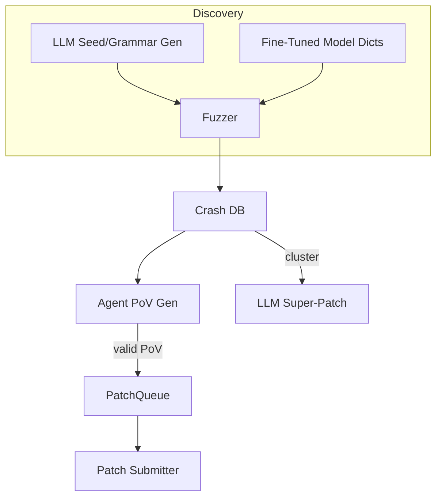

# AI-Assisted Fuzzing और Automated Vulnerability Discovery

{{#include ../banners/hacktricks-training.md}}

## Overview
Large-language models (LLMs) semantically rich inputs generate करके, grammars को evolve करके, crash data पर reasoning करके, और यहां तक कि multi-bug patches propose करके traditional vulnerability-research pipelines को super-charge कर सकते हैं। यह page DARPA’s AI Cyber Challenge (AIxCC) finals और अन्य public research के दौरान देखे गए सबसे effective patterns को collect करता है।<sup>[[4]](#references)</sup><sup>[[5]](#references)</sup>

आगे किसी एक specific competition system का description नहीं है, बल्कि techniques का एक abstraction है, ताकि आप इन्हें अपने workflows में reproduce कर सकें।

---

## 1. LLM-Generated Seed Inputs

Traditional coverage–guided fuzzers (AFL++, libFuzzer, Honggfuzz…) seeds के एक छोटे corpus से शुरू होते हैं और bytes को blindly mutate करते हैं। जब target input format complex होता है (SQL, URLs, custom binary protocols), तो random mutations आमतौर पर interesting branches तक पहुंचने से पहले syntax को तोड़ देती हैं।

LLMs इस bootstrap problem को *seed generators* emit करके solve कर सकते हैं – ऐसे छोटे scripts जो **syntax-correct लेकिन security-relevant inputs** output करते हैं। उदाहरण के लिए:
```prompt
SYSTEM: You are a helpful security engineer.
USER:
Write a Python3 program that prints 200 unique SQL injection strings targeting common anti-pattern mistakes (missing quotes, numeric context, stacked queries).  Ensure length ≤ 256 bytes / string so they survive common length limits.
```

```python
# gen_sqli_seeds.py (truncated)
PAYLOADS = [
"1 OR 1=1 -- ",
"' UNION SELECT NULL,NULL--",
"0; DROP TABLE users;--",
...
]
for p in PAYLOADS:
print(p)
```
इसे एक बार चलाएँ और आउटपुट को सीधे fuzzer के initial corpus में feed करें:
```bash
python3 gen_sqli_seeds.py > seeds.txt
afl-fuzz -i seeds.txt -o findings/ -- ./target @@
```
लाभ:
1. Semantic validity → शुरुआत में ही अधिक गहरी coverage।
2. दोबारा generate किया जा सकता है: XSS, path traversal, binary blobs आदि पर ध्यान केंद्रित करने के लिए prompt में बदलाव करें।
3. सस्ता (< 1 ¢ with GPT-3.5)।

### सुझाव
* सतही filters को bypass करने के लिए model को payload की लंबाई और encoding (UTF-8, URL-encoded, UTF-16-LE) में *विविधता* लाने का निर्देश दें।
* एक *single self-contained script* माँगें – इससे JSON formatting की समस्याएँ नहीं होतीं।

---

## 2. Grammar-Evolution Fuzzing

एक अधिक शक्तिशाली variant यह है कि LLM से concrete seeds के बजाय **grammar evolve** करवाया जाए। इसका workflow (“Grammar Guy” pattern) इस प्रकार है:

1. Prompt के माध्यम से एक initial ANTLR/Peach/LibFuzzer grammar generate करें।
2. N मिनट तक fuzz करें और coverage metrics (hit किए गए edges / blocks) एकत्र करें।
3. Uncovered program areas का सारांश बनाकर उसे model को वापस दें:
```prompt
The previous grammar triggered 12 % of the program edges.  Functions not reached: parse_auth, handle_upload.  Add / modify rules to cover these.
```
4. नए rules को merge करें, फिर से fuzz करें और दोहराएँ।

Pseudo-code skeleton:
```python
for epoch in range(MAX_EPOCHS):
grammar = llm.refine(grammar, feedback=coverage_stats)
save(grammar, f"grammar_{epoch}.txt")
coverage_stats = run_fuzzer(grammar)
```
मुख्य बिंदु:
* एक *budget* रखें – प्रत्येक refinement tokens का उपयोग करता है।
* मॉडल को rewrite करने के बजाय edit करने के लिए `diff` + `patch` instructions का उपयोग करें।
* जब Δcoverage < ε हो, तब रुक जाएँ।

---

## 3. Local-LLM libFuzzer Harness Engineering

ऐसे source के लिए जो analyst workstation से बाहर नहीं जा सकता, एक local code model fuzzer bytes और C/C++ API के बीच छोटे adapter का draft तैयार कर सकता है। उपयोगी security boundary स्पष्ट है: **model test infrastructure लिखता और revise करता है; coverage-guided mutation inputs को explore करता है; sanitizers invalid operations की report करते हैं; एक human harness की समीक्षा और findings की triage करता है**।<sup>[[9]](#references)</sup>

ऐसी engine-level corpus, feedback, snapshot और stateful-fuzzing techniques के लिए जो किसी LLM पर निर्भर नहीं हैं, सामान्य [Fuzzing Methodology](../generic-methodologies-and-resources/fuzzing.md) देखें।

Target header से कॉपी की गई exact declaration से शुरुआत करें और output format को constrain करें। एक narrow prompt invented APIs को कम करता है और result की review को आसान बनाता है:<sup>[[8]](#references)[[9]](#references)</sup>
```prompt
Write a libFuzzer target for this exact declaration:
int parse_records(const uint8_t *data, size_t size);

Output only C code. Implement LLVMFuzzerTestOneInput, include the
declaration, pass data and size unchanged, and do not use files,
network access, randomness, clocks, threads, or persistent state.
```
एक raw byte parser के लिए, अपेक्षित परिणाम इससे अधिक जटिल नहीं होना चाहिए:<sup>[[6]](#references)[[9]](#references)</sup>
```c
#include <stddef.h>
#include <stdint.h>

extern int parse_records(const uint8_t *, size_t);

int LLVMFuzzerTestOneInput(const uint8_t *data, size_t size) {
(void)parse_records(data, size);
return 0;
}
```
Compilation केवल पहला validation gate है। किसी target पर CPU time खर्च करने से पहले प्रत्येक generated target की इन invariants के विरुद्ध समीक्षा करें:<sup>[[6]](#references)[[8]](#references)[[9]](#references)</sup>

- **Exact API:** types, ownership rules, initialization, teardown और calling convention की तुलना वास्तविक header और मौजूदा callers के साथ करें।
- **Harness safety:** `data` से होने वाले प्रत्येक read को guard करें; sanitizer findings target से उत्पन्न होने चाहिए, generated glue से नहीं।
- **Repeatability:** परिणाम `data` और `size` का function बनाएं; external I/O, time, uncontrolled randomness, unjoined threads और calls के बीच बने रहने वाले state को हटाएं।
- **Throughput:** महंगे immutable state को केवल तभी एक बार initialize करें जब इससे behavior प्रभावित न हो, input size को सीमित करें, logging को suppress करें और per-input allocations को free करें।
- **Reachability:** सत्यापित करें कि intended functions और branches execute हो रहे हैं। ऐसा target जो compile तो हो जाता है, लेकिन केवल rejection paths को exercise करता है, एक silent failure है।

### Structure-aware targets: bugs छिपाए बिना invariants सुरक्षित रखें

यदि अधिकांश raw inputs magic, length, version या checksum gate पर fail हो जाते हैं, तो fuzz bytes को **typed field material** के रूप में उपयोग करें और एक valid object को फिर से बनाएं। Format constants को ठीक करें, semantic fields और payload bytes को mutable रखें, और reconstructed payload से integrity metadata derive करें। `FuzzedDataProvider` bounded typed values को consume करने के लिए उपयोगी है, जबकि किसी भी generated allocation और conversion को सीमित करने की जिम्मेदारी adapter की रहती है।<sup>[[9]](#references)</sup>

<details>
<summary>Structure-aware C++ target का उदाहरण</summary>
```cpp
#include <fuzzer/FuzzedDataProvider.h>
#include <stddef.h>
#include <stdint.h>
#include <vector>

extern "C" int parse_message(const uint8_t *, size_t);

extern "C" int LLVMFuzzerTestOneInput(const uint8_t *data, size_t size) {
FuzzedDataProvider fdp(data, size);
uint8_t version = fdp.ConsumeIntegral<uint8_t>();
auto body = fdp.ConsumeRemainingBytes<uint8_t>();
if (body.size() > UINT16_MAX) body.resize(UINT16_MAX);
uint16_t len = static_cast<uint16_t>(body.size());
std::vector<uint8_t> msg = {0x8b, 'M', 'S', 'G', version,
static_cast<uint8_t>(len >> 8),
static_cast<uint8_t>(len)};
msg.insert(msg.end(), body.begin(), body.end());
(void)parse_message(msg.data(), msg.size());
return 0;
}
```
</details>

हर question के लिए एक ही structure-repairing target का उपयोग न करें। एक target ऐसा रखें जो deep valid states को explore करने के लिए lengths/checksums derive करे, और दूसरा ऐसा रखें जो **declared** metadata को fuzzer-controlled बनाए रखते हुए केवल harness की अपनी reads और allocations को bound करे। दूसरा target उन mismatched-length और bad-integrity attack surfaces को बनाए रखता है जिन्हें automatic repair अन्यथा मिटा देता।<sup>[[9]](#references)</sup>

### Seeds, dictionaries, sanitizers, और coverage feedback

Model से binary को सीधे print करने के बजाय ऐसा script generate करने को कहें जो binary seeds लिखे। Empty, minimal, typical, और boundary-valid objects से seed करें; फिर magic values, tags, enum encodings, और parser keywords को एक reviewed dictionary में extract करें। libFuzzer उस dictionary को `-dict=` के साथ स्वीकार करता है और corpus में new coverage उजागर करने वाले mutations को बनाए रखता है।<sup>[[6]](#references)[[9]](#references)</sup>
```text
magic="\x8bMSG"
version_min="\x00"
version_max="\xff"
config_tag="CONFIG"
```
समान target को complementary instrumentation के साथ build करें। ASan और UBSan एक fuzzing binary साझा कर सकते हैं; एक अलग MSan build का उपयोग करें और uninstrumented code के कारण आने वाली reports से बचने के लिए इसकी dependencies को instrument करें।<sup>[[6]](#references)[[9]](#references)</sup>
```bash
clang++ -g -O1 -fsanitize=fuzzer,address,undefined \
-fno-sanitize-recover=undefined target.cc harness.cc -o fuzz_target
./fuzz_target corpus -dict=msg.dict -max_len=65535

clang++ -g -O1 -fsanitize=fuzzer,memory \
target.cc harness.cc -o fuzz_target_msan
```
प्रत्येक model revision के लिए coverage को evaluator मानें। libFuzzer output में शुरुआती flat `cov`/`ft` और static corpus आमतौर पर bad framing, अत्यधिक restrictive early return, या गलत call का संकेत देते हैं; कम `exec/s` expensive setup, I/O, allocation या leaked state की ओर संकेत करता है। `NEW` केवल यह साबित करता है कि coverage feature बदला है, यह नहीं कि इच्छित parser तक पहुँचा गया है।<sup>[[6]](#references)[[9]](#references)</sup>

Source-level feedback के लिए coverage build बनाएँ, उसे fuzz करें, और model को केवल वे uncovered functions तथा उनकी guarding conditions दें। परिणामी harness/seed/dictionary diff को verify करें और फिर से measurement करें:<sup>[[7]](#references)[[8]](#references)[[9]](#references)</sup>
```bash
clang++ -g -O1 -fsanitize=fuzzer \
-fprofile-instr-generate -fcoverage-mapping target.cc harness.cc -o fuzz_cov
mkdir -p profiles
LLVM_PROFILE_FILE='profiles/%p.profraw' ./fuzz_cov -max_total_time=300 corpus
llvm-profdata merge -sparse profiles/*.profraw -o fuzz.profdata
llvm-cov report ./fuzz_cov -instr-profile=fuzz.profdata
llvm-cov show ./fuzz_cov -instr-profile=fuzz.profdata \
--show-branches=count --region-coverage-lt=1 target.cc
```
इसलिए scalable loop है **generate → compile/link → sanitizers के अंतर्गत smoke-test → target coverage मापना → सबसे छोटा relevant coverage/source context देना → revise → फिर से measure करना**। OSS-Fuzz-Gen भी इसी principle को लागू करता है: generated targets को compilability, runtime failures, coverage और existing targets की तुलना में coverage improvement के आधार पर evaluate करता है, बजाय इसके कि plausible code को सीधे स्वीकार कर लिया जाए।<sup>[[7]](#references)[[8]](#references)</sup>

---

## 4. Agent-Based PoV (Exploit) Generation

Crash मिलने के बाद भी आपको एक **proof-of-vulnerability (PoV)** चाहिए, जो उसे deterministic तरीके से trigger करे।

एक scalable approach यह है कि कई lightweight workers (processes, threads या containers) शुरू किए जाएँ, जिनमें से प्रत्येक अलग model या sampling configuration का उपयोग करे। AIxCC finalist survey ठोस scale examples देता है: एक team ने AI-first PoV generation के लिए **हजारों concurrent agents** का उपयोग किया, जबकि दूसरी team ने **300–500 fuzzing agents** को orchestrate किया और LLMs को higher-level semantic reasoning के लिए reserve रखा।<sup>[[4]](#references)</sup>

Pipeline:
1. Static/ dynamic analysis से *bug candidates* (crash PC, input slice, sanitizer msg वाला struct) प्राप्त होते हैं।
2. Orchestrator candidates को agents में distribute करता है।
3. Agent reasoning steps:
a. `gdb` + input के साथ bug को locally reproduce करें।
b. Minimal exploit payload सुझाएँ।
c. Sandbox में exploit को validate करें।  यदि success → submit करें।
4. Failed attempts को coverage fuzzing के लिए **new seeds के रूप में re-queue** किया जाता है (feedback loop)।

Advantages:
* Parallelisation single-agent unreliability को छिपाती है।
* Observed success-rate के आधार पर temp / model size का auto-tuning होता है।

---

## 5. Directed Fuzzing with Fine-Tuned Code Models

एक open-weight model (जैसे Llama-7B) को vulnerability patterns (integer overflow, buffer copy, format string) के साथ labelled C/C++ source पर fine-tune करें। फिर:

1. Function list + AST प्राप्त करने के लिए static analysis चलाएँ।
2. Model को prompt करें: *“Give mutation dictionary entries that are likely to break memory safety in function X”*.
3. उन tokens को custom `AFL_CUSTOM_MUTATOR` में insert करें।

एक `sprintf` wrapper के लिए example output:
```
{"pattern":"%99999999s"}
{"pattern":"AAAAAAAA....<1024>....%n"}
```
Empirically, वास्तविक targets पर यह time-to-crash को >2× कम करता है।

---

## 6. AI-निर्देशित Patching Strategies

### 6.1 Super Patches
Model से crash signatures को *cluster* करने और **एक single patch** प्रस्तावित करने के लिए कहें, जो common root cause को दूर कर दे। एक बार submit करें, कई bugs ठीक करें → ऐसे environments में कम accuracy penalties, जहाँ हर गलत patch के लिए points कटते हैं।

Prompt outline:
```
Here are 10 stack traces + file snippets.  Identify the shared mistake and generate a unified diff fixing all occurrences.
```
### 6.2 Speculative Patch Ratio
एक queue लागू करें, जिसमें confirmed PoV-validated patches और *speculative* patches (बिना PoV) scoring rules के अनुसार निर्धारित 1:​N ratio में interleave हों (जैसे, 2 speculative : 1 confirmed)। एक cost model penalties बनाम points की निगरानी करता है और N को स्वयं समायोजित करता है।

---

## 7. Deterministic File-by-File AI Code Review

AI-assisted review में एक सामान्य failure mode यह है कि एक agent से पूरे repository का निरीक्षण करने और सही files तथा grep terms चुनने की उम्मीद की जाए। अधिक reliable pattern है **repository coverage को force करना**:<sup>[[1]](#references)</sup>

1. Source files को enumerate करें।
2. न्यूनतम context (entrypoint, imports, nearby routes/callers) के साथ **एक बार में एक file** भेजें।
3. प्रत्येक file के लिए एक **structured report** आवश्यक करें: sources, sink, missing validation, exploit preconditions और confidence।<sup>[[3]](#references)</sup>
4. Reports को **source→sink pattern** के आधार पर deduplicate करें और high-risk ones को manually validate करें।

इसमें बहुत tokens लगते हैं और noise भी होता है, लेकिन broad agentic reviews द्वारा अक्सर छूट जाने वाले **simple high-impact source/sink bugs** को सामने लाने में यह बहुत प्रभावी है।

### Triage patterns worth prioritising

- **Dynamic PHP include/dispatch**: attacker-controlled route/controller/module names का `require_once()`, `include()` या `include_once()` तक strict allowlisting और path canonicalisation के बिना flow होना।
- **Shell execution in admin/account workflows**: usernames, domains, FTP accounts या अन्य identifiers का `exec()`, `system()`, `shell_exec()`, `passthru()`, `proc_open()` या `popen()` तक पहुँचना।
- **Structured input fan-in**: वही parameter `$_GET`, `$_POST`, JSON, XML या framework body parsers से स्वीकार किया जाना और बाद में filesystem या OS-command sinks में reuse होना।

### Two practical bug classes this method finds well

- **PHP controller-dispatch LFI/RCE**: यदि request-controlled controller name को बिना allowlist/path normalisation के `require_once()` में concatenate किया जाता है, तो `../` जैसी traversal sequences PHP से unintended local `.php` file include करवा सकती हैं। यदि attacker include को किसी planted या अन्यथा उपयोगी PHP file की ओर point कर सकता है, तो LFI code execution में बदल जाता है। [File Inclusion / Path Traversal](../pentesting-web/file-inclusion/README.md) देखें।<sup>[[1]](#references)</sup>
- **Authenticated command injection in hosting/admin panels**: यदि usernames जैसे account-management fields को shell commands में embed किया जाता है, तो low-privileged authenticated user सामान्य create/delete action को RCE में बदल सकता है। जब panel command को अधिक privileged service account के रूप में execute करता है, तब impact बढ़ जाता है। [Command Injection](../pentesting-web/command-injection.md) देखें।<sup>[[1]](#references)</sup>

### Practical review notes

- LLM का उपयोग पहले **source/sink reviewer** के रूप में करें, exploit generator के रूप में नहीं।
- उससे **attacker-controlled field**, **normalization/validation gap** और **dangerous sink** को स्पष्ट रूप से list करने के लिए कहें।
- बड़े repos के लिए deterministic per-file review अक्सर single autonomous agent run से अधिक reliable होता है, भले ही बाद वाला stronger model का उपयोग करता हो।<sup>[[2]](#references)</sup>
- **Broken Access Control** और अन्य business-logic bugs पर कमजोर results की अपेक्षा रखें, जहाँ exploitability cross-file assumptions, role semantics या product-specific threat models पर निर्भर करती है।

---

## Putting It All Together
एक end-to-end CRS (Cyber Reasoning System) components को इस तरह wire कर सकता है:

```mermaid
graph TD
subgraph Discovery
A[LLM Seed/Grammar Gen] --> B[Fuzzer]
C[Fine-Tuned Model Dicts] --> B
end
B --> D[Crash DB]
D --> E[Agent PoV Gen]
E -->|valid PoV| PatchQueue
D -->|cluster| F[LLM Super-Patch]
PatchQueue --> G[Patch Submitter]
```
---

## References

- [1] [Project Black - Cyber Security के लिए Local AI: phpIPAM LFI और myVesta Authenticated RCE ढूँढना](https://projectblack.io/blog/local-ai-for-cyber-security)
- [2] [Strix](https://github.com/usestrix/strix)
- [3] [GitHub Copilot community का security-review skill](https://github.com/github/awesome-copilot/blob/main/skills/security-review/SKILL.md)
- [4] [Trail of Bits – AIxCC finals: Tale of the tape](https://blog.trailofbits.com/2025/08/07/aixcc-finals-tale-of-the-tape/)
- [5] [CTF Radiooo AIxCC finalist interviews](https://www.youtube.com/@ctfradiooo)
- [6] [LLVM — libFuzzer: coverage-guided fuzz testing के लिए एक library](https://llvm.org/docs/LibFuzzer.html)
- [7] [Google — OSS-Fuzz-Gen](https://github.com/google/oss-fuzz-gen)
- [8] [Google Online Security Blog — Fuzzing को बेहतर बनाना: AI के साथ अधिक Vulnerabilities ढूँढना](https://security.googleblog.com/2024/11/leveling-up-fuzzing-finding-more.html)
- [9] [8kSec — Local LLM के साथ AI-Assisted Fuzzing Harness Generation](https://8ksec.io/ai-assisted-fuzzing-harness-local-llm)
{{#include ../banners/hacktricks-training.md}}
