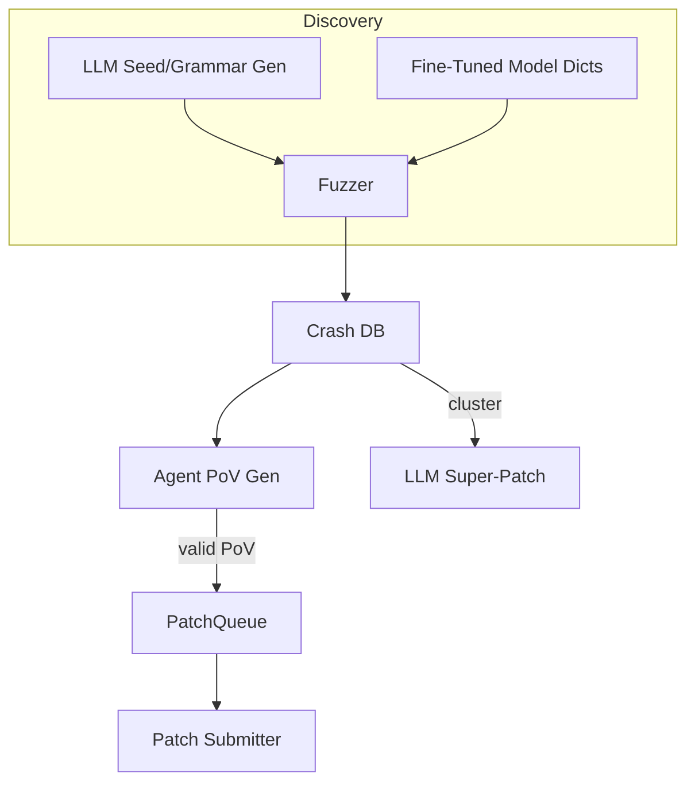

# AI-Assisted Fuzzing और Automated Vulnerability Discovery

{{#include ../banners/hacktricks-training.md}}

## Overview
Large-language models (LLMs), semantically rich inputs generate करके, grammars को evolve करके, crash data पर reasoning करके, और यहां तक कि multi-bug patches प्रस्तावित करके, traditional vulnerability-research pipelines को super-charge कर सकते हैं। यह पेज DARPA’s AI Cyber Challenge (AIxCC) finals और अन्य public research के दौरान देखे गए सबसे प्रभावी patterns को एकत्र करता है।<sup>[[4]](#references)</sup><sup>[[5]](#references)</sup>

आगे किसी एक specific competition system का विवरण नहीं दिया गया है, बल्कि techniques का एक abstraction प्रस्तुत किया गया है, ताकि आप इन्हें अपने workflows में reproduce कर सकें।

---

## 1. LLM-Generated Seed Inputs

Traditional coverage–guided fuzzers (AFL++, libFuzzer, Honggfuzz…) seeds के एक छोटे corpus से शुरू होते हैं और bytes को blind तरीके से mutate करते हैं। जब target input format complex होता है (SQL, URLs, custom binary protocols), तो random mutations आमतौर पर interesting branches तक पहुंचने से पहले ही syntax को तोड़ देती हैं।

LLMs इस bootstrap problem को seed generators उत्पन्न करके हल कर सकते हैं – ये छोटी scripts होती हैं जो **syntax-correct लेकिन security-relevant inputs** output करती हैं। उदाहरण के लिए:
```prompt
SYSTEM: You are a helpful security engineer.
USER:
Write a Python3 program that prints 200 unique SQL injection strings targeting common anti-pattern mistakes (missing quotes, numeric context, stacked queries).  Ensure length ≤ 256 bytes / string so they survive common length limits.
```

```python
# gen_sqli_seeds.py (truncated)
PAYLOADS = [
"1 OR 1=1 -- ",
"' UNION SELECT NULL,NULL--",
"0; DROP TABLE users;--",
...
]
for p in PAYLOADS:
print(p)
```
एक बार चलाएँ और आउटपुट को सीधे fuzzer के initial corpus में feed करें:
```bash
python3 gen_sqli_seeds.py > seeds.txt
afl-fuzz -i seeds.txt -o findings/ -- ./target @@
```
लाभ:
1. Semantic validity → शुरुआत में ही अधिक गहरी coverage।
2. दोबारा generate किया जा सकता है: XSS, path traversal, binary blobs आदि पर ध्यान केंद्रित करने के लिए prompt में बदलाव करें।
3. सस्ता (< 1 ¢ with GPT-3.5)।

### सुझाव
* superficial filters को bypass करने के लिए model को payload की length और encoding (UTF-8, URL-encoded, UTF-16-LE) में *विविधता* लाने का निर्देश दें।
* एक *single self-contained script* मांगें – इससे JSON formatting की समस्याएं नहीं आतीं।

---

## 2. Grammar-Evolution Fuzzing

एक अधिक शक्तिशाली variant में concrete seeds के बजाय LLM से **grammar evolve** कराया जाता है। इसका workflow (“Grammar Guy” pattern) है:

1. prompt के माध्यम से initial ANTLR/Peach/LibFuzzer grammar generate करें।
2. N मिनट तक fuzz करें और coverage metrics (hit हुए edges / blocks) एकत्र करें।
3. uncovered program areas का सारांश बनाकर उसे model को वापस दें:
```prompt
The previous grammar triggered 12 % of the program edges.  Functions not reached: parse_auth, handle_upload.  Add / modify rules to cover these.
```
4. नए rules को merge करें, फिर से fuzz करें और दोहराएं।

Pseudo-code skeleton:
```python
for epoch in range(MAX_EPOCHS):
grammar = llm.refine(grammar, feedback=coverage_stats)
save(grammar, f"grammar_{epoch}.txt")
coverage_stats = run_fuzzer(grammar)
```
मुख्य बिंदु:
* एक *budget* रखें – हर refinement में tokens का उपयोग होता है।
* मॉडल को दोबारा लिखने के बजाय edit करने के लिए `diff` + `patch` instructions का उपयोग करें।
* जब Δcoverage < ε हो, तब रुक जाएँ।

---

## 3. Agent-Based PoV (Exploit) Generation

Crash मिलने के बाद भी आपको एक **proof-of-vulnerability (PoV)** की आवश्यकता होती है, जो उसे deterministically trigger करे।

एक scalable approach यह है कि कई lightweight workers (processes, threads, या containers) शुरू किए जाएँ, जिनमें से प्रत्येक अलग model या sampling configuration का उपयोग करे। AIxCC finalist survey ठोस scale examples देता है: एक team ने AI-first PoV generation के लिए **thousands of concurrent agents** का उपयोग किया, जबकि दूसरी team ने **300–500 fuzzing agents** को orchestrate किया और LLMs को higher-level semantic reasoning के लिए reserve रखा।<sup>[[4]](#references)</sup>

Pipeline:
1. Static/ dynamic analysis *bug candidates* (crash PC, input slice, sanitizer msg वाला struct) तैयार करता है।
2. Orchestrator candidates को agents में distribute करता है।
3. Agent reasoning steps:
a. `gdb` + input का उपयोग करके bug को locally reproduce करें।
b. Minimal exploit payload सुझाएँ।
c. Sandbox में exploit को validate करें।  यदि success → submit करें।
4. Failed attempts को coverage fuzzing के लिए **new seeds** के रूप में **re-queue** किया जाता है (feedback loop)।

Advantages:
* Parallelisation single-agent unreliability को छिपा देती है।
* Observed success-rate के आधार पर temp / model size की auto-tuning।

---

## 4. Fine-Tuned Code Models के साथ Directed Fuzzing

एक open-weight model (जैसे Llama-7B) को vulnerability patterns (integer overflow, buffer copy, format string) के साथ labelled C/C++ source पर fine-tune करें। फिर:

1. Function list + AST प्राप्त करने के लिए static analysis चलाएँ।
2. Model को prompt करें: *“Give mutation dictionary entries that are likely to break memory safety in function X”*.
3. उन tokens को custom `AFL_CUSTOM_MUTATOR` में insert करें।

एक `sprintf` wrapper के लिए example output:
```
{"pattern":"%99999999s"}
{"pattern":"AAAAAAAA....<1024>....%n"}
```
अनुभवजन्य रूप से, वास्तविक targets पर यह time-to-crash को 2× से अधिक कम करता है।

---

## 5. AI-Guided Patching Strategies

### 5.1 Super Patches
मॉडल से crash signatures को *cluster* करने और एक **single patch** प्रस्तावित करने के लिए कहें, जो सामान्य root cause को दूर कर दे। एक बार submit करें, कई bugs ठीक करें → ऐसे environments में कम accuracy penalties, जहाँ प्रत्येक गलत patch के लिए points कटते हैं।

Prompt outline:
```
Here are 10 stack traces + file snippets.  Identify the shared mistake and generate a unified diff fixing all occurrences.
```
### 5.2 Speculative Patch Ratio
एक queue लागू करें, जिसमें confirmed PoV-validated patches और *speculative* patches (बिना PoV) को scoring rules के अनुसार निर्धारित 1:​N ratio में interleave किया जाए (जैसे, 2 speculative : 1 confirmed)। एक cost model penalties बनाम points की निगरानी करता है और N को स्वयं adjust करता है।

---

## 6. Deterministic File-by-File AI Code Review

AI-assisted review में एक सामान्य failure mode यह है कि एक agent से पूरे repository का inspection करने को कहा जाता है और उम्मीद की जाती है कि वह सही files और grep terms चुनेगा। एक अधिक reliable pattern है **repository coverage को force करना**:<sup>[[1]](#references)</sup>

1. Source files की enumeration करें।
2. एक बार में **एक file** भेजें, साथ में minimal context (entrypoint, imports, nearby routes/callers) दें।
3. प्रत्येक file के लिए **structured report** आवश्यक करें: sources, sink, missing validation, exploit preconditions और confidence।<sup>[[3]](#references)</sup>
4. Reports को **source→sink pattern** के आधार पर deduplicate करें और high-risk वाले reports को manually validate करें।

इसमें बहुत tokens लगते हैं और noise भी होता है, लेकिन broad agentic reviews द्वारा अक्सर छूट जाने वाले **simple high-impact source/sink bugs** सामने लाने में यह बहुत effective है।

### Triage patterns worth prioritising

- **Dynamic PHP include/dispatch**: attacker-controlled route/controller/module names का `require_once()`, `include()`, या `include_once()` तक flow होना, जबकि strict allowlisting और path canonicalisation मौजूद न हो।
- **Shell execution in admin/account workflows**: usernames, domains, FTP accounts या अन्य identifiers का `exec()`, `system()`, `shell_exec()`, `passthru()`, `proc_open()` या `popen()` तक पहुंचना।
- **Structured input fan-in**: एक ही parameter का `$_GET`, `$_POST`, JSON, XML या framework body parsers से स्वीकार किया जाना और बाद में filesystem या OS-command sinks में reuse होना।

### Two practical bug classes this method finds well

- **PHP controller-dispatch LFI/RCE**: यदि request-controlled controller name को बिना allowlist/path normalisation के `require_once()` में concatenate किया जाता है, तो `../` जैसी traversal sequences PHP को किसी unintended local `.php` file को include करने के लिए बाध्य कर सकती हैं। यदि attacker include को किसी planted या अन्यथा useful PHP file की ओर point कर सकता है, तो LFI code execution में बदल जाता है। देखें [File Inclusion / Path Traversal](../pentesting-web/file-inclusion/README.md)।<sup>[[1]](#references)</sup>
- **Authenticated command injection in hosting/admin panels**: यदि usernames जैसे account-management fields को shell commands में embed किया जाता है, तो low-privileged authenticated user सामान्य create/delete action को RCE में बदल सकता है। जब panel command को अधिक privileged service account के रूप में execute करता है, तब impact बढ़ जाता है। देखें [Command Injection](../pentesting-web/command-injection.md)।<sup>[[1]](#references)</sup>

### Practical review notes

- LLM का उपयोग पहले **source/sink reviewer** के रूप में करें, exploit generator के रूप में नहीं।
- उससे **attacker-controlled field**, **normalization/validation gap** और **dangerous sink** को स्पष्ट रूप से list करने को कहें।
- बड़े repos के लिए deterministic per-file review अक्सर single autonomous agent run से अधिक reliable होता है, भले ही बाद वाला stronger model का उपयोग करता हो।<sup>[[2]](#references)</sup>
- **Broken Access Control** और अन्य business-logic bugs पर कमजोर results की अपेक्षा रखें, जहां exploitability cross-file assumptions, role semantics या product-specific threat models पर निर्भर करती है।

---

## Putting It All Together
एक end-to-end CRS (Cyber Reasoning System) components को इस प्रकार wire कर सकता है:

```mermaid
graph TD
subgraph Discovery
A[LLM Seed/Grammar Gen] --> B[Fuzzer]
C[Fine-Tuned Model Dicts] --> B
end
B --> D[Crash DB]
D --> E[Agent PoV Gen]
E -->|valid PoV| PatchQueue
D -->|cluster| F[LLM Super-Patch]
PatchQueue --> G[Patch Submitter]
```
---

## References

- [1] [Project Black - Cyber Security के लिए Local AI: phpIPAM LFI और myVesta Authenticated RCE ढूँढना](https://projectblack.io/blog/local-ai-for-cyber-security)
- [2] [Strix](https://github.com/usestrix/strix)
- [3] [GitHub Copilot community security-review skill](https://github.com/github/awesome-copilot/blob/main/skills/security-review/SKILL.md)
- [4] [Trail of Bits – AIxCC finals: tape की कहानी](https://blog.trailofbits.com/2025/08/07/aixcc-finals-tale-of-the-tape/)
- [5] [CTF Radiooo AIxCC finalist interviews](https://www.youtube.com/@ctfradiooo)
{{#include ../banners/hacktricks-training.md}}
