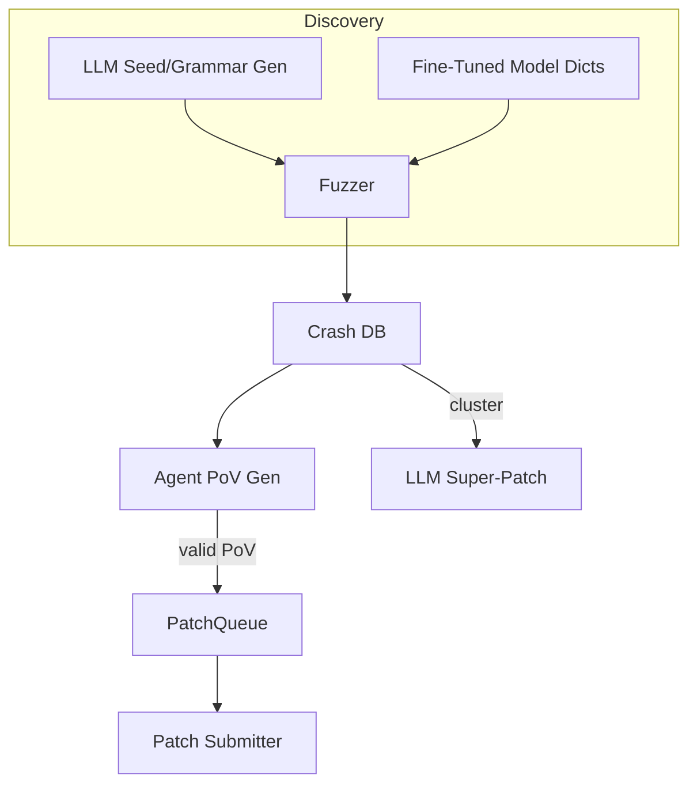

# Fuzzing Inayosaidiwa na AI na Ugunduzi wa Kiotomatiki wa Vulnerability

{{#include ../banners/hacktricks-training.md}}

## Muhtasari
Large-language models (LLMs) zinaweza kuongeza kwa kiasi kikubwa nguvu za vulnerability-research pipelines za kawaida kwa kuzalisha inputs zenye maana ya kisemantiki, kuboresha grammars, kufanya reasoning kuhusu crash data, na hata kupendekeza patches za multi-bug. Ukurasa huu unakusanya patterns zenye ufanisi zaidi zilizoonekana wakati wa fainali za DARPA’s AI Cyber Challenge (AIxCC) na tafiti nyingine za umma.<sup>[[4]](#references)</sup><sup>[[5]](#references)</sup>

Kinachofuata si maelezo ya mfumo mmoja mahususi wa mashindano, bali ni muhtasari wa techniques ili uweze kuzitumia tena katika workflows zako mwenyewe.

---

## 1. LLM-Generated Seed Inputs

Traditional coverage–guided fuzzers (AFL++, libFuzzer, Honggfuzz…) huanza na corpus ndogo ya seeds na kubadilisha bytes bila mpangilio. Wakati target input format ni changamano (SQL, URLs, custom binary protocols), random mutations kwa kawaida huharibu syntax kabla ya kufikiwa kwa branches zinazovutia.

LLMs zinaweza kutatua tatizo hili la bootstrap kwa kutoa *seed generators* – scripts fupi zinazotoa **inputs zilizo sahihi kisintaksia lakini zinazohusiana na usalama**. Kwa mfano:
```prompt
SYSTEM: You are a helpful security engineer.
USER:
Write a Python3 program that prints 200 unique SQL injection strings targeting common anti-pattern mistakes (missing quotes, numeric context, stacked queries).  Ensure length ≤ 256 bytes / string so they survive common length limits.
```

```python
# gen_sqli_seeds.py (truncated)
PAYLOADS = [
"1 OR 1=1 -- ",
"' UNION SELECT NULL,NULL--",
"0; DROP TABLE users;--",
...
]
for p in PAYLOADS:
print(p)
```
Endesha mara moja na upeleke matokeo moja kwa moja kwenye initial corpus ya fuzzer:
```bash
python3 gen_sqli_seeds.py > seeds.txt
afl-fuzz -i seeds.txt -o findings/ -- ./target @@
```
Benefits:
1. Uhalali wa kimaana → coverage ya kina mapema.
2. Inaweza kuzalishwa upya: rekebisha prompt ili kulenga XSS, path traversal, binary blobs, n.k.
3. Nafuu (< 1 ¢ kwa GPT-3.5).

### Vidokezo
* Iagize model *ibadilishe* urefu na encoding ya payload (UTF-8, URL-encoded, UTF-16-LE) ili kupita filters za juu juu.
* Omba *script moja inayojitosheleza* – huepuka matatizo ya uumbizaji wa JSON.

---

## 2. Grammar-Evolution Fuzzing

Toleo lenye nguvu zaidi ni kuiruhusu LLM **ikuze grammar** badala ya seeds halisi.  Mtiririko wa kazi (muundo wa “Grammar Guy”) ni:

1. Zalisha grammar ya awali ya ANTLR/Peach/LibFuzzer kupitia prompt.
2. Fuzz kwa dakika N na kukusanya metrics za coverage (edges / blocks zilizofikiwa).
3. Fanya muhtasari wa maeneo ya program ambayo hayajafikiwa na urudishe muhtasari huo kwenye model:
```prompt
The previous grammar triggered 12 % of the program edges.  Functions not reached: parse_auth, handle_upload.  Add / modify rules to cover these.
```
4. Unganisha rules mpya, fanya fuzz tena, kisha urudie.

Muundo wa pseudo-code:
```python
for epoch in range(MAX_EPOCHS):
grammar = llm.refine(grammar, feedback=coverage_stats)
save(grammar, f"grammar_{epoch}.txt")
coverage_stats = run_fuzzer(grammar)
```
Mambo muhimu:
* Weka *budget* – kila refinement hutumia tokens.
* Tumia maagizo ya `diff` + `patch` ili model ihariri badala ya kuandika upya.
* Simama wakati Δcoverage < ε.

---

## 3. Local-LLM libFuzzer Harness Engineering

Kwa source code ambayo haiwezi kuondoka kwenye analyst workstation, code model ya ndani inaweza kuandaa adapter ndogo kati ya fuzzer bytes na C/C++ API. Security boundary inayofaa iko wazi: **model huandika na kurekebisha test infrastructure; coverage-guided mutation huchunguza inputs; sanitizers huripoti operations zisizo halali; human hukagua harness na kufanya triage ya findings**.<sup>[[9]](#references)</sup>

Kwa mbinu za engine-level corpus, feedback, snapshot, na stateful-fuzzing ambazo hazitegemei LLM, tazama [Fuzzing Methodology](../generic-methodologies-and-resources/fuzzing.md) ya jumla.

Anza na declaration halisi iliyonakiliwa kutoka kwenye target header na uweke masharti ya output format. Prompt finyu hupunguza APIs zilizobuniwa na hurahisisha ukaguzi wa matokeo:<sup>[[8]](#references)[[9]](#references)</sup>
```prompt
Write a libFuzzer target for this exact declaration:
int parse_records(const uint8_t *data, size_t size);

Output only C code. Implement LLVMFuzzerTestOneInput, include the
declaration, pass data and size unchanged, and do not use files,
network access, randomness, clocks, threads, or persistent state.
```
Kwa parser ya raw byte, matokeo yanayotarajiwa hayapaswi kuwa magumu zaidi ya:<sup>[[6]](#references)[[9]](#references)</sup>
```c
#include <stddef.h>
#include <stdint.h>

extern int parse_records(const uint8_t *, size_t);

int LLVMFuzzerTestOneInput(const uint8_t *data, size_t size) {
(void)parse_records(data, size);
return 0;
}
```
Compilation ni lango la kwanza tu la validation. Kagua kila target iliyozalishwa dhidi ya kanuni hizi kabla ya kutumia muda wa CPU kuitekeleza:<sup>[[6]](#references)[[8]](#references)[[9]](#references)</sup>

- **Exact API:** linganisha types, sheria za ownership, initialization, teardown, na calling convention na header halisi pamoja na callers zilizopo.
- **Usalama wa harness:** linda kila usomaji kutoka `data`; matokeo ya sanitizer lazima yatokane na target, si glue code iliyozalishwa.
- **Repeatability:** fanya matokeo yawe function ya `data` na `size`; ondoa external I/O, muda, randomness isiyodhibitiwa, threads ambazo hazijaunganishwa, na state inayobaki kati ya calls.
- **Throughput:** initialize state nzito isiyobadilika mara moja tu pale ambapo hilo haliwezi kuathiri behavior, weka kikomo cha input size, zuia logging, na free allocations za kila input.
- **Reachability:** thibitisha kwamba functions na branches zilizokusudiwa zina-execute. Target inayocompile lakini inayotekeleza rejection paths pekee ni silent failure.

### Structure-aware targets: hifadhi invariants bila kuficha bugs

Ikiwa inputs nyingi ghafi hushindwa kwenye gate ya magic, length, version, au checksum, tumia fuzz bytes kama **typed field material** na ujenge upya object halali. Rekebisha format constants, acha semantic fields na payload bytes zibaki mutable, kisha derive integrity metadata kutoka kwenye payload iliyojengwa upya. `FuzzedDataProvider` ni muhimu kwa consuming bounded typed values, huku adapter ikiendelea kuwajibika kwa kuweka kikomo cha allocations na conversions zinazozalishwa.<sup>[[9]](#references)</sup>

<details>
<summary>Mfano wa structure-aware C++ target</summary>
```cpp
#include <fuzzer/FuzzedDataProvider.h>
#include <stddef.h>
#include <stdint.h>
#include <vector>

extern "C" int parse_message(const uint8_t *, size_t);

extern "C" int LLVMFuzzerTestOneInput(const uint8_t *data, size_t size) {
FuzzedDataProvider fdp(data, size);
uint8_t version = fdp.ConsumeIntegral<uint8_t>();
auto body = fdp.ConsumeRemainingBytes<uint8_t>();
if (body.size() > UINT16_MAX) body.resize(UINT16_MAX);
uint16_t len = static_cast<uint16_t>(body.size());
std::vector<uint8_t> msg = {0x8b, 'M', 'S', 'G', version,
static_cast<uint8_t>(len >> 8),
static_cast<uint8_t>(len)};
msg.insert(msg.end(), body.begin(), body.end());
(void)parse_message(msg.data(), msg.size());
return 0;
}
```
</details>

Usitumie target moja ya kurekebisha structure kwa kila swali. Dumisha target moja inayokokotoa lengths/checksums ili kuchunguza states halali za kina, na nyingine inayoweka **declared** metadata chini ya udhibiti wa fuzzer huku ikipunguza tu reads na allocations zinazofanywa na harness yenyewe. Target ya pili huhifadhi attack surfaces za mismatched-length na bad-integrity ambazo automatic repair ingeondoa.<sup>[[9]](#references)</sup>

### Seeds, dictionaries, sanitizers, na coverage feedback

Iombe model itengeneze script inayoandika binary seeds badala ya kuiomba ichapishe binary moja kwa moja. Tumia empty, minimal, typical, na boundary-valid objects kama seeds; kisha toa magic values, tags, enum encodings, na parser keywords na uziweke kwenye dictionary iliyokaguliwa. libFuzzer hupokea dictionary hiyo kwa `-dict=`, na huhifadhi mutations zinazoonyesha coverage mpya kwenye corpus.<sup>[[6]](#references)[[9]](#references)</sup>
```text
magic="\x8bMSG"
version_min="\x00"
version_max="\xff"
config_tag="CONFIG"
```
Tengeneza target hiyo hiyo kwa kutumia instrumentation ya kukamilishana. ASan na UBSan zinaweza kushiriki binary ya fuzzing; tumia build tofauti ya MSan na uweke instrumentation kwenye dependencies zake ili kuepuka ripoti zinazosababishwa na code isiyo na instrumentation.<sup>[[6]](#references)[[9]](#references)</sup>
```bash
clang++ -g -O1 -fsanitize=fuzzer,address,undefined \
-fno-sanitize-recover=undefined target.cc harness.cc -o fuzz_target
./fuzz_target corpus -dict=msg.dict -max_len=65535

clang++ -g -O1 -fsanitize=fuzzer,memory \
target.cc harness.cc -o fuzz_target_msan
```
Chukulia coverage kama evaluator kwa kila marekebisho ya model. Katika output ya libFuzzer, `cov`/`ft` zilizo early-flat na static corpus kwa kawaida humaanisha framing mbaya, early return yenye vizuizi kupita kiasi, au call isiyo sahihi; `exec/s` ya chini huashiria setup yenye gharama kubwa, I/O, allocation, au state iliyovuja. `NEW` inathibitisha tu kwamba coverage feature imebadilika, si kwamba parser iliyokusudiwa ilifikiwa.<sup>[[6]](#references)[[9]](#references)</sup>

Kwa feedback ya source-level, tengeneza coverage build, ifanyie fuzzing, na upe model functions ambazo hazijafikiwa pamoja na guarding conditions zake pekee. Thibitisha diff ya harness/seed/dictionary iliyotokana na mchakato huo na pima tena:<sup>[[7]](#references)[[8]](#references)[[9]](#references)</sup>
```bash
clang++ -g -O1 -fsanitize=fuzzer \
-fprofile-instr-generate -fcoverage-mapping target.cc harness.cc -o fuzz_cov
mkdir -p profiles
LLVM_PROFILE_FILE='profiles/%p.profraw' ./fuzz_cov -max_total_time=300 corpus
llvm-profdata merge -sparse profiles/*.profraw -o fuzz.profdata
llvm-cov report ./fuzz_cov -instr-profile=fuzz.profdata
llvm-cov show ./fuzz_cov -instr-profile=fuzz.profdata \
--show-branches=count --region-coverage-lt=1 target.cc
```
Kwa hivyo, loop inayoweza kupanuka ni **generate → compile/link → smoke-test under sanitizers → measure target coverage → provide the smallest relevant coverage/source context → revise → re-measure**. OSS-Fuzz-Gen hutumia kanuni hiyo hiyo kwa kutathmini targets zilizozalishwa kulingana na compilability, runtime failures, coverage, na coverage improvement dhidi ya targets zilizopo, badala ya kukubali code inayoonekana kuwa sahihi bila kuichunguza.<sup>[[7]](#references)[[8]](#references)</sup>

---

## 4. Uzalishaji wa PoV (Exploit) kwa Kutumia Agents

Baada ya crash kupatikana, bado unahitaji **proof-of-vulnerability (PoV)** inayoi-trigger kwa njia ya deterministic.

Njia inayoweza kupanuka ni kuanzisha workers wengi wepesi (processes, threads, au containers), kila mmoja akitumia model au sampling configuration tofauti. Utafiti wa finalists wa AIxCC unatoa mifano halisi ya scale: timu moja ilitumia **thousands of concurrent agents** kwa ajili ya AI-first PoV generation, huku nyingine ikiendesha **300–500 fuzzing agents** na kuziweka LLMs kwa semantic reasoning ya kiwango cha juu.<sup>[[4]](#references)</sup>

Mtiririko:
1. Static/ dynamic analysis huzalisha *bug candidates* (struct yenye crash PC, input slice, sanitizer msg).
2. Orchestrator husambaza candidates kwa agents.
3. Hatua za agent reasoning:
a. Reproduce bug locally kwa `gdb` + input.
b. Pendekeza exploit payload ndogo zaidi.
c. Validate exploit katika sandbox.  Ikifanikiwa → submit.
4. Majaribio yaliyoshindwa **huwekwa tena kwenye queue kama seeds mpya** kwa coverage fuzzing (feedback loop).

Faida:
* Parallelisation huficha kutotegemeka kwa agent mmoja.
* Auto-tuning ya temp / model size kulingana na success-rate iliyobainika.

---

## 5. Directed Fuzzing kwa kutumia Fine-Tuned Code Models

Fine-tune open-weight model (kwa mfano Llama-7B) kwa C/C++ source iliyowekewa labels za vulnerability patterns (integer overflow, buffer copy, format string).  Kisha:

1. Endesha static analysis ili kupata function list + AST.
2. Prompt model: *“Give mutation dictionary entries that are likely to break memory safety in function X”*.
3. Ingiza tokens hizo kwenye `AFL_CUSTOM_MUTATOR`.

Mfano wa output kwa `sprintf` wrapper:
```
{"pattern":"%99999999s"}
{"pattern":"AAAAAAAA....<1024>....%n"}
```
Kwa majaribio, hii hupunguza muda hadi crash kwa zaidi ya mara 2 kwenye targets halisi.

---

## 6. AI-Guided Patching Strategies

### 6.1 Super Patches
Uliza model *icluster* crash signatures na ipendekeze **patch moja** inayoondoa chanzo cha msingi cha pamoja.  Tuma mara moja, rekebisha bugs kadhaa → penalties chache za accuracy katika mazingira ambapo kila patch isiyo sahihi hugharimu pointi.

Muhtasari wa prompt:
```
Here are 10 stack traces + file snippets.  Identify the shared mistake and generate a unified diff fixing all occurrences.
```
### 6.2 Uwiano wa Speculative Patch
Tekeleza queue ambapo patches zilizothibitishwa na PoV na *speculative* patches (zisizo na PoV) zinaingiliana kwa uwiano wa 1:​N uliorekebishwa kulingana na scoring rules (kwa mfano, speculative 2 : confirmed 1). Cost model hufuatilia penalties dhidi ya points na hujirekebisha N.

---

## 7. Deterministic File-by-File AI Code Review

Hali ya kawaida ya kushindwa katika review inayosaidiwa na AI ni kumuomba agent mmoja kukagua repository nzima na kutumaini kwamba atachagua files na grep terms zinazofaa. Pattern ya kuaminika zaidi ni **kulazimisha repository coverage**:<sup>[[1]](#references)</sup>

1. Orodhesha source files.
2. Tuma **file moja kwa wakati** pamoja na context ndogo (entrypoint, imports, routes/callers zilizo karibu).
3. Mhitaji atoe **structured report** kwa kila file: sources, sink, validation inayokosekana, exploit preconditions, na confidence.<sup>[[3]](#references)</sup>
4. Ondoa reports zinazorudiwa kwa kutumia **source→sink pattern** na uthibitishe mwenyewe zile zenye risk kubwa.

Hii hutumia tokens nyingi na huwa na kelele, lakini ni yenye ufanisi mkubwa katika kubaini **simple high-impact source/sink bugs** ambazo broad agentic reviews mara nyingi hukosa.

### Triage patterns zinazostahili kupewa kipaumbele

- **Dynamic PHP include/dispatch**: majina ya route/controller/module yanayodhibitiwa na attacker yanapita hadi `require_once()`, `include()`, au `include_once()` bila strict allowlisting na path canonicalisation.
- **Shell execution katika admin/account workflows**: usernames, domains, FTP accounts, au identifiers nyingine kufikia `exec()`, `system()`, `shell_exec()`, `passthru()`, `proc_open()`, au `popen()`.
- **Structured input fan-in**: parameter ileile kukubaliwa kutoka `$_GET`, `$_POST`, JSON, XML, au framework body parsers na baadaye kutumiwa tena katika filesystem au OS-command sinks.

### Aina mbili za vitendo za bugs ambazo method hii hupata vizuri

- **PHP controller-dispatch LFI/RCE**: ikiwa jina la controller linalodhibitiwa na request litaunganishwa kwenye `require_once()` bila allowlist/path normalisation, traversal sequences kama `../` zinaweza kufanya PHP ijumuishe local `.php` file isiyokusudiwa. Ikiwa attacker anaweza kuelekeza include kwenye PHP file iliyopandikizwa au yenye manufaa, LFI hubadilika kuwa code execution. Tazama [File Inclusion / Path Traversal](../pentesting-web/file-inclusion/README.md).<sup>[[1]](#references)</sup>
- **Authenticated command injection katika hosting/admin panels**: ikiwa account-management fields kama usernames zitawekwa ndani ya shell commands, authenticated user mwenye privileges ndogo anaweza kubadilisha create/delete action ya kawaida kuwa RCE. Athari huongezeka wakati panel inaendesha command kama service account yenye privileges zaidi. Tazama [Command Injection](../pentesting-web/command-injection.md).<sup>[[1]](#references)</sup>

### Practical review notes

- Tumia LLM kwanza kama **source/sink reviewer**, si kama exploit generator.
- Iombe itaje wazi **attacker-controlled field**, **normalization/validation gap**, na **dangerous sink**.
- Kwa repos kubwa, deterministic per-file review mara nyingi huwa ya kuaminika zaidi kuliko single autonomous agent run, hata wakati wa mwisho unatumia model yenye nguvu zaidi.<sup>[[2]](#references)</sup>
- Tarajia matokeo dhaifu zaidi kwenye **Broken Access Control** na business-logic bugs nyingine ambapo exploitability inategemea cross-file assumptions, role semantics, au product-specific threat models.

---

## Kuunganisha Yote
CRS (Cyber Reasoning System) ya end-to-end inaweza kuunganisha components kama hii:

```mermaid
graph TD
subgraph Discovery
A[LLM Seed/Grammar Gen] --> B[Fuzzer]
C[Fine-Tuned Model Dicts] --> B
end
B --> D[Crash DB]
D --> E[Agent PoV Gen]
E -->|valid PoV| PatchQueue
D -->|cluster| F[LLM Super-Patch]
PatchQueue --> G[Patch Submitter]
```
---

## References

- [1] [Project Black - AI ya Ndani kwa Usalama wa Mtandao: Kugundua phpIPAM LFI na myVesta Authenticated RCE](https://projectblack.io/blog/local-ai-for-cyber-security)
- [2] [Strix](https://github.com/usestrix/strix)
- [3] [Ujuzi wa security-review wa GitHub Copilot community](https://github.com/github/awesome-copilot/blob/main/skills/security-review/SKILL.md)
- [4] [Trail of Bits – Fainali za AIxCC: Simulizi la kulinganisha](https://blog.trailofbits.com/2025/08/07/aixcc-finals-tale-of-the-tape/)
- [5] [Mahojiano ya washiriki wa fainali wa CTF Radiooo AIxCC](https://www.youtube.com/@ctfradiooo)
- [6] [LLVM — libFuzzer: maktaba ya coverage-guided fuzz testing](https://llvm.org/docs/LibFuzzer.html)
- [7] [Google — OSS-Fuzz-Gen](https://github.com/google/oss-fuzz-gen)
- [8] [Google Online Security Blog — Kuinua Kiwango cha Fuzzing: Kugundua Vulnerabilities Zaidi kwa AI](https://security.googleblog.com/2024/11/leveling-up-fuzzing-finding-more.html)
- [9] [8kSec — Uundaji wa Fuzzing Harness kwa Msaada wa AI kwa kutumia Local LLM](https://8ksec.io/ai-assisted-fuzzing-harness-local-llm)
{{#include ../banners/hacktricks-training.md}}
