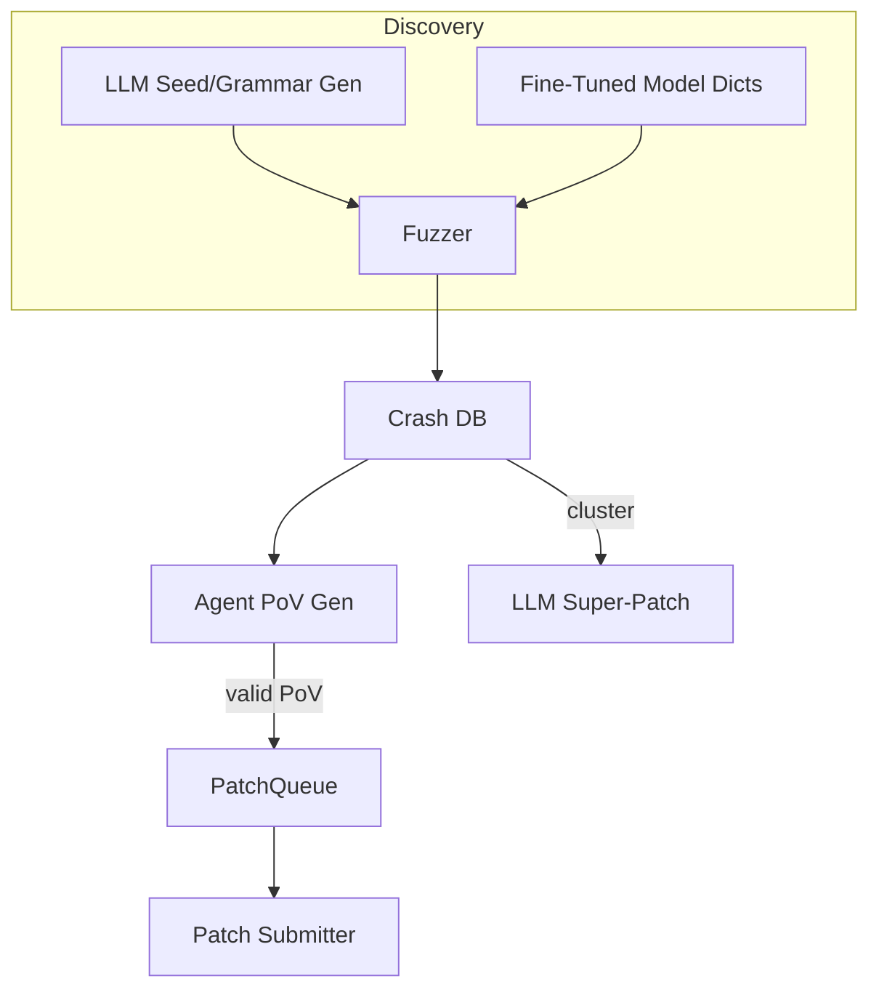

# AI-Assisted Fuzzing & Automated Vulnerability Discovery

{{#include ../banners/hacktricks-training.md}}

## 개요
Large-language models(LLM)은 의미적으로 풍부한 입력을 생성하고, grammar를 발전시키며, crash 데이터를 추론하고, 여러 버그를 포함한 patch까지 제안함으로써 기존 vulnerability-research pipeline을 크게 강화할 수 있습니다. 이 페이지에서는 DARPA의 AI Cyber Challenge(AIxCC) 결선과 기타 공개 research에서 확인된 가장 효과적인 pattern을 정리합니다.<sup>[[4]](#references)</sup><sup>[[5]](#references)</sup>

다음 내용은 특정 competition system 하나를 설명하는 것이 아니라, 자체 workflow에서 재현할 수 있도록 이러한 technique을 추상화한 것입니다.

---

## 1. LLM-Generated Seed Inputs

기존 coverage-guided fuzzer(AFL++, libFuzzer, Honggfuzz…)는 작은 seed corpus에서 시작해 byte를 무작위로 mutate합니다. target input format이 복잡한 경우(SQL, URL, custom binary protocol), random mutation은 보통 흥미로운 branch에 도달하기 전에 syntax를 손상시킵니다.

LLM은 *seed generator*를 출력하여 이 bootstrap 문제를 해결할 수 있습니다. seed generator는 **syntax-correct하지만 security-relevant한 input**을 출력하는 짧은 script입니다. 예:
```prompt
SYSTEM: You are a helpful security engineer.
USER:
Write a Python3 program that prints 200 unique SQL injection strings targeting common anti-pattern mistakes (missing quotes, numeric context, stacked queries).  Ensure length ≤ 256 bytes / string so they survive common length limits.
```

```python
# gen_sqli_seeds.py (truncated)
PAYLOADS = [
"1 OR 1=1 -- ",
"' UNION SELECT NULL,NULL--",
"0; DROP TABLE users;--",
...
]
for p in PAYLOADS:
print(p)
```
한 번 실행하고 출력을 fuzzer의 초기 corpus에 직접 공급합니다:
```bash
python3 gen_sqli_seeds.py > seeds.txt
afl-fuzz -i seeds.txt -o findings/ -- ./target @@
```
Benefits:
1. Semantic validity → 초기 단계에서 더 깊은 coverage.
2. Re-generatable: XSS, path traversal, binary blobs 등에 집중하도록 prompt를 조정할 수 있습니다.
3. 저렴함 (GPT-3.5 사용 시 < 1 ¢).

### Tips
* 피상적인 filter를 우회할 수 있도록 payload 길이와 encoding (UTF-8, URL-encoded, UTF-16-LE)을 *다양화*하도록 model에 지시합니다.
* *단일 self-contained script*를 요청하면 JSON formatting 문제를 피할 수 있습니다.

---

## 2. Grammar-Evolution Fuzzing

더 강력한 variant는 구체적인 seed 대신 LLM이 **grammar를 evolve**하도록 하는 것입니다. workflow(“Grammar Guy” pattern)는 다음과 같습니다:

1. prompt를 통해 초기 ANTLR/Peach/LibFuzzer grammar를 생성합니다.
2. N분 동안 fuzzing하고 coverage metrics (도달한 edges / blocks)를 수집합니다.
3. 도달하지 못한 program 영역을 요약하고 그 요약을 model에 다시 전달합니다:
```prompt
The previous grammar triggered 12 % of the program edges.  Functions not reached: parse_auth, handle_upload.  Add / modify rules to cover these.
```
4. 새로운 rules를 merge하고, 다시 fuzzing한 뒤 반복합니다.

Pseudo-code skeleton:
```python
for epoch in range(MAX_EPOCHS):
grammar = llm.refine(grammar, feedback=coverage_stats)
save(grammar, f"grammar_{epoch}.txt")
coverage_stats = run_fuzzer(grammar)
```
핵심 요점:
* *budget*을 유지하세요 – 각 refinement에는 tokens가 사용됩니다.
* 모델이 다시 작성하는 대신 편집하도록 `diff` + `patch` instructions를 사용하세요.
* Δcoverage < ε이면 중지하세요.

---

## 3. Local-LLM libFuzzer Harness Engineering

분석가의 workstation을 벗어날 수 없는 source의 경우, local code model은 fuzzer bytes와 C/C++ API 사이의 작은 adapter를 작성할 수 있습니다. 유용한 security boundary는 명확합니다. **model은 test infrastructure를 작성하고 수정하며, coverage-guided mutation은 inputs를 탐색하고, sanitizers는 invalid operations를 보고하며, human은 harness를 검토하고 findings를 triage합니다**.<sup>[[9]](#references)</sup>

LLM에 의존하지 않는 engine-level corpus, feedback, snapshot 및 stateful-fuzzing techniques는 일반 [Fuzzing Methodology](../generic-methodologies-and-resources/fuzzing.md)를 참조하세요.

target header에서 복사한 정확한 declaration으로 시작하고 output format을 제한하세요. 좁은 prompt는 invented APIs를 줄이고 결과를 쉽게 review할 수 있게 합니다:<sup>[[8]](#references)[[9]](#references)</sup>
```prompt
Write a libFuzzer target for this exact declaration:
int parse_records(const uint8_t *data, size_t size);

Output only C code. Implement LLVMFuzzerTestOneInput, include the
declaration, pass data and size unchanged, and do not use files,
network access, randomness, clocks, threads, or persistent state.
```
raw byte parser의 예상 결과는 다음보다 더 복잡하지 않아야 합니다:<sup>[[6]](#references)[[9]](#references)</sup>
```c
#include <stddef.h>
#include <stdint.h>

extern int parse_records(const uint8_t *, size_t);

int LLVMFuzzerTestOneInput(const uint8_t *data, size_t size) {
(void)parse_records(data, size);
return 0;
}
```
컴파일은 첫 번째 검증 단계일 뿐입니다. CPU 시간을 사용하기 전에 생성된 모든 target이 다음 불변 조건을 충족하는지 검토하세요:<sup>[[6]](#references)[[8]](#references)[[9]](#references)</sup>

- **정확한 API:** 실제 header 및 기존 caller와 타입, ownership 규칙, 초기화, teardown, calling convention을 비교하세요.
- **Harness safety:** `data`에서 읽는 모든 작업을 guard하세요. sanitizer 결과는 생성된 glue가 아니라 target에서 발생해야 합니다.
- **Repeatability:** 결과가 `data`와 `size`의 함수가 되도록 하세요. 외부 I/O, 시간, 제어되지 않는 randomness, join되지 않은 thread, 호출 간 유지되는 state를 제거하세요.
- **Throughput:** 동작에 영향을 주지 않는 경우에만 비용이 큰 immutable state를 한 번만 초기화하고, input size를 제한하며, logging을 억제하고, input별 allocation을 해제하세요.
- **Reachability:** 의도한 function과 branch가 실행되는지 확인하세요. 컴파일되지만 rejection path만 실행하는 target은 조용한 실패입니다.

### Structure-aware target: bug를 숨기지 않고 invariant 보존하기

대부분의 raw input이 magic, length, version 또는 checksum gate에서 실패한다면 fuzz byte를 **typed field material**로 사용하고 유효한 object를 다시 구성하세요. format constant는 고정하고 semantic field와 payload byte는 변경 가능하게 두며, 재구성된 payload에서 integrity metadata를 도출하세요. `FuzzedDataProvider`는 제한된 typed value를 소비하는 데 유용하지만, 생성되는 allocation과 conversion을 제한하는 책임은 adapter에 있습니다.<sup>[[9]](#references)</sup>

<details>
<summary>Structure-aware C++ target 예시</summary>
```cpp
#include <fuzzer/FuzzedDataProvider.h>
#include <stddef.h>
#include <stdint.h>
#include <vector>

extern "C" int parse_message(const uint8_t *, size_t);

extern "C" int LLVMFuzzerTestOneInput(const uint8_t *data, size_t size) {
FuzzedDataProvider fdp(data, size);
uint8_t version = fdp.ConsumeIntegral<uint8_t>();
auto body = fdp.ConsumeRemainingBytes<uint8_t>();
if (body.size() > UINT16_MAX) body.resize(UINT16_MAX);
uint16_t len = static_cast<uint16_t>(body.size());
std::vector<uint8_t> msg = {0x8b, 'M', 'S', 'G', version,
static_cast<uint8_t>(len >> 8),
static_cast<uint8_t>(len)};
msg.insert(msg.end(), body.begin(), body.end());
(void)parse_message(msg.data(), msg.size());
return 0;
}
```
</details>

모든 질문에 하나의 structure-repairing target만 사용하지 마세요. 길이/checksum을 계산하여 유효한 내부 상태를 깊이 탐색하는 target 하나와, harness 자체의 read 및 allocation만 제한하면서 **declared** metadata는 fuzzer가 제어하도록 유지하는 또 다른 target을 유지하세요. 두 번째 target은 자동 복구로 인해 사라질 수 있는 길이 불일치 및 잘못된 무결성 attack surface를 보존합니다.<sup>[[9]](#references)</sup>

### Seeds, dictionaries, sanitizers, and coverage feedback

모델에 binary를 직접 출력하도록 요청하는 대신 binary seed를 작성하는 script를 생성하도록 요청하세요. empty, minimal, typical 및 boundary-valid object를 seed로 사용한 다음, magic value, tag, enum encoding 및 parser keyword를 추출하여 검토된 dictionary에 추가하세요. libFuzzer는 `-dict=`를 사용하여 해당 dictionary를 적용하며, 새로운 coverage를 노출하는 mutation을 corpus에 유지합니다.<sup>[[6]](#references)[[9]](#references)</sup>
```text
magic="\x8bMSG"
version_min="\x00"
version_max="\xff"
config_tag="CONFIG"
```
동일한 target을 상호 보완적인 instrumentation과 함께 빌드합니다. ASan과 UBSan은 하나의 fuzzing binary를 공유할 수 있습니다. 별도의 MSan 빌드를 사용하고, instrument되지 않은 code로 인해 발생하는 reports를 방지하려면 해당 dependency에도 instrumentation을 적용합니다.<sup>[[6]](#references)[[9]](#references)</sup>
```bash
clang++ -g -O1 -fsanitize=fuzzer,address,undefined \
-fno-sanitize-recover=undefined target.cc harness.cc -o fuzz_target
./fuzz_target corpus -dict=msg.dict -max_len=65535

clang++ -g -O1 -fsanitize=fuzzer,memory \
target.cc harness.cc -o fuzz_target_msan
```
각 모델 revision에 대한 evaluator로 coverage를 사용합니다. libFuzzer output에서 초기부터 평평한 `cov`/`ft`와 static corpus는 일반적으로 잘못된 framing, 지나치게 제한적인 early return 또는 잘못된 call을 의미하며, 낮은 `exec/s`는 비용이 큰 setup, I/O, allocation 또는 leak된 state를 가리킵니다. `NEW`는 coverage feature가 변경되었다는 것만 증명할 뿐, 의도한 parser에 도달했다는 의미는 아닙니다.<sup>[[6]](#references)[[9]](#references)</sup>

source-level feedback을 위해 coverage build를 만들고 fuzz한 다음, uncovered functions와 이를 보호하는 guarding conditions만 model에 제공합니다. 생성된 harness/seed/dictionary diff를 검증하고 다시 측정합니다:<sup>[[7]](#references)[[8]](#references)[[9]](#references)</sup>
```bash
clang++ -g -O1 -fsanitize=fuzzer \
-fprofile-instr-generate -fcoverage-mapping target.cc harness.cc -o fuzz_cov
mkdir -p profiles
LLVM_PROFILE_FILE='profiles/%p.profraw' ./fuzz_cov -max_total_time=300 corpus
llvm-profdata merge -sparse profiles/*.profraw -o fuzz.profdata
llvm-cov report ./fuzz_cov -instr-profile=fuzz.profdata
llvm-cov show ./fuzz_cov -instr-profile=fuzz.profdata \
--show-branches=count --region-coverage-lt=1 target.cc
```
따라서 확장 가능한 루프는 **generate → compile/link → smoke-test under sanitizers → measure target coverage → provide the smallest relevant coverage/source context → revise → re-measure**이다. OSS-Fuzz-Gen은 생성된 target을 그럴듯한 코드를 액면 그대로 받아들이는 대신, compilability, runtime failures, coverage, 기존 target 대비 coverage improvement를 평가하여 동일한 원칙을 적용한다.<sup>[[7]](#references)[[8]](#references)</sup>

---

## 4. Agent-Based PoV (Exploit) Generation

crash를 발견한 후에도 이를 결정적으로 트리거하는 **proof-of-vulnerability (PoV)**가 필요하다.

확장 가능한 접근 방식은 각각 다른 model 또는 sampling configuration을 사용하는 다수의 lightweight worker(processes, threads, 또는 containers)를 생성하는 것이다. AIxCC finalist survey는 구체적인 규모의 예를 제시한다. 한 팀은 AI-first PoV generation을 위해 **thousands of concurrent agents**를 사용했으며, 다른 팀은 **300–500 fuzzing agents**를 orchestrate하고 LLM은 더 높은 수준의 semantic reasoning에 할당했다.<sup>[[4]](#references)</sup>

Pipeline:
1. Static/ dynamic analysis가 *bug candidates*(crash PC, input slice, sanitizer msg가 포함된 struct)를 생성한다.
2. Orchestrator가 candidates를 agents에 분배한다.
3. Agent reasoning steps:
a. `gdb` + input으로 bug를 로컬에서 재현한다.
b. minimal exploit payload를 제안한다.
c. sandbox에서 exploit을 검증한다.  성공하면 → submit한다.
4. 실패한 시도는 coverage fuzzing을 위한 **new seeds**로 **re-queued**된다(feedback loop).

Advantages:
* Parallelisation이 single-agent unreliability를 숨긴다.
* 관찰된 success-rate를 기반으로 temp / model size를 auto-tuning한다.

---

## 5. Directed Fuzzing with Fine-Tuned Code Models

vulnerability patterns(integer overflow, buffer copy, format string)가 라벨링된 C/C++ source로 open-weight model(예: Llama-7B)을 fine-tune한다.  그런 다음:

1. Static analysis를 실행하여 function list + AST를 얻는다.
2. Model에 다음을 prompt한다: *“Give mutation dictionary entries that are likely to break memory safety in function X”*.
3. 해당 tokens를 custom `AFL_CUSTOM_MUTATOR`에 삽입한다.

`sprintf` wrapper의 example output:
```
{"pattern":"%99999999s"}
{"pattern":"AAAAAAAA....<1024>....%n"}
```
경험적으로 실제 target에서 time-to-crash를 2배 이상 단축합니다.

---

## 6. AI-Guided 패치 전략

### 6.1 Super Patches
모델에 crash signature를 *cluster*하고 공통 root cause를 제거하는 **단일 패치**를 제안하도록 요청합니다. 한 번 제출하여 여러 bug를 수정하면, 잘못된 패치 하나마다 점수가 차감되는 환경에서 정확도 패널티를 줄일 수 있습니다.

Prompt 개요:
```
Here are 10 stack traces + file snippets.  Identify the shared mistake and generate a unified diff fixing all occurrences.
```
### 6.2 Speculative Patch Ratio
확인된 PoV-validated patch와 *speculative* patch(PoV 없음)를 scoring rules에 맞춰 조정한 1:N 비율(예: speculative 2개 : confirmed 1개)로 교차 배치하는 queue를 구현합니다. cost model은 penalties와 points를 모니터링하고 N을 자동으로 조정합니다.

---

## 7. Deterministic File-by-File AI Code Review

AI-assisted review에서 자주 발생하는 failure mode는 하나의 agent에게 전체 repository를 검사하도록 요청하고, 적절한 파일과 grep terms를 선택하기를 기대하는 것입니다. 더 안정적인 pattern은 **repository coverage를 강제하는 것**입니다:<sup>[[1]](#references)</sup>

1. source files를 열거합니다.
2. **한 번에 하나의 file**과 최소한의 context(entrypoint, imports, 인접한 routes/callers)를 함께 전송합니다.
3. 각 file에 대해 **structured report**를 요구합니다: sources, sink, 누락된 validation, exploit preconditions, confidence.<sup>[[3]](#references)</sup>
4. **source→sink pattern**으로 report를 중복 제거하고 high-risk 항목을 수동으로 검증합니다.

이는 token을 많이 사용하고 noisy하지만, broad agentic review에서 자주 놓치는 **단순하면서 영향도가 높은 source/sink bug**를 찾아내는 데 매우 효과적입니다.

### 우선순위를 높일 가치가 있는 Triage patterns

- **Dynamic PHP include/dispatch**: attacker-controlled route/controller/module name이 엄격한 allowlisting과 path canonicalisation 없이 `require_once()`, `include()`, 또는 `include_once()`로 전달되는 경우.
- **admin/account workflow의 Shell execution**: username, domain, FTP account 또는 기타 identifier가 `exec()`, `system()`, `shell_exec()`, `passthru()`, `proc_open()`, 또는 `popen()`에 도달하는 경우.
- **Structured input fan-in**: 동일한 parameter가 `$_GET`, `$_POST`, JSON, XML 또는 framework body parser에서 허용되고 이후 filesystem 또는 OS-command sink에서 재사용되는 경우.

### 이 방법으로 잘 발견되는 두 가지 실용적인 bug class

- **PHP controller-dispatch LFI/RCE**: request-controlled controller name이 allowlist/path normalisation 없이 `require_once()`에 연결되면 `../`와 같은 traversal sequence를 사용해 PHP가 의도하지 않은 local `.php` file을 include하도록 만들 수 있습니다. 공격자가 planted되었거나 다른 방식으로 유용한 PHP file을 가리킬 수 있다면 LFI는 code execution으로 이어집니다. [File Inclusion / Path Traversal](../pentesting-web/file-inclusion/README.md)을 참조하세요.<sup>[[1]](#references)</sup>
- **hosting/admin panel의 Authenticated command injection**: username과 같은 account-management field가 shell command에 삽입되면 low-privileged authenticated user가 일반적인 create/delete action을 RCE로 바꿀 수 있습니다. panel이 더 높은 권한을 가진 service account로 command를 실행하면 impact가 증가합니다. [Command Injection](../pentesting-web/command-injection.md)을 참조하세요.<sup>[[1]](#references)</sup>

### Practical review notes

- LLM을 **exploit generator가 아닌 source/sink reviewer로 먼저** 사용합니다.
- **attacker-controlled field**, **normalization/validation gap**, **dangerous sink**를 명시적으로 나열하도록 요청합니다.
- 대규모 repo에서는 더 강력한 model을 사용하더라도 단일 autonomous agent run보다 deterministic per-file review가 더 안정적인 경우가 많습니다.<sup>[[2]](#references)</sup>
- exploitability가 cross-file assumption, role semantics 또는 product-specific threat model에 좌우되는 **Broken Access Control** 및 기타 business-logic bug에서는 결과가 약해질 수 있음을 예상해야 합니다.

---

## Putting It All Together
end-to-end CRS (Cyber Reasoning System)는 다음과 같이 component들을 연결할 수 있습니다:

```mermaid
graph TD
subgraph Discovery
A[LLM Seed/Grammar Gen] --> B[Fuzzer]
C[Fine-Tuned Model Dicts] --> B
end
B --> D[Crash DB]
D --> E[Agent PoV Gen]
E -->|valid PoV| PatchQueue
D -->|cluster| F[LLM Super-Patch]
PatchQueue --> G[Patch Submitter]
```
---

## References

- [1] [Project Black - Cyber Security를 위한 Local AI: phpIPAM LFI 및 myVesta Authenticated RCE 발견](https://projectblack.io/blog/local-ai-for-cyber-security)
- [2] [Strix](https://github.com/usestrix/strix)
- [3] [GitHub Copilot community security-review skill](https://github.com/github/awesome-copilot/blob/main/skills/security-review/SKILL.md)
- [4] [Trail of Bits – AIxCC finals: 기록 분석](https://blog.trailofbits.com/2025/08/07/aixcc-finals-tale-of-the-tape/)
- [5] [CTF Radiooo AIxCC finalist interviews](https://www.youtube.com/@ctfradiooo)
- [6] [LLVM — libFuzzer: coverage-guided fuzz testing을 위한 library](https://llvm.org/docs/LibFuzzer.html)
- [7] [Google — OSS-Fuzz-Gen](https://github.com/google/oss-fuzz-gen)
- [8] [Google Online Security Blog — Fuzzing 강화: AI로 더 많은 Vulnerability 발견](https://security.googleblog.com/2024/11/leveling-up-fuzzing-finding-more.html)
- [9] [8kSec — Local LLM을 활용한 AI-Assisted Fuzzing Harness Generation](https://8ksec.io/ai-assisted-fuzzing-harness-local-llm)
{{#include ../banners/hacktricks-training.md}}
