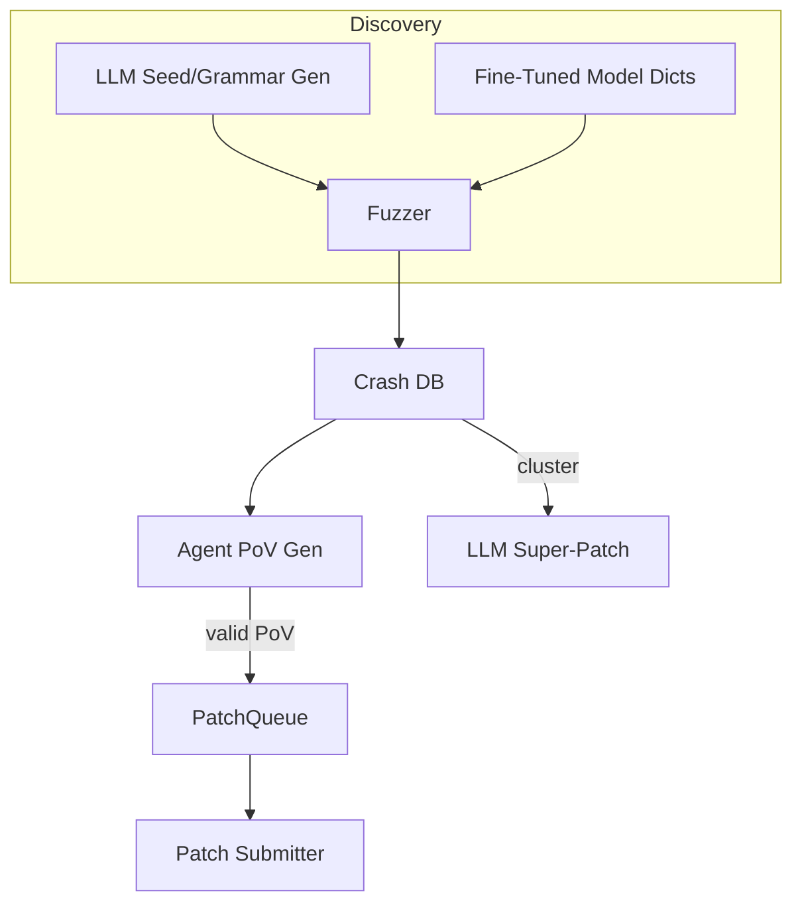

# Fuzzing Assistido por IA e Descoberta Automatizada de Vulnerabilidades

{{#include ../banners/hacktricks-training.md}}

## Visão geral
Os modelos de linguagem de grande escala (LLMs) podem potencializar os pipelines tradicionais de pesquisa de vulnerabilidades ao gerar entradas semanticamente ricas, evoluir grammars, raciocinar sobre dados de crashes e até propor patches para múltiplos bugs. Esta página reúne os padrões mais eficazes observados durante as finais do AI Cyber Challenge (AIxCC) da DARPA e em outras pesquisas públicas.<sup>[[4]](#references)[[5]](#references)</sup>

O que segue não é uma descrição de um sistema específico de competição, mas uma abstração das técnicas, para que você possa reproduzi-las em seus próprios workflows.

---

## 1. Entradas Seed Geradas por LLM

Fuzzers tradicionais guiados por cobertura (AFL++, libFuzzer, Honggfuzz...) começam com um pequeno corpus de seeds e fazem mutações cegas nos bytes. Quando o formato da entrada-alvo é complexo (SQL, URLs, protocolos binários personalizados), mutações aleatórias geralmente quebram a sintaxe antes que branches interessantes sejam alcançados.

Os LLMs podem resolver esse problema de bootstrap emitindo *seed generators* – scripts curtos que produzem **entradas sintaticamente corretas, mas relevantes para a segurança**. Por exemplo:
```prompt
SYSTEM: You are a helpful security engineer.
USER:
Write a Python3 program that prints 200 unique SQL injection strings targeting common anti-pattern mistakes (missing quotes, numeric context, stacked queries).  Ensure length ≤ 256 bytes / string so they survive common length limits.
```

```python
# gen_sqli_seeds.py (truncated)
PAYLOADS = [
"1 OR 1=1 -- ",
"' UNION SELECT NULL,NULL--",
"0; DROP TABLE users;--",
...
]
for p in PAYLOADS:
print(p)
```
Execute uma vez e alimente a saída diretamente no corpus inicial do fuzzer:
```bash
python3 gen_sqli_seeds.py > seeds.txt
afl-fuzz -i seeds.txt -o findings/ -- ./target @@
```
Benefícios:
1. Validade semântica → cobertura mais profunda desde o início.
2. Regenerável: ajuste o prompt para focar em XSS, path traversal, binary blobs, etc.
3. Barato (< 1 ¢ com GPT-3.5).

### Dicas
* Instrua o modelo a *diversificar* o comprimento e a codificação dos payloads (UTF-8, URL-encoded, UTF-16-LE) para contornar filtros superficiais.
* Peça um *script único e autocontido* – evita problemas de formatação JSON.

---

## 2. Grammar-Evolution Fuzzing

Uma variante mais poderosa é permitir que o LLM **evolua uma grammar** em vez de seeds concretas. O workflow (padrão “Grammar Guy”) é:

1. Gere uma grammar inicial de ANTLR/Peach/LibFuzzer via prompt.
2. Execute o fuzzing por N minutos e colete métricas de cobertura (edges / blocks atingidos).
3. Resuma as áreas não cobertas do programa e envie o resumo de volta ao modelo:
```prompt
The previous grammar triggered 12 % of the program edges.  Functions not reached: parse_auth, handle_upload.  Add / modify rules to cover these.
```
4. Mescle as novas regras, execute o fuzzing novamente e repita.

Estrutura de pseudo-código:
```python
for epoch in range(MAX_EPOCHS):
grammar = llm.refine(grammar, feedback=coverage_stats)
save(grammar, f"grammar_{epoch}.txt")
coverage_stats = run_fuzzer(grammar)
```
Pontos principais:
* Mantenha um *orçamento* – cada refinamento usa tokens.
* Use instruções `diff` + `patch` para que o modelo edite em vez de reescrever.
* Pare quando Δcoverage < ε.

---

## 3. Geração de PoV (Exploit) baseada em agentes

Depois que um crash é encontrado, você ainda precisa de uma **prova de vulnerabilidade (PoV)** que o acione de forma determinística.

Uma abordagem escalável é iniciar *milhares* de agentes leves (<process/thread/container/prisoner>), cada um executando um LLM diferente (GPT-4, Claude, Mixtral) ou uma configuração de temperatura diferente.

Pipeline:
1. A análise estática/dinâmica produz *candidatos a bugs* (struct com PC do crash, trecho do input e mensagem do sanitizer).
2. O orquestrador distribui os candidatos aos agentes.
3. Etapas de raciocínio do agente:
a. Reproduzir o bug localmente com `gdb` + input.
b. Sugerir um payload de exploit mínimo.
c. Validar o exploit no sandbox.  Se tiver sucesso → enviar.
4. As tentativas malsucedidas são **reenfileiradas como novas seeds** para o fuzzing de coverage (feedback loop).

Vantagens:
* A paralelização oculta a falta de confiabilidade de um único agente.
* Ajuste automático de temp / tamanho do modelo com base na taxa de sucesso observada.

---

## 4. Fuzzing direcionado com modelos de código Fine-Tuned

Faça Fine-Tune de um modelo open-weight (por exemplo, Llama-7B) usando código-fonte C/C++ rotulado com padrões de vulnerabilidade (integer overflow, buffer copy, format string). Em seguida:

1. Execute uma análise estática para obter a lista de funções + AST.
2. Envie ao modelo o prompt: *“Forneça entradas de dicionário de mutação que provavelmente comprometam a memory safety na função X”*.
3. Insira esses tokens em um `AFL_CUSTOM_MUTATOR` personalizado.

Exemplo de saída para um wrapper de `sprintf`:
```
{"pattern":"%99999999s"}
{"pattern":"AAAAAAAA....<1024>....%n"}
```
Empiricamente, isso reduz o tempo até o crash em mais de 2× em alvos reais.

---

## 5. Estratégias de Patching Guiadas por AI

### 5.1 Super Patches
Peça ao modelo para *agrupar* as assinaturas de crash e propor um **único patch** que elimine a causa raiz comum. Envie uma vez, corrija vários bugs → menos penalidades de precisão em ambientes onde cada patch incorreto custa pontos.

Esboço do prompt:
```
Here are 10 stack traces + file snippets.  Identify the shared mistake and generate a unified diff fixing all occurrences.
```
### 5.2 Proporção de Patches Especulativos
Implemente uma fila na qual patches confirmados e validados por PoV e patches *especulativos* (sem PoV) sejam intercalados em uma proporção de 1:​N ajustada às regras de pontuação (por exemplo, 2 especulativos : 1 confirmado). Um modelo de custos monitora as penalidades versus os pontos e ajusta N automaticamente.

---

## 6. Revisão Determinística de Código por Arquivo com IA

Um modo frequente de falha em revisões assistidas por IA é pedir a um agente que inspecione um repositório inteiro e esperar que ele escolha os arquivos e termos de grep corretos. Um padrão mais confiável é **forçar a cobertura do repositório**:<sup>[[1]](#references)</sup>

1. Enumere os arquivos de código-fonte.
2. Envie **um arquivo por vez**, juntamente com o contexto mínimo (entrypoint, imports, rotas/callers próximos).
3. Exija um **relatório estruturado** para cada arquivo: sources, sink, validação ausente, pré-condições de exploração e confiança.<sup>[[3]](#references)</sup>
4. Elimine relatórios duplicados por **padrão source→sink** e valide manualmente os de alto risco.

Isso consome muitos tokens e gera ruído, mas é muito eficaz para revelar **bugs simples de alto impacto em sources/sinks** que revisões agentic amplas frequentemente deixam passar.

### Padrões de triagem que merecem prioridade

- **Dynamic PHP include/dispatch**: nomes de rota/controller/module controlados pelo atacante fluindo para `require_once()`, `include()` ou `include_once()` sem uma allowlist estrita e canonicalisation do caminho.
- **Execução de shell em fluxos de administração/conta**: usernames, domínios, contas FTP ou outros identificadores chegando a `exec()`, `system()`, `shell_exec()`, `passthru()`, `proc_open()` ou `popen()`.
- **Convergência de entradas estruturadas**: o mesmo parâmetro aceito de `$_GET`, `$_POST`, JSON, XML ou body parsers do framework e posteriormente reutilizado em sinks de filesystem ou comandos do sistema operacional.

### Duas classes práticas de bugs que este método encontra bem

- **PHP controller-dispatch LFI/RCE**: se um nome de controller controlado pela requisição for concatenado em `require_once()` sem allowlist ou normalização do caminho, sequências de traversal como `../` podem fazer o PHP incluir um arquivo `.php` local não pretendido. Se o atacante puder apontar o include para um arquivo PHP plantado ou de outra forma útil, o LFI se transforma em execução de código. Consulte [File Inclusion / Path Traversal](../pentesting-web/file-inclusion/README.md).<sup>[[1]](#references)</sup>
- **Command injection autenticado em painéis de hosting/admin**: se campos de gerenciamento de contas, como usernames, forem incorporados a comandos de shell, um usuário autenticado com poucos privilégios poderá transformar uma ação normal de criação/exclusão em RCE. O impacto aumenta quando o painel executa o comando como uma service account mais privilegiada. Consulte [Command Injection](../pentesting-web/command-injection.md).<sup>[[1]](#references)</sup>

### Observações práticas de revisão

- Use o LLM primeiro como um **revisor de sources/sinks**, não como um gerador de exploits.
- Peça que ele liste explicitamente o **campo controlado pelo atacante**, a **lacuna de normalização/validação** e o **sink perigoso**.
- Em repositórios grandes, a revisão determinística por arquivo costuma ser mais confiável do que uma única execução de agente autônomo, mesmo quando esta usa um modelo mais poderoso.<sup>[[2]](#references)</sup>
- Espere resultados mais fracos em **Broken Access Control** e em outros bugs de lógica de negócio nos quais a explorabilidade depende de suposições entre arquivos, semântica de funções ou threat models específicos do produto.

---

## Unindo Tudo
Um CRS (Cyber Reasoning System) de ponta a ponta pode conectar os componentes da seguinte forma:

```mermaid
graph TD
subgraph Discovery
A[LLM Seed/Grammar Gen] --> B[Fuzzer]
C[Fine-Tuned Model Dicts] --> B
end
B --> D[Crash DB]
D --> E[Agent PoV Gen]
E -->|valid PoV| PatchQueue
D -->|cluster| F[LLM Super-Patch]
PatchQueue --> G[Patch Submitter]
```
---

## Referências

- [1] [Project Black - IA local para Cyber Security: encontrando LFI no phpIPAM e RCE autenticado no myVesta](https://projectblack.io/blog/local-ai-for-cyber-security)
- [2] [Strix](https://github.com/usestrix/strix)
- [3] [Skill de security-review da comunidade do GitHub Copilot](https://github.com/github/awesome-copilot/blob/main/skills/security-review/SKILL.md)
- [4] [Trail of Bits – finais da AIxCC: relato da competição](https://blog.trailofbits.com/2025/08/07/aixcc-finals-tale-of-the-tape/)
- [5] [Entrevistas com finalistas da CTF Radiooo AIxCC](https://www.youtube.com/@ctfradiooo)

{{#include ../banners/hacktricks-training.md}}
