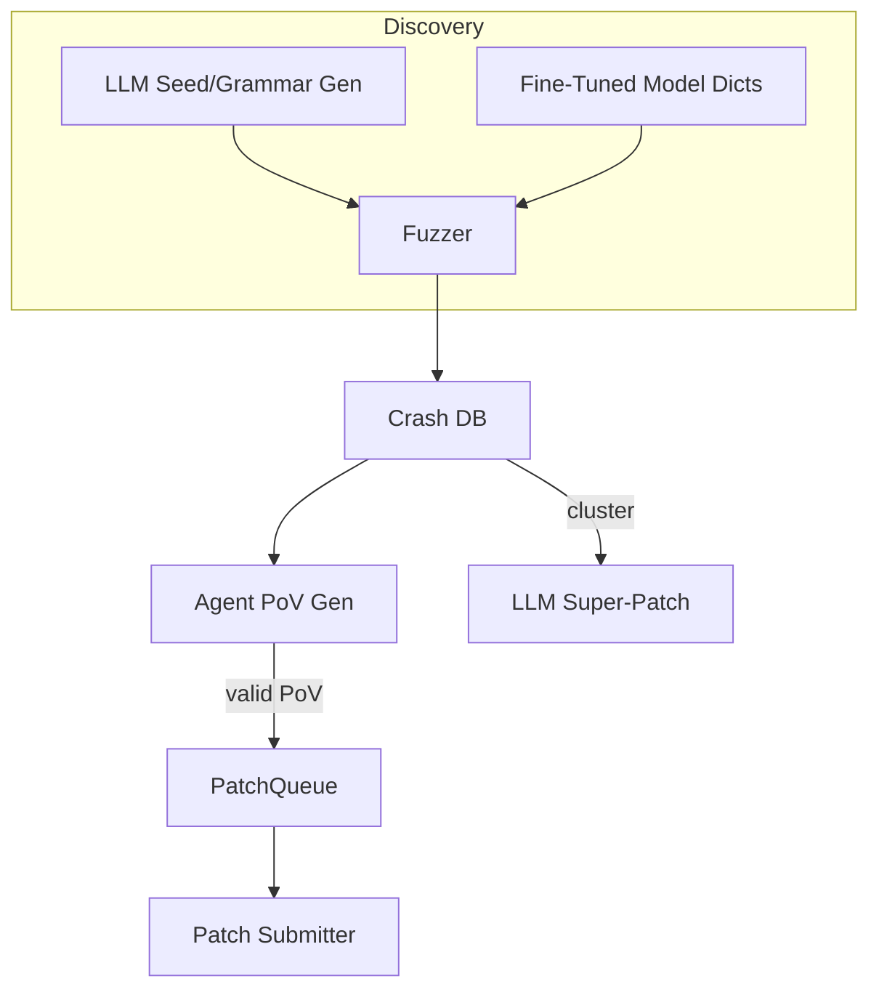

# Fuzzing за допомогою AI та автоматизоване виявлення вразливостей

{{#include ../banners/hacktricks-training.md}}

## Огляд
Великі мовні моделі (LLM) можуть значно посилити традиційні процеси дослідження вразливостей, генеруючи семантично насичені вхідні дані, розвиваючи граматики, аналізуючи дані про збої та навіть пропонуючи патчі для кількох помилок. На цій сторінці зібрано найефективніші підходи, виявлені під час фіналу DARPA AI Cyber Challenge (AIxCC) та інших публічних досліджень.<sup>[[4]](#references)</sup><sup>[[5]](#references)</sup>

Далі наведено не опис конкретної змагальної системи, а узагальнення технік, щоб ви могли відтворити їх у власних робочих процесах.

---

## 1. Seed Inputs, згенеровані LLM

Традиційні coverage-guided fuzzers (AFL++, libFuzzer, Honggfuzz…) починають із невеликого corpus seed-файлів і сліпо мутують байти. Коли формат вхідних даних цільової системи складний (SQL, URL-адреси, користувацькі бінарні протоколи), випадкові мутації зазвичай порушують синтаксис ще до досягнення цікавих гілок виконання.

LLM можуть розв’язати цю проблему початкової ініціалізації, генеруючи *seed generators* — короткі скрипти, які виводять **синтаксично коректні, але релевантні для безпеки вхідні дані**. Наприклад:
```prompt
SYSTEM: You are a helpful security engineer.
USER:
Write a Python3 program that prints 200 unique SQL injection strings targeting common anti-pattern mistakes (missing quotes, numeric context, stacked queries).  Ensure length ≤ 256 bytes / string so they survive common length limits.
```

```python
# gen_sqli_seeds.py (truncated)
PAYLOADS = [
"1 OR 1=1 -- ",
"' UNION SELECT NULL,NULL--",
"0; DROP TABLE users;--",
...
]
for p in PAYLOADS:
print(p)
```
Запустіть один раз і безпосередньо передайте результат до початкового corpus фуззера:
```bash
python3 gen_sqli_seeds.py > seeds.txt
afl-fuzz -i seeds.txt -o findings/ -- ./target @@
```
Переваги:
1. Семантична валідність → глибше покриття на ранніх етапах.
2. Можливість повторної генерації: змінюйте prompt, щоб зосередитися на XSS, path traversal, binary blobs тощо.
3. Дешево (< 1 ¢ з GPT-3.5).

### Поради
* Попросіть модель *урізноманітнити* довжину та кодування payload (UTF-8, URL-encoded, UTF-16-LE), щоб обходити поверхневі фільтри.
* Попросіть створити *єдиний самодостатній скрипт* — це допомагає уникнути проблем із форматуванням JSON.

---

## 2. Grammar-Evolution Fuzzing

Потужніший варіант — дозволити LLM **розвивати grammar**, а не конкретні seeds. Робочий процес (патерн “Grammar Guy”):

1. Згенерувати початкову grammar ANTLR/Peach/LibFuzzer за допомогою prompt.
2. Виконувати fuzzing протягом N хвилин і збирати метрики покриття (досягнуті edges / blocks).
3. Узагальнити непокриті області програми та передати зведення назад у модель:
```prompt
The previous grammar triggered 12 % of the program edges.  Functions not reached: parse_auth, handle_upload.  Add / modify rules to cover these.
```
4. Об'єднати нові rules, повторно виконати fuzzing і повторити.

Каркас псевдокоду:
```python
for epoch in range(MAX_EPOCHS):
grammar = llm.refine(grammar, feedback=coverage_stats)
save(grammar, f"grammar_{epoch}.txt")
coverage_stats = run_fuzzer(grammar)
```
Ключові моменти:
* Дотримуйтеся *бюджету* — кожне уточнення використовує токени.
* Використовуйте інструкції `diff` + `patch`, щоб модель редагувала, а не переписувала все.
* Зупиніться, коли Δcoverage < ε.

---

## 3. Розроблення Harness для Local-LLM libFuzzer

Для source code, який не може залишити робочу станцію аналітика, локальна code model може створити невеликий адаптер між байтами fuzzer і C/C++ API. Кордон безпеки має бути чітким: **модель пише та переглядає тестову інфраструктуру; мутація під керуванням coverage досліджує inputs; sanitizers повідомляють про некоректні операції; людина перевіряє harness і проводить triage результатів**.<sup>[[9]](#references)</sup>

Щодо технік engine-level corpus, feedback, snapshot і stateful-fuzzing, які не залежать від LLM, див. загальну [Fuzzing Methodology](../generic-methodologies-and-resources/fuzzing.md).

Почніть із точного declaration, скопійованого із заголовка target, і обмежте формат output. Вузький prompt зменшує кількість вигаданих API та спрощує перевірку результату:<sup>[[8]](#references)[[9]](#references)</sup>
```prompt
Write a libFuzzer target for this exact declaration:
int parse_records(const uint8_t *data, size_t size);

Output only C code. Implement LLVMFuzzerTestOneInput, include the
declaration, pass data and size unchanged, and do not use files,
network access, randomness, clocks, threads, or persistent state.
```
Для парсера необроблених байтів очікуваний результат має бути не складнішим за:<sup>[[6]](#references)[[9]](#references)</sup>
```c
#include <stddef.h>
#include <stdint.h>

extern int parse_records(const uint8_t *, size_t);

int LLVMFuzzerTestOneInput(const uint8_t *data, size_t size) {
(void)parse_records(data, size);
return 0;
}
```
Компіляція є лише першим етапом валідації. Перевірте кожну згенеровану ціль на відповідність цим інваріантам, перш ніж витрачати на неї ресурси CPU:<sup>[[6]](#references)[[8]](#references)[[9]](#references)</sup>

- **Точний API:** порівняйте типи, правила володіння, ініціалізацію, завершення роботи та calling convention із реальним заголовочним файлом і наявними callers.
- **Безпека harness:** захистіть кожне читання з `data`; результати sanitizer мають походити з target, а не зі згенерованого glue-коду.
- **Повторюваність:** зробіть результат функцією від `data` і `size`; приберіть зовнішній I/O, час, неконтрольовану випадковість, неприєднані потоки та стан, що зберігається між викликами.
- **Пропускна здатність:** ініціалізуйте дорогий незмінний стан лише один раз і тільки якщо це не може вплинути на поведінку, обмежте розмір input, вимкніть logging і звільняйте виділену для кожного input пам’ять.
- **Досяжність:** перевірте, що виконуються передбачені функції та гілки. Target, який компілюється, але перевіряє лише шляхи відхилення, є непомітним збоєм.

### Structure-aware targets: зберігайте інваріанти, не приховуючи баги

Якщо більшість raw inputs не проходить перевірку magic, довжини, версії або checksum, використовуйте байти fuzz як **матеріал типізованих полів** і відновлюйте валідний об’єкт. Зафіксуйте константи формату, залиште семантичні поля та payload bytes змінними й обчислюйте метадані цілісності на основі реконструйованого payload. `FuzzedDataProvider` корисний для отримання обмежених типізованих значень, тоді як adapter відповідає за обмеження будь-якого згенерованого allocation і conversion.<sup>[[9]](#references)</sup>

<details>
<summary>Приклад Structure-aware C++ target</summary>
```cpp
#include <fuzzer/FuzzedDataProvider.h>
#include <stddef.h>
#include <stdint.h>
#include <vector>

extern "C" int parse_message(const uint8_t *, size_t);

extern "C" int LLVMFuzzerTestOneInput(const uint8_t *data, size_t size) {
FuzzedDataProvider fdp(data, size);
uint8_t version = fdp.ConsumeIntegral<uint8_t>();
auto body = fdp.ConsumeRemainingBytes<uint8_t>();
if (body.size() > UINT16_MAX) body.resize(UINT16_MAX);
uint16_t len = static_cast<uint16_t>(body.size());
std::vector<uint8_t> msg = {0x8b, 'M', 'S', 'G', version,
static_cast<uint8_t>(len >> 8),
static_cast<uint8_t>(len)};
msg.insert(msg.end(), body.begin(), body.end());
(void)parse_message(msg.data(), msg.size());
return 0;
}
```
</details>

Не використовуйте одну ціль із виправленням структури для кожного запитання. Підтримуйте одну ціль, яка виводить довжини/контрольні суми для дослідження глибоких коректних станів, і ще одну, яка залишає **оголошені** метадані під контролем fuzzer, обмежуючи лише власні читання та виділення пам’яті harness. Друга ціль зберігає attack surfaces невідповідної довжини та порушеної цілісності, які автоматичне виправлення інакше усунуло б.<sup>[[9]](#references)</sup>

### Seeds, dictionaries, sanitizers, and coverage feedback

Попросіть модель згенерувати скрипт, який записує бінарні seeds, замість того щоб просити її безпосередньо вивести бінарні дані. Створюйте порожні, мінімальні, типові та гранично коректні об’єкти, а потім вилучайте magic values, tags, enum encodings і parser keywords до перевіреного dictionary. libFuzzer приймає цей dictionary за допомогою `-dict=`, а також зберігає в corpus мутації, які відкривають нове покриття.<sup>[[6]](#references)[[9]](#references)</sup>
```text
magic="\x8bMSG"
version_min="\x00"
version_max="\xff"
config_tag="CONFIG"
```
Зберіть ту саму ціль із додатковою інструментацією. ASan і UBSan можуть спільно використовувати fuzzing-бінарник; використовуйте окрему збірку MSan та інструментуйте її залежності, щоб уникнути звітів, спричинених неінструментованим кодом.<sup>[[6]](#references)[[9]](#references)</sup>
```bash
clang++ -g -O1 -fsanitize=fuzzer,address,undefined \
-fno-sanitize-recover=undefined target.cc harness.cc -o fuzz_target
./fuzz_target corpus -dict=msg.dict -max_len=65535

clang++ -g -O1 -fsanitize=fuzzer,memory \
target.cc harness.cc -o fuzz_target_msan
```
Розглядайте coverage як критерій оцінювання для кожної ревізії моделі. У виводі libFuzzer ранні пласкі значення `cov`/`ft` і статичний corpus зазвичай означають неправильне framing, надто обмежувальний ранній return або неправильний виклик; низьке значення `exec/s` вказує на дорогі налаштування, I/O, виділення пам’яті або leaked state. `NEW` лише доводить, що feature coverage змінилася, а не те, що було досягнуто потрібного parser.<sup>[[6]](#references)[[9]](#references)</sup>

Для feedback на рівні source створіть coverage build, запустіть fuzzing і надайте моделі лише непокриті функції разом з умовами, що їх захищають. Перевірте отриманий diff harness/seed/dictionary і виміряйте ще раз:<sup>[[7]](#references)[[8]](#references)[[9]](#references)</sup>
```bash
clang++ -g -O1 -fsanitize=fuzzer \
-fprofile-instr-generate -fcoverage-mapping target.cc harness.cc -o fuzz_cov
mkdir -p profiles
LLVM_PROFILE_FILE='profiles/%p.profraw' ./fuzz_cov -max_total_time=300 corpus
llvm-profdata merge -sparse profiles/*.profraw -o fuzz.profdata
llvm-cov report ./fuzz_cov -instr-profile=fuzz.profdata
llvm-cov show ./fuzz_cov -instr-profile=fuzz.profdata \
--show-branches=count --region-coverage-lt=1 target.cc
```
Отже, масштабований цикл має вигляд **generate → compile/link → smoke-test under sanitizers → measure target coverage → provide the smallest relevant coverage/source context → revise → re-measure**. OSS-Fuzz-Gen застосовує той самий принцип, оцінюючи згенеровані targets за можливістю компіляції, помилками виконання, coverage і покращенням coverage порівняно з наявними targets, замість того щоб беззастережно приймати правдоподібний код.<sup>[[7]](#references)[[8]](#references)</sup>

---

## 4. Agent-Based PoV (Exploit) Generation

Після виявлення crash вам усе ще потрібен **proof-of-vulnerability (PoV)**, який детерміновано його відтворює.

Масштабований підхід полягає в запуску багатьох легковагих workers (процесів, потоків або контейнерів), кожен із яких використовує іншу модель або конфігурацію sampling. Огляд фіналістів AIxCC наводить конкретні приклади масштабування: одна команда використовувала **тисячі одночасних agents** для AI-first PoV generation, тоді як інша оркеструвала **300–500 fuzzing agents**, залишаючи LLM для семантичного reasoning вищого рівня.<sup>[[4]](#references)</sup>

Конвеєр:
1. Static/ dynamic analysis створює *bug candidates* (struct із crash PC, input slice, sanitizer msg).
2. Orchestrator розподіляє candidates між agents.
3. Кроки reasoning агента:
a. Відтворити bug локально за допомогою `gdb` + input.
b. Запропонувати мінімальний exploit payload.
c. Перевірити exploit у sandbox.  Якщо успішно → надіслати.
4. Невдалі спроби **повторно додаються до черги як нові seeds** для coverage fuzzing (feedback loop).

Переваги:
* Parallelisation приховує ненадійність окремого агента.
* Auto-tuning temp / model size на основі спостережуваного success-rate.

---

## 5. Directed Fuzzing with Fine-Tuned Code Models

Fine-tune модель із відкритими weights (наприклад, Llama-7B) на C/C++ source, позначеному patterns уразливостей (integer overflow, buffer copy, format string). Потім:

1. Запустити static analysis, щоб отримати список функцій + AST.
2. Prompt моделі: *“Give mutation dictionary entries that are likely to break memory safety in function X”*.
3. Вставити ці tokens у власний `AFL_CUSTOM_MUTATOR`.

Приклад output для wrapper навколо `sprintf`:
```
{"pattern":"%99999999s"}
{"pattern":"AAAAAAAA....<1024>....%n"}
```
Емпірично це скорочує time-to-crash більш ніж у 2 рази на реальних цілях.

---

## 6. Стратегії patching під керуванням AI

### 6.1 Super Patches
Попросіть модель *кластеризувати* crash signatures і запропонувати **єдиний patch**, який усуває спільну першопричину. Надішліть його один раз і виправте кілька багів → менше штрафів за точність у середовищах, де кожен неправильний patch коштує балів.

Структура промпту:
```
Here are 10 stack traces + file snippets.  Identify the shared mistake and generate a unified diff fixing all occurrences.
```
### 6.2 Коефіцієнт спекулятивних патчів
Реалізуйте чергу, у якій підтверджені патчі, валідовані через PoV, і *спекулятивні* патчі (без PoV) чергуються у співвідношенні 1:​N, налаштованому відповідно до правил оцінювання (наприклад, 2 спекулятивні : 1 підтверджений). Модель витрат відстежує штрафи та бали й автоматично коригує N.

---

## 7. Детермінований AI Code Review файл за файлом

Поширена проблема AI-assisted review полягає в тому, що одному агенту доручають перевірити весь репозиторій і сподіваються, що він вибере правильні файли та grep-терміни. Надійніший підхід — **примусово забезпечити охоплення репозиторію**:<sup>[[1]](#references)</sup>

1. Перелічити вихідні файли.
2. Надсилати **по одному файлу за раз** разом із мінімальним контекстом (entrypoint, імпорти, сусідні routes/callers).
3. Вимагати для кожного файлу **структурований звіт**: джерела, sink, відсутня валідація, передумови експлуатації та рівень упевненості.<sup>[[3]](#references)</sup>
4. Дедуплікувати звіти за **патерном source→sink** і вручну перевіряти звіти з високим ризиком.

Цей підхід потребує багато токенів і створює шум, але він дуже ефективний для виявлення **простих source/sink-багів із високим впливом**, які broad agentic reviews часто пропускають.

### Патерни triage, яким варто надати пріоритет

- **Dynamic PHP include/dispatch**: контрольовані атакувальником назви route/controller/module передаються до `require_once()`, `include()` або `include_once()` без суворого allowlisting і canonicalisation шляхів.
- **Shell execution в admin/account workflows**: usernames, domains, FTP accounts або інші ідентифікатори досягають `exec()`, `system()`, `shell_exec()`, `passthru()`, `proc_open()` або `popen()`.
- **Structured input fan-in**: один і той самий параметр приймається з `$_GET`, `$_POST`, JSON, XML або body parsers фреймворку, а потім повторно використовується у filesystem- або OS-command sinks.

### Два практичні класи багів, які цей метод добре знаходить

- **PHP controller-dispatch LFI/RCE**: якщо контрольоване запитом ім’я controller конкатенується з `require_once()` без allowlist/path normalisation, послідовності обходу на кшталт `../` можуть змусити PHP підключити ненавмисний локальний `.php`-файл. Якщо атакувальник може вказати на підготовлений або іншим чином корисний PHP-файл, LFI перетворюється на code execution. Див. [File Inclusion / Path Traversal](../pentesting-web/file-inclusion/README.md).<sup>[[1]](#references)</sup>
- **Authenticated command injection у hosting/admin panels**: якщо поля керування акаунтами, такі як usernames, вбудовуються в shell-команди, автентифікований користувач із низькими привілеями може перетворити звичайну дію створення/видалення на RCE. Вплив зростає, коли панель виконує команду від імені більш привілейованого service account. Див. [Command Injection](../pentesting-web/command-injection.md).<sup>[[1]](#references)</sup>

### Практичні нотатки щодо review

- Використовуйте LLM спочатку як **source/sink reviewer**, а не як генератор exploit.
- Попросіть його явно перелічити **поле, контрольоване атакувальником**, **прогалину в normalization/validation** і **небезпечний sink**.
- Для великих репозиторіїв детермінований review файл за файлом часто надійніший за один запуск автономного агента, навіть якщо останній використовує сильнішу модель.<sup>[[2]](#references)</sup>
- Очікуйте слабших результатів щодо **Broken Access Control** та інших business-logic багів, де exploitability залежить від припущень між файлами, семантики ролей або специфічних для продукту threat models.

---

## Об’єднання всіх компонентів
End-to-end CRS (Cyber Reasoning System) може поєднати компоненти приблизно так:

```mermaid
graph TD
subgraph Discovery
A[LLM Seed/Grammar Gen] --> B[Fuzzer]
C[Fine-Tuned Model Dicts] --> B
end
B --> D[Crash DB]
D --> E[Agent PoV Gen]
E -->|valid PoV| PatchQueue
D -->|cluster| F[LLM Super-Patch]
PatchQueue --> G[Patch Submitter]
```
---

## References

- [1] [Project Black — Локальний AI для кібербезпеки: пошук LFI у phpIPAM та автентифікованого RCE у myVesta](https://projectblack.io/blog/local-ai-for-cyber-security)
- [2] [Strix](https://github.com/usestrix/strix)
- [3] [Спільнотна навичка security-review для GitHub Copilot](https://github.com/github/awesome-copilot/blob/main/skills/security-review/SKILL.md)
- [4] [Trail of Bits — фінал AIxCC: розбір подій](https://blog.trailofbits.com/2025/08/07/aixcc-finals-tale-of-the-tape/)
- [5] [Інтерв'ю з фіналістами AIxCC від CTF Radiooo](https://www.youtube.com/@ctfradiooo)
- [6] [LLVM — libFuzzer: бібліотека для fuzz testing з керуванням за покриттям](https://llvm.org/docs/LibFuzzer.html)
- [7] [Google — OSS-Fuzz-Gen](https://github.com/google/oss-fuzz-gen)
- [8] [Блог Google Online Security — удосконалення fuzzing: пошук більшої кількості вразливостей за допомогою AI](https://security.googleblog.com/2024/11/leveling-up-fuzzing-finding-more.html)
- [9] [8kSec — генерація harness для AI-Assisted Fuzzing за допомогою локальної LLM](https://8ksec.io/ai-assisted-fuzzing-harness-local-llm)
{{#include ../banners/hacktricks-training.md}}
