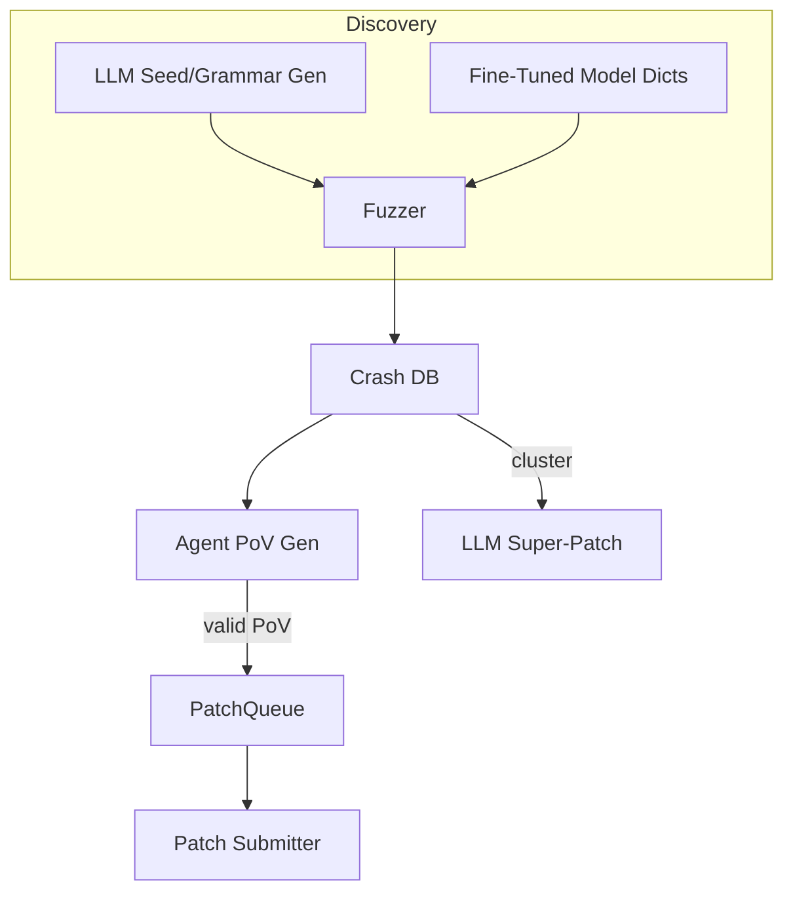

# Fuzzing Inayosaidiwa na AI na Ugunduzi wa Kiotomatiki wa Vulnerability

{{#include ../banners/hacktricks-training.md}}

## Muhtasari
Large-language models (LLMs) zinaweza kuongeza kwa kiasi kikubwa uwezo wa traditional vulnerability-research pipelines kwa kutengeneza inputs zenye maana ya kisemantiki, kuboresha grammars, kufanya reasoning juu ya crash data, na hata kupendekeza patches za kurekebisha bugs nyingi. Ukurasa huu unakusanya patterns zenye ufanisi zaidi zilizobainika wakati wa fainali za DARPA’s AI Cyber Challenge (AIxCC) na tafiti nyingine za umma.<sup>[[4]](#references)[[5]](#references)</sup>

Kinachofuata si maelezo ya mfumo mmoja mahususi wa mashindano, bali ni muhtasari wa techniques hizi ili uweze kuzitumia tena katika workflows zako mwenyewe.

---

## 1. Seed Inputs Zinazozalishwa na LLM

Traditional coverage–guided fuzzers (AFL++, libFuzzer, Honggfuzz…) huanza na corpus ndogo ya seeds na kubadilisha bytes bila mpangilio. Target input format inapokuwa changamano (SQL, URLs, custom binary protocols), random mutations kwa kawaida huharibu syntax kabla ya kufikiwa kwa branches zenye kuvutia.

LLMs zinaweza kutatua bootstrap problem hii kwa kutoa *seed generators* – scripts fupi zinazotoa **inputs zenye syntax sahihi lakini zinazohusiana na usalama**. Kwa mfano:
```prompt
SYSTEM: You are a helpful security engineer.
USER:
Write a Python3 program that prints 200 unique SQL injection strings targeting common anti-pattern mistakes (missing quotes, numeric context, stacked queries).  Ensure length ≤ 256 bytes / string so they survive common length limits.
```

```python
# gen_sqli_seeds.py (truncated)
PAYLOADS = [
"1 OR 1=1 -- ",
"' UNION SELECT NULL,NULL--",
"0; DROP TABLE users;--",
...
]
for p in PAYLOADS:
print(p)
```
Endesha mara moja na upeleke matokeo moja kwa moja kwenye corpus ya mwanzo ya fuzzer:
```bash
python3 gen_sqli_seeds.py > seeds.txt
afl-fuzz -i seeds.txt -o findings/ -- ./target @@
```
Faida:
1. Uhalali wa kisemantiki → coverage ya kina mapema.
2. Inaweza kuzalishwa upya: rekebisha prompt ili kulenga XSS, path traversal, binary blobs, n.k.
3. Nafuu (< 1 ¢ kwa GPT-3.5).

### Vidokezo
* Elekeza model *itofautishe* urefu na encoding ya payload (UTF-8, URL-encoded, UTF-16-LE) ili kupita filters za juu juu.
* Omba *script moja inayojitosheleza* – huepusha matatizo ya JSON formatting.

---

## 2. Grammar-Evolution Fuzzing

Toleo lenye nguvu zaidi ni kuifanya LLM **ibadilishe grammar** badala ya seeds halisi. Workflow (“Grammar Guy” pattern) ni:

1. Generate grammar ya awali ya ANTLR/Peach/LibFuzzer kupitia prompt.
2. Fuzz kwa dakika N na kukusanya metrics za coverage (edges / blocks hit).
3. Fanya muhtasari wa maeneo ya program ambayo hayajafikiwa na urudishe muhtasari huo kwenye model:
```prompt
The previous grammar triggered 12 % of the program edges.  Functions not reached: parse_auth, handle_upload.  Add / modify rules to cover these.
```
4. Unganisha rules mpya, fanya re-fuzz, rudia.

Pseudo-code skeleton:
```python
for epoch in range(MAX_EPOCHS):
grammar = llm.refine(grammar, feedback=coverage_stats)
save(grammar, f"grammar_{epoch}.txt")
coverage_stats = run_fuzzer(grammar)
```
Mambo muhimu:
* Weka *budget* – kila refinement hutumia tokens.
* Tumia maelekezo ya `diff` + `patch` ili model ifanye edits badala ya kuandika upya.
* Simama wakati Δcoverage < ε.

---

## 3. Uzalishaji wa PoV (Exploit) kwa Msingi wa Agents

Baada ya crash kupatikana, bado unahitaji **proof-of-vulnerability (PoV)** inayouanzisha kwa njia ya deterministic.

Njia inayoweza ku-scale ni kuanzisha *maelfu* ya agents wepesi (<process/thread/container/prisoner>), kila mmoja akiendesha LLM tofauti (GPT-4, Claude, Mixtral) au setting tofauti ya temperature.

Pipeline:
1. Static/ dynamic analysis huzalisha *bug candidates* (struct yenye crash PC, input slice, sanitizer msg).
2. Orchestrator husambaza candidates kwa agents.
3. Hatua za reasoning za agent:
a. Reproduce bug locally kwa `gdb` + input.
b. Pendekeza exploit payload ndogo zaidi.
c. Thibitisha exploit katika sandbox. Ikiwa imefanikiwa → submit.
4. Majaribio yaliyoshindwa yanawekwa tena kwenye queue kama **seeds mpya** za coverage fuzzing (feedback loop).

Faida:
* Parallelisation huficha kutotegemeka kwa agent mmoja.
* Auto-tuning ya temp / model size kulingana na success-rate iliyozingatiwa.

---

## 4. Directed Fuzzing kwa Code Models Zilizofine-Tune

Fine-tune model ya open-weight (kwa mfano Llama-7B) kwa source ya C/C++ iliyowekewa labels za vulnerability patterns (integer overflow, buffer copy, format string). Kisha:

1. Endesha static analysis ili kupata function list + AST.
2. Prompt model: *“Give mutation dictionary entries that are likely to break memory safety in function X”*.
3. Ingiza tokens hizo kwenye `AFL_CUSTOM_MUTATOR`.

Mfano wa output kwa `sprintf` wrapper:
```
{"pattern":"%99999999s"}
{"pattern":"AAAAAAAA....<1024>....%n"}
```
Kwa majaribio, hii hupunguza muda wa kufikia crash kwa zaidi ya 2× kwenye targets halisi.

---

## 5. AI-Guided Patching Strategies

### 5.1 Super Patches
Uliza model i-*cluster* crash signatures na ipendekeze **single patch** inayoondoa common root cause.  Iwasilishe mara moja, rekebisha bugs kadhaa → penalty chache za accuracy katika mazingira ambapo kila patch isiyo sahihi hugharimu points.

Muhtasari wa prompt:
```
Here are 10 stack traces + file snippets.  Identify the shared mistake and generate a unified diff fixing all occurrences.
```
### 5.2 Uwiano wa Speculative Patch
Tekeleza queue ambayo patches zilizothibitishwa na PoV na patches za *speculative* (bila PoV) huingiliana kwa uwiano wa 1:​N uliowekwa kulingana na scoring rules (kwa mfano, 2 speculative : 1 confirmed). Cost model hufuatilia penalties dhidi ya points na kujirekebisha yenyewe N.

---

## 6. Deterministic File-by-File AI Code Review

Hali ya kawaida ya kushindwa katika AI-assisted review ni kumwomba agent mmoja akague repository nzima na kutarajia achague files na maneno sahihi ya grep. Pattern ya kuaminika zaidi ni **kulazimisha repository coverage**:<sup>[[1]](#references)</sup>

1. Orodhesha source files.
2. Tuma **file moja kwa wakati mmoja** pamoja na context ndogo (entrypoint, imports, routes/callers zilizo karibu).
3. Dai **structured report** kwa kila file: sources, sink, missing validation, exploit preconditions, na confidence.<sup>[[3]](#references)</sup>
4. Ondoa ripoti zinazojirudia kwa kutumia **source→sink pattern**, kisha validate manually zile zenye risk kubwa.

Hii hutumia tokens nyingi na hutoa noise, lakini inafaa sana katika kubaini **simple high-impact source/sink bugs** ambazo broad agentic reviews mara nyingi hukosa.

### Triage patterns zinazostahili kupewa kipaumbele

- **Dynamic PHP include/dispatch**: route/controller/module names zinazodhibitiwa na attacker na kupita kwenye `require_once()`, `include()`, au `include_once()` bila strict allowlisting na path canonicalisation.
- **Shell execution katika admin/account workflows**: usernames, domains, FTP accounts, au identifiers nyingine kufikia `exec()`, `system()`, `shell_exec()`, `passthru()`, `proc_open()`, au `popen()`.
- **Structured input fan-in**: parameter ileile kukubaliwa kutoka `$_GET`, `$_POST`, JSON, XML, au framework body parsers na baadaye kutumiwa tena katika filesystem au OS-command sinks.

### Aina mbili za practical bugs ambazo method hii hubaini vizuri

- **PHP controller-dispatch LFI/RCE**: ikiwa controller name inayodhibitiwa na request itaunganishwa kwenye `require_once()` bila allowlist/path normalisation, traversal sequences kama `../` zinaweza kusababisha PHP i-include local `.php` file isiyokusudiwa. Ikiwa attacker anaweza kuelekeza include kwenye PHP file iliyopandikizwa au yenye manufaa kwa njia nyingine, LFI hubadilika kuwa code execution. Tazama [File Inclusion / Path Traversal](../pentesting-web/file-inclusion/README.md).<sup>[[1]](#references)</sup>
- **Authenticated command injection katika hosting/admin panels**: ikiwa account-management fields kama usernames zitaingizwa ndani ya shell commands, authenticated user mwenye privileges ndogo anaweza kubadilisha create/delete action ya kawaida kuwa RCE. Impact huongezeka panel inapotekeleza command kama service account yenye privileges zaidi. Tazama [Command Injection](../pentesting-web/command-injection.md).<sup>[[1]](#references)</sup>

### Practical review notes

- Tumia LLM kama **source/sink reviewer kwanza**, si kama exploit generator.
- Iombe itaje wazi **attacker-controlled field**, **normalization/validation gap**, na **dangerous sink**.
- Kwa repos kubwa, deterministic per-file review mara nyingi huwa ya kuaminika zaidi kuliko single autonomous agent run, hata pale ya mwisho inapotumia model yenye nguvu zaidi.<sup>[[2]](#references)</sup>
- Tarajia matokeo dhaifu zaidi kwenye **Broken Access Control** na business-logic bugs nyingine ambapo exploitability inategemea cross-file assumptions, role semantics, au product-specific threat models.

---

## Kuiunganisha Yote
CRS (Cyber Reasoning System) ya end-to-end inaweza kuunganisha components kama ifuatavyo:

```mermaid
graph TD
subgraph Discovery
A[LLM Seed/Grammar Gen] --> B[Fuzzer]
C[Fine-Tuned Model Dicts] --> B
end
B --> D[Crash DB]
D --> E[Agent PoV Gen]
E -->|valid PoV| PatchQueue
D -->|cluster| F[LLM Super-Patch]
PatchQueue --> G[Patch Submitter]
```
---

## Marejeo

- [1] [Project Black - Local AI for Cyber Security: Kupata phpIPAM LFI na myVesta Authenticated RCE](https://projectblack.io/blog/local-ai-for-cyber-security)
- [2] [Strix](https://github.com/usestrix/strix)
- [3] [GitHub Copilot community security-review skill](https://github.com/github/awesome-copilot/blob/main/skills/security-review/SKILL.md)
- [4] [Trail of Bits – AIxCC finals: Simulizi la ushindani](https://blog.trailofbits.com/2025/08/07/aixcc-finals-tale-of-the-tape/)
- [5] [Mahojiano ya finalisti wa CTF Radiooo AIxCC](https://www.youtube.com/@ctfradiooo)

{{#include ../banners/hacktricks-training.md}}
