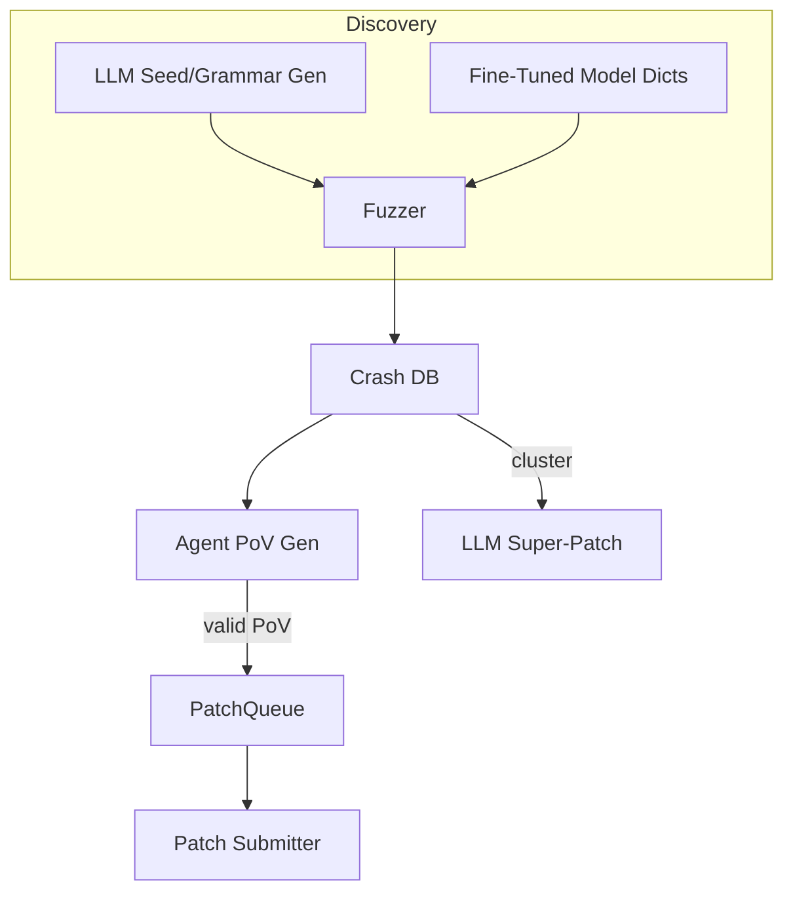

# AI Destekli Fuzzing ve Otomatik Vulnerability Discovery

{{#include ../banners/hacktricks-training.md}}

## Genel Bakış
Large-language model'ler (LLM'ler), anlamsal açıdan zengin girdiler oluşturarak, grammar'ları geliştirerek, crash verileri üzerinde akıl yürüterek ve hatta birden fazla bug'ı ele alan patch'ler önererek geleneksel vulnerability research süreçlerini büyük ölçüde güçlendirebilir. Bu sayfa, DARPA’nın AI Cyber Challenge (AIxCC) finalleri ve diğer kamuya açık araştırmalar sırasında gözlemlenen en etkili kalıpları bir araya getirir.<sup>[[4]](#references)</sup><sup>[[5]](#references)</sup>

Aşağıda belirli bir yarışma sisteminin açıklaması değil, tekniklerin bir soyutlaması sunulmaktadır; böylece bunları kendi workflow'larınızda yeniden uygulayabilirsiniz.

---

## 1. LLM Tarafından Üretilen Seed Girdileri

Geleneksel coverage–guided fuzzer'lar (AFL++, libFuzzer, Honggfuzz…) küçük bir seed corpus'u ile başlar ve byte'ları körü körüne mutate eder. Hedef input formatı karmaşık olduğunda (SQL, URL'ler, özel binary protocol'ler), random mutation'lar ilgi çekici branch'lere ulaşılmadan önce genellikle syntax'ı bozar.

LLM'ler, **syntax açısından doğru ancak security açısından anlamlı girdiler** üreten kısa script'ler olan *seed generator*'lar oluşturarak bu bootstrap sorununu çözebilir. Örneğin:
```prompt
SYSTEM: You are a helpful security engineer.
USER:
Write a Python3 program that prints 200 unique SQL injection strings targeting common anti-pattern mistakes (missing quotes, numeric context, stacked queries).  Ensure length ≤ 256 bytes / string so they survive common length limits.
```

```python
# gen_sqli_seeds.py (truncated)
PAYLOADS = [
"1 OR 1=1 -- ",
"' UNION SELECT NULL,NULL--",
"0; DROP TABLE users;--",
...
]
for p in PAYLOADS:
print(p)
```
Bir kez çalıştırın ve çıktıyı doğrudan fuzzer’ın başlangıç corpus’una besleyin:
```bash
python3 gen_sqli_seeds.py > seeds.txt
afl-fuzz -i seeds.txt -o findings/ -- ./target @@
```
Faydaları:
1. Anlamsal geçerlilik → erken aşamada daha derin coverage.
2. Yeniden üretilebilir: XSS, path traversal, binary blobs vb. konulara odaklanmak için prompt'u değiştirin.
3. Ucuz (< GPT-3.5 ile 1 ¢).

### İpuçları
* Yüzeysel filtreleri aşmak için modele payload uzunluğunu ve encoding'i (UTF-8, URL-encoded, UTF-16-LE) *çeşitlendirmesini* söyleyin.
* *Tek bir kendi kendine yeterli script* isteyin – JSON formatlama sorunlarını önler.

---

## 2. Grammar-Evolution Fuzzing

Daha güçlü bir varyant, LLM'nin somut seed'ler yerine bir **grammar'ı evrimleştirmesine** izin vermektir. İş akışı (“Grammar Guy” pattern) şöyledir:

1. Prompt aracılığıyla başlangıçta bir ANTLR/Peach/LibFuzzer grammar'ı oluşturun.
2. N dakika boyunca fuzzing yapın ve coverage metrics'i (vurulan edge / block'lar) toplayın.
3. Coverage sağlanamayan program alanlarını özetleyin ve özeti modele geri gönderin:
```prompt
The previous grammar triggered 12 % of the program edges.  Functions not reached: parse_auth, handle_upload.  Add / modify rules to cover these.
```
4. Yeni kuralları birleştirin, yeniden fuzzing yapın ve tekrarlayın.

Pseudo-code skeleton:
```python
for epoch in range(MAX_EPOCHS):
grammar = llm.refine(grammar, feedback=coverage_stats)
save(grammar, f"grammar_{epoch}.txt")
coverage_stats = run_fuzzer(grammar)
```
Önemli noktalar:
* Bir *budget* belirleyin – her iyileştirme token kullanır.
* Modelin yeniden yazmak yerine düzenleme yapması için `diff` + `patch` talimatlarını kullanın.
* Δcoverage < ε olduğunda durun.

---

## 3. Yerel-LLM libFuzzer Harness Engineering

Bir analistin workstation'ından ayrılamayacak source için yerel bir code model, fuzzer byte'ları ile bir C/C++ API arasındaki küçük adapter'ı taslak olarak oluşturabilir. Yararlı security boundary açıktır: **model test altyapısını yazar ve gözden geçirir; coverage-guided mutation input'ları keşfeder; sanitizer'lar geçersiz işlemleri bildirir; bir insan harness'ı inceler ve bulguları triage eder**.<sup>[[9]](#references)</sup>

Bir LLM'e bağlı olmayan engine-level corpus, feedback, snapshot ve stateful-fuzzing teknikleri için genel [Fuzzing Methodology](../generic-methodologies-and-resources/fuzzing.md) sayfasına bakın.

Target header'dan kopyalanan exact declaration ile başlayın ve output formatını kısıtlayın. Dar kapsamlı bir prompt, uydurulmuş API'leri azaltır ve sonucu incelemeyi kolaylaştırır:<sup>[[8]](#references)[[9]](#references)</sup>
```prompt
Write a libFuzzer target for this exact declaration:
int parse_records(const uint8_t *data, size_t size);

Output only C code. Implement LLVMFuzzerTestOneInput, include the
declaration, pass data and size unchanged, and do not use files,
network access, randomness, clocks, threads, or persistent state.
```
Ham byte parser için beklenen sonuç bundan daha karmaşık olmamalıdır:<sup>[[6]](#references)[[9]](#references)</sup>
```c
#include <stddef.h>
#include <stdint.h>

extern int parse_records(const uint8_t *, size_t);

int LLVMFuzzerTestOneInput(const uint8_t *data, size_t size) {
(void)parse_records(data, size);
return 0;
}
```
Compilation yalnızca ilk doğrulama kapısıdır. CPU zamanını harcamadan önce oluşturulan her target'ı şu değişmezlere göre inceleyin:<sup>[[6]](#references)[[8]](#references)[[9]](#references)</sup>

- **Exact API:** Türleri, ownership kurallarını, initialization, teardown ve calling convention'ı gerçek header ve mevcut caller'larla karşılaştırın.
- **Harness safety:** `data` üzerinden yapılan her okumayı koruyun; sanitizer bulguları oluşturulan glue kodundan değil, target'tan kaynaklanmalıdır.
- **Repeatability:** Sonucu `data` ve `size` değerlerinin bir fonksiyonu hâline getirin; external I/O, zamanı, kontrolsüz randomness'i, join edilmemiş thread'leri ve çağrılar arasında kalan state'i kaldırın.
- **Throughput:** Davranışı etkilemediği sürece pahalı immutable state'i yalnızca bir kez initialize edin, input boyutunu sınırlandırın, logging'i bastırın ve input başına yapılan allocation'ları free edin.
- **Reachability:** Amaçlanan function'ların ve branch'lerin çalıştığını doğrulayın. Derlenen ancak yalnızca rejection path'lerini çalıştıran bir target sessiz bir failure'dır.

### Structure-aware target'lar: bug'ları gizlemeden invariant'ları koruma

Raw input'ların çoğu magic, length, version veya checksum gate'inde başarısız oluyorsa fuzz byte'larını **typed field material** olarak kullanın ve geçerli bir object yeniden oluşturun. Format constant'larını düzeltin, semantic field'ları ve payload byte'larını mutable bırakın ve integrity metadata'yı yeniden oluşturulan payload'dan türetin. `FuzzedDataProvider`, bounded typed value'ları tüketmek için kullanışlıdır; allocation ve conversion yoluyla oluşturulan her şeyi sınırlandırmaktan ise adapter sorumlu olmaya devam eder.<sup>[[9]](#references)</sup>

<details>
<summary>Structure-aware C++ target örneği</summary>
```cpp
#include <fuzzer/FuzzedDataProvider.h>
#include <stddef.h>
#include <stdint.h>
#include <vector>

extern "C" int parse_message(const uint8_t *, size_t);

extern "C" int LLVMFuzzerTestOneInput(const uint8_t *data, size_t size) {
FuzzedDataProvider fdp(data, size);
uint8_t version = fdp.ConsumeIntegral<uint8_t>();
auto body = fdp.ConsumeRemainingBytes<uint8_t>();
if (body.size() > UINT16_MAX) body.resize(UINT16_MAX);
uint16_t len = static_cast<uint16_t>(body.size());
std::vector<uint8_t> msg = {0x8b, 'M', 'S', 'G', version,
static_cast<uint8_t>(len >> 8),
static_cast<uint8_t>(len)};
msg.insert(msg.end(), body.begin(), body.end());
(void)parse_message(msg.data(), msg.size());
return 0;
}
```
</details>

Her soru için tek bir structure-repairing target kullanmayın. Derin ve geçerli durumları keşfetmek için uzunlukları/checksum'ları türeten bir target, harness'ın kendi okumalarını ve allocation'larını sınırlandırırken **declared** metadata'yı fuzzer'ın kontrolünde tutan başka bir target kullanın. İkinci target, automatic repair'ın aksi hâlde ortadan kaldıracağı uyumsuz uzunluk ve hatalı bütünlük attack surface'lerini korur.<sup>[[9]](#references)</sup>

### Seeds, dictionaries, sanitizers ve coverage feedback

Modelden binary'yi doğrudan yazdırmasını istemek yerine binary seeds yazan bir script oluşturmasını isteyin. Boş, minimal, tipik ve sınırda geçerli nesnelerle seed oluşturun; ardından magic değerlerini, tag'leri, enum encoding'lerini ve parser keyword'lerini incelenmiş bir dictionary'ye aktarın. libFuzzer bu dictionary'yi `-dict=` ile kabul eder ve yeni coverage ortaya çıkaran mutation'ları corpus'ta tutar.<sup>[[6]](#references)[[9]](#references)</sup>
```text
magic="\x8bMSG"
version_min="\x00"
version_max="\xff"
config_tag="CONFIG"
```
Tamamlayıcı enstrümantasyonla aynı hedefi derleyin. ASan ve UBSan aynı fuzzing binary'sini paylaşabilir; enstrümante edilmemiş koddan kaynaklanan raporları önlemek için ayrı bir MSan derlemesi kullanın ve bağımlılıklarını enstrümante edin.<sup>[[6]](#references)[[9]](#references)</sup>
```bash
clang++ -g -O1 -fsanitize=fuzzer,address,undefined \
-fno-sanitize-recover=undefined target.cc harness.cc -o fuzz_target
./fuzz_target corpus -dict=msg.dict -max_len=65535

clang++ -g -O1 -fsanitize=fuzzer,memory \
target.cc harness.cc -o fuzz_target_msan
```
Her model revizyonu için coverage'ı değerlendirici olarak kullanın. libFuzzer çıktısında erken dönemde düz kalan `cov`/`ft` ve statik bir corpus genellikle hatalı framing, aşırı kısıtlayıcı bir early return veya yanlış çağrı anlamına gelir; düşük `exec/s` ise pahalı setup, I/O, allocation veya leaked state sorunlarına işaret eder. `NEW` yalnızca bir coverage özelliğinin değiştiğini kanıtlar; amaçlanan parser'a ulaşıldığını değil.<sup>[[6]](#references)[[9]](#references)</sup>

Source-level feedback için bir coverage build oluşturun, bunu fuzz edin ve modele yalnızca kapsanmayan fonksiyonları ve bunları koruyan koşulları verin. Ortaya çıkan harness/seed/dictionary diff'ini doğrulayın ve yeniden ölçüm yapın:<sup>[[7]](#references)[[8]](#references)[[9]](#references)</sup>
```bash
clang++ -g -O1 -fsanitize=fuzzer \
-fprofile-instr-generate -fcoverage-mapping target.cc harness.cc -o fuzz_cov
mkdir -p profiles
LLVM_PROFILE_FILE='profiles/%p.profraw' ./fuzz_cov -max_total_time=300 corpus
llvm-profdata merge -sparse profiles/*.profraw -o fuzz.profdata
llvm-cov report ./fuzz_cov -instr-profile=fuzz.profdata
llvm-cov show ./fuzz_cov -instr-profile=fuzz.profdata \
--show-branches=count --region-coverage-lt=1 target.cc
```
Bu nedenle ölçeklenebilir döngü **generate → compile/link → smoke-test under sanitizers → measure target coverage → provide the smallest relevant coverage/source context → revise → re-measure** şeklindedir. OSS-Fuzz-Gen, üretilen target'ları derlenebilirlik, runtime failures, coverage ve mevcut target'lara kıyasla coverage improvement açısından değerlendirerek, makul görünen kodu olduğu gibi kabul etmek yerine aynı prensibi uygular.<sup>[[7]](#references)[[8]](#references)</sup>

---

## 4. Agent-Based PoV (Exploit) Generation

Bir crash bulduktan sonra, onu deterministik olarak tetikleyen bir **proof-of-vulnerability (PoV)** elde etmeniz gerekir.

Ölçeklenebilir bir yaklaşım, her biri farklı bir model veya sampling configuration kullanan çok sayıda lightweight worker (process, thread veya container) başlatmaktır. AIxCC finalist survey, somut ölçek örnekleri sunar: Bir ekip AI-first PoV generation için **thousands of concurrent agents** kullanırken, başka bir ekip **300–500 fuzzing agents** orkestre etmiş ve LLM'leri higher-level semantic reasoning için ayırmıştır.<sup>[[4]](#references)</sup>

Pipeline:
1. Static/ dynamic analysis, *bug candidates* üretir (crash PC, input slice, sanitizer msg içeren struct).
2. Orchestrator, adayları agent'lara dağıtır.
3. Agent reasoning adımları:
a. Bug'ı `gdb` + input ile local olarak yeniden üret.
b. Minimal exploit payload öner.
c. Exploit'i sandbox'ta doğrula.  Başarılıysa → submit et.
4. Başarısız denemeler, coverage fuzzing için **new seeds** olarak **re-queued** edilir (feedback loop).

Avantajlar:
* Parallelisation, single-agent unreliability'yi gizler.
* Gözlemlenen success-rate'e göre temp / model size için auto-tuning.

---

## 5. Fine-Tuned Code Models ile Directed Fuzzing

Bir open-weight modeli (ör. Llama-7B), vulnerability patterns (integer overflow, buffer copy, format string) ile etiketlenmiş C/C++ source üzerinde fine-tune edin. Ardından:

1. Function listesi + AST elde etmek için static analysis çalıştırın.
2. Modele şu prompt'u verin: *“Give mutation dictionary entries that are likely to break memory safety in function X”*.
3. Bu token'ları özel bir `AFL_CUSTOM_MUTATOR` içine ekleyin.

Bir `sprintf` wrapper için örnek çıktı:
```
{"pattern":"%99999999s"}
{"pattern":"AAAAAAAA....<1024>....%n"}
```
Deneysel olarak bu, gerçek hedeflerde crash'e kadar geçen süreyi >2× kısaltır.

---

## 6. AI-Guided Patching Strategies

### 6.1 Super Patches
Modelden crash imzalarını *cluster* hâline getirmesini ve ortak kök nedeni ortadan kaldıran **tek bir patch** önermesini isteyin. Bir kez gönderin, birkaç bug'ı düzeltin → her hatalı patch'in puan kaybettirdiği ortamlarda daha az doğruluk cezası.

Prompt taslağı:
```
Here are 10 stack traces + file snippets.  Identify the shared mistake and generate a unified diff fixing all occurrences.
```
### 6.2 Speculative Patch Ratio
Doğrulanmış PoV-validated patch'leri ve *speculative* patch'leri (PoV olmadan) scoring rules'a göre ayarlanmış 1:​N oranında birbiriyle interleave eden bir queue uygulayın (ör. 2 speculative : 1 confirmed). Bir cost model, penalties ile points arasındaki dengeyi izler ve N değerini otomatik olarak ayarlar.

---

## 7. Deterministic File-by-File AI Code Review

AI-assisted review'da sık görülen bir failure mode, tek bir agent'tan tüm repository'yi incelemesini istemek ve doğru dosyaları ve grep terimlerini seçmesini ummaktır. Daha güvenilir bir pattern, **repository coverage'ı zorlamaktır**:<sup>[[1]](#references)</sup>

1. Source dosyalarını enumerate edin.
2. **Her seferinde tek bir dosya** ve minimum context'i (entrypoint, imports, yakındaki routes/callers) gönderin.
3. Her dosya için **structured report** isteyin: sources, sink, eksik validation, exploit preconditions ve confidence.<sup>[[3]](#references)</sup>
4. Report'ları **source→sink pattern** üzerinden deduplicate edin ve high-risk olanları manuel olarak validate edin.

Bu yöntem token açısından maliyetli ve gürültülüdür, ancak geniş agentic review'ların sıklıkla gözden kaçırdığı **basit ve yüksek etkili source/sink bug'larını** ortaya çıkarmada oldukça etkilidir.

### Öncelik verilmeye değer triage pattern'leri

- **Dynamic PHP include/dispatch**: attacker-controlled route/controller/module adlarının, strict allowlisting ve path canonicalisation olmadan `require_once()`, `include()` veya `include_once()` içine akması.
- **Admin/account workflow'larında shell execution**: username'lerin, domain'lerin, FTP account'larının veya diğer identifier'ların `exec()`, `system()`, `shell_exec()`, `passthru()`, `proc_open()` ya da `popen()` fonksiyonlarına ulaşması.
- **Structured input fan-in**: aynı parameter'ın `$_GET`, `$_POST`, JSON, XML veya framework body parser'larından kabul edilmesi ve daha sonra filesystem ya da OS-command sink'lerinde yeniden kullanılması.

### Bu yöntemin iyi bulduğu iki pratik bug sınıfı

- **PHP controller-dispatch LFI/RCE**: request-controlled controller name, allowlist/path normalisation olmadan `require_once()` içine birleştiriliyorsa `../` gibi traversal sequence'ları PHP'nin istenmeyen bir local `.php` dosyasını include etmesini sağlayabilir. Attacker, include işlemini planted veya başka şekilde kullanılabilir bir PHP dosyasına yönlendirebiliyorsa LFI, code execution'a dönüşür. Bkz. [File Inclusion / Path Traversal](../pentesting-web/file-inclusion/README.md).<sup>[[1]](#references)</sup>
- **Hosting/admin panel'lerinde authenticated command injection**: username gibi account-management field'ları shell command'larına gömülüyorsa, düşük ayrıcalıklı authenticated bir user normal bir create/delete action'ını RCE'ye dönüştürebilir. Panel command'ı daha ayrıcalıklı bir service account olarak çalıştırdığında impact artar. Bkz. [Command Injection](../pentesting-web/command-injection.md).<sup>[[1]](#references)</sup>

### Pratik review notları

- LLM'i önce bir **source/sink reviewer** olarak kullanın; exploit generator olarak değil.
- Ondan **attacker-controlled field**'ı, **normalization/validation gap**'ini ve **dangerous sink**'i açıkça listelemesini isteyin.
- Büyük repo'larda deterministic per-file review, daha güçlü bir model kullansa bile tek bir autonomous agent run'ından genellikle daha güvenilirdir.<sup>[[2]](#references)</sup>
- Exploitability'nin cross-file assumption'lara, role semantics'e veya product-specific threat model'lerine bağlı olduğu **Broken Access Control** ve diğer business-logic bug'larında daha zayıf sonuçlar bekleyin.

---

## Hepsini Bir Araya Getirmek
Uçtan uca bir CRS (Cyber Reasoning System), component'leri şu şekilde birbirine bağlayabilir:

```mermaid
graph TD
subgraph Discovery
A[LLM Seed/Grammar Gen] --> B[Fuzzer]
C[Fine-Tuned Model Dicts] --> B
end
B --> D[Crash DB]
D --> E[Agent PoV Gen]
E -->|valid PoV| PatchQueue
D -->|cluster| F[LLM Super-Patch]
PatchQueue --> G[Patch Submitter]
```
---

## References

- [1] [Project Black - Cyber Security için Yerel AI: phpIPAM LFI ve myVesta Authenticated RCE Bulma](https://projectblack.io/blog/local-ai-for-cyber-security)
- [2] [Strix](https://github.com/usestrix/strix)
- [3] [GitHub Copilot topluluğunun security-review skill'i](https://github.com/github/awesome-copilot/blob/main/skills/security-review/SKILL.md)
- [4] [Trail of Bits – AIxCC finalleri: Karşılaştırma](https://blog.trailofbits.com/2025/08/07/aixcc-finals-tale-of-the-tape/)
- [5] [CTF Radiooo AIxCC finalist röportajları](https://www.youtube.com/@ctfradiooo)
- [6] [LLVM — libFuzzer: coverage-guided fuzz testing için bir kütüphane](https://llvm.org/docs/LibFuzzer.html)
- [7] [Google — OSS-Fuzz-Gen](https://github.com/google/oss-fuzz-gen)
- [8] [Google Online Security Blog — Fuzzing'i geliştirmek: AI ile daha fazla vulnerability bulma](https://security.googleblog.com/2024/11/leveling-up-fuzzing-finding-more.html)
- [9] [8kSec — Local LLM ile AI Destekli Fuzzing Harness Oluşturma](https://8ksec.io/ai-assisted-fuzzing-harness-local-llm)
{{#include ../banners/hacktricks-training.md}}
