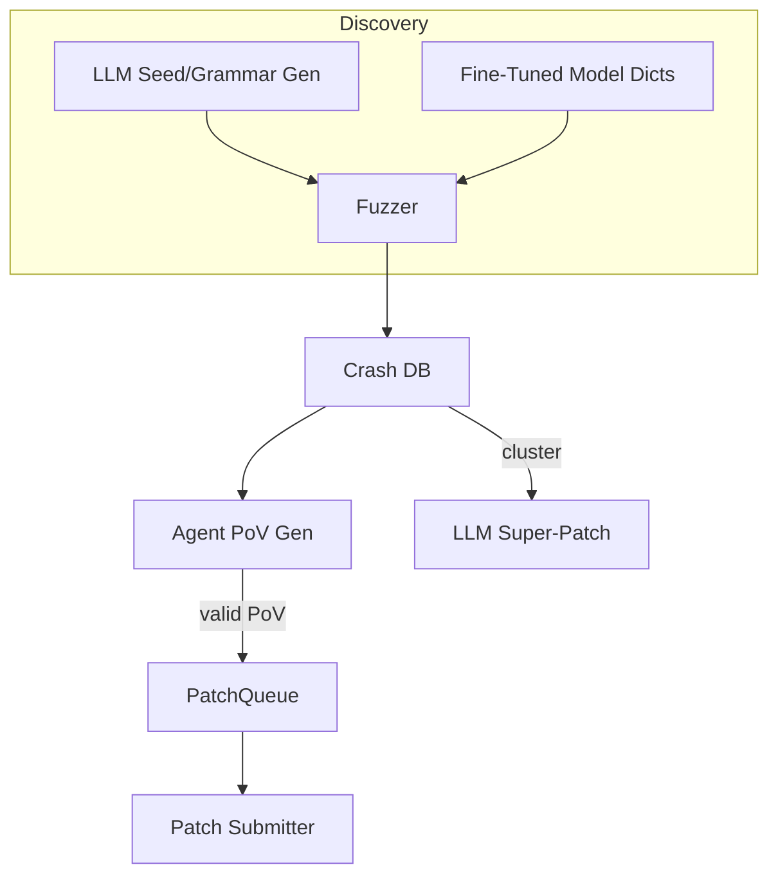

# AI-Assisted Fuzzing & Automated Vulnerability Discovery

{{#include ../banners/hacktricks-training.md}}

## 概述
Large-language models（LLMs）可以通过生成语义丰富的输入、演进语法、分析 crash 数据，甚至提出包含多个 bug 的补丁，大幅增强传统的 vulnerability-research 流程。本文汇集了 DARPA’s AI Cyber Challenge（AIxCC）决赛及其他公开研究中观察到的最有效模式。<sup>[[4]](#references)</sup><sup>[[5]](#references)</sup>

以下内容并非对某个具体竞赛系统的描述，而是对相关技术的抽象，因此你可以在自己的工作流中复现这些方法。

---

## 1. LLM-Generated Seed Inputs

传统的 coverage-guided fuzzers（AFL++、libFuzzer、Honggfuzz……）从一小组 seed corpus 开始，并盲目地变异字节。当目标输入格式较为复杂（SQL、URLs、自定义二进制协议）时，随机变异通常会在到达有趣的分支之前破坏语法。

LLMs 可以通过生成 *seed generators*（用于输出 seed 的简短脚本）解决这一启动问题，这些脚本可以输出**语法正确但与安全相关的输入**。例如：
```prompt
SYSTEM: You are a helpful security engineer.
USER:
Write a Python3 program that prints 200 unique SQL injection strings targeting common anti-pattern mistakes (missing quotes, numeric context, stacked queries).  Ensure length ≤ 256 bytes / string so they survive common length limits.
```

```python
# gen_sqli_seeds.py (truncated)
PAYLOADS = [
"1 OR 1=1 -- ",
"' UNION SELECT NULL,NULL--",
"0; DROP TABLE users;--",
...
]
for p in PAYLOADS:
print(p)
```
运行一次，并将输出直接馈送到 fuzzer 的初始语料库：
```bash
python3 gen_sqli_seeds.py > seeds.txt
afl-fuzz -i seeds.txt -o findings/ -- ./target @@
```
Benefits:
1. 语义有效性 → 更早实现更深的覆盖率。
2. 可重新生成：调整 prompt，即可专注于 XSS、path traversal、二进制 blobs 等。
3. 成本低（使用 GPT-3.5 时低于 1 美分）。

### Tips
* 指示模型对 payload 长度和编码方式进行*多样化*（UTF-8、URL-encoded、UTF-16-LE），以绕过表层过滤器。
* 要求生成一个*单一的自包含脚本*，避免 JSON 格式问题。

---

## 2. Grammar-Evolution Fuzzing

一种更强大的变体是让 LLM **演进 grammar**，而不是生成具体的 seeds。其工作流程（“Grammar Guy”模式）如下：

1. 通过 prompt 生成初始的 ANTLR/Peach/LibFuzzer grammar。
2. fuzz N 分钟，并收集覆盖率指标（命中的 edges / blocks）。
3. 总结未覆盖的程序区域，并将摘要反馈给模型：
```prompt
The previous grammar triggered 12 % of the program edges.  Functions not reached: parse_auth, handle_upload.  Add / modify rules to cover these.
```
4. 合并新规则，重新 fuzz，并重复上述过程。

Pseudo-code skeleton:
```python
for epoch in range(MAX_EPOCHS):
grammar = llm.refine(grammar, feedback=coverage_stats)
save(grammar, f"grammar_{epoch}.txt")
coverage_stats = run_fuzzer(grammar)
```
要点：
* 保持 *budget* ——每次 refinement 都会消耗 tokens。
* 使用 `diff` + `patch` 指令，让模型进行编辑而不是重写。
* 当 Δcoverage < ε 时停止。

---

## 3. Local-LLM libFuzzer Harness Engineering

对于不能离开分析人员工作站的 source，本地 code model 可以起草 fuzzer bytes 与 C/C++ API 之间的小型 adapter。实用的 security boundary 是明确的：**模型编写并修订 test infrastructure；coverage-guided mutation 探索 inputs；sanitizers 报告无效操作；human review harness 并 triage findings**。<sup>[[9]](#references)</sup>

对于不依赖 LLM 的 engine-level corpus、feedback、snapshot 和 stateful-fuzzing techniques，请参阅通用的 [Fuzzing Methodology](../generic-methodologies-and-resources/fuzzing.md)。

从 target header 中复制的 exact declaration 开始，并限制 output format。窄范围的 prompt 可减少虚构的 APIs，并使结果易于 review：<sup>[[8]](#references)[[9]](#references)</sup>
```prompt
Write a libFuzzer target for this exact declaration:
int parse_records(const uint8_t *data, size_t size);

Output only C code. Implement LLVMFuzzerTestOneInput, include the
declaration, pass data and size unchanged, and do not use files,
network access, randomness, clocks, threads, or persistent state.
```
对于 raw byte parser，预期结果不应比以下内容更复杂：<sup>[[6]](#references)[[9]](#references)</sup>
```c
#include <stddef.h>
#include <stdint.h>

extern int parse_records(const uint8_t *, size_t);

int LLVMFuzzerTestOneInput(const uint8_t *data, size_t size) {
(void)parse_records(data, size);
return 0;
}
```
编译只是第一个验证关卡。在为每个生成的 target 消耗 CPU 时间之前，请根据以下不变量逐一检查：<sup>[[6]](#references)[[8]](#references)[[9]](#references)</sup>

- **Exact API：** 将类型、所有权规则、初始化、teardown 和 calling convention 与真实 header 及现有 callers 进行比较。
- **Harness safety：** 对每次从 `data` 的读取进行保护；sanitizer 发现的问题必须源自 target，而不是生成的 glue。
- **Repeatability：** 使结果成为 `data` 和 `size` 的函数；移除外部 I/O、时间、不可控的 randomness、未 join 的线程，以及在调用之间持续存在的状态。
- **Throughput：** 仅在不会影响行为时初始化一次昂贵的 immutable state，限制 input size，抑制 logging，并释放每个 input 的 allocations。
- **Reachability：** 验证预期的 functions 和 branches 确实执行。能够编译但只执行 rejection paths 的 target 是一种 silent failure。

### Structure-aware targets：在不隐藏 bugs 的情况下保留 invariants

如果大多数 raw inputs 都无法通过 magic、length、version 或 checksum gate，请将 fuzz bytes 用作**typed field material**，并重建一个 valid object。固定 format constants，使 semantic fields 和 payload bytes 保持 mutable，并根据重建后的 payload 推导 integrity metadata。`FuzzedDataProvider` 适合用于消费有界的 typed values，而 adapter 仍负责限制任何 generated allocation 和 conversion。<sup>[[9]](#references)</sup>

<details>
<summary>Structure-aware C++ target 示例</summary>
```cpp
#include <fuzzer/FuzzedDataProvider.h>
#include <stddef.h>
#include <stdint.h>
#include <vector>

extern "C" int parse_message(const uint8_t *, size_t);

extern "C" int LLVMFuzzerTestOneInput(const uint8_t *data, size_t size) {
FuzzedDataProvider fdp(data, size);
uint8_t version = fdp.ConsumeIntegral<uint8_t>();
auto body = fdp.ConsumeRemainingBytes<uint8_t>();
if (body.size() > UINT16_MAX) body.resize(UINT16_MAX);
uint16_t len = static_cast<uint16_t>(body.size());
std::vector<uint8_t> msg = {0x8b, 'M', 'S', 'G', version,
static_cast<uint8_t>(len >> 8),
static_cast<uint8_t>(len)};
msg.insert(msg.end(), body.begin(), body.end());
(void)parse_message(msg.data(), msg.size());
return 0;
}
```
</details>

不要对每个问题都使用同一个结构修复目标。维护一个用于推导长度/校验和、探索深层有效状态的目标，以及另一个让 **declared** 元数据由 fuzzer 控制、仅限制 harness 自身读取和分配的目标。第二个目标保留了长度不匹配和完整性错误的 attack surface，而自动修复会抹去这些 attack surface。<sup>[[9]](#references)</sup>

### Seeds、dictionaries、sanitizers 和 coverage feedback

要求模型生成一个写入二进制 seeds 的脚本，而不是让它直接打印二进制数据。为对象准备 empty、minimal、typical 和 boundary-valid seeds；然后将 magic values、tags、enum encodings 和 parser keywords 提取到经过审查的 dictionary 中。libFuzzer 可通过 `-dict=` 接受该 dictionary，并将暴露新 coverage 的 mutations 保留在 corpus 中。<sup>[[6]](#references)[[9]](#references)</sup>
```text
magic="\x8bMSG"
version_min="\x00"
version_max="\xff"
config_tag="CONFIG"
```
使用互补的 instrumentation 构建相同的目标。ASan 和 UBSan 可以共用一个 fuzzing binary；使用单独的 MSan 构建，并对其 dependencies 进行 instrumentation，以避免由未进行 instrumentation 的代码导致的报告。<sup>[[6]](#references)[[9]](#references)</sup>
```bash
clang++ -g -O1 -fsanitize=fuzzer,address,undefined \
-fno-sanitize-recover=undefined target.cc harness.cc -o fuzz_target
./fuzz_target corpus -dict=msg.dict -max_len=65535

clang++ -g -O1 -fsanitize=fuzzer,memory \
target.cc harness.cc -o fuzz_target_msan
```
将 coverage 作为每个模型修订版本的评估指标。在 libFuzzer 输出中，早期趋平的 `cov`/`ft` 和静态 corpus 通常意味着 framing 错误、过于严格的 early return，或调用错误；较低的 `exec/s` 则表明 setup、I/O、内存分配成本高，或存在泄漏的 state。`NEW` 只能证明某个 coverage feature 发生了变化，不能证明已到达目标 parser。<sup>[[6]](#references)[[9]](#references)</sup>

对于 source-level feedback，构建 coverage build，运行 fuzzing，并只向模型提供未覆盖的 functions 及其 guarding conditions。验证生成的 harness/seed/dictionary diff，然后重新测量：<sup>[[7]](#references)[[8]](#references)[[9]](#references)</sup>
```bash
clang++ -g -O1 -fsanitize=fuzzer \
-fprofile-instr-generate -fcoverage-mapping target.cc harness.cc -o fuzz_cov
mkdir -p profiles
LLVM_PROFILE_FILE='profiles/%p.profraw' ./fuzz_cov -max_total_time=300 corpus
llvm-profdata merge -sparse profiles/*.profraw -o fuzz.profdata
llvm-cov report ./fuzz_cov -instr-profile=fuzz.profdata
llvm-cov show ./fuzz_cov -instr-profile=fuzz.profdata \
--show-branches=count --region-coverage-lt=1 target.cc
```
因此，可扩展的循环是 **generate → compile/link → smoke-test under sanitizers → measure target coverage → provide the smallest relevant coverage/source context → revise → re-measure**。OSS-Fuzz-Gen 通过评估生成 target 的可编译性、运行时故障、coverage，以及相对于现有 target 的 coverage 改进来应用同一原则，而不是仅凭代码表面上看似合理就接受它。<sup>[[7]](#references)[[8]](#references)</sup>

---

## 4. 基于 Agent 的 PoV（Exploit）生成

发现 crash 后，你仍然需要一个能够确定性触发该 crash 的 **proof-of-vulnerability（PoV）**。

一种可扩展的方法是生成许多轻量级 worker（进程、线程或容器），每个 worker 使用不同的 model 或 sampling 配置。AIxCC finalist survey 给出了具体的规模示例：一个团队使用了**数千个并发 agent**进行 AI-first PoV 生成，而另一个团队编排了 **300–500 个 fuzzing agent**，并将 LLM 保留用于更高层次的语义推理。<sup>[[4]](#references)</sup>

Pipeline：
1. Static/ dynamic analysis 生成 *bug candidate*（包含 crash PC、input slice、sanitizer msg 的 struct）。
2. Orchestrator 将 candidate 分发给 agent。
3. Agent reasoning steps：
a. 使用 `gdb` + input 在本地复现 bug。
b. 提出最小 exploit payload。
c. 在 sandbox 中验证 exploit。  如果成功 → submit。
4. 失败的尝试会作为 coverage fuzzing 的**新 seed**重新排队（feedback loop）。

Advantages：
* Parallelisation 可以隐藏单个 agent 的不可靠性。
* 根据观察到的 success-rate 自动调节 temp / model size。

---

## 5. 使用 Fine-Tuned Code Models 进行 Directed Fuzzing

在带有 vulnerability pattern（integer overflow、buffer copy、format string）标注的 C/C++ source 上，对 open-weight model（例如 Llama-7B）进行 fine-tune。然后：

1. 运行 static analysis，获取 function list + AST。
2. Prompt model：*“Give mutation dictionary entries that are likely to break memory safety in function X”*。
3. 将这些 token 插入自定义的 `AFL_CUSTOM_MUTATOR`。

以一个 `sprintf` wrapper 为例，输出如下：
```
{"pattern":"%99999999s"}
{"pattern":"AAAAAAAA....<1024>....%n"}
```
通过实证，在真实 targets 上，这会将 time-to-crash 缩短超过 2 倍。

---

## 6. AI-Guided Patching Strategies

### 6.1 Super Patches
要求模型对 crash signatures 进行 *cluster*，并提出一个**单一 patch**，以消除共同的根本原因。一次提交，修复多个 bugs → 在每个错误 patch 都会扣分的环境中，减少准确性惩罚。

Prompt 大纲：
```
Here are 10 stack traces + file snippets.  Identify the shared mistake and generate a unified diff fixing all occurrences.
```
### 6.2 Speculative Patch Ratio
实现一个队列，使经过确认且由 PoV 验证的 patch 与 *speculative* patch（无 PoV）按照根据评分规则调节的 1:​N 比例交错排列（例如 2 个 speculative : 1 个 confirmed）。成本模型会监控 penalty 与得分，并自动调整 N。

---

## 7. Deterministic File-by-File AI Code Review

AI-assisted review 中一种常见的失败模式，是要求一个 agent 检查整个 repository，然后希望它自行选择正确的文件和 grep 关键词。更可靠的模式是**强制覆盖 repository**：<sup>[[1]](#references)</sup>

1. 枚举 source files。
2. 一次发送**一个文件**，并附带最少的上下文（entrypoint、imports、相邻的 routes/callers）。
3. 要求每个文件提供一份**结构化报告**：sources、sink、缺失的 validation、exploit 前置条件和 confidence。<sup>[[3]](#references)</sup>
4. 按 **source→sink pattern** 对报告去重，并手动验证高风险项目。

这种方法消耗的 token 较多且噪声较大，但非常擅长发现广泛的 agentic review 经常遗漏的**简单且影响高的 source/sink bugs**。

### 值得优先处理的 Triage patterns

- **Dynamic PHP include/dispatch**：攻击者控制的 route/controller/module 名称流入 `require_once()`、`include()` 或 `include_once()`，但没有严格的 allowlisting 和 path canonicalisation。
- **Shell execution in admin/account workflows**：用户名、域名、FTP 账户或其他标识符到达 `exec()`、`system()`、`shell_exec()`、`passthru()`、`proc_open()` 或 `popen()`。
- **Structured input fan-in**：同一个 parameter 可从 `$_GET`、`$_POST`、JSON、XML 或 framework body parsers 接收，之后又被用于 filesystem 或 OS-command sinks。

### 这种方法擅长发现的两类实用 bug

- **PHP controller-dispatch LFI/RCE**：如果由 request 控制的 controller name 被拼接到 `require_once()` 中，且没有 allowlist/path normalisation，那么诸如 `../` 的 traversal sequences 可能使 PHP include 非预期的本地 `.php` 文件。如果攻击者能够将 include 指向已植入或其他有用的 PHP 文件，LFI 就会变成 code execution。参见 [File Inclusion / Path Traversal](../pentesting-web/file-inclusion/README.md)。<sup>[[1]](#references)</sup>
- **Authenticated command injection in hosting/admin panels**：如果用户名等 account-management fields 被嵌入 shell commands，低权限的 authenticated user 可能将正常的 create/delete 操作转变为 RCE。当 panel 以权限更高的 service account 执行该 command 时，影响会进一步扩大。参见 [Command Injection](../pentesting-web/command-injection.md)。<sup>[[1]](#references)</sup>

### 实用 review notes

- 首先将 LLM 用作 **source/sink reviewer**，而不是 exploit generator。
- 要求它明确列出**攻击者控制的 field**、**normalization/validation gap** 以及**危险的 sink**。
- 对于大型 repos，即使单个 autonomous agent run 使用了更强的 model，确定性的逐文件 review 通常也更可靠。<sup>[[2]](#references)</sup>
- 对于 **Broken Access Control** 及其他 business-logic bugs，应预期结果较弱，因为其 exploitability 取决于跨文件假设、role semantics 或产品特定的 threat models。

---

## 将所有部分整合起来
端到端的 CRS (Cyber Reasoning System) 可以按如下方式连接这些组件：

```mermaid
graph TD
subgraph Discovery
A[LLM Seed/Grammar Gen] --> B[Fuzzer]
C[Fine-Tuned Model Dicts] --> B
end
B --> D[Crash DB]
D --> E[Agent PoV Gen]
E -->|valid PoV| PatchQueue
D -->|cluster| F[LLM Super-Patch]
PatchQueue --> G[Patch Submitter]
```
---

## References

- [1] [Project Black - 用于 Cyber Security 的 Local AI：发现 phpIPAM LFI 和 myVesta Authenticated RCE](https://projectblack.io/blog/local-ai-for-cyber-security)
- [2] [Strix](https://github.com/usestrix/strix)
- [3] [GitHub Copilot 社区 security-review skill](https://github.com/github/awesome-copilot/blob/main/skills/security-review/SKILL.md)
- [4] [Trail of Bits – AIxCC 决赛：Tale of the tape](https://blog.trailofbits.com/2025/08/07/aixcc-finals-tale-of-the-tape/)
- [5] [CTF Radiooo AIxCC finalist interviews](https://www.youtube.com/@ctfradiooo)
- [6] [LLVM — libFuzzer：用于 coverage-guided fuzz testing 的 library](https://llvm.org/docs/LibFuzzer.html)
- [7] [Google — OSS-Fuzz-Gen](https://github.com/google/oss-fuzz-gen)
- [8] [Google Online Security Blog — Leveling Up Fuzzing：使用 AI 发现更多 vulnerabilities](https://security.googleblog.com/2024/11/leveling-up-fuzzing-finding-more.html)
- [9] [8kSec — 使用 Local LLM 生成 AI-Assisted Fuzzing Harness](https://8ksec.io/ai-assisted-fuzzing-harness-local-llm)
{{#include ../banners/hacktricks-training.md}}
