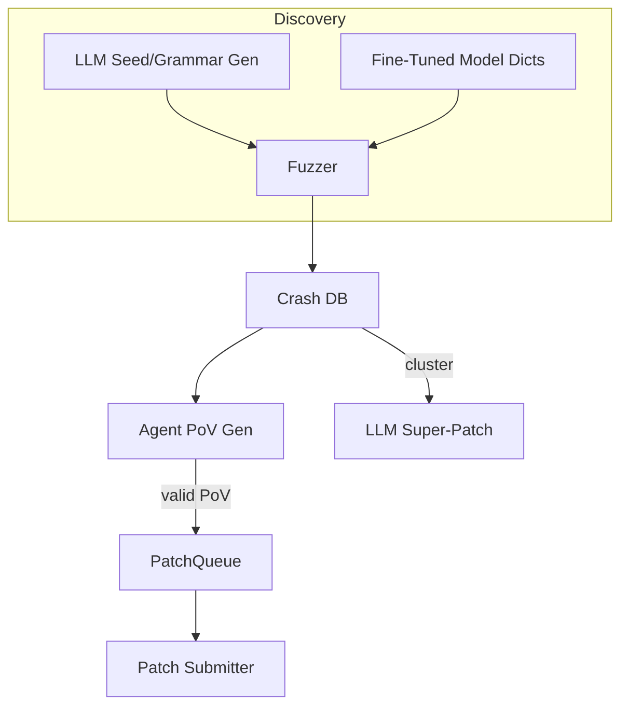

# Fuzzing asistido por AI y descubrimiento automatizado de vulnerabilidades

{{#include ../banners/hacktricks-training.md}}

## Descripción general
Los modelos de lenguaje de gran tamaño (LLMs) pueden potenciar enormemente los pipelines tradicionales de investigación de vulnerabilidades al generar inputs semánticamente ricos, evolucionar gramáticas, razonar sobre datos de crashes e incluso proponer patches para múltiples bugs. Esta página recopila los patrones más efectivos observados durante las finales del AI Cyber Challenge (AIxCC) de DARPA y otras investigaciones públicas.<sup>[[4]](#references)[[5]](#references)</sup>

Lo que sigue no es una descripción de un sistema específico de una competición, sino una abstracción de las técnicas para que puedas reproducirlas en tus propios workflows.

---

## 1. Seed Inputs generados por LLMs

Los fuzzers tradicionales guiados por cobertura (AFL++, libFuzzer, Honggfuzz…) comienzan con un corpus pequeño de seeds y mutan bytes a ciegas. Cuando el formato del input objetivo es complejo (SQL, URLs, protocolos binarios personalizados), las mutaciones aleatorias normalmente rompen la sintaxis antes de alcanzar branches interesantes.

Los LLMs pueden resolver este problema de bootstrap generando *seed generators*: scripts cortos que producen **inputs sintácticamente correctos, pero relevantes para la seguridad**. Por ejemplo:
```prompt
SYSTEM: You are a helpful security engineer.
USER:
Write a Python3 program that prints 200 unique SQL injection strings targeting common anti-pattern mistakes (missing quotes, numeric context, stacked queries).  Ensure length ≤ 256 bytes / string so they survive common length limits.
```

```python
# gen_sqli_seeds.py (truncated)
PAYLOADS = [
"1 OR 1=1 -- ",
"' UNION SELECT NULL,NULL--",
"0; DROP TABLE users;--",
...
]
for p in PAYLOADS:
print(p)
```
Ejecuta una vez y alimenta directamente la salida al corpus inicial del fuzzer:
```bash
python3 gen_sqli_seeds.py > seeds.txt
afl-fuzz -i seeds.txt -o findings/ -- ./target @@
```
Benefits:
1. Validez semántica → cobertura más profunda desde el principio.
2. Regenerable: ajusta el prompt para centrarse en XSS, path traversal, binary blobs, etc.
3. Económico (< 1 ¢ con GPT-3.5).

### Consejos
* Indica al modelo que *diversifique* la longitud y la codificación de los payloads (UTF-8, URL-encoded, UTF-16-LE) para evadir filtros superficiales.
* Pide un *script único y autocontenido*: evita problemas de formato JSON.

---

## 2. Grammar-Evolution Fuzzing

Una variante más potente consiste en permitir que el LLM **evolucione una gramática** en lugar de seeds concretos. El flujo de trabajo (patrón “Grammar Guy”) es:

1. Generar una gramática inicial de ANTLR/Peach/LibFuzzer mediante un prompt.
2. Ejecutar fuzzing durante N minutos y recopilar métricas de cobertura (edges / blocks alcanzados).
3. Resumir las áreas del programa no cubiertas y enviar el resumen de vuelta al modelo:
```prompt
The previous grammar triggered 12 % of the program edges.  Functions not reached: parse_auth, handle_upload.  Add / modify rules to cover these.
```
4. Fusionar las nuevas reglas, volver a ejecutar fuzzing y repetir.

Esqueleto de pseudocódigo:
```python
for epoch in range(MAX_EPOCHS):
grammar = llm.refine(grammar, feedback=coverage_stats)
save(grammar, f"grammar_{epoch}.txt")
coverage_stats = run_fuzzer(grammar)
```
Puntos clave:
* Mantén un *budget*: cada refinamiento consume tokens.
* Usa instrucciones `diff` + `patch` para que el modelo edite en lugar de reescribir.
* Detente cuando Δcoverage < ε.

---

## 3. Generación de PoV (Exploit) basada en agentes

Después de encontrar un crash, todavía necesitas una **prueba de vulnerabilidad (PoV)** que lo desencadene de forma determinista.

Un enfoque escalable consiste en iniciar *miles* de agentes ligeros (<process/thread/container/prisoner>), cada uno ejecutando un LLM diferente (GPT-4, Claude, Mixtral) o una configuración de temperatura distinta.

Pipeline:
1. El análisis estático/dinámico produce *bug candidates* (struct con la dirección de la instrucción del crash, el fragmento de entrada y el mensaje del sanitizer).
2. El orquestador distribuye los candidatos entre los agentes.
3. Pasos de razonamiento del agente:
a. Reproducir el bug localmente con `gdb` + la entrada.
b. Sugerir un exploit payload mínimo.
c. Validar el exploit en un sandbox. Si tiene éxito → enviarlo.
4. Los intentos fallidos se vuelven a poner en cola como nuevas seeds para el coverage fuzzing (bucle de feedback).

Ventajas:
* La paralelización oculta la falta de fiabilidad de un único agente.
* Ajuste automático de temp / tamaño del modelo según la tasa de éxito observada.

---

## 4. Directed Fuzzing con modelos de código fine-tuned

Aplica fine-tuning a un modelo de pesos abiertos (p. ej., Llama-7B) usando código fuente C/C++ etiquetado con patrones de vulnerabilidad (integer overflow, buffer copy, format string). Después:

1. Ejecuta un análisis estático para obtener la lista de funciones + AST.
2. Indica al modelo: *“Proporciona entradas de diccionario de mutación que probablemente rompan la memory safety en la función X”*.
3. Inserta esos tokens en un `AFL_CUSTOM_MUTATOR` personalizado.

Ejemplo de salida para un wrapper de `sprintf`:
```
{"pattern":"%99999999s"}
{"pattern":"AAAAAAAA....<1024>....%n"}
```
Empíricamente, esto reduce el tiempo hasta el crash en más de 2× en objetivos reales.

---

## 5. Estrategias de Patching Guiadas por IA

### 5.1 Super Patches
Pide al modelo que *clusterice* las firmas de crash y proponga un **único patch** que elimine la causa raíz común. Envíalo una vez y corrige varios bugs → menos penalizaciones de precisión en entornos donde cada patch incorrecto resta puntos.

Esquema del prompt:
```
Here are 10 stack traces + file snippets.  Identify the shared mistake and generate a unified diff fixing all occurrences.
```
### 5.2 Ratio de parches especulativos
Implementa una cola donde los parches confirmados y validados mediante PoV y los parches *especulativos* (sin PoV) se intercalen con una proporción de 1:​N ajustada a las reglas de puntuación (por ejemplo, 2 especulativos : 1 confirmado). Un modelo de costes monitoriza las penalizaciones frente a los puntos y ajusta N automáticamente.

---

## 6. Revisión determinista del código mediante IA archivo por archivo

Un modo frecuente de fallo en la revisión asistida por IA consiste en pedir a un agente que inspeccione un repositorio completo y esperar que elija los archivos y términos de grep adecuados. Un patrón más fiable es **forzar la cobertura del repositorio**:<sup>[[1]](#references)</sup>

1. Enumera los archivos de código fuente.
2. Envía **un archivo cada vez** junto con el contexto mínimo (entrypoint, imports, rutas y callers cercanos).
3. Exige un **informe estructurado** para cada archivo: sources, sink, validación ausente, precondiciones del exploit y confianza.<sup>[[3]](#references)</sup>
4. Elimina los duplicados de los informes según el patrón **source→sink** y valida manualmente los casos de mayor riesgo.

Este método consume muchos tokens y genera ruido, pero es muy eficaz para detectar **bugs simples de alto impacto en sources/sinks** que las revisiones agentic amplias suelen pasar por alto.

### Patrones de triage que conviene priorizar

- **Include/dispatch dinámico en PHP**: nombres de route/controller/module controlados por el atacante que llegan a `require_once()`, `include()` o `include_once()` sin un allowlist estricto ni canonicalización de rutas.
- **Ejecución de shell en workflows de administración/cuentas**: usernames, dominios, cuentas FTP u otros identificadores que llegan a `exec()`, `system()`, `shell_exec()`, `passthru()`, `proc_open()` o `popen()`.
- **Fan-in de input estructurado**: el mismo parámetro aceptado desde `$_GET`, `$_POST`, JSON, XML o parsers de body del framework y reutilizado posteriormente en sinks del filesystem o de comandos del sistema operativo.

### Dos clases prácticas de bugs que este método detecta bien

- **LFI/RCE mediante controller-dispatch en PHP**: si el nombre de un controller controlado por la request se concatena en `require_once()` sin allowlist ni normalización de rutas, secuencias de traversal como `../` pueden hacer que PHP incluya un archivo `.php` local no previsto. Si el atacante puede apuntar el include a un archivo PHP plantado o útil por otro motivo, el LFI se convierte en ejecución de código. Consulta [File Inclusion / Path Traversal](../pentesting-web/file-inclusion/README.md).<sup>[[1]](#references)</sup>
- **Command injection autenticado en paneles de hosting/administración**: si campos de gestión de cuentas, como los usernames, se incorporan a comandos de shell, un usuario autenticado con pocos privilegios puede convertir una acción normal de creación/eliminación en RCE. El impacto aumenta cuando el panel ejecuta el comando como una service account con más privilegios. Consulta [Command Injection](../pentesting-web/command-injection.md).<sup>[[1]](#references)</sup>

### Notas prácticas de revisión

- Usa el LLM primero como **revisor de sources/sinks**, no como generador de exploits.
- Pídele que enumere explícitamente el **campo controlado por el atacante**, la **brecha de normalización/validación** y el **sink peligroso**.
- En repositorios grandes, la revisión determinista por archivo suele ser más fiable que una única ejecución de un agente autónomo, incluso cuando esta utiliza un modelo más potente.<sup>[[2]](#references)</sup>
- Espera resultados más débiles en **Broken Access Control** y otros bugs de lógica de negocio cuya explotabilidad depende de supuestos entre archivos, semántica de roles o threat models específicos del producto.

---

## Integrándolo todo
Un CRS (Cyber Reasoning System) end-to-end puede conectar los componentes de la siguiente manera:

```mermaid
graph TD
subgraph Discovery
A[LLM Seed/Grammar Gen] --> B[Fuzzer]
C[Fine-Tuned Model Dicts] --> B
end
B --> D[Crash DB]
D --> E[Agent PoV Gen]
E -->|valid PoV| PatchQueue
D -->|cluster| F[LLM Super-Patch]
PatchQueue --> G[Patch Submitter]
```
---

## Referencias

- [1] [Project Black - Local AI para Cyber Security: Encontrando LFI en phpIPAM y RCE autenticado en myVesta](https://projectblack.io/blog/local-ai-for-cyber-security)
- [2] [Strix](https://github.com/usestrix/strix)
- [3] [skill de revisión de seguridad de la comunidad de GitHub Copilot](https://github.com/github/awesome-copilot/blob/main/skills/security-review/SKILL.md)
- [4] [Trail of Bits – finales de AIxCC: Tale of the tape](https://blog.trailofbits.com/2025/08/07/aixcc-finals-tale-of-the-tape/)
- [5] [Entrevistas con finalistas de CTF Radiooo AIxCC](https://www.youtube.com/@ctfradiooo)

{{#include ../banners/hacktricks-training.md}}
