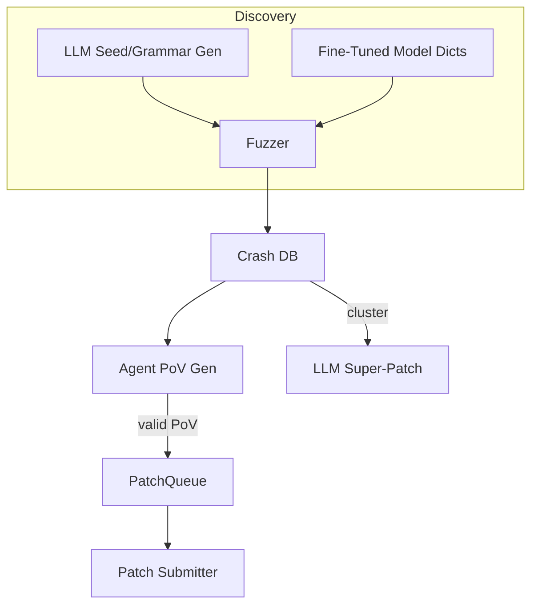

# Fuzzing assistito dall'AI e individuazione automatizzata delle vulnerabilità

{{#include ../banners/hacktricks-training.md}}

## Panoramica
I modelli linguistici di grandi dimensioni (LLM) possono potenziare notevolmente le pipeline tradizionali di vulnerability research generando input semanticamente ricchi, evolvendo grammatiche, analizzando i dati dei crash e persino proponendo patch per più bug. Questa pagina raccoglie i pattern più efficaci osservati durante le finali della DARPA AI Cyber Challenge (AIxCC) e in altre ricerche pubbliche.<sup>[[4]](#references)</sup><sup>[[5]](#references)</sup>

Quello che segue non è la descrizione di un sistema specifico usato in una competizione, ma un'astrazione delle tecniche, così da poterle riprodurre nei tuoi workflow.

---

## 1. Seed Input generati dagli LLM

I fuzzer tradizionali guidati dalla coverage (AFL++, libFuzzer, Honggfuzz…) iniziano con un piccolo corpus di seed e modificano i byte alla cieca. Quando il formato dell'input target è complesso (SQL, URL, protocolli binari custom), le mutazioni casuali solitamente danneggiano la sintassi prima che vengano raggiunti i branch interessanti.

Gli LLM possono risolvere questo problema di bootstrap generando *seed generator*: brevi script che producono **input sintatticamente corretti ma rilevanti per la sicurezza**. Ad esempio:
```prompt
SYSTEM: You are a helpful security engineer.
USER:
Write a Python3 program that prints 200 unique SQL injection strings targeting common anti-pattern mistakes (missing quotes, numeric context, stacked queries).  Ensure length ≤ 256 bytes / string so they survive common length limits.
```

```python
# gen_sqli_seeds.py (truncated)
PAYLOADS = [
"1 OR 1=1 -- ",
"' UNION SELECT NULL,NULL--",
"0; DROP TABLE users;--",
...
]
for p in PAYLOADS:
print(p)
```
Esegui una volta e passa direttamente l'output al corpus iniziale del fuzzer:
```bash
python3 gen_sqli_seeds.py > seeds.txt
afl-fuzz -i seeds.txt -o findings/ -- ./target @@
```
Vantaggi:
1. Validità semantica → copertura più approfondita fin dalle prime fasi.
2. Rigenerabile: modifica il prompt per concentrarti su XSS, path traversal, binary blobs, ecc.
3. Economico (< 1 ¢ con GPT-3.5).

### Consigli
* Istruisci il modello a *diversificare* la lunghezza e l’encoding dei payload (UTF-8, URL-encoded, UTF-16-LE) per bypassare i filtri superficiali.
* Chiedi un *singolo script autonomo* – evita problemi di formattazione JSON.

---

## 2. Grammar-Evolution Fuzzing

Una variante più potente consiste nel lasciare che l’LLM **evolva una grammar** invece di seed concreti. Il workflow (pattern “Grammar Guy”) è:

1. Genera una grammar ANTLR/Peach/LibFuzzer iniziale tramite prompt.
2. Esegui il fuzzing per N minuti e raccogli le metriche di coverage (edge / block raggiunti).
3. Riassumi le aree del programma non coperte e reinvia il riepilogo al modello:
```prompt
The previous grammar triggered 12 % of the program edges.  Functions not reached: parse_auth, handle_upload.  Add / modify rules to cover these.
```
4. Unisci le nuove regole, esegui nuovamente il fuzzing e ripeti.

Scheletro di pseudo-codice:
```python
for epoch in range(MAX_EPOCHS):
grammar = llm.refine(grammar, feedback=coverage_stats)
save(grammar, f"grammar_{epoch}.txt")
coverage_stats = run_fuzzer(grammar)
```
Punti chiave:
* Mantieni un *budget* – ogni raffinamento utilizza token.
* Usa istruzioni `diff` + `patch` in modo che il modello modifichi il codice invece di riscriverlo.
* Interrompi quando Δcoverage < ε.

---

## 3. Generazione di PoV (Exploit) basata su agenti

Dopo aver trovato un crash, ti serve comunque una **proof-of-vulnerability (PoV)** che lo attivi in modo deterministico.

Un approccio scalabile consiste nell'avviare molti worker leggeri (processi, thread o container), ognuno dei quali utilizza un modello o una configurazione di sampling diversa. Il sondaggio sui finalisti dell'AIxCC fornisce esempi concreti di questa scala: un team ha utilizzato **migliaia di agenti concorrenti** per la generazione di PoV basata prima di tutto sull'AI, mentre un altro ha orchestrato **300–500 agenti di fuzzing** e ha riservato gli LLM al ragionamento semantico di livello superiore.<sup>[[4]](#references)</sup>

Pipeline:
1. L'analisi statica/dinamica produce *candidati di bug* (struct con crash PC, input slice, messaggio del sanitizer).
2. L'orchestrator distribuisce i candidati agli agenti.
3. Passaggi di ragionamento dell'agente:
a. Riprodurre il bug localmente con `gdb` + input.
b. Suggerire un payload di exploit minimo.
c. Validare l'exploit nella sandbox.  Se ha successo → inviarlo.
4. I tentativi falliti vengono **rimessi in coda come nuovi seed** per il coverage fuzzing (ciclo di feedback).

Vantaggi:
* La parallelizzazione nasconde l'inaffidabilità dei singoli agenti.
* Auto-tuning di temp / dimensione del modello in base al tasso di successo osservato.

---

## 4. Directed Fuzzing con modelli di codice fine-tuned

Esegui il fine-tuning di un modello open-weight (ad esempio Llama-7B) su codice sorgente C/C++ etichettato con pattern di vulnerabilità (integer overflow, buffer copy, format string).  Quindi:

1. Esegui l'analisi statica per ottenere l'elenco delle funzioni + AST.
2. Prompta il modello: *“Fornisci voci del dizionario di mutazione che probabilmente comprometteranno la memory safety nella funzione X”*.
3. Inserisci questi token in un `AFL_CUSTOM_MUTATOR` personalizzato.

Output di esempio per un wrapper di `sprintf`:
```
{"pattern":"%99999999s"}
{"pattern":"AAAAAAAA....<1024>....%n"}
```
Empiricamente, questo riduce di oltre 2× il tempo necessario al crash su target reali.

---

## 5. Strategie di patching guidate dall'AI

### 5.1 Super Patches
Chiedi al modello di *cluster*izzare le firme dei crash e proporre una **singola patch** che elimini la causa principale comune. Invia una sola volta, risolvi diversi bug → meno penalità di accuratezza negli ambienti in cui ogni patch errata costa punti.

Struttura del prompt:
```
Here are 10 stack traces + file snippets.  Identify the shared mistake and generate a unified diff fixing all occurrences.
```
### 5.2 Rapporto di patch speculative
Implementare una queue in cui le patch confermate e validate tramite PoV e le patch *speculative* (senza PoV) siano interleaved con un rapporto 1:​N calibrato sulle scoring rules (ad es. 2 speculative : 1 confirmed). Un cost model monitora penalties e points e regola automaticamente N.

---

## 6. Code Review AI deterministica file per file

Una modalità di errore frequente nella review assistita dall'AI consiste nel chiedere a un singolo agent di ispezionare un intero repository, sperando che scelga i file e i termini grep corretti. Un pattern più affidabile consiste nel **forzare la copertura del repository**:<sup>[[1]](#references)</sup>

1. Enumerare i file sorgente.
2. Inviare **un file alla volta** insieme al contesto minimo (entrypoint, import, route/caller vicini).
3. Richiedere un **report strutturato** per ogni file: sources, sink, validazione mancante, precondizioni per l'exploit e confidence.<sup>[[3]](#references)</sup>
4. Deduplicare i report in base al **pattern source→sink** e validare manualmente quelli ad alto rischio.

Questo approccio richiede molti token ed è rumoroso, ma è molto efficace nel portare alla luce **bug semplici ad alto impatto di tipo source/sink** che le review agentic più generiche spesso non rilevano.

### Pattern di triage da prioritizzare

- **Dynamic PHP include/dispatch**: nomi di route/controller/module controllati dall'attacker che confluiscono in `require_once()`, `include()` o `include_once()` senza una strict allowlist e la canonicalizzazione del path.
- **Esecuzione di shell nei workflow di amministrazione/account**: username, domini, account FTP o altri identificatori che raggiungono `exec()`, `system()`, `shell_exec()`, `passthru()`, `proc_open()` o `popen()`.
- **Convergenza di input strutturati**: lo stesso parametro accettato da `$_GET`, `$_POST`, JSON, XML o body parser del framework e successivamente riutilizzato in sink del filesystem o di comandi OS.

### Due classi pratiche di bug che questo metodo individua bene

- **PHP controller-dispatch LFI/RCE**: se il nome del controller controllato dalla request viene concatenato in `require_once()` senza allowlist o normalizzazione del path, sequenze di traversal come `../` possono fare in modo che PHP includa un file `.php` locale non previsto. Se l'attacker può indirizzare l'include verso un file PHP piantato o comunque utile, la LFI diventa code execution. Vedere [File Inclusion / Path Traversal](../pentesting-web/file-inclusion/README.md).<sup>[[1]](#references)</sup>
- **Command injection autenticata nei pannelli di hosting/amministrazione**: se campi di gestione degli account, come gli username, vengono incorporati in comandi shell, un utente autenticato con pochi privilegi può trasformare una normale azione di creazione/eliminazione in RCE. L'impatto aumenta quando il pannello esegue il comando con un service account dotato di privilegi maggiori. Vedere [Command Injection](../pentesting-web/command-injection.md).<sup>[[1]](#references)</sup>

### Note pratiche sulla review

- Usare l'LLM prima di tutto come **source/sink reviewer**, non come generatore di exploit.
- Chiedergli di elencare esplicitamente il **campo controllato dall'attacker**, il **gap di normalizzazione/validazione** e il **sink pericoloso**.
- Per repository di grandi dimensioni, la review deterministica file per file è spesso più affidabile di una singola esecuzione con un agent autonomo, anche quando quest'ultima utilizza un modello più potente.<sup>[[2]](#references)</sup>
- Aspettarsi risultati più deboli su **Broken Access Control** e altri bug di business logic, nei quali l'exploitability dipende da assunzioni tra file, semantica dei ruoli o threat model specifici del prodotto.

---

## Mettere insieme il tutto
Un CRS (Cyber Reasoning System) end-to-end può collegare i componenti in questo modo:

```mermaid
graph TD
subgraph Discovery
A[LLM Seed/Grammar Gen] --> B[Fuzzer]
C[Fine-Tuned Model Dicts] --> B
end
B --> D[Crash DB]
D --> E[Agent PoV Gen]
E -->|valid PoV| PatchQueue
D -->|cluster| F[LLM Super-Patch]
PatchQueue --> G[Patch Submitter]
```
---

## References

- [1] [Project Black - IA locale per la Cyber Security: individuazione di LFI in phpIPAM e RCE autenticata](https://projectblack.io/blog/local-ai-for-cyber-security)
- [2] [Strix](https://github.com/usestrix/strix)
- [3] [skill di security-review della community di GitHub Copilot](https://github.com/github/awesome-copilot/blob/main/skills/security-review/SKILL.md)
- [4] [Trail of Bits – finali AIxCC: cronaca della sfida](https://blog.trailofbits.com/2025/08/07/aixcc-finals-tale-of-the-tape/)
- [5] [Interviste ai finalisti AIxCC di CTF Radiooo](https://www.youtube.com/@ctfradiooo)
{{#include ../banners/hacktricks-training.md}}
