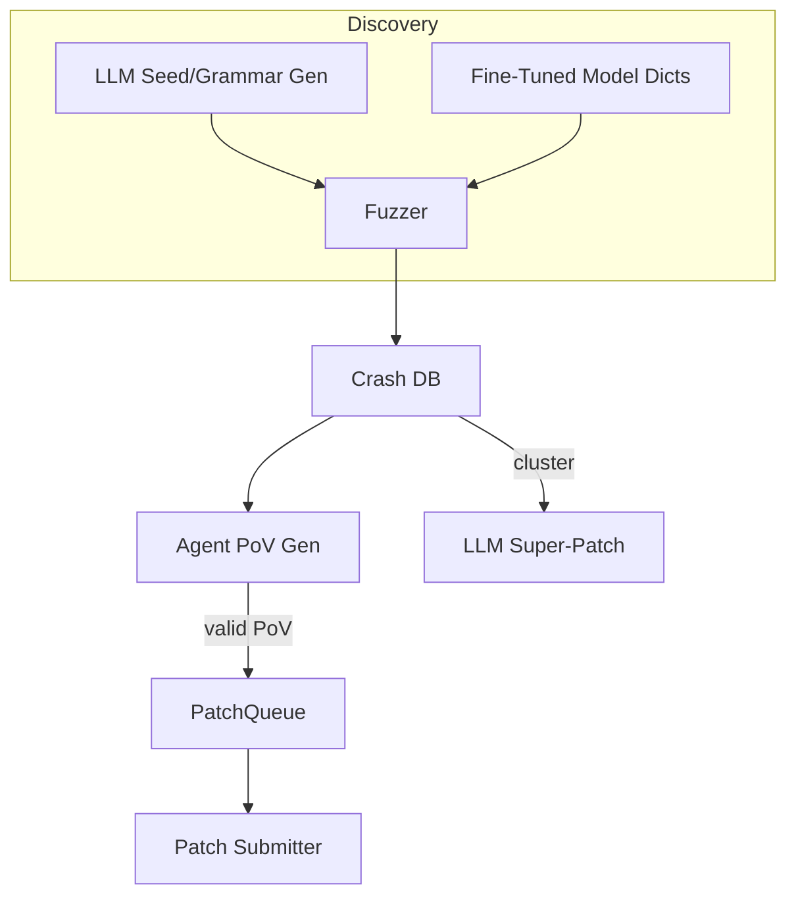

# Fuzzing assisté par l’IA et découverte automatisée de vulnérabilités

{{#include ../banners/hacktricks-training.md}}

## Vue d’ensemble
Les modèles de langage de grande taille (LLM) peuvent considérablement améliorer les pipelines traditionnels de recherche de vulnérabilités en générant des entrées sémantiquement riches, en faisant évoluer des grammaires, en raisonnant sur les données de crash et même en proposant des correctifs couvrant plusieurs bugs. Cette page rassemble les patterns les plus efficaces observés lors de la finale de l’AI Cyber Challenge (AIxCC) de la DARPA et dans d’autres travaux de recherche publics.<sup>[[4]](#references)</sup><sup>[[5]](#references)</sup>

Ce qui suit ne décrit pas le système d’une compétition spécifique, mais constitue une abstraction des techniques afin que vous puissiez les reproduire dans vos propres workflows.

---

## 1. Entrées seed générées par des LLM

Les fuzzers traditionnels guidés par la couverture (AFL++, libFuzzer, Honggfuzz…) commencent avec un petit corpus de seeds et mutent les octets à l’aveugle. Lorsque le format d’entrée ciblé est complexe (SQL, URLs, protocoles binaires personnalisés), les mutations aléatoires cassent généralement la syntaxe avant que les branches intéressantes ne soient atteintes.

Les LLM peuvent résoudre ce problème d’amorçage en générant des *seed generators* : de courts scripts qui produisent des **entrées syntaxiquement correctes mais pertinentes du point de vue de la sécurité**. Par exemple :
```prompt
SYSTEM: You are a helpful security engineer.
USER:
Write a Python3 program that prints 200 unique SQL injection strings targeting common anti-pattern mistakes (missing quotes, numeric context, stacked queries).  Ensure length ≤ 256 bytes / string so they survive common length limits.
```

```python
# gen_sqli_seeds.py (truncated)
PAYLOADS = [
"1 OR 1=1 -- ",
"' UNION SELECT NULL,NULL--",
"0; DROP TABLE users;--",
...
]
for p in PAYLOADS:
print(p)
```
Exécutez une seule fois et transmettez directement la sortie au corpus initial du fuzzer :
```bash
python3 gen_sqli_seeds.py > seeds.txt
afl-fuzz -i seeds.txt -o findings/ -- ./target @@
```
Benefits:
1. Validité sémantique → couverture plus approfondie dès le début.
2. Régénérable : modifiez le prompt pour cibler XSS, path traversal, binary blobs, etc.
3. Peu coûteux (< 1 ¢ avec GPT-3.5).

### Conseils
* Demandez au modèle de *diversifier* la longueur et l’encodage des payloads (UTF-8, URL-encoded, UTF-16-LE) afin de contourner les filtres superficiels.
* Demandez un *script unique et autonome* – cela évite les problèmes de formatage JSON.

---

## 2. Grammar-Evolution Fuzzing

Une variante plus puissante consiste à laisser le LLM **faire évoluer une grammaire** plutôt que des seeds concrets. Le workflow (pattern « Grammar Guy ») est le suivant :

1. Générez une grammaire ANTLR/Peach/LibFuzzer initiale via un prompt.
2. Effectuez le fuzzing pendant N minutes et collectez les métriques de couverture (edges / blocks hit).
3. Résumez les zones du programme non couvertes et transmettez le résumé au modèle :
```prompt
The previous grammar triggered 12 % of the program edges.  Functions not reached: parse_auth, handle_upload.  Add / modify rules to cover these.
```
4. Fusionnez les nouvelles rules, relancez le fuzzing et répétez.

Structure de pseudo-code :
```python
for epoch in range(MAX_EPOCHS):
grammar = llm.refine(grammar, feedback=coverage_stats)
save(grammar, f"grammar_{epoch}.txt")
coverage_stats = run_fuzzer(grammar)
```
Points clés :
* Conservez un *budget* – chaque raffinement consomme des tokens.
* Utilisez des instructions `diff` + `patch` afin que le modèle modifie le code plutôt que de le réécrire.
* Arrêtez-vous lorsque Δcoverage < ε.

---

## 3. Ingénierie de harness libFuzzer avec un LLM local

Pour le code source qui ne peut pas quitter le poste de travail d’un analyste, un code model local peut rédiger le petit adaptateur entre les octets du fuzzer et une API C/C++. La limite de sécurité utile est explicite : **le modèle écrit et révise l’infrastructure de test ; la mutation guidée par la coverage explore les entrées ; les sanitizers signalent les opérations invalides ; un humain examine le harness et trie les résultats**.<sup>[[9]](#references)</sup>

Pour les techniques de corpus, de feedback, de snapshot et de stateful-fuzzing au niveau du moteur qui ne dépendent pas d’un LLM, consultez la [Méthodologie du Fuzzing](../generic-methodologies-and-resources/fuzzing.md) générale.

Commencez par la déclaration exacte copiée depuis le header cible et limitez le format de sortie. Un prompt étroit réduit les API inventées et rend le résultat facile à examiner :<sup>[[8]](#references)[[9]](#references)</sup>
```prompt
Write a libFuzzer target for this exact declaration:
int parse_records(const uint8_t *data, size_t size);

Output only C code. Implement LLVMFuzzerTestOneInput, include the
declaration, pass data and size unchanged, and do not use files,
network access, randomness, clocks, threads, or persistent state.
```
Pour un analyseur de bytes bruts, le résultat attendu ne devrait pas être plus compliqué que :<sup>[[6]](#references)[[9]](#references)</sup>
```c
#include <stddef.h>
#include <stdint.h>

extern int parse_records(const uint8_t *, size_t);

int LLVMFuzzerTestOneInput(const uint8_t *data, size_t size) {
(void)parse_records(data, size);
return 0;
}
```
La compilation n’est que la première étape de validation. Examinez chaque cible générée par rapport à ces invariants avant de lui consacrer du temps CPU :<sup>[[6]](#references)[[8]](#references)[[9]](#references)</sup>

- **API exacte :** comparez les types, les règles de propriété, l’initialisation, le nettoyage et la convention d’appel avec le véritable header et les appelants existants.
- **Sécurité du harness :** protégez chaque lecture depuis `data` ; les résultats des sanitizers doivent provenir de la cible, et non du code glue généré.
- **Répétabilité :** faites du résultat une fonction de `data` et de `size` ; supprimez les E/S externes, le temps, l’aléatoire incontrôlé, les threads non rejoints et tout état qui persiste entre les appels.
- **Débit :** n’initialisez l’état immuable coûteux qu’une seule fois, uniquement lorsque cela ne peut pas modifier le comportement ; limitez la taille des entrées, désactivez les logs et libérez les allocations propres à chaque entrée.
- **Atteignabilité :** vérifiez que les fonctions et branches prévues sont exécutées. Une cible qui compile, mais n’exerce que les chemins de rejet, constitue un échec silencieux.

### Cibles sensibles à la structure : préserver les invariants sans dissimuler les bugs

Si la plupart des entrées brutes échouent à cause d’un contrôle de valeur magique, de longueur, de version ou de checksum, utilisez les octets de fuzzing comme **données de champs typées** et reconstruisez un objet valide. Corrigez les constantes de format, laissez les champs sémantiques et les octets du payload modifiables, puis dérivez les métadonnées d’intégrité à partir du payload reconstruit. `FuzzedDataProvider` est utile pour consommer des valeurs typées bornées, tandis que l’adaptateur reste responsable de limiter toute allocation et conversion générées.<sup>[[9]](#references)</sup>

<details>
<summary>Exemple de cible C++ sensible à la structure</summary>
```cpp
#include <fuzzer/FuzzedDataProvider.h>
#include <stddef.h>
#include <stdint.h>
#include <vector>

extern "C" int parse_message(const uint8_t *, size_t);

extern "C" int LLVMFuzzerTestOneInput(const uint8_t *data, size_t size) {
FuzzedDataProvider fdp(data, size);
uint8_t version = fdp.ConsumeIntegral<uint8_t>();
auto body = fdp.ConsumeRemainingBytes<uint8_t>();
if (body.size() > UINT16_MAX) body.resize(UINT16_MAX);
uint16_t len = static_cast<uint16_t>(body.size());
std::vector<uint8_t> msg = {0x8b, 'M', 'S', 'G', version,
static_cast<uint8_t>(len >> 8),
static_cast<uint8_t>(len)};
msg.insert(msg.end(), body.begin(), body.end());
(void)parse_message(msg.data(), msg.size());
return 0;
}
```
</details>

N'utilisez pas une cible de réparation de structure pour chaque question. Maintenez une cible qui déduit les longueurs/checksums afin d'explorer des états valides profonds, et une autre qui laisse les métadonnées **déclarées** contrôlées par le fuzzer, tout en limitant uniquement les lectures et allocations propres au harness. La seconde cible préserve les surfaces d'attaque liées aux longueurs incohérentes et à la mauvaise intégrité, que la réparation automatique effacerait autrement.<sup>[[9]](#references)</sup>

### Seeds, dictionaries, sanitizers et feedback de couverture

Demandez au modèle de générer un script qui écrit des seeds binaires plutôt que de lui demander d'afficher directement du binaire. Générez des seeds pour des objets vides, minimaux, typiques et valides aux limites, puis extrayez les valeurs magiques, tags, encodages d'enum et mots-clés du parser dans un dictionary vérifié. libFuzzer accepte ce dictionary avec `-dict=`, et conserve dans le corpus les mutations qui exposent une nouvelle couverture.<sup>[[6]](#references)[[9]](#references)</sup>
```text
magic="\x8bMSG"
version_min="\x00"
version_max="\xff"
config_tag="CONFIG"
```
Construisez la même cible avec une instrumentation complémentaire. ASan et UBSan peuvent partager un binaire de fuzzing ; utilisez un build MSan séparé et instrumentez ses dépendances afin d’éviter les rapports causés par du code non instrumenté.<sup>[[6]](#references)[[9]](#references)</sup>
```bash
clang++ -g -O1 -fsanitize=fuzzer,address,undefined \
-fno-sanitize-recover=undefined target.cc harness.cc -o fuzz_target
./fuzz_target corpus -dict=msg.dict -max_len=65535

clang++ -g -O1 -fsanitize=fuzzer,memory \
target.cc harness.cc -o fuzz_target_msan
```
Traitez la couverture comme l’évaluateur de chaque révision du modèle. Dans la sortie de libFuzzer, une `cov`/`ft` rapidement stagnante et un corpus statique indiquent généralement un mauvais framing, un early return trop restrictif ou un mauvais appel ; une faible valeur `exec/s` pointe vers une initialisation, des I/O, des allocations coûteuses ou un état qui fuit. `NEW` prouve uniquement qu’une feature de couverture a changé, et non que le parser visé a été atteint.<sup>[[6]](#references)[[9]](#references)</sup>

Pour obtenir un feedback au niveau du source, créez un build avec coverage, faites-le fuzzing, et ne donnez au modèle que les fonctions non couvertes ainsi que leurs conditions de garde. Vérifiez le diff résultant du harness/seed/dictionary, puis mesurez à nouveau :<sup>[[7]](#references)[[8]](#references)[[9]](#references)</sup>
```bash
clang++ -g -O1 -fsanitize=fuzzer \
-fprofile-instr-generate -fcoverage-mapping target.cc harness.cc -o fuzz_cov
mkdir -p profiles
LLVM_PROFILE_FILE='profiles/%p.profraw' ./fuzz_cov -max_total_time=300 corpus
llvm-profdata merge -sparse profiles/*.profraw -o fuzz.profdata
llvm-cov report ./fuzz_cov -instr-profile=fuzz.profdata
llvm-cov show ./fuzz_cov -instr-profile=fuzz.profdata \
--show-branches=count --region-coverage-lt=1 target.cc
```
La boucle scalable est donc **generate → compile/link → smoke-test under sanitizers → measure target coverage → provide the smallest relevant coverage/source context → revise → re-measure**. OSS-Fuzz-Gen applique le même principe en évaluant les targets générées selon leur compilabilité, leurs erreurs d’exécution, leur couverture et l’amélioration de la couverture par rapport aux targets existantes, au lieu d’accepter du code plausible au pied de la lettre.<sup>[[7]](#references)[[8]](#references)</sup>

---

## 4. Génération de PoV (Exploit) basée sur des agents

Après avoir trouvé un crash, vous devez encore obtenir une **preuve de vulnérabilité (PoV)** qui le déclenche de manière déterministe.

Une approche scalable consiste à lancer de nombreux workers légers (processus, threads ou conteneurs), chacun utilisant un modèle ou une configuration d’échantillonnage différente. L’enquête sur les finalistes de l’AIxCC fournit des exemples concrets de cette échelle : une équipe a utilisé **des milliers d’agents concurrents** pour la génération de PoV assistée en priorité par l’AI, tandis qu’une autre a orchestré **300 à 500 agents de fuzzing** et réservé les LLM au raisonnement sémantique de plus haut niveau.<sup>[[4]](#references)</sup>

Pipeline :
1. L’analyse statique/dynamique produit des *bug candidates* (`struct` avec le crash PC, la portion d’entrée et le message du sanitizer).
2. L’orchestrateur distribue les candidates aux agents.
3. Étapes de raisonnement de l’agent :
a. Reproduire le bug localement avec `gdb` + l’entrée.
b. Suggérer un payload d’exploit minimal.
c. Valider l’exploit dans le sandbox.  En cas de succès → soumettre.
4. Les tentatives échouées sont **remises en file comme nouvelles seeds** pour le coverage fuzzing (boucle de feedback).

Avantages :
* La parallélisation masque le manque de fiabilité d’un agent unique.
* Auto-tuning de la température / de la taille du modèle en fonction du taux de réussite observé.

---

## 5. Directed Fuzzing avec des modèles de code fine-tunés

Fine-tuner un modèle open-weight (par exemple Llama-7B) sur du code source C/C++ annoté avec des patterns de vulnérabilité (integer overflow, buffer copy, format string). Ensuite :

1. Exécuter une analyse statique pour obtenir la liste des fonctions + l’AST.
2. Demander au modèle : *« Give mutation dictionary entries that are likely to break memory safety in function X »*.
3. Insérer ces tokens dans un `AFL_CUSTOM_MUTATOR` personnalisé.

Exemple de sortie pour un wrapper `sprintf` :
```
{"pattern":"%99999999s"}
{"pattern":"AAAAAAAA....<1024>....%n"}
```
Empiriquement, cela réduit de plus de 2× le délai avant crash sur des cibles réelles.

---

## 6. Stratégies de patching guidées par l’IA

### 6.1 Super Patches
Demandez au modèle de *clusteriser* les signatures de crash et de proposer un **patch unique** qui supprime la cause racine commune.  Soumettez une seule fois, corrigez plusieurs bugs → moins de pénalités de précision dans les environnements où chaque mauvais patch coûte des points.

Structure du prompt :
```
Here are 10 stack traces + file snippets.  Identify the shared mistake and generate a unified diff fixing all occurrences.
```
### 6.2 Ratio de patches spéculatifs
Implémentez une queue où les patches confirmés et validés par un PoV et les patches *spéculatifs* (sans PoV) sont entrelacés selon un ratio de 1:​N ajusté aux règles de scoring (par ex. 2 spéculatifs : 1 confirmé). Un modèle de coût surveille les pénalités par rapport aux points et ajuste automatiquement N.

---

## 7. Revue déterministe du code par fichier avec l'AI

Un mode d'échec fréquent des revues assistées par l'AI consiste à demander à un agent d'inspecter un dépôt entier en espérant qu'il sélectionne les bons fichiers et les bons termes de recherche. Un modèle plus fiable consiste à **forcer la couverture du dépôt** :<sup>[[1]](#references)</sup>

1. Énumérer les fichiers source.
2. Envoyer **un fichier à la fois** avec un contexte minimal (point d'entrée, imports, routes/appelants proches).
3. Exiger un **rapport structuré** pour chaque fichier : sources, sink, validation manquante, préconditions d'exploitation et niveau de confiance.<sup>[[3]](#references)</sup>
4. Dédupliquer les rapports par **pattern source→sink** et valider manuellement ceux présentant un risque élevé.

Cette méthode consomme beaucoup de tokens et produit du bruit, mais elle est très efficace pour faire apparaître les **bugs simples à fort impact au niveau des sources/sinks** que les revues agentiques générales manquent souvent.

### Patterns de triage à prioriser

- **PHP include/dispatch dynamique** : des noms de route/controller/module contrôlés par l'attaquant sont transmis à `require_once()`, `include()` ou `include_once()` sans allowlist stricte ni canonicalisation du chemin.
- **Exécution de shell dans les workflows d'administration/de compte** : des noms d'utilisateur, domaines, comptes FTP ou autres identifiants atteignent `exec()`, `system()`, `shell_exec()`, `passthru()`, `proc_open()` ou `popen()`.
- **Fan-in d'entrées structurées** : le même paramètre est accepté depuis `$_GET`, `$_POST`, JSON, XML ou les body parsers du framework, puis réutilisé dans des sinks liés au système de fichiers ou aux commandes OS.

### Deux classes pratiques de bugs que cette méthode détecte bien

- **LFI/RCE via dispatch de controller PHP** : si le nom d'un controller contrôlé par la requête est concaténé dans `require_once()` sans allowlist ni normalisation du chemin, des séquences de traversal telles que `../` peuvent amener PHP à inclure un fichier `.php` local non prévu. Si l'attaquant peut diriger l'include vers un fichier PHP implanté ou autrement utile, la LFI devient une exécution de code. Voir [File Inclusion / Path Traversal](../pentesting-web/file-inclusion/README.md).<sup>[[1]](#references)</sup>
- **Command injection authentifiée dans les panneaux d'hébergement/d'administration** : si des champs de gestion de compte tels que les noms d'utilisateur sont intégrés dans des commandes shell, un utilisateur authentifié disposant de faibles privilèges peut transformer une action normale de création/suppression en RCE. L'impact augmente lorsque le panneau exécute la commande avec un compte de service plus privilégié. Voir [Command Injection](../pentesting-web/command-injection.md).<sup>[[1]](#references)</sup>

### Notes pratiques de revue

- Utilisez le LLM d'abord comme **reviewer des sources/sinks**, et non comme générateur d'exploits.
- Demandez-lui de lister explicitement le **champ contrôlé par l'attaquant**, la **faille de normalisation/validation** et le **sink dangereux**.
- Pour les dépôts volumineux, une revue déterministe fichier par fichier est souvent plus fiable qu'une seule exécution d'agent autonome, même lorsque cette dernière utilise un modèle plus puissant.<sup>[[2]](#references)</sup>
- Attendez-vous à des résultats plus faibles concernant le **Broken Access Control** et les autres bugs de logique métier, lorsque l'exploitabilité dépend d'hypothèses entre fichiers, de la sémantique des rôles ou de threat models propres au produit.

---

## Assemblage complet
Un CRS (Cyber Reasoning System) de bout en bout peut relier les composants comme suit :

```mermaid
graph TD
subgraph Discovery
A[LLM Seed/Grammar Gen] --> B[Fuzzer]
C[Fine-Tuned Model Dicts] --> B
end
B --> D[Crash DB]
D --> E[Agent PoV Gen]
E -->|valid PoV| PatchQueue
D -->|cluster| F[LLM Super-Patch]
PatchQueue --> G[Patch Submitter]
```
---

## References

- [1] [Project Black - IA locale pour la cybersécurité : découverte d'une LFI dans phpIPAM et d'une RCE authentifiée dans myVesta](https://projectblack.io/blog/local-ai-for-cyber-security)
- [2] [Strix](https://github.com/usestrix/strix)
- [3] [Compétence de revue de sécurité de la communauté GitHub Copilot](https://github.com/github/awesome-copilot/blob/main/skills/security-review/SKILL.md)
- [4] [Trail of Bits – Finales de l'AIxCC : récit de la compétition](https://blog.trailofbits.com/2025/08/07/aixcc-finals-tale-of-the-tape/)
- [5] [Interviews des finalistes de l'AIxCC par CTF Radiooo](https://www.youtube.com/@ctfradiooo)
- [6] [LLVM — libFuzzer : une bibliothèque pour les tests fuzzing guidés par la couverture](https://llvm.org/docs/LibFuzzer.html)
- [7] [Google — OSS-Fuzz-Gen](https://github.com/google/oss-fuzz-gen)
- [8] [Google Online Security Blog — Améliorer le fuzzing : découvrir davantage de vulnérabilités grâce à l'IA](https://security.googleblog.com/2024/11/leveling-up-fuzzing-finding-more.html)
- [9] [8kSec — Génération assistée par IA de harness de fuzzing avec un LLM local](https://8ksec.io/ai-assisted-fuzzing-harness-local-llm)
{{#include ../banners/hacktricks-training.md}}
