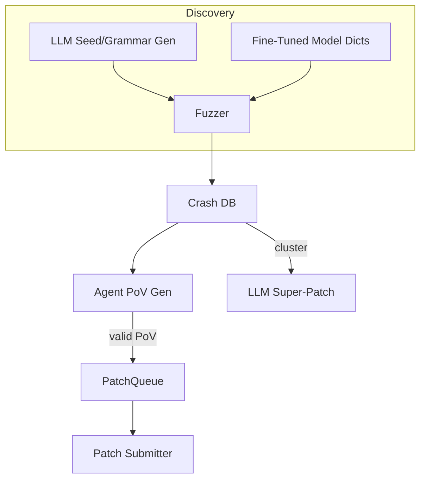

# Fuzzing potpomognut AI-em i automatizovano otkrivanje ranjivosti

{{#include ../banners/hacktricks-training.md}}

## Pregled
Large-language models (LLM-ovi) mogu značajno unaprediti tradicionalne pipeline-ove za istraživanje ranjivosti generisanjem semantički bogatih ulaza, evoluiranjem gramatika, analizom podataka o crash-evima, pa čak i predlaganjem patch-eva za više bagova.  Ova stranica prikuplja najefikasnije obrasce uočene tokom finala DARPA-inog AI Cyber Challenge-a (AIxCC) i drugih javnih istraživanja.<sup>[[4]](#references)</sup><sup>[[5]](#references)</sup>

Ono što sledi nije opis jednog konkretnog sistema takmičenja, već apstrakcija tehnika kako biste mogli da ih reprodukujete u sopstvenim workflow-ima.

---

## 1. Seed input-i generisani pomoću LLM-a

Tradicionalni coverage-guided fuzzers (AFL++, libFuzzer, Honggfuzz…) počinju sa malim corpus-om seed-ova i nasumično mutiraju bajtove.  Kada je ciljni format ulaza složen (SQL, URL-ovi, prilagođeni binarni protokoli), nasumične mutacije obično naruše sintaksu pre nego što se dostigne do zanimljivih grana.

LLM-ovi mogu rešiti ovaj problem inicijalizacije generisanjem *seed generatora* – kratkih skripti koje daju **sintaksno ispravne, ali bezbednosno relevantne ulaze**.  Na primer:
```prompt
SYSTEM: You are a helpful security engineer.
USER:
Write a Python3 program that prints 200 unique SQL injection strings targeting common anti-pattern mistakes (missing quotes, numeric context, stacked queries).  Ensure length ≤ 256 bytes / string so they survive common length limits.
```

```python
# gen_sqli_seeds.py (truncated)
PAYLOADS = [
"1 OR 1=1 -- ",
"' UNION SELECT NULL,NULL--",
"0; DROP TABLE users;--",
...
]
for p in PAYLOADS:
print(p)
```
Pokrenite jednom i prosledite izlaz direktno u početni korpus fuzzera:
```bash
python3 gen_sqli_seeds.py > seeds.txt
afl-fuzz -i seeds.txt -o findings/ -- ./target @@
```
Prednosti:
1. Semantička validnost → dublja pokrivenost u ranoj fazi.
2. Ponovna generacija: prilagodite prompt da se fokusira na XSS, path traversal, binary blobs itd.
3. Jeftino (< 1 ¢ uz GPT-3.5).

### Saveti
* Naložite modelu da *diversify* dužinu i kodiranje payload-a (UTF-8, URL-encoded, UTF-16-LE) kako bi se zaobišli površinski filteri.
* Zatražite *jednu samostalnu skriptu* – time se izbegavaju problemi sa JSON formatiranjem.

---

## 2. Grammar-Evolution Fuzzing

Moćnija varijanta jeste da LLM **evoluira gramatiku** umesto konkretnih seed-ova. Tok rada (obrazac „Grammar Guy“) je sledeći:

1. Generišite početnu ANTLR/Peach/LibFuzzer gramatiku pomoću prompt-a.
2. Pokrenite fuzzing tokom N minuta i prikupite metrike pokrivenosti (pogodjene ivice / blokovi).
3. Sažmite nepokrivene delove programa i prosledite sažetak modelu:
```prompt
The previous grammar triggered 12 % of the program edges.  Functions not reached: parse_auth, handle_upload.  Add / modify rules to cover these.
```
4. Objedinite nova pravila, ponovo pokrenite fuzzing i ponavljajte postupak.

Kostur pseudo-koda:
```python
for epoch in range(MAX_EPOCHS):
grammar = llm.refine(grammar, feedback=coverage_stats)
save(grammar, f"grammar_{epoch}.txt")
coverage_stats = run_fuzzer(grammar)
```
Ključne tačke:
* Održavajte *budget* – svako poboljšanje koristi tokene.
* Koristite instrukcije `diff` + `patch` kako bi model menjao sadržaj umesto da ga ponovo ispisuje.
* Zaustavite se kada je Δcoverage < ε.

---

## 3. Inženjering lokalnog LLM libFuzzer harness-a

Za izvorni kod koji ne sme napustiti radnu stanicu analitičara, lokalni code model može napraviti mali adapter između bajtova fuzzera i C/C++ API-ja. Korisna bezbednosna granica je jasna: **model piše i menja testnu infrastrukturu; coverage-guided mutation istražuje ulaze; sanitizers prijavljuju nevažeće operacije; čovek pregleda harness i vrši trijažu nalaza**.<sup>[[9]](#references)</sup>

Za tehnike corpus-a, feedback-a, snapshot-a i stateful-fuzzing-a na nivou engine-a koje ne zavise od LLM-a, pogledajte opštu metodologiju [Fuzzing Methodology](../generic-methodologies-and-resources/fuzzing.md).

Počnite sa tačnom deklaracijom kopiranom iz ciljnog header-a i ograničite format izlaza. Uski prompt smanjuje izmišljene API-je i olakšava pregled rezultata:<sup>[[8]](#references)[[9]](#references)</sup>
```prompt
Write a libFuzzer target for this exact declaration:
int parse_records(const uint8_t *data, size_t size);

Output only C code. Implement LLVMFuzzerTestOneInput, include the
declaration, pass data and size unchanged, and do not use files,
network access, randomness, clocks, threads, or persistent state.
```
Za parser sirovih bajtova, očekivani rezultat ne bi trebalo da bude ništa složeniji od:<sup>[[6]](#references)[[9]](#references)</sup>
```c
#include <stddef.h>
#include <stdint.h>

extern int parse_records(const uint8_t *, size_t);

int LLVMFuzzerTestOneInput(const uint8_t *data, size_t size) {
(void)parse_records(data, size);
return 0;
}
```
Kompilacija je samo prva validaciona kapija. Pre nego što na cilj potrošite CPU vreme, proverite svaki generisani target u odnosu na ove invarijante:<sup>[[6]](#references)[[8]](#references)[[9]](#references)</sup>

- **Tačan API:** uporedite tipove, pravila vlasništva, inicijalizaciju, čišćenje i calling convention sa stvarnim headerom i postojećim callerima.
- **Bezbednost harnessa:** zaštitite svako čitanje iz `data`; nalazi sanitizer-a moraju poticati iz targeta, a ne iz generisanog glue koda.
- **Ponovljivost:** učinite da rezultat bude funkcija vrednosti `data` i `size`; uklonite eksterni I/O, vreme, nekontrolisanu slučajnost, nepovezane thread-ove i stanje koje preživljava između poziva.
- **Propusnost:** inicijalizujte skupo nepromenljivo stanje samo jednom, ali samo kada to ne može uticati na ponašanje, ograničite veličinu ulaza, potisnite logging i oslobodite alokacije po ulazu.
- **Dostižnost:** proverite da li se izvršavaju predviđene funkcije i grane. Target koji se kompajlira, ali izvršava samo rejection putanje, predstavlja tihi neuspeh.

### Targeti svesni strukture: očuvajte invarijante bez skrivanja bugova

Ako većina sirovih ulaza ne prođe proveru magic vrednosti, dužine, verzije ili checksum-a, koristite fuzz bajtove kao **materijal za tipizovana polja** i ponovo izgradite validan objekat. Fiksirajte konstante formata, ostavite semantička polja i payload bajtove promenljivim, a integrity metadata izvedite iz rekonstruisanog payload-a. `FuzzedDataProvider` je koristan za preuzimanje ograničenih tipizovanih vrednosti, dok adapter ostaje odgovoran za ograničavanje svake generisane alokacije i konverzije.<sup>[[9]](#references)</sup>

<details>
<summary>Primer C++ targeta svesnog strukture</summary>
```cpp
#include <fuzzer/FuzzedDataProvider.h>
#include <stddef.h>
#include <stdint.h>
#include <vector>

extern "C" int parse_message(const uint8_t *, size_t);

extern "C" int LLVMFuzzerTestOneInput(const uint8_t *data, size_t size) {
FuzzedDataProvider fdp(data, size);
uint8_t version = fdp.ConsumeIntegral<uint8_t>();
auto body = fdp.ConsumeRemainingBytes<uint8_t>();
if (body.size() > UINT16_MAX) body.resize(UINT16_MAX);
uint16_t len = static_cast<uint16_t>(body.size());
std::vector<uint8_t> msg = {0x8b, 'M', 'S', 'G', version,
static_cast<uint8_t>(len >> 8),
static_cast<uint8_t>(len)};
msg.insert(msg.end(), body.begin(), body.end());
(void)parse_message(msg.data(), msg.size());
return 0;
}
```
</details>

Nemojte koristiti jedan target za popravku strukture za svako pitanje. Održavajte jedan target koji izvodi dužine/checksum vrednosti kako bi istražio duboka validna stanja, i drugi koji zadržava **deklarisane** metapodatke pod kontrolom fuzzer-a, dok ograničava samo čitanja i alokacije samog harness-a. Drugi target čuva napadne površine sa neusklađenim dužinama i neispravnim integritetom koje bi automatska popravka inače uklonila.<sup>[[9]](#references)</sup>

### Seedovi, rečnici, sanitizatori i povratne informacije o pokrivenosti

Zatražite od modela da generiše skriptu koja upisuje binarne seedove, umesto da od njega tražite da direktno ispisuje binarne podatke. Koristite prazne, minimalne, tipične i granično validne objekte kao seedove; zatim izdvojite magic vrednosti, tagove, enum enkodiranja i ključne reči parsera u pregledani rečnik. libFuzzer prihvata taj rečnik pomoću opcije `-dict=`, a u korpus zadržava mutacije koje otkrivaju novu pokrivenost.<sup>[[6]](#references)[[9]](#references)</sup>
```text
magic="\x8bMSG"
version_min="\x00"
version_max="\xff"
config_tag="CONFIG"
```
Izgradite isti target sa komplementarnom instrumentacijom. ASan i UBSan mogu deliti fuzzing binarni fajl; koristite zasebnu MSan verziju i instrumentišite njene zavisnosti da biste izbegli izveštaje izazvane neinstrumentiranim kodom.<sup>[[6]](#references)[[9]](#references)</sup>
```bash
clang++ -g -O1 -fsanitize=fuzzer,address,undefined \
-fno-sanitize-recover=undefined target.cc harness.cc -o fuzz_target
./fuzz_target corpus -dict=msg.dict -max_len=65535

clang++ -g -O1 -fsanitize=fuzzer,memory \
target.cc harness.cc -o fuzz_target_msan
```
Tretirajte coverage kao evaluator za svaku reviziju modela. U libFuzzer izlazu, rani ravni `cov`/`ft` i statičan corpus obično ukazuju na loš framing, previše restriktivan early return ili pogrešan poziv; nizak `exec/s` ukazuje na skupo podešavanje, I/O, alokaciju ili procurelo stanje. `NEW` samo dokazuje da se coverage funkcija promenila, a ne da je dostignut predviđeni parser.<sup>[[6]](#references)[[9]](#references)</sup>

Za feedback na nivou izvornog koda, napravite coverage build, fuzzujte ga i modelu prosledite samo nepokrivene funkcije zajedno sa njihovim uslovima zaštite. Proverite razlike u harness-u/seed-u/dictionary-ju i ponovo izvršite merenje:<sup>[[7]](#references)[[8]](#references)[[9]](#references)</sup>
```bash
clang++ -g -O1 -fsanitize=fuzzer \
-fprofile-instr-generate -fcoverage-mapping target.cc harness.cc -o fuzz_cov
mkdir -p profiles
LLVM_PROFILE_FILE='profiles/%p.profraw' ./fuzz_cov -max_total_time=300 corpus
llvm-profdata merge -sparse profiles/*.profraw -o fuzz.profdata
llvm-cov report ./fuzz_cov -instr-profile=fuzz.profdata
llvm-cov show ./fuzz_cov -instr-profile=fuzz.profdata \
--show-branches=count --region-coverage-lt=1 target.cc
```
Skalabilna petlja je zato **generate → compile/link → smoke-test under sanitizers → measure target coverage → provide the smallest relevant coverage/source context → revise → re-measure**. OSS-Fuzz-Gen primenjuje isti princip tako što procenjuje generisane targete prema mogućnosti kompajliranja, runtime greškama, coverage-u i poboljšanju coverage-a u odnosu na postojeće targete, umesto da prihvati naizgled ispravan kod zdravo za gotovo.<sup>[[7]](#references)[[8]](#references)</sup>

---

## 4. Agent-Based PoV (Exploit) Generation

Nakon pronalaska crash-a i dalje vam je potreban **proof-of-vulnerability (PoV)** koji ga deterministički izaziva.

Skalabilni pristup je pokretanje velikog broja laganih workera (procesa, thread-ova ili containera), pri čemu svaki koristi drugačiji model ili sampling konfiguraciju. AIxCC finalist survey navodi konkretne primere obima: jedan tim je koristio **hiljade konkurentnih agenata** za AI-first PoV generation, dok je drugi orkestrirao **300–500 fuzzing agenata** i LLM-ove rezervisao za semantičko rezonovanje višeg nivoa.<sup>[[4]](#references)</sup>

Pipeline:
1. Static/ dynamic analysis proizvodi *bug candidates* (struct sa crash PC-jem, input slice-om i sanitizer porukom).
2. Orchestrator distribuira kandidate agentima.
3. Koraci agentovog rezonovanja:
a. Lokalno reprodukovati bug pomoću `gdb` + input-a.
b. Predložiti minimalni exploit payload.
c. Validirati exploit u sandbox-u.  Ako uspe → submit.
4. Neuspešni pokušaji se **ponovo stavljaju u red kao novi seed-ovi** za coverage fuzzing (feedback loop).

Prednosti:
* Paralelizacija prikriva nepouzdanost pojedinačnog agenta.
* Automatsko podešavanje temp-a / veličine modela na osnovu uočene stope uspešnosti.

---

## 5. Directed Fuzzing with Fine-Tuned Code Models

Fine-tune-ujte open-weight model (npr. Llama-7B) na C/C++ source-u označenom obrascima ranjivosti (integer overflow, buffer copy, format string). Zatim:

1. Pokrenite static analysis da biste dobili listu funkcija + AST.
2. Zadajte modelu prompt: *“Give mutation dictionary entries that are likely to break memory safety in function X”*.
3. Ubacite te tokene u prilagođeni `AFL_CUSTOM_MUTATOR`.

Primer output-a za `sprintf` wrapper:
```
{"pattern":"%99999999s"}
{"pattern":"AAAAAAAA....<1024>....%n"}
```
Empirijski, ovo smanjuje vreme do pada za više od 2× na stvarnim metama.

---

## 6. Strategije patchovanja vođenog AI-em

### 6.1 Super Patches
Zatražite od modela da *grupiše* potpise padova i predloži **jedan patch** koji uklanja zajednički osnovni uzrok. Pošaljite ga jednom, ispravite nekoliko bagova → manje kazni za netačnost u okruženjima u kojima svaki pogrešan patch donosi gubitak poena.

Okvir prompta:
```
Here are 10 stack traces + file snippets.  Identify the shared mistake and generate a unified diff fixing all occurrences.
```
### 6.2 Odnos spekulativnih zakrpa

Implementirajte queue u kojem se potvrđene zakrpe validirane pomoću PoV-a i *spekulativne* zakrpe (bez PoV-a) smenjuju u odnosu 1:​N, podešenom prema pravilima bodovanja (npr. 2 spekulativne : 1 potvrđena). Model troškova prati kazne u odnosu na bodove i samostalno prilagođava N.

---

## 7. Deterministički AI code review datoteka po datoteka

Čest način neuspeha kod AI-assisted review-a jeste kada se od jednog agenta zatraži da pregleda čitav repository, uz očekivanje da će izabrati odgovarajuće datoteke i grep termine. Pouzdaniji obrazac jeste **prisiliti pokrivenost repository-ja**:<sup>[[1]](#references)</sup>

1. Izlistajte source datoteke.
2. Šaljite **jednu datoteku po jednu** uz minimalni kontekst (entrypoint, imports, obližnje routes/callers).
3. Zahtevajte **strukturirani izveštaj** za svaku datoteku: sources, sink, nedostajuća validacija, preconditions za exploit i nivo pouzdanosti.<sup>[[3]](#references)</sup>
4. Uklonite duplikate izveštaja prema **source→sink obrascu** i ručno validirajte one sa visokim rizikom.

Ovaj pristup zahteva mnogo tokena i proizvodi šum, ali je veoma efikasan u otkrivanju **jednostavnih source/sink bugova sa velikim uticajem** koje širi agentic review često propušta.

### Obrasci za triage kojima vredi dati prioritet

- **Dynamic PHP include/dispatch**: imena ruta/controller-a/module-a pod kontrolom napadača dospevaju u `require_once()`, `include()` ili `include_once()` bez stroge allowliste i path canonicalisation.
- **Shell execution u admin/account workflow-ima**: usernames, domeni, FTP nalozi ili drugi identifikatori dospevaju u `exec()`, `system()`, `shell_exec()`, `passthru()`, `proc_open()` ili `popen()`.
- **Structured input fan-in**: isti parametar se prihvata iz `$_GET`, `$_POST`, JSON-a, XML-a ili framework body parser-a, a zatim ponovo koristi u filesystem ili OS-command sink-ovima.

### Dve praktične klase bugova koje ovaj metod dobro pronalazi

- **PHP controller-dispatch LFI/RCE**: ako se ime controller-a pod kontrolom zahteva konkatenira u `require_once()` bez allowliste/path normalisation, traversal sekvence poput `../` mogu naterati PHP da uključi neželjenu lokalnu `.php` datoteku. Ako napadač može da usmeri include na postavljenu ili na drugi način korisnu PHP datoteku, LFI prelazi u code execution. Pogledajte [File Inclusion / Path Traversal](../pentesting-web/file-inclusion/README.md).<sup>[[1]](#references)</sup>
- **Authenticated command injection u hosting/admin panelima**: ako se polja za upravljanje nalozima, kao što su usernames, ugrađuju u shell komande, authenticated user sa niskim privilegijama može pretvoriti uobičajenu create/delete akciju u RCE. Uticaj se povećava kada panel izvršava komandu kao privilegovaniji service account. Pogledajte [Command Injection](../pentesting-web/command-injection.md).<sup>[[1]](#references)</sup>

### Praktične napomene za review

- Koristite LLM najpre kao **source/sink reviewer**, a ne kao generator exploita.
- Zatražite da eksplicitno navede **polje pod kontrolom napadača**, **propust u normalizaciji/validaciji** i **opasan sink**.
- Kod velikih repository-ja, deterministički review datoteka po datoteka često je pouzdaniji od jednog autonomous agent run-a, čak i kada drugi koristi jači model.<sup>[[2]](#references)</sup>
- Očekujte slabije rezultate kod **Broken Access Control** i drugih business-logic bugova, gde exploitability zavisi od pretpostavki između datoteka, semantike rola ili threat modela specifičnog za proizvod.

---

## Sve objedinjeno

End-to-end CRS (Cyber Reasoning System) može povezati komponente na sledeći način:

```mermaid
graph TD
subgraph Discovery
A[LLM Seed/Grammar Gen] --> B[Fuzzer]
C[Fine-Tuned Model Dicts] --> B
end
B --> D[Crash DB]
D --> E[Agent PoV Gen]
E -->|valid PoV| PatchQueue
D -->|cluster| F[LLM Super-Patch]
PatchQueue --> G[Patch Submitter]
```
---

## References

- [1] [Project Black - Lokalni AI za Cyber Security: Pronalaženje phpIPAM LFI i myVesta Authenticated RCE](https://projectblack.io/blog/local-ai-for-cyber-security)
- [2] [Strix](https://github.com/usestrix/strix)
- [3] [GitHub Copilot community security-review skill](https://github.com/github/awesome-copilot/blob/main/skills/security-review/SKILL.md)
- [4] [Trail of Bits – AIxCC finals: Priča o rezultatima](https://blog.trailofbits.com/2025/08/07/aixcc-finals-tale-of-the-tape/)
- [5] [CTF Radiooo intervjui sa AIxCC finalistima](https://www.youtube.com/@ctfradiooo)
- [6] [LLVM — libFuzzer: biblioteka za fuzz testiranje vođeno pokrivenošću](https://llvm.org/docs/LibFuzzer.html)
- [7] [Google — OSS-Fuzz-Gen](https://github.com/google/oss-fuzz-gen)
- [8] [Google Online Security Blog — Unapređivanje fuzzinga: Pronalaženje više ranjivosti pomoću AI-ja](https://security.googleblog.com/2024/11/leveling-up-fuzzing-finding-more.html)
- [9] [8kSec — AI-Assisted generisanje fuzzing harness-a pomoću lokalnog LLM-a](https://8ksec.io/ai-assisted-fuzzing-harness-local-llm)
{{#include ../banners/hacktricks-training.md}}
