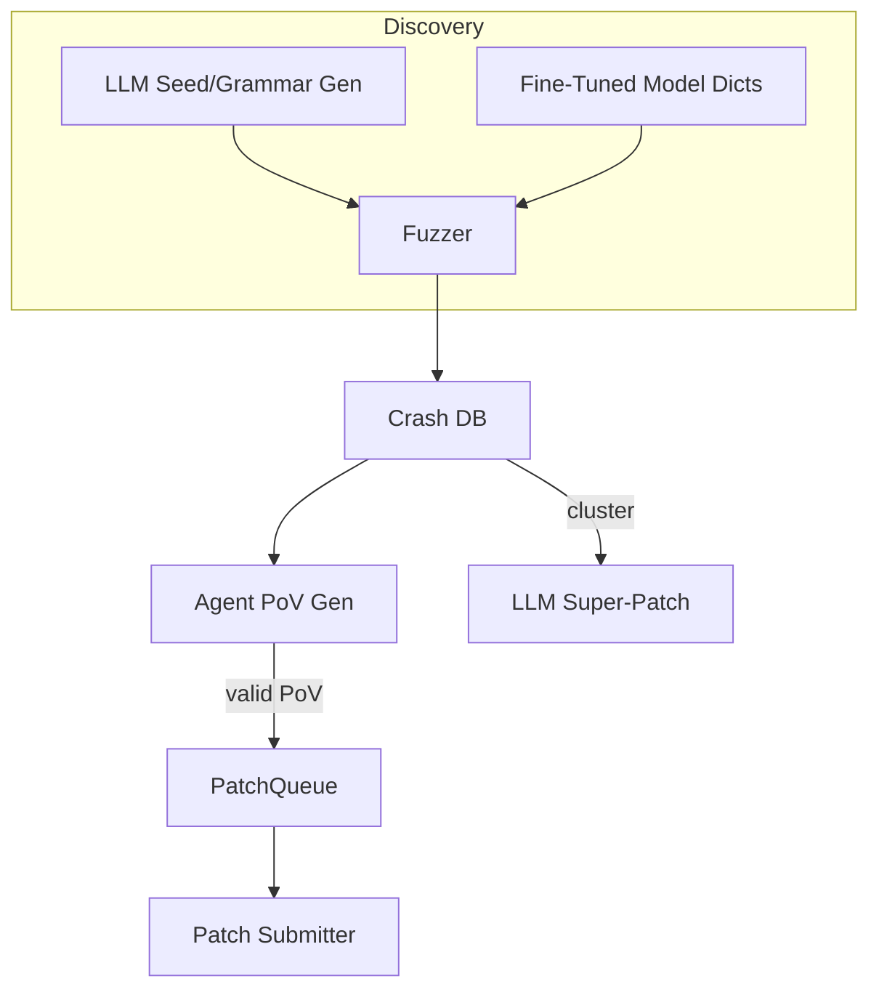

# AI-Assisted Fuzzing & Automated Vulnerability Discovery

{{#include ../banners/hacktricks-training.md}}

## Oorsig
Large-language models (LLMs) kan tradisionele vulnerability-research-pipelines aansienlik versterk deur semanties ryk inputs te genereer, grammars te ontwikkel, oor crash-data te redeneer en selfs patches vir verskeie bugs voor te stel. Hierdie bladsy versamel die doeltreffendste patrone wat tydens DARPA se AI Cyber Challenge (AIxCC)-finaal en ander openbare navorsing waargeneem is.<sup>[[4]](#references)</sup><sup>[[5]](#references)</sup>

Wat volg, is nie ’n beskrywing van een spesifieke kompetisiestelsel nie, maar ’n abstraksie van die tegnieke sodat jy dit in jou eie workflows kan reproduseer.

---

## 1. LLM-Generated Seed Inputs

Tradisionele coverage–guided fuzzers (AFL++, libFuzzer, Honggfuzz…) begin met ’n klein corpus van seeds en muteer bytes blindelings. Wanneer die target-input-formaat kompleks is (SQL, URLs, custom binary protocols), breek random mutations gewoonlik die sintaksis voordat interessante branches bereik word.

LLMs kan hierdie bootstrap-probleem oplos deur *seed generators* uit te stuur – kort scripts wat **syntax-correct but security-relevant inputs** genereer. Byvoorbeeld:
```prompt
SYSTEM: You are a helpful security engineer.
USER:
Write a Python3 program that prints 200 unique SQL injection strings targeting common anti-pattern mistakes (missing quotes, numeric context, stacked queries).  Ensure length ≤ 256 bytes / string so they survive common length limits.
```

```python
# gen_sqli_seeds.py (truncated)
PAYLOADS = [
"1 OR 1=1 -- ",
"' UNION SELECT NULL,NULL--",
"0; DROP TABLE users;--",
...
]
for p in PAYLOADS:
print(p)
```
Voer dit een keer uit en voer die uitvoer direk in die fuzzer se aanvanklike corpus in:
```bash
python3 gen_sqli_seeds.py > seeds.txt
afl-fuzz -i seeds.txt -o findings/ -- ./target @@
```
Voordele:
1. Semantiese geldigheid → dieper dekking vroegtydig.
2. Kan weer gegenereer word: pas die prompt aan om op XSS, path traversal, binary blobs, ens. te fokus.
3. Goedkoop (< 1 ¢ met GPT-3.5).

### Wenke
* Gee die model opdrag om die payload-lengte en encoding (UTF-8, URL-encoded, UTF-16-LE) te *diversifiseer* om oppervlakkige filters te omseil.
* Vra vir ’n *enkele self-contained script* – dit vermy probleme met JSON-formatering.

---

## 2. Grammar-Evolution Fuzzing

’n Kragtiger variant is om die LLM ’n **grammar** te laat **evolve** in plaas van konkrete seeds. Die workflow (“Grammar Guy”-patroon) is:

1. Genereer ’n aanvanklike ANTLR/Peach/LibFuzzer grammar deur middel van ’n prompt.
2. Fuzz vir N minute en versamel coverage-metrics (edges / blocks wat getref is).
3. Som onbereikte programareas op en voer die opsomming terug na die model:
```prompt
The previous grammar triggered 12 % of the program edges.  Functions not reached: parse_auth, handle_upload.  Add / modify rules to cover these.
```
4. Voeg die nuwe rules saam, fuzz weer en herhaal.

Pseudo-code-skelet:
```python
for epoch in range(MAX_EPOCHS):
grammar = llm.refine(grammar, feedback=coverage_stats)
save(grammar, f"grammar_{epoch}.txt")
coverage_stats = run_fuzzer(grammar)
```
Sleutelpunte:
* Hou ’n *budget* – elke verfyning gebruik tokens.
* Gebruik `diff` + `patch`-instruksies sodat die model redigeer eerder as om te herskryf.
* Stop wanneer Δcoverage < ε.

---

## 3. Agent-gebaseerde PoV (Exploit)-generering

Nadat ’n crash gevind is, benodig jy steeds ’n **proof-of-vulnerability (PoV)** wat dit deterministies aktiveer.

’n Skaalbare benadering is om baie liggewig werkers (prosesse, threads of containers) te begin, waar elkeen ’n ander model of sampling-konfigurasie gebruik. Die AIxCC-finaliste-opname gee konkrete voorbeelde van die skaal: een span het **duisende gelyktydige agents** vir AI-first PoV-generering gebruik, terwyl ’n ander **300–500 fuzzing-agents** georkestreer het en LLMs vir hoërvlak-semantiese redenasie gereserveer het.<sup>[[4]](#references)</sup>

Pypelyn:
1. Statiese/dinamiese analise lewer *bug-kandidate* (struct met crash PC, input-slice, sanitizer-boodskap).
2. Die orchestrator versprei kandidate na agents.
3. Agent se redenasiestappe:
a. Reproduseer die bug plaaslik met `gdb` + input.
b. Stel ’n minimale exploit-payload voor.
c. Valideer die exploit in ’n sandbox.  Indien suksesvol → dien in.
4. Mislukte pogings word **weer as nuwe seeds in die tou geplaas** vir coverage-fuzzing (terugvoerlus).

Voordele:
* Parallelisering verberg onbetroubaarheid van ’n enkele agent.
* Outomatiese instemming van temp / modelgrootte gebaseer op die waargenome sukseskoers.

---

## 4. Directed Fuzzing met Fine-Tuned Code Models

Fine-tune ’n open-weight-model (bv. Llama-7B) op C/C++-bronkode wat met vulnerability-patrone (integer overflow, buffer copy, format string) gemerk is.  Doen dan:

1. Voer statiese analise uit om ’n funksielys + AST te kry.
2. Prompt die model: *“Gee mutation dictionary-inskrywings wat waarskynlik memory safety in funksie X sal breek”*.
3. Voeg daardie tokens in ’n pasgemaakte `AFL_CUSTOM_MUTATOR` in.

Voorbeeld-uitset vir ’n `sprintf`-wrapper:
```
{"pattern":"%99999999s"}
{"pattern":"AAAAAAAA....<1024>....%n"}
```
Empiries verminder dit time-to-crash met >2× op werklike teikens.

---

## 5. AI-Guided Patching Strategies

### 5.1 Super Patches
Vra die model om crash signatures te *cluster* en ’n **enkele patch** voor te stel wat die gemeenskaplike hoofoorsaak verwyder. Dien dit een keer in, herstel verskeie bugs → minder accuracy penalties in omgewings waar elke verkeerde patch punte kos.

Prompt outline:
```
Here are 10 stack traces + file snippets.  Identify the shared mistake and generate a unified diff fixing all occurrences.
```
### 5.2 Spekulatiewe Patch-verhouding
Implementeer ’n queue waar bevestigde PoV-validated patches en *speculative* patches (geen PoV nie) teen ’n 1:​N-verhouding afgewissel word, ingestel volgens die scoring rules (bv. 2 speculative : 1 confirmed). ’n Kostemodel monitor penalties teenoor punte en pas N outomaties aan.

---

## 6. Deterministiese File-by-File AI Code Review

’n Algemene failure mode in AI-assisted review is om een agent te vra om ’n hele repository te inspekteer en te hoop dat dit die regte files en grep-terme kies. ’n Meer betroubare patroon is om **repository coverage af te dwing**:<sup>[[1]](#references)</sup>

1. Enumerate source files.
2. Stuur **een file op ’n slag** plus minimale konteks (entrypoint, imports, nabygeleë routes/callers).
3. Vereis ’n **structured report** vir elke file: sources, sink, ontbrekende validation, exploit preconditions en confidence.<sup>[[3]](#references)</sup>
4. Deduplicate reports volgens **source→sink pattern** en valideer die hoërisiko-gevalle handmatig.

Dit gebruik baie tokens en lewer geraas, maar dit is baie effektief om **eenvoudige source/sink-bugs met ’n groot impak** na vore te bring wat breë agentic reviews dikwels mis.

### Triage patterns wat prioriteit verdien

- **Dynamic PHP include/dispatch**: attacker-controlled route/controller/module name wat na `require_once()`, `include()` of `include_once()` vloei sonder streng allowlisting en path canonicalisation.
- **Shell execution in admin/account workflows**: usernames, domains, FTP accounts of ander identifiers wat `exec()`, `system()`, `shell_exec()`, `passthru()`, `proc_open()` of `popen()` bereik.
- **Structured input fan-in**: dieselfde parameter wat vanaf `$_GET`, `$_POST`, JSON, XML of framework body parsers aanvaar word en later in filesystem- of OS-command sinks hergebruik word.

### Twee praktiese bug classes wat hierdie metode goed vind

- **PHP controller-dispatch LFI/RCE**: indien ’n request-controlled controller name sonder ’n allowlist/path normalisation in `require_once()` aaneengeskakel word, kan traversal sequences soos `../` PHP laat om ’n onbedoelde plaaslike `.php`-file in te sluit. Indien die attacker die include na ’n geplante of andersins nuttige PHP-file kan laat wys, verander die LFI in code execution. Sien [File Inclusion / Path Traversal](../pentesting-web/file-inclusion/README.md).<sup>[[1]](#references)</sup>
- **Authenticated command injection in hosting/admin panels**: indien account-management fields soos usernames in shell commands ingebed word, kan ’n low-privileged authenticated user ’n normale create/delete action in RCE verander. Die impak neem toe wanneer die panel die command as ’n meer privileged service account uitvoer. Sien [Command Injection](../pentesting-web/command-injection.md).<sup>[[1]](#references)</sup>

### Praktiese review-notas

- Gebruik die LLM eers as ’n **source/sink reviewer**, nie as ’n exploit generator nie.
- Vra dit om die **attacker-controlled field**, die **normalization/validation gap** en die **dangerous sink** uitdruklik te lys.
- Vir groot repos is deterministiese per-file review dikwels meer betroubaar as ’n enkele outonome agent run, selfs wanneer laasgenoemde ’n sterker model gebruik.<sup>[[2]](#references)</sup>
- Verwag swakker resultate met **Broken Access Control** en ander business-logic bugs waar exploitability van cross-file assumptions, role semantics of produkspesifieke threat models afhang.

---

## Alles Saamvoeg
’n End-to-end CRS (Cyber Reasoning System) kan die komponente soos volg verbind:

```mermaid
graph TD
subgraph Discovery
A[LLM Seed/Grammar Gen] --> B[Fuzzer]
C[Fine-Tuned Model Dicts] --> B
end
B --> D[Crash DB]
D --> E[Agent PoV Gen]
E -->|valid PoV| PatchQueue
D -->|cluster| F[LLM Super-Patch]
PatchQueue --> G[Patch Submitter]
```
---

## References

- [1] [Project Black - Plaaslike AI vir kuberveiligheid: Vind phpIPAM LFI en myVesta-geauthentiseerde RCE](https://projectblack.io/blog/local-ai-for-cyber-security)
- [2] [Strix](https://github.com/usestrix/strix)
- [3] [GitHub Copilot-gemeenskap se security-review-skill](https://github.com/github/awesome-copilot/blob/main/skills/security-review/SKILL.md)
- [4] [Trail of Bits – AIxCC-eindronde: Die volledige oorsig](https://blog.trailofbits.com/2025/08/07/aixcc-finals-tale-of-the-tape/)
- [5] [CTF Radiooo AIxCC-finalisonterhoude](https://www.youtube.com/@ctfradiooo)
{{#include ../banners/hacktricks-training.md}}
