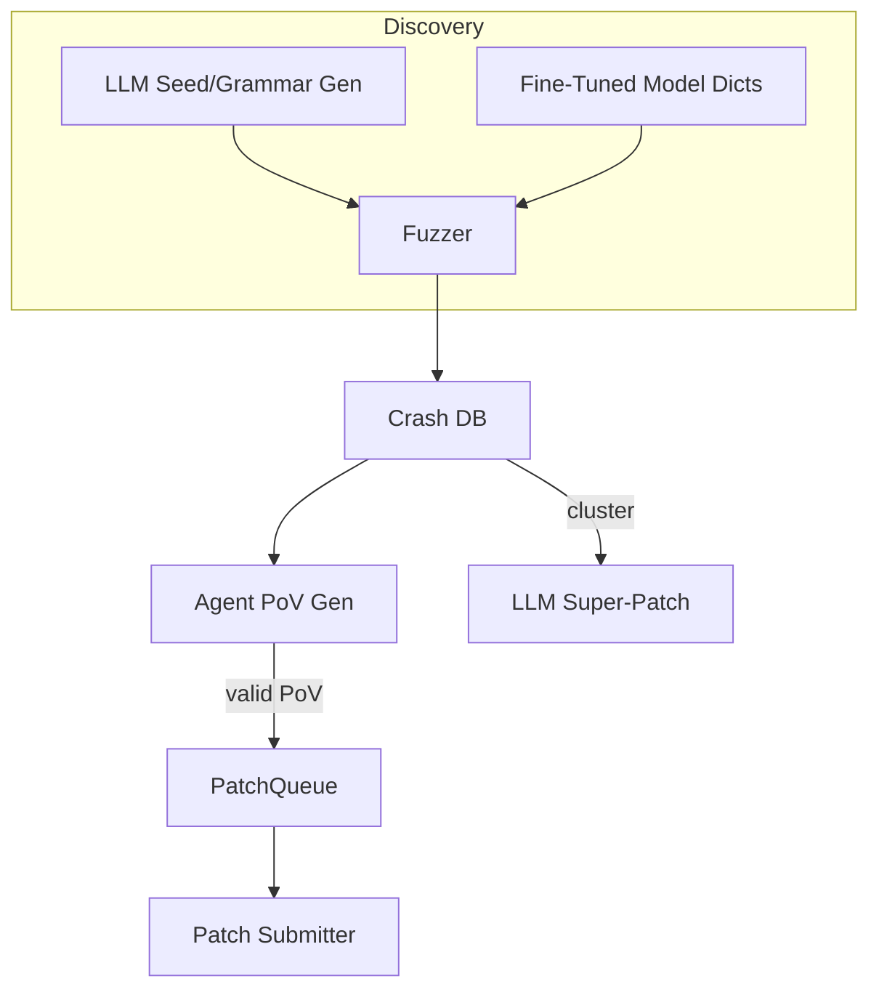

# Fuzzing potpomognut AI-em i automatizovano otkrivanje ranjivosti

{{#include ../banners/hacktricks-training.md}}

## Pregled
Large-language models (LLM-ovi) mogu značajno unaprediti tradicionalne pipeline-ove za istraživanje ranjivosti generisanjem semantički bogatih inputa, razvojem grammar-a, analizom podataka o crash-evima, pa čak i predlaganjem patch-eva za više bug-ova. Ova stranica prikuplja najefikasnije obrasce uočene tokom finala DARPA AI Cyber Challenge-a (AIxCC) i drugih javnih istraživanja.<sup>[[4]](#references)</sup><sup>[[5]](#references)</sup>

Ono što sledi nije opis jednog konkretnog takmičarskog sistema, već apstrakcija tehnika koje možete reprodukovati u sopstvenim workflow-ima.

---

## 1. Seed input-i generisani pomoću LLM-a

Tradicionalni coverage–guided fuzzer-i (AFL++, libFuzzer, Honggfuzz…) počinju sa malim corpus-om seed-ova i naslepo mutiraju byte-ove. Kada je ciljni input format složen (SQL, URL-ovi, prilagođeni binarni protokoli), nasumične mutacije obično naruše sintaksu pre nego što se dođe do zanimljivih grana.

LLM-ovi mogu rešiti ovaj bootstrap problem generisanjem *seed generator-a* – kratkih skripti koje daju **sintaksno ispravne, ali bezbednosno relevantne input-e**. Na primer:
```prompt
SYSTEM: You are a helpful security engineer.
USER:
Write a Python3 program that prints 200 unique SQL injection strings targeting common anti-pattern mistakes (missing quotes, numeric context, stacked queries).  Ensure length ≤ 256 bytes / string so they survive common length limits.
```

```python
# gen_sqli_seeds.py (truncated)
PAYLOADS = [
"1 OR 1=1 -- ",
"' UNION SELECT NULL,NULL--",
"0; DROP TABLE users;--",
...
]
for p in PAYLOADS:
print(p)
```
Pokrenite jednom i prosledite izlaz direktno u početni korpus fuzzera:
```bash
python3 gen_sqli_seeds.py > seeds.txt
afl-fuzz -i seeds.txt -o findings/ -- ./target @@
```
Prednosti:
1. Semantička validnost → dublja pokrivenost u ranoj fazi.
2. Može se ponovo generisati: prilagodite prompt da se fokusira na XSS, path traversal, binarne blobove itd.
3. Jeftino (< 1 ¢ sa GPT-3.5).

### Saveti
* Uputite model da *diverzifikuje* dužinu i kodiranje payload-a (UTF-8, URL-encoded, UTF-16-LE) kako bi zaobišao površinske filtere.
* Zatražite *jednu samostalnu skriptu* – time se izbegavaju problemi sa JSON formatiranjem.

---

## 2. Grammar-Evolution Fuzzing

Moćnija varijanta je omogućiti LLM-u da **razvija gramatiku** umesto konkretnih seed-ova. Workflow („Grammar Guy“ obrazac) je sledeći:

1. Generišite početnu ANTLR/Peach/LibFuzzer gramatiku pomoću prompt-a.
2. Pokrenite fuzzing N minuta i prikupite metrike pokrivenosti (pogodjene ivice / blokovi).
3. Sumirajte nepokrivene delove programa i prosledite sažetak modelu:
```prompt
The previous grammar triggered 12 % of the program edges.  Functions not reached: parse_auth, handle_upload.  Add / modify rules to cover these.
```
4. Objedinite nova pravila, ponovo pokrenite fuzzing i ponavljajte postupak.

Kostur pseudo-koda:
```python
for epoch in range(MAX_EPOCHS):
grammar = llm.refine(grammar, feedback=coverage_stats)
save(grammar, f"grammar_{epoch}.txt")
coverage_stats = run_fuzzer(grammar)
```
Ključne tačke:
* Održavajte *budget* – svako poboljšanje koristi tokene.
* Koristite `diff` + `patch` instrukcije kako bi model menjao sadržaj umesto da ga ponovo ispisuje.
* Zaustavite se kada je Δcoverage < ε.

---

## 3. Agent-Based PoV (Exploit) Generation

Nakon pronalaska crash-a i dalje vam je potreban **proof-of-vulnerability (PoV)** koji ga deterministički izaziva.

Skalabilan pristup je pokretanje velikog broja lightweight workera (procesa, thread-ova ili containera), pri čemu svaki koristi drugačiji model ili sampling konfiguraciju. Istraživanje AIxCC finalista daje konkretne primere obima: jedan tim je koristio **hiljade konkurentnih agenata** za AI-first PoV generation, dok je drugi orkestrirao **300–500 fuzzing agenata** i LLM-ove koristio za semantičko rezonovanje višeg nivoa.<sup>[[4]](#references)</sup>

Pipeline:
1. Static/ dynamic analysis proizvodi *bug candidates* (struct sa crash PC-jem, input slice-om i sanitizer porukom).
2. Orchestrator distribuira kandidate agentima.
3. Koraci agentovog rezonovanja:
a. Lokalno reprodukujte bug pomoću `gdb` + input-a.
b. Predložite minimalni exploit payload.
c. Validirajte exploit u sandbox-u.  Ako uspe → pošaljite ga.
4. Neuspešni pokušaji se **ponovo stavljaju u red kao novi seed-ovi** za coverage fuzzing (feedback loop).

Prednosti:
* Parallelisation prikriva nepouzdanost pojedinačnog agenta.
* Auto-tuning temp / veličine modela na osnovu uočene stope uspešnosti.

---

## 4. Directed Fuzzing with Fine-Tuned Code Models

Fine-tune-ujte open-weight model (npr. Llama-7B) na C/C++ source kodu označenom obrascima ranjivosti (integer overflow, buffer copy, format string). Zatim:

1. Pokrenite static analysis kako biste dobili listu funkcija + AST.
2. Zadajte modelu prompt: *“Give mutation dictionary entries that are likely to break memory safety in function X”*.
3. Umetnite te tokene u prilagođeni `AFL_CUSTOM_MUTATOR`.

Primer izlaza za `sprintf` wrapper:
```
{"pattern":"%99999999s"}
{"pattern":"AAAAAAAA....<1024>....%n"}
```
Empirijski, ovo smanjuje time-to-crash za >2× na stvarnim metama.

---

## 5. Strategije patching-a vođenog pomoću AI-ja

### 5.1 Super Patches
Zatražite od modela da *klasterizuje* potpise crash-eva i predloži **jedan patch** koji uklanja zajednički osnovni uzrok. Pošaljite ga jednom, ispravite nekoliko bug-ova → manje penala za tačnost u okruženjima u kojima svaki pogrešan patch košta poene.

Okvir Prompt-a:
```
Here are 10 stack traces + file snippets.  Identify the shared mistake and generate a unified diff fixing all occurrences.
```
### 5.2 Odnos spekulativnih patch-eva
Implementirajte queue u kojem se potvrđeni patch-evi validirani pomoću PoV-a i *spekulativni* patch-evi (bez PoV-a) naizmenično obrađuju u odnosu 1:​N, podešenom prema pravilima bodovanja (npr. 2 spekulativna : 1 potvrđeni). Model troškova prati penale u odnosu na poene i samostalno prilagođava N.

---

## Deterministički AI code review fajl po fajl

Čest neuspeh kod AI-assisted review-a jeste tražiti od jednog agenta da pregleda ceo repository i nadati se da će izabrati odgovarajuće fajlove i grep termine. Pouzdaniji obrazac je **prisiliti pokrivenost repository-ja**:<sup>[[1]](#references)</sup>

1. Nabrojte source fajlove.
2. Pošaljite **jedan fajl istovremeno** uz minimalni kontekst (entrypoint, imports, obližnje routes/callers).
3. Zahtevajte **strukturirani izveštaj** za svaki fajl: sources, sink, nedostajuću validaciju, exploit preconditions i confidence.<sup>[[3]](#references)</sup>
4. Uklonite duplikate izveštaja prema **source→sink obrascu** i ručno validirajte one s visokim rizikom.

Ovo zahteva mnogo tokena i proizvodi šum, ali je veoma efikasno za otkrivanje **jednostavnih source/sink bugova sa velikim uticajem** koje širi agentic review često ne uočava.

### Obrasci za triage kojima vredi dati prioritet

- **Dinamički PHP include/dispatch**: nazivi route/controller/module-a pod kontrolom napadača prosleđuju se u `require_once()`, `include()` ili `include_once()` bez striktne allowliste i path canonicalisation-a.
- **Shell execution u admin/account workflow-ima**: usernames, domeni, FTP account-i ili drugi identifikatori dospevaju do `exec()`, `system()`, `shell_exec()`, `passthru()`, `proc_open()` ili `popen()`.
- **Fan-in strukturiranog inputa**: isti parametar se prihvata iz `$_GET`, `$_POST`, JSON-a, XML-a ili framework body parser-a, a zatim se ponovo koristi u filesystem ili OS-command sink-ovima.

### Dve praktične klase bugova koje ovaj metod dobro pronalazi

- **PHP controller-dispatch LFI/RCE**: ako se naziv controller-a pod kontrolom request-a konkatenira u `require_once()` bez allowliste/path normalisation-a, traversal sekvence poput `../` mogu naterati PHP da uključi nenamerni lokalni `.php` fajl. Ako napadač može da usmeri include na ubačen ili na drugi način koristan PHP fajl, LFI postaje code execution. Pogledajte [File Inclusion / Path Traversal](../pentesting-web/file-inclusion/README.md).<sup>[[1]](#references)</sup>
- **Authenticated command injection u hosting/admin panelima**: ako se polja za account management, kao što su usernames, ugrađuju u shell commands, authenticated user sa niskim privilegijama može normalnu akciju kreiranja/brisanja pretvoriti u RCE. Uticaj se povećava kada panel izvršava command kao privilegovaniji service account. Pogledajte [Command Injection](../pentesting-web/command-injection.md).<sup>[[1]](#references)</sup>

### Praktične napomene za review

- Koristite LLM najpre kao **source/sink reviewer**, a ne kao generator exploita.
- Zatražite da eksplicitno navede **polje pod kontrolom napadača**, **propust u normalisation/validation procesu** i **opasni sink**.
- Kod velikih repo-a, deterministički review fajl po fajl često je pouzdaniji od jednog autonomnog agent run-a, čak i kada drugi koristi jači model.<sup>[[2]](#references)</sup>
- Očekujte slabije rezultate kod **Broken Access Control** i drugih business-logic bugova čija exploitability zavisi od pretpostavki između fajlova, semantike uloga ili threat modela specifičnog za proizvod.

---

## Sve zajedno
End-to-end CRS (Cyber Reasoning System) može povezati komponente na sledeći način:

```mermaid
graph TD
subgraph Discovery
A[LLM Seed/Grammar Gen] --> B[Fuzzer]
C[Fine-Tuned Model Dicts] --> B
end
B --> D[Crash DB]
D --> E[Agent PoV Gen]
E -->|valid PoV| PatchQueue
D -->|cluster| F[LLM Super-Patch]
PatchQueue --> G[Patch Submitter]
```
---

## References

- [1] [Project Black - Lokalna AI za sajber bezbednost: Pronalaženje phpIPAM LFI-ja i autentifikovanog RCE-a](https://projectblack.io/blog/local-ai-for-cyber-security)
- [2] [Strix](https://github.com/usestrix/strix)
- [3] [GitHub Copilot skill zajednice za security-review](https://github.com/github/awesome-copilot/blob/main/skills/security-review/SKILL.md)
- [4] [Trail of Bits – AIxCC finale: Priča sa trake](https://blog.trailofbits.com/2025/08/07/aixcc-finals-tale-of-the-tape/)
- [5] [CTF Radiooo intervjui sa AIxCC finalistima](https://www.youtube.com/@ctfradiooo)
{{#include ../banners/hacktricks-training.md}}
