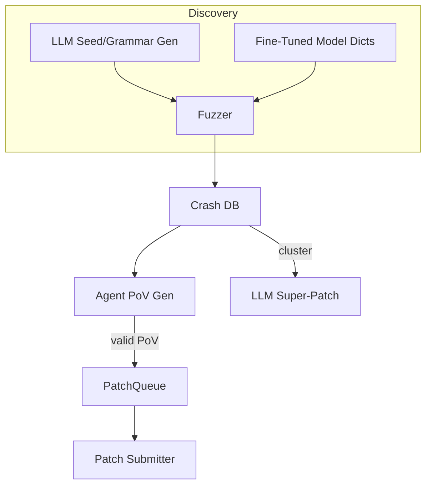

# AI-Assisted Fuzzing & Automated Vulnerability Discovery

{{#include ../banners/hacktricks-training.md}}

## Επισκόπηση
Τα Large-language models (LLMs) μπορούν να ενισχύσουν σημαντικά τα παραδοσιακά vulnerability-research pipelines, δημιουργώντας inputs με πλούσιο semantic περιεχόμενο, εξελίσσοντας grammars, αναλύοντας crash data και προτείνοντας ακόμη και patches για πολλαπλά bugs.  Αυτή η σελίδα συγκεντρώνει τα πιο αποτελεσματικά patterns που παρατηρήθηκαν στους τελικούς του DARPA’s AI Cyber Challenge (AIxCC) και σε άλλες δημόσιες έρευνες.<sup>[[4]](#references)[[5]](#references)</sup>

Αυτό που ακολουθεί δεν αποτελεί περιγραφή ενός συγκεκριμένου competition system, αλλά μια αφαίρεση των τεχνικών, ώστε να μπορείτε να τις αναπαραγάγετε στα δικά σας workflows.

---

## 1. LLM-Generated Seed Inputs

Οι παραδοσιακοί coverage–guided fuzzers (AFL++, libFuzzer, Honggfuzz…) ξεκινούν με ένα μικρό corpus από seeds και μεταλλάσσουν bytes στα τυφλά.  Όταν το target input format είναι σύνθετο (SQL, URLs, custom binary protocols), οι τυχαίες μεταλλάξεις συνήθως καταστρέφουν τη σύνταξη πριν επιτευχθούν ενδιαφέροντα branches.

Τα LLMs μπορούν να επιλύσουν αυτό το bootstrap problem δημιουργώντας *seed generators* – σύντομα scripts που παράγουν **syntax-correct αλλά security-relevant inputs**.  Για παράδειγμα:
```prompt
SYSTEM: You are a helpful security engineer.
USER:
Write a Python3 program that prints 200 unique SQL injection strings targeting common anti-pattern mistakes (missing quotes, numeric context, stacked queries).  Ensure length ≤ 256 bytes / string so they survive common length limits.
```

```python
# gen_sqli_seeds.py (truncated)
PAYLOADS = [
"1 OR 1=1 -- ",
"' UNION SELECT NULL,NULL--",
"0; DROP TABLE users;--",
...
]
for p in PAYLOADS:
print(p)
```
Εκτελέστε το μία φορά και τροφοδοτήστε την έξοδο απευθείας στο αρχικό corpus του fuzzer:
```bash
python3 gen_sqli_seeds.py > seeds.txt
afl-fuzz -i seeds.txt -o findings/ -- ./target @@
```
Benefits:
1. Semantic validity → deeper coverage early.
2. Re-generatable: tweak the prompt to focus on XSS, path traversal, binary blobs, etc.
3. Cheap (< 1 ¢ with GPT-3.5).

### Tips
* Instruct the model to *diversify* payload length and encoding (UTF-8, URL-encoded, UTF-16-LE) to bypass superficial filters.
* Ask for a *single self-contained script* – avoids JSON formatting hiccups.

---

## 2. Grammar-Evolution Fuzzing

Μια πιο ισχυρή παραλλαγή είναι να让σετε το LLM να **εξελίσσει μια grammar** αντί για συγκεκριμένα seeds. Η ροή εργασίας (το μοτίβο “Grammar Guy”) είναι:

1. Generate an initial ANTLR/Peach/LibFuzzer grammar via prompt.
2. Fuzz for N minutes and collect coverage metrics (edges / blocks hit).
3. Summarise uncovered program areas and feed the summary back into the model:
```prompt
The previous grammar triggered 12 % of the program edges.  Functions not reached: parse_auth, handle_upload.  Add / modify rules to cover these.
```
4. Merge the new rules, re-fuzz, repeat.

Pseudo-code skeleton:
```python
for epoch in range(MAX_EPOCHS):
grammar = llm.refine(grammar, feedback=coverage_stats)
save(grammar, f"grammar_{epoch}.txt")
coverage_stats = run_fuzzer(grammar)
```
Βασικά σημεία:
* Κρατήστε ένα *budget* – κάθε refinement χρησιμοποιεί tokens.
* Χρησιμοποιήστε οδηγίες `diff` + `patch`, ώστε το model να επεξεργάζεται αντί να ξαναγράφει.
* Σταματήστε όταν Δcoverage < ε.

---

## 3. Agent-Based PoV (Exploit) Generation

Αφού βρεθεί ένα crash, χρειάζεστε ακόμη ένα **proof-of-vulnerability (PoV)** που το ενεργοποιεί deterministically.

Μια scalable προσέγγιση είναι η εκκίνηση *χιλιάδων* lightweight agents (<process/thread/container/prisoner>), όπου καθένας εκτελεί διαφορετικό LLM (GPT-4, Claude, Mixtral) ή διαφορετική ρύθμιση temperature.

Pipeline:
1. Η static/dynamic analysis παράγει *bug candidates* (struct με crash PC, input slice, sanitizer msg).
2. Ο orchestrator διανέμει τους candidates στους agents.
3. Βήματα reasoning του agent:
a. Αναπαράγει το bug τοπικά με `gdb` + input.
b. Προτείνει minimal exploit payload.
c. Επικυρώνει το exploit σε sandbox. Αν είναι επιτυχές → submit.
4. Οι αποτυχημένες προσπάθειες γίνονται **re-queued ως νέα seeds** για coverage fuzzing (feedback loop).

Πλεονεκτήματα:
* Η parallelisation αποκρύπτει την unreliability ενός single agent.
* Αυτόματο auto-tuning των temp / model size βάσει του παρατηρούμενου success-rate.

---

## 4. Directed Fuzzing with Fine-Tuned Code Models

Κάντε fine-tune ένα open-weight model (π.χ. Llama-7B) σε C/C++ source με labels για vulnerability patterns (integer overflow, buffer copy, format string). Έπειτα:

1. Εκτελέστε static analysis για να λάβετε τη function list + AST.
2. Κάντε prompt στο model: *“Give mutation dictionary entries that are likely to break memory safety in function X”*.
3. Εισαγάγετε αυτά τα tokens σε ένα custom `AFL_CUSTOM_MUTATOR`.

Παράδειγμα output για ένα `sprintf` wrapper:
```
{"pattern":"%99999999s"}
{"pattern":"AAAAAAAA....<1024>....%n"}
```
Εμπειρικά, αυτό μειώνει τον χρόνο έως το crash κατά >2× σε πραγματικούς στόχους.

---

## 5. Στρατηγικές Patching με καθοδήγηση από AI

### 5.1 Super Patches
Ζητήστε από το model να *ομαδοποιήσει* τα crash signatures και να προτείνει ένα **ενιαίο patch** που εξαλείφει την κοινή root cause. Υποβάλετέ το μία φορά, διορθώστε πολλά bugs → λιγότερες ποινές ακρίβειας σε περιβάλλοντα όπου κάθε λανθασμένο patch κοστίζει πόντους.

Πλαίσιο prompt:
```
Here are 10 stack traces + file snippets.  Identify the shared mistake and generate a unified diff fixing all occurrences.
```
### 5.2 Speculative Patch Ratio
Υλοποιήστε μια queue όπου τα επιβεβαιωμένα patches με επικύρωση PoV και τα *speculative* patches (χωρίς PoV) interleave σε αναλογία 1:​N, προσαρμοσμένη στους scoring rules (π.χ. 2 speculative : 1 confirmed). Ένα cost model παρακολουθεί τα penalties σε σχέση με τους πόντους και προσαρμόζει αυτόματα το N.

---

## 6. Deterministic File-by-File AI Code Review

Ένα συχνό failure mode στο AI-assisted review είναι να ζητάτε από έναν agent να επιθεωρήσει ολόκληρο ένα repository και να ελπίζετε ότι θα επιλέξει τα σωστά files και grep terms. Ένα πιο αξιόπιστο pattern είναι να **επιβάλλετε repository coverage**:<sup>[[1]](#references)</sup>

1. Καταγράψτε τα source files.
2. Στείλτε **ένα file κάθε φορά** μαζί με minimal context (entrypoint, imports, nearby routes/callers).
3. Απαιτήστε ένα **structured report** για κάθε file: sources, sink, missing validation, exploit preconditions και confidence.<sup>[[3]](#references)</sup>
4. Κάντε deduplicate τα reports βάσει του **source→sink pattern** και επικυρώστε χειροκίνητα τα high-risk ones.

Αυτό απαιτεί πολλά tokens και παράγει θόρυβο, αλλά είναι πολύ αποτελεσματικό στην ανάδειξη **απλών high-impact source/sink bugs** που συχνά παραλείπουν τα broad agentic reviews.

### Triage patterns που αξίζει να prioritise

- **Dynamic PHP include/dispatch**: ονόματα route/controller/module που ελέγχονται από τον attacker και καταλήγουν σε `require_once()`, `include()` ή `include_once()` χωρίς strict allowlisting και path canonicalisation.
- **Shell execution σε admin/account workflows**: usernames, domains, FTP accounts ή άλλα identifiers που φτάνουν σε `exec()`, `system()`, `shell_exec()`, `passthru()`, `proc_open()` ή `popen()`.
- **Structured input fan-in**: η ίδια parameter γίνεται αποδεκτή από `$_GET`, `$_POST`, JSON, XML ή framework body parsers και αργότερα επαναχρησιμοποιείται σε filesystem ή OS-command sinks.

### Two practical bug classes this method finds well

- **PHP controller-dispatch LFI/RCE**: αν ένα request-controlled controller name συνενώνεται σε `require_once()` χωρίς allowlist/path normalisation, traversal sequences όπως `../` μπορούν να κάνουν την PHP να συμπεριλάβει ένα unintended local `.php` file. Αν ο attacker μπορεί να δείξει το include σε ένα planted ή με άλλο τρόπο χρήσιμο PHP file, το LFI μετατρέπεται σε code execution. See [File Inclusion / Path Traversal](../pentesting-web/file-inclusion/README.md).<sup>[[1]](#references)</sup>
- **Authenticated command injection σε hosting/admin panels**: αν account-management fields, όπως usernames, ενσωματώνονται σε shell commands, ένας low-privileged authenticated user μπορεί να μετατρέψει ένα κανονικό create/delete action σε RCE. Το impact αυξάνεται όταν το panel εκτελεί το command ως πιο privileged service account. See [Command Injection](../pentesting-web/command-injection.md).<sup>[[1]](#references)</sup>

### Practical review notes

- Χρησιμοποιήστε το LLM πρώτα ως **source/sink reviewer**, όχι ως exploit generator.
- Ζητήστε του να καταγράψει ρητά το **attacker-controlled field**, το **normalization/validation gap** και το **dangerous sink**.
- Για μεγάλα repos, το deterministic per-file review είναι συχνά πιο αξιόπιστο από ένα single autonomous agent run, ακόμη και όταν το δεύτερο χρησιμοποιεί ισχυρότερο model.<sup>[[2]](#references)</sup>
- Αναμένετε ασθενέστερα αποτελέσματα σε **Broken Access Control** και άλλα business-logic bugs, όπου η exploitability εξαρτάται από cross-file assumptions, role semantics ή product-specific threat models.

---

## Putting It All Together
Ένα end-to-end CRS (Cyber Reasoning System) μπορεί να συνδέσει τα components ως εξής:

```mermaid
graph TD
subgraph Discovery
A[LLM Seed/Grammar Gen] --> B[Fuzzer]
C[Fine-Tuned Model Dicts] --> B
end
B --> D[Crash DB]
D --> E[Agent PoV Gen]
E -->|valid PoV| PatchQueue
D -->|cluster| F[LLM Super-Patch]
PatchQueue --> G[Patch Submitter]
```
---

## Αναφορές

- [1] [Project Black - Local AI for Cyber Security: Εύρεση phpIPAM LFI και myVesta Authenticated RCE](https://projectblack.io/blog/local-ai-for-cyber-security)
- [2] [Strix](https://github.com/usestrix/strix)
- [3] [GitHub Copilot community security-review skill](https://github.com/github/awesome-copilot/blob/main/skills/security-review/SKILL.md)
- [4] [Trail of Bits – Τελικοί AIxCC: Η ιστορία της αναμέτρησης](https://blog.trailofbits.com/2025/08/07/aixcc-finals-tale-of-the-tape/)
- [5] [Συνεντεύξεις των φιναλίστ του CTF Radiooo AIxCC](https://www.youtube.com/@ctfradiooo)

{{#include ../banners/hacktricks-training.md}}
