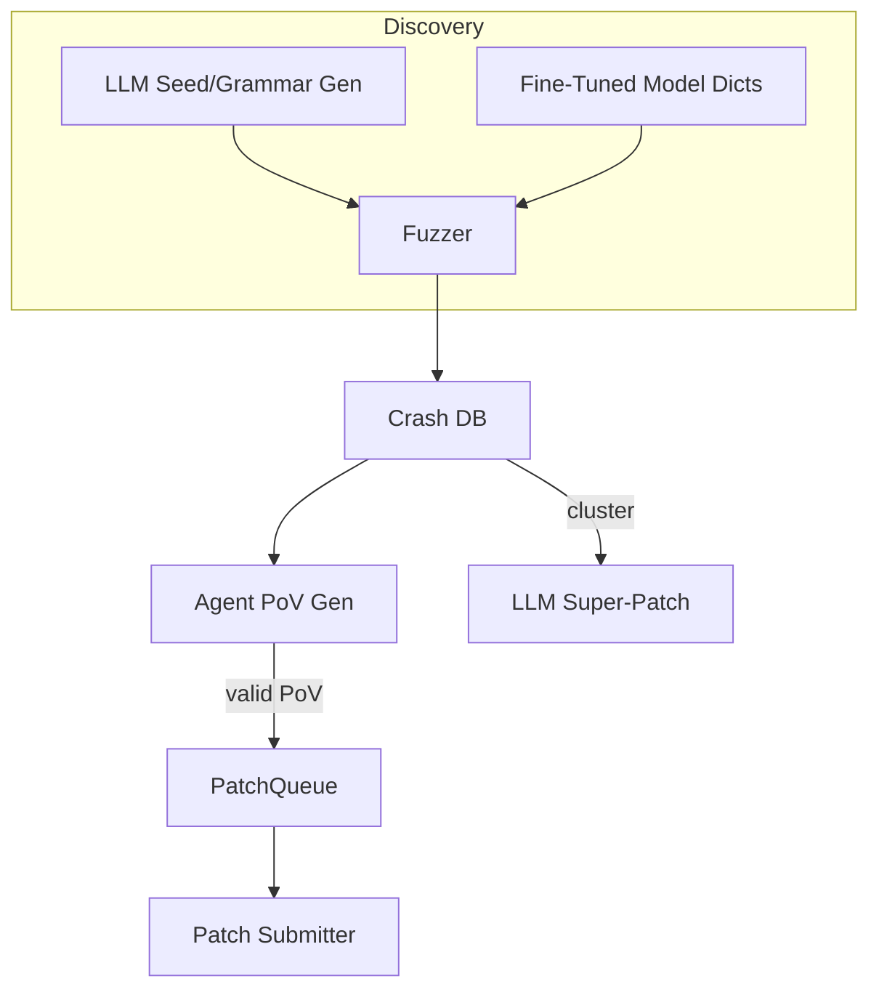

# Fuzzing assisté par l’IA et découverte automatisée de vulnérabilités

{{#include ../banners/hacktricks-training.md}}

## Vue d’ensemble
Les grands modèles de langage (LLM) peuvent considérablement améliorer les pipelines traditionnels de recherche de vulnérabilités en générant des entrées sémantiquement riches, en faisant évoluer des grammaires, en analysant les données de crash et même en proposant des patches corrigeant plusieurs bugs. Cette page rassemble les patterns les plus efficaces observés lors de la finale de l’AI Cyber Challenge (AIxCC) de la DARPA et dans d’autres travaux de recherche publics.<sup>[[4]](#references)</sup><sup>[[5]](#references)</sup>

Ce qui suit ne décrit pas le système d’une compétition spécifique, mais constitue une abstraction de ces techniques afin que vous puissiez les reproduire dans vos propres workflows.

---

## 1. Seed Inputs générés par un LLM

Les fuzzers traditionnels guidés par la couverture (AFL++, libFuzzer, Honggfuzz…) commencent avec un petit corpus de seeds et mutent aveuglément les octets. Lorsque le format des entrées ciblées est complexe (SQL, URLs, protocoles binaires personnalisés), les mutations aléatoires cassent généralement la syntaxe avant d’atteindre les branches intéressantes.

Les LLM peuvent résoudre ce problème d’amorçage en produisant des *seed generators* : de courts scripts qui génèrent des **entrées syntaxiquement correctes mais pertinentes du point de vue de la sécurité**. Par exemple :
```prompt
SYSTEM: You are a helpful security engineer.
USER:
Write a Python3 program that prints 200 unique SQL injection strings targeting common anti-pattern mistakes (missing quotes, numeric context, stacked queries).  Ensure length ≤ 256 bytes / string so they survive common length limits.
```

```python
# gen_sqli_seeds.py (truncated)
PAYLOADS = [
"1 OR 1=1 -- ",
"' UNION SELECT NULL,NULL--",
"0; DROP TABLE users;--",
...
]
for p in PAYLOADS:
print(p)
```
Exécutez une fois et transmettez directement la sortie au corpus initial du fuzzer :
```bash
python3 gen_sqli_seeds.py > seeds.txt
afl-fuzz -i seeds.txt -o findings/ -- ./target @@
```
Benefits:
1. Validité sémantique → couverture plus approfondie dès le début.
2. Régénérable : ajustez le prompt pour vous concentrer sur XSS, le path traversal, les binary blobs, etc.
3. Peu coûteux (< 1 ¢ avec GPT-3.5).

### Conseils
* Demandez au modèle de *diversifier* la longueur et l’encodage des payloads (UTF-8, URL-encoded, UTF-16-LE) afin de contourner les filtres superficiels.
* Demandez un *script unique et autonome* – cela évite les problèmes de formatage JSON.

---

## 2. Grammar-Evolution Fuzzing

Une variante plus puissante consiste à laisser le LLM **faire évoluer une grammaire** plutôt que des seeds concrets. Le workflow (modèle « Grammar Guy ») est le suivant :

1. Générer une grammaire initiale ANTLR/Peach/LibFuzzer via un prompt.
2. Effectuer le fuzzing pendant N minutes et collecter les métriques de couverture (edges / blocks atteints).
3. Résumer les zones du programme non couvertes et renvoyer le résumé au modèle :
```prompt
The previous grammar triggered 12 % of the program edges.  Functions not reached: parse_auth, handle_upload.  Add / modify rules to cover these.
```
4. Fusionner les nouvelles règles, relancer le fuzzing et répéter.

Squelette de pseudo-code :
```python
for epoch in range(MAX_EPOCHS):
grammar = llm.refine(grammar, feedback=coverage_stats)
save(grammar, f"grammar_{epoch}.txt")
coverage_stats = run_fuzzer(grammar)
```
Points clés :
* Conservez un *budget* – chaque refinement utilise des tokens.
* Utilisez les instructions `diff` + `patch` afin que le modèle modifie le code plutôt que de le réécrire.
* Arrêtez-vous lorsque Δcoverage < ε.

---

## 3. Génération de PoV (Exploit) basée sur des agents

Après la découverte d’un crash, vous avez toujours besoin d’un **proof-of-vulnerability (PoV)** qui le déclenche de manière déterministe.

Une approche scalable consiste à lancer de nombreux workers légers (processus, threads ou conteneurs), chacun utilisant un modèle ou une configuration d’échantillonnage différente. L’étude des finalistes de l’AIxCC fournit des exemples concrets de cette échelle : une équipe a utilisé **des milliers d’agents concurrents** pour la génération de PoV avec une approche AI-first, tandis qu’une autre a orchestré **300 à 500 agents de fuzzing** et réservé les LLM au raisonnement sémantique de plus haut niveau.<sup>[[4]](#references)</sup>

Pipeline :
1. L’analyse statique/dynamique produit des *bug candidates* (struct avec crash PC, input slice, message du sanitizer).
2. L’orchestrateur distribue les candidats aux agents.
3. Étapes de raisonnement de l’agent :
a. Reproduire le bug localement avec `gdb` + l’input.
b. Suggérer un exploit payload minimal.
c. Valider l’exploit dans un sandbox.  En cas de succès → soumettre.
4. Les tentatives échouées sont **ré-encodées comme de nouvelles seeds** pour le coverage fuzzing (boucle de feedback).

Avantages :
* La parallélisation masque le manque de fiabilité d’un agent unique.
* Auto-tuning de temp / de la taille du modèle en fonction du taux de réussite observé.

---

## 4. Directed Fuzzing avec des modèles de code Fine-Tuned

Fine-tunez un modèle open-weight (par ex. Llama-7B) sur du code source C/C++ étiqueté avec des patterns de vulnérabilité (integer overflow, buffer copy, format string). Puis :

1. Exécutez une analyse statique pour obtenir la liste des fonctions + l’AST.
2. Demandez au modèle : *« Donne des entrées de dictionnaire de mutation susceptibles de compromettre la memory safety dans la fonction X »*.
3. Insérez ces tokens dans un `AFL_CUSTOM_MUTATOR` personnalisé.

Exemple de sortie pour un wrapper `sprintf` :
```
{"pattern":"%99999999s"}
{"pattern":"AAAAAAAA....<1024>....%n"}
```
Empiriquement, cela réduit de plus de 2× le délai avant crash sur des cibles réelles.

---

## 5. Stratégies de patching guidées par l’IA

### 5.1 Super Patches
Demandez au modèle de *regrouper* les signatures de crash et de proposer un **patch unique** qui élimine la cause racine commune. Soumettez-le une seule fois, corrigez plusieurs bugs → moins de pénalités de précision dans les environnements où chaque mauvais patch coûte des points.

Structure du prompt :
```
Here are 10 stack traces + file snippets.  Identify the shared mistake and generate a unified diff fixing all occurrences.
```
### 5.2 Ratio de patchs spéculatifs
Implémentez une file où les patchs confirmés et validés par PoV et les patchs *spéculatifs* (sans PoV) sont intercalés selon un ratio 1:​N ajusté aux règles de scoring (p. ex. 2 spéculatifs : 1 confirmé). Un modèle de coûts surveille les pénalités par rapport aux points et ajuste automatiquement N.

---

## 6. Revue de code AI déterministe, fichier par fichier

Un échec fréquent des revues assistées par AI consiste à demander à un agent d’inspecter tout un repository en espérant qu’il choisisse les bons fichiers et les bons termes de recherche. Un modèle plus fiable consiste à **forcer la couverture du repository** :<sup>[[1]](#references)</sup>

1. Énumérer les fichiers source.
2. Envoyer **un fichier à la fois** avec un contexte minimal (entrypoint, imports, routes/callers proches).
3. Exiger un **rapport structuré** pour chaque fichier : sources, sink, validation manquante, préconditions d’exploitation et niveau de confiance.<sup>[[3]](#references)</sup>
4. Dédupliquer les rapports par **pattern source→sink** et valider manuellement ceux présentant un risque élevé.

Cette méthode consomme beaucoup de tokens et génère du bruit, mais elle est très efficace pour révéler les **bugs simples à fort impact liés aux sources/sinks**, que les revues agentiques globales manquent souvent.

### Patterns de triage à prioriser

- **Dynamic PHP include/dispatch** : des noms de route/controller/module contrôlés par l’attaquant transitent vers `require_once()`, `include()` ou `include_once()` sans allowlist stricte ni canonicalisation du chemin.
- **Exécution de shell dans les workflows d’administration/de compte** : des usernames, domaines, comptes FTP ou autres identifiants atteignent `exec()`, `system()`, `shell_exec()`, `passthru()`, `proc_open()` ou `popen()`.
- **Convergence d’entrées structurées** : le même paramètre est accepté depuis `$_GET`, `$_POST`, JSON, XML ou des body parsers du framework, puis réutilisé dans des sinks liés au système de fichiers ou aux commandes OS.

### Deux classes pratiques de bugs que cette méthode détecte bien

- **LFI/RCE via dispatch de controller PHP** : si le nom d’un controller contrôlé par la requête est concaténé dans `require_once()` sans allowlist ni normalisation du chemin, des séquences de traversal telles que `../` peuvent amener PHP à inclure un fichier `.php` local non prévu. Si l’attaquant peut faire pointer l’include vers un fichier PHP préparé ou autrement utile, la LFI devient une exécution de code. Voir [File Inclusion / Path Traversal](../pentesting-web/file-inclusion/README.md).<sup>[[1]](#references)</sup>
- **Command injection authentifiée dans des panels d’hébergement/admin** : si des champs de gestion de compte tels que les usernames sont intégrés dans des commandes shell, un utilisateur authentifié disposant de faibles privilèges peut transformer une action normale de création/suppression en RCE. L’impact augmente lorsque le panel exécute la commande avec un compte de service plus privilégié. Voir [Command Injection](../pentesting-web/command-injection.md).<sup>[[1]](#references)</sup>

### Notes pratiques de revue

- Utilisez le LLM d’abord comme **reviewer des sources/sinks**, et non comme générateur d’exploits.
- Demandez-lui d’énumérer explicitement le **champ contrôlé par l’attaquant**, la **faille de normalisation/validation** et le **sink dangereux**.
- Pour les gros repositories, une revue déterministe fichier par fichier est souvent plus fiable qu’une seule exécution d’un agent autonome, même lorsque cette dernière utilise un modèle plus puissant.<sup>[[2]](#references)</sup>
- Attendez-vous à de moins bons résultats sur le **Broken Access Control** et les autres bugs de logique métier, lorsque l’exploitabilité dépend d’hypothèses inter-fichiers, de la sémantique des rôles ou de threat models spécifiques au produit.

---

## Tout assembler
Un CRS (Cyber Reasoning System) end-to-end peut relier les composants comme suit :

```mermaid
graph TD
subgraph Discovery
A[LLM Seed/Grammar Gen] --> B[Fuzzer]
C[Fine-Tuned Model Dicts] --> B
end
B --> D[Crash DB]
D --> E[Agent PoV Gen]
E -->|valid PoV| PatchQueue
D -->|cluster| F[LLM Super-Patch]
PatchQueue --> G[Patch Submitter]
```
---

## References

- [1] [Project Black - IA locale pour la cybersécurité : découverte d'une LFI dans phpIPAM et d'une RCE authentifiée dans myVesta](https://projectblack.io/blog/local-ai-for-cyber-security)
- [2] [Strix](https://github.com/usestrix/strix)
- [3] [Compétence de revue de sécurité de la communauté GitHub Copilot](https://github.com/github/awesome-copilot/blob/main/skills/security-review/SKILL.md)
- [4] [Trail of Bits – Finales de l'AIxCC : récit de la compétition](https://blog.trailofbits.com/2025/08/07/aixcc-finals-tale-of-the-tape/)
- [5] [Entretiens avec les finalistes de l'AIxCC de CTF Radiooo](https://www.youtube.com/@ctfradiooo)
{{#include ../banners/hacktricks-training.md}}
