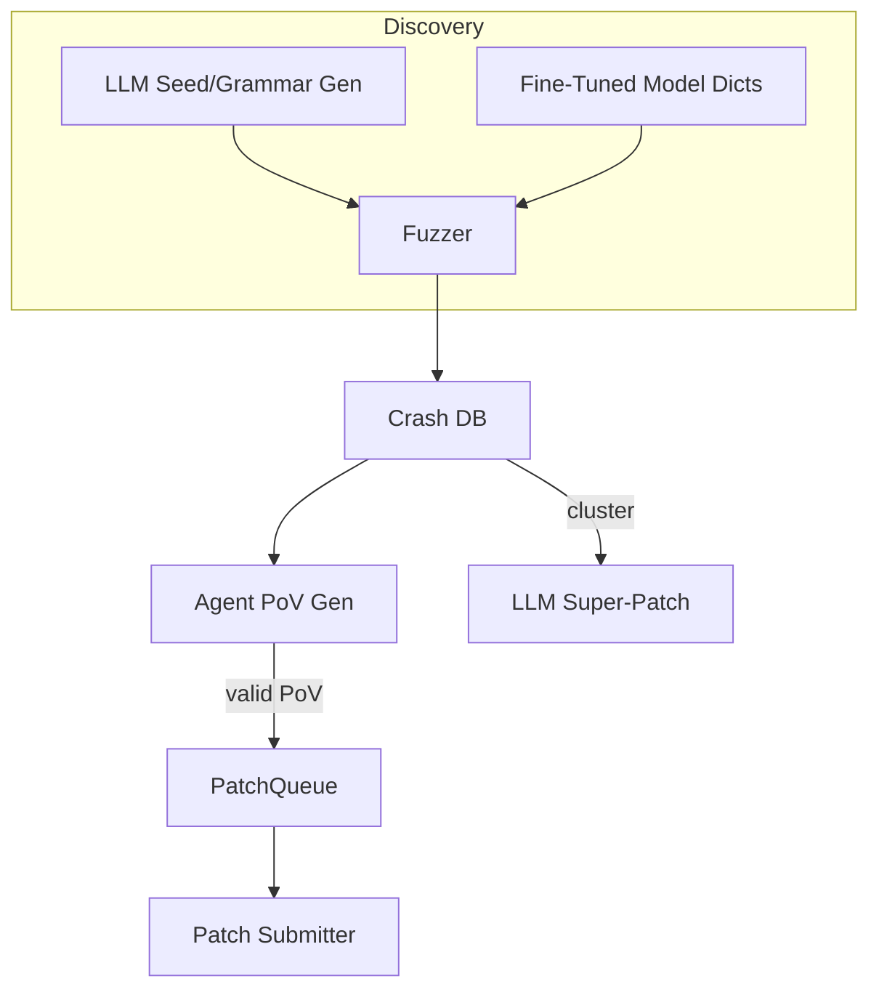

# Fuzzing uz pomoć AI-ja i automatizovano otkrivanje ranjivosti

{{#include ../banners/hacktricks-training.md}}

## Pregled
Large-language models (LLM-ovi) mogu značajno unaprediti tradicionalne pipeline-ove za istraživanje ranjivosti generisanjem semantički bogatih ulaza, evolucijom gramatika, analizom podataka o crash-evima, pa čak i predlaganjem patch-eva za više bug-ova.  Ova stranica prikuplja najefikasnije obrasce uočene tokom finala DARPA AI Cyber Challenge-a (AIxCC) i drugih javnih istraživanja.<sup>[[4]](#references)[[5]](#references)</sup>

Ovo nije opis jednog konkretnog takmičarskog sistema, već apstrakcija tehnika koje možete ponoviti u sopstvenim workflow-ovima.

---

## 1. Seed input-i generisani pomoću LLM-a

Tradicionalni coverage–guided fuzzers (AFL++, libFuzzer, Honggfuzz…) počinju sa malim corpus-om seed-ova i naslepo mutiraju byte-ove.  Kada je ciljni format input-a složen (SQL, URL-ovi, prilagođeni binarni protokoli), nasumične mutacije obično naruše sintaksu pre nego što se dosegne bilo koja interesantna grana.

LLM-ovi mogu rešiti ovaj bootstrap problem emitovanjem *seed generatora* – kratkih skripti koje generišu **sintaksno ispravne, ali bezbednosno relevantne input-e**.  Na primer:
```prompt
SYSTEM: You are a helpful security engineer.
USER:
Write a Python3 program that prints 200 unique SQL injection strings targeting common anti-pattern mistakes (missing quotes, numeric context, stacked queries).  Ensure length ≤ 256 bytes / string so they survive common length limits.
```

```python
# gen_sqli_seeds.py (truncated)
PAYLOADS = [
"1 OR 1=1 -- ",
"' UNION SELECT NULL,NULL--",
"0; DROP TABLE users;--",
...
]
for p in PAYLOADS:
print(p)
```
Pokreni jednom i prosledi izlaz direktno u početni korpus fuzzera:
```bash
python3 gen_sqli_seeds.py > seeds.txt
afl-fuzz -i seeds.txt -o findings/ -- ./target @@
```
Prednosti:
1. Semantička validnost → dublja pokrivenost u ranoj fazi.
2. Mogućnost ponovnog generisanja: prilagodite prompt da se fokusira na XSS, path traversal, binary blobs itd.
3. Jeftino (< 1 ¢ uz GPT-3.5).

### Saveti
* Uputite model da *diversify* dužinu i encoding payload-a (UTF-8, URL-encoded, UTF-16-LE) kako bi zaobišao površinske filtere.
* Zatražite *single self-contained script* – izbegava probleme sa JSON formatiranjem.

---

## 2. Grammar-Evolution Fuzzing

Moćnija varijanta je omogućiti LLM-u da **evoluira grammar** umesto konkretnih seed-ova. Workflow („Grammar Guy“ pattern) je:

1. Generišite početni ANTLR/Peach/LibFuzzer grammar pomoću prompt-a.
2. Fuzz-ujte N minuta i prikupite coverage metrics (hit edges / blocks).
3. Sumirajte nepokrivene delove programa i prosledite sažetak nazad modelu:
```prompt
Prethodni grammar je aktivirao 12 % programskih edges.  Funkcije koje nisu dostignute: parse_auth, handle_upload.  Dodaj / izmeni rules kako bi se ove funkcije pokrile.
```
4. Spojite nova rules, ponovo pokrenite fuzzing i ponavljajte.

Kostur pseudo-koda:
```python
for epoch in range(MAX_EPOCHS):
grammar = llm.refine(grammar, feedback=coverage_stats)
save(grammar, f"grammar_{epoch}.txt")
coverage_stats = run_fuzzer(grammar)
```
Ključne tačke:
* Održavajte *budget* – svako poboljšavanje koristi tokene.
* Koristite `diff` + `patch` instrukcije kako bi model menjao, a ne ponovo pisao sadržaj.
* Zaustavite se kada je Δcoverage < ε.

---

## 3. Agent-Based PoV (Exploit) Generation

Nakon pronalaska crash-a i dalje vam je potreban **proof-of-vulnerability (PoV)** koji ga deterministički izaziva.

Skalabilan pristup je pokretanje *hiljada* lightweight agenata (<process/thread/container/prisoner>), gde svaki koristi različit LLM (GPT-4, Claude, Mixtral) ili različito podešavanje temperature.

Pipeline:
1. Static/dynamic analysis proizvodi *bug candidates* (struct sa crash PC-jem, input slice-om i sanitizer porukom).
2. Orchestrator distribuira kandidate agentima.
3. Koraci agentovog rezonovanja:
a. Lokalno reprodukujte bug pomoću `gdb` + input-a.
b. Predložite minimalni exploit payload.
c. Validirajte exploit u sandbox-u.  Ako uspe → pošaljite.
4. Neuspešni pokušaji se **ponovo stavljaju u red kao novi seeds** za coverage fuzzing (feedback loop).

Prednosti:
* Parallelisation prikriva nepouzdanost pojedinačnog agenta.
* Auto-tuning temperature / veličine modela na osnovu uočene stope uspeha.

---

## 4. Directed Fuzzing with Fine-Tuned Code Models

Fine-tune-ujte open-weight model (npr. Llama-7B) na C/C++ izvornom kodu označenom vulnerability patterns (integer overflow, buffer copy, format string).  Zatim:

1. Pokrenite static analysis da biste dobili listu funkcija + AST.
2. Promptujte model: *“Give mutation dictionary entries that are likely to break memory safety in function X”*.
3. Ubacite te tokene u prilagođeni `AFL_CUSTOM_MUTATOR`.

Primer izlaza za `sprintf` wrapper:
```
{"pattern":"%99999999s"}
{"pattern":"AAAAAAAA....<1024>....%n"}
```
Empirijski, ovo skraćuje vreme do crash-a za više od 2× na stvarnim metama.

---

## 5. Strategije patching-a vođene AI-jem

### 5.1 Super Patches
Zatražite od modela da *grupiše* crash signatures i predloži **jedan patch** koji uklanja zajednički uzrok. Pošaljite jednom, ispravite nekoliko bugova → manje penala za netačnost u okruženjima gde svaki pogrešan patch oduzima poene.

Okvir prompta:
```
Here are 10 stack traces + file snippets.  Identify the shared mistake and generate a unified diff fixing all occurrences.
```
### 5.2 Speculative Patch Ratio
Implementirajte queue u kojoj se potvrđeni patch-evi validirani pomoću PoV-a i *speculative* patch-evi (bez PoV-a) naizmenično izvršavaju u odnosu 1:​N, podešenom prema pravilima bodovanja (npr. 2 speculative : 1 confirmed). Model troškova prati kazne u odnosu na poene i samostalno prilagođava N.

---

## 6. Deterministic File-by-File AI Code Review

Čest način na koji AI-assisted review ne uspeva jeste kada se od jednog agenta zatraži da pregleda čitav repository, uz očekivanje da će izabrati odgovarajuće fajlove i grep termine. Pouzdaniji obrazac je **prisilno pokrivanje repository-ja**:<sup>[[1]](#references)</sup>

1. Nabrojte source fajlove.
2. Pošaljite **jedan fajl istovremeno**, uz minimalan kontekst (entrypoint, imports, obližnje routes/callers).
3. Zahtevajte **structured report** za svaki fajl: sources, sink, nedostajuću validaciju, preconditions za exploit i nivo pouzdanosti.<sup>[[3]](#references)</sup>
4. Deduplicirajte izveštaje prema obrascu **source→sink** i ručno validirajte one sa visokim rizikom.

Ovo zahteva mnogo tokena i proizvodi šum, ali je veoma efikasno za otkrivanje **jednostavnih source/sink bugova sa velikim uticajem** koje širi agentic review često propušta.

### Triage obrasci kojima vredi dati prioritet

- **Dynamic PHP include/dispatch**: imena route/controller/module-a pod kontrolom napadača prosleđuju se u `require_once()`, `include()` ili `include_once()` bez striktne allowlist-e i canonicalisation putanje.
- **Shell execution u admin/account workflow-ima**: usernames, domains, FTP accounts ili drugi identifikatori dospevaju do `exec()`, `system()`, `shell_exec()`, `passthru()`, `proc_open()` ili `popen()`.
- **Structured input fan-in**: isti parameter se prihvata iz `$_GET`, `$_POST`, JSON-a, XML-a ili framework body parser-a, a kasnije ponovo koristi u filesystem ili OS-command sink-ovima.

### Dve praktične klase bugova koje ova metoda dobro pronalazi

- **PHP controller-dispatch LFI/RCE**: ako se controller name pod kontrolom request-a konkatenira u `require_once()` bez allowlist-e i normalizacije putanje, traversal sekvence kao što je `../` mogu navesti PHP da uključi nenamerni lokalni `.php` fajl. Ako napadač može da usmeri include na postavljeni ili na drugi način koristan PHP fajl, LFI postaje code execution. Pogledajte [File Inclusion / Path Traversal](../pentesting-web/file-inclusion/README.md).<sup>[[1]](#references)</sup>
- **Authenticated command injection u hosting/admin panelima**: ako se fields za upravljanje account-ima, kao što su usernames, ugrađuju u shell commands, authenticated user sa niskim privilegijama može da pretvori uobičajenu create/delete akciju u RCE. Uticaj se povećava kada panel izvršava command kao privilegovaniji service account. Pogledajte [Command Injection](../pentesting-web/command-injection.md).<sup>[[1]](#references)</sup>

### Praktične napomene za review

- Koristite LLM prvo kao **source/sink reviewer**, a ne kao generator exploit-a.
- Zatražite da eksplicitno navede **field pod kontrolom napadača**, **gap u normalizaciji/validaciji** i **opasan sink**.
- Kod velikih repository-ja, deterministic per-file review je često pouzdaniji od jednog autonomous agent run-a, čak i kada drugi koristi jači model.<sup>[[2]](#references)</sup>
- Očekujte slabije rezultate kod **Broken Access Control** i drugih business-logic bugova, gde exploitability zavisi od pretpostavki između fajlova, role semantics ili threat model-a specifičnog za proizvod.

---

## Putting It All Together
End-to-end CRS (Cyber Reasoning System) može povezati komponente na sledeći način:

```mermaid
graph TD
subgraph Discovery
A[LLM Seed/Grammar Gen] --> B[Fuzzer]
C[Fine-Tuned Model Dicts] --> B
end
B --> D[Crash DB]
D --> E[Agent PoV Gen]
E -->|valid PoV| PatchQueue
D -->|cluster| F[LLM Super-Patch]
PatchQueue --> G[Patch Submitter]
```
---

## Reference

- [1] [Project Black - Local AI for Cyber Security: Finding phpIPAM LFI and myVesta Authenticated RCE](https://projectblack.io/blog/local-ai-for-cyber-security)
- [2] [Strix](https://github.com/usestrix/strix)
- [3] [GitHub Copilot community security-review skill](https://github.com/github/awesome-copilot/blob/main/skills/security-review/SKILL.md)
- [4] [Trail of Bits – AIxCC finals: Tale of the tape](https://blog.trailofbits.com/2025/08/07/aixcc-finals-tale-of-the-tape/)
- [5] [CTF Radiooo AIxCC finalist interviews](https://www.youtube.com/@ctfradiooo)

{{#include ../banners/hacktricks-training.md}}
