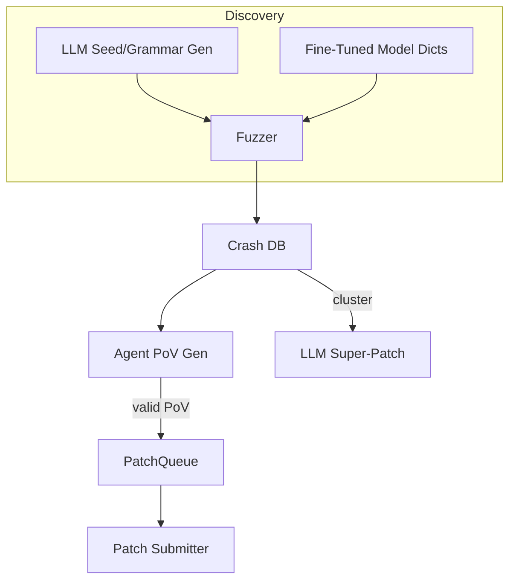

# KI-gestütztes Fuzzing & automatisierte Vulnerability Discovery

{{#include ../banners/hacktricks-training.md}}

## Überblick
Large Language Models (LLMs) können traditionelle Vulnerability-Research-Pipelines durch die Generierung semantisch reichhaltiger Inputs, die Weiterentwicklung von Grammatiken, die Analyse von Crash-Daten und sogar das Vorschlagen von Patches für mehrere Bugs erheblich verstärken. Diese Seite fasst die effektivsten Muster zusammen, die während der Finalrunden von DARPA’s AI Cyber Challenge (AIxCC) und anderer öffentlicher Forschungsarbeiten beobachtet wurden.<sup>[[4]](#references)</sup><sup>[[5]](#references)</sup>

Im Folgenden wird kein spezifisches Wettbewerbssystem beschrieben, sondern eine Abstraktion der Techniken, sodass du sie in deinen eigenen Workflows reproduzieren kannst.

---

## 1. Von LLMs generierte Seed-Inputs

Traditionelle coverage-guided Fuzzer (AFL++, libFuzzer, Honggfuzz …) starten mit einem kleinen Corpus aus Seeds und mutieren Bytes blind. Wenn das Zielformat komplex ist (SQL, URLs, benutzerdefinierte Binärprotokolle), zerstören zufällige Mutationen normalerweise die Syntax, bevor interessante Branches erreicht werden.

LLMs können dieses Bootstrap-Problem lösen, indem sie *Seed-Generatoren* ausgeben – kurze Skripte, die **syntaktisch korrekte, aber sicherheitsrelevante Inputs** erzeugen. Zum Beispiel:
```prompt
SYSTEM: You are a helpful security engineer.
USER:
Write a Python3 program that prints 200 unique SQL injection strings targeting common anti-pattern mistakes (missing quotes, numeric context, stacked queries).  Ensure length ≤ 256 bytes / string so they survive common length limits.
```

```python
# gen_sqli_seeds.py (truncated)
PAYLOADS = [
"1 OR 1=1 -- ",
"' UNION SELECT NULL,NULL--",
"0; DROP TABLE users;--",
...
]
for p in PAYLOADS:
print(p)
```
Einmal ausführen und die Ausgabe direkt in den initialen Corpus des Fuzzers einspeisen:
```bash
python3 gen_sqli_seeds.py > seeds.txt
afl-fuzz -i seeds.txt -o findings/ -- ./target @@
```
Benefits:
1. Semantische Gültigkeit → frühzeitig eine tiefere Abdeckung.
2. Erneut generierbar: Passe den Prompt an, um den Fokus auf XSS, path traversal, binäre Blobs usw. zu legen.
3. Günstig (< 1 ¢ mit GPT-3.5).

### Tipps
* Weise das Modell an, die Payload-Länge und -Kodierung (UTF-8, URL-encoded, UTF-16-LE) zu *diversifizieren*, um oberflächliche Filter zu umgehen.
* Bitte um ein *einzelnes eigenständiges Skript* – dadurch werden Probleme bei der JSON-Formatierung vermieden.

---

## 2. Grammar-Evolution Fuzzing

Eine leistungsfähigere Variante besteht darin, das LLM eine **Grammatik** anstelle konkreter Seeds **weiterentwickeln** zu lassen. Der Workflow (das „Grammar Guy“-Muster) sieht folgendermaßen aus:

1. Generiere per Prompt eine anfängliche ANTLR-/Peach-/LibFuzzer-Grammatik.
2. Führe N Minuten lang Fuzzing durch und sammle Coverage-Metriken (getroffene Edges / Blöcke).
3. Fasse die nicht abgedeckten Programmbereiche zusammen und gib die Zusammenfassung zurück an das Modell:
```prompt
The previous grammar triggered 12 % of the program edges.  Functions not reached: parse_auth, handle_upload.  Add / modify rules to cover these.
```
4. Führe die neuen Regeln zusammen, starte das Fuzzing erneut und wiederhole den Vorgang.

Pseudo-Code-Grundgerüst:
```python
for epoch in range(MAX_EPOCHS):
grammar = llm.refine(grammar, feedback=coverage_stats)
save(grammar, f"grammar_{epoch}.txt")
coverage_stats = run_fuzzer(grammar)
```
Wichtige Punkte:
* Ein *Budget* einhalten – jede Verfeinerung verbraucht Tokens.
* `diff`- und `patch`-Anweisungen verwenden, damit das Modell editiert statt neu zu schreiben.
* Stoppen, wenn Δcoverage < ε.

---

## 3. Agentenbasierte PoV- (Exploit-)Generierung

Nachdem ein Crash gefunden wurde, benötigt man weiterhin einen **Proof-of-Vulnerability (PoV)**, der ihn deterministisch auslöst.

Ein skalierbarer Ansatz besteht darin, viele leichtgewichtige Worker (Prozesse, Threads oder Container) zu starten, die jeweils ein anderes Modell oder eine andere Sampling-Konfiguration verwenden. Die AIxCC-Finalistenumfrage liefert konkrete Beispiele für diese Größenordnung: Ein Team verwendete **Tausende gleichzeitig ausgeführte Agents** zur AI-first-PoV-Generierung, während ein anderes **300–500 Fuzzing-Agents** orchestrierte und LLMs für übergeordnetes semantisches Reasoning reservierte.<sup>[[4]](#references)</sup>

Pipeline:
1. Statische/dynamische Analyse erzeugt *Bug-Kandidaten* (struct mit Crash-PC, Input-Slice und Sanitizer-Meldung).
2. Der Orchestrator verteilt die Kandidaten an Agents.
3. Reasoning-Schritte des Agents:
a. Bug lokal mit `gdb` + Input reproduzieren.
b. Minimalen Exploit-Payload vorschlagen.
c. Exploit in der Sandbox validieren. Wenn erfolgreich → einreichen.
4. Fehlgeschlagene Versuche werden als **neue Seeds** für Coverage-Fuzzing erneut in die Warteschlange eingereiht (Feedback-Schleife).

Vorteile:
* Parallelisierung verbirgt die Unzuverlässigkeit einzelner Agents.
* Automatische Anpassung von Temp./Modellgröße basierend auf der beobachteten Erfolgsrate.

---

## 4. Directed Fuzzing mit feinabgestimmten Code-Modellen

Ein Open-Weight-Modell (z. B. Llama-7B) mit C/C++-Quellcode feinabstimmen, der mit Vulnerability-Mustern (Integer Overflow, Buffer Copy, Format String) gekennzeichnet ist. Danach:

1. Statische Analyse ausführen, um eine Funktionsliste + AST zu erhalten.
2. Das Modell auffordern: *„Gib Mutation-Dictionary-Einträge an, die wahrscheinlich die Memory Safety in Funktion X verletzen“*.
3. Diese Tokens in einen benutzerdefinierten `AFL_CUSTOM_MUTATOR` einfügen.

Beispielausgabe für einen `sprintf`-Wrapper:
```
{"pattern":"%99999999s"}
{"pattern":"AAAAAAAA....<1024>....%n"}
```
Empirisch verkürzt dies die Zeit bis zum Crash bei realen Zielen um >2×.

---

## 5. Von AI geleitete Patching-Strategien

### 5.1 Super Patches
Bitte das Modell, Crash-Signaturen zu *clustern* und einen **einzigen Patch** vorzuschlagen, der die gemeinsame Grundursache beseitigt. Einmal einreichen, mehrere Bugs beheben → weniger Genauigkeitsabzüge in Umgebungen, in denen jeder falsche Patch Punkte kostet.

Prompt-Übersicht:
```
Here are 10 stack traces + file snippets.  Identify the shared mistake and generate a unified diff fixing all occurrences.
```
### 5.2 Verhältnis spekulativer Patches
Implementiere eine Queue, in der bestätigte, durch PoV validierte Patches und *spekulative* Patches (ohne PoV) in einem anhand der Scoring-Regeln abgestimmten Verhältnis von 1:​N gemischt werden (z. B. 2 spekulative : 1 bestätigter Patch). Ein Kostenmodell überwacht Strafen und Punkte und passt N selbstständig an.

---

## Deterministisches dateiweises AI Code Review

Ein häufiges Fehlermuster bei AI-gestützten Reviews besteht darin, einen Agenten aufzufordern, ein gesamtes Repository zu untersuchen, und darauf zu hoffen, dass er die richtigen Dateien und grep-Begriffe auswählt. Ein zuverlässigeres Muster besteht darin, eine **Abdeckung des gesamten Repositorys zu erzwingen**:<sup>[[1]](#references)</sup>

1. Quelldateien aufzählen.
2. **Eine Datei nach der anderen** zusammen mit minimalem Kontext senden (Entry Point, Imports, nahegelegene Routen/Caller).
3. Für jede Datei einen **strukturierten Bericht** verlangen: Quellen, Sink, fehlende Validierung, Exploit-Voraussetzungen und Konfidenz.<sup>[[3]](#references)</sup>
4. Berichte anhand des **Source→Sink-Musters** deduplizieren und die risikoreichen Fälle manuell validieren.

Das ist tokenintensiv und erzeugt viele Ergebnisse, aber es ist sehr effektiv beim Aufdecken **einfacher Source/Sink-Bugs mit hoher Auswirkung**, die bei breit angelegten agentischen Reviews häufig übersehen werden.

### Triage-Muster, die priorisiert werden sollten

- **Dynamisches PHP-Include/Dispatch**: Vom Angreifer kontrollierte Namen für Route/Controller/Modul, die ohne strikte Allowlist und Pfad-Kanonisierung in `require_once()`, `include()` oder `include_once()` gelangen.
- **Shell-Ausführung in Admin-/Account-Workflows**: Benutzernamen, Domains, FTP-Accounts oder andere Bezeichner, die `exec()`, `system()`, `shell_exec()`, `passthru()`, `proc_open()` oder `popen()` erreichen.
- **Fan-in strukturierter Eingaben**: Derselbe Parameter wird aus `$_GET`, `$_POST`, JSON, XML oder Framework-Body-Parsern akzeptiert und später in Datei- oder OS-Command-Sinks wiederverwendet.

### Zwei praktische Bug-Klassen, die diese Methode gut findet

- **PHP-Controller-Dispatch-LFI/RCE**: Wenn ein requestgesteuerter Controller-Name ohne Allowlist/Pfadnormalisierung an `require_once()` angehängt wird, können Traversal-Sequenzen wie `../` dazu führen, dass PHP eine unbeabsichtigte lokale `.php`-Datei einbindet. Wenn der Angreifer das Include auf eine platzierte oder anderweitig nützliche PHP-Datei richten kann, wird die LFI zu Code Execution. Siehe [File Inclusion / Path Traversal](../pentesting-web/file-inclusion/README.md).<sup>[[1]](#references)</sup>
- **Authentifizierte Command Injection in Hosting-/Admin-Panels**: Wenn Account-Management-Felder wie Benutzernamen in Shell-Befehle eingebettet werden, kann ein authentifizierter Benutzer mit niedrigen Berechtigungen eine normale Erstellungs-/Löschaktion in RCE umwandeln. Die Auswirkung nimmt zu, wenn das Panel den Befehl als privilegierteres Servicekonto ausführt. Siehe [Command Injection](../pentesting-web/command-injection.md).<sup>[[1]](#references)</sup>

### Praktische Review-Hinweise

- Verwende das LLM zunächst als **Source/Sink-Reviewer**, nicht als Exploit-Generator.
- Bitte es, das **vom Angreifer kontrollierte Feld**, die **Lücke bei Normalisierung/Validierung** und den **gefährlichen Sink** ausdrücklich aufzulisten.
- Bei großen Repositories ist ein deterministisches dateiweises Review oft zuverlässiger als ein einzelner autonomer Agentenlauf, selbst wenn dieser ein stärkeres Modell verwendet.<sup>[[2]](#references)</sup>
- Erwarte schwächere Ergebnisse bei **Broken Access Control** und anderen Business-Logic-Bugs, bei denen die Exploitability von Annahmen über mehrere Dateien, Rollenbedeutungen oder produktspezifische Threat Models abhängt.

---

## Alles zusammenführen
Ein End-to-End-CRS (Cyber Reasoning System) kann die Komponenten beispielsweise wie folgt verbinden:

```mermaid
graph TD
subgraph Discovery
A[LLM Seed/Grammar Gen] --> B[Fuzzer]
C[Fine-Tuned Model Dicts] --> B
end
B --> D[Crash DB]
D --> E[Agent PoV Gen]
E -->|valid PoV| PatchQueue
D -->|cluster| F[LLM Super-Patch]
PatchQueue --> G[Patch Submitter]
```
---

## References

- [1] [Project Black – Lokale AI für Cyber Security: Finden von phpIPAM LFI und authentifiziertem myVesta RCE](https://projectblack.io/blog/local-ai-for-cyber-security)
- [2] [Strix](https://github.com/usestrix/strix)
- [3] [GitHub Copilot Community-Skill zur Sicherheitsüberprüfung](https://github.com/github/awesome-copilot/blob/main/skills/security-review/SKILL.md)
- [4] [Trail of Bits – AIxCC-Finale: Die Fakten im Überblick](https://blog.trailofbits.com/2025/08/07/aixcc-finals-tale-of-the-tape/)
- [5] [Interviews mit AIxCC-Finalisten von CTF Radiooo](https://www.youtube.com/@ctfradiooo)
{{#include ../banners/hacktricks-training.md}}
