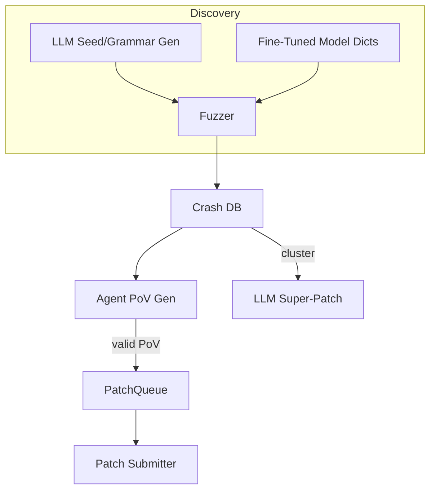

# AI-Assisted Fuzzing & Automated Vulnerability Discovery

{{#include ../banners/hacktricks-training.md}}

## 概要
Large-language models（LLM）は、意味的に豊かな入力の生成、grammarの進化、crash dataの推論、さらには複数のbugに対するpatchの提案まで行うことで、従来のvulnerability-research pipelineを大幅に強化できます。このページでは、DARPA’s AI Cyber Challenge（AIxCC）のfinalsやその他のpublic researchで確認された、最も効果的なパターンをまとめています。<sup>[[4]](#references)</sup><sup>[[5]](#references)</sup>

以下では、特定のcompetition systemを説明するのではなく、独自のworkflowで再現できるよう、これらのtechniqueを抽象化して説明します。

---

## 1. LLM-Generated Seed Inputs

従来のcoverage-guided fuzzer（AFL++、libFuzzer、Honggfuzz…）は、小さなseed corpusから開始し、byteを盲目的にmutateします。target input formatが複雑な場合（SQL、URL、custom binary protocol）、random mutationでは通常、興味深いbranchに到達する前にsyntaxが壊れてしまいます。

LLMは、*seed generator*――**syntax-correctでありながらsecurity-relevantなinput**を出力する短いscript――を生成することで、このbootstrap problemを解決できます。例えば、以下のようになります。
```prompt
SYSTEM: You are a helpful security engineer.
USER:
Write a Python3 program that prints 200 unique SQL injection strings targeting common anti-pattern mistakes (missing quotes, numeric context, stacked queries).  Ensure length ≤ 256 bytes / string so they survive common length limits.
```

```python
# gen_sqli_seeds.py (truncated)
PAYLOADS = [
"1 OR 1=1 -- ",
"' UNION SELECT NULL,NULL--",
"0; DROP TABLE users;--",
...
]
for p in PAYLOADS:
print(p)
```
一度実行して、出力をそのままfuzzerの初期コーパスに渡します：
```bash
python3 gen_sqli_seeds.py > seeds.txt
afl-fuzz -i seeds.txt -o findings/ -- ./target @@
```
Benefits:
1. Semantic validity → 初期段階からより深い coverage。
2. Re-generatable: prompt を調整して、XSS、path traversal、binary blobs などに focus できる。
3. Cheap（GPT-3.5 で < 1 ¢）。

### Tips
* 表面的な filter を bypass するため、payload の長さと encoding（UTF-8、URL-encoded、UTF-16-LE）を *diversify* するよう model に指示する。
* *single self-contained script* を要求する – JSON formatting の hiccup を回避できる。

---

## 2. Grammar-Evolution Fuzzing

より強力な variant は、具体的な seeds ではなく、LLM に **grammar を evolve** させる方法です。workflow（「Grammar Guy」pattern）は次のとおりです。

1. prompt 経由で初期 ANTLR/Peach/LibFuzzer grammar を生成する。
2. N 分間 fuzzing し、coverage metrics（hit した edges / blocks）を収集する。
3. 未到達の program areas を要約し、その summary を model に送り返す：
```prompt
The previous grammar triggered 12 % of the program edges.  Functions not reached: parse_auth, handle_upload.  Add / modify rules to cover these.
```
4. 新しい rules を merge し、再度 fuzzing を実行して繰り返す。

Pseudo-code skeleton:
```python
for epoch in range(MAX_EPOCHS):
grammar = llm.refine(grammar, feedback=coverage_stats)
save(grammar, f"grammar_{epoch}.txt")
coverage_stats = run_fuzzer(grammar)
```
要点:
* *budget* を維持する – 各 refinement で tokens を使用する。
* モデルが書き直すのではなく編集するよう、`diff` + `patch` instructions を使用する。
* Δcoverage < ε になったら停止する。

---

## 3. Local-LLM libFuzzer Harness Engineering

アナリストの workstation から持ち出せない source では、local code model によって、fuzzer bytes と C/C++ API の間をつなぐ小さな adapter の draft を作成できる。重要な security boundary は明確である。**model は test infrastructure を作成・修正し、coverage-guided mutation が inputs を探索し、sanitizer が invalid operations を報告し、人間が harness をレビューして findings を triage する**。<sup>[[9]](#references)</sup>

LLM に依存しない engine-level の corpus、feedback、snapshot、stateful-fuzzing techniques については、一般的な [Fuzzing Methodology](../generic-methodologies-and-resources/fuzzing.md) を参照。

target header からコピーした exact declaration を使って開始し、output format を制約する。狭い prompt により、架空の API を減らし、結果を容易にレビューできる:<sup>[[8]](#references)[[9]](#references)</sup>
```prompt
Write a libFuzzer target for this exact declaration:
int parse_records(const uint8_t *data, size_t size);

Output only C code. Implement LLVMFuzzerTestOneInput, include the
declaration, pass data and size unchanged, and do not use files,
network access, randomness, clocks, threads, or persistent state.
```
raw byte parser の期待される結果は、次のように複雑でないはずです：<sup>[[6]](#references)[[9]](#references)</sup>
```c
#include <stddef.h>
#include <stdint.h>

extern int parse_records(const uint8_t *, size_t);

int LLVMFuzzerTestOneInput(const uint8_t *data, size_t size) {
(void)parse_records(data, size);
return 0;
}
```
コンパイルは最初の検証ゲートにすぎません。CPU時間を費やす前に、生成されたすべての target が以下の不変条件を満たしているか確認してください。<sup>[[6]](#references)[[8]](#references)[[9]](#references)</sup>

- **正確な API:** 型、所有権ルール、初期化、終了処理、calling convention を、実際のヘッダーおよび既存の caller と比較する。
- **Harness の安全性:** `data` からのすべての読み取りをガードする。sanitizer の検出結果は、生成された glue ではなく target に起因する必要がある。
- **再現性:** 結果を `data` と `size` の関数にする。外部 I/O、時刻、制御されていない乱数、join されていないスレッド、呼び出し間で存続する状態を取り除く。
- **スループット:** 高コストな不変状態は、動作に影響しない場合に限り一度だけ初期化し、入力サイズを制限し、ログ出力を抑制し、入力ごとの allocation を解放する。
- **到達可能性:** 意図した関数と分岐が実行されることを確認する。コンパイルは通っても rejection path しか実行しない target は、見えにくい失敗である。

### 構造認識型 target: バグを隠さず不変条件を維持する

ほとんどの raw input が magic、length、version、checksum の gate で失敗する場合は、fuzz bytes を **型付きフィールドの材料** として使用し、有効な object を再構築します。format 定数は固定し、semantic fields と payload bytes は変更可能なままにし、再構築した payload から integrity metadata を導出します。`FuzzedDataProvider` は、上限付きの型付き値を消費する用途に便利ですが、生成される allocation と conversion の制限については adapter が引き続き責任を負います。<sup>[[9]](#references)</sup>

<details>
<summary>構造認識型 C++ target の例</summary>
```cpp
#include <fuzzer/FuzzedDataProvider.h>
#include <stddef.h>
#include <stdint.h>
#include <vector>

extern "C" int parse_message(const uint8_t *, size_t);

extern "C" int LLVMFuzzerTestOneInput(const uint8_t *data, size_t size) {
FuzzedDataProvider fdp(data, size);
uint8_t version = fdp.ConsumeIntegral<uint8_t>();
auto body = fdp.ConsumeRemainingBytes<uint8_t>();
if (body.size() > UINT16_MAX) body.resize(UINT16_MAX);
uint16_t len = static_cast<uint16_t>(body.size());
std::vector<uint8_t> msg = {0x8b, 'M', 'S', 'G', version,
static_cast<uint8_t>(len >> 8),
static_cast<uint8_t>(len)};
msg.insert(msg.end(), body.begin(), body.end());
(void)parse_message(msg.data(), msg.size());
return 0;
}
```
</details>

すべての質問に対して、1つの構造修復用ターゲットを使用しないでください。長さやチェックサムを導出して深い有効状態を探索するターゲットと、**宣言された**メタデータをfuzzerの制御下に置きつつ、ハーネス自体の読み取りと割り当てだけを上限設定する別のターゲットを用意します。後者のターゲットにより、自動修復では失われてしまう、長さの不一致や整合性不良に対する攻撃サーフェスを維持できます。<sup>[[9]](#references)</sup>

### シード、辞書、サニタイザ、カバレッジフィードバック

モデルには、バイナリを直接出力させるのではなく、バイナリシードを書き込むスクリプトを生成するよう指示します。空のオブジェクト、最小オブジェクト、典型的なオブジェクト、境界条件を満たす有効なオブジェクトをシードし、その後、マジック値、タグ、enumのエンコーディング、パーサーのキーワードを抽出して、レビュー済みの辞書にまとめます。libFuzzerは`-dict=`でその辞書を受け入れ、新しいカバレッジを明らかにするmutationをコーパスに保持します。<sup>[[6]](#references)[[9]](#references)</sup>
```text
magic="\x8bMSG"
version_min="\x00"
version_max="\xff"
config_tag="CONFIG"
```
補完的な instrumentation を適用して同じ target をビルドします。ASan と UBSan は同じ fuzzing binary を共有できますが、未 instrumented のコードによるレポートを避けるため、MSan のビルドは分け、依存関係にも instrumentation を適用します。<sup>[[6]](#references)[[9]](#references)</sup>
```bash
clang++ -g -O1 -fsanitize=fuzzer,address,undefined \
-fno-sanitize-recover=undefined target.cc harness.cc -o fuzz_target
./fuzz_target corpus -dict=msg.dict -max_len=65535

clang++ -g -O1 -fsanitize=fuzzer,memory \
target.cc harness.cc -o fuzz_target_msan
```
各モデルリビジョンの評価指標としてカバレッジを扱います。libFuzzer の出力で、初期段階から `cov`/`ft` が横ばいで、corpus が固定されている場合は、通常、フレーミングの不備、制約が厳しすぎる early return、または呼び出し先の誤りを示します。`exec/s` が低い場合は、高コストなセットアップ、I/O、allocation、または state の leak が原因である可能性があります。`NEW` はカバレッジ feature が変化したことを示すだけで、意図した parser に到達したことを証明するものではありません。<sup>[[6]](#references)[[9]](#references)</sup>

source-level feedback では、coverage build を作成して fuzz を実行し、未到達の functions と、それらを保護する conditions のみをモデルに提供します。生成された harness/seed/dictionary の diff を検証し、再度測定します。<sup>[[7]](#references)[[8]](#references)[[9]](#references)</sup>
```bash
clang++ -g -O1 -fsanitize=fuzzer \
-fprofile-instr-generate -fcoverage-mapping target.cc harness.cc -o fuzz_cov
mkdir -p profiles
LLVM_PROFILE_FILE='profiles/%p.profraw' ./fuzz_cov -max_total_time=300 corpus
llvm-profdata merge -sparse profiles/*.profraw -o fuzz.profdata
llvm-cov report ./fuzz_cov -instr-profile=fuzz.profdata
llvm-cov show ./fuzz_cov -instr-profile=fuzz.profdata \
--show-branches=count --region-coverage-lt=1 target.cc
```
したがって、scalable loop は **generate → compile/link → smoke-test under sanitizers → measure target coverage → provide the smallest relevant coverage/source context → revise → re-measure** となります。OSS-Fuzz-Gen は、生成された target を、もっともらしい code を額面どおりに受け入れるのではなく、compile 可能性、runtime failure、coverage、および既存 target に対する coverage improvement について評価することで、同じ原則を適用します。<sup>[[7]](#references)[[8]](#references)</sup>

---

## 4. Agent-Based PoV (Exploit) Generation

crash が見つかった後も、それを確実に trigger する **proof-of-vulnerability (PoV)** が必要です。

scalable なアプローチは、多数の軽量 worker（process、thread、または container）を起動し、それぞれで異なる model または sampling configuration を使用する方法です。AIxCC finalist survey には具体的な scale の例があり、ある team は AI-first PoV generation のために **数千の concurrent agent** を使用し、別の team は **300–500 の fuzzing agent** を orchestrate して、LLM をより高レベルの semantic reasoning に限定して使用しました。<sup>[[4]](#references)</sup>

Pipeline:
1. Static/ dynamic analysis により *bug candidate*（crash PC、input slice、sanitizer msg を含む struct）を生成する。
2. Orchestrator が candidate を agent に配布する。
3. Agent の reasoning steps:
a. `gdb` + input で bug を local に reproduce する。
b. 最小限の exploit payload を提案する。
c. sandbox 内で exploit を validate する。成功した場合 → submit。
4. 失敗した試行は、coverage fuzzing の **new seed** として再び **re-queue** される（feedback loop）。

Advantages:
* Parallelisation により、single-agent の unreliable さを隠蔽できる。
* 観測された success-rate に基づいて temp / model size を auto-tuning できる。

---

## 5. Directed Fuzzing with Fine-Tuned Code Models

vulnerability pattern（integer overflow、buffer copy、format string）のラベルが付いた C/C++ source で、open-weight model（例: Llama-7B）を fine-tune します。その後:

1. Static analysis を実行して function list + AST を取得する。
2. Model に prompt する: *“Give mutation dictionary entries that are likely to break memory safety in function X”*
3. それらの token を custom `AFL_CUSTOM_MUTATOR` に挿入する。

`sprintf` wrapper の output 例:
```
{"pattern":"%99999999s"}
{"pattern":"AAAAAAAA....<1024>....%n"}
```
実際のターゲットでは、これによりクラッシュまでの時間が経験的に2倍以上短縮されます。

---

## 6. AI-Guided Patching Strategies

### 6.1 Super Patches
モデルにクラッシュシグネチャを*cluster*し、共通する根本原因を取り除く**単一のパッチ**を提案するよう依頼します。1回のSubmitで複数のバグを修正できるため、誤ったパッチごとにポイントを失う環境では、accuracy penaltiesを減らせます。

Promptの概要:
```
Here are 10 stack traces + file snippets.  Identify the shared mistake and generate a unified diff fixing all occurrences.
```
### 6.2 Speculative Patch Ratio
確認済みの PoV-validated patch と *speculative* patch（PoV なし）を、scoring rules に合わせて調整した 1:N の比率（例：speculative 2 件 : confirmed 1 件）で交互に処理する queue を実装します。cost model がペナルティとポイントを監視し、N を自動調整します。

---

## 7. Deterministic File-by-File AI Code Review

AI-assisted review で頻繁に発生する失敗パターンは、1 つの agent に repository 全体を検査させ、適切なファイルや grep terms が選ばれることを期待することです。より信頼性の高いパターンは、**repository coverage を強制すること**です:<sup>[[1]](#references)</sup>

1. source files を列挙します。
2. **一度に 1 ファイル**と最小限の context（entrypoint、imports、近隣の routes/callers）を送信します。
3. 各ファイルについて、sources、sink、missing validation、exploit preconditions、confidence を含む **structured report** を要求します。<sup>[[3]](#references)</sup>
4. **source→sink pattern** によって report を重複排除し、risk の高いものを手動で検証します。

これは token を多く消費し、noise も多くなりますが、広範な agentic review では見落とされがちな **単純で影響の大きい source/sink bug** を発見するうえで非常に効果的です。

### 優先すべき Triage patterns

- **Dynamic PHP include/dispatch**: attacker-controlled な route/controller/module name が、厳格な allowlisting と path canonicalisation なしに `require_once()`、`include()`、または `include_once()` へ流れるケース。
- **admin/account workflow における Shell execution**: username、domain、FTP account、その他の identifier が `exec()`、`system()`、`shell_exec()`、`passthru()`、`proc_open()`、または `popen()` に到達するケース。
- **Structured input fan-in**: 同じ parameter が `$_GET`、`$_POST`、JSON、XML、または framework body parser から受け付けられ、その後 filesystem または OS-command sink で再利用されるケース。

### この method が効果的に発見する 2 つの実用的な bug class

- **PHP controller-dispatch LFI/RCE**: request-controlled な controller name が allowlist/path normalisation なしで `require_once()` に連結されている場合、`../` などの traversal sequence によって、PHP に意図しない local `.php` file を include させられます。攻撃者が include 先を配置済み、またはその他の有用な PHP file に指定できる場合、LFI は code execution になります。[File Inclusion / Path Traversal](../pentesting-web/file-inclusion/README.md) を参照してください。<sup>[[1]](#references)</sup>
- **hosting/admin panel における Authenticated command injection**: username などの account-management field が shell command に埋め込まれている場合、低権限の authenticated user が通常の create/delete action を RCE に変えられる可能性があります。panel がより高い権限を持つ service account として command を実行する場合、影響はさらに大きくなります。[Command Injection](../pentesting-web/command-injection.md) を参照してください。<sup>[[1]](#references)</sup>

### Practical review notes

- LLM は **exploit generator ではなく、まず source/sink reviewer** として使用します。
- **attacker-controlled field**、**normalization/validation gap**、**dangerous sink** を明示的に列挙するよう依頼します。
- 大規模な repo では、より強力な model を使用する単一の autonomous agent run であっても、deterministic な per-file review の方が信頼性の高い場合があります。<sup>[[2]](#references)</sup>
- **Broken Access Control** やその他の business-logic bug では、exploitability が file 間の assumptions、role semantics、または product-specific threat models に依存するため、結果が弱くなることを想定してください。

---

## Putting It All Together
end-to-end CRS (Cyber Reasoning System) は、次のように components を接続できます:

```mermaid
graph TD
subgraph Discovery
A[LLM Seed/Grammar Gen] --> B[Fuzzer]
C[Fine-Tuned Model Dicts] --> B
end
B --> D[Crash DB]
D --> E[Agent PoV Gen]
E -->|valid PoV| PatchQueue
D -->|cluster| F[LLM Super-Patch]
PatchQueue --> G[Patch Submitter]
```
---

## References

- [1] [Project Black - Cyber Security向けLocal AI：phpIPAM LFIとmyVesta認証済みRCEの発見](https://projectblack.io/blog/local-ai-for-cyber-security)
- [2] [Strix](https://github.com/usestrix/strix)
- [3] [GitHub Copilot communityのsecurity-review skill](https://github.com/github/awesome-copilot/blob/main/skills/security-review/SKILL.md)
- [4] [Trail of Bits – AIxCC finals：戦況の記録](https://blog.trailofbits.com/2025/08/07/aixcc-finals-tale-of-the-tape/)
- [5] [CTF Radiooo AIxCC finalist interviews](https://www.youtube.com/@ctfradiooo)
- [6] [LLVM — libFuzzer：coverage-guided fuzz testing用ライブラリ](https://llvm.org/docs/LibFuzzer.html)
- [7] [Google — OSS-Fuzz-Gen](https://github.com/google/oss-fuzz-gen)
- [8] [Google Online Security Blog — Fuzzingを強化：AIでより多くの脆弱性を発見](https://security.googleblog.com/2024/11/leveling-up-fuzzing-finding-more.html)
- [9] [8kSec — Local LLMを用いたAI-Assisted Fuzzing Harness Generation](https://8ksec.io/ai-assisted-fuzzing-harness-local-llm)
{{#include ../banners/hacktricks-training.md}}
