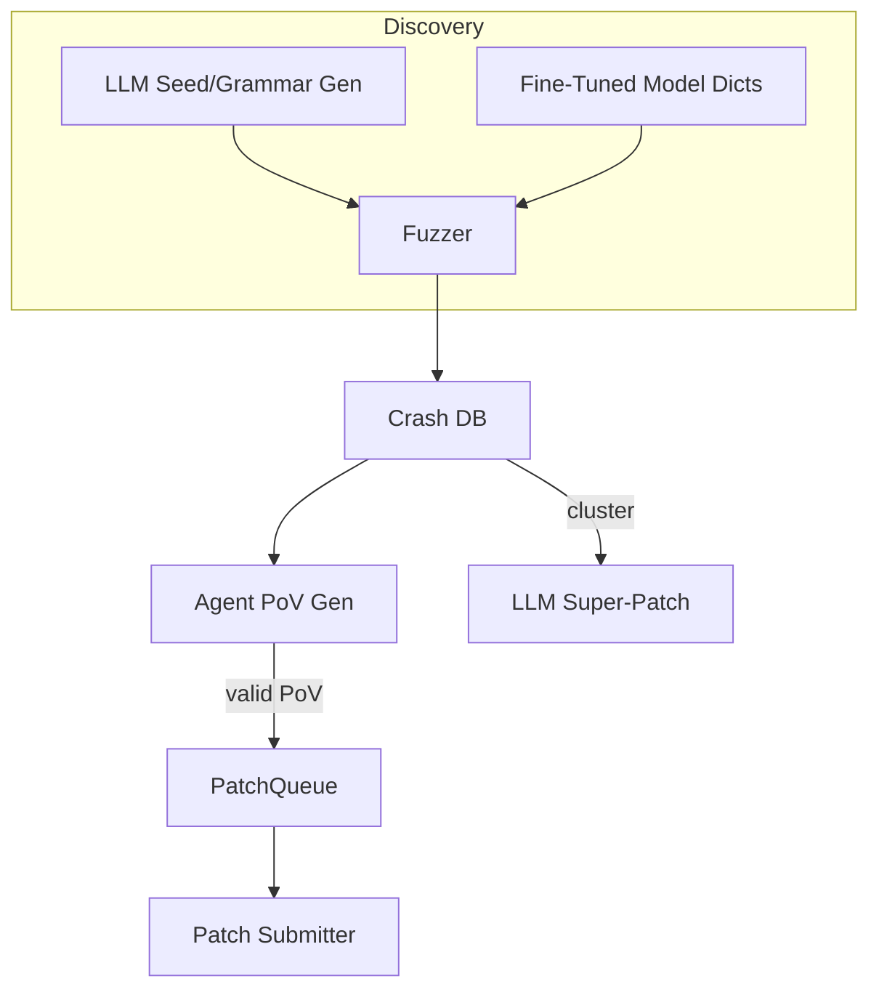

# AI-Assisted Fuzzing & Automated Vulnerability Discovery

{{#include ../banners/hacktricks-training.md}}

## Overview
Large-language models (LLMs) can super-charge traditional vulnerability-research pipelines by generating semantically rich inputs, evolving grammars, reasoning over crash data, and even proposing multi-bug patches.  This page collects the most effective patterns observed during DARPA’s AI Cyber Challenge (AIxCC) finals and other public research.<sup>[[4]](#references)</sup><sup>[[5]](#references)</sup>

What follows is not a description of one specific competition system, but an abstraction of the techniques so you can reproduce them in your own workflows.

---

## 1. LLM-Generated Seed Inputs

Traditional coverage–guided fuzzers (AFL++, libFuzzer, Honggfuzz…) start with a small corpus of seeds and mutate bytes blindly.  When the target input format is complex (SQL, URLs, custom binary protocols) random mutations usually break the syntax before interesting branches are reached.

LLMs can solve this bootstrap problem by emitting *seed generators* – short scripts that output **syntax-correct but security-relevant inputs**.  For example:

```prompt
SYSTEM: You are a helpful security engineer.
USER:
Write a Python3 program that prints 200 unique SQL injection strings targeting common anti-pattern mistakes (missing quotes, numeric context, stacked queries).  Ensure length ≤ 256 bytes / string so they survive common length limits.
```

```python
# gen_sqli_seeds.py (truncated)
PAYLOADS = [
    "1 OR 1=1 -- ",
    "' UNION SELECT NULL,NULL--",
    "0; DROP TABLE users;--",
    ...
]
for p in PAYLOADS:
    print(p)
```

Run once and feed the output directly into the fuzzer’s initial corpus:

```bash
python3 gen_sqli_seeds.py > seeds.txt
afl-fuzz -i seeds.txt -o findings/ -- ./target @@
```

Benefits:
1. Semantic validity → deeper coverage early.
2. Re-generatable: tweak the prompt to focus on XSS, path traversal, binary blobs, etc.
3. Cheap (< 1 ¢ with GPT-3.5).

### Tips
* Instruct the model to *diversify* payload length and encoding (UTF-8, URL-encoded, UTF-16-LE) to bypass superficial filters.
* Ask for a *single self-contained script* – avoids JSON formatting hiccups.

---

## 2. Grammar-Evolution Fuzzing

A more powerful variant is to let the LLM **evolve a grammar** instead of concrete seeds.  The workflow (“Grammar Guy” pattern) is:

1. Generate an initial ANTLR/Peach/LibFuzzer grammar via prompt.
2. Fuzz for N minutes and collect coverage metrics (edges / blocks hit).
3. Summarise uncovered program areas and feed the summary back into the model:
   ```prompt
   The previous grammar triggered 12 % of the program edges.  Functions not reached: parse_auth, handle_upload.  Add / modify rules to cover these.
   ```
4. Merge the new rules, re-fuzz, repeat.

Pseudo-code skeleton:

```python
for epoch in range(MAX_EPOCHS):
    grammar = llm.refine(grammar, feedback=coverage_stats)
    save(grammar, f"grammar_{epoch}.txt")
    coverage_stats = run_fuzzer(grammar)
```

Key points:
* Keep a *budget* – each refinement uses tokens.
* Use `diff` + `patch` instructions so the model edits rather than rewrites.
* Stop when Δcoverage < ε.

---

## 3. Local-LLM libFuzzer Harness Engineering

For source that cannot leave an analyst workstation, a local code model can draft the small adapter between fuzzer bytes and a C/C++ API. The useful security boundary is explicit: **the model writes and revises test infrastructure; coverage-guided mutation explores inputs; sanitizers report invalid operations; a human reviews the harness and triages findings**.<sup>[[9]](#references)</sup>

For engine-level corpus, feedback, snapshot, and stateful-fuzzing techniques that do not depend on an LLM, see the general [Fuzzing Methodology](../generic-methodologies-and-resources/fuzzing.md).

Start with the exact declaration copied from the target header and constrain the output format. A narrow prompt reduces invented APIs and makes the result easy to review:<sup>[[8]](#references)[[9]](#references)</sup>

```prompt
Write a libFuzzer target for this exact declaration:
int parse_records(const uint8_t *data, size_t size);

Output only C code. Implement LLVMFuzzerTestOneInput, include the
declaration, pass data and size unchanged, and do not use files,
network access, randomness, clocks, threads, or persistent state.
```

For a raw byte parser, the expected result should be no more complicated than:<sup>[[6]](#references)[[9]](#references)</sup>

```c
#include <stddef.h>
#include <stdint.h>

extern int parse_records(const uint8_t *, size_t);

int LLVMFuzzerTestOneInput(const uint8_t *data, size_t size) {
    (void)parse_records(data, size);
    return 0;
}
```

Compilation is only the first validation gate. Review every generated target against these invariants before spending CPU time on it:<sup>[[6]](#references)[[8]](#references)[[9]](#references)</sup>

- **Exact API:** compare types, ownership rules, initialization, teardown, and calling convention with the real header and existing callers.
- **Harness safety:** guard every read from `data`; sanitizer findings must originate in the target, not generated glue.
- **Repeatability:** make the result a function of `data` and `size`; remove external I/O, time, uncontrolled randomness, unjoined threads, and state that survives between calls.
- **Throughput:** initialize expensive immutable state once only when this cannot affect behavior, bound input size, suppress logging, and free per-input allocations.
- **Reachability:** verify that the intended functions and branches execute. A target that compiles but only exercises rejection paths is a silent failure.

### Structure-aware targets: preserve invariants without hiding bugs

If most raw inputs fail a magic, length, version, or checksum gate, use the fuzz bytes as **typed field material** and rebuild a valid object. Fix format constants, leave semantic fields and payload bytes mutable, and derive integrity metadata from the reconstructed payload. `FuzzedDataProvider` is useful for consuming bounded typed values, while the adapter remains responsible for limiting any generated allocation and conversion.<sup>[[9]](#references)</sup>

<details>
<summary>Example structure-aware C++ target</summary>

```cpp
#include <fuzzer/FuzzedDataProvider.h>
#include <stddef.h>
#include <stdint.h>
#include <vector>

extern "C" int parse_message(const uint8_t *, size_t);

extern "C" int LLVMFuzzerTestOneInput(const uint8_t *data, size_t size) {
    FuzzedDataProvider fdp(data, size);
    uint8_t version = fdp.ConsumeIntegral<uint8_t>();
    auto body = fdp.ConsumeRemainingBytes<uint8_t>();
    if (body.size() > UINT16_MAX) body.resize(UINT16_MAX);
    uint16_t len = static_cast<uint16_t>(body.size());
    std::vector<uint8_t> msg = {0x8b, 'M', 'S', 'G', version,
                                static_cast<uint8_t>(len >> 8),
                                static_cast<uint8_t>(len)};
    msg.insert(msg.end(), body.begin(), body.end());
    (void)parse_message(msg.data(), msg.size());
    return 0;
}
```

</details>

Do not use one structure-repairing target for every question. Maintain one target that derives lengths/checksums to explore deep valid states, and another that keeps the **declared** metadata fuzzer-controlled while bounding only the harness' own reads and allocations. The second target preserves mismatched-length and bad-integrity attack surfaces that automatic repair would otherwise erase.<sup>[[9]](#references)</sup>

### Seeds, dictionaries, sanitizers, and coverage feedback

Ask the model to generate a script that writes binary seeds rather than asking it to print binary directly. Seed empty, minimal, typical, and boundary-valid objects; then extract magic values, tags, enum encodings, and parser keywords into a reviewed dictionary. libFuzzer accepts that dictionary with `-dict=`, and keeps mutations that expose new coverage in the corpus.<sup>[[6]](#references)[[9]](#references)</sup>

```text
magic="\x8bMSG"
version_min="\x00"
version_max="\xff"
config_tag="CONFIG"
```

Build the same target with complementary instrumentation. ASan and UBSan can share a fuzzing binary; use a separate MSan build and instrument its dependencies to avoid reports caused by uninstrumented code.<sup>[[6]](#references)[[9]](#references)</sup>

```bash
clang++ -g -O1 -fsanitize=fuzzer,address,undefined \
  -fno-sanitize-recover=undefined target.cc harness.cc -o fuzz_target
./fuzz_target corpus -dict=msg.dict -max_len=65535

clang++ -g -O1 -fsanitize=fuzzer,memory \
  target.cc harness.cc -o fuzz_target_msan
```

Treat coverage as the evaluator for each model revision. In libFuzzer output, early-flat `cov`/`ft` and a static corpus usually mean bad framing, an overly restrictive early return, or the wrong call; low `exec/s` points to expensive setup, I/O, allocation, or leaked state. `NEW` only proves that a coverage feature changed, not that the intended parser was reached.<sup>[[6]](#references)[[9]](#references)</sup>

For source-level feedback, make a coverage build, fuzz it, and give the model only the uncovered functions plus their guarding conditions. Verify the resulting harness/seed/dictionary diff and measure again:<sup>[[7]](#references)[[8]](#references)[[9]](#references)</sup>

```bash
clang++ -g -O1 -fsanitize=fuzzer \
  -fprofile-instr-generate -fcoverage-mapping target.cc harness.cc -o fuzz_cov
mkdir -p profiles
LLVM_PROFILE_FILE='profiles/%p.profraw' ./fuzz_cov -max_total_time=300 corpus
llvm-profdata merge -sparse profiles/*.profraw -o fuzz.profdata
llvm-cov report ./fuzz_cov -instr-profile=fuzz.profdata
llvm-cov show ./fuzz_cov -instr-profile=fuzz.profdata \
  --show-branches=count --region-coverage-lt=1 target.cc
```

The scalable loop is therefore **generate → compile/link → smoke-test under sanitizers → measure target coverage → provide the smallest relevant coverage/source context → revise → re-measure**. OSS-Fuzz-Gen applies the same principle by evaluating generated targets for compilability, runtime failures, coverage, and coverage improvement over existing targets instead of accepting plausible code at face value.<sup>[[7]](#references)[[8]](#references)</sup>

---

## 4. Agent-Based PoV (Exploit) Generation

After a crash is found you still need a **proof-of-vulnerability (PoV)** that deterministically triggers it.

A scalable approach is to spawn many lightweight workers (processes, threads, or containers), each using a different model or sampling configuration. The AIxCC finalist survey gives concrete scale examples: one team used **thousands of concurrent agents** for AI-first PoV generation, while another orchestrated **300–500 fuzzing agents** and reserved LLMs for higher-level semantic reasoning.<sup>[[4]](#references)</sup>

Pipeline:
1. Static/ dynamic analysis produces *bug candidates* (struct with crash PC, input slice, sanitizer msg).
2. Orchestrator distributes candidates to agents.
3. Agent reasoning steps:
   a. Reproduce bug locally with `gdb` + input.
   b. Suggest minimal exploit payload.
   c. Validate exploit in sandbox.  If success → submit.
4. Failed attempts are **re-queued as new seeds** for coverage fuzzing (feedback loop).

Advantages:
* Parallelisation hides single-agent unreliability.
* Auto-tuning of temp / model size based on observed success-rate.

---

## 5. Directed Fuzzing with Fine-Tuned Code Models

Fine-tune an open-weight model (e.g. Llama-7B) on C/C++ source labelled with vulnerability patterns (integer overflow, buffer copy, format string).  Then:

1. Run static analysis to get function list + AST.
2. Prompt model: *“Give mutation dictionary entries that are likely to break memory safety in function X”*.
3. Insert those tokens into a custom `AFL_CUSTOM_MUTATOR`.

Example output for a `sprintf` wrapper:
```
{"pattern":"%99999999s"}
{"pattern":"AAAAAAAA....<1024>....%n"}
```

Empirically this shrinks time-to-crash by >2× on real targets.

---

## 6. AI-Guided Patching Strategies

### 6.1 Super Patches
Ask the model to *cluster* crash signatures and propose a **single patch** that removes the common root cause.  Submit once, fix several bugs → fewer accuracy penalties in environments where each wrong patch costs points.

Prompt outline:
```
Here are 10 stack traces + file snippets.  Identify the shared mistake and generate a unified diff fixing all occurrences.
```

### 6.2 Speculative Patch Ratio
Implement a queue where confirmed PoV-validated patches and *speculative* patches (no PoV) are interleaved at a 1:​N ratio tuned to scoring rules (e.g. 2 speculative : 1 confirmed).  A cost model monitors penalties vs. points and self-adjusts N.

---

## 7. Deterministic File-by-File AI Code Review

A frequent failure mode in AI-assisted review is asking one agent to inspect a whole repository and hoping it chooses the right files and grep terms. A more reliable pattern is to **force repository coverage**:<sup>[[1]](#references)</sup>

1. Enumerate source files.
2. Send **one file at a time** plus minimal context (entrypoint, imports, nearby routes/callers).
3. Require a **structured report** for each file: sources, sink, missing validation, exploit preconditions, and confidence.<sup>[[3]](#references)</sup>
4. Deduplicate reports by **source→sink pattern** and manually validate the high-risk ones.

This is token-heavy and noisy, but it is very effective at surfacing **simple high-impact source/sink bugs** that broad agentic reviews often miss.

### Triage patterns worth prioritising

- **Dynamic PHP include/dispatch**: attacker-controlled route/controller/module names flowing into `require_once()`, `include()`, or `include_once()` without strict allowlisting and path canonicalisation.
- **Shell execution in admin/account workflows**: usernames, domains, FTP accounts, or other identifiers reaching `exec()`, `system()`, `shell_exec()`, `passthru()`, `proc_open()`, or `popen()`.
- **Structured input fan-in**: the same parameter accepted from `$_GET`, `$_POST`, JSON, XML, or framework body parsers and later reused in filesystem or OS-command sinks.

### Two practical bug classes this method finds well

- **PHP controller-dispatch LFI/RCE**: if a request-controlled controller name is concatenated into `require_once()` with no allowlist/path normalisation, traversal sequences such as `../` can make PHP include an unintended local `.php` file. If the attacker can point the include at a planted or otherwise useful PHP file, the LFI becomes code execution. See [File Inclusion / Path Traversal](../pentesting-web/file-inclusion/README.md).<sup>[[1]](#references)</sup>
- **Authenticated command injection in hosting/admin panels**: if account-management fields such as usernames are embedded into shell commands, a low-privileged authenticated user may turn a normal create/delete action into RCE. The impact increases when the panel executes the command as a more privileged service account. See [Command Injection](../pentesting-web/command-injection.md).<sup>[[1]](#references)</sup>

### Practical review notes

- Use the LLM as a **source/sink reviewer first**, not as an exploit generator.
- Ask it to explicitly list the **attacker-controlled field**, the **normalization/validation gap**, and the **dangerous sink**.
- For large repos, deterministic per-file review is often more reliable than a single autonomous agent run, even when the latter uses a stronger model.<sup>[[2]](#references)</sup>
- Expect weaker results on **Broken Access Control** and other business-logic bugs where exploitability depends on cross-file assumptions, role semantics, or product-specific threat models.

---

## Putting It All Together
An end-to-end CRS (Cyber Reasoning System) may wire the components like this:


```mermaid
graph TD
    subgraph Discovery
        A[LLM Seed/Grammar Gen] --> B[Fuzzer]
        C[Fine-Tuned Model Dicts] --> B
    end
    B --> D[Crash DB]
    D --> E[Agent PoV Gen]
    E -->|valid PoV| PatchQueue
    D -->|cluster| F[LLM Super-Patch]
    PatchQueue --> G[Patch Submitter]
```

---

## References

- [1] [Project Black - Local AI for Cyber Security: Finding phpIPAM LFI and myVesta Authenticated RCE](https://projectblack.io/blog/local-ai-for-cyber-security)
- [2] [Strix](https://github.com/usestrix/strix)
- [3] [GitHub Copilot community security-review skill](https://github.com/github/awesome-copilot/blob/main/skills/security-review/SKILL.md)
- [4] [Trail of Bits – AIxCC finals: Tale of the tape](https://blog.trailofbits.com/2025/08/07/aixcc-finals-tale-of-the-tape/)
- [5] [CTF Radiooo AIxCC finalist interviews](https://www.youtube.com/@ctfradiooo)
- [6] [LLVM — libFuzzer: a library for coverage-guided fuzz testing](https://llvm.org/docs/LibFuzzer.html)
- [7] [Google — OSS-Fuzz-Gen](https://github.com/google/oss-fuzz-gen)
- [8] [Google Online Security Blog — Leveling Up Fuzzing: Finding More Vulnerabilities with AI](https://security.googleblog.com/2024/11/leveling-up-fuzzing-finding-more.html)
- [9] [8kSec — AI-Assisted Fuzzing Harness Generation with a Local LLM](https://8ksec.io/ai-assisted-fuzzing-harness-local-llm)

{{#include ../banners/hacktricks-training.md}}
