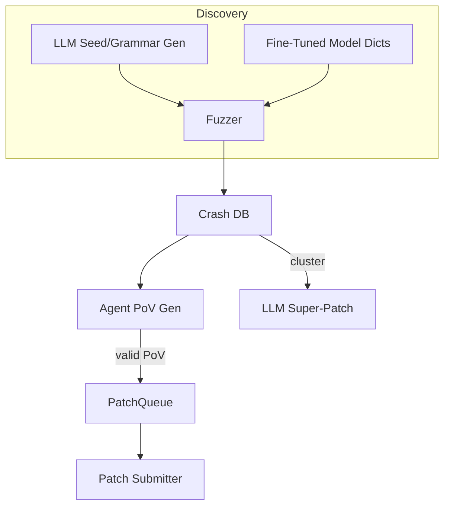

# AI-Assisted Fuzzing & Automated Vulnerability Discovery

{{#include ../banners/hacktricks-training.md}}

## 概要
Large-language models（LLM）は、意味的に豊かな入力の生成、grammarの進化、crashデータの推論、さらには複数のバグに対するpatchの提案まで行うことで、従来のvulnerability research pipelineを大幅に強化できます。このページでは、DARPAのAI Cyber Challenge（AIxCC）finalsやその他の公開研究で確認された、最も効果的なパターンをまとめています。<sup>[[4]](#references)[[5]](#references)</sup>

以下では、特定のcompetition systemを説明するのではなく、独自のworkflowで再現できるよう、techniqueを抽象化して説明します。

---

## 1. LLM-Generated Seed Inputs

従来のcoverage-guided fuzzer（AFL++、libFuzzer、Honggfuzz…）は、小規模なseed corpusから開始し、byteを無作為にmutationします。targetのinput formatが複雑な場合（SQL、URL、custom binary protocol）、random mutationでは通常、興味深いbranchに到達する前にsyntaxが壊れてしまいます。

LLMは、*seed generator*（**syntax-correctだがsecurity-relevantなinput**を出力する短いscript）を生成することで、このbootstrap問題を解決できます。例えば、次のようになります。
```prompt
SYSTEM: You are a helpful security engineer.
USER:
Write a Python3 program that prints 200 unique SQL injection strings targeting common anti-pattern mistakes (missing quotes, numeric context, stacked queries).  Ensure length ≤ 256 bytes / string so they survive common length limits.
```

```python
# gen_sqli_seeds.py (truncated)
PAYLOADS = [
"1 OR 1=1 -- ",
"' UNION SELECT NULL,NULL--",
"0; DROP TABLE users;--",
...
]
for p in PAYLOADS:
print(p)
```
一度実行し、出力を直接 fuzzer の初期 corpus に渡す：
```bash
python3 gen_sqli_seeds.py > seeds.txt
afl-fuzz -i seeds.txt -o findings/ -- ./target @@
```
Benefits:
1. Semantic validity → 早期により深い coverage。
2. Re-generatable: プロンプトを調整して、XSS、path traversal、binary blobs などに焦点を合わせられる。
3. Cheap（GPT-3.5 で < 1 ¢）。

### Tips
* 表面的なフィルターを bypass するため、payload の長さと encoding（UTF-8、URL-encoded、UTF-16-LE）を *diversify* するようモデルに指示する。
* *single self-contained script* を要求する - JSON formatting の問題を回避できる。

---

## 2. Grammar-Evolution Fuzzing

より強力な variant では、具体的な seeds の代わりに、LLM に **grammar を evolve** させる。workflow（“Grammar Guy” pattern）は次のとおり。

1. prompt で初期 ANTLR/Peach/LibFuzzer grammar を生成する。
2. N 分間 fuzz し、coverage metrics（hit した edges / blocks）を収集する。
3. 未到達の program areas を要約し、その summary をモデルに戻す:
```prompt
The previous grammar triggered 12 % of the program edges.  Functions not reached: parse_auth, handle_upload.  Add / modify rules to cover these.
```
4. 新しい rules を merge し、再度 fuzz して繰り返す。

Pseudo-code skeleton:
```python
for epoch in range(MAX_EPOCHS):
grammar = llm.refine(grammar, feedback=coverage_stats)
save(grammar, f"grammar_{epoch}.txt")
coverage_stats = run_fuzzer(grammar)
```
主なポイント:
* *budget* を維持する – 各 refinement で tokens を消費する。
* モデルが書き直すのではなく編集するよう、`diff` + `patch` instructions を使用する。
* Δcoverage < ε になったら停止する。

---

## 3. Agent-Based PoV (Exploit) Generation

crash が見つかった後も、それを決定論的に trigger する **proof-of-vulnerability (PoV)** が必要です。

scalable なアプローチは、*thousands* の軽量な agents (<process/thread/container/prisoner>) を spawn し、それぞれで異なる LLM (GPT-4、Claude、Mixtral) または temperature setting を実行することです。

Pipeline:
1. Static/ dynamic analysis により *bug candidates* (crash PC、input slice、sanitizer msg を含む struct) を生成する。
2. Orchestrator が candidates を agents に分配する。
3. Agent の reasoning steps:
a. `gdb` + input を使って bug をローカルで再現する。
b. 最小限の exploit payload を提案する。
c. sandbox で exploit を validate する。成功した場合 → submit。
4. 失敗した attempts は、coverage fuzzing 用の **new seeds** として再度 queue に入れられる (feedback loop)。

Advantages:
* Parallelisation により、single-agent の unreliability が隠蔽される。
* 観測された success-rate に基づき、temp / model size を auto-tuning できる。

---

## 4. Directed Fuzzing with Fine-Tuned Code Models

open-weight model (例: Llama-7B) を、vulnerability patterns (integer overflow、buffer copy、format string) が label 付けされた C/C++ source で fine-tune します。その後:

1. Static analysis を実行して function list + AST を取得する。
2. Model に prompt する: *“Give mutation dictionary entries that are likely to break memory safety in function X”*
3. それらの tokens を custom `AFL_CUSTOM_MUTATOR` に挿入する。

`sprintf` wrapper の output 例:
```
{"pattern":"%99999999s"}
{"pattern":"AAAAAAAA....<1024>....%n"}
```
実証的に、実際のターゲットでは time-to-crash を 2 倍以上短縮できます。

---

## 5. AI-Guided Patching Strategies

### 5.1 Super Patches
モデルにクラッシュシグネチャを *cluster* し、共通する根本原因を取り除く **single patch** を提案するよう依頼します。1 回の Submit で複数のバグを修正できるため、誤った patch ごとにポイントを失う環境では accuracy penalties を減らせます。

Prompt outline:
```
Here are 10 stack traces + file snippets.  Identify the shared mistake and generate a unified diff fixing all occurrences.
```
### 5.2 Speculative Patch Ratio
confirmed な PoV-validated patch と *speculative* patch（PoV なし）を、scoring rules に合わせて 1:​N の比率（例: speculative 2 件 : confirmed 1 件）で交互に処理する queue を実装します。cost model は penalties と points を監視し、N を自動調整します。

---

## 6. Deterministic File-by-File AI Code Review

AI-assisted review で頻発する失敗モードは、1 つの agent に repository 全体を調査させ、適切なファイルや grep terms を選択することを期待することです。より信頼性の高いパターンは、**repository coverage を強制すること**です:<sup>[[1]](#references)</sup>

1. source files を列挙します。
2. **1 回につき 1 ファイル**と、最小限の context（entrypoint、imports、周辺の routes/callers）を送信します。
3. 各ファイルについて、sources、sink、missing validation、exploit preconditions、confidence を含む**structured report**を要求します。<sup>[[3]](#references)</sup>
4. **source→sink pattern** によって reports を deduplicate し、high-risk なものを手動で validate します。

これは token を大量に消費し、ノイズも多くなりますが、広範な agentic review では見落とされがちな**単純で影響の大きい source/sink bug**を発見するのに非常に有効です。

### Triage patterns worth prioritising

- **Dynamic PHP include/dispatch**: attacker-controlled な route/controller/module 名が、strict allowlisting と path canonicalisation なしに `require_once()`、`include()`、または `include_once()` へ流れ込むケース。
- **Shell execution in admin/account workflows**: usernames、domains、FTP accounts、その他の identifiers が `exec()`、`system()`、`shell_exec()`、`passthru()`、`proc_open()`、または `popen()` に到達するケース。
- **Structured input fan-in**: 同じ parameter が `$_GET`、`$_POST`、JSON、XML、または framework body parsers から受け入れられ、その後 filesystem または OS-command sinks で再利用されるケース。

### Two practical bug classes this method finds well

- **PHP controller-dispatch LFI/RCE**: request-controlled な controller 名が allowlist/path normalisation なしに `require_once()` へ連結されている場合、`../` などの traversal sequences によって、PHP に意図しないローカル `.php` file を include させることができます。攻撃者が include の対象を planted、またはその他の有用な PHP file に指定できる場合、LFI は code execution へ発展します。[File Inclusion / Path Traversal](../pentesting-web/file-inclusion/README.md) を参照してください。<sup>[[1]](#references)</sup>
- **Authenticated command injection in hosting/admin panels**: usernames などの account-management fields が shell commands に埋め込まれている場合、low-privileged な authenticated user が通常の create/delete action を RCE に変える可能性があります。panel がより privileged な service account として command を実行する場合、影響はさらに大きくなります。[Command Injection](../pentesting-web/command-injection.md) を参照してください。<sup>[[1]](#references)</sup>

### Practical review notes

- LLM は **exploit generator ではなく、まず source/sink reviewer** として使用します。
- **attacker-controlled field**、**normalization/validation gap**、**dangerous sink**を明示的に列挙するよう依頼します。
- 大規模な repos では、より強力な model を使用する単一の autonomous agent run よりも、deterministic な per-file review の方が信頼性の高い場合が多くあります。<sup>[[2]](#references)</sup>
- **Broken Access Control** やその他の business-logic bugs では、exploitability が cross-file assumptions、role semantics、または product-specific threat models に依存するため、結果が弱くなることを想定してください。

---

## Putting It All Together
end-to-end CRS (Cyber Reasoning System) は、次のように components を接続できます:

```mermaid
graph TD
subgraph Discovery
A[LLM Seed/Grammar Gen] --> B[Fuzzer]
C[Fine-Tuned Model Dicts] --> B
end
B --> D[Crash DB]
D --> E[Agent PoV Gen]
E -->|valid PoV| PatchQueue
D -->|cluster| F[LLM Super-Patch]
PatchQueue --> G[Patch Submitter]
```
---

## 参考資料

- [1] [Project Black - Cyber Security向けLocal AI：phpIPAM LFIとmyVesta Authenticated RCEの発見](https://projectblack.io/blog/local-ai-for-cyber-security)
- [2] [Strix](https://github.com/usestrix/strix)
- [3] [GitHub Copilot community security-review skill](https://github.com/github/awesome-copilot/blob/main/skills/security-review/SKILL.md)
- [4] [Trail of Bits – AIxCC finals：戦いの記録](https://blog.trailofbits.com/2025/08/07/aixcc-finals-tale-of-the-tape/)
- [5] [CTF Radiooo AIxCC finalist interviews](https://www.youtube.com/@ctfradiooo)

{{#include ../banners/hacktricks-training.md}}
