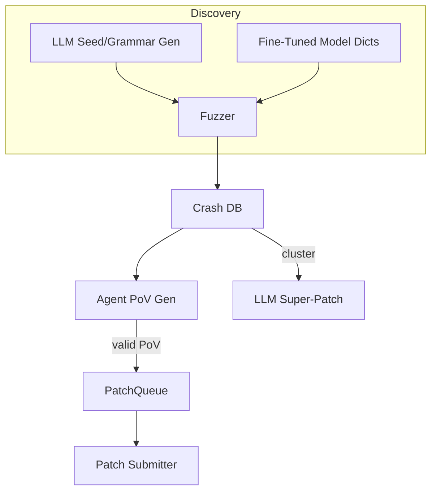

# KI-gestütztes Fuzzing & automatisierte Schwachstellenfindung

{{#include ../banners/hacktricks-training.md}}

## Überblick
Large-Language-Models (LLMs) können traditionelle Vulnerability-Research-Pipelines durch die Generierung semantisch reichhaltiger Inputs, die Weiterentwicklung von Grammatiken, die Analyse von Crash-Daten und sogar das Vorschlagen von Patches für mehrere Bugs erheblich verbessern. Diese Seite fasst die effektivsten Muster zusammen, die während des Finales von DARPA’s AI Cyber Challenge (AIxCC) und anderer öffentlicher Forschungsarbeiten beobachtet wurden.<sup>[[4]](#references)[[5]](#references)</sup>

Im Folgenden wird kein spezifisches Competition-System beschrieben, sondern eine Abstraktion der Techniken, damit du sie in deinen eigenen Workflows reproduzieren kannst.

---

## 1. Von LLMs generierte Seed-Inputs

Traditionelle coverage-guided Fuzzer (AFL++, libFuzzer, Honggfuzz…) beginnen mit einem kleinen Seed-Corpus und mutieren Bytes blind. Wenn das Input-Format des Targets komplex ist (SQL, URLs, benutzerdefinierte Binärprotokolle), zerstören zufällige Mutationen normalerweise die Syntax, bevor interessante Branches erreicht werden.

LLMs können dieses Bootstrapping-Problem lösen, indem sie *Seed-Generatoren* ausgeben – kurze Scripts, die **syntaxkorrekte, aber sicherheitsrelevante Inputs** erzeugen. Zum Beispiel:
```prompt
SYSTEM: You are a helpful security engineer.
USER:
Write a Python3 program that prints 200 unique SQL injection strings targeting common anti-pattern mistakes (missing quotes, numeric context, stacked queries).  Ensure length ≤ 256 bytes / string so they survive common length limits.
```

```python
# gen_sqli_seeds.py (truncated)
PAYLOADS = [
"1 OR 1=1 -- ",
"' UNION SELECT NULL,NULL--",
"0; DROP TABLE users;--",
...
]
for p in PAYLOADS:
print(p)
```
Einmal ausführen und die Ausgabe direkt in den initialen Corpus des Fuzzers einspeisen:
```bash
python3 gen_sqli_seeds.py > seeds.txt
afl-fuzz -i seeds.txt -o findings/ -- ./target @@
```
Vorteile:
1. Semantische Gültigkeit → frühzeitig tiefere Abdeckung.
2. Erneut generierbar: Passe den Prompt an, um sich auf XSS, path traversal, binäre Blobs usw. zu konzentrieren.
3. Günstig (< 1 ¢ mit GPT-3.5).

### Tipps
* Weise das Modell an, die Payload-Länge und -Kodierung (UTF-8, URL-encoded, UTF-16-LE) zu *diversifizieren*, um oberflächliche Filter zu umgehen.
* Bitte um ein *einzelnes eigenständiges Script* – dadurch werden Probleme bei der JSON-Formatierung vermieden.

---

## 2. Grammar-Evolution Fuzzing

Eine leistungsfähigere Variante besteht darin, das LLM eine **Grammar entwickeln** zu lassen, anstatt konkrete Seeds zu verwenden. Der Workflow (Muster „Grammar Guy“) sieht folgendermaßen aus:

1. Generiere per Prompt eine anfängliche ANTLR/Peach/LibFuzzer-Grammar.
2. Führe für N Minuten Fuzzing aus und sammle Coverage-Metriken (getroffene Edges / Blöcke).
3. Fasse nicht abgedeckte Programmbereiche zusammen und übergib die Zusammenfassung erneut an das Modell:
```prompt
The previous grammar triggered 12 % of the program edges.  Functions not reached: parse_auth, handle_upload.  Add / modify rules to cover these.
```
4. Führe die neuen Regeln zusammen, starte das Fuzzing erneut und wiederhole den Vorgang.

Pseudo-Code-Grundgerüst:
```python
for epoch in range(MAX_EPOCHS):
grammar = llm.refine(grammar, feedback=coverage_stats)
save(grammar, f"grammar_{epoch}.txt")
coverage_stats = run_fuzzer(grammar)
```
Wichtige Punkte:
* Halte ein *Budget* ein – jede Verfeinerung verbraucht Tokens.
* Verwende Anweisungen mit `diff` + `patch`, damit das Modell Änderungen vornimmt, statt alles neu zu schreiben.
* Stoppe, wenn Δcoverage < ε.

---

## 3. Agentenbasierte PoV-(Exploit-)Generierung

Nachdem ein Crash gefunden wurde, benötigst du weiterhin einen **proof-of-vulnerability (PoV)**, der ihn deterministisch auslöst.

Ein skalierbarer Ansatz besteht darin, *Tausende* leichtgewichtige Agenten (<process/thread/container/prisoner>) zu starten, von denen jeder ein anderes LLM (GPT-4, Claude, Mixtral) oder eine andere Temperatureinstellung verwendet.

Pipeline:
1. Statische/dynamische Analyse erzeugt *Bug-Kandidaten* (struct mit Crash-PC, Input-Slice und Sanitizer-Meldung).
2. Der Orchestrator verteilt die Kandidaten an die Agenten.
3. Die Reasoning-Schritte des Agenten:
a. Bug lokal mit `gdb` + Input reproduzieren.
b. Minimales Exploit-Payload vorschlagen.
c. Exploit in der Sandbox validieren. Bei Erfolg → einreichen.
4. Fehlgeschlagene Versuche werden als **neue Seeds** für Coverage-Fuzzing erneut eingereiht (Feedback-Schleife).

Vorteile:
* Parallelisierung kaschiert die Unzuverlässigkeit einzelner Agenten.
* Automatische Anpassung von Temp. / Modellgröße auf Grundlage der beobachteten Erfolgsrate.

---

## 4. Directed Fuzzing mit Fine-Tuned Code Models

Fine-tune ein Open-Weight-Modell (z. B. Llama-7B) mit C/C++-Quellcode, der mit Vulnerability-Patterns (Integer Overflow, Buffer Copy, Format String) gekennzeichnet ist. Dann:

1. Führe eine statische Analyse durch, um die Funktionsliste + AST zu erhalten.
2. Prompt das Modell: *„Gib Mutation-Dictionary-Einträge an, die wahrscheinlich die Memory Safety in Funktion X verletzen“*.
3. Füge diese Tokens in einen benutzerdefinierten `AFL_CUSTOM_MUTATOR` ein.

Beispielausgabe für einen `sprintf`-Wrapper:
```
{"pattern":"%99999999s"}
{"pattern":"AAAAAAAA....<1024>....%n"}
```
Empirisch verkürzt dies die Zeit bis zum crash bei realen Zielen um mehr als das 2-Fache.

---

## 5. AI-Guided Patching Strategies

### 5.1 Super Patches
Bitte das Modell, crash-Signaturen zu *clustern* und einen **einzigen Patch** vorzuschlagen, der die gemeinsame Grundursache beseitigt. Einmal einreichen, mehrere Bugs beheben → weniger Genauigkeitsstrafen in Umgebungen, in denen jeder falsche Patch Punkte kostet.

Prompt-Gliederung:
```
Here are 10 stack traces + file snippets.  Identify the shared mistake and generate a unified diff fixing all occurrences.
```
### 5.2 Verhältnis spekulativer Patches
Implementiere eine Queue, in der bestätigte, durch PoV validierte Patches und *spekulative* Patches (ohne PoV) in einem auf die Scoring-Regeln abgestimmten Verhältnis von 1:​N gemischt werden (z. B. 2 spekulative : 1 bestätigter Patch). Ein Kostenmodell überwacht Strafen im Verhältnis zu Punkten und passt N automatisch an.

---

## 6. Deterministisches AI-Code-Review Datei für Datei

Ein häufiges Fehlverhalten bei AI-gestützten Reviews besteht darin, einen Agenten aufzufordern, ein gesamtes Repository zu untersuchen, und darauf zu hoffen, dass er die richtigen Dateien und grep-Begriffe auswählt. Ein zuverlässigeres Muster besteht darin, die **Abdeckung des Repositorys zu erzwingen**:<sup>[[1]](#references)</sup>

1. Quelldateien auflisten.
2. **Eine Datei nach der anderen** zusammen mit minimalem Kontext senden (Entrypoint, Imports, nahegelegene Routen/Caller).
3. Für jede Datei einen **strukturierten Bericht** verlangen: Quellen, Sink, fehlende Validierung, Exploit-Voraussetzungen und Konfidenz.<sup>[[3]](#references)</sup>
4. Berichte nach dem **Source→Sink-Muster** deduplizieren und die risikoreichsten Fälle manuell validieren.

Dies ist tokenintensiv und erzeugt viele Ergebnisse, aber es ist sehr effektiv darin, **einfache Source/Sink-Bugs mit großen Auswirkungen** aufzudecken, die umfassende agentische Reviews häufig übersehen.

### Triage-Muster, die priorisiert werden sollten

- **Dynamisches PHP-Include/Dispatch**: Vom Angreifer kontrollierte Routen-/Controller-/Modulnamen, die ohne strikte Allowlist und Pfadkanonisierung in `require_once()`, `include()` oder `include_once()` gelangen.
- **Shell-Ausführung in Admin-/Account-Workflows**: Benutzernamen, Domains, FTP-Accounts oder andere Bezeichner, die `exec()`, `system()`, `shell_exec()`, `passthru()`, `proc_open()` oder `popen()` erreichen.
- **Fan-in strukturierter Eingaben**: Derselbe Parameter wird aus `$_GET`, `$_POST`, JSON, XML oder Framework-Body-Parsern akzeptiert und später in Datei- oder OS-Command-Sinks wiederverwendet.

### Zwei praktische Bug-Klassen, die diese Methode gut findet

- **PHP-Controller-Dispatch-LFI/RCE**: Wenn ein requestgesteuerter Controllername ohne Allowlist oder Pfadnormalisierung mit `require_once()` verkettet wird, können Traversal-Sequenzen wie `../` dazu führen, dass PHP eine unbeabsichtigte lokale `.php`-Datei einbindet. Wenn der Angreifer das Include auf eine platzierte oder anderweitig nützliche PHP-Datei richten kann, wird die LFI zu Code Execution. Siehe [File Inclusion / Path Traversal](../pentesting-web/file-inclusion/README.md).<sup>[[1]](#references)</sup>
- **Authentifizierte Command Injection in Hosting-/Admin-Panels**: Wenn Account-Management-Felder wie Benutzernamen in Shell-Befehle eingebettet werden, kann ein authentifizierter Benutzer mit niedrigen Privilegien eine normale Erstellungs-/Löschaktion in RCE umwandeln. Die Auswirkungen nehmen zu, wenn das Panel den Befehl als privilegierteres Servicekonto ausführt. Siehe [Command Injection](../pentesting-web/command-injection.md).<sup>[[1]](#references)</sup>

### Praktische Review-Hinweise

- Verwende das LLM zunächst als **Source/Sink-Reviewer**, nicht als Exploit-Generator.
- Fordere es auf, das **vom Angreifer kontrollierte Feld**, die **Lücke bei Normalisierung/Validierung** und den **gefährlichen Sink** ausdrücklich aufzulisten.
- Bei großen Repositories ist ein deterministisches Review pro Datei oft zuverlässiger als ein einzelner autonomer Agentenlauf, selbst wenn letzterer ein stärkeres Modell verwendet.<sup>[[2]](#references)</sup>
- Schwächere Ergebnisse sind bei **Broken Access Control** und anderen Business-Logic-Bugs zu erwarten, bei denen die Ausnutzbarkeit von dateiübergreifenden Annahmen, Rollensemantik oder produktspezifischen Threat Models abhängt.

---

## Alles zusammenführen
Ein End-to-End-CRS (Cyber Reasoning System) kann die Komponenten beispielsweise wie folgt verbinden:

```mermaid
graph TD
subgraph Discovery
A[LLM Seed/Grammar Gen] --> B[Fuzzer]
C[Fine-Tuned Model Dicts] --> B
end
B --> D[Crash DB]
D --> E[Agent PoV Gen]
E -->|valid PoV| PatchQueue
D -->|cluster| F[LLM Super-Patch]
PatchQueue --> G[Patch Submitter]
```
---

## Referenzen

- [1] [Project Black - Lokale AI für Cyber Security: Finding phpIPAM LFI und authentifizierte RCE in myVesta](https://projectblack.io/blog/local-ai-for-cyber-security)
- [2] [Strix](https://github.com/usestrix/strix)
- [3] [GitHub Copilot community security-review skill](https://github.com/github/awesome-copilot/blob/main/skills/security-review/SKILL.md)
- [4] [Trail of Bits – AIxCC finals: Geschichte des Tapes](https://blog.trailofbits.com/2025/08/07/aixcc-finals-tale-of-the-tape/)
- [5] [Interviews mit CTF-Radiooo-AIxCC-Finalisten](https://www.youtube.com/@ctfradiooo)

{{#include ../banners/hacktricks-training.md}}
