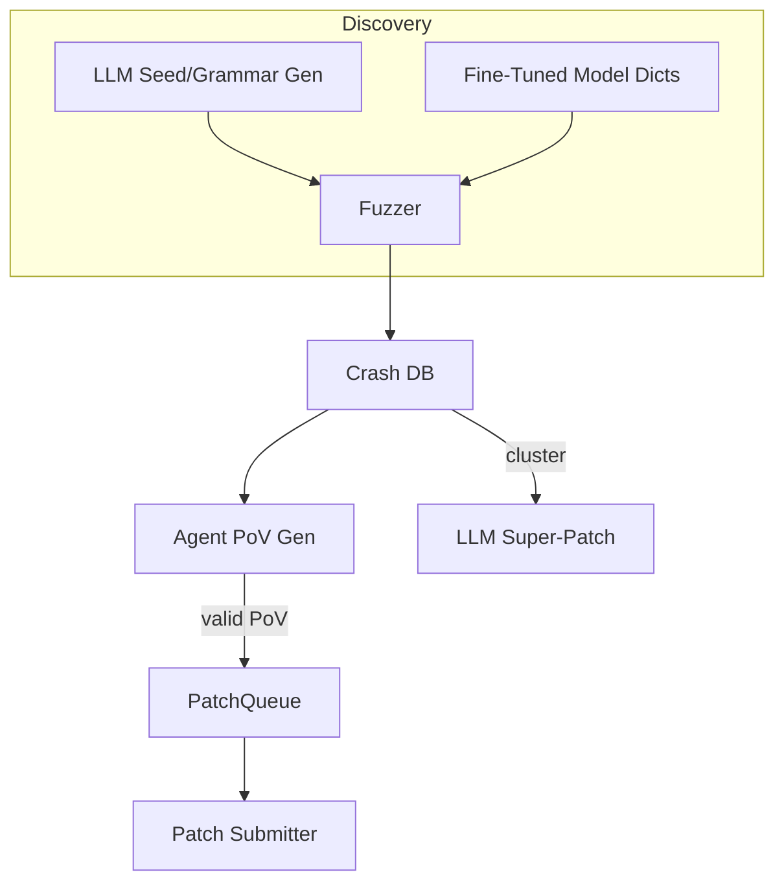

# Fuzzing με βοήθεια AI & Automated Vulnerability Discovery

{{#include ../banners/hacktricks-training.md}}

## Overview
Τα Large-language models (LLMs) μπορούν να ενισχύσουν σημαντικά τα παραδοσιακά vulnerability-research pipelines, δημιουργώντας σημασιολογικά πλούσια inputs, εξελίσσοντας grammars, αναλύοντας δεδομένα από crashes και προτείνοντας ακόμη και patches για πολλαπλά bugs.  Αυτή η σελίδα συγκεντρώνει τα πιο αποτελεσματικά patterns που παρατηρήθηκαν στους τελικούς του DARPA’s AI Cyber Challenge (AIxCC) και σε άλλες δημόσιες έρευνες.<sup>[[4]](#references)</sup><sup>[[5]](#references)</sup>

Αυτό που ακολουθεί δεν αποτελεί περιγραφή ενός συγκεκριμένου competition system, αλλά μια αφαίρεση των τεχνικών, ώστε να μπορείτε να τις αναπαράγετε στα δικά σας workflows.

---

## 1. LLM-Generated Seed Inputs

Οι παραδοσιακοί coverage–guided fuzzers (AFL++, libFuzzer, Honggfuzz…) ξεκινούν με ένα μικρό corpus από seeds και μεταλλάσσουν bytes χωρίς κατεύθυνση.  Όταν το format του target input είναι σύνθετο (SQL, URLs, custom binary protocols), οι τυχαίες μεταλλάξεις συνήθως καταστρέφουν τη σύνταξη πριν επιτευχθούν ενδιαφέροντα branches.

Τα LLMs μπορούν να λύσουν αυτό το bootstrap problem, παράγοντας *seed generators* – σύντομα scripts που εξάγουν **inputs με σωστή σύνταξη αλλά σχετικά με την ασφάλεια**.  Για παράδειγμα:
```prompt
SYSTEM: You are a helpful security engineer.
USER:
Write a Python3 program that prints 200 unique SQL injection strings targeting common anti-pattern mistakes (missing quotes, numeric context, stacked queries).  Ensure length ≤ 256 bytes / string so they survive common length limits.
```

```python
# gen_sqli_seeds.py (truncated)
PAYLOADS = [
"1 OR 1=1 -- ",
"' UNION SELECT NULL,NULL--",
"0; DROP TABLE users;--",
...
]
for p in PAYLOADS:
print(p)
```
Εκτελέστε το μία φορά και τροφοδοτήστε την έξοδο απευθείας στο αρχικό corpus του fuzzer:
```bash
python3 gen_sqli_seeds.py > seeds.txt
afl-fuzz -i seeds.txt -o findings/ -- ./target @@
```
Benefits:
1. Semantic validity → deeper coverage early.
2. Re-generatable: tweak the prompt to focus on XSS, path traversal, binary blobs, etc.
3. Cheap (< 1 ¢ with GPT-3.5).

### Tips
* Instruct the model to *diversify* payload length and encoding (UTF-8, URL-encoded, UTF-16-LE) to bypass superficial filters.
* Ask for a *single self-contained script* – avoids JSON formatting hiccups.

---

## 2. Grammar-Evolution Fuzzing

Μια πιο ισχυρή παραλλαγή είναι να αφήσετε το LLM να **εξελίξει μια grammar** αντί για συγκεκριμένα seeds. Η ροή εργασίας (μοτίβο “Grammar Guy”) είναι:

1. Generate an initial ANTLR/Peach/LibFuzzer grammar via prompt.
2. Fuzz for N minutes and collect coverage metrics (edges / blocks hit).
3. Summarise uncovered program areas and feed the summary back into the model:
```prompt
The previous grammar triggered 12 % of the program edges.  Functions not reached: parse_auth, handle_upload.  Add / modify rules to cover these.
```
4. Merge the new rules, re-fuzz, repeat.

Skeleton ψευδοκώδικα:
```python
for epoch in range(MAX_EPOCHS):
grammar = llm.refine(grammar, feedback=coverage_stats)
save(grammar, f"grammar_{epoch}.txt")
coverage_stats = run_fuzzer(grammar)
```
Key points:
* Κρατήστε ένα *budget* – κάθε refinement χρησιμοποιεί tokens.
* Χρησιμοποιήστε οδηγίες `diff` + `patch`, ώστε το model να επεξεργάζεται αντί να ξαναγράφει.
* Σταματήστε όταν Δcoverage < ε.

---

## 3. Μηχανική local-LLM libFuzzer Harness

Για source που δεν μπορεί να φύγει από το workstation ενός analyst, ένα local code model μπορεί να συντάξει τον μικρό adapter μεταξύ των bytes του fuzzer και ενός C/C++ API. Το χρήσιμο security boundary είναι σαφές: **το model γράφει και αναθεωρεί test infrastructure· το coverage-guided mutation εξερευνά inputs· οι sanitizers αναφέρουν invalid operations· ένας άνθρωπος ελέγχει το harness και κάνει triage στα findings**.<sup>[[9]](#references)</sup>

Για τεχνικές engine-level corpus, feedback, snapshot και stateful-fuzzing που δεν εξαρτώνται από LLM, δείτε τη γενική [Μεθοδολογία Fuzzing](../generic-methodologies-and-resources/fuzzing.md).

Ξεκινήστε με την ακριβή declaration που έχει αντιγραφεί από το target header και περιορίστε το output format. Ένα narrow prompt μειώνει τα invented APIs και κάνει το αποτέλεσμα εύκολο στον έλεγχο:<sup>[[8]](#references)[[9]](#references)</sup>
```prompt
Write a libFuzzer target for this exact declaration:
int parse_records(const uint8_t *data, size_t size);

Output only C code. Implement LLVMFuzzerTestOneInput, include the
declaration, pass data and size unchanged, and do not use files,
network access, randomness, clocks, threads, or persistent state.
```
Για έναν parser ακατέργαστων bytes, το αναμενόμενο αποτέλεσμα δεν θα πρέπει να είναι πιο περίπλοκο από:<sup>[[6]](#references)[[9]](#references)</sup>
```c
#include <stddef.h>
#include <stdint.h>

extern int parse_records(const uint8_t *, size_t);

int LLVMFuzzerTestOneInput(const uint8_t *data, size_t size) {
(void)parse_records(data, size);
return 0;
}
```
Η μεταγλώττιση είναι μόνο το πρώτο στάδιο επικύρωσης. Ελέγξτε κάθε generated target ως προς τα παρακάτω invariants, πριν αφιερώσετε χρόνο CPU σε αυτό:<sup>[[6]](#references)[[8]](#references)[[9]](#references)</sup>

- **Exact API:** συγκρίνετε τους τύπους, τους κανόνες ownership, την αρχικοποίηση, το teardown και το calling convention με το πραγματικό header και τους υπάρχοντες callers.
- **Ασφάλεια harness:** προστατεύστε κάθε read από το `data`· τα ευρήματα των sanitizers πρέπει να προέρχονται από το target και όχι από generated glue.
- **Επαναληψιμότητα:** κάντε το αποτέλεσμα συνάρτηση των `data` και `size`· αφαιρέστε εξωτερικό I/O, χρόνο, μη ελεγχόμενο randomness, threads χωρίς join και state που παραμένει μεταξύ των calls.
- **Throughput:** αρχικοποιήστε ακριβό immutable state μόνο μία φορά, μόνο όταν αυτό δεν μπορεί να επηρεάσει τη συμπεριφορά, περιορίστε το input size, καταστείλετε το logging και αποδεσμεύστε τις allocations ανά input.
- **Reachability:** επαληθεύστε ότι εκτελούνται οι intended functions και branches. Ένα target που κάνει compile αλλά ασκεί μόνο rejection paths είναι silent failure.

### Structure-aware targets: διατηρήστε τα invariants χωρίς να αποκρύπτετε bugs

Αν τα περισσότερα raw inputs αποτυγχάνουν σε magic, length, version ή checksum gate, χρησιμοποιήστε τα fuzz bytes ως **typed field material** και ανακατασκευάστε ένα valid object. Διορθώστε τα format constants, αφήστε τα semantic fields και τα payload bytes mutable και υπολογίστε τα integrity metadata από το reconstructed payload. Το `FuzzedDataProvider` είναι χρήσιμο για την κατανάλωση bounded typed values, ενώ ο adapter παραμένει υπεύθυνος για τον περιορισμό κάθε generated allocation και conversion.<sup>[[9]](#references)</sup>

<details>
<summary>Παράδειγμα structure-aware C++ target</summary>
```cpp
#include <fuzzer/FuzzedDataProvider.h>
#include <stddef.h>
#include <stdint.h>
#include <vector>

extern "C" int parse_message(const uint8_t *, size_t);

extern "C" int LLVMFuzzerTestOneInput(const uint8_t *data, size_t size) {
FuzzedDataProvider fdp(data, size);
uint8_t version = fdp.ConsumeIntegral<uint8_t>();
auto body = fdp.ConsumeRemainingBytes<uint8_t>();
if (body.size() > UINT16_MAX) body.resize(UINT16_MAX);
uint16_t len = static_cast<uint16_t>(body.size());
std::vector<uint8_t> msg = {0x8b, 'M', 'S', 'G', version,
static_cast<uint8_t>(len >> 8),
static_cast<uint8_t>(len)};
msg.insert(msg.end(), body.begin(), body.end());
(void)parse_message(msg.data(), msg.size());
return 0;
}
```
</details>

Μην χρησιμοποιείτε έναν target που επιδιορθώνει τη δομή για κάθε ερώτηση. Διατηρήστε έναν target που υπολογίζει lengths/checksums για την εξερεύνηση βαθιών έγκυρων καταστάσεων και έναν άλλο που διατηρεί τα **declared** metadata υπό τον έλεγχο του fuzzer, περιορίζοντας μόνο τις αναγνώσεις και τις allocations του ίδιου του harness. Ο δεύτερος target διατηρεί τα attack surfaces που αφορούν mismatched-length και bad-integrity, τα οποία η αυτόματη επιδιόρθωση διαφορετικά θα εξαφάνιζε.<sup>[[9]](#references)</sup>

### Seeds, dictionaries, sanitizers και feedback κάλυψης

Ζητήστε από το model να δημιουργήσει ένα script που γράφει binary seeds, αντί να του ζητήσετε να εκτυπώσει binary απευθείας. Χρησιμοποιήστε empty, minimal, typical και boundary-valid objects ως seeds· στη συνέχεια εξαγάγετε magic values, tags, enum encodings και parser keywords σε ένα reviewed dictionary. Το libFuzzer δέχεται αυτό το dictionary με το `-dict=`, και διατηρεί στο corpus τις mutations που αποκαλύπτουν νέα κάλυψη.<sup>[[6]](#references)[[9]](#references)</sup>
```text
magic="\x8bMSG"
version_min="\x00"
version_max="\xff"
config_tag="CONFIG"
```
Κατασκευάστε τον ίδιο στόχο με συμπληρωματικό instrumentation. Τα ASan και UBSan μπορούν να μοιράζονται ένα δυαδικό fuzzing· χρησιμοποιήστε ξεχωριστό build MSan και κάντε instrumentation στις dependencies του, ώστε να αποφεύγονται οι αναφορές που προκαλούνται από κώδικα χωρίς instrumentation.<sup>[[6]](#references)[[9]](#references)</sup>
```bash
clang++ -g -O1 -fsanitize=fuzzer,address,undefined \
-fno-sanitize-recover=undefined target.cc harness.cc -o fuzz_target
./fuzz_target corpus -dict=msg.dict -max_len=65535

clang++ -g -O1 -fsanitize=fuzzer,memory \
target.cc harness.cc -o fuzz_target_msan
```
Αντιμετωπίστε το coverage ως τον αξιολογητή για κάθε revision του model. Στο output του libFuzzer, το early-flat `cov`/`ft` και ένα static corpus συνήθως υποδεικνύουν κακό framing, ένα υπερβολικά περιοριστικό early return ή λάθος call· το χαμηλό `exec/s` υποδεικνύει δαπανηρό setup, I/O, allocation ή leaked state. Το `NEW` αποδεικνύει μόνο ότι άλλαξε ένα coverage feature, όχι ότι έγινε reach ο intended parser.<sup>[[6]](#references)[[9]](#references)</sup>

Για feedback σε επίπεδο source, δημιουργήστε ένα coverage build, κάντε fuzzing και δώστε στο model μόνο τις uncovered functions μαζί με τις guarding conditions τους. Επαληθεύστε το diff των harness/seed/dictionary και μετρήστε ξανά:<sup>[[7]](#references)[[8]](#references)[[9]](#references)</sup>
```bash
clang++ -g -O1 -fsanitize=fuzzer \
-fprofile-instr-generate -fcoverage-mapping target.cc harness.cc -o fuzz_cov
mkdir -p profiles
LLVM_PROFILE_FILE='profiles/%p.profraw' ./fuzz_cov -max_total_time=300 corpus
llvm-profdata merge -sparse profiles/*.profraw -o fuzz.profdata
llvm-cov report ./fuzz_cov -instr-profile=fuzz.profdata
llvm-cov show ./fuzz_cov -instr-profile=fuzz.profdata \
--show-branches=count --region-coverage-lt=1 target.cc
```
Ο κλιμακούμενος βρόχος είναι επομένως **generate → compile/link → smoke-test under sanitizers → measure target coverage → provide the smallest relevant coverage/source context → revise → re-measure**. Το OSS-Fuzz-Gen εφαρμόζει την ίδια αρχή, αξιολογώντας τα generated targets ως προς τη δυνατότητα compilation, τα runtime failures, το coverage και τη βελτίωση του coverage σε σχέση με τα υπάρχοντα targets, αντί να αποδέχεται plausibly code χωρίς περαιτέρω έλεγχο.<sup>[[7]](#references)[[8]](#references)</sup>

---

## 4. Agent-Based PoV (Exploit) Generation

Μετά τον εντοπισμό ενός crash, χρειάζεστε ακόμη ένα **proof-of-vulnerability (PoV)** που το ενεργοποιεί deterministically.

Μια κλιμακούμενη προσέγγιση είναι η εκκίνηση πολλών lightweight workers (processes, threads ή containers), όπου ο καθένας χρησιμοποιεί διαφορετικό model ή sampling configuration. Η έρευνα των AIxCC finalists παρέχει συγκεκριμένα παραδείγματα κλίμακας: μία ομάδα χρησιμοποίησε **thousands of concurrent agents** για AI-first PoV generation, ενώ μια άλλη έκανε orchestration **300–500 fuzzing agents** και χρησιμοποίησε LLMs για reasoning υψηλότερου επιπέδου.<sup>[[4]](#references)</sup>

Pipeline:
1. Η Static/ dynamic analysis παράγει *bug candidates* (struct με crash PC, input slice, sanitizer msg).
2. Ο Orchestrator διανέμει τους candidates στους agents.
3. Βήματα reasoning του agent:
a. Αναπαράγει το bug τοπικά με `gdb` + input.
b. Προτείνει minimal exploit payload.
c. Επικυρώνει το exploit σε sandbox.  Αν επιτύχει → submit.
4. Οι failed attempts γίνονται **re-queued ως νέα seeds** για coverage fuzzing (feedback loop).

Πλεονεκτήματα:
* Η Parallelisation αποκρύπτει την αναξιοπιστία ενός μεμονωμένου agent.
* Αυτόματο tuning των temp / model size με βάση το observed success-rate.

---

## 5. Directed Fuzzing with Fine-Tuned Code Models

Κάντε fine-tune ένα open-weight model (π.χ. Llama-7B) σε C/C++ source με labels που αντιστοιχούν σε vulnerability patterns (integer overflow, buffer copy, format string). Στη συνέχεια:

1. Εκτελέστε static analysis για να λάβετε τη function list + AST.
2. Κάντε prompt στο model: *“Give mutation dictionary entries that are likely to break memory safety in function X”*.
3. Εισαγάγετε αυτά τα tokens σε ένα custom `AFL_CUSTOM_MUTATOR`.

Παράδειγμα output για ένα `sprintf` wrapper:
```
{"pattern":"%99999999s"}
{"pattern":"AAAAAAAA....<1024>....%n"}
```
Εμπειρικά, αυτό μειώνει τον χρόνο έως το crash κατά >2× σε πραγματικούς στόχους.

---

## 6. Στρατηγικές Patching με καθοδήγηση από AI

### 6.1 Super Patches
Ζητήστε από το model να κάνει *cluster* στα crash signatures και να προτείνει ένα **single patch** που αφαιρεί την κοινή root cause. Κάντε submit μία φορά, διορθώστε αρκετά bugs → λιγότερα accuracy penalties σε περιβάλλοντα όπου κάθε λανθασμένο patch κοστίζει πόντους.

Περίγραμμα prompt:
```
Here are 10 stack traces + file snippets.  Identify the shared mistake and generate a unified diff fixing all occurrences.
```
### 6.2 Αναλογία Speculative Patch
Υλοποιήστε μια queue όπου τα επιβεβαιωμένα patches με επικύρωση PoV και τα *speculative* patches (χωρίς PoV) παρεμβάλλονται σε αναλογία 1:​N, ρυθμισμένη σύμφωνα με τους scoring rules (π.χ. 2 speculative : 1 confirmed). Ένα cost model παρακολουθεί τα penalties σε σχέση με τους points και προσαρμόζει αυτόματα το N.

---

## 7. Deterministic File-by-File AI Code Review

Ένα συχνό failure mode στο AI-assisted review είναι να ζητάτε από έναν agent να επιθεωρήσει ένα ολόκληρο repository, ελπίζοντας ότι θα επιλέξει τα σωστά files και τους σωστούς όρους grep. Ένα πιο αξιόπιστο pattern είναι να **επιβάλλετε κάλυψη του repository**:<sup>[[1]](#references)</sup>

1. Καταγράψτε τα source files.
2. Στείλτε **ένα file κάθε φορά**, μαζί με minimal context (entrypoint, imports, κοντινά routes/callers).
3. Απαιτήστε ένα **structured report** για κάθε file: sources, sink, missing validation, exploit preconditions και confidence.<sup>[[3]](#references)</sup>
4. Κάντε deduplicate τα reports με βάση το **source→sink pattern** και επικυρώστε χειροκίνητα όσα έχουν υψηλό ρίσκο.

Αυτό απαιτεί πολλά tokens και παράγει θόρυβο, αλλά είναι πολύ αποτελεσματικό στην ανάδειξη **απλών source/sink bugs υψηλού impact**, τα οποία συχνά διαφεύγουν από ευρείες agentic reviews.

### Patterns του triage που αξίζει να έχουν προτεραιότητα

- **Dynamic PHP include/dispatch**: ονόματα route/controller/module που ελέγχονται από τον attacker και καταλήγουν σε `require_once()`, `include()` ή `include_once()` χωρίς αυστηρό allowlisting και path canonicalisation.
- **Shell execution σε admin/account workflows**: usernames, domains, FTP accounts ή άλλα identifiers καταλήγουν σε `exec()`, `system()`, `shell_exec()`, `passthru()`, `proc_open()` ή `popen()`.
- **Structured input fan-in**: η ίδια parameter γίνεται αποδεκτή από `$_GET`, `$_POST`, JSON, XML ή framework body parsers και αργότερα επαναχρησιμοποιείται σε filesystem ή OS-command sinks.

### Δύο πρακτικές bug classes που εντοπίζει καλά αυτή η μέθοδος

- **PHP controller-dispatch LFI/RCE**: αν ένα controller name που ελέγχεται από το request συνενώνεται με `require_once()` χωρίς allowlist/path normalisation, sequences traversal όπως `../` μπορούν να κάνουν την PHP να συμπεριλάβει ένα unintended local `.php` file. Αν ο attacker μπορεί να κατευθύνει το include σε ένα planted ή διαφορετικά χρήσιμο PHP file, το LFI μετατρέπεται σε code execution. Δείτε [File Inclusion / Path Traversal](../pentesting-web/file-inclusion/README.md).<sup>[[1]](#references)</sup>
- **Authenticated command injection σε hosting/admin panels**: αν fields διαχείρισης account, όπως usernames, ενσωματώνονται σε shell commands, ένας authenticated user με χαμηλά privileges μπορεί να μετατρέψει μια κανονική ενέργεια create/delete σε RCE. Το impact αυξάνεται όταν το panel εκτελεί το command ως service account με περισσότερα privileges. Δείτε [Command Injection](../pentesting-web/command-injection.md).<sup>[[1]](#references)</sup>

### Πρακτικές σημειώσεις review

- Χρησιμοποιήστε το LLM αρχικά ως **source/sink reviewer**, όχι ως exploit generator.
- Ζητήστε του να καταγράφει ρητά το **attacker-controlled field**, το **normalization/validation gap** και το **dangerous sink**.
- Σε μεγάλα repos, το deterministic per-file review είναι συχνά πιο αξιόπιστο από ένα single autonomous agent run, ακόμη και όταν το τελευταίο χρησιμοποιεί ισχυρότερο model.<sup>[[2]](#references)</sup>
- Αναμένετε ασθενέστερα αποτελέσματα σε **Broken Access Control** και άλλα business-logic bugs, όπου η exploitability εξαρτάται από cross-file assumptions, role semantics ή product-specific threat models.

---

## Συνδυάζοντας τα πάντα
Ένα end-to-end CRS (Cyber Reasoning System) μπορεί να συνδέσει τα components ως εξής:

```mermaid
graph TD
subgraph Discovery
A[LLM Seed/Grammar Gen] --> B[Fuzzer]
C[Fine-Tuned Model Dicts] --> B
end
B --> D[Crash DB]
D --> E[Agent PoV Gen]
E -->|valid PoV| PatchQueue
D -->|cluster| F[LLM Super-Patch]
PatchQueue --> G[Patch Submitter]
```
---

## References

- [1] [Project Black - Τοπικό AI για Cyber Security: Εντοπισμός LFI στο phpIPAM και Authenticated RCE στο myVesta](https://projectblack.io/blog/local-ai-for-cyber-security)
- [2] [Strix](https://github.com/usestrix/strix)
- [3] [Δεξιότητα security-review της κοινότητας του GitHub Copilot](https://github.com/github/awesome-copilot/blob/main/skills/security-review/SKILL.md)
- [4] [Trail of Bits – Τελικοί AIxCC: Η ιστορία της αναμέτρησης](https://blog.trailofbits.com/2025/08/07/aixcc-finals-tale-of-the-tape/)
- [5] [Συνεντεύξεις φιναλίστ του CTF Radiooo AIxCC](https://www.youtube.com/@ctfradiooo)
- [6] [LLVM — libFuzzer: βιβλιοθήκη για fuzz testing με καθοδήγηση από την κάλυψη](https://llvm.org/docs/LibFuzzer.html)
- [7] [Google — OSS-Fuzz-Gen](https://github.com/google/oss-fuzz-gen)
- [8] [Google Online Security Blog — Αναβάθμιση του Fuzzing: Εντοπισμός περισσότερων ευπαθειών με AI](https://security.googleblog.com/2024/11/leveling-up-fuzzing-finding-more.html)
- [9] [8kSec — Δημιουργία Fuzzing Harness με υποβοήθηση AI και Local LLM](https://8ksec.io/ai-assisted-fuzzing-harness-local-llm)
{{#include ../banners/hacktricks-training.md}}
