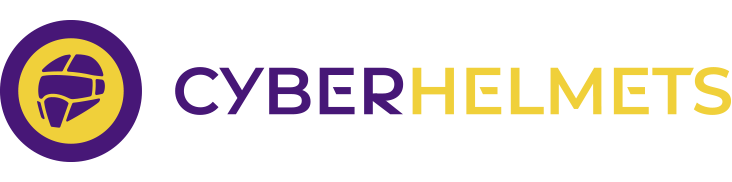
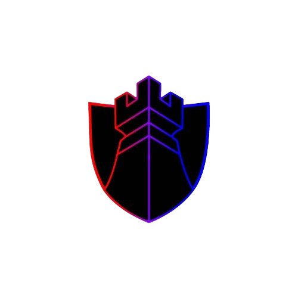

# HackTricks

<figure><figcaption></figcaption></figure>

_Hacktricks logos & motion design by_ [_@ppieranacho_](https://www.instagram.com/ppieranacho/)_._

### HackTricks को स्थानीय रूप से चलाएँ
```bash
# Download latest version of hacktricks
git clone https://github.com/HackTricks-wiki/hacktricks

# Select the language you want to use
export LANG="master" # Leave master for english
# "af" for Afrikaans
# "de" for German
# "el" for Greek
# "es" for Spanish
# "fr" for French
# "hi" for HindiP
# "it" for Italian
# "ja" for Japanese
# "ko" for Korean
# "pl" for Polish
# "pt" for Portuguese
# "sr" for Serbian
# "sw" for Swahili
# "tr" for Turkish
# "uk" for Ukrainian
# "zh" for Chinese

# Run the docker container indicating the path to the hacktricks folder
docker run -d --rm --platform linux/amd64 -p 3337:3000 --name hacktricks -v $(pwd)/hacktricks:/app ghcr.io/hacktricks-wiki/hacktricks-cloud/translator-image bash -c "mkdir -p ~/.ssh && ssh-keyscan -H github.com >> ~/.ssh/known_hosts && cd /app && git config --global --add safe.directory /app && git checkout $LANG && git pull && MDBOOK_PREPROCESSOR__HACKTRICKS__ENV=dev mdbook serve --hostname 0.0.0.0"
```
Your local copy of HackTricks will be **available at [http://localhost:3337](http://localhost:3337)** after <5 minutes (it needs to build the book, be patient).

## कॉर्पोरेट प्रायोजक

### [STM Cyber](https://www.stmcyber.com)

<figure><figcaption></figcaption></figure>

[**STM Cyber**](https://www.stmcyber.com) एक उत्कृष्ट साइबरसिक्योरिटी कंपनी है जिसका स्लोगन **HACK THE UNHACKABLE** है। वे अपने रिसर्च करते हैं और अपने खुद के hacking tools विकसित करते हैं ताकि वे **कई महत्वपूर्ण साइबरसिक्योरिटी सेवाएँ** जैसे pentesting, Red teams और training प्रदान कर सकें।

आप उनका **ब्लॉग** यहाँ देख सकते हैं: [**https://blog.stmcyber.com**](https://blog.stmcyber.com)

**STM Cyber** HackTricks जैसे ओपन सोर्स साइबरसिक्योरिटी प्रोजेक्ट्स को भी सपोर्ट करते हैं :)

---

### [RootedCON](https://www.rootedcon.com/)

<figure><figcaption></figcaption></figure>

[**RootedCON**](https://www.rootedcon.com) **Spain** का सबसे प्रासंगिक साइबरसिक्योरिटी इवेंट है और **Europe** के सबसे महत्वपूर्ण इवेंट्स में से एक है। **तकनीकी ज्ञान को बढ़ावा देने** के मिशन के साथ, यह कॉन्ग्रेस तकनीक और साइबरसिक्योरिटी पेशेवरों के लिए एक जीवंत मिलन स्थल है।

{{#ref}}
https://www.rootedcon.com/
{{#endref}}

---

### [Intigriti](https://www.intigriti.com)

<figure><figcaption></figcaption></figure>

**Intigriti** यूरोप का #1 ethical hacking और **bug bounty platform** है।

**Bug bounty tip**: **sign up** for **Intigriti**, एक प्रीमियम **bug bounty platform created by hackers, for hackers**! आज ही [**https://go.intigriti.com/hacktricks**](https://go.intigriti.com/hacktricks) पर जुड़ें, और $100,000 तक के bounties कमाना शुरू करें!

{{#ref}}
https://go.intigriti.com/hacktricks
{{#endref}}

---

### [Trickest](https://trickest.com/?utm_campaign=hacktrics&utm_medium=banner&utm_source=hacktricks)

<figure><figcaption></figcaption></figure>

\
[**Trickest**](https://trickest.com/?utm_campaign=hacktrics&utm_medium=banner&utm_source=hacktricks) का उपयोग करें ताकि आप आसानी से दुनिया के **सबसे advanced** community tools द्वारा संचालित workflows बना और **automate** कर सकें।

आज ही Access प्राप्त करें:

{{#ref}}
https://trickest.com/?utm_campaign=hacktrics&utm_medium=banner&utm_source=hacktricks
{{#endref}}

---

### [HACKENPROOF](https://bit.ly/3xrrDrL)

<figure><figcaption></figcaption></figure>

Join [**HackenProof Discord**](https://discord.com/invite/N3FrSbmwdy) server ताकि आप experienced hackers और bug bounty hunters से संवाद कर सकें!

- **Hacking Insights:** ऐसे कंटेंट के साथ जुड़ें जो hacking के रोमांच और चुनौतियों में गहराई से जाता है
- **Real-Time Hack News:** रीयल-टाइम न्यूज़ और इनसाइट्स के माध्यम से तेज़ी से बदलती hacking दुनिया से अपडेट रहें
- **Latest Announcements:** नए लॉन्च होने वाले bug bounties और महत्वपूर्ण प्लेटफ़ॉर्म अपडेट्स के बारे में जानकारी रखें

**Join us on** [**Discord**](https://discord.com/invite/N3FrSbmwdy) और आज ही टॉप hackers के साथ collaborate करना शुरू करें!

---

### [Pentest-Tools.com](https://pentest-tools.com/?utm_term=jul2024&utm_medium=link&utm_source=hacktricks&utm_campaign=spons) - The essential penetration testing toolkit

<figure><figcaption></figcaption></figure>

**Get a hacker's perspective on your web apps, network, and cloud**

**Find and report critical, exploitable vulnerabilities with real business impact.** हमारे 20+ custom tools का उपयोग करके attack surface को map करें, ऐसे security issues खोजें जो आपको privileges escalate करने दें, और automated exploits का उपयोग करके आवश्यक सबूत इकट्ठा करें, जिससे आपके मेहनत को persuasive reports में बदला जा सके।

{{#ref}}
https://pentest-tools.com/?utm_term=jul2024&utm_medium=link&utm_source=hacktricks&utm_campaign=spons
{{#endref}}

---

### [SerpApi](https://serpapi.com/)

<figure><figcaption></figcaption></figure>

**SerpApi** तेज़ और आसान real-time APIs प्रदान करता है ताकि आप **search engine results** तक पहुँच सकें। वे search engines scrape करते हैं, proxies संभालते हैं, captchas सुलझाते हैं, और सभी rich structured data को आपके लिए parse करते हैं।

SerpApi की किसी भी योजना की subscription में अलग-अलग search engines scrape करने के लिए 50+ अलग APIs तक पहुँच शामिल है, जिनमें Google, Bing, Baidu, Yahoo, Yandex, और अन्य शामिल हैं.\
अन्य providers के विपरीत, **SerpApi सिर्फ organic results को scrape नहीं करता।** SerpApi responses में लगातार सभी ads, inline images और videos, knowledge graphs, और search results में मौजूद अन्य elements और features शामिल होते हैं।

वर्तमान SerpApi ग्राहक में **Apple, Shopify, and GrubHub** शामिल हैं।\
अधिक जानकारी के लिए उनके [**blog**](https://serpapi.com/blog/)**,** देखें, या उनके [**playground**](https://serpapi.com/playground)** में एक उदाहरण आज़माएँ।**\
आप यहाँ एक **free account** बना सकते हैं: [**here**](https://serpapi.com/users/sign_up)**.**

---

### [8kSec Academy – In-Depth Mobile Security Courses](https://academy.8ksec.io/)

<figure><figcaption></figcaption></figure>

vulnerabilities research, penetration testing, और reverse engineering करने के लिए आवश्यक technologies और skills सीखें ताकि आप mobile applications और devices की रक्षा कर सकें। हमारी on-demand courses के माध्यम से **iOS और Android security** में महारत हासिल करें और **get certified**:

{{#ref}}
https://academy.8ksec.io/
{{#endref}}

---

### [WebSec](https://websec.net/)

<figure><figcaption></figcaption></figure>

[**WebSec**](https://websec.net) एक पेशेवर साइबरसिक्योरिटी कंपनी है जो **Amsterdam** में आधारित है और दुनिया भर के व्यवसायों को नवीनतम साइबर खतरों के खिलाफ सुरक्षित रखने में मदद करती है, यह **offensive-security services** एक **modern** दृष्टिकोण के साथ प्रदान करती है।

WebSec एक अंतरराष्ट्रीय security कंपनी है जिसकी कार्यालय Amsterdam और Wyoming में हैं। वे **all-in-one security services** प्रदान करते हैं यानी वे सब करते हैं; Pentesting, **Security** Audits, Awareness Trainings, Phishing Campaigns, Code Review, Exploit Development, Security Experts Outsourcing और बहुत कुछ।

WebSec की एक और अच्छी बात यह है कि industry average के विपरीत WebSec अपनी कौशल पर **बहुत आत्मविश्वासी** है, इतना कि वे **best quality results** की गारंटी देते हैं; उनकी वेबसाइट पर लिखा है "**If we can't hack it, You don't pay it!**". अधिक जानकारी के लिए उनकी [**website**](https://websec.net/en/) और [**blog**](https://websec.net/blog/) देखें!

उपर्युक्त के अलावा WebSec HackTricks का भी **समर्पित समर्थक** है।

{{#ref}}
https://www.youtube.com/watch?v=Zq2JycGDCPM
{{#endref}}

---

### [CyberHelmets](https://cyberhelmets.com/courses/?ref=hacktricks)

<figure><figcaption></figcaption></figure>


**Built for the field. Built around you.**\
[**Cyber Helmets**](https://cyberhelmets.com/?ref=hacktricks) प्रभावी साइबरसिक्योरिटी training विकसित और प्रदान करते हैं जो industry experts द्वारा बनाए और संचालित होते हैं। उनके प्रोग्राम सैद्धान्त से परे जाकर टीमों को गहरी समझ और actionable skills से लैस करते हैं, और custom environments का उपयोग करते हैं जो real-world खतरों को दर्शाते हैं। custom training पूछताछ के लिए, हमसे यहाँ संपर्क करें: [**here**](https://cyberhelmets.com/tailor-made-training/?ref=hacktricks).

**उनकी training को अलग क्या बनाता है:**
* Custom-built content और labs
* Top-tier tools और platforms द्वारा समर्थित
* Practitioners द्वारा डिजाइन और पढ़ाई जाती है

{{#ref}}
https://cyberhelmets.com/courses/?ref=hacktricks
{{#endref}}

---

### [Last Tower Solutions](https://www.lasttowersolutions.com/)

<figure><figcaption></figcaption></figure>

Last Tower Solutions विशेष रूप से **Education** और **FinTech** संस्थानों के लिए विशेषज्ञ साइबरसिक्योरिटी सेवाएँ प्रदान करता है, जिनका फोकस **penetration testing, cloud security assessments**, और **compliance readiness** (SOC 2, PCI-DSS, NIST) पर है। हमारी टीम में **OSCP और CISSP certified professionals** शामिल हैं, जो प्रत्येक engagement में गहरी तकनीकी विशेषज्ञता और industry-standard insight लाते हैं।

हम automated scans से आगे जाते हैं और **manual, intelligence-driven testing** प्रदान करते हैं जो high-stakes environments के लिए अनुकूलित होती है। छात्र रिकॉर्ड्स की सुरक्षा से लेकर वित्तीय लेनदेन की रक्षा तक, हम संगठनों को वह सुरक्षा प्रदान करते हैं जो सबसे अधिक महत्वपूर्ण है।

_“A quality defense requires knowing the offense, we provide security through understanding.”_

नवीनतम साइबरसिक्योरिटी अपडेट्स के लिए उनके [**blog**](https://www.lasttowersolutions.com/blog) पर जाएँ।

{{#ref}}
https://www.lasttowersolutions.com/
{{#endref}}

---

### [K8Studio - The Smarter GUI to Manage Kubernetes.](https://k8studio.io/)

<figure><figcaption></figcaption></figure>

K8Studio IDE DevOps, DevSecOps, और developers को सक्षम बनाता है कि वे Kubernetes clusters को प्रभावी ढंग से manage, monitor, और secure कर सकें। हमारे AI-driven insights, advanced security framework, और intuitive CloudMaps GUI का उपयोग करके अपने clusters को visualize करें, उनकी स्थिति समझें, और आत्मविश्वास के साथ कार्रवाई करें।

इसके अलावा, K8Studio **all major kubernetes distributions** के साथ compatible है (AWS, GCP, Azure, DO, Rancher, K3s, Openshift और अधिक)।

{{#ref}}
https://k8studio.io/
{{#endref}}


---

## लाइसेंस और अस्वीकरण

इन्हें देखें:

{{#ref}}
welcome/hacktricks-values-and-faq.md
{{#endref}}

## Github Stats


{{#include ./banners/hacktricks-training.md}}
