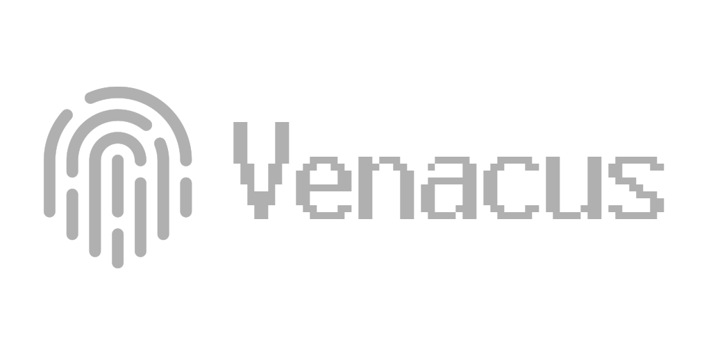

# HackTricks

<figure><figcaption></figcaption></figure>

_Hacktricks-Logos & Motion Design von_ [_@ppieranacho_](https://www.instagram.com/ppieranacho/)_._

### HackTricks lokal ausführen
```bash
# Download latest version of hacktricks
git clone https://github.com/HackTricks-wiki/hacktricks

# Select the language you want to use
export LANG="master" # Leave master for english
# "af" for Afrikaans
# "de" for German
# "el" for Greek
# "es" for Spanish
# "fr" for French
# "hi" for HindiP
# "it" for Italian
# "ja" for Japanese
# "ko" for Korean
# "pl" for Polish
# "pt" for Portuguese
# "sr" for Serbian
# "sw" for Swahili
# "tr" for Turkish
# "uk" for Ukrainian
# "zh" for Chinese

# Run the docker container indicating the path to the hacktricks folder
docker run -d --rm --platform linux/amd64 -p 3337:3000 --name hacktricks -v $(pwd)/hacktricks:/app ghcr.io/hacktricks-wiki/hacktricks-cloud/translator-image bash -c "mkdir -p ~/.ssh && ssh-keyscan -H github.com >> ~/.ssh/known_hosts && cd /app && git config --global --add safe.directory /app && git checkout $LANG && git pull && MDBOOK_PREPROCESSOR__HACKTRICKS__ENV=dev mdbook serve --hostname 0.0.0.0"
```
Ihre lokale Kopie von HackTricks wird **unter [http://localhost:3337](http://localhost:3337)** nach <5 Minuten verfügbar sein (es muss das Buch erstellt werden, haben Sie Geduld).

## Unternehmenssponsoren

### [STM Cyber](https://www.stmcyber.com)

<figure><figcaption></figcaption></figure>

[**STM Cyber**](https://www.stmcyber.com) ist ein großartiges Cybersecurity-Unternehmen, dessen Slogan **HACK THE UNHACKABLE** lautet. Sie führen eigene Recherchen durch und entwickeln eigene Hacking-Tools, um **verschiedene wertvolle Cybersecurity-Dienste** wie Pentesting, Red Teams und Schulungen anzubieten.

Sie können ihren **Blog** unter [**https://blog.stmcyber.com**](https://blog.stmcyber.com) einsehen.

**STM Cyber** unterstützt auch Open-Source-Projekte im Bereich Cybersecurity wie HackTricks :)

---

### [RootedCON](https://www.rootedcon.com/)

<figure><figcaption></figcaption></figure>

[**RootedCON**](https://www.rootedcon.com) ist die relevanteste Cybersecurity-Veranstaltung in **Spanien** und eine der wichtigsten in **Europa**. Mit **der Mission, technisches Wissen zu fördern**, ist dieser Kongress ein brodelnder Treffpunkt für Technologie- und Cybersecurity-Profis in jeder Disziplin.

{{#ref}}
https://www.rootedcon.com/
{{#endref}}

---

### [Intigriti](https://www.intigriti.com)

<figure><figcaption></figcaption></figure>

**Intigriti** ist die **Nummer 1 in Europa** für ethisches Hacking und **Bug-Bounty-Plattform.**

**Bug-Bounty-Tipp**: **Melden Sie sich an** für **Intigriti**, eine Premium-**Bug-Bounty-Plattform, die von Hackern für Hacker erstellt wurde**! Treten Sie uns heute bei [**https://go.intigriti.com/hacktricks**](https://go.intigriti.com/hacktricks) und beginnen Sie, Prämien von bis zu **100.000 $** zu verdienen!

{{#ref}}
https://go.intigriti.com/hacktricks
{{#endref}}

---

### [Trickest](https://trickest.com/?utm_campaign=hacktrics&utm_medium=banner&utm_source=hacktricks)

<figure><figcaption></figcaption></figure>

\
Verwenden Sie [**Trickest**](https://trickest.com/?utm_campaign=hacktrics&utm_medium=banner&utm_source=hacktricks), um Workflows einfach zu erstellen und **zu automatisieren**, die von den **fortschrittlichsten** Community-Tools der Welt unterstützt werden.

Zugang heute erhalten:

{{#ref}}
https://trickest.com/?utm_campaign=hacktrics&utm_medium=banner&utm_source=hacktricks
{{#endref}}

---

### [HACKENPROOF](https://bit.ly/3xrrDrL)

<figure><figcaption></figcaption></figure>

Treten Sie dem [**HackenProof Discord**](https://discord.com/invite/N3FrSbmwdy) Server bei, um mit erfahrenen Hackern und Bug-Bounty-Jägern zu kommunizieren!

- **Hacking-Einblicke:** Engagieren Sie sich mit Inhalten, die in die Aufregung und Herausforderungen des Hackens eintauchen
- **Echtzeit-Hack-Nachrichten:** Bleiben Sie auf dem Laufenden mit der schnelllebigen Welt des Hackens durch Echtzeit-Nachrichten und Einblicke
- **Neueste Ankündigungen:** Bleiben Sie informiert über die neuesten Bug-Bounties und wichtige Plattform-Updates

**Treten Sie uns auf** [**Discord**](https://discord.com/invite/N3FrSbmwdy) bei und beginnen Sie noch heute mit der Zusammenarbeit mit Top-Hackern!

---

### [Pentest-Tools.com](https://pentest-tools.com/?utm_term=jul2024&utm_medium=link&utm_source=hacktricks&utm_campaign=spons) - Das essentielle Toolkit für Penetrationstests

<figure><figcaption></figcaption></figure>

**Erhalten Sie die Perspektive eines Hackers auf Ihre Webanwendungen, Netzwerke und Cloud**

**Finden und melden Sie kritische, ausnutzbare Schwachstellen mit echtem Geschäftswert.** Verwenden Sie unsere 20+ benutzerdefinierten Tools, um die Angriffsfläche zu kartieren, Sicherheitsprobleme zu finden, die Ihnen ermöglichen, Berechtigungen zu eskalieren, und nutzen Sie automatisierte Exploits, um wesentliche Beweise zu sammeln, die Ihre harte Arbeit in überzeugende Berichte verwandeln.

{{#ref}}
https://pentest-tools.com/?utm_term=jul2024&utm_medium=link&utm_source=hacktricks&utm_campaign=spons
{{#endref}}

---

### [SerpApi](https://serpapi.com/)

<figure><figcaption></figcaption></figure>

**SerpApi** bietet schnelle und einfache Echtzeit-APIs, um **auf Suchmaschinenergebnisse** zuzugreifen. Sie scrapen Suchmaschinen, verwalten Proxys, lösen Captchas und parsen alle strukturierten Daten für Sie.

Ein Abonnement eines der SerpApi-Pläne umfasst den Zugriff auf über 50 verschiedene APIs zum Scrapen verschiedener Suchmaschinen, einschließlich Google, Bing, Baidu, Yahoo, Yandex und mehr.\
Im Gegensatz zu anderen Anbietern **scrapt SerpApi nicht nur organische Ergebnisse**. Die Antworten von SerpApi enthalten konsequent alle Anzeigen, Inline-Bilder und Videos, Wissensgraphen und andere Elemente und Funktionen, die in den Suchergebnissen vorhanden sind.

Aktuelle SerpApi-Kunden sind **Apple, Shopify und GrubHub**.\
Für weitere Informationen besuchen Sie ihren [**Blog**](https://serpapi.com/blog/)**,** oder probieren Sie ein Beispiel in ihrem [**Playground**](https://serpapi.com/playground)**.**\
Sie können **hier ein kostenloses Konto erstellen** [**hier**](https://serpapi.com/users/sign_up)**.**

---

### [8kSec Academy – Detaillierte Mobile Security Kurse](https://academy.8ksec.io/)

<figure><figcaption></figcaption></figure>

Lernen Sie die Technologien und Fähigkeiten, die erforderlich sind, um Schwachstellenforschung, Penetrationstests und Reverse Engineering durchzuführen, um mobile Anwendungen und Geräte zu schützen. **Meistern Sie die Sicherheit von iOS und Android** durch unsere On-Demand-Kurse und **lassen Sie sich zertifizieren**:

{{#ref}}
https://academy.8ksec.io/
{{#endref}}

---

### [WebSec](https://websec.net/)

<figure><figcaption></figcaption></figure>

[**WebSec**](https://websec.net) ist ein professionelles Cybersecurity-Unternehmen mit Sitz in **Amsterdam**, das **Unternehmen auf der ganzen Welt** dabei hilft, sich gegen die neuesten Cybersecurity-Bedrohungen zu schützen, indem es **offensive Sicherheitsdienste** mit einem **modernen** Ansatz anbietet.

WebSec ist ein internationales Sicherheitsunternehmen mit Büros in Amsterdam und Wyoming. Sie bieten **All-in-One-Sicherheitsdienste** an, was bedeutet, dass sie alles abdecken; Pentesting, **Sicherheits**-Audits, Awareness-Trainings, Phishing-Kampagnen, Code-Überprüfungen, Exploit-Entwicklung, Outsourcing von Sicherheitsexperten und vieles mehr.

Ein weiterer cooler Aspekt von WebSec ist, dass WebSec im Gegensatz zum Branchendurchschnitt **sehr zuversichtlich in ihre Fähigkeiten ist**, so sehr, dass sie **die besten Qualitätsresultate garantieren**, es steht auf ihrer Website: "**Wenn wir es nicht hacken können, zahlen Sie nicht!**". Für weitere Informationen werfen Sie einen Blick auf ihre [**Website**](https://websec.net/en/) und [**Blog**](https://websec.net/blog/)!

Zusätzlich zu den oben genannten ist WebSec auch ein **engagierter Unterstützer von HackTricks.**

{{#ref}}
https://www.youtube.com/watch?v=Zq2JycGDCPM
{{#endref}}

---

### [Venacus](https://venacus.com/?utm_medium=link&utm_source=hacktricks&utm_campaign=spons)

<figure><figcaption></figcaption></figure>

[**Venacus**](https://venacus.com/?utm_medium=link&utm_source=hacktricks&utm_campaign=spons) ist eine Suchmaschine für Datenverletzungen (leak). \
Wir bieten eine zufällige Zeichenfolgen-Suche (wie Google) über alle Arten von Datenlecks, groß und klein – nicht nur die großen – über Daten aus mehreren Quellen. \
Menschen-Suche, KI-Suche, Organisationssuche, API (OpenAPI) Zugriff, dieHarvester-Integration, alle Funktionen, die ein Pentester benötigt.\
**HackTricks bleibt eine großartige Lernplattform für uns alle und wir sind stolz darauf, sie zu sponsern!**

{{#ref}}
https://venacus.com/?utm_medium=link&utm_source=hacktricks&utm_campaign=spons
{{#endref}}

---

### [CyberHelmets](https://cyberhelmets.com/courses/?ref=hacktricks)

<figure><figcaption></figcaption></figure>

**Für das Feld gebaut. Um Sie herum gebaut.**\
[**Cyber Helmets**](https://cyberhelmets.com/?ref=hacktricks) entwickelt und bietet effektive Cybersecurity-Schulungen an, die von
Branchenexperten erstellt und geleitet werden. Ihre Programme gehen über die Theorie hinaus, um Teams mit tiefem
Verständnis und umsetzbaren Fähigkeiten auszustatten, unter Verwendung von benutzerdefinierten Umgebungen, die reale
Bedrohungen widerspiegeln. Für Anfragen zu maßgeschneiderten Schulungen kontaktieren Sie uns [**hier**](https://cyberhelmets.com/tailor-made-training/?ref=hacktricks).

**Was ihre Schulungen auszeichnet:**
* Maßgeschneiderte Inhalte und Labore
* Unterstützt von erstklassigen Tools und Plattformen
* Entworfen und unterrichtet von Praktikern

{{#ref}}
https://cyberhelmets.com/courses/?ref=hacktricks
{{#endref}}

---

### [Last Tower Solutions](https://www.lasttowersolutions.com/)

<figure><figcaption></figcaption></figure>

Last Tower Solutions bietet spezialisierte Cybersecurity-Dienste für **Bildungs-** und **FinTech**-Institutionen an, mit einem Fokus auf **Penetrationstests, Cloud-Sicherheitsbewertungen** und **Compliance-Vorbereitung** (SOC 2, PCI-DSS, NIST). Unser Team umfasst **OSCP- und CISSP-zertifizierte Fachleute**, die tiefgehende technische Expertise und branchenspezifische Einblicke in jedes Engagement einbringen.

Wir gehen über automatisierte Scans hinaus mit **manuellen, intelligenzgesteuerten Tests**, die auf hochriskante Umgebungen zugeschnitten sind. Von der Sicherung von Schülerdaten bis zum Schutz finanzieller Transaktionen helfen wir Organisationen, das zu verteidigen, was am wichtigsten ist.

_„Eine qualitativ hochwertige Verteidigung erfordert das Wissen um den Angriff, wir bieten Sicherheit durch Verständnis.“_

Bleiben Sie informiert und auf dem neuesten Stand in der Cybersecurity, indem Sie unseren [**Blog**](https://www.lasttowersolutions.com/blog) besuchen.

{{#ref}}
https://www.lasttowersolutions.com/
{{#endref}}

---

## Lizenz & Haftungsausschluss

Überprüfen Sie sie in:

{{#ref}}
welcome/hacktricks-values-and-faq.md
{{#endref}}

## Github-Statistiken


{{#include ./banners/hacktricks-training.md}}
