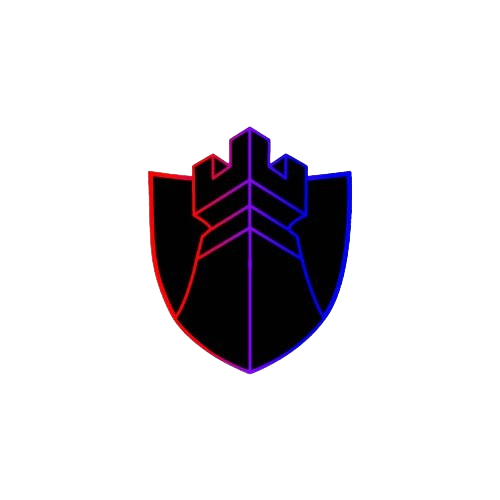

# HackTricks

<figure><figcaption></figcaption></figure>

_Hacktricks लोगो और मोशन डिज़ाइन द्वारा_ [_@ppieranacho_](https://www.instagram.com/ppieranacho/)_._

### HackTricks को स्थानीय रूप से चलाएँ
```bash
# Download latest version of hacktricks
git clone https://github.com/HackTricks-wiki/hacktricks

# Select the language you want to use
export LANG="master" # Leave master for english
# "af" for Afrikaans
# "de" for German
# "el" for Greek
# "es" for Spanish
# "fr" for French
# "hi" for HindiP
# "it" for Italian
# "ja" for Japanese
# "ko" for Korean
# "pl" for Polish
# "pt" for Portuguese
# "sr" for Serbian
# "sw" for Swahili
# "tr" for Turkish
# "uk" for Ukrainian
# "zh" for Chinese

# Run the docker container indicating the path to the hacktricks folder
docker run -d --rm --platform linux/amd64 -p 3337:3000 --name hacktricks -v $(pwd)/hacktricks:/app ghcr.io/hacktricks-wiki/hacktricks-cloud/translator-image bash -c "mkdir -p ~/.ssh && ssh-keyscan -H github.com >> ~/.ssh/known_hosts && cd /app && git config --global --add safe.directory /app && git checkout $LANG && git pull && MDBOOK_PREPROCESSOR__HACKTRICKS__ENV=dev mdbook serve --hostname 0.0.0.0"
```
Your local copy of HackTricks **[http://localhost:3337](http://localhost:3337)** पर <5 मिनट बाद उपलब्ध होगा (इसे book build करनी होती है, धैर्य रखें).

## Corporate Sponsors

### [STM Cyber](https://www.stmcyber.com)

<figure><figcaption></figcaption></figure>

[**STM Cyber**](https://www.stmcyber.com) एक बेहतरीन cybersecurity company है जिसका slogan **HACK THE UNHACKABLE** है. वे अपना research करते हैं और अपने hacking tools develop करते हैं ताकि **pentesting, Red teams और training** जैसी कई valuable cybersecurity services offer कर सकें.

आप उनका **blog** यहाँ देख सकते हैं: [**https://blog.stmcyber.com**](https://blog.stmcyber.com)

**STM Cyber** HackTricks जैसे cybersecurity open source projects को भी support करता है :)

---

### [Intigriti](https://www.intigriti.com)

<figure><figcaption></figcaption></figure>

**Intigriti** **Europe's #1** ethical hacking और **bug bounty platform** है.

**Bug bounty tip**: **Intigriti** के लिए **sign up** करें, एक premium **bug bounty platform created by hackers, for hackers**! आज ही [**https://go.intigriti.com/hacktricks**](https://go.intigriti.com/hacktricks) पर join करें, और **$100,000** तक के bounties कमाना शुरू करें!

{{#ref}}
https://go.intigriti.com/hacktricks
{{#endref}}

---

### [HACKENPROOF](https://bit.ly/3xrrDrL)

<figure><figcaption></figcaption></figure>

अनुभवी hackers और bug bounty hunters से बात करने के लिए [**HackenProof Discord**](https://discord.com/invite/N3FrSbmwdy) server से जुड़ें!

- **Hacking Insights:** hacking के रोमांच और चुनौतियों में गहराई से जाने वाली content से जुड़ें
- **Real-Time Hack News:** real-time news और insights के जरिए fast-paced hacking world के साथ up-to-date रहें
- **Latest Announcements:** नई bug bounties launch होने और जरूरी platform updates की जानकारी रखें

**[**Discord**](https://discord.com/invite/N3FrSbmwdy) पर हमसे जुड़ें और आज ही top hackers के साथ collaborate करना शुरू करें!

---

### [Modern Security – AI & Application Security Training Platform](https://modernsecurity.io/)

<figure><figcaption></figcaption></figure>

Modern Security **engineering-first, hands-on lab approach** के साथ **practical AI Security training** देता है. हमारे courses security engineers, AppSec professionals, और developers के लिए बनाए गए हैं जो **real AI/LLM-powered applications build, break, and secure** करना चाहते हैं.

**AI Security Certification** इन real-world skills पर focus करती है, जिनमें शामिल हैं:
- LLM और AI-powered applications को secure करना
- AI systems के लिए threat modeling
- Embeddings, vector databases, और RAG security
- LLM attacks, abuse scenarios, और practical defenses
- Secure design patterns और deployment considerations

सभी courses **on-demand**, **lab-driven**, और **real-world security tradeoffs** के around designed हैं, सिर्फ theory नहीं.

👉 AI Security course के बारे में अधिक जानकारी:
https://www.modernsecurity.io/courses/ai-security-certification

{{#ref}}
https://modernsecurity.io/
{{#endref}}

---

### [SerpApi](https://serpapi.com/)

<figure><figcaption></figcaption></figure>

**SerpApi** **search engine results** access करने के लिए fast और easy real-time APIs offer करता है. वे search engines scrape करते हैं, proxies handle करते हैं, captchas solve करते हैं, और आपके लिए सभी rich structured data parse करते हैं.

SerpApi के किसी plan की subscription में 50 से ज्यादा अलग-अलग APIs का access शामिल है, जो Google, Bing, Baidu, Yahoo, Yandex, और more सहित अलग-अलग search engines scraping के लिए हैं.\
अन्य providers के विपरीत, **SerpApi सिर्फ organic results scrape नहीं करता**. SerpApi responses में consistently सभी ads, inline images और videos, knowledge graphs, और search results में मौजूद अन्य elements और features शामिल होते हैं.

वर्तमान SerpApi customers में **Apple, Shopify, और GrubHub** शामिल हैं.\
अधिक जानकारी के लिए उनका [**blog**](https://serpapi.com/blog/)**,** देखें, या उनके [**playground**](https://serpapi.com/playground)**.** में एक example try करें।\
आप [**यहाँ**](https://serpapi.com/users/sign_up)**.** एक free account **create** कर सकते हैं.

---

### [8kSec Academy – In-Depth Mobile Security Courses](https://academy.8ksec.io/)

<figure><figcaption></figcaption></figure>

vulnerability research, penetration testing, और reverse engineering करने के लिए आवश्यक technologies और skills सीखें ताकि mobile applications और devices को protect किया जा सके. **Master iOS and Android security** हमारे on-demand courses के जरिए करें और **get certified**:

{{#ref}}
https://academy.8ksec.io/
{{#endref}}

---

### [WebSec](https://websec.net/)

<figure><figcaption></figcaption></figure>

[**WebSec**](https://websec.net) **Amsterdam** based एक professional cybersecurity company है जो **modern** approach के साथ **offensive-security services** प्रदान करके businesses को **all over the world** latest cybersecurity threats से **protecting** में मदद करती है.

WebSec एक intenational security company है जिसके offices Amsterdam और Wyoming में हैं. वे **all-in-one security services** offer करते हैं, यानी वे सब कुछ करते हैं; Pentesting, **Security** Audits, Awareness Trainings, Phishing Campagnes, Code Review, Exploit Development, Security Experts Outsourcing और बहुत कुछ.

WebSec की एक और अच्छी बात यह है कि industry average के विपरीत WebSec अपनी skills में **बहुत confident** है, इतनी कि वे **guarantee the best quality results** देते हैं, उनकी website पर लिखा है "**If we can't hack it, You don't pay it!**". अधिक जानकारी के लिए उनकी [**website**](https://websec.net/en/) और [**blog**](https://websec.net/blog/) देखें!

ऊपर के अलावा WebSec HackTricks का भी एक **committed supporter** है.

{{#ref}}
https://www.youtube.com/watch?v=Zq2JycGDCPM
{{#endref}}

---

### [CyberHelmets](https://cyberhelmets.com/courses/?ref=hacktricks)

<figure><figcaption></figcaption></figure>


**Built for the field. Built around you.**\
[**Cyber Helmets**](https://cyberhelmets.com/?ref=hacktricks) industry experts द्वारा built और led effective cybersecurity training develop और deliver करता है. उनके programs theory से आगे जाकर teams को deep understanding और actionable skills देते हैं, custom environments का use करके जो real-world threats को reflect करते हैं. Custom training inquiries के लिए, हमसे [**यहाँ**](https://cyberhelmets.com/tailor-made-training/?ref=hacktricks) संपर्क करें.

**What sets their training apart:**
* Custom-built content and labs
* Backed by top-tier tools and platforms
* Designed and taught by practitioners

{{#ref}}
https://cyberhelmets.com/courses/?ref=hacktricks
{{#endref}}

---

### [Last Tower Solutions](https://www.lasttowersolutions.com/)

<figure><figcaption></figcaption></figure>

Last Tower Solutions **Education** और **FinTech**
institutions के लिए specialized cybersecurity services देता है, जिसमें **penetration testing, cloud security assessments**, और
**compliance readiness** (SOC 2, PCI-DSS, NIST) पर focus है. हमारी team में **OSCP और CISSP
certified professionals** शामिल हैं, जो हर engagement में deep technical expertise और industry-standard insight लाते हैं.

हम high-stakes environments के लिए tailored **manual, intelligence-driven testing** के साथ automated scans से आगे जाते हैं. student records को secure करने से लेकर financial transactions को protect करने तक,
हम organizations को सबसे महत्वपूर्ण चीज़ों की रक्षा करने में मदद करते हैं.

_“A quality defense requires knowing the offense, we provide security through understanding.”_

हमारी [**blog**](https://www.lasttowersolutions.com/blog) पर जाकर cybersecurity की latest जानकारी के साथ up to date रहें.

{{#ref}}
https://www.lasttowersolutions.com/
{{#endref}}

---

### [K8Studio - The Smarter GUI to Manage Kubernetes.](https://k8studio.io/)

<figure><figcaption></figcaption></figure>

K8Studio IDE DevOps, DevSecOps, और developers को Kubernetes clusters efficiently manage, monitor, और secure करने में सक्षम बनाता है. हमारे AI-driven insights, advanced security framework, और intuitive CloudMaps GUI का उपयोग करके अपने clusters को visualize करें, उनकी state समझें, और confidence के साथ action लें.

इसके अलावा, K8Studio **all major kubernetes distributions** (AWS, GCP, Azure, DO, Rancher, K3s, Openshift and more) के साथ **compatible** है.

{{#ref}}
https://k8studio.io/
{{#endref}}

---

## License & Disclaimer

इन्हें यहाँ देखें:

{{#ref}}
welcome/hacktricks-values-and-faq.md
{{#endref}}

## Github Stats


{{#include ./banners/hacktricks-training.md}}
