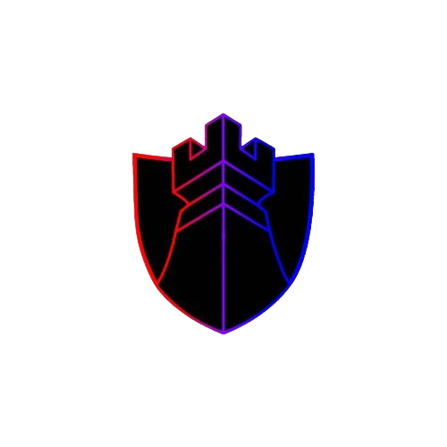

# HackTricks

<figure><figcaption></figcaption></figure>

_Hacktricks-logo's en bewegingsontwerp deur_ [_@ppieranacho_](https://www.instagram.com/ppieranacho/)_._

### Laat HackTricks plaaslik loop

```bash
# Download latest version of hacktricks
git clone https://github.com/HackTricks-wiki/hacktricks

# Select the language you want to use
export HT_LANG="master" # Leave master for English
# "af" for Afrikaans
# "de" for German
# "el" for Greek
# "es" for Spanish
# "fr" for French
# "hi" for HindiP
# "it" for Italian
# "ja" for Japanese
# "ko" for Korean
# "pl" for Polish
# "pt" for Portuguese
# "sr" for Serbian
# "sw" for Swahili
# "tr" for Turkish
# "uk" for Ukrainian
# "zh" for Chinese

# Run the docker container indicating the path to the hacktricks folder
docker run -d --rm --platform linux/amd64 -p 3337:3000 --name hacktricks -v $(pwd)/hacktricks:/app ghcr.io/hacktricks-wiki/hacktricks-cloud/translator-image bash -c "mkdir -p ~/.ssh && ssh-keyscan -H github.com >> ~/.ssh/known_hosts && cd /app && git config --global --add safe.directory /app && git checkout $HT_LANG && git pull && MDBOOK_PREPROCESSOR__HACKTRICKS__ENV=dev mdbook serve --hostname 0.0.0.0"
```

Jou plaaslike kopie van HackTricks sal **beskikbaar wees by [http://localhost:3337](http://localhost:3337)** ná <5 minute (die boek moet eers gebou word; wees geduldig).

Alternatiewelik, as jy Docker Compose het, kan jy eenvoudig die volgende vanaf die repo-wortel uitvoer:

```bash
docker compose up
```

Dit gebruik die gebundelde `docker-compose.yml` om die branch wat tans op die host uitgecheck is, by [http://localhost:3337](http://localhost:3337) met live reload te bedien. Om tale te verander wanneer jy Compose gebruik, check die verlangde taalbranch uit voordat jy die diens begin.

## HackTricks-vennote

---

## HackTricks-vriende

### [STM Cyber](https://www.stmcyber.com)

<figure class="sponsor-logo"><figcaption></figcaption></figure>

STM Cyber bied penetration testing, sekuriteitsoudits, exploit- en navorsingswerk, nutsmiddels en sekuriteitsbewustheidsdienste. Die webwerf beskryf ’n span penetration testers, programmeerders en sekuriteitsnavorsers met meer as ’n dekade se ervaring.<sup>[[1]](#references)</sup>

Jy kan hul **blog** besoek by [**https://blog.stmcyber.com**](https://blog.stmcyber.com).

**STM Cyber** ondersteun ook open source-kuberveiligheidsprojekte soos HackTricks :)

---

### [Intigriti](https://www.intigriti.com)

<figure class="sponsor-logo"><figcaption></figcaption></figure>

Intigriti is ’n crowdsourced-sekuriteitsverskaffer wat bug bounty- en penetration-testing-dienste deur ’n wêreldwye gemeenskap van navorsers aanbied. Die platform kombineer deurlopende bug bounty-dekking met PTaaS op aanvraag en bestuurde programme vir die bekendmaking van kwesbaarhede.<sup>[[2]](#references)</sup>

**Bug bounty-wenk**: Sluit by Intigriti aan via [**https://go.intigriti.com/hacktricks**](https://go.intigriti.com/hacktricks) en verken sy bug bounty-programme.

---

### [Modern Security – AI & Application Security Training Platform](https://modernsecurity.io/)

<figure class="sponsor-logo"><figcaption></figcaption></figure>

Modern Security bied selfstudie, praktiese AI-sekuriteitsopleiding vir sekuriteitsingenieurs, AppSec-professionele persone en ontwikkelaars. Sy AI Security Certification dek LLM- en agent-grondbeginsels, RAG en vektordatabasisse, threat modeling, prompt-injection- en MCP-aanvalle, en defensiewe argitektuur.<sup>[[3]](#references)</sup>

👉 Meer besonderhede oor die AI Security-kursus:  
https://www.modernsecurity.io/courses/ai-security-certification

---

### [SerpApi](https://serpapi.com/)

<figure class="sponsor-logo"><figcaption></figcaption></figure>

**SerpApi** bied API's vir Google en ander soekenjins, wat gestruktureerde SERP-data verskaf met funksies soos ligginggebaseerde resultate, Maps, Shopping en Knowledge Graph-resultate.<sup>[[4]](#references)</sup>

Vir meer inligting, besoek hul [**blog**](https://serpapi.com/blog/), probeer ’n voorbeeld in hul [**playground**](https://serpapi.com/playground), of [**skep ’n gratis rekening**](https://serpapi.com/users/sign_up).

---

### [8kSec Academy – In-Depth Mobile & AI Security Courses](https://academy.8ksec.io/)

<figure class="sponsor-logo"><figcaption></figcaption></figure>

**8kSec Academy** bied selfstudie-kursusse oor mobiele en AI-sekuriteit. Die kursuskatalogus dek ouditering en reversing van mobiele toepassings met nutsmiddels soos Ghidra, Frida en LLDB, asook AI/LLM-aanval- en verdedigingslaboratoriums.<sup>[[5]](#references)[[6]](#references)</sup>

Blaai deur die [8kSec Academy-kursuskatalogus](https://academy.8ksec.io/).

---

### [NaxusAI – AI Powered Security Scanner](https://www.naxusai.com/)

<figure class="sponsor-logo"><figcaption></figcaption></figure>

**Naxus** bemark ’n offensive-AI-platform wat kode en infrastruktuur karteer en dan statiese en dinamiese agents gebruik om uitbuitbare swakhede te vind en te valideer, met bewys van konsep en leiding oor regstelling.<sup>[[7]](#references)</sup>

**Kode-sekuriteitswenk**: Verken Naxus vir die ontdekking van kwesbaarhede in kode en infrastruktuur.

---

### [WebSec](https://websec.net/)

<figure class="sponsor-logo"><figcaption></figcaption></figure>

WebSec bied penetration testing, sekuriteitsintekeninge, personeelvoorsiening en kwesbaarheidsassesseringsdienste. Volgens sy webwerf werk die maatskappy internasionaal en dek dit offensive security, defensive security en governance, risk, and compliance-werk.<sup>[[8]](#references)</sup>

Vir meer inligting, besoek hul [**webwerf**](https://websec.net/en/) of [**blog**](https://websec.net/blog/).

Benewens bogenoemde is WebSec ook ’n **toegewyde ondersteuner van HackTricks.**

---

### [CyberHelmets](https://cyberhelmets.com/courses/?ref=hacktricks)

<figure class="sponsor-logo"><figcaption></figcaption></figure>


**Gebou vir die veld. Gebou rondom jou.**\
[**Cyber Helmets**](https://cyberhelmets.com/?ref=hacktricks) bied kuberveiligheidsopleiding onder leiding van kundiges, met pasgemaakte inhoud en laboratoriums gebaseer op werklike infrastruktuur. Die programme word aangepas vir organisatoriese behoeftes en strek van assessering tot implementering.<sup>[[9]](#references)</sup> Vir navrae oor pasgemaakte opleiding, kontak hulle [**hier**](https://cyberhelmets.com/tailor-made-training/?ref=hacktricks).

**Wat hul opleiding laat uitstaan:**
* Pasgemaakte inhoud en laboratoriums
* Ondersteun deur toonaangewende nutsmiddels en platforms
* Ontwerp en aangebied deur praktisyns

---

### [Last Tower Solutions](https://www.lasttowersolutions.com/)

<figure class="sponsor-logo"><figcaption></figcaption></figure>

Last Tower Solutions fokus op kuberveiligheidsadvies vir **onderwys** en **FinTech**, insluitend wolkassesserings, interne en eksterne penetration tests, kwesbaarheidsassesserings en nakomingsondersteuning.<sup>[[10]](#references)</sup>

Bly ingelig en op hoogte van die jongste kuberveiligheidsnuus deur ons [**blog**](https://www.lasttowersolutions.com/blog) te besoek.

---

### [K8Studio - The Smarter GUI to Manage Kubernetes.](https://k8studio.io/)

<figure class="sponsor-logo"><figcaption></figcaption></figure>

K8Studio is ’n Kubernetes-IDE vir rekenaars met CloudMaps-visualisering, multikluster-navigasie, RBAC, Helm, logs, YAML- en terminaalaansigte. Die verskaffer sê dit koppel via kubeconfig sonder om agents te installeer en ondersteun macOS, Windows, Linux en geïsoleerde clusters.<sup>[[11]](#references)</sup>

---

## Lisensie en vrywaring

Sien die HackTricks Values & FAQ-inskrywing in References hieronder.

## GitHub-statistieke


## References

- [1] [STM Cyber](https://www.stmcyber.com/)
- [2] [Intigriti](https://www.intigriti.com/)
- [3] [AI Security Certification – Modern Security](https://www.modernsecurity.io/courses/ai-security-certification)
- [4] [SerpApi](https://serpapi.com/)
- [5] [8kSec Academy](https://academy.8ksec.io/)
- [6] [Praktiese AI-sekuriteit: aanvalle, verdediging en toepassings](https://academy.8ksec.io/course/practical-ai-security)
- [7] [Naxus](https://www.naxusai.com/)
- [8] [WebSec](https://websec.net/)
- [9] [Cyber Helmets](https://cyberhelmets.com/)
- [10] [Last Tower Solutions](https://www.lasttowersolutions.com/)
- [11] [K8Studio](https://k8studio.io/)
- [12] [Intigriti HackTricks-verwysing](https://go.intigriti.com/hacktricks)
- [13] [Modern Security](https://modernsecurity.io/)
- [14] [WebSec-borgskapvideo](https://www.youtube.com/watch?v=Zq2JycGDCPM)
- [15] [Cyber Helmets-kursusse](https://cyberhelmets.com/courses/?ref=hacktricks)
- [16] [HackTricks-waardes en FAQ](welcome/hacktricks-values-and-faq.md)
{{#include banners/hacktricks-training.md}}
