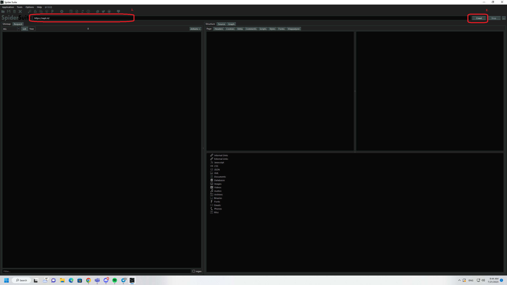
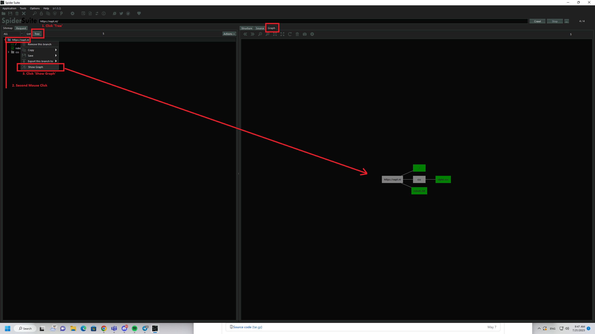
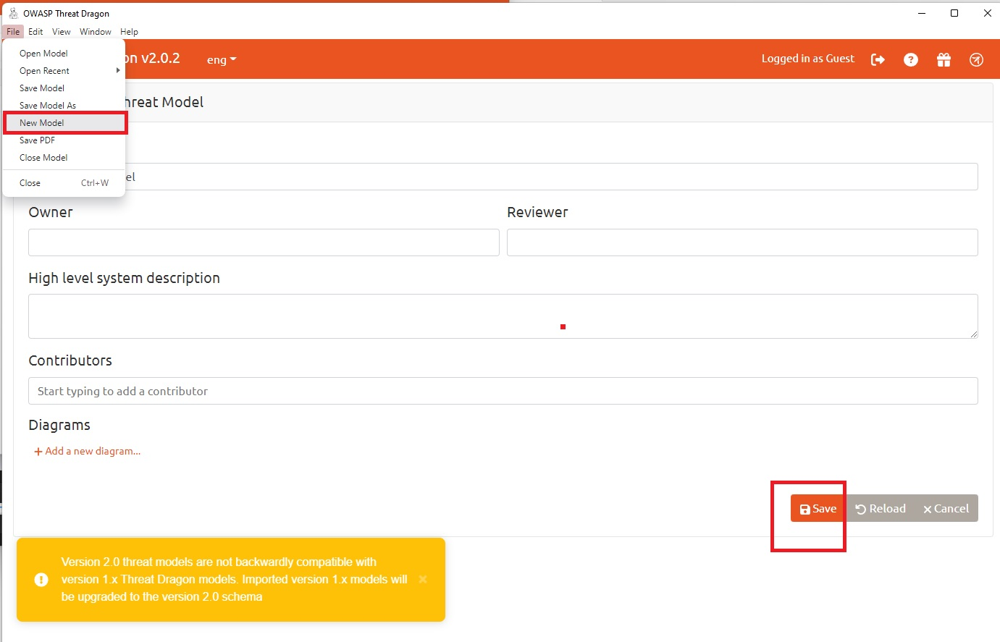
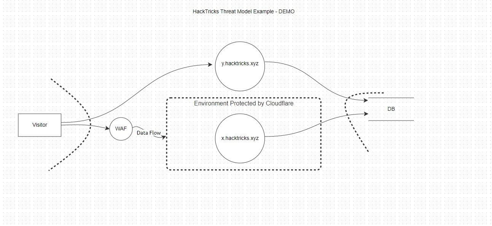

# Modelagem de Ameaças

## Modelagem de Ameaças

Bem-vindo ao guia abrangente da HackTricks sobre Modelagem de Ameaças! Embarque em uma exploração deste aspecto crítico da cibersegurança, onde identificamos, entendemos e planejamos contra vulnerabilidades potenciais em um sistema. Este tópico serve como um guia passo a passo repleto de exemplos do mundo real, softwares úteis e explicações fáceis de entender. Ideal tanto para novatos quanto para profissionais experientes que buscam fortalecer suas defesas de cibersegurança.

### Cenários Comumente Usados

1. **Desenvolvimento de Software**: Como parte do Ciclo de Vida de Desenvolvimento de Software Seguro (SSDLC), a modelagem de ameaças ajuda na **identificação de fontes potenciais de vulnerabilidades** nas fases iniciais de desenvolvimento.
2. **Teste de Penetração**: O padrão de execução de teste de penetração (PTES) exige **modelagem de ameaças para entender as vulnerabilidades do sistema** antes de realizar o teste.

### Modelo de Ameaça em Resumo

Um Modelo de Ameaça é tipicamente representado como um diagrama, imagem ou alguma outra forma de ilustração visual que retrata a arquitetura planejada ou a construção existente de uma aplicação. Ele se assemelha a um **diagrama de fluxo de dados**, mas a principal distinção reside em seu design orientado à segurança.

Modelos de ameaças frequentemente apresentam elementos marcados em vermelho, simbolizando vulnerabilidades, riscos ou barreiras potenciais. Para simplificar o processo de identificação de riscos, o triângulo CIA (Confidencialidade, Integridade, Disponibilidade) é empregado, formando a base de muitas metodologias de modelagem de ameaças, sendo o STRIDE uma das mais comuns. No entanto, a metodologia escolhida pode variar dependendo do contexto e requisitos específicos.

### O Triângulo CIA

O Triângulo CIA é um modelo amplamente reconhecido no campo da segurança da informação, representando Confidencialidade, Integridade e Disponibilidade. Esses três pilares formam a base sobre a qual muitas medidas e políticas de segurança são construídas, incluindo metodologias de modelagem de ameaças.

1. **Confidencialidade**: Garantir que os dados ou sistemas não sejam acessados por indivíduos não autorizados. Este é um aspecto central da segurança, exigindo controles de acesso apropriados, criptografia e outras medidas para prevenir vazamentos de dados.
2. **Integridade**: A precisão, consistência e confiabilidade dos dados ao longo de seu ciclo de vida. Este princípio garante que os dados não sejam alterados ou manipulados por partes não autorizadas. Frequentemente envolve somas de verificação, hashing e outros métodos de verificação de dados.
3. **Disponibilidade**: Isso garante que dados e serviços estejam acessíveis a usuários autorizados quando necessário. Isso frequentemente envolve redundância, tolerância a falhas e configurações de alta disponibilidade para manter os sistemas funcionando mesmo diante de interrupções.

### Metodologias de Modelagem de Ameaças

1. **STRIDE**: Desenvolvido pela Microsoft, STRIDE é um acrônimo para **Spoofing, Tampering, Repudiation, Information Disclosure, Denial of Service, and Elevation of Privilege**. Cada categoria representa um tipo de ameaça, e essa metodologia é comumente usada na fase de design de um programa ou sistema para identificar ameaças potenciais.
2. **DREAD**: Esta é outra metodologia da Microsoft usada para avaliação de riscos de ameaças identificadas. DREAD significa **Damage potential, Reproducibility, Exploitability, Affected users, and Discoverability**. Cada um desses fatores é pontuado, e o resultado é usado para priorizar as ameaças identificadas.
3. **PASTA** (Process for Attack Simulation and Threat Analysis): Esta é uma metodologia de sete etapas, **centrada em riscos**. Inclui a definição e identificação de objetivos de segurança, criação de um escopo técnico, decomposição da aplicação, análise de ameaças, análise de vulnerabilidades e avaliação de risco/triagem.
4. **Trike**: Esta é uma metodologia baseada em riscos que se concentra na defesa de ativos. Começa de uma perspectiva de **gestão de riscos** e analisa ameaças e vulnerabilidades nesse contexto.
5. **VAST** (Visual, Agile, and Simple Threat modeling): Esta abordagem visa ser mais acessível e se integra a ambientes de desenvolvimento ágil. Combina elementos de outras metodologias e foca em **representações visuais de ameaças**.
6. **OCTAVE** (Operationally Critical Threat, Asset, and Vulnerability Evaluation): Desenvolvido pelo CERT Coordination Center, este framework é voltado para **avaliação de riscos organizacionais em vez de sistemas ou softwares específicos**.

## Ferramentas

Existem várias ferramentas e soluções de software disponíveis que podem **ajudar** na criação e gerenciamento de modelos de ameaças. Aqui estão algumas que você pode considerar.

### [SpiderSuite](https://github.com/3nock/SpiderSuite)

Uma avançada GUI de web spider/crawler multiplataforma e multifuncional para profissionais de cibersegurança. Spider Suite pode ser usado para mapeamento e análise da superfície de ataque.

**Uso**

1. Escolha uma URL e Rasteje

<figure><figcaption></figcaption></figure>

2. Visualize o Gráfico

<figure><figcaption></figcaption></figure>

### [OWASP Threat Dragon](https://github.com/OWASP/threat-dragon/releases)

Um projeto de código aberto da OWASP, Threat Dragon é tanto uma aplicação web quanto de desktop que inclui diagramação de sistemas, bem como um mecanismo de regras para gerar automaticamente ameaças/mitigações.

**Uso**

1. Crie um Novo Projeto

<figure><figcaption></figcaption></figure>

Às vezes, pode parecer assim:

<figure><figcaption></figcaption></figure>

2. Inicie um Novo Projeto

<figure><figcaption></figcaption></figure>

3. Salve o Novo Projeto

<figure><figcaption></figcaption></figure>

4. Crie seu modelo

Você pode usar ferramentas como SpiderSuite Crawler para se inspirar, um modelo básico poderia parecer algo assim

<figure><figcaption></figcaption></figure>

Apenas um pouco de explicação sobre as entidades:

- Processo (A entidade em si, como Servidor Web ou funcionalidade web)
- Ator (Uma Pessoa, como um Visitante do Site, Usuário ou Administrador)
- Linha de Fluxo de Dados (Indicador de Interação)
- Limite de Confiança (Diferentes segmentos ou escopos de rede.)
- Armazenar (Coisas onde os dados são armazenados, como Bancos de Dados)

5. Crie uma Ameaça (Passo 1)

Primeiro, você deve escolher a camada à qual deseja adicionar uma ameaça

<figure><figcaption></figcaption></figure>

Agora você pode criar a ameaça

<figure><figcaption></figcaption></figure>

Lembre-se de que há uma diferença entre Ameaças de Ator e Ameaças de Processo. Se você adicionar uma ameaça a um Ator, então você só poderá escolher "Spoofing" e "Repudiation". No entanto, em nosso exemplo, adicionamos uma ameaça a uma entidade de Processo, então veremos isso na caixa de criação de ameaças:

<figure><figcaption></figcaption></figure>

6. Pronto

Agora seu modelo finalizado deve parecer algo assim. E é assim que você faz um modelo de ameaça simples com o OWASP Threat Dragon.

<figure><figcaption></figcaption></figure>

### [Microsoft Threat Modeling Tool](https://aka.ms/threatmodelingtool)

Esta é uma ferramenta gratuita da Microsoft que ajuda a encontrar ameaças na fase de design de projetos de software. Ela utiliza a metodologia STRIDE e é particularmente adequada para aqueles que desenvolvem na pilha da Microsoft.
