# Threat Modeling

{{#include ../banners/hacktricks-training.md}}

Welcome to HackTricks' comprehensive guide on Threat Modeling! Embark on an exploration of this critical aspect of cybersecurity, where we identify, understand, and strategize against potential vulnerabilities in a system. This thread serves as a step-by-step guide packed with real-world examples, helpful software, and easy-to-understand explanations. Ideal for both novices and experienced practitioners looking to fortify their cybersecurity defenses.

### Commonly Used Scenarios

1. **Software Development**: As part of the Secure Software Development Life Cycle (SSDLC), threat modeling helps in **identifying potential sources of vulnerabilities** in the early stages of development.[[1]](#references)[[4]](#references)
2. **Penetration Testing**: The Penetration Testing Execution Standard (PTES) treats threat modeling as required for correct execution and calls for documenting business assets, business processes, threat communities, and their capabilities.[[2]](#references)

### Threat Model in a Nutshell

A threat model is typically represented as a diagram, image, or other visual illustration of a planned architecture or existing application. Data-flow diagrams (DFDs) are a common way to model a system and its interactions, while threat modeling adds a security-focused analysis.[[1]](#references)

In Microsoft's Threat Modeling Tool, red dotted lines indicate trust boundaries; other tools may use different visual conventions.[[4]](#references) To streamline risk identification, teams may use the CIA (Confidentiality, Integrity, Availability) triad or STRIDE threat categories, but the appropriate methodology depends on the project's context and requirements.[[1]](#references)[[3]](#references)[[10]](#references)

### The CIA Triad

The CIA Triad is a widely recognized information-security model standing for Confidentiality, Integrity, and Availability. These properties are commonly used to describe security goals for data and systems.[[3]](#references)

1. **Confidentiality**: Ensuring that the data or system is not accessed by unauthorized individuals. This is a central aspect of security, requiring appropriate access controls, encryption, and other measures to prevent data breaches.
2. **Integrity**: The accuracy, consistency, and trustworthiness of the data over its lifecycle. This principle ensures that the data is not altered or tampered with by unauthorized parties. It often involves checksums, hashing, and other data verification methods.
3. **Availability**: This ensures that data and services are accessible to authorized users when needed. This often involves redundancy, fault tolerance, and high-availability configurations to keep systems running even in the face of disruptions.

### Threat Modeling Methodologies

1. **STRIDE**: Microsoft's STRIDE approach categorizes software threats as **Spoofing, Tampering, Repudiation, Information Disclosure, Denial of Service, and Elevation of Privilege**. These categories help analysts identify possible threats at each vulnerable point in a design.[[5]](#references)
2. **DREAD**: This Microsoft assessment approach scores threats using **Damage, Reproducibility, Exploitability, Affected users, and Discoverability**. The resulting score can help prioritize threats for mitigation.[[5]](#references)
3. **PASTA** (Process for Attack Simulation and Threat Analysis): This is a seven-stage, **risk-centric** methodology covering objectives, technical scope, application decomposition, threat analysis, vulnerability and weakness analysis, attack modeling, and risk/impact analysis.[[8]](#references)
4. **Trike**: This security-audit framework approaches threat modeling from a **risk-management** and defensive perspective.[[9]](#references)
5. **VAST** (Visual, Agile, and Simple Threat modeling): This method emphasizes scalable, usable threat models for application and operational views and can integrate with development and DevOps lifecycles.[[10]](#references)
6. **OCTAVE** (Operationally Critical Threat, Asset, and Vulnerability Evaluation): Created by the CERT Division of Carnegie Mellon's Software Engineering Institute, OCTAVE is a risk-based strategic assessment and planning method focused on organizational risk rather than technology alone.[[10]](#references)

## Tools

There are several tools and software solutions available that can **assist** with the creation and management of threat models. Here are a few you might consider.

### [SpiderSuite](https://github.com/3nock/SpiderSuite)

SpiderSuite is a cross-platform web crawler for security professionals that supports attack-surface mapping, endpoint discovery, and web-application analysis.[[6]](#references)

**Usage**

1. Pick a URL and Crawl

<figure>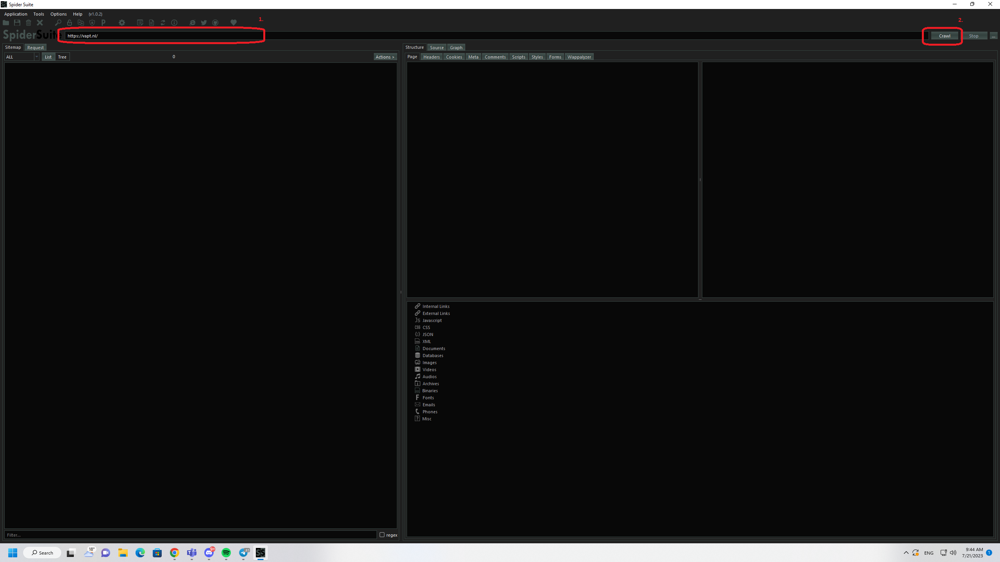<figcaption></figcaption></figure>

2. View Graph

<figure>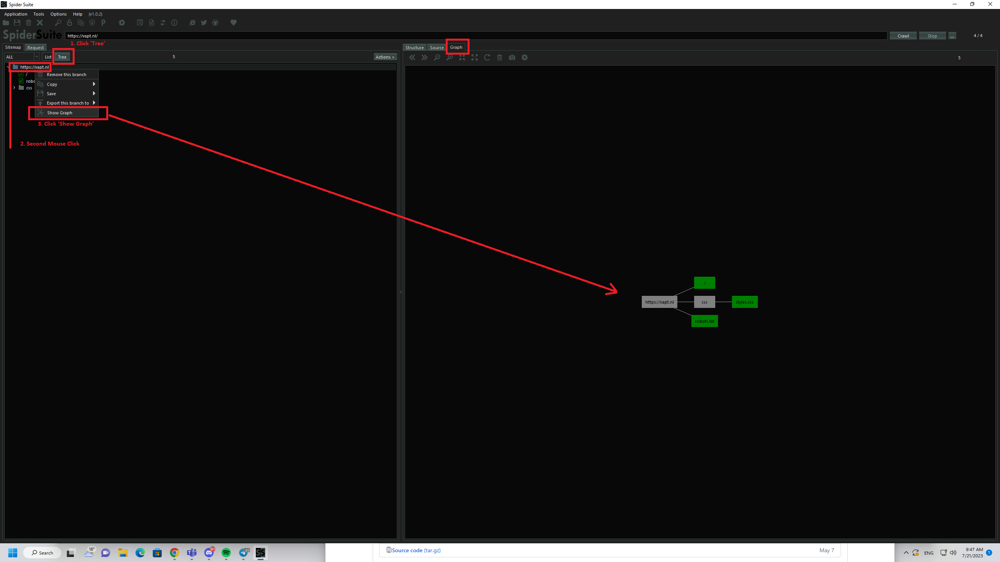<figcaption></figcaption></figure>

### [OWASP Threat Dragon](https://github.com/OWASP/threat-dragon/releases)

OWASP Threat Dragon is a free, open-source, cross-platform threat-modeling application for drawing diagrams, suggesting threats, and recording mitigations. It is available as web and desktop applications.[[7]](#references)

**Usage**

1. Create New Project

<figure>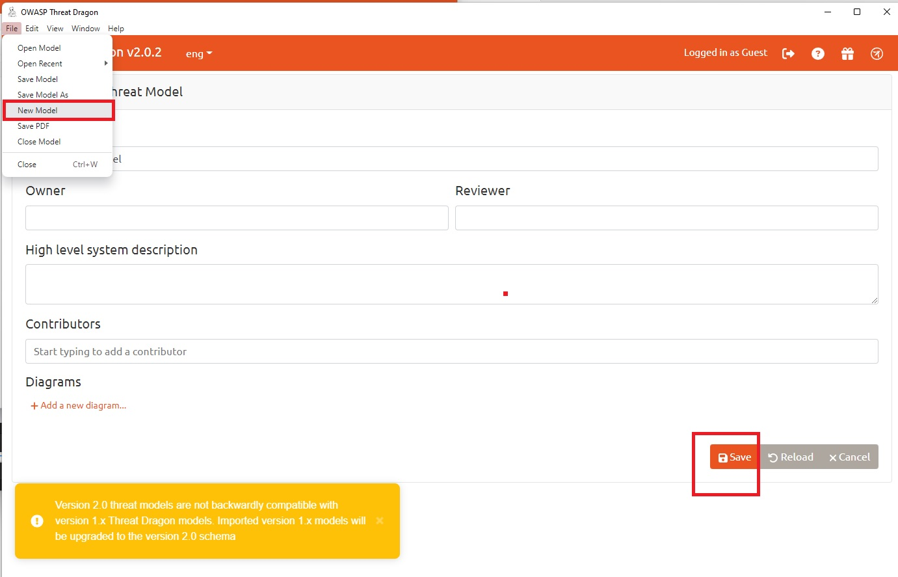<figcaption></figcaption></figure>

Sometimes it could look like this:

<figure>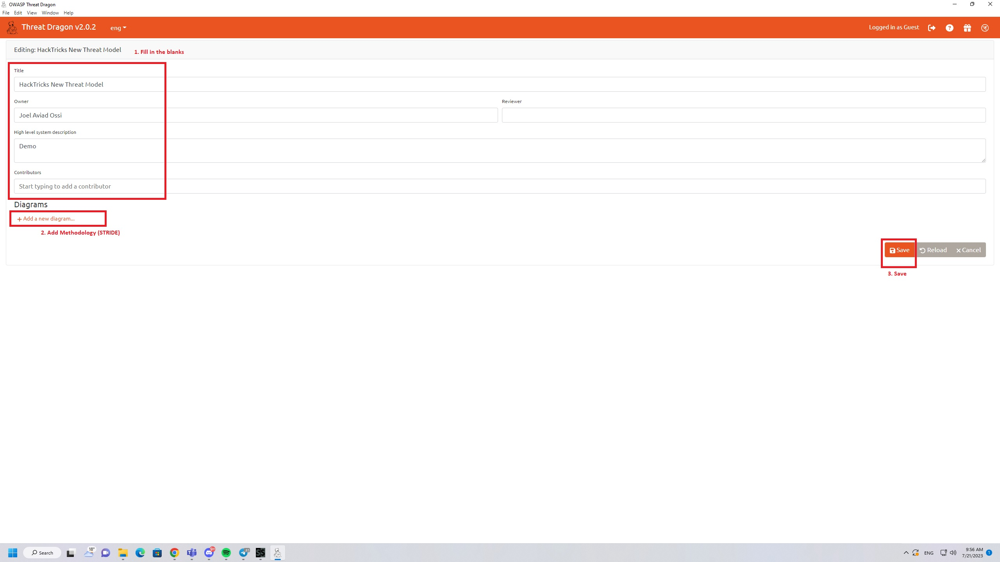<figcaption></figcaption></figure>

2. Launch New Project

<figure>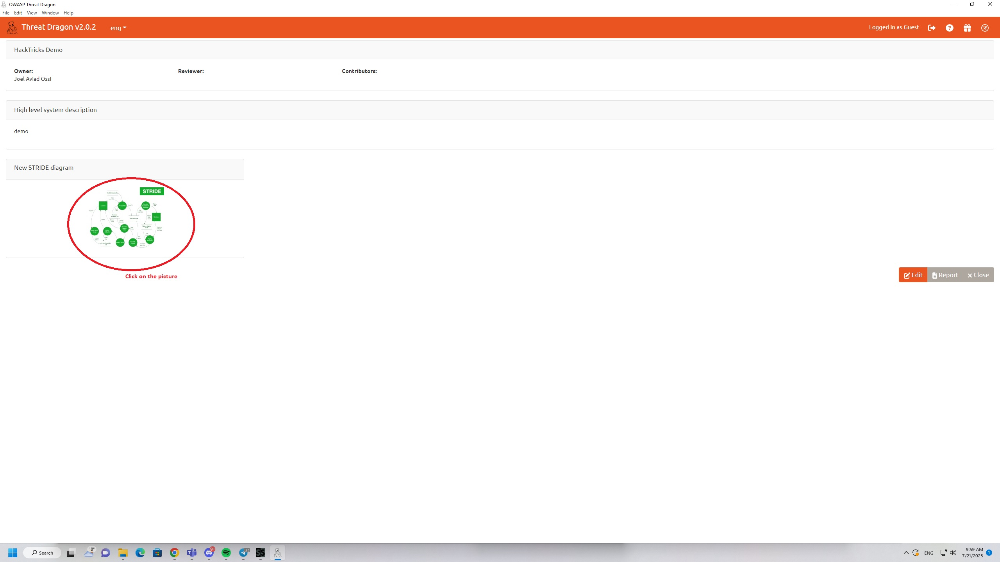<figcaption></figcaption></figure>

3. Save The New Project

<figure>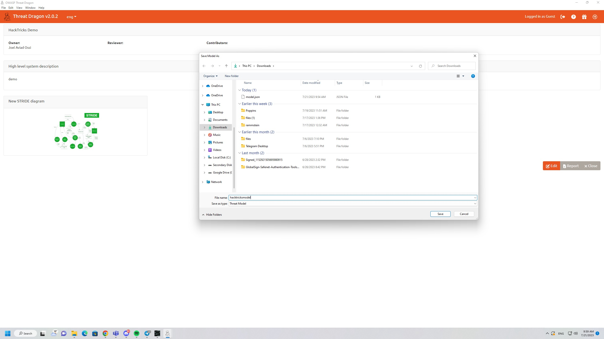<figcaption></figcaption></figure>

4. Create your model

You can use tools like SpiderSuite Crawler to give you inspiration, a basic model would look something like this

<figure>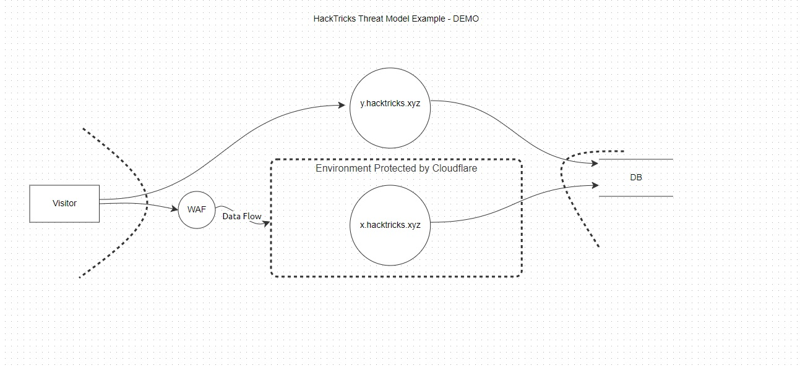<figcaption></figcaption></figure>

Just a little bit of explanation about the entities:

- Process (The entity itself such as Webserver or web functionality)
- Actor (A Person such as a Website Visitor, User or Administrator)
- Data Flow Line (Indicator of Interaction)
- Trust Boundary (Different network segments or scopes.)
- Store (Things where data are stored at such as Databases)

5. Create a Threat (Step 1)

First you have to pick the layer you wish to add a threat to

<figure>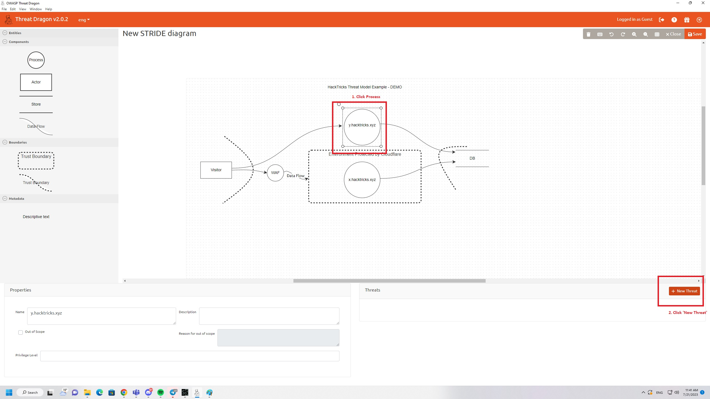<figcaption></figcaption></figure>

Now you can create the threat

<figure>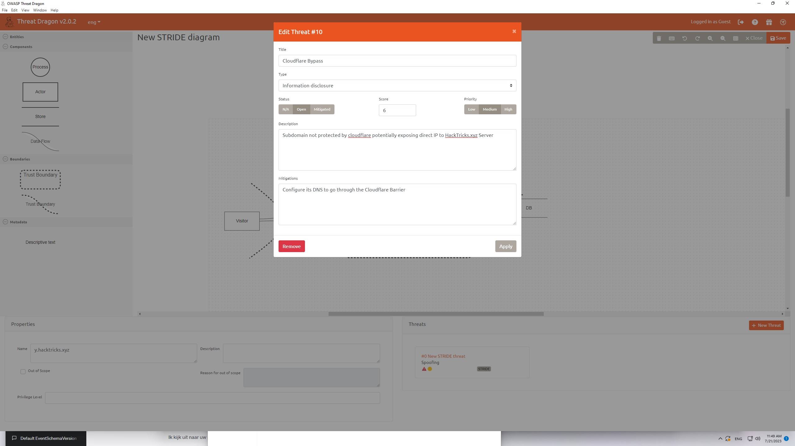<figcaption></figcaption></figure>

Keep in mind that there is a difference between Actor Threats and Process Threats. If you would add a threat to an Actor then you will only be able to choose "Spoofing" and "Repudiation. However in our example we add threat to a Process entity so we will see this in the threat creation box:

<figure>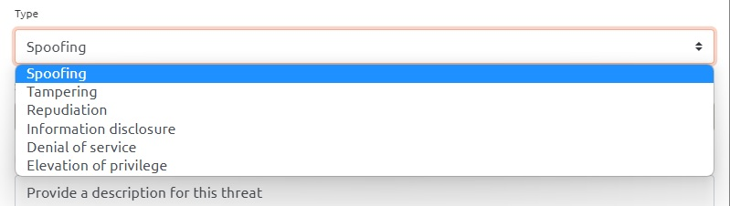<figcaption></figcaption></figure>

6. Done

Now your finished model should look something like this. And this is how you make a simple threat model with OWASP Threat Dragon.

<figure>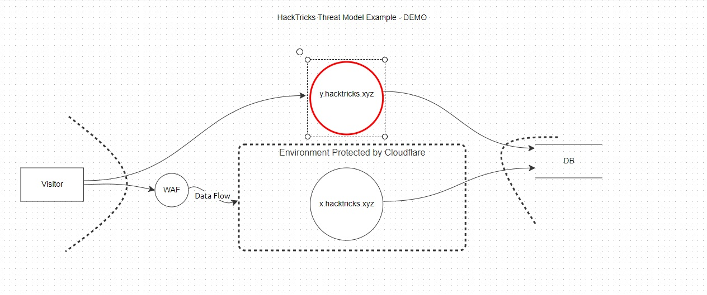<figcaption></figcaption></figure>

### [Microsoft Threat Modeling Tool](https://aka.ms/threatmodelingtool)

Microsoft's Threat Modeling Tool is a free downloadable tool for software design analysis. Its workflow creates a diagram, identifies threats, and supports mitigation and validation using the STRIDE approach.[[4]](#references)

## References

- [1] [Threat Modeling Cheat Sheet](https://cheatsheetseries.owasp.org/cheatsheets/Threat_Modeling_Cheat_Sheet.html)
- [2] [Threat Modeling - The Penetration Testing Execution Standard](https://www.pentest-standard.org/index.php/Threat_Modeling)
- [3] [Security fundamentals - OWASP Developer Guide](https://devguide.owasp.org/en/02-foundations/01-security-fundamentals/)
- [4] [Getting Started with the Microsoft Threat Modeling Tool](https://learn.microsoft.com/en-us/azure/security/develop/threat-modeling-tool-getting-started)
- [5] [Threat Modeling for Drivers - Windows drivers](https://learn.microsoft.com/en-us/windows-hardware/drivers/driversecurity/threat-modeling-for-drivers)
- [6] [SpiderSuite](https://spidersuite.io/)
- [7] [OWASP Threat Dragon](https://github.com/OWASP/threat-dragon)
- [8] [PASTA Threat Modeling: The 7 Stages Explained](https://versprite.com/cybersecurity-listings/devsecops/pasta-threat-modeling/)
- [9] [Trike v1 Methodology Document](https://trike.sourceforge.net/papers/Trike_v1_Methodology_Document-draft.pdf)
- [10] [Threat Modeling: A Summary of Available Methods](https://www.sei.cmu.edu/documents/569/2018_019_001_524597.pdf)

{{#include ../banners/hacktricks-training.md}}
