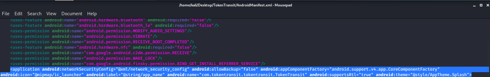

{{#include ../../banners/hacktricks-training.md}}

Niektóre aplikacje nie akceptują certyfikatów pobranych przez użytkownika, więc aby przeanalizować ruch sieciowy dla niektórych aplikacji, musimy dekompilować aplikację, dodać kilka rzeczy i ponownie ją skompilować.

# Automatycznie

Narzędzie [**https://github.com/shroudedcode/apk-mitm**](https://github.com/shroudedcode/apk-mitm) **automatycznie** wprowadzi niezbędne zmiany w aplikacji, aby rozpocząć przechwytywanie żądań i wyłączy również pinning certyfikatów (jeśli występuje).

# Ręcznie

Najpierw dekompilujemy aplikację: `apktool d *file-name*.apk`


Następnie przechodzimy do pliku **Manifest.xml** i przewijamy w dół do tagu `<\application android>` i dodajemy następującą linię, jeśli jeszcze jej tam nie ma:

`android:networkSecurityConfig="@xml/network_security_config"`

Przed dodaniem:


Po dodaniu:



Teraz przejdź do folderu **res/xml** i utwórz/zmodyfikuj plik o nazwie network_security_config.xml z następującą zawartością:
```markup
<network-security-config>
<base-config>
<trust-anchors>
<!-- Trust preinstalled CAs -->
<certificates src="system" />
<!-- Additionally trust user added CAs -->
<certificates src="user" />
</trust-anchors>
</base-config>
</network-security-config>
```
Następnie zapisz plik i wyjdź ze wszystkich katalogów, a następnie zbuduj apk za pomocą następującego polecenia: `apktool b *folder-name/* -o *output-file.apk*`


Na koniec musisz po prostu **podpisać nową aplikację**. [Przeczytaj tę sekcję strony Smali - Decompiling/\[Modifying\]/Compiling, aby dowiedzieć się, jak ją podpisać](smali-changes.md#sing-the-new-apk).

{{#include ../../banners/hacktricks-training.md}}
