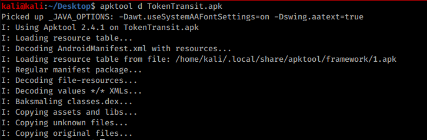
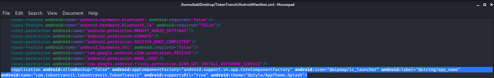
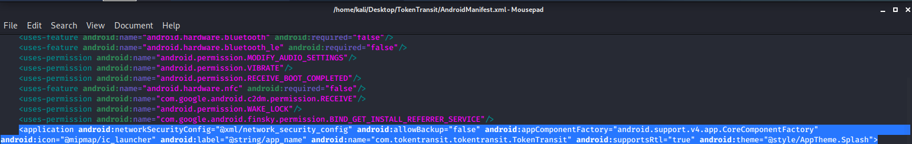
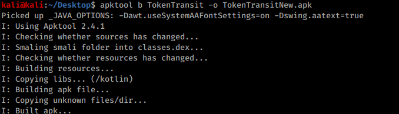

# APK'nin User CA Certificate'a Güvenmesini Sağlama

{{#include ../../banners/hacktricks-training.md}}

Android uygulamaları, güvendikleri certificate authority'leri kısıtlayabilir. Yetkili bir test ortamında, HTTPS traffic inspection işlemini mümkün kılmak için bir APK'yi, kullanıcı tarafından yüklenen CA'lere güvenen bir Network Security Configuration ile yeniden paketleyebilirsiniz. Bu işlem, uygulamanın başka bir bölümünde uygulanan certificate pinning'i otomatik olarak bypass etmez.<sup>[[1]](#references)</sup>

## Automatic

[`apk-mitm`](https://github.com/shroudedcode/apk-mitm), HTTPS inspection için APK patch işlemini otomatikleştirir ve yaygın certificate-pinning implementasyonları için çeşitli patch'ler içerir.<sup>[[2]](#references)</sup>

## Manual

APK'yi decompile edin:
```bash
apktool d app.apk
```


`AndroidManifest.xml` dosyasında, zaten ayarlanmamışsa `<application>` öğesine aşağıdaki attribute'u ekleyin:<sup>[[1]](#references)</sup>

`android:networkSecurityConfig="@xml/network_security_config"`

Eklenmeden önce:



Eklendikten sonra:



`res/xml/network_security_config.xml` dosyasını aşağıdaki içerikle oluşturun veya güncelleyin. `system` source'u önceden yüklenmiş trust anchor'larını korurken, `user` kullanıcı tarafından yüklenmiş CA'leri ekler:<sup>[[1]](#references)</sup>
```html
<network-security-config>
<base-config>
<trust-anchors>
<!-- Trust preinstalled CAs -->
<certificates src="system" />
<!-- Additionally trust user-added CAs -->
<certificates src="user" />
</trust-anchors>
</base-config>
</network-security-config>
```
APK'yi yeniden derleyin:
```bash
apktool b app -o patched.apk
```


Yeniden paketleme, orijinal imzayı geçersiz kılar; bu nedenle yeniden oluşturulan APK'yi yüklemeden önce imzalayın. [APK signing bölümüne bakın](smali-changes.md#sign-the-new-apk).

## References

- [1] [Android Developers - Network Security Configuration](https://developer.android.com/privacy-and-security/security-config)
- [2] [apk-mitm - Android APK dosyalarını HTTPS inspection için hazırlama](https://github.com/shroudedcode/apk-mitm)
{{#include ../../banners/hacktricks-training.md}}
