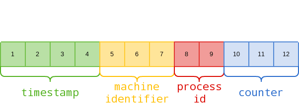

# 27017,27018 - Pentesting MongoDB

{{#include ../banners/hacktricks-training.md}}

## Basic Information

**MongoDB** is an open-source, document-oriented database. A normal `mongod` or `mongos` listener defaults to TCP **27017**, a shard server defaults to **27018**, and a config server defaults to **27019**.<sup>[[7]](#references)</sup>

```
PORT      STATE SERVICE VERSION
27017/tcp open  mongodb MongoDB 2.6.9 2.6.9
```

## Enumeration

### Manual

```python
from pymongo import MongoClient
client = MongoClient(host, port, username=username, password=password)
client.server_info() #Basic info
#If you have admin access you can obtain more info
admin = client.admin
admin_info = admin.command("serverStatus")
cursor = client.list_databases()
for db in cursor:
    print(db)
    print(client[db["name"]].list_collection_names())
#If admin access, you could dump the database also
```

**Some MongoDB commands:**

```bash
show dbs
use <db>
show collections
db.<collection>.find()  #Dump the collection
db.<collection>.count() #Number of records of the collection
db.current.find({"username":"admin"})  #Find in current db the username admin
```

### Automatic

```bash
nmap -sV --script "mongo* and default" -p 27017 <IP> #By default all the nmap mongo enumerate scripts are used
```

### Shodan

- All mongodb: `"mongodb server information"`
- Search for full open mongodb servers: `"mongodb server information" -"partially enabled"`
- Only partially enable auth: `"mongodb server information" "partially enabled"`

## Login

Self-managed MongoDB defaults to `security.authorization: disabled`, but it also defaults to binding only to localhost. An externally reachable listener without authorization is therefore a dangerous configuration, not a safe Internet-facing default.<sup>[[7]](#references)</sup> The `admin` database is the usual authentication database for administrative users.

```bash
mongo <HOST>
mongo <HOST>:<PORT>
mongo <HOST>:<PORT>/<DB>
mongo <database> -u <username> -p '<password>'
```

The nmap script: _**mongodb-brute**_ will check if creds are needed.

```bash
nmap -n -sV --script mongodb-brute -p 27017 <ip>
```

### [**Brute force**](../generic-hacking/brute-force.md#mongo)

Look inside _/opt/bitnami/mongodb/mongodb.conf_ to know if credentials are needed:

```bash
grep "noauth.*true" /opt/bitnami/mongodb/mongodb.conf | grep -v "^#" #Not needed
grep "auth.*true" /opt/bitnami/mongodb/mongodb.conf | grep -v "^#\|noauth" #Not needed
```

## Mongo Objectid Predict

Example [from here](https://techkranti.com/idor-through-mongodb-object-ids-prediction/).<sup>[[1]](#references)</sup>

MongoDB ObjectIds are **12-byte values**, conventionally displayed as 24 hexadecimal characters:<sup>[[8]](#references)</sup>



For example, here’s how we can dissect an actual Object ID returned by an application: 5f2459ac9fa6dc2500314019

1. `5f2459ac`: a 4-byte Unix timestamp (`1596217772`, Friday, 31 July 2020 17:49:32 UTC)
2. `9fa6dc2500`: a 5-byte random value generated once per client-side process
3. `314019`: a 3-byte counter initialized to a random value

Older ObjectId layouts exposed separate machine and process identifiers; the current specification replaced those fields with one per-process random value. The timestamp changes once per second and the counter increments within a process, so IDs observed from the same generator in a narrow time window can still be partially predictable. This is not universal: drivers generate ObjectIds client-side, different processes use different random values, and applications may choose unrelated `_id` values.<sup>[[1]](#references)[[8]](#references)</sup>

Given an observed ObjectId, `mongo-objectid-predict` generates nearby candidates for authorization testing.<sup>[[9]](#references)</sup> Treat this as a targeted IDOR test rather than a general ObjectId breaker: it is most effective when the target IDs share the timestamp, process-random component, and adjacent counter values.

The upstream command exposes `--counter-diff` (how many adjacent counter values to explore), `--per-counter` (how many timestamp offsets to try for each counter), and `--backward` (generate earlier rather than later candidates). Its defaults are `20` and `60`, producing roughly a thousand candidates; expand them only after establishing that a smaller authorized sample shares the generator component.<sup>[[9]](#references)</sup>

```bash
./mongo-objectid-predict 5ae9b90a2c144b9def01ec37
./mongo-objectid-predict 5ae9b90a2c144b9def01ec37 --counter-diff 50 --per-counter 120
./mongo-objectid-predict 5ae9b90a2c144b9def01ec37 --backward
```

The repository currently contains Python 2-era code and describes the older machine-ID/process-ID terminology. Review or port it before use, and do not mistake generated candidates for evidence that a resource exists or that access is authorized.

## Post

With authorized root access to a self-managed host, you can audit the effective configuration and, in a disposable recovery lab, start a local-only instance with authorization disabled. Current YAML configuration uses `security.authorization: disabled`; legacy `noauth = true` examples apply to old configuration formats. Do not expose that recovery listener beyond loopback.<sup>[[7]](#references)</sup>

## MongoBleed zlib Memory Disclosure (CVE-2025-14847)

A widespread unauthenticated memory disclosure ("MongoBleed") impacts MongoDB 3.6–8.2 when the **zlib network compressor is enabled**. The `OP_COMPRESSED` header trusts an attacker-supplied `uncompressedSize`, so the server allocates a buffer of that size and copies it back into responses even though only a much smaller compressed payload was provided. The extra bytes are **uninitialized heap data** from other connections, `/proc`, or the WiredTiger cache. Attackers then omit the expected **BSON `\x00` terminator** so MongoDB’s parser keeps scanning that oversized buffer until it finds a terminator, and the error response echoes both the malicious document and the scanned heap bytes **pre-auth** on TCP/27017.<sup>[[2]](#references)</sup>

### Exposure requirements & quick checks

- Server version must be within the vulnerable ranges (3.6, 4.0, 4.2, 4.4.0–4.4.29, 5.0.0–5.0.31, 6.0.0–6.0.26, 7.0.0–7.0.27, 8.0.0–8.0.16, 8.2.0–8.2.2).<sup>[[6]](#references)</sup>
- `net.compression.compressors` or `networkMessageCompressors` must include `zlib` (default on many builds). Check it from the shell with:

```javascript
db.adminCommand({getParameter: 1, networkMessageCompressors: 1})
```

- The attacker only needs network access to the MongoDB port. No authentication is necessary.<sup>[[3]](#references)[[4]](#references)</sup>

### Exploitation & harvesting workflow

1. Initiate the wire-protocol handshake advertising `compressors:["zlib"]` so the session uses zlib.
2. Send `OP_COMPRESSED` frames whose declared `uncompressedSize` is far larger than the real decompressed payload to force **oversized heap allocation full of old data**.
3. Craft the embedded BSON **without a final `\x00`** so the parser walks past attacker-controlled data into the oversized buffer while looking for a terminator.
4. MongoDB emits an error that includes the original message plus whatever heap bytes were scanned, leaking memory. Repeat with varying lengths/offsets to aggregate secrets (creds/API keys/session tokens), WiredTiger stats, and `/proc` artifacts.<sup>[[2]](#references)</sup>

The public PoC automates the probing offsets and carving of the returned fragments:<sup>[[5]](#references)</sup>

```bash
python3 mongobleed.py --host <target> --max-offset 50000 --output leaks.bin
```

### Detection noise signal (high-rate connections)

The attack usually generates many short-lived requests. Watch for spikes of inbound connections to `mongod`/`mongod.exe`. Example XQL hunt (>500 connections/min per remote IP, excluding RFC1918/loopback/link-local/mcast/broadcast/reserved ranges by default):<sup>[[2]](#references)</sup>

<details>
<summary>Cortex XQL high-velocity Mongo connections</summary>

```sql
// High-velocity inbound connections to mongod/mongod.exe (possible MongoBleed probing)

dataset = xdr_data
| filter event_type = ENUM.NETWORK
| filter lowercase(actor_process_image_name) in ("mongod", "mongod.exe")
| filter action_network_is_server = true
| filter action_remote_ip not in (null, "")
| filter incidr(action_remote_ip, "10.0.0.0/8") != true and
        incidr(action_remote_ip, "192.168.0.0/16") != true and
        incidr(action_remote_ip, "172.16.0.0/12") != true and
        incidr(action_remote_ip, "127.0.0.0/8") != true and
        incidr(action_remote_ip, "169.254.0.0/16") != true and
        incidr(action_remote_ip, "224.0.0.0/4") != true and
        incidr(action_remote_ip, "255.255.255.255/32") != true and
        incidr(action_remote_ip, "198.18.0.0/15") != true
| filter action_network_session_duration <= 5000
| bin _time span = 1m
| comp count(_time) as Counter by agent_hostname, action_remote_ip, _time
| filter Counter >= 500
```

</details>


## References

- [1] [IDOR through MongoDB Object IDs prediction](https://techkranti.com/idor-through-mongodb-object-ids-prediction/)
- [2] [Unit 42 – Threat Brief: MongoDB Vulnerability (CVE-2025-14847)](https://unit42.paloaltonetworks.com/mongobleed-cve-2025-14847/)
- [3] [Tenable – CVE-2025-14847 (MongoBleed): MongoDB Memory Leak Vulnerability Exploited in the Wild](https://www.tenable.com/blog/cve-2025-14847-mongobleed-mongodb-memory-leak-vulnerability-exploited-in-the-wild)
- [4] [MongoDB Security Advisory SERVER-115508](https://jira.mongodb.org/browse/SERVER-115508)
- [5] [MongoBleed PoC (joe-desimone/mongobleed)](https://github.com/joe-desimone/mongobleed)
- [6] [Censys – MongoBleed Advisory](https://censys.com/advisory/cve-2025-14847)
- [7] [MongoDB Manual - Self-Managed Configuration File Options](https://www.mongodb.com/docs/manual/reference/configuration-options/)
- [8] [MongoDB Manual - ObjectId BSON type](https://www.mongodb.com/docs/manual/reference/bson-types/#objectid)
- [9] [andresriancho/mongo-objectid-predict](https://github.com/andresriancho/mongo-objectid-predict)

---

{{#include ../banners/hacktricks-training.md}}
