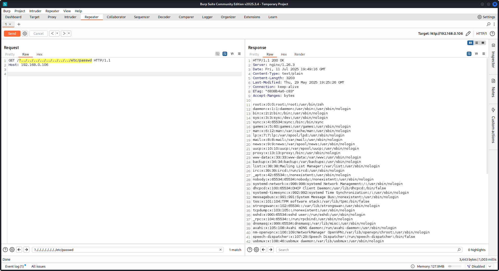

# Nginx

{{#include ../../banners/hacktricks-training.md}}


## Eksik root konumu <a href="#missing-root-location" id="missing-root-location"></a>

Nginx sunucusunu yapılandırırken, **root directive** sunulan dosyaların temel dizinini tanımlayarak kritik bir rol oynar. Aşağıdaki örneği dikkate alın:
```bash
server {
root /etc/nginx;

location /hello.txt {
try_files $uri $uri/ =404;
proxy_pass http://127.0.0.1:8080/;
}
}
```
Bu yapılandırmada `/etc/nginx` kök dizin olarak belirtilmiştir. Bu düzenleme, `/hello.txt` gibi belirtilen kök dizin içindeki dosyalara erişime izin verir. Ancak yalnızca belirli bir konum (`/hello.txt`) tanımlandığını belirtmek önemlidir. Root konumu için (`location / {...}`) herhangi bir yapılandırma yoktur. Bu eksiklik, `root` direktifinin global olarak uygulanması anlamına gelir; böylece kök yolu `/` için yapılan istekler `/etc/nginx` altındaki dosyalara erişebilir.

Bu yapılandırmadan önemli bir güvenlik riski doğar. Basit bir `GET` isteği, örneğin `GET /nginx.conf`, `/etc/nginx/nginx.conf` konumundaki Nginx yapılandırma dosyasını sunarak hassas bilgileri açığa çıkarabilir. `root`'u `/etc` gibi daha az hassas bir dizine ayarlamak bu riski azaltabilir; ancak bu yine de diğer yapılandırma dosyalarına, access logs'a ve hatta HTTP basic authentication için kullanılan şifrelenmiş kimlik bilgilerine istem dışı erişime izin verebilir.

## Alias LFI Yanlış Yapılandırması <a href="#alias-lfi-misconfiguration" id="alias-lfi-misconfiguration"></a>

Nginx'in yapılandırma dosyalarında "location" direktifleri yakından incelenmelidir. Local File Inclusion (LFI) olarak bilinen bir zafiyet, aşağıdakine benzer bir yapılandırma aracılığıyla istemeden tanıtılabilir:
```
location /imgs {
alias /path/images/;
}
```
Bu yapılandırma, sunucunun `/imgs../flag.txt` gibi istekleri amaçlanan dizinin dışındaki dosyalara erişim girişimi olarak yorumlaması nedeniyle LFI attacks'e açıktır; etkin olarak `/path/images/../flag.txt` olarak çözülür. Bu zafiyet, saldırganların web üzerinden erişilememesi gereken sunucunun dosya sisteminden dosya almalarına izin verir.

Bu zafiyeti azaltmak için yapılandırma şu şekilde düzenlenmelidir:
```
location /imgs/ {
alias /path/images/;
}
```
Daha fazla bilgi: [https://www.acunetix.com/vulnerabilities/web/path-traversal-via-misconfigured-nginx-alias/](https://www.acunetix.com/vulnerabilities/web/path-traversal-via-misconfigured-nginx-alias/)

Accunetix testleri:
```
alias../ => HTTP status code 403
alias.../ => HTTP status code 404
alias../../ => HTTP status code 403
alias../../../../../../../../../../../ => HTTP status code 400
alias../ => HTTP status code 403
```
## Güvenli olmayan yol kısıtlaması <a href="#unsafe-variable-use" id="unsafe-variable-use"></a>

Aşağıdaki sayfayı, şu tür direktifleri nasıl bypass edeceğinizi öğrenmek için inceleyin:
```plaintext
location = /admin {
deny all;
}

location = /admin/ {
deny all;
}
```
{{#ref}}
../../pentesting-web/proxy-waf-protections-bypass.md
{{#endref}}

## Güvensiz değişken kullanımı / HTTP Request Splitting <a href="#unsafe-variable-use" id="unsafe-variable-use"></a>

> [!CAUTION]
> Zafiyetli değişkenler `$uri` ve `$document_ur`i olup bu, bunları `$request_uri` ile değiştirmekle düzeltilebilir.
>
> Aşağıdaki gibi bir regex de zafiyetli olabilir:
>
> `location ~ /docs/([^/])? { … $1 … }` - Zafiyetli
>
> `location ~ /docs/([^/\s])? { … $1 … }` - Zafiyetli değil (boşlukları kontrol ederek)
>
> `location ~ /docs/(.*)? { … $1 … }` - Zafiyetli değıl

Aşağıdaki örnek, Nginx konfigürasyonundaki bir zafiyeti göstermektedir:
```
location / {
return 302 https://example.com$uri;
}
```
HTTP isteklerinde \r (Carriage Return) ve \n (Line Feed) karakterleri yeni satır karakterlerini belirtir; URL kodlu halleri `%0d%0a` olarak gösterilir. Bu karakterleri bir isteğe (ör. `http://localhost/%0d%0aDetectify:%20clrf`) dahil etmek, yanlış yapılandırılmış bir sunucuya gönderildiğinde sunucunun `Detectify` adlı yeni bir header üretmesine neden olur. Bunun nedeni $uri değişkeninin URL kodlu yeni satır karakterlerini decode etmesidir; bu da yanıtta beklenmeyen bir header ile sonuçlanır:
```
HTTP/1.1 302 Moved Temporarily
Server: nginx/1.19.3
Content-Type: text/html
Content-Length: 145
Connection: keep-alive
Location: https://example.com/
Detectify: clrf
```
Learn more about the risks of CRLF injection and response splitting at [https://blog.detectify.com/2019/06/14/http-response-splitting-exploitations-and-mitigations/](https://blog.detectify.com/2019/06/14/http-response-splitting-exploitations-and-mitigations/).

Ayrıca bu teknik [**bu konuşmada anlatılıyor**](https://www.youtube.com/watch?v=gWQyWdZbdoY&list=PL0xCSYnG_iTtJe2V6PQqamBF73n7-f1Nr&index=77) ve bazı zafiyetli örnekler ile tespit mekanizmaları gösteriliyor. Örneğin, bu yanlış yapılandırmayı blackbox perspektifinden tespit etmek için şu istekleri yapabilirsiniz:

- `https://example.com/%20X` - Any HTTP code
- `https://example.com/%20H` - 400 Bad Request

Eğer zafiyetliyse, ilki "X" herhangi bir HTTP metodu olduğu için dönecek ve ikincisi H geçerli bir metod olmadığı için hata döndürecektir. Böylece sunucu şu şekilde bir şey alır: `GET / H HTTP/1.1` ve bu hata tetikler.

Başka tespit örnekleri:

- `http://company.tld/%20HTTP/1.1%0D%0AXXXX:%20x` - Any HTTP code
- `http://company.tld/%20HTTP/1.1%0D%0AHost:%20x` - 400 Bad Request

O konuşmada sunulan bazı zafiyetli yapılandırmalar şunlardı:

- Final URL'de **`$uri`**'nin olduğu gibi ayarlandığına dikkat edin
```
location ^~ /lite/api/ {
proxy_pass http://lite-backend$uri$is_args$args;
}
```
- Yine **`$uri`**'nin URL'de olduğunu unutmayın (bu sefer bir parametre içinde)
```
location ~ ^/dna/payment {
rewrite ^/dna/([^/]+) /registered/main.pl?cmd=unifiedPayment&context=$1&native_uri=$uri break;
proxy_pass http://$back;
```
- Şimdi AWS S3'te
```
location /s3/ {
proxy_pass https://company-bucket.s3.amazonaws.com$uri;
}
```
### Herhangi bir değişken

Belirlendi ki **kullanıcı tarafından sağlanan veri** belirli koşullar altında bir **Nginx değişkeni** olarak işlenebilir. Bu davranışın nedeni tam olarak anlaşılabilmiş değil; nadir olmamakla birlikte doğrulaması kolay değil. Bu anomali HackerOne'daki bir güvenlik raporunda vurgulandı, raporu [here](https://hackerone.com/reports/370094) görüntüleyebilirsiniz. Hata mesajının daha fazla incelenmesi, bunun Nginx kod tabanının [SSI filter module of Nginx's codebase](https://github.com/nginx/nginx/blob/2187586207e1465d289ae64cedc829719a048a39/src/http/modules/ngx_http_ssi_filter_module.c#L365) içinde gerçekleştiğini gösterdi ve sebep olarak Server Side Includes (SSI) belirlendi.

Bu **yanlış yapılandırmayı tespit etmek** için, değişken yazdırmayı test etmek amacıyla bir referer header'ı ayarlamayı içeren aşağıdaki komut çalıştırılabilir:
```bash
$ curl -H ‘Referer: bar’ http://localhost/foo$http_referer | grep ‘foobar’
```
Sistemler çapında bu yanlış yapılandırma için yapılan taramalar, kullanıcıların Nginx değişkenlerini yazdırabildiği birden çok örnek ortaya çıkardı. Ancak, savunmasız örnek sayısındaki azalma, bu sorunu yamalama çabalarının kısmen başarılı olduğunu gösteriyor.

### $URI$ARGS değişkenleri ile try_files kullanımı

Aşağıdaki Nginx yanlış yapılandırması bir LFI açığına yol açabilir:
```
location / {
try_files $uri$args $uri$args/ /index.html;
}
```
Yapılandırmamızda belirtilen sırayla dosyaların varlığını kontrol etmek için kullanılan `try_files` yönergesi bulunur. Nginx, bulduğu ilk dosyayı sunar. `try_files` yönergesinin temel sözdizimi şu şekildedir:
```
try_files file1 file2 ... fileN fallback;
```
Nginx, belirtilen sırayla her dosyanın varlığını kontrol eder. Bir dosya mevcutsa, hemen sunulur. Belirtilen dosyalardan hiçbiri yoksa, istek başka bir URI veya belirli bir hata sayfası olabilecek fallback seçeneğine iletilir.

Ancak, bu yönergede `$uri$args` değişkenleri kullanıldığında, Nginx istek URI'si ile herhangi bir query string argümanının birleşimiyle eşleşen bir dosyayı aramaya çalışır. Bu nedenle bu yapılandırmayı suistimal edebiliriz:
```
http {
server {
root /var/www/html/public;

location / {
try_files $uri$args $uri$args/ /index.html;
}
}
}
```
Aşağıdaki payload ile:
```
GET /?../../../../../../../../etc/passwd HTTP/1.1
Host: example.com
```
Payload'ımızı kullanarak Nginx konfigürasyonunda tanımlı root dizininden kaçıp `/etc/passwd` dosyasını yükleyeceğiz. Debug logs'ta Nginx'in dosyaları nasıl denediğini gözlemleyebiliriz:
```
...SNIP...

2025/07/11 15:49:16 [debug] 79694#79694: *4 trying to use file: "/../../../../../../../../etc/passwd" "/var/www/html/public/../../../../../../../../etc/passwd"
2025/07/11 15:49:16 [debug] 79694#79694: *4 try file uri: "/../../../../../../../../etc/passwd"

...SNIP...

2025/07/11 15:49:16 [debug] 79694#79694: *4 http filename: "/var/www/html/public/../../../../../../../../etc/passwd"

...SNIP...

2025/07/11 15:49:16 [debug] 79694#79694: *4 HTTP/1.1 200 OK

```
PoC againts Nginx using the configuration mentioned above:


## Backend'in ham yanıtının okunması

Nginx, `proxy_pass` aracılığıyla backend tarafından üretilen hataları ve HTTP başlıklarını yakalayarak iç hata mesajlarını ve başlıkları gizlemeyi amaçlayan bir özellik sunar. Bu, Nginx'in backend hatalarına yanıt olarak özel hata sayfaları sunmasıyla gerçekleştirilir. Ancak Nginx geçersiz bir HTTP isteğiyle karşılaştığında problemler ortaya çıkar. Bu tür bir istek alındığı gibi backend'e iletilir ve backend'in ham yanıtı Nginx müdahalesi olmadan doğrudan istemciye gönderilir.

uWSGI uygulamasını içeren bir örnek senaryoyu düşünün:
```python
def application(environ, start_response):
start_response('500 Error', [('Content-Type', 'text/html'), ('Secret-Header', 'secret-info')])
return [b"Secret info, should not be visible!"]
```
Bunu yönetmek için Nginx yapılandırmasında belirli direktifler kullanılır:
```
http {
error_page 500 /html/error.html;
proxy_intercept_errors on;
proxy_hide_header Secret-Header;
}
```
- [**proxy_intercept_errors**](http://nginx.org/en/docs/http/ngx_http_proxy_module.html#proxy_intercept_errors): Bu direktif, arka uçtan dönen ve durum kodu 300'den büyük olan yanıtlar için Nginx'in özel bir yanıt sunmasını sağlar. Örneğin uWSGI uygulamamızda bir `500 Error` yanıtının Nginx tarafından yakalanıp işlenmesini temin eder.
- [**proxy_hide_header**](http://nginx.org/en/docs/http/ngx_http_proxy_module.html#proxy_hide_header): Adından da anlaşılacağı gibi, bu direktif belirtilen HTTP başlıklarını istemciden gizleyerek gizliliği ve güvenliği artırır.

Geçerli bir `GET` isteği yapıldığında, Nginx bunu normal şekilde işler ve hiçbir gizli başlığı açığa çıkarmadan standart bir hata yanıtı döner. Ancak geçersiz bir HTTP isteği bu mekanizmayı atlatır ve gizli başlıklar ve hata mesajları dahil olmak üzere ham arka uç yanıtlarının ifşasına yol açar.

## merge_slashes kapalı (off) olarak ayarlanması

Varsayılan olarak, Nginx'in **`merge_slashes` directive**i **`on`** olarak ayarlanmıştır; bu, bir URL'deki birden fazla eğik çizgiyi tek bir eğik çizgiye sıkıştırır. Bu özellik URL işlemesini düzene sokarken, özellikle local file inclusion (LFI) saldırılarına yatkın uygulamalarda, Nginx arkasındaki uygulamalardaki zafiyetleri istemeden gizleyebilir. Güvenlik uzmanları **Danny Robinson ve Rotem Bar** bu varsayılan davranışla ilişkili potansiyel riskleri, özellikle Nginx reverse-proxy olarak davrandığında, vurgulamıştır.

Böyle riskleri hafifletmek için, bu zafiyetlere açık uygulamalar için **`merge_slashes` directive`ini off yapmak** önerilir. Bu, Nginx'in URL yapısını değiştirmeden istekleri uygulamaya iletmesini sağlar ve böylece herhangi bir alttaki güvenlik sorununu gizlemez.

Daha fazla bilgi için bakınız [Danny Robinson and Rotem Bar](https://medium.com/appsflyer/nginx-may-be-protecting-your-applications-from-traversal-attacks-without-you-even-knowing-b08f882fd43d).

### **Maclicious Yanıt Başlıkları**

Bu [**yazıda**](https://mizu.re/post/cors-playground) gösterildiği gibi, web sunucusundan gelen yanıtta bulunmaları halinde Nginx proxy'nin davranışını değiştirecek belirli başlıklar vardır. Bunları [**dokümanlarda**](https://www.nginx.com/resources/wiki/start/topics/examples/x-accel/) kontrol edebilirsiniz:

- `X-Accel-Redirect`: Nginx'e bir isteği belirtilen bir konuma dahili olarak yönlendirmesini belirtir.
- `X-Accel-Buffering`: Nginx'in yanıtı bufferlayıp bufferlamayacağını kontrol eder.
- `X-Accel-Charset`: X-Accel-Redirect kullanıldığında yanıt için karakter setini ayarlar.
- `X-Accel-Expires`: X-Accel-Redirect kullanıldığında yanıtın sona erme süresini ayarlar.
- `X-Accel-Limit-Rate`: X-Accel-Redirect kullanıldığında yanıtların transfer hızını sınırlar.

Örneğin, başlık **`X-Accel-Redirect`** nginx içinde bir dahili yönlendirmeye (redirect) sebep olur. Bu yüzden `root /` gibi bir nginx konfigürasyonu ve web sunucusundan gelen **`X-Accel-Redirect: .env`** yanıtı, nginx'in **`/.env`** içeriğini göndermesine (Path Traversal) yol açar.

### **Map Directive'te Varsayılan Değer**

Nginx konfigürasyonunda, `map` directive genellikle **yetkilendirme kontrolü** rolü oynar. Yaygın bir hata **varsayılan** bir değer belirtmemektir; bu, yetkisiz erişime yol açabilir. Örneğin:
```yaml
http {
map $uri $mappocallow {
/map-poc/private 0;
/map-poc/secret 0;
/map-poc/public 1;
}
}
```

```yaml
server {
location /map-poc {
if ($mappocallow = 0) {return 403;}
return 200 "Hello. It is private area: $mappocallow";
}
}
```
Without a `default`, a **kötü niyetli kullanıcı** `/map-poc` içinde **tanımsız bir URI**'ye erişerek güvenliği atlatabilir. [The Nginx manual](https://nginx.org/en/docs/http/ngx_http_map_module.html) bu tür sorunları önlemek için bir **varsayılan değer** belirlenmesini tavsiye eder.

### **DNS Spoofing Zafiyeti**

DNS spoofing, belirli koşullar altında Nginx'e karşı mümkün olabilir. Eğer bir saldırgan Nginx tarafından kullanılan **DNS sunucusunu** biliyor ve DNS sorgularını yakalayabiliyorsa, DNS kayıtlarını sahteleyebilir. Ancak bu yöntem, Nginx DNS çözümlemesi için **localhost (127.0.0.1)** kullanacak şekilde yapılandırılmışsa etkisizdir. Nginx bir DNS sunucusunu aşağıdaki şekilde belirlemeye izin verir:
```yaml
resolver 8.8.8.8;
```
### **`proxy_pass` ve `internal` Yönergeleri**

**`proxy_pass`** yönergesi, isteği dahili veya harici olarak diğer sunuculara yönlendirmek için kullanılır. **`internal`** yönergesi belirli konumların yalnızca Nginx içinde erişilebilir olmasını sağlar. Bu yönergeler tek başlarına birer zafiyet olmasalar da, yanlış yapılandırılmaları güvenlik açıklarına yol açmaması için dikkatle incelenmelidir.

## proxy_set_header Upgrade & Connection

Eğer nginx sunucusu Upgrade ve Connection header'larını iletecek şekilde yapılandırıldıysa, korunmuş/internal endpoints'e erişmek için bir [**h2c Smuggling attack**](../../pentesting-web/h2c-smuggling.md) gerçekleştirilebilir.

> [!CAUTION]
> Bu zafiyet, bir saldırganın `proxy_pass` endpoint'i (`http://backend:9999` bu örnekte) ile **doğrudan bir bağlantı kurmasına** izin verir; bu endpoint'in içeriği nginx tarafından kontrol edilmeyecektir.

Example of vulnerable configuration to steal `/flag` from [here](https://bishopfox.com/blog/h2c-smuggling-request):
```
server {
listen       443 ssl;
server_name  localhost;

ssl_certificate       /usr/local/nginx/conf/cert.pem;
ssl_certificate_key   /usr/local/nginx/conf/privkey.pem;

location / {
proxy_pass http://backend:9999;
proxy_http_version 1.1;
proxy_set_header Upgrade $http_upgrade;
proxy_set_header Connection $http_connection;
}

location /flag {
deny all;
}
```
> [!WARNING]
> `proxy_pass` belirli bir **yol** örneğin `http://backend:9999/socket.io` gösteriyor olsa bile bağlantı `http://backend:9999` ile kurulacaktır; bu yüzden o dahili endpoint içinde herhangi bir başka yola **erişebilirsiniz. Yani proxy_pass URL'sinde bir yol belirtilmiş olması önemli değildir.**

## HTTP/3 QUIC modülü uzaktan DoS & leak (2024)

2024 yılı boyunca Nginx, CVE-2024-31079, CVE-2024-32760, CVE-2024-34161 ve CVE-2024-35200 bildirimlerini yayınladı; bu bildirimler, deneysel `ngx_http_v3_module` derlendiğinde ve bir `listen ... quic` soketi açıldığında tek bir **kötü niyetli QUIC oturumunun** worker süreçlerini çökertebileceğini veya bellek leak'ine yol açabileceğini gösteriyor. Etkilenen build'ler 1.25.0–1.25.5 ve 1.26.0 iken, 1.27.0/1.26.1 düzeltmeleri içerir; bellek açıklığı (CVE-2024-34161) ayrıca hassas verilerin yüzeye çıkması için 4096 bayttan büyük MTU'lar gerektirir (ayrıntılar aşağıda referans verilen 2024 nginx advisory'sinde).

**Keşif ve istismar ipuçları**

- HTTP/3 isteğe bağlıdır, bu yüzden `Alt-Svc: h3=":443"` yanıtları için tarama yapın veya UDP/443 QUIC handshake'lerini brute-force edin; doğruladıktan sonra, worker çöküşlerini tetiklemek ve log leakage'i zorlamak için handshake ve STREAM frame'lerini custom `quiche-client`/`nghttp3` payload'larıyla fuzz'layın.
- Hedef desteğini hızlıca fingerprint ile tespit edin:
```bash
nginx -V 2>&1 | grep -i http_v3
rg -n "listen .*quic" /etc/nginx/
```
## TLS oturum yeniden kullanımı ile client cert auth atlatma (CVE-2025-23419)

2025 Şubatında yayımlanan bir advisory, OpenSSL ile derlenmiş nginx 1.11.4–1.27.3'ün bir name-based virtual host'tan başka bir host içine **TLS 1.3 oturumunu yeniden kullanmasına** izin verdiğini ortaya koydu; böylece sertifikasız bir host ile müzakere eden bir client, ticket/PSK'i yeniden oynatarak `ssl_verify_client on;` ile korunan bir vhost'a atlayabilir ve mTLS'i tamamen atlayabilir. Hata, birden fazla virtual host aynı TLS 1.3 session cache ve tickets'ı paylaştığında tetiklenir (aşağıda referans verilen 2025 nginx advisory'ye bakın).

**Saldırgan playbook**
```bash
# 1. Create a TLS session on the public vhost and save the session ticket
openssl s_client -connect public.example.com:443 -sess_out ticket.pem

# 2. Replay that session ticket against the mTLS vhost before it expires
openssl s_client -connect admin.example.com:443 -sess_in ticket.pem -ign_eof
```
Hedef savunmasız ise, ikinci handshake istemci sertifikası sunulmadan tamamlanır ve korunan konumlar açığa çıkar.

**Denetlenmesi gerekenler**

- Farklı `server_name` bloklarının `ssl_session_cache shared:SSL` ile birlikte `ssl_session_tickets on;` paylaşması.
- mTLS bekleyen, ancak paylaşılan `ssl_session_cache`/`ssl_session_tickets` ayarlarını public host'lardan devralan Admin/API blokları.
- Vhost izolasyonunu dikkate almadan TLS 1.3 session resumption'u genel olarak etkinleştiren otomasyon (ör. Ansible rolleri).

## HTTP/2 Rapid Reset resilience (CVE-2023-44487 behavior)

HTTP/2 Rapid Reset saldırısı (CVE-2023-44487) operatörler `keepalive_requests` veya `http2_max_concurrent_streams` değerlerini varsayılanların üzerine çıkardığında nginx'i etkilemeye devam eder: bir saldırgan tek bir HTTP/2 bağlantısı açar, bunu binlerce stream ile doldurur ve hemen `RST_STREAM` frame'leri gönderir; böylece eşzamanlılık tavanına hiç ulaşılmazken CPU teardown mantığında tükenmeye devam eder. Nginx varsayılanları (128 concurrent streams, 1000 keepalive requests) patlama etkisini küçük tutar; bu limitleri "önemli ölçüde" yükseltmek tek bir istemciden bile worker'ları aç bırakmayı kolaylaştırır (aşağıda referans verilen F5 write-up'ına bakın).

**Tespit ipuçları**
```bash
# Highlight risky knobs
rg -n "http2_max_concurrent_streams" /etc/nginx/
rg -n "keepalive_requests" /etc/nginx/
```
Bu direktifler için alışılmadık derecede yüksek değerler ortaya çıkaran hostlar birinci derecede hedeftir: tek bir HTTP/2 istemcisi, stream oluşturma ve anında `RST_STREAM` frame'leri gönderme döngüsüne girerek concurrency cap'i tetiklemeden CPU'yu meşgul tutabilir.

## Kendiniz deneyin

Detectify, bu makalede tartışılan bazı yanlış yapılandırmaları içeren kendi savunmasız Nginx test sunucunuzu Docker kullanarak kurabileceğiniz ve bunları kendiniz bulmayı deneyebileceğiniz bir GitHub repository oluşturdu!

[https://github.com/detectify/vulnerable-nginx](https://github.com/detectify/vulnerable-nginx)

## Statik Analiz araçları

### [GixyNG](https://github.com/megamansec/gixyng) & [GIXY](https://github.com/yandex/gixy)

GixyNG (GIXY'nin güncellenmiş bir fork'u) Nginx konfigürasyonlarını analiz etmek için bir araçtır; amacı vulnerabilities, insecure directives ve riskli yanlış yapılandırmaları bulmaktır. Ayrıca performansı etkileyen yanlış yapılandırmaları tespit eder ve kaçırılmış hardening fırsatlarını belirleyerek otomatik flaw detection'a olanak tanır.

### [Nginxpwner](https://github.com/stark0de/nginxpwner)

Nginxpwner, yaygın Nginx yanlış yapılandırmalarını ve vulnerabilities'ı arayan basit bir araçtır.

## Referanslar

- [**https://blog.detectify.com/2020/11/10/common-nginx-misconfigurations/**](https://blog.detectify.com/2020/11/10/common-nginx-misconfigurations/)
- [**http://blog.zorinaq.com/nginx-resolver-vulns/**](http://blog.zorinaq.com/nginx-resolver-vulns/)
- [**https://github.com/yandex/gixy/issues/115**](https://github.com/yandex/gixy/issues/115)
- [**https://mailman.nginx.org/pipermail/nginx-announce/2024/GWH2WZDVCOC2A5X67GKIMJM4YRELTR77.html**](https://mailman.nginx.org/pipermail/nginx-announce/2024/GWH2WZDVCOC2A5X67GKIMJM4YRELTR77.html)
- [**https://mailman.nginx.org/pipermail/nginx-announce/2025/NYEUJX7NCBCGJGXDFVXNMAAMJDFSE45G.html**](https://mailman.nginx.org/pipermail/nginx-announce/2025/NYEUJX7NCBCGJGXDFVXNMAAMJDFSE45G.html)
- [**https://www.f5.com/company/blog/nginx/http-2-rapid-reset-attack-impacting-f5-nginx-products**](https://www.f5.com/company/blog/nginx/http-2-rapid-reset-attack-impacting-f5-nginx-products)


{{#include ../../banners/hacktricks-training.md}}
